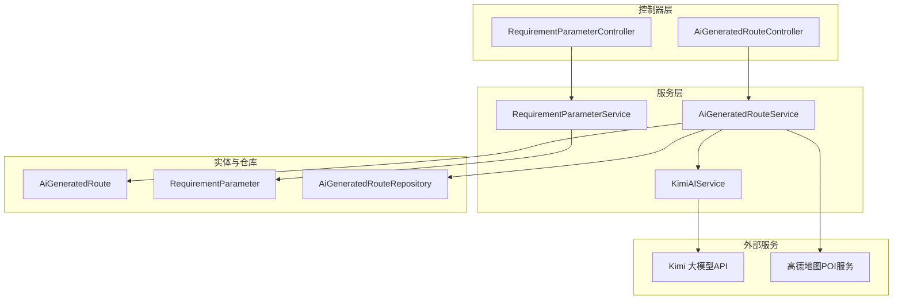
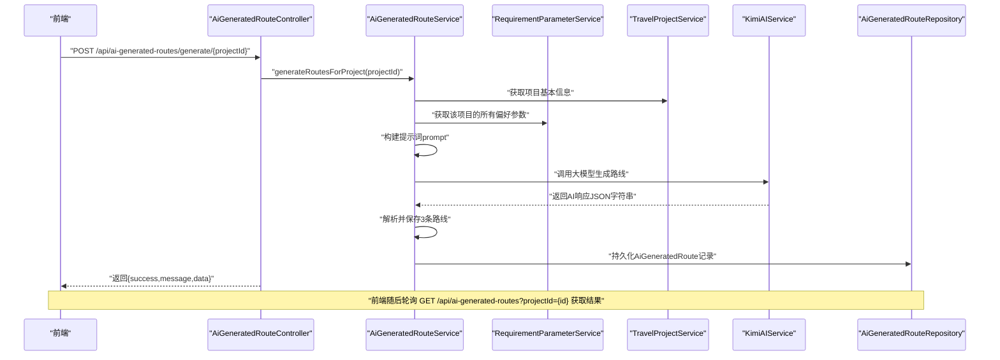
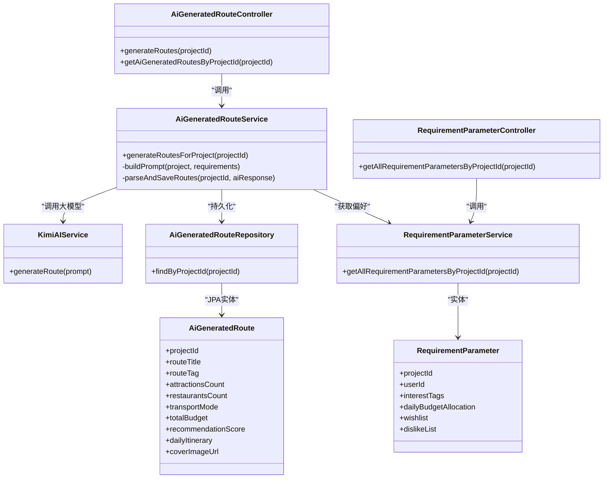
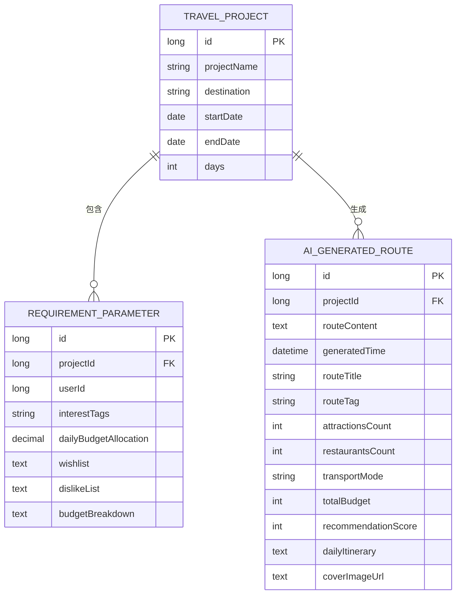

# AI智能路线生成API

<cite>
**本文引用的文件**
- [AiGeneratedRouteController.java](file://tudianersha/src/main/java/com/tudianersha/controller/AiGeneratedRouteController.java)
- [AiGeneratedRouteService.java](file://tudianersha/src/main/java/com/tudianersha/service/AiGeneratedRouteService.java)
- [RequirementParameterController.java](file://tudianersha/src/main/java/com/tudianersha/controller/RequirementParameterController.java)
- [RequirementParameterService.java](file://tudianersha/src/main/java/com/tudianersha/service/RequirementParameterService.java)
- [RequirementParameter.java](file://tudianersha/src/main/java/com/tudianersha/entity/RequirementParameter.java)
- [AiGeneratedRoute.java](file://tudianersha/src/main/java/com/tudianersha/entity/AiGeneratedRoute.java)
- [AiGeneratedRouteRepository.java](file://tudianersha/src/main/java/com/tudianersha/repository/AiGeneratedRouteRepository.java)
- [KimiAIService.java](file://tudianersha/src/main/java/com/tudianersha/service/KimiAIService.java)
- [application.yml](file://tudianersha/src/main/resources/application.yml)
</cite>

## 目录
1. [简介](#简介)
2. [项目结构](#项目结构)
3. [核心组件](#核心组件)
4. [架构总览](#架构总览)
5. [详细组件分析](#详细组件分析)
6. [依赖关系分析](#依赖关系分析)
7. [性能与耗时特性](#性能与耗时特性)
8. [故障排查指南](#故障排查指南)
9. [结论](#结论)
10. [附录](#附录)

## 简介
本文件面向前端与集成开发者，系统性说明“AI智能路线生成”相关API，重点覆盖：
- POST /api/ai-generated-routes/generate/{projectId} 的请求与响应语义、异步处理特性与预期耗时
- 如何通过 GET /api/ai-generated-routes?projectId={id} 获取生成结果
- RequirementParameterController 如何收集用户偏好并被AI服务使用
- KimiAIService 调用大模型的内部流程（非公开API，但解释其与公开API的关系）
- 前端轮询建议与错误处理策略

## 项目结构
围绕AI路线生成的关键模块如下：
- 控制器层：AiGeneratedRouteController、RequirementParameterController
- 服务层：AiGeneratedRouteService、RequirementParameterService、KimiAIService
- 实体与仓库：AiGeneratedRoute、RequirementParameter、AiGeneratedRouteRepository
- 配置：application.yml 中的大模型与地图API配置

图表来源
- [AiGeneratedRouteController.java](file://tudianersha/src/main/java/com/tudianersha/controller/AiGeneratedRouteController.java#L1-L112)
- [AiGeneratedRouteService.java](file://tudianersha/src/main/java/com/tudianersha/service/AiGeneratedRouteService.java#L1-L120)
- [RequirementParameterController.java](file://tudianersha/src/main/java/com/tudianersha/controller/RequirementParameterController.java#L1-L85)
- [RequirementParameterService.java](file://tudianersha/src/main/java/com/tudianersha/service/RequirementParameterService.java#L1-L40)
- [AiGeneratedRoute.java](file://tudianersha/src/main/java/com/tudianersha/entity/AiGeneratedRoute.java#L1-L193)
- [RequirementParameter.java](file://tudianersha/src/main/java/com/tudianersha/entity/RequirementParameter.java#L1-L123)
- [AiGeneratedRouteRepository.java](file://tudianersha/src/main/java/com/tudianersha/repository/AiGeneratedRouteRepository.java#L1-L12)
- [KimiAIService.java](file://tudianersha/src/main/java/com/tudianersha/service/KimiAIService.java#L1-L176)
- [application.yml](file://tudianersha/src/main/resources/application.yml#L47-L57)

章节来源
- [AiGeneratedRouteController.java](file://tudianersha/src/main/java/com/tudianersha/controller/AiGeneratedRouteController.java#L1-L112)
- [AiGeneratedRouteService.java](file://tudianersha/src/main/java/com/tudianersha/service/AiGeneratedRouteService.java#L1-L120)
- [RequirementParameterController.java](file://tudianersha/src/main/java/com/tudianersha/controller/RequirementParameterController.java#L1-L85)
- [RequirementParameterService.java](file://tudianersha/src/main/java/com/tudianersha/service/RequirementParameterService.java#L1-L40)
- [AiGeneratedRoute.java](file://tudianersha/src/main/java/com/tudianersha/entity/AiGeneratedRoute.java#L1-L193)
- [RequirementParameter.java](file://tudianersha/src/main/java/com/tudianersha/entity/RequirementParameter.java#L1-L123)
- [AiGeneratedRouteRepository.java](file://tudianersha/src/main/java/com/tudianersha/repository/AiGeneratedRouteRepository.java#L1-L12)
- [KimiAIService.java](file://tudianersha/src/main/java/com/tudianersha/service/KimiAIService.java#L1-L176)
- [application.yml](file://tudianersha/src/main/resources/application.yml#L47-L57)

## 核心组件
- AiGeneratedRouteController：提供AI路线生成入口与查询接口，负责接收请求、清理旧结果、触发生成并返回统一响应。
- AiGeneratedRouteService：组装提示词、调用KimiAIService、解析与持久化AI结果，并尝试从每日行程抽取封面图。
- RequirementParameterController/Service：收集各参与者的兴趣标签、心愿单、不喜欢项、每日预算等偏好参数，作为AI生成的输入依据。
- KimiAIService：封装对Kimi大模型API的调用，构建消息结构、设置温度与token上限、提取返回内容。
- 实体与仓库：AiGeneratedRoute、RequirementParameter定义数据结构；AiGeneratedRouteRepository提供按项目ID查询能力。

章节来源
- [AiGeneratedRouteController.java](file://tudianersha/src/main/java/com/tudianersha/controller/AiGeneratedRouteController.java#L78-L112)
- [AiGeneratedRouteService.java](file://tudianersha/src/main/java/com/tudianersha/service/AiGeneratedRouteService.java#L63-L120)
- [RequirementParameterController.java](file://tudianersha/src/main/java/com/tudianersha/controller/RequirementParameterController.java#L1-L85)
- [RequirementParameterService.java](file://tudianersha/src/main/java/com/tudianersha/service/RequirementParameterService.java#L1-L40)
- [KimiAIService.java](file://tudianersha/src/main/java/com/tudianersha/service/KimiAIService.java#L44-L98)
- [AiGeneratedRoute.java](file://tudianersha/src/main/java/com/tudianersha/entity/AiGeneratedRoute.java#L1-L193)
- [RequirementParameter.java](file://tudianersha/src/main/java/com/tudianersha/entity/RequirementParameter.java#L1-L123)
- [AiGeneratedRouteRepository.java](file://tudianersha/src/main/java/com/tudianersha/repository/AiGeneratedRouteRepository.java#L1-L12)

## 架构总览
AI路线生成的端到端流程如下：

图表来源
- [AiGeneratedRouteController.java](file://tudianersha/src/main/java/com/tudianersha/controller/AiGeneratedRouteController.java#L82-L112)
- [AiGeneratedRouteService.java](file://tudianersha/src/main/java/com/tudianersha/service/AiGeneratedRouteService.java#L70-L120)
- [RequirementParameterService.java](file://tudianersha/src/main/java/com/tudianersha/service/RequirementParameterService.java#L33-L40)
- [KimiAIService.java](file://tudianersha/src/main/java/com/tudianersha/service/KimiAIService.java#L44-L98)
- [AiGeneratedRouteRepository.java](file://tudianersha/src/main/java/com/tudianersha/repository/AiGeneratedRouteRepository.java#L1-L12)

## 详细组件分析

### POST /api/ai-generated-routes/generate/{projectId}
- 功能：为指定项目生成3条AI路线方案，同时清理该项目历史生成结果。
- 请求方法与路径：POST /api/ai-generated-routes/generate/{projectId}
- 参数：路径参数 projectId（Long）
- 行为：
  - 删除该项目已有的AI路线记录
  - 调用服务层生成新路线
  - 返回统一响应对象，包含 success、message、data（列表）
- 响应状态：
  - 成功：200 OK
  - 缺少要求参数：400 Bad Request
  - 其他异常：500 Internal Server Error

章节来源
- [AiGeneratedRouteController.java](file://tudianersha/src/main/java/com/tudianersha/controller/AiGeneratedRouteController.java#L82-L112)

### GET /api/ai-generated-routes?projectId={id}
- 功能：按项目ID查询该项目的全部AI路线结果
- 请求方法与路径：GET /api/ai-generated-routes?projectId={id}
- 查询参数：projectId（Long）
- 响应：200 OK，返回AiGeneratedRoute列表

章节来源
- [AiGeneratedRouteController.java](file://tudianersha/src/main/java/com/tudianersha/controller/AiGeneratedRouteController.java#L72-L76)
- [AiGeneratedRouteService.java](file://tudianersha/src/main/java/com/tudianersha/service/AiGeneratedRouteService.java#L59-L61)
- [AiGeneratedRouteRepository.java](file://tudianersha/src/main/java/com/tudianersha/repository/AiGeneratedRouteRepository.java#L1-L12)

### RequirementParameterController：用户偏好收集
- 作用：维护每个参与者的兴趣标签、心愿单、不喜欢项、每日预算等偏好参数，供AI生成使用。
- 关键接口：
  - POST /api/requirement-parameters：新增偏好参数
  - PUT /api/requirement-parameters/{id}：更新偏好参数
  - GET /api/requirement-parameters/project/{projectId}/all：获取某项目下所有参与者的偏好参数
- 服务层：RequirementParameterService 提供按项目ID批量查询能力

章节来源
- [RequirementParameterController.java](file://tudianersha/src/main/java/com/tudianersha/controller/RequirementParameterController.java#L1-L85)
- [RequirementParameterService.java](file://tudianersha/src/main/java/com/tudianersha/service/RequirementParameterService.java#L33-L40)
- [RequirementParameter.java](file://tudianersha/src/main/java/com/tudianersha/entity/RequirementParameter.java#L1-L123)

### AiGeneratedRouteService：提示词构建与AI调用
- 提示词构建：从项目信息与各参与者的偏好参数出发，拼装成结构化的提示词，明确要求AI输出3条路线方案的字段与格式。
- AI调用：调用 KimiAIService.generateRoute(prompt)，期望返回符合约定JSON格式的文本。
- 结果解析与持久化：尝试从响应中提取JSON，解析出3条路线，填充AiGeneratedRoute字段并保存；若解析失败则回退为默认示例行程并尝试从POI抽取封面图。
- 封面图提取：从每日行程中抽取景点活动，结合高德POI服务获取图片URL并合并存储。

章节来源
- [AiGeneratedRouteService.java](file://tudianersha/src/main/java/com/tudianersha/service/AiGeneratedRouteService.java#L94-L192)
- [AiGeneratedRouteService.java](file://tudianersha/src/main/java/com/tudianersha/service/AiGeneratedRouteService.java#L194-L360)
- [AiGeneratedRouteService.java](file://tudianersha/src/main/java/com/tudianersha/service/AiGeneratedRouteService.java#L362-L486)

### KimiAIService：大模型调用流程
- 配置：从 application.yml 读取 Kimi API 的地址、模型与密钥。
- 请求构造：设置模型、角色消息（system/user）、温度与最大token数。
- 响应提取：解析choices中的第一条消息内容作为AI回复。
- 超时设置：连接、写入、读取超时均延长以适配大模型生成耗时。

章节来源
- [KimiAIService.java](file://tudianersha/src/main/java/com/tudianersha/service/KimiAIService.java#L1-L176)
- [application.yml](file://tudianersha/src/main/resources/application.yml#L47-L57)

## 依赖关系分析

图表来源
- [AiGeneratedRouteController.java](file://tudianersha/src/main/java/com/tudianersha/controller/AiGeneratedRouteController.java#L1-L112)
- [AiGeneratedRouteService.java](file://tudianersha/src/main/java/com/tudianersha/service/AiGeneratedRouteService.java#L1-L120)
- [RequirementParameterController.java](file://tudianersha/src/main/java/com/tudianersha/controller/RequirementParameterController.java#L1-L85)
- [RequirementParameterService.java](file://tudianersha/src/main/java/com/tudianersha/service/RequirementParameterService.java#L1-L40)
- [RequirementParameter.java](file://tudianersha/src/main/java/com/tudianersha/entity/RequirementParameter.java#L1-L123)
- [AiGeneratedRoute.java](file://tudianersha/src/main/java/com/tudianersha/entity/AiGeneratedRoute.java#L1-L193)
- [AiGeneratedRouteRepository.java](file://tudianersha/src/main/java/com/tudianersha/repository/AiGeneratedRouteRepository.java#L1-L12)
- [KimiAIService.java](file://tudianersha/src/main/java/com/tudianersha/service/KimiAIService.java#L1-L176)

## 性能与耗时特性
- 异步特性：后端未实现后台任务队列或WebSocket推送，生成过程在请求线程内完成。因此该接口属于“同步阻塞式”，耗时较长。
- 预估耗时：受网络与大模型响应影响，通常在数秒至数十秒之间，建议前端采用轮询策略。
- 轮询建议：
  - 发起生成请求后，立即轮询 GET /api/ai-generated-routes?projectId={id}
  - 轮询间隔建议：5-10秒，最多轮询次数：12次（约1分钟）
  - 若返回空列表且仍在生成中，继续等待；若返回非空列表，则展示结果
- 超时与重试：
  - 前端应设置请求超时（如15秒），并在超时后重试
  - 服务端对Kimi API设置了较长读取超时，但仍可能因网络波动失败，前端需具备重试与降级提示

章节来源
- [AiGeneratedRouteController.java](file://tudianersha/src/main/java/com/tudianersha/controller/AiGeneratedRouteController.java#L82-L112)
- [AiGeneratedRouteService.java](file://tudianersha/src/main/java/com/tudianersha/service/AiGeneratedRouteService.java#L70-L120)
- [KimiAIService.java](file://tudianersha/src/main/java/com/tudianersha/service/KimiAIService.java#L28-L35)

## 故障排查指南
- 400 错误：当项目不存在或该项目无任何偏好参数时，会抛出参数校验异常，返回400。
- 500 错误：大模型API不可达或响应格式异常、数据库异常等，返回500。
- 解析失败回退：若AI返回的JSON无法解析，服务会生成默认示例行程并尝试从POI抽取封面图，保证前端仍可显示结果。
- 日志定位：
  - 服务端打印了提取到的JSON内容、解析到的路线数量、解析失败原因以及AI原始响应，便于定位问题
  - 建议前端在失败时上报当前projectId与生成时间戳，辅助后端排查

章节来源
- [AiGeneratedRouteController.java](file://tudianersha/src/main/java/com/tudianersha/controller/AiGeneratedRouteController.java#L101-L110)
- [AiGeneratedRouteService.java](file://tudianersha/src/main/java/com/tudianersha/service/AiGeneratedRouteService.java#L194-L360)
- [AiGeneratedRouteService.java](file://tudianersha/src/main/java/com/tudianersha/service/AiGeneratedRouteService.java#L294-L358)

## 结论
- 本API通过“同步阻塞式”的POST /api/ai-generated-routes/generate/{projectId}触发AI生成，并通过GET /api/ai-generated-routes?projectId={id}拉取结果。
- RequirementParameterController/Service负责收集用户偏好，AiGeneratedRouteService将其整合为提示词并调用KimiAIService生成路线。
- 由于生成过程耗时较长，建议前端采用轮询策略并设置合理的超时与重试机制。
- 当AI响应不符合预期时，服务具备解析失败回退逻辑，保障可用性。

## 附录

### API定义与字段说明
- POST /api/ai-generated-routes/generate/{projectId}
  - 方法：POST
  - 路径参数：projectId（Long）
  - 响应体：包含 success（布尔）、message（字符串）、data（AiGeneratedRoute数组）
- GET /api/ai-generated-routes?projectId={id}
  - 方法：GET
  - 查询参数：projectId（Long）
  - 响应体：AiGeneratedRoute数组

章节来源
- [AiGeneratedRouteController.java](file://tudianersha/src/main/java/com/tudianersha/controller/AiGeneratedRouteController.java#L72-L112)
- [AiGeneratedRoute.java](file://tudianersha/src/main/java/com/tudianersha/entity/AiGeneratedRoute.java#L1-L193)

### 数据模型关系

图表来源
- [RequirementParameter.java](file://tudianersha/src/main/java/com/tudianersha/entity/RequirementParameter.java#L1-L123)
- [AiGeneratedRoute.java](file://tudianersha/src/main/java/com/tudianersha/entity/AiGeneratedRoute.java#L1-L193)