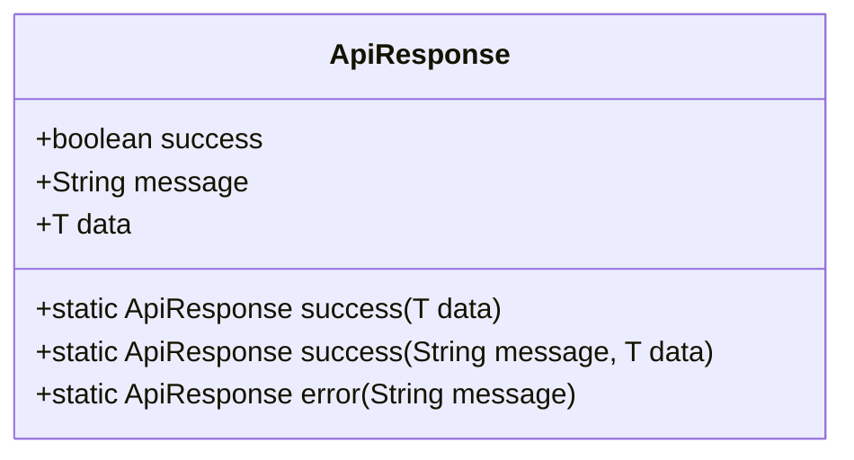

# API接口参考

<cite>
**本文档引用的文件**  
- [ApiResponse.java](file://tudianersha/src/main/java/com/tudianersha/dto/ApiResponse.java)
- [UserController.java](file://tudianersha/src/main/java/com/tudianersha/controller/UserController.java)
- [TravelProjectController.java](file://tudianersha/src/main/java/com/tudianersha/controller/TravelProjectController.java)
- [AiGeneratedRouteController.java](file://tudianersha/src/main/java/com/tudianersha/controller/AiGeneratedRouteController.java)
- [OverallRouteController.java](file://tudianersha/src/main/java/com/tudianersha/controller/OverallRouteController.java)
- [ActivityScheduleController.java](file://tudianersha/src/main/java/com/tudianersha/controller/ActivityScheduleController.java)
- [BudgetController.java](file://tudianersha/src/main/java/com/tudianersha/controller/BudgetController.java)
- [ChatMessageController.java](file://tudianersha/src/main/java/com/tudianersha/controller/ChatMessageController.java)
- [EmailController.java](file://tudianersha/src/main/java/com/tudianersha/controller/EmailController.java)
- [PdfExportController.java](file://tudianersha/src/main/java/com/tudianersha/controller/PdfExportController.java)
- [ProjectParticipantController.java](file://tudianersha/src/main/java/com/tudianersha/controller/ProjectParticipantController.java)
- [RequirementParameterController.java](file://tudianersha/src/main/java/com/tudianersha/controller/RequirementParameterController.java)
- [SharedDocumentController.java](file://tudianersha/src/main/java/com/tudianersha/controller/SharedDocumentController.java)
- [TravelParticipantController.java](file://tudianersha/src/main/java/com/tudianersha/controller/TravelParticipantController.java)
- [TravelSessionController.java](file://tudianersha/src/main/java/com/tudianersha/controller/TravelSessionController.java)
</cite>

## 目录
1. [简介](#简介)
2. [响应格式](#响应格式)
3. [用户管理](#用户管理)
4. [旅行项目管理](#旅行项目管理)
5. [AI生成路线](#ai生成路线)
6. [整体路线管理](#整体路线管理)
7. [活动日程管理](#活动日程管理)
8. [预算管理](#预算管理)
9. [聊天消息](#聊天消息)
10. [邮件服务](#邮件服务)
11. [PDF导出](#pdf导出)
12. [项目参与者](#项目参与者)
13. [需求参数](#需求参数)
14. [共享文档](#共享文档)
15. [旅行参与者](#旅行参与者)
16. [旅行会话](#旅行会话)
17. [认证机制](#认证机制)
18. [API版本控制](#api版本控制)
19. [错误码字典](#错误码字典)

## 简介
本API文档详细描述了途点儿啥平台的所有公开RESTful API端点。系统提供完整的旅行项目协作功能，包括用户管理、项目创建、AI智能路线生成、行程安排、预算管理、实时聊天等核心功能。所有API均采用无状态设计，未来可扩展JWT认证。

## 响应格式
所有API响应均遵循统一的`ApiResponse`格式，确保客户端能够一致地处理成功和失败情况。



**图示来源**  
- [ApiResponse.java](file://tudianersha/src/main/java/com/tudianersha/dto/ApiResponse.java#L6-L80)

**本节来源**  
- [ApiResponse.java](file://tudianersha/src/main/java/com/tudianersha/dto/ApiResponse.java#L6-L80)

## 用户管理
提供用户注册、登录和管理功能。

### 获取所有用户
- **HTTP方法**: GET
- **URL路径**: `/api/users`
- **请求参数**: 无
- **请求体**: 无
- **响应格式**: `ApiResponse<List<User>>`
- **HTTP状态码**: 
  - 200: 成功获取用户列表
- **示例调用**:
```bash
curl -X GET "http://localhost:8080/api/users"
```

### 获取用户详情
- **HTTP方法**: GET
- **URL路径**: `/api/users/{id}`
- **请求参数**: 
  - `id` (路径参数): 用户ID
- **请求体**: 无
- **响应格式**: `ApiResponse<User>`
- **HTTP状态码**: 
  - 200: 成功获取用户
  - 404: 用户不存在
- **示例调用**:
```bash
curl -X GET "http://localhost:8080/api/users/1"
```

### 用户注册
- **HTTP方法**: POST
- **URL路径**: `/api/users`
- **请求参数**: 无
- **请求体结构**:
```json
{
  "username": "string",
  "email": "string",
  "password": "string"
}
```
- **响应格式**: `ApiResponse<Map<String, Object>>`
- **HTTP状态码**: 
  - 200: 注册成功或用户名/邮箱已存在
  - 500: 服务器内部错误
- **示例调用**:
```bash
curl -X POST "http://localhost:8080/api/users" \
  -H "Content-Type: application/json" \
  -d '{"username":"testuser","email":"test@example.com","password":"password123"}'
```

### 用户登录
- **HTTP方法**: POST
- **URL路径**: `/api/users/login`
- **请求参数**: 无
- **请求体结构**:
```json
{
  "account": "string",
  "password": "string"
}
```
- **响应格式**: `ApiResponse<Map<String, Object>>`
- **HTTP状态码**: 
  - 200: 登录成功或用户名/密码错误
- **示例调用**:
```javascript
fetch('/api/users/login', {
  method: 'POST',
  headers: { 'Content-Type': 'application/json' },
  body: JSON.stringify({ account: 'testuser', password: 'password123' })
})
.then(response => response.json())
.then(data => console.log(data));
```

**本节来源**  
- [UserController.java](file://tudianersha/src/main/java/com/tudianersha/controller/UserController.java#L17-L152)

## 旅行项目管理
管理旅行项目的核心CRUD操作。

### 创建旅行项目
- **HTTP方法**: POST
- **URL路径**: `/api/travel-projects`
- **请求参数**: 无
- **请求体结构**:
```json
{
  "projectName": "string",
  "destination": "string",
  "days": 0,
  "creatorId": 0,
  "status": "string",
  "createdTime": "string",
  "updatedTime": "string",
  "currentRouteId": 0
}
```
- **响应格式**: `TravelProject`
- **HTTP状态码**: 
  - 201: 项目创建成功
- **示例调用**:
```bash
curl -X POST "http://localhost:8080/api/travel-projects" \
  -H "Content-Type: application/json" \
  -d '{"projectName":"北京之旅","destination":"北京","days":5,"creatorId":1,"status":"draft"}'
```

### 获取项目列表
- **HTTP方法**: GET
- **URL路径**: `/api/travel-projects`
- **请求参数**: 无
- **请求体**: 无
- **响应格式**: `List<TravelProject>`
- **HTTP状态码**: 
  - 200: 成功获取项目列表

### 根据创建者获取项目
- **HTTP方法**: GET
- **URL路径**: `/api/travel-projects/creator/{creatorId}`
- **请求参数**: 
  - `creatorId` (路径参数): 创建者ID
- **请求体**: 无
- **响应格式**: `List<TravelProject>`
- **HTTP状态码**: 
  - 200: 成功获取项目列表

**本节来源**  
- [TravelProjectController.java](file://tudianersha/src/main/java/com/tudianersha/controller/TravelProjectController.java#L13-L85)

## AI生成路线
提供基于AI的智能路线生成功能。

### 生成AI路线
- **HTTP方法**: POST
- **URL路径**: `/api/ai-generated-routes/generate/{projectId}`
- **请求参数**: 
  - `projectId` (路径参数): 项目ID
- **请求体**: 无
- **响应格式**: `Map<String, Object>`
- **HTTP状态码**: 
  - 200: AI路线生成成功
  - 400: 请求参数错误
  - 500: 生成失败
- **特别说明**: 此接口为耗时操作，建议前端显示加载状态
- **示例调用**:
```bash
curl -X POST "http://localhost:8080/api/ai-generated-routes/generate/1"
```

### 创建AI生成路线
- **HTTP方法**: POST
- **URL路径**: `/api/ai-generated-routes`
- **请求参数**: 无
- **请求体结构**:
```json
{
  "projectId": 0,
  "routeContent": "string",
  "generatedTime": "string",
  "interestTags": "string"
}
```
- **响应格式**: `AiGeneratedRoute`
- **HTTP状态码**: 
  - 201: 路线创建成功

**本节来源**  
- [AiGeneratedRouteController.java](file://tudianersha/src/main/java/com/tudianersha/controller/AiGeneratedRouteController.java#L15-L112)

## 整体路线管理
管理最终确定的整体旅行路线。

### 创建整体路线
- **HTTP方法**: POST
- **URL路径**: `/api/overall-routes`
- **请求参数**: 无
- **请求体结构**:
```json
{
  "projectId": 0,
  "routeDetails": "string",
  "createdTime": "string"
}
```
- **响应格式**: `OverallRoute`
- **HTTP状态码**: 
  - 201: 路线创建成功

### 根据项目获取路线
- **HTTP方法**: GET
- **URL路径**: `/api/overall-routes/project/{projectId}`
- **请求参数**: 
  - `projectId` (路径参数): 项目ID
- **请求体**: 无
- **响应格式**: `List<OverallRoute>`
- **HTTP状态码**: 
  - 200: 成功获取路线列表

**本节来源**  
- [OverallRouteController.java](file://tudianersha/src/main/java/com/tudianersha/controller/OverallRouteController.java#L13-L74)

## 活动日程管理
管理旅行中的具体活动安排。

### 创建活动日程
- **HTTP方法**: POST
- **URL路径**: `/api/activity-schedules`
- **请求参数**: 无
- **请求体结构**:
```json
{
  "projectId": 0,
  "activityName": "string",
  "activityTime": "string",
  "location": "string",
  "budget": 0,
  "dayNumber": 0
}
```
- **响应格式**: `ActivitySchedule`
- **HTTP状态码**: 
  - 201: 日程创建成功

### 根据项目获取日程（有序）
- **HTTP方法**: GET
- **URL路径**: `/api/activity-schedules/project/{projectId}/ordered`
- **请求参数**: 
  - `projectId` (路径参数): 项目ID
- **请求体**: 无
- **响应格式**: `List<ActivitySchedule>`
- **HTTP状态码**: 
  - 200: 成功获取有序日程列表

**本节来源**  
- [ActivityScheduleController.java](file://tudianersha/src/main/java/com/tudianersha/controller/ActivityScheduleController.java#L13-L83)

## 预算管理
管理旅行项目的预算信息。

### 创建预算
- **HTTP方法**: POST
- **URL路径**: `/api/budgets`
- **请求参数**: 无
- **请求体结构**:
```json
{
  "projectId": 0,
  "totalBudget": 0,
  "usedBudget": 0,
  "remainingBudget": 0
}
```
- **响应格式**: `Budget`
- **HTTP状态码**: 
  - 201: 预算创建成功

### 根据项目获取预算
- **HTTP方法**: GET
- **URL路径**: `/api/budgets/project/{projectId}`
- **请求参数**: 
  - `projectId` (路径参数): 项目ID
- **请求体**: 无
- **响应格式**: `Budget`
- **HTTP状态码**: 
  - 200: 成功获取预算
  - 404: 预算不存在

**本节来源**  
- [BudgetController.java](file://tudianersha/src/main/java/com/tudianersha/controller/BudgetController.java#L13-L79)

## 聊天消息
提供项目内的实时聊天功能。

### 发送消息
- **HTTP方法**: POST
- **URL路径**: `/api/chat-messages`
- **请求参数**: 无
- **请求体结构**:
```json
{
  "projectId": 0,
  "senderId": 0,
  "content": "string",
  "timestamp": "string"
}
```
- **响应格式**: `ChatMessage`
- **HTTP状态码**: 
  - 201: 消息发送成功

### 获取项目消息
- **HTTP方法**: GET
- **URL路径**: `/api/chat-messages/project/{projectId}`
- **请求参数**: 
  - `projectId` (路径参数): 项目ID
- **请求体**: 无
- **响应格式**: `List<ChatMessage>`
- **HTTP状态码**: 
  - 200: 成功获取消息列表

### 获取新消息
- **HTTP方法**: GET
- **URL路径**: `/api/chat-messages/project/{projectId}/new`
- **请求参数**: 
  - `projectId` (路径参数): 项目ID
  - `lastMessageId` (查询参数): 最后一条消息ID
- **请求体**: 无
- **响应格式**: `List<ChatMessage>`
- **HTTP状态码**: 
  - 200: 成功获取新消息

**本节来源**  
- [ChatMessageController.java](file://tudianersha/src/main/java/com/tudianersha/controller/ChatMessageController.java#L12-L45)

## 邮件服务
提供验证码发送和验证功能。

### 发送验证码
- **HTTP方法**: POST
- **URL路径**: `/api/email/send-code`
- **请求参数**: 无
- **请求体结构**:
```json
{
  "email": "string"
}
```
- **响应格式**: `ApiResponse<Map<String, String>>`
- **HTTP状态码**: 
  - 200: 验证码发送成功或失败
- **示例调用**:
```bash
curl -X POST "http://localhost:8080/api/email/send-code" \
  -H "Content-Type: application/json" \
  -d '{"email":"user@example.com"}'
```

### 验证验证码
- **HTTP方法**: POST
- **URL路径**: `/api/email/verify-code`
- **请求参数**: 无
- **请求体结构**:
```json
{
  "email": "string",
  "code": "string"
}
```
- **响应格式**: `Map<String, Object>`
- **HTTP状态码**: 
  - 200: 验证结果
  - 400: 请求参数错误

**本节来源**  
- [EmailController.java](file://tudianersha/src/main/java/com/tudianersha/controller/EmailController.java#L12-L82)

## PDF导出
提供行程PDF导出功能。

### 生成行程PDF
- **HTTP方法**: GET
- **URL路径**: `/api/pdf/itinerary/{projectId}`
- **请求参数**: 
  - `projectId` (路径参数): 项目ID
- **请求体**: 无
- **响应格式**: PDF文件字节流
- **HTTP状态码**: 
  - 200: PDF生成成功
  - 500: 生成失败
- **响应头**: 
  - Content-Type: application/pdf
  - Content-Disposition: attachment; filename="travel-itinerary-{projectId}.pdf"
- **示例调用**:
```bash
curl -X GET "http://localhost:8080/api/pdf/itinerary/1" -o itinerary.pdf
```

**本节来源**  
- [PdfExportController.java](file://tudianersha/src/main/java/com/tudianersha/controller/PdfExportController.java#L11-L47)

## 项目参与者
管理项目参与者的加入和权限。

### 创建项目参与者
- **HTTP方法**: POST
- **URL路径**: `/api/project-participants`
- **请求参数**: 无
- **请求体结构**:
```json
{
  "projectId": 0,
  "userId": 0,
  "joinTime": "string",
  "role": "string"
}
```
- **响应格式**: `ProjectParticipant`
- **HTTP状态码**: 
  - 201: 参与者创建成功

### 根据项目获取参与者
- **HTTP方法**: GET
- **URL路径**: `/api/project-participants/project/{projectId}`
- **请求参数**: 
  - `projectId` (路径参数): 项目ID
- **请求体**: 无
- **响应格式**: `List<ProjectParticipant>`
- **HTTP状态码**: 
  - 200: 成功获取参与者列表

**本节来源**  
- [ProjectParticipantController.java](file://tudianersha/src/main/java/com/tudianersha/controller/ProjectParticipantController.java#L13-L91)

## 需求参数
管理用户对旅行的个性化需求。

### 创建需求参数
- **HTTP方法**: POST
- **URL路径**: `/api/requirement-parameters`
- **请求参数**: 无
- **请求体结构**:
```json
{
  "projectId": 0,
  "interestTags": "string",
  "dailyBudgetAllocation": 0,
  "wishlist": "string"
}
```
- **响应格式**: `RequirementParameter`
- **HTTP状态码**: 
  - 201: 参数创建成功

### 根据项目获取需求参数
- **HTTP方法**: GET
- **URL路径**: `/api/requirement-parameters/project/{projectId}`
- **请求参数**: 
  - `projectId` (路径参数): 项目ID
- **请求体**: 无
- **响应格式**: `RequirementParameter`
- **HTTP状态码**: 
  - 200: 成功获取参数
  - 404: 参数不存在

**本节来源**  
- [RequirementParameterController.java](file://tudianersha/src/main/java/com/tudianersha/controller/RequirementParameterController.java#L13-L85)

## 共享文档
管理项目相关的共享文档。

### 创建共享文档
- **HTTP方法**: POST
- **URL路径**: `/api/shared-documents`
- **请求参数**: 无
- **请求体结构**:
```json
{
  "projectId": 0,
  "documentUrl": "string",
  "format": "string",
  "generatedTime": "string",
  "shareLink": "string",
  "creatorId": 0
}
```
- **响应格式**: `SharedDocument`
- **HTTP状态码**: 
  - 201: 文档创建成功

### 根据创建者获取文档
- **HTTP方法**: GET
- **URL路径**: `/api/shared-documents/creator/{creatorId}`
- **请求参数**: 
  - `creatorId` (路径参数): 创建者ID
- **请求体**: 无
- **响应格式**: `List<SharedDocument>`
- **HTTP状态码**: 
  - 200: 成功获取文档列表

**本节来源**  
- [SharedDocumentController.java](file://tudianersha/src/main/java/com/tudianersha/controller/SharedDocumentController.java#L13-L83)

## 旅行参与者
管理旅行的具体参与者信息。

### 创建旅行参与者
- **HTTP方法**: POST
- **URL路径**: `/api/travel-participants`
- **请求参数**: 无
- **请求体结构**:
```json
{
  "projectId": 0,
  "userId": 0,
  "permission": "string"
}
```
- **响应格式**: `TravelParticipant`
- **HTTP状态码**: 
  - 201: 参与者创建成功

### 根据用户获取参与的旅行
- **HTTP方法**: GET
- **URL路径**: `/api/travel-participants/user/{userId}`
- **请求参数**: 
  - `userId` (路径参数): 用户ID
- **请求体**: 无
- **响应格式**: `List<TravelParticipant>`
- **HTTP状态码**: 
  - 200: 成功获取参与列表

**本节来源**  
- [TravelParticipantController.java](file://tudianersha/src/main/java/com/tudianersha/controller/TravelParticipantController.java#L13-L80)

## 旅行会话
管理旅行相关的会话记录。

### 创建旅行会话
- **HTTP方法**: POST
- **URL路径**: `/api/travel-sessions`
- **请求参数**: 无
- **请求体结构**:
```json
{
  "projectId": 0,
  "userId": 0,
  "message": "string",
  "messageTime": "string",
  "mentionedUserId": 0
}
```
- **响应格式**: `TravelSession`
- **HTTP状态码**: 
  - 201: 会话创建成功

### 根据项目和用户获取会话
- **HTTP方法**: GET
- **URL路径**: `/api/travel-sessions/project/{projectId}/user/{userId}`
- **请求参数**: 
  - `projectId` (路径参数): 项目ID
  - `userId` (路径参数): 用户ID
- **请求体**: 无
- **响应格式**: `List<TravelSession>`
- **HTTP状态码**: 
  - 200: 成功获取会话列表

**本节来源**  
- [TravelSessionController.java](file://tudianersha/src/main/java/com/tudianersha/controller/TravelSessionController.java#L13-L82)

## 认证机制
当前系统采用无状态认证机制，所有用户信息通过请求体传递。未来计划扩展为JWT认证，以提高安全性和可扩展性。用户登录后，客户端应保存用户会话信息，并在后续请求中使用。

## API版本控制
当前API为v1版本，所有端点均位于`/api/`路径下。未来版本将采用URL路径版本控制策略，如`/api/v2/`，确保向后兼容性。

## 错误码字典
| 错误码 | 描述 | 建议操作 |
|--------|------|----------|
| 400 | 请求参数错误 | 检查请求体和参数格式 |
| 404 | 资源不存在 | 确认资源ID是否正确 |
| 500 | 服务器内部错误 | 重试请求或联系管理员 |
| 用户名已存在 | 注册时用户名重复 | 更换用户名重新尝试 |
| 邮箱已被注册 | 注册时邮箱已存在 | 使用其他邮箱或找回密码 |
| 用户名或密码错误 | 登录凭证无效 | 检查输入或重置密码 |