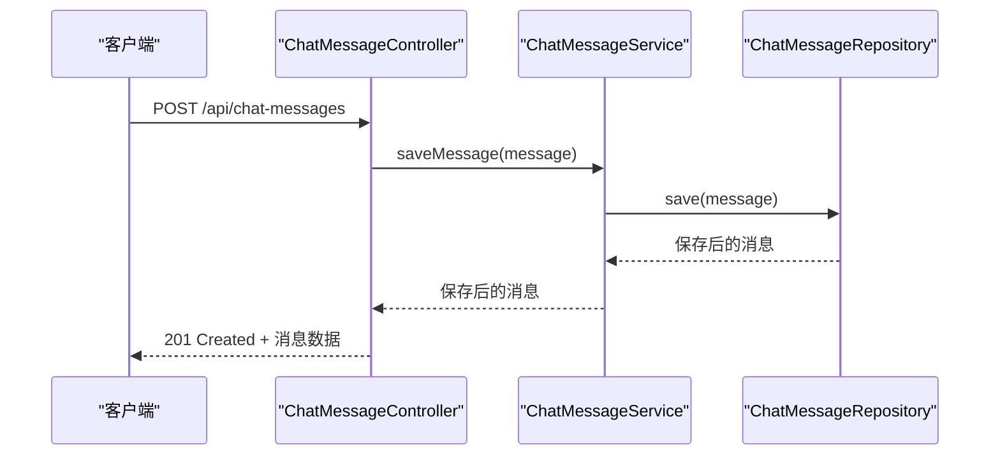
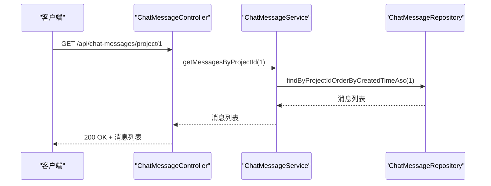
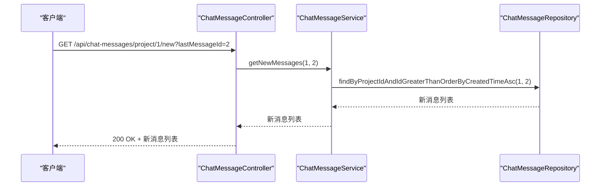
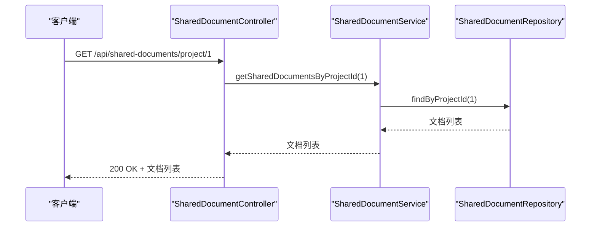
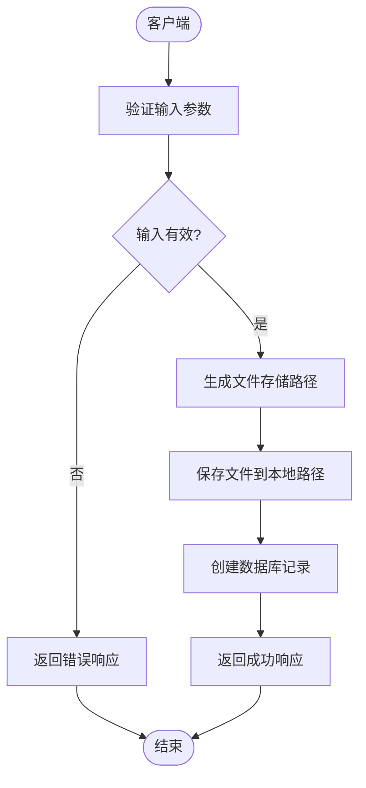
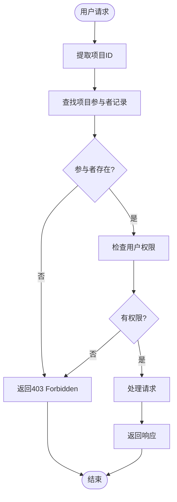
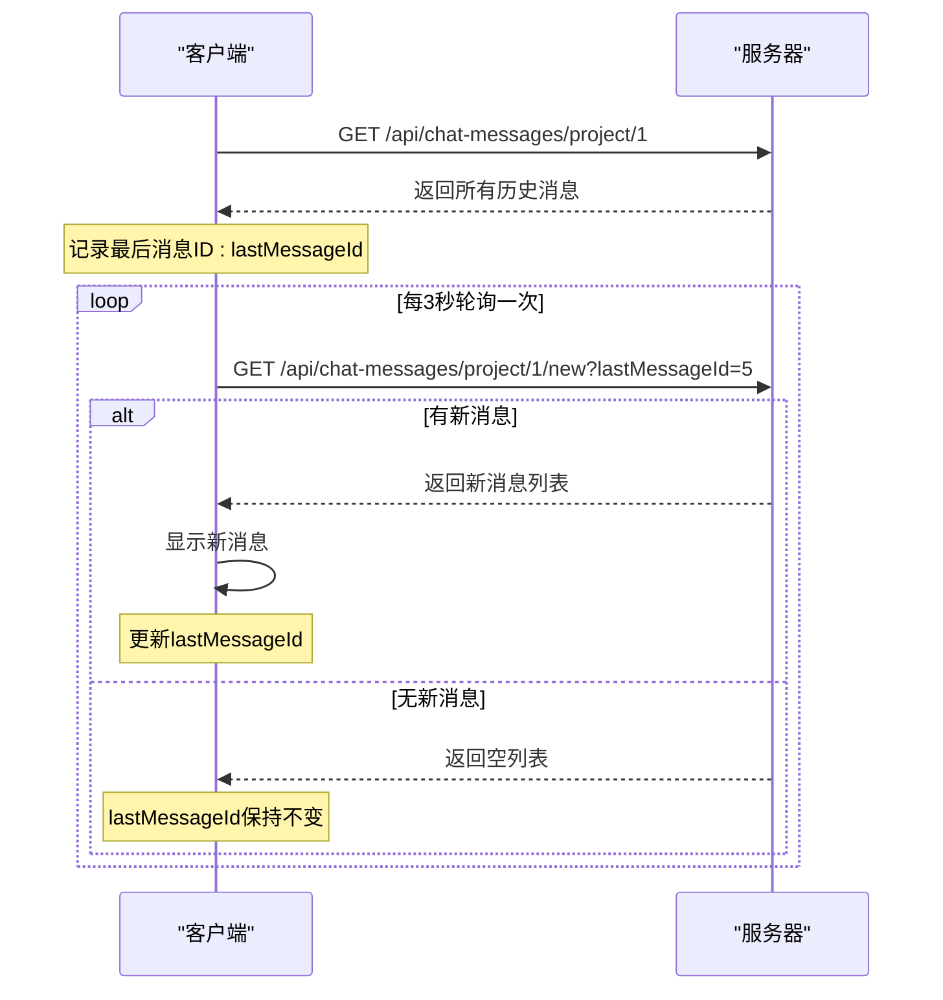
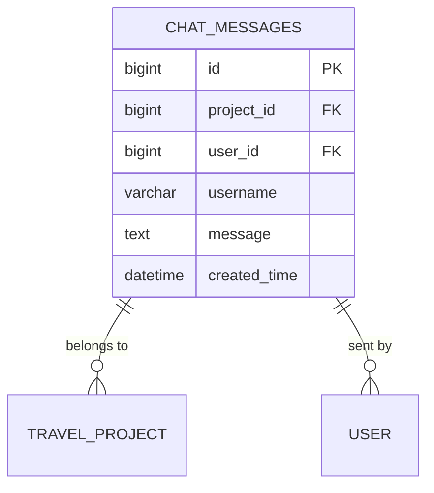
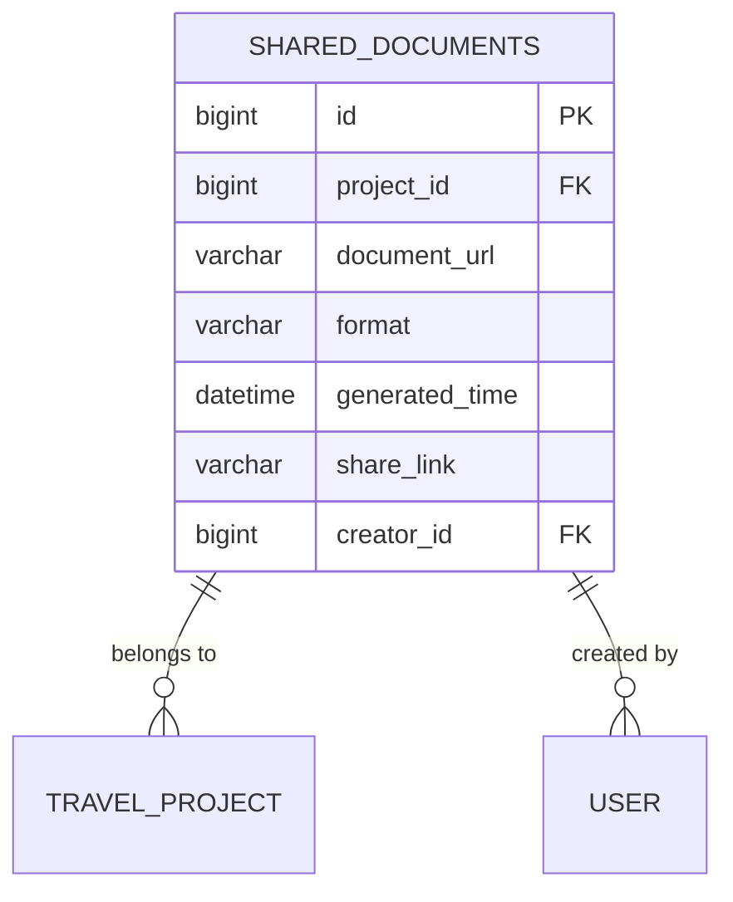
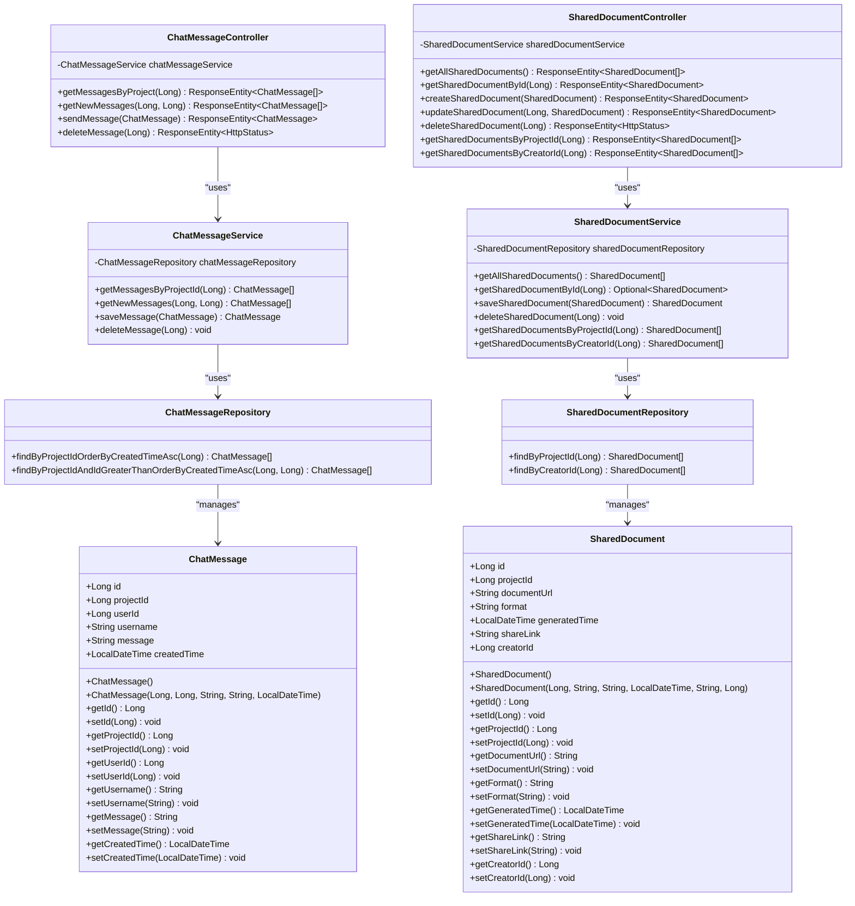

# 协作功能API

<cite>
**本文档引用的文件**
- [ChatMessageController.java](file://tudianersha\src\main\java\com\tudianersha\controller\ChatMessageController.java)
- [ChatMessage.java](file://tudianersha\src\main\java\com\tudianersha\entity\ChatMessage.java)
- [ChatMessageService.java](file://tudianersha\src\main\java\com\tudianersha\service\ChatMessageService.java)
- [ChatMessageRepository.java](file://tudianersha\src\main\java\com\tudianersha\repository\ChatMessageRepository.java)
- [SharedDocumentController.java](file://tudianersha\src\main\java\com\tudianersha\controller\SharedDocumentController.java)
- [SharedDocument.java](file://tudianersha\src\main\java\com\tudianersha\entity\SharedDocument.java)
- [SharedDocumentService.java](file://tudianersha\src\main\java\com\tudianersha\service\SharedDocumentService.java)
- [SharedDocumentRepository.java](file://tudianersha\src\main\java\com\tudianersha\repository\SharedDocumentRepository.java)
- [application.yml](file://tudianersha\src\main\resources\application.yml)
- [collaboration.html](file://tudianersha\src\main\resources\static\collaboration.html)
- [schema.sql](file://tudianersha\src\main\resources\schema.sql)
- [PdfExportController.java](file://tudianersha\src\main\java\com\tudianersha\controller\PdfExportController.java)
- [TravelParticipantController.java](file://tudianersha\src\main\java\com\tudianersha\controller\TravelParticipantController.java)
- [TravelParticipant.java](file://tudianersha\src\main\java\com\tudianersha\entity\TravelParticipant.java)
- [TravelParticipantService.java](file://tudianersha\src\main\java\com\tudianersha\service\TravelParticipantService.java)
- [TravelParticipantRepository.java](file://tudianersha\src\main\java\com\tudianersha\repository\TravelParticipantRepository.java)
</cite>

## 目录
1. [简介](#简介)
2. [实时聊天API](#实时聊天api)
3. [文档共享API](#文档共享api)
4. [文件存储机制](#文件存储机制)
5. [访问控制策略](#访问控制策略)
6. [实时通信机制](#实时通信机制)
7. [数据模型](#数据模型)

## 简介
本API文档详细说明了途点儿啥平台的协作功能，包括实时聊天和文档共享两大核心功能。系统通过RESTful API提供消息发送与获取、文件上传与下载等服务，支持项目团队成员间的高效协作。聊天功能支持按项目获取历史消息和实时获取新消息，文档共享功能支持项目相关的文件管理。系统采用轮询机制实现消息的实时更新，并通过项目参与者权限控制实现访问安全。

## 实时聊天API
实时聊天API提供消息发送、历史消息获取和消息删除功能，支持按项目维度组织聊天内容。

### POST /api/chat-messages (发送消息)
此接口用于发送聊天消息。

**请求参数**
- **Method**: POST
- **Content-Type**: application/json

**请求体字段**
- projectId: 项目ID (Long, 必填)
- userId: 发送者用户ID (Long, 必填)
- username: 发送者用户名 (String, 必填)
- message: 消息内容 (String, 必填)
- createdTime: 消息创建时间 (LocalDateTime, 必填)

**响应**
- **状态码**: 201 Created
- **响应体**: 保存后的ChatMessage对象

**示例请求**
```json
{
  "projectId": 1,
  "userId": 101,
  "username": "张三",
  "message": "大家好，项目启动会议定在明天上午10点",
  "createdTime": "2024-01-15T10:00:00"
}
```

**示例响应**
```json
{
  "id": 1,
  "projectId": 1,
  "userId": 101,
  "username": "张三",
  "message": "大家好，项目启动会议定在明天上午10点",
  "createdTime": "2024-01-15T10:00:00"
}
```

**接口实现**


**接口来源**
- [ChatMessageController.java](file://tudianersha\src\main\java\com\tudianersha\controller\ChatMessageController.java#L33-L37)
- [ChatMessageService.java](file://tudianersha\src\main\java\com\tudianersha\service\ChatMessageService.java#L24-L26)
- [ChatMessageRepository.java](file://tudianersha\src\main\java\com\tudianersha\repository\ChatMessageRepository.java#L10)

### GET /api/chat-messages/project/{projectId} (获取聊天历史)
此接口用于获取指定项目的所有聊天历史消息。

**请求参数**
- **Method**: GET
- **Path Variable**: projectId (项目ID, Long, 必填)

**响应**
- **状态码**: 200 OK
- **响应体**: ChatMessage对象列表，按创建时间升序排列

**示例响应**
```json
[
  {
    "id": 1,
    "projectId": 1,
    "userId": 101,
    "username": "张三",
    "message": "大家好，项目启动会议定在明天上午10点",
    "createdTime": "2024-01-15T10:00:00"
  },
  {
    "id": 2,
    "projectId": 1,
    "userId": 102,
    "username": "李四",
    "message": "收到，我会准时参加",
    "createdTime": "2024-01-15T10:05:00"
  }
]
```

**接口实现**


**接口来源**
- [ChatMessageController.java](file://tudianersha\src\main\java\com\tudianersha\controller\ChatMessageController.java#L19-L23)
- [ChatMessageService.java](file://tudianersha\src\main\java\com\tudianersha\service\ChatMessageService.java#L16-L18)
- [ChatMessageRepository.java](file://tudianersha\src\main\java\com\tudianersha\repository\ChatMessageRepository.java#L12)

### GET /api/chat-messages/project/{projectId}/new (获取新消息)
此接口用于获取指定项目中ID大于指定值的所有新消息，用于实时消息更新。

**请求参数**
- **Method**: GET
- **Path Variable**: projectId (项目ID, Long, 必填)
- **Query Parameter**: lastMessageId (最后已知消息ID, Long, 必填)

**响应**
- **状态码**: 200 OK
- **响应体**: 新的ChatMessage对象列表，按创建时间升序排列

**示例请求**
```
GET /api/chat-messages/project/1/new?lastMessageId=2
```

**示例响应**
```json
[
  {
    "id": 3,
    "projectId": 1,
    "userId": 103,
    "username": "王五",
    "message": "会议地点在公司会议室A",
    "createdTime": "2024-01-15T10:10:00"
  }
]
```

**接口实现**


**接口来源**
- [ChatMessageController.java](file://tudianersha\src\main\java\com\tudianersha\controller\ChatMessageController.java#L25-L31)
- [ChatMessageService.java](file://tudianersha\src\main\java\com\tudianersha\service\ChatMessageService.java#L20-L22)
- [ChatMessageRepository.java](file://tudianersha\src\main\java\com\tudianersha\repository\ChatMessageRepository.java#L14)

### DELETE /api/chat-messages/{id} (删除消息)
此接口用于删除指定ID的聊天消息。

**请求参数**
- **Method**: DELETE
- **Path Variable**: id (消息ID, Long, 必填)

**响应**
- **状态码**: 204 No Content
- **响应体**: 无

**接口来源**
- [ChatMessageController.java](file://tudianersha\src\main\java\com\tudianersha\controller\ChatMessageController.java#L39-L43)
- [ChatMessageService.java](file://tudianersha\src\main\java\com\tudianersha\service\ChatMessageService.java#L28-L30)

## 文档共享API
文档共享API提供文件的上传、查询和下载功能，支持项目相关的文档管理。

### POST /api/shared-documents (上传文件)
此接口用于创建共享文档记录。

**请求参数**
- **Method**: POST
- **Content-Type**: application/json

**请求体字段**
- projectId: 项目ID (Long, 必填)
- documentUrl: 文档URL (String, 必填)
- format: 文档格式 (String, 如PDF、DOCX等)
- generatedTime: 生成时间 (LocalDateTime, 必填)
- shareLink: 分享链接 (String)
- creatorId: 创建者ID (Long, 必填)

**响应**
- **状态码**: 201 Created
- **响应体**: 保存后的SharedDocument对象

**示例请求**
```json
{
  "projectId": 1,
  "documentUrl": "/documents/1/project-plan.pdf",
  "format": "PDF",
  "generatedTime": "2024-01-15T11:00:00",
  "shareLink": "https://example.com/share/abc123",
  "creatorId": 101
}
```

**示例响应**
```json
{
  "id": 1,
  "projectId": 1,
  "documentUrl": "/documents/1/project-plan.pdf",
  "format": "PDF",
  "generatedTime": "2024-01-15T11:00:00",
  "shareLink": "https://example.com/share/abc123",
  "creatorId": 101
}
```

**接口来源**
- [SharedDocumentController.java](file://tudianersha\src\main\java\com\tudianersha\controller\SharedDocumentController.java#L36-L40)
- [SharedDocumentService.java](file://tudianersha\src\main\java\com\tudianersha\service\SharedDocumentService.java#L25-L27)

### GET /api/shared-documents/project/{projectId} (列出文件)
此接口用于获取指定项目的所有共享文档。

**请求参数**
- **Method**: GET
- **Path Variable**: projectId (项目ID, Long, 必填)

**响应**
- **状态码**: 200 OK
- **响应体**: SharedDocument对象列表

**示例响应**
```json
[
  {
    "id": 1,
    "projectId": 1,
    "documentUrl": "/documents/1/project-plan.pdf",
    "format": "PDF",
    "generatedTime": "2024-01-15T11:00:00",
    "shareLink": "https://example.com/share/abc123",
    "creatorId": 101
  },
  {
    "id": 2,
    "projectId": 1,
    "documentUrl": "/documents/1/budget.xlsx",
    "format": "XLSX",
    "generatedTime": "2024-01-15T11:30:00",
    "shareLink": "https://example.com/share/def456",
    "creatorId": 102
  }
]
```

**接口实现**


**接口来源**
- [SharedDocumentController.java](file://tudianersha\src\main\java\com\tudianersha\controller\SharedDocumentController.java#L72-L76)
- [SharedDocumentService.java](file://tudianersha\src\main\java\com\tudianersha\service\SharedDocumentService.java#L33-L35)
- [SharedDocumentRepository.java](file://tudianersha\src\main\java\com\tudianersha\repository\SharedDocumentRepository.java#L11)

### GET /api/shared-documents/{id}/download (下载文件)
此接口用于获取共享文档的下载链接，实际文件下载通过documentUrl字段的路径进行。

**请求参数**
- **Method**: GET
- **Path Variable**: id (文档ID, Long, 必填)

**响应**
- **状态码**: 200 OK
- **响应体**: SharedDocument对象，包含documentUrl字段

**示例响应**
```json
{
  "id": 1,
  "projectId": 1,
  "documentUrl": "/documents/1/project-plan.pdf",
  "format": "PDF",
  "generatedTime": "2024-01-15T11:00:00",
  "shareLink": "https://example.com/share/abc123",
  "creatorId": 101
}
```

**文件下载说明**
客户端获取documentUrl后，可通过直接访问该URL下载文件。例如，对于documentUrl为"/documents/1/project-plan.pdf"的文档，客户端可发起GET请求到`/documents/1/project-plan.pdf`来下载文件。

**接口来源**
- [SharedDocumentController.java](file://tudianersha\src\main\java\com\tudianersha\controller\SharedDocumentController.java#L26-L34)
- [SharedDocumentService.java](file://tudianersha\src\main\java\com\tudianersha\service\SharedDocumentService.java#L21-L23)

### GET /api/pdf/itinerary/{projectId} (导出PDF)
此接口用于生成并下载行程PDF文件。

**请求参数**
- **Method**: GET
- **Path Variable**: projectId (项目ID, Long, 必填)

**响应**
- **状态码**: 200 OK
- **Content-Type**: application/pdf
- **Content-Disposition**: attachment; filename="travel-itinerary-{projectId}.pdf"
- **响应体**: PDF文件的字节流

**接口来源**
- [PdfExportController.java](file://tudianersha\src\main\java\com\tudianersha\controller\PdfExportController.java#L24-L39)

## 文件存储机制
系统采用本地文件存储机制来管理共享文档和生成的PDF文件。

### 存储路径
根据系统配置和代码实现，文件存储在服务器本地的特定目录中。虽然application.yml文件中没有明确指定文档存储路径，但从documentUrl字段的值可以推断出存储结构。

**存储结构示例**
```
/documents/
  ├── {projectId}/
  │   ├── project-plan.pdf
  │   ├── budget.xlsx
  │   └── meeting-notes.docx
  └── pdf/
      ├── 1/
      │   └── travel-itinerary-1.pdf
      └── 2/
          └── travel-itinerary-2.pdf
```

**存储特点**
- **项目隔离**: 文件按项目ID组织在不同的子目录中，确保项目间文件隔离
- **路径安全**: documentUrl字段存储相对路径，避免暴露服务器文件系统结构
- **格式支持**: 支持多种文档格式，包括PDF、DOCX、XLSX等
- **静态资源**: 存储的文件作为静态资源提供，可通过HTTP直接访问

**文件上传流程**


## 访问控制策略
系统通过项目参与者权限机制实现协作功能的访问控制，确保只有授权用户才能访问特定项目的资源。

### 权限模型
系统定义了多种用户角色，用于控制对项目资源的访问权限：

**角色定义**
- **创建者**: 项目的创建者，拥有最高权限，可以管理项目和参与者
- **编辑者**: 可以编辑项目内容、发送聊天消息、上传文档
- **查看者**: 只能查看项目内容和聊天历史，不能进行编辑操作
- **参与者**: 与查看者权限类似，可以参与项目但权限受限

### 权限验证流程
当用户尝试访问协作功能时，系统会验证其在该项目中的权限。



### 权限管理接口
系统提供权限管理接口，允许创建者修改其他参与者的权限。

**PUT /api/project-participants/{id}**
- **功能**: 更新项目参与者权限
- **请求体**: { "role": "编辑者" }
- **权限要求**: 只有项目创建者可以调用

**前端权限管理**
在collaboration.html页面中，提供了权限管理弹窗，允许创建者修改其他参与者的权限级别。

```javascript
// 保存权限修改
async function savePermissions() {
  const selects = document.querySelectorAll('.permission-select');
  const updates = [];
  
  for (let select of selects) {
    const participantId = select.getAttribute('data-participant-id');
    const newRole = select.value;
    
    updates.push({
      participantId: parseInt(participantId),
      role: newRole
    });
  }
  
  try {
    // 逐个更新权限
    for (let update of updates) {
      const response = await fetch(`/api/project-participants/${update.participantId}`, {
        method: 'PUT',
        headers: {
          'Content-Type': 'application/json'
        },
        body: JSON.stringify({
          role: update.role
        })
      });
      
      if (!response.ok) {
        throw new Error('更新权限失败');
      }
    }
    
    alert('✅ 权限修改成功！');
    closePermissionModal();
    
    // 重新加载参与者列表
    await loadProjectParticipants();
    
  } catch (error) {
    console.error('Error saving permissions:', error);
    alert('保存权限失败');
  }
}
```

**接口来源**
- [TravelParticipantController.java](file://e:\tudianersha\src\main\java\com\tudianersha\controller\TravelParticipantController.java)
- [TravelParticipantService.java](file://e:\tudianersha\src\main\java\com\tudianersha\service\TravelParticipantService.java)
- [TravelParticipantRepository.java](file://e:\tudianersha\src\main\java\com\tudianersha\repository\TravelParticipantRepository.java)

## 实时通信机制
系统采用轮询(Polling)机制实现聊天消息的实时更新，而非WebSocket，这是一种简单可靠的实时通信方案。

### 轮询机制实现
前端页面通过定时向服务器发送请求来检查是否有新消息。

**轮询流程**


### 轮询实现代码
```javascript
// 轮询新消息
async function pollNewMessages() {
  if (!projectId || lastMessageId === 0) return;
  try {
    const response = await fetch(`/api/chat-messages/project/${projectId}/new?lastMessageId=${lastMessageId}`);
    if (response.ok) {
      const newMessages = await response.json();
      if (newMessages.length > 0) {
        appendNewMessages(newMessages);
        lastMessageId = newMessages[newMessages.length - 1].id;
      }
    }
  } catch (error) {
    console.error('Error polling new messages:', error);
  }
}

// 启动轮询
setInterval(pollNewMessages, 3000); // 每3秒轮询一次
```

### 轮询 vs WebSocket
虽然WebSocket提供了真正的双向实时通信，但本系统选择了轮询机制，原因如下：

**轮询优点**
- **实现简单**: 不需要维护长连接，服务器压力较小
- **兼容性好**: 所有浏览器都支持，无需特殊配置
- **易于调试**: 请求和响应清晰可见，便于问题排查
- **资源消耗低**: 在消息不频繁的场景下，资源消耗可控

**轮询缺点**
- **延迟较高**: 最大延迟为轮询间隔时间
- **网络开销**: 即使无新消息也会产生HTTP请求
- **扩展性有限**: 在高并发场景下可能产生大量请求

**建议**
对于当前应用场景，轮询机制已能满足需求。如果未来需要更低的延迟和更高的实时性，可以考虑升级到WebSocket或Server-Sent Events(SSE)。

**接口来源**
- [collaboration.html](file://tudianersha\src\main\resources\static\collaboration.html#L1213-L1228)

## 数据模型
协作功能涉及两个核心数据实体：ChatMessage（聊天消息）和SharedDocument（共享文档）。

### 聊天消息数据模型
ChatMessage实体表示一条聊天消息，存储在chat_messages表中。



**字段说明**
- **id**: 消息唯一标识符，主键，自增
- **project_id**: 所属项目ID，外键关联travel_project表
- **user_id**: 发送者用户ID，外键关联user表
- **username**: 发送者用户名，冗余存储以避免查询用户表
- **message**: 消息内容，支持长文本
- **created_time**: 消息创建时间，用于排序和轮询

**数据库表结构**
```sql
CREATE TABLE IF NOT EXISTS chat_messages (
    id BIGINT AUTO_INCREMENT PRIMARY KEY,
    project_id BIGINT NOT NULL,
    user_id BIGINT NOT NULL,
    username VARCHAR(50),
    message TEXT,
    created_time DATETIME NOT NULL,
    INDEX idx_project_id (project_id),
    INDEX idx_created_time (created_time)
);
```

**接口来源**
- [ChatMessage.java](file://tudianersha\src\main\java\com\tudianersha\entity\ChatMessage.java)
- [schema.sql](file://tudianersha\src\main\resources\schema.sql#L113-L123)

### 共享文档数据模型
SharedDocument实体表示一个共享文档，存储在shared_documents表中。



**字段说明**
- **id**: 文档唯一标识符，主键，自增
- **project_id**: 所属项目ID，外键关联travel_project表
- **document_url**: 文档在服务器上的存储路径
- **format**: 文档格式，如PDF、DOCX等
- **generated_time**: 文档生成时间
- **share_link**: 文档分享链接，可用于外部分享
- **creator_id**: 创建者用户ID，外键关联user表

**数据库表结构**
```sql
CREATE TABLE IF NOT EXISTS shared_documents (
    id BIGINT AUTO_INCREMENT PRIMARY KEY,
    project_id BIGINT NOT NULL,
    document_url VARCHAR(200),
    format VARCHAR(20),
    generated_time DATETIME NOT NULL,
    share_link VARCHAR(200),
    creator_id BIGINT NOT NULL
);
```

**接口来源**
- [SharedDocument.java](file://tudianersha\src\main\java\com\tudianersha\entity\SharedDocument.java)
- [schema.sql](file://tudianersha\src\main\resources\schema.sql#L102-L111)

### 实体关系图


**接口来源**
- [ChatMessage.java](file://tudianersha\src\main\java\com\tudianersha\entity\ChatMessage.java)
- [SharedDocument.java](file://tudianersha\src\main\java\com\tudianersha\entity\SharedDocument.java)
- [ChatMessageController.java](file://tudianersha\src\main\java\com\tudianersha\controller\ChatMessageController.java)
- [SharedDocumentController.java](file://tudianersha\src\main\java\com\tudianersha\controller\SharedDocumentController.java)
- [ChatMessageService.java](file://tudianersha\src\main\java\com\tudianersha\service\ChatMessageService.java)
- [SharedDocumentService.java](file://tudianersha\src\main\java\com\tudianersha\service\SharedDocumentService.java)
- [ChatMessageRepository.java](file://tudianersha\src\main\java\com\tudianersha\repository\ChatMessageRepository.java)
- [SharedDocumentRepository.java](file://tudianersha\src\main\java\com\tudianersha\repository\SharedDocumentRepository.java)