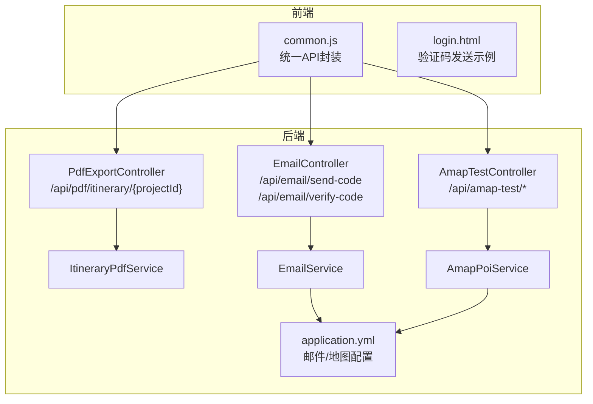
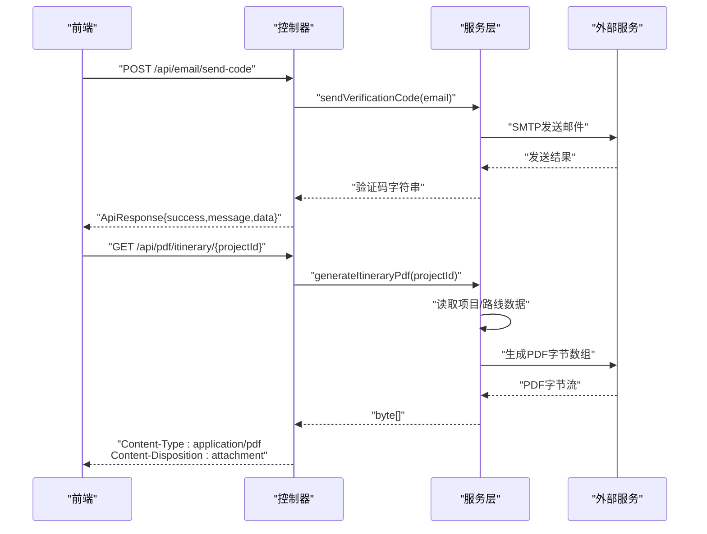
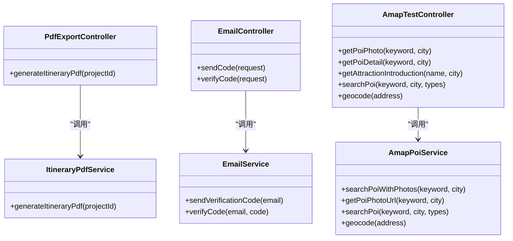

# 工具类API

<cite>
**本文引用的文件**
- [Application.java](file://tudianersha/src/main/java/com/tudianersha/Application.java)
- [application.yml](file://tudianersha/src/main/resources/application.yml)
- [PdfExportController.java](file://tudianersha/src/main/java/com/tudianersha/controller/PdfExportController.java)
- [EmailController.java](file://tudianersha/src/main/java/com/tudianersha/controller/EmailController.java)
- [AmapTestController.java](file://tudianersha/src/main/java/com/tudianersha/controller/AmapTestController.java)
- [ItineraryPdfService.java](file://tudianersha/src/main/java/com/tudianersha/service/ItineraryPdfService.java)
- [EmailService.java](file://tudianersha/src/main/java/com/tudianersha/service/EmailService.java)
- [AmapPoiService.java](file://tudianersha/src/main/java/com/tudianersha/service/AmapPoiService.java)
- [common.js](file://tudianersha/src/main/resources/static/js/common.js)
- [login.html](file://tudianersha/src/main/resources/static/login.html)
</cite>

## 目录
1. [简介](#简介)
2. [项目结构](#项目结构)
3. [核心组件](#核心组件)
4. [架构总览](#架构总览)
5. [详细组件分析](#详细组件分析)
6. [依赖关系分析](#依赖关系分析)
7. [性能与并发特性](#性能与并发特性)
8. [故障排查指南](#故障排查指南)
9. [结论](#结论)
10. [附录](#附录)

## 简介
本文件面向工具类API的使用者与维护者，聚焦以下能力：
- PDF导出：将指定项目的行程数据生成PDF并返回二进制流，便于前端下载。
- 邮件通知：基于QQ邮箱SMTP的验证码发送与校验流程。
- 地图服务：代理高德地图POI搜索、地理编码等能力，支持自动补全与图片提取。

同时给出各接口的调用方式、参数说明、错误处理策略以及建议的调用频率限制与重试策略。

## 项目结构
后端采用Spring Boot工程，主要模块划分如下：
- 控制器层：负责REST接口定义与请求转发。
- 服务层：封装业务逻辑，如PDF生成、邮件发送、地图服务代理。
- 配置：application.yml集中管理数据库、邮件、地图等外部服务配置。
- 前端静态资源：统一通过/common.js进行API封装，简化调用。

图表来源
- [PdfExportController.java](file://tudianersha/src/main/java/com/tudianersha/controller/PdfExportController.java#L1-L46)
- [EmailController.java](file://tudianersha/src/main/java/com/tudianersha/controller/EmailController.java#L1-L82)
- [AmapTestController.java](file://tudianersha/src/main/java/com/tudianersha/controller/AmapTestController.java#L1-L173)
- [ItineraryPdfService.java](file://tudianersha/src/main/java/com/tudianersha/service/ItineraryPdfService.java#L1-L168)
- [EmailService.java](file://tudianersha/src/main/java/com/tudianersha/service/EmailService.java#L1-L105)
- [AmapPoiService.java](file://tudianersha/src/main/java/com/tudianersha/service/AmapPoiService.java#L1-L363)
- [application.yml](file://tudianersha/src/main/resources/application.yml#L1-L57)
- [common.js](file://tudianersha/src/main/resources/static/js/common.js#L1-L42)
- [login.html](file://tudianersha/src/main/resources/static/login.html#L301-L347)

章节来源
- [Application.java](file://tudianersha/src/main/java/com/tudianersha/Application.java#L1-L12)
- [application.yml](file://tudianersha/src/main/resources/application.yml#L1-L57)

## 核心组件
- PDF导出控制器与服务：接收项目ID，读取项目与路线数据，生成PDF字节数组并通过响应头设置为PDF附件返回。
- 邮件服务：通过JavaMailSender使用QQ邮箱SMTP发送验证码；本地内存存储验证码（开发态），带过期控制。
- 地图服务：封装高德地图文本搜索、地理编码、图片提取等，支持自动补全与最佳匹配策略。

章节来源
- [PdfExportController.java](file://tudianersha/src/main/java/com/tudianersha/controller/PdfExportController.java#L1-L46)
- [ItineraryPdfService.java](file://tudianersha/src/main/java/com/tudianersha/service/ItineraryPdfService.java#L1-L168)
- [EmailController.java](file://tudianersha/src/main/java/com/tudianersha/controller/EmailController.java#L1-L82)
- [EmailService.java](file://tudianersha/src/main/java/com/tudianersha/service/EmailService.java#L1-L105)
- [AmapTestController.java](file://tudianersha/src/main/java/com/tudianersha/controller/AmapTestController.java#L1-L173)
- [AmapPoiService.java](file://tudianersha/src/main/java/com/tudianersha/service/AmapPoiService.java#L1-L363)

## 架构总览
后端通过控制器暴露REST接口，服务层完成具体任务，并依赖外部配置（邮件、地图）执行操作。前端通过common.js统一封装请求，简化跨域与响应解析。

图表来源
- [EmailController.java](file://tudianersha/src/main/java/com/tudianersha/controller/EmailController.java#L1-L82)
- [EmailService.java](file://tudianersha/src/main/java/com/tudianersha/service/EmailService.java#L1-L105)
- [PdfExportController.java](file://tudianersha/src/main/java/com/tudianersha/controller/PdfExportController.java#L1-L46)
- [ItineraryPdfService.java](file://tudianersha/src/main/java/com/tudianersha/service/ItineraryPdfService.java#L1-L168)
- [common.js](file://tudianersha/src/main/resources/static/js/common.js#L1-L42)

## 详细组件分析

### PDF导出：/api/pdf/itinerary/{projectId}
- 接口方法与路径
  - GET /api/pdf/itinerary/{projectId}
- 功能说明
  - 根据项目ID生成行程PDF，返回PDF字节流作为附件下载。
- 参数
  - 路径参数：projectId（Long），目标项目的唯一标识。
- 返回
  - 成功：200 OK，Content-Type: application/pdf，Content-Disposition: attachment；响应体为PDF字节流。
  - 失败：500 Internal Server Error。
- 错误处理
  - 项目不存在或未选择路线方案时抛出异常，控制器捕获并返回500。
- 性能与复杂度
  - 主要开销在PDF渲染与IO写入，时间复杂度近似O(n)，n为行程条目数量；空间复杂度与PDF大小成正比。
- 前端调用示例
  - 可参考common.js的apiRequest封装，直接发起GET请求并处理响应。

章节来源
- [PdfExportController.java](file://tudianersha/src/main/java/com/tudianersha/controller/PdfExportController.java#L1-L46)
- [ItineraryPdfService.java](file://tudianersha/src/main/java/com/tudianersha/service/ItineraryPdfService.java#L1-L168)
- [common.js](file://tudianersha/src/main/resources/static/js/common.js#L1-L42)

### 邮件通知：/api/email/send-code 与 /api/email/verify-code
- 接口方法与路径
  - POST /api/email/send-code
  - POST /api/email/verify-code
- 功能说明
  - send-code：向指定邮箱发送6位数字验证码（开发态会返回验证码以便调试）。
  - verify-code：校验邮箱与验证码是否匹配且未过期。
- 参数
  - send-code（JSON请求体）：email（字符串，必填，需符合邮箱格式）。
  - verify-code（JSON请求体）：email（字符串，必填）、code（字符串，必填）。
- 返回
  - send-code：ApiResponse对象，包含success、message、data（含code字段）。
  - verify-code：JSON对象，包含success（布尔）、message（字符串）。
- 错误处理
  - send-code：邮箱为空或格式不正确时返回错误；发送异常时返回“发送失败，请稍后重试”。
  - verify-code：参数缺失时返回400语义；验证码不存在、过期或不匹配时返回对应提示。
- 邮件SMTP集成（QQ邮箱）
  - 配置项位于application.yml，包含host、port、username、password、STARTTLS等。
  - 发送方地址来自spring.mail.username，主题与正文固定。
- 调用频率限制与重试策略
  - 建议：单IP/单邮箱每分钟不超过10次send-code请求；验证码有效期5分钟，过期即失效。
  - 重试：发送失败时建议指数退避重试（如1s、2s、4s、最大5次），避免触发限流。
- 前端调用示例
  - login.html中演示了发送验证码按钮的交互与倒计时逻辑，可参考其调用流程。

章节来源
- [EmailController.java](file://tudianersha/src/main/java/com/tudianersha/controller/EmailController.java#L1-L82)
- [EmailService.java](file://tudianersha/src/main/java/com/tudianersha/service/EmailService.java#L1-L105)
- [application.yml](file://tudianersha/src/main/resources/application.yml#L21-L38)
- [login.html](file://tudianersha/src/main/resources/static/login.html#L301-L347)
- [common.js](file://tudianersha/src/main/resources/static/js/common.js#L1-L42)

### 地图服务代理：/api/amap-test/*
- 接口方法与路径
  - GET /api/amap-test/poi-photo?keyword=...&city=...
  - GET /api/amap-test/poi-detail?keyword=...&city=...
  - GET /api/amap-test/attraction-intro?name=...&city=...
  - GET /api/amap-test/poi-search?keyword=...&city=...&types=...
  - GET /api/amap-test/geocode?address=...
- 功能说明
  - poi-photo：返回POI详情与首张图片URL。
  - poi-detail：返回POI详细信息（名称、地址、类型、经纬度、评分、价格、图片等）。
  - attraction-intro：调用AI生成景点介绍。
  - poi-search：按关键字与类型进行自动补全搜索。
  - geocode：将地址解析为城市信息。
- 参数
  - keyword：查询关键词（如景点名）。
  - city：城市名（默认“北京”）。
  - name：景点名称（用于AI介绍）。
  - types：POI类型过滤（默认若干类型组合）。
  - address：地址字符串。
- 返回
  - 成功：JSON对象，包含success字段与业务数据；部分接口可能返回空数组或默认占位图URL。
  - 失败：JSON对象，包含success=false与错误信息。
- 错误处理
  - 高德API调用失败或无结果时返回错误；对空值与数组/字符串差异做安全处理。
- 调用频率限制与重试策略
  - 建议：文本搜索与地理编码接口每分钟不超过30次；AI介绍接口按需调用，避免频繁触发。
  - 重试：网络异常或非200响应时建议指数退避重试（如1s、2s、4s、最大3次）。
- 与高德地图的关系
  - 通过AmapPoiService封装调用高德REST API，使用API Key与UTF-8编码参数。

章节来源
- [AmapTestController.java](file://tudianersha/src/main/java/com/tudianersha/controller/AmapTestController.java#L1-L173)
- [AmapPoiService.java](file://tudianersha/src/main/java/com/tudianersha/service/AmapPoiService.java#L1-L363)
- [application.yml](file://tudianersha/src/main/resources/application.yml#L54-L57)

## 依赖关系分析
- 控制器依赖服务层，服务层依赖外部配置（application.yml）。
- PDF导出依赖项目与路线仓库，渲染PDF依赖iText与中文字体。
- 邮件服务依赖JavaMailSender与QQ SMTP配置。
- 地图服务依赖OkHttp客户端与高德REST API。

图表来源
- [PdfExportController.java](file://tudianersha/src/main/java/com/tudianersha/controller/PdfExportController.java#L1-L46)
- [ItineraryPdfService.java](file://tudianersha/src/main/java/com/tudianersha/service/ItineraryPdfService.java#L1-L168)
- [EmailController.java](file://tudianersha/src/main/java/com/tudianersha/controller/EmailController.java#L1-L82)
- [EmailService.java](file://tudianersha/src/main/java/com/tudianersha/service/EmailService.java#L1-L105)
- [AmapTestController.java](file://tudianersha/src/main/java/com/tudianersha/controller/AmapTestController.java#L1-L173)
- [AmapPoiService.java](file://tudianersha/src/main/java/com/tudianersha/service/AmapPoiService.java#L1-L363)

## 性能与并发特性
- PDF导出
  - 渲染复杂度与行程条目数量线性相关；建议在生成前对数据进行分页或裁剪，避免超大PDF导致内存压力。
  - 建议启用浏览器端预览与断点续传（若需要），或在服务端缓存近期生成的PDF以减少重复计算。
- 邮件发送
  - JavaMailSender为阻塞式，建议在异步线程池中执行发送任务，避免阻塞主线程。
  - 合理设置超时与重试，避免大量并发导致SMTP服务器限流。
- 地图服务
  - OkHttp客户端设置连接/读取超时，建议结合指数退避与熔断策略，防止雪崩效应。
  - 对高德API的响应进行缓存（如热点POI），降低重复请求次数。

[本节为通用指导，无需列出章节来源]

## 故障排查指南
- PDF导出
  - 现象：返回500或空白PDF。
  - 排查：确认项目ID存在且已选择路线方案；检查PDF字体与中文字体配置；查看服务端日志定位异常。
- 邮件发送
  - 现象：send-code返回失败或验证码未收到。
  - 排查：核对application.yml中的SMTP配置（host/port/username/password/starttls）；检查网络连通性；查看服务端异常堆栈；开发态下验证码会随响应返回，便于快速验证。
- 地图服务
  - 现象：poi-search/poi-detail返回空或错误。
  - 排查：确认高德API Key有效；检查keyword与city参数编码；查看服务端日志中的原始响应；必要时增加types过滤条件提升命中率。

章节来源
- [PdfExportController.java](file://tudianersha/src/main/java/com/tudianersha/controller/PdfExportController.java#L1-L46)
- [EmailController.java](file://tudianersha/src/main/java/com/tudianersha/controller/EmailController.java#L1-L82)
- [EmailService.java](file://tudianersha/src/main/java/com/tudianersha/service/EmailService.java#L1-L105)
- [AmapTestController.java](file://tudianersha/src/main/java/com/tudianersha/controller/AmapTestController.java#L1-L173)
- [AmapPoiService.java](file://tudianersha/src/main/java/com/tudianersha/service/AmapPoiService.java#L1-L363)

## 结论
本工具类API围绕PDF导出、邮件通知与地图服务展开，具备清晰的分层设计与可扩展性。建议在生产环境中完善限流与重试策略、引入异步队列与缓存，并加强监控与告警，以保障稳定性与用户体验。

[本节为总结性内容，无需列出章节来源]

## 附录

### 接口一览与调用建议
- PDF导出
  - 方法：GET
  - 路径：/api/pdf/itinerary/{projectId}
  - 建议：前端直接下载，避免二次传输；服务端生成后立即返回。
- 邮件通知
  - 方法：POST
  - 路径：/api/email/send-code
  - 请求体：{ email }
  - 建议：前端校验邮箱格式；发送后开启60秒倒计时；失败时指数退避重试。
  - 方法：POST
  - 路径：/api/email/verify-code
  - 请求体：{ email, code }
  - 建议：验证码有效期5分钟，过期需重新发送。
- 地图服务代理
  - 方法：GET
  - 路径：/api/amap-test/poi-photo?keyword=...&city=...
  - 建议：对常用POI做缓存；图片URL不可用时回退默认占位图。
  - 方法：GET
  - 路径：/api/amap-test/poi-detail?keyword=...&city=...
  - 建议：对返回字段做空值保护；当无结果时返回明确提示。
  - 方法：GET
  - 路径：/api/amap-test/poi-search?keyword=...&city=...&types=...
  - 建议：types按需精简；offset/page合理分页。
  - 方法：GET
  - 路径：/api/amap-test/geocode?address=...
  - 建议：地址尽量精确；失败时提供备选城市提取逻辑。

### 配置要点（application.yml）
- 邮件（QQ SMTP）
  - host: smtp.qq.com
  - port: 587
  - username: 发件邮箱
  - password: 授权码
  - starttls: enable=true, required=true
- 高德地图
  - amap.api.key: 高德API Key

章节来源
- [application.yml](file://tudianersha/src/main/resources/application.yml#L21-L57)