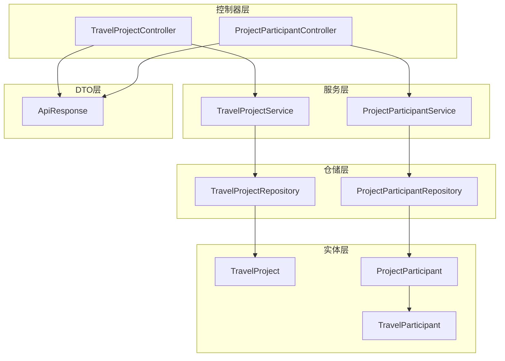
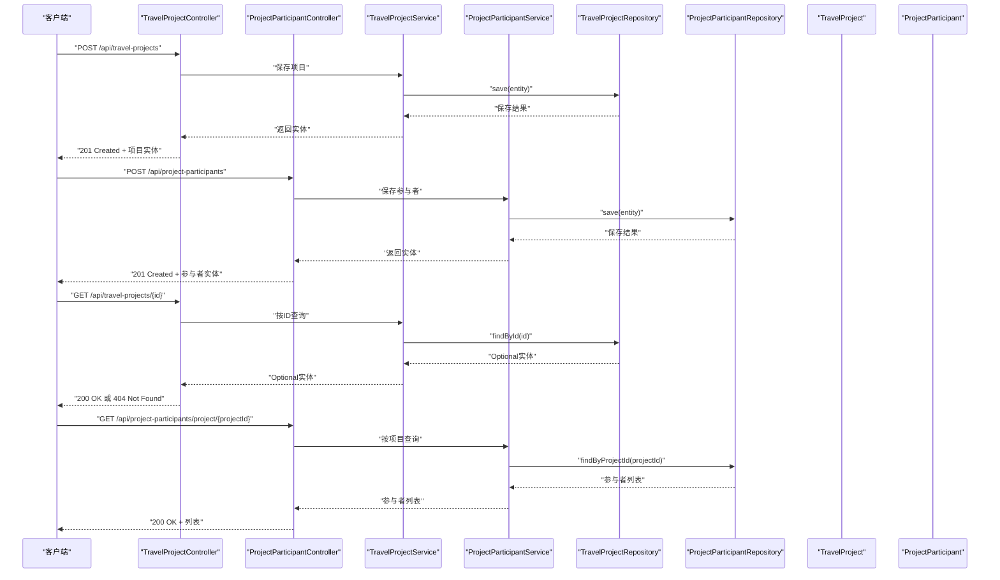
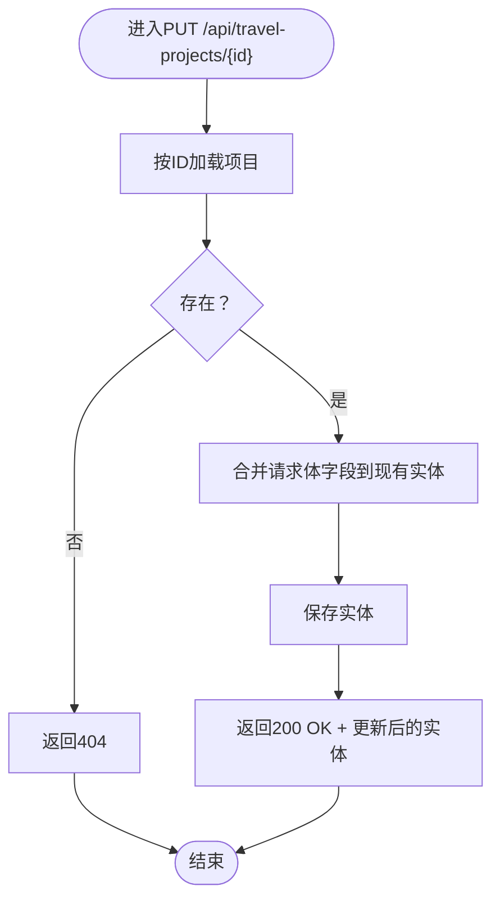
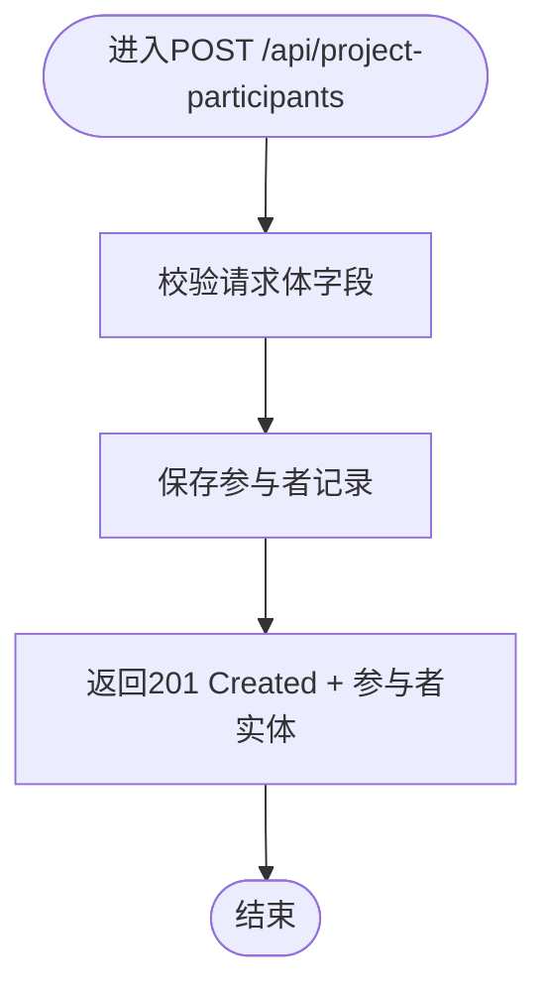
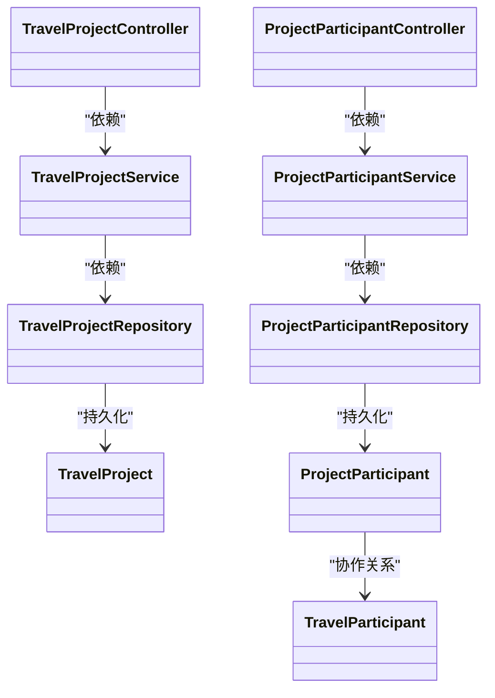

# 旅行项目管理API

<cite>
**本文引用的文件**
- [TravelProjectController.java](file://tudianersha/src/main/java/com/tudianersha/controller/TravelProjectController.java)
- [TravelProject.java](file://tudianersha/src/main/java/com/tudianersha/entity/TravelProject.java)
- [TravelProjectService.java](file://tudianersha/src/main/java/com/tudianersha/service/TravelProjectService.java)
- [TravelProjectRepository.java](file://tudianersha/src/main/java/com/tudianersha/repository/TravelProjectRepository.java)
- [ProjectParticipantController.java](file://tudianersha/src/main/java/com/tudianersha/controller/ProjectParticipantController.java)
- [ProjectParticipant.java](file://tudianersha/src/main/java/com/tudianersha/entity/ProjectParticipant.java)
- [ProjectParticipantService.java](file://tudianersha/src/main/java/com/tudianersha/service/ProjectParticipantService.java)
- [ProjectParticipantRepository.java](file://tudianersha/src/main/java/com/tudianersha/repository/ProjectParticipantRepository.java)
- [TravelParticipant.java](file://tudianersha/src/main/java/com/tudianersha/entity/TravelParticipant.java)
- [TravelParticipantRepository.java](file://tudianersha/src/main/java/com/tudianersha/repository/TravelParticipantRepository.java)
- [ApiResponse.java](file://tudianersha/src/main/java/com/tudianersha/dto/ApiResponse.java)
- [application.yml](file://tudianersha/src/main/resources/application.yml)
- [create-project.html](file://tudianersha/src/main/resources/static/create-project.html)
- [participants-status.html](file://tudianersha/src/main/resources/static/participants-status.html)
- [index.html](file://tudianersha/src/main/resources/static/index.html)
</cite>

## 目录
1. [简介](#简介)
2. [项目结构](#项目结构)
3. [核心组件](#核心组件)
4. [架构总览](#架构总览)
5. [详细组件分析](#详细组件分析)
6. [依赖分析](#依赖分析)
7. [性能考虑](#性能考虑)
8. [故障排查指南](#故障排查指南)
9. [结论](#结论)
10. [附录](#附录)

## 简介
本文件面向“旅行项目管理API”的开发与使用，聚焦于旅行项目的全生命周期管理与参与者协作能力。重点覆盖以下API：
- 旅行项目管理：POST /api/travel-projects（创建项目）、GET /api/travel-projects/{id}（获取项目详情）、PUT /api/travel-projects/{id}（更新项目）、DELETE /api/travel-projects/{id}（删除项目）
- 参与者管理：POST /api/project-participants（邀请成员）
- 项目与参与者的关系在API中的体现方式
- 项目状态同步机制如何通过API触发（结合前端逻辑）

本API基于Spring Boot + JPA实现，采用分层架构：Controller -> Service -> Repository -> Entity，统一返回结构由通用响应封装类提供。

## 项目结构
后端采用标准MVC分层：
- 控制器层：处理HTTP请求与响应，定义REST接口
- 服务层：封装业务逻辑，协调仓储访问
- 仓储层：JPA仓库接口，提供数据持久化能力
- 实体层：数据库映射实体，包含字段与基本方法
- DTO层：统一响应封装，便于前后端交互

图表来源
- [TravelProjectController.java](file://tudianersha/src/main/java/com/tudianersha/controller/TravelProjectController.java#L1-L85)
- [ProjectParticipantController.java](file://tudianersha/src/main/java/com/tudianersha/controller/ProjectParticipantController.java#L1-L91)
- [TravelProjectService.java](file://tudianersha/src/main/java/com/tudianersha/service/TravelProjectService.java#L1-L40)
- [ProjectParticipantService.java](file://tudianersha/src/main/java/com/tudianersha/service/ProjectParticipantService.java#L1-L48)
- [TravelProjectRepository.java](file://tudianersha/src/main/java/com/tudianersha/repository/TravelProjectRepository.java#L1-L13)
- [ProjectParticipantRepository.java](file://tudianersha/src/main/java/com/tudianersha/repository/ProjectParticipantRepository.java#L1-L16)
- [TravelProject.java](file://tudianersha/src/main/java/com/tudianersha/entity/TravelProject.java#L1-L163)
- [ProjectParticipant.java](file://tudianersha/src/main/java/com/tudianersha/entity/ProjectParticipant.java#L1-L87)
- [TravelParticipant.java](file://tudianersha/src/main/java/com/tudianersha/entity/TravelParticipant.java#L1-L73)
- [ApiResponse.java](file://tudianersha/src/main/java/com/tudianersha/dto/ApiResponse.java#L1-L80)

章节来源
- [TravelProjectController.java](file://tudianersha/src/main/java/com/tudianersha/controller/TravelProjectController.java#L1-L85)
- [ProjectParticipantController.java](file://tudianersha/src/main/java/com/tudianersha/controller/ProjectParticipantController.java#L1-L91)
- [TravelProjectService.java](file://tudianersha/src/main/java/com/tudianersha/service/TravelProjectService.java#L1-L40)
- [ProjectParticipantService.java](file://tudianersha/src/main/java/com/tudianersha/service/ProjectParticipantService.java#L1-L48)
- [TravelProjectRepository.java](file://tudianersha/src/main/java/com/tudianersha/repository/TravelProjectRepository.java#L1-L13)
- [ProjectParticipantRepository.java](file://tudianersha/src/main/java/com/tudianersha/repository/ProjectParticipantRepository.java#L1-L16)
- [TravelProject.java](file://tudianersha/src/main/java/com/tudianersha/entity/TravelProject.java#L1-L163)
- [ProjectParticipant.java](file://tudianersha/src/main/java/com/tudianersha/entity/ProjectParticipant.java#L1-L87)
- [TravelParticipant.java](file://tudianersha/src/main/java/com/tudianersha/entity/TravelParticipant.java#L1-L73)
- [ApiResponse.java](file://tudianersha/src/main/java/com/tudianersha/dto/ApiResponse.java#L1-L80)

## 核心组件
- 旅行项目控制器：提供旅行项目的增删改查与按创建者/状态筛选接口
- 项目参与者控制器：提供参与者增删改查与按项目/用户筛选接口
- 服务层：封装数据访问与业务逻辑
- 仓储层：基于JPA的数据访问接口
- 实体模型：旅行项目与项目参与者，以及旅行参与者（用于权限控制）
- 统一响应封装：统一返回结构，便于前后端一致处理

章节来源
- [TravelProjectController.java](file://tudianersha/src/main/java/com/tudianersha/controller/TravelProjectController.java#L1-L85)
- [ProjectParticipantController.java](file://tudianersha/src/main/java/com/tudianersha/controller/ProjectParticipantController.java#L1-L91)
- [TravelProjectService.java](file://tudianersha/src/main/java/com/tudianersha/service/TravelProjectService.java#L1-L40)
- [ProjectParticipantService.java](file://tudianersha/src/main/java/com/tudianersha/service/ProjectParticipantService.java#L1-L48)
- [TravelProjectRepository.java](file://tudianersha/src/main/java/com/tudianersha/repository/TravelProjectRepository.java#L1-L13)
- [ProjectParticipantRepository.java](file://tudianersha/src/main/java/com/tudianersha/repository/ProjectParticipantRepository.java#L1-L16)
- [TravelProject.java](file://tudianersha/src/main/java/com/tudianersha/entity/TravelProject.java#L1-L163)
- [ProjectParticipant.java](file://tudianersha/src/main/java/com/tudianersha/entity/ProjectParticipant.java#L1-L87)
- [TravelParticipant.java](file://tudianersha/src/main/java/com/tudianersha/entity/TravelParticipant.java#L1-L73)
- [ApiResponse.java](file://tudianersha/src/main/java/com/tudianersha/dto/ApiResponse.java#L1-L80)

## 架构总览
下图展示旅行项目与参与者API的调用链与数据流：

图表来源
- [TravelProjectController.java](file://tudianersha/src/main/java/com/tudianersha/controller/TravelProjectController.java#L1-L85)
- [ProjectParticipantController.java](file://tudianersha/src/main/java/com/tudianersha/controller/ProjectParticipantController.java#L1-L91)
- [TravelProjectService.java](file://tudianersha/src/main/java/com/tudianersha/service/TravelProjectService.java#L1-L40)
- [ProjectParticipantService.java](file://tudianersha/src/main/java/com/tudianersha/service/ProjectParticipantService.java#L1-L48)
- [TravelProjectRepository.java](file://tudianersha/src/main/java/com/tudianersha/repository/TravelProjectRepository.java#L1-L13)
- [ProjectParticipantRepository.java](file://tudianersha/src/main/java/com/tudianersha/repository/ProjectParticipantRepository.java#L1-L16)

## 详细组件分析

### 旅行项目API（TravelProject）
- 接口概览
  - POST /api/travel-projects：创建旅行项目
  - GET /api/travel-projects/{id}：按ID获取项目详情
  - PUT /api/travel-projects/{id}：更新项目信息
  - DELETE /api/travel-projects/{id}：删除项目
  - GET /api/travel-projects/creator/{creatorId}：按创建者筛选
  - GET /api/travel-projects/status/{status}：按状态筛选

- 请求体字段说明（来自实体模型）
  - projectName：项目名称（字符串，必填）
  - destination：目的地（字符串，必填）
  - days：天数（整数，必填）
  - creatorId：创建者ID（长整型，必填）
  - status：项目状态（字符串，必填；取值范围见实体注释）
  - createdTime：创建时间（时间戳，必填）
  - updatedTime：更新时间（时间戳，必填）
  - currentRouteId：当前方案ID（长整型，可选）
  - startDate：开始日期（字符串，可选）
  - endDate：结束日期（字符串，可选）

- 响应说明
  - 成功：200 OK 或 201 Created，返回对应实体
  - 不存在：404 Not Found
  - 删除：204 No Content

- 关键流程图（更新项目）

图表来源
- [TravelProjectController.java](file://tudianersha/src/main/java/com/tudianersha/controller/TravelProjectController.java#L36-L61)
- [TravelProjectService.java](file://tudianersha/src/main/java/com/tudianersha/service/TravelProjectService.java#L21-L27)
- [TravelProjectRepository.java](file://tudianersha/src/main/java/com/tudianersha/repository/TravelProjectRepository.java#L1-L13)

章节来源
- [TravelProjectController.java](file://tudianersha/src/main/java/com/tudianersha/controller/TravelProjectController.java#L1-L85)
- [TravelProjectService.java](file://tudianersha/src/main/java/com/tudianersha/service/TravelProjectService.java#L1-L40)
- [TravelProjectRepository.java](file://tudianersha/src/main/java/com/tudianersha/repository/TravelProjectRepository.java#L1-L13)
- [TravelProject.java](file://tudianersha/src/main/java/com/tudianersha/entity/TravelProject.java#L1-L163)

### 项目参与者API（ProjectParticipant）
- 接口概览
  - POST /api/project-participants：创建参与者（邀请成员）
  - GET /api/project-participants/{id}：按ID获取参与者
  - PUT /api/project-participants/{id}：更新参与者（可选字段）
  - DELETE /api/project-participants/{id}：删除参与者
  - GET /api/project-participants/project/{projectId}：按项目查询
  - GET /api/project-participants/user/{userId}：按用户查询

- 请求体字段说明（来自实体模型）
  - projectId：项目ID（长整型，必填）
  - userId：用户ID（长整型，必填）
  - joinTime：加入时间（时间戳，必填）
  - role：角色（字符串，必填；取值范围见实体注释）

- 响应说明
  - 成功：200 OK 或 201 Created，返回对应实体
  - 不存在：404 Not Found
  - 删除：204 No Content

- 关键流程图（邀请成员）

图表来源
- [ProjectParticipantController.java](file://tudianersha/src/main/java/com/tudianersha/controller/ProjectParticipantController.java#L1-L91)
- [ProjectParticipantService.java](file://tudianersha/src/main/java/com/tudianersha/service/ProjectParticipantService.java#L17-L27)
- [ProjectParticipantRepository.java](file://tudianersha/src/main/java/com/tudianersha/repository/ProjectParticipantRepository.java#L1-L16)

章节来源
- [ProjectParticipantController.java](file://tudianersha/src/main/java/com/tudianersha/controller/ProjectParticipantController.java#L1-L91)
- [ProjectParticipantService.java](file://tudianersha/src/main/java/com/tudianersha/service/ProjectParticipantService.java#L1-L48)
- [ProjectParticipantRepository.java](file://tudianersha/src/main/java/com/tudianersha/repository/ProjectParticipantRepository.java#L1-L16)
- [ProjectParticipant.java](file://tudianersha/src/main/java/com/tudianersha/entity/ProjectParticipant.java#L1-L87)

### 旅行参与者API（TravelParticipant）
- 用途说明
  - 旅行参与者实体用于项目内的权限控制（如成员、编辑者等），与项目参与者（ProjectParticipant）共同构成项目协作体系
- 关键点
  - 旅行参与者通常在用户进入协作流程时被添加，作为项目内权限的补充
  - 旅行参与者与项目参与者在不同维度协作：前者侧重权限，后者侧重成员身份

章节来源
- [TravelParticipant.java](file://tudianersha/src/main/java/com/tudianersha/entity/TravelParticipant.java#L1-L73)
- [TravelParticipantRepository.java](file://tudianersha/src/main/java/com/tudianersha/repository/TravelParticipantRepository.java#L1-L17)

### 项目与参与者的关系在API中的体现
- 旅行项目与项目参与者通过外键（projectId）关联
- 前端在创建项目后，会自动检查当前用户是否已在项目参与者列表中，若无则自动邀请（POST /api/project-participants）
- 前端在“参与者状态页”会拉取项目参与者列表，并进一步查询用户信息与需求提交状态，以展示协作进度

章节来源
- [create-project.html](file://tudianersha/src/main/resources/static/create-project.html#L1296-L1323)
- [participants-status.html](file://tudianersha/src/main/resources/static/participants-status.html#L274-L296)
- [index.html](file://tudianersha/src/main/resources/static/index.html#L399-L484)

### 项目状态同步机制如何通过API触发
- 项目状态同步并非由单一API直接触发，而是通过以下方式协同实现：
  - 前端在首页根据项目状态动态渲染状态标签
  - 前端在项目详情页根据参与者数量与角色动态展示协作状态
  - 项目状态字段（status）由后端在创建/更新时维护，前端据此刷新UI
- 因此，项目状态的“同步”主要体现在：
  - 后端在更新项目时写入最新状态
  - 前端在读取项目详情或参与者列表时，依据后端返回的状态进行UI同步

章节来源
- [index.html](file://tudianersha/src/main/resources/static/index.html#L399-L484)
- [TravelProjectController.java](file://tudianersha/src/main/java/com/tudianersha/controller/TravelProjectController.java#L36-L61)
- [TravelProject.java](file://tudianersha/src/main/java/com/tudianersha/entity/TravelProject.java#L1-L163)

## 依赖分析
- 控制器依赖服务层，服务层依赖仓储层，仓储层依赖实体
- 旅行项目与项目参与者分别有独立的控制器、服务与仓储
- 旅行参与者与项目参与者共同支撑项目协作权限与成员管理

图表来源
- [TravelProjectController.java](file://tudianersha/src/main/java/com/tudianersha/controller/TravelProjectController.java#L1-L85)
- [ProjectParticipantController.java](file://tudianersha/src/main/java/com/tudianersha/controller/ProjectParticipantController.java#L1-L91)
- [TravelProjectService.java](file://tudianersha/src/main/java/com/tudianersha/service/TravelProjectService.java#L1-L40)
- [ProjectParticipantService.java](file://tudianersha/src/main/java/com/tudianersha/service/ProjectParticipantService.java#L1-L48)
- [TravelProjectRepository.java](file://tudianersha/src/main/java/com/tudianersha/repository/TravelProjectRepository.java#L1-L13)
- [ProjectParticipantRepository.java](file://tudianersha/src/main/java/com/tudianersha/repository/ProjectParticipantRepository.java#L1-L16)
- [TravelProject.java](file://tudianersha/src/main/java/com/tudianersha/entity/TravelProject.java#L1-L163)
- [ProjectParticipant.java](file://tudianersha/src/main/java/com/tudianersha/entity/ProjectParticipant.java#L1-L87)
- [TravelParticipant.java](file://tudianersha/src/main/java/com/tudianersha/entity/TravelParticipant.java#L1-L73)

## 性能考虑
- 数据库层面
  - 使用JPA的findByXXX方法进行条件查询，建议在高频查询字段上建立索引（如creatorId、status、projectId、userId）
- 服务层
  - 批量操作建议使用事务包裹，避免频繁小事务带来的开销
- 控制器
  - 对于大列表查询，建议增加分页参数，避免一次性返回过多数据
- 前端
  - 在项目详情页与参与者页，建议缓存最近一次查询结果，减少重复请求

## 故障排查指南
- 404 Not Found
  - 现象：查询项目或参与者不存在
  - 排查：确认ID是否正确；确认是否存在软删除或数据迁移导致的缺失
- 400 Bad Request
  - 现象：请求体字段缺失或类型不匹配
  - 排查：核对请求体字段与实体定义；确保必填字段齐全
- 500 Internal Server Error
  - 现象：服务器异常
  - 排查：查看日志配置与数据库连接；确认DDL自动更新策略与数据库版本兼容性
- 配置问题
  - 数据源与JPA配置位于应用配置文件中，若连接失败，请检查数据库URL、用户名、密码与驱动

章节来源
- [application.yml](file://tudianersha/src/main/resources/application.yml#L1-L57)

## 结论
本API围绕旅行项目与项目参与者两大核心模块构建，提供完整的CRUD与筛选能力，并通过前端逻辑实现“邀请成员”与“状态同步”。建议在生产环境中：
- 为高频查询字段建立索引
- 引入分页与缓存策略
- 完善错误码与日志输出
- 明确项目状态枚举与权限边界，确保前后端一致

## 附录

### API定义与示例

- 创建旅行项目
  - 方法与路径：POST /api/travel-projects
  - 请求体字段：projectName、destination、days、creatorId、status、createdTime、updatedTime、currentRouteId（可选）、startDate（可选）、endDate（可选）
  - 示例（请求）
  - 示例（响应）
    - 201 Created + 旅行项目实体

- 获取旅行项目详情
  - 方法与路径：GET /api/travel-projects/{id}
  - 示例（响应）
    - 200 OK + 旅行项目实体
    - 404 Not Found

- 更新旅行项目
  - 方法与路径：PUT /api/travel-projects/{id}
  - 请求体字段：同创建接口（可部分字段）
  - 示例（响应）
    - 200 OK + 更新后的旅行项目实体
    - 404 Not Found

- 删除旅行项目
  - 方法与路径：DELETE /api/travel-projects/{id}
  - 示例（响应）
    - 204 No Content
    - 404 Not Found

- 邀请成员（创建项目参与者）
  - 方法与路径：POST /api/project-participants
  - 请求体字段：projectId、userId、joinTime、role
  - 示例（请求）
  - 示例（响应）
    - 201 Created + 项目参与者实体

- 获取项目参与者列表
  - 方法与路径：GET /api/project-participants/project/{projectId}
  - 示例（响应）
    - 200 OK + 参与者列表

- 获取旅行参与者（权限）
  - 方法与路径：GET /api/travel-participants/project/{projectId}
  - 示例（响应）
    - 200 OK + 旅行参与者列表

章节来源
- [TravelProjectController.java](file://tudianersha/src/main/java/com/tudianersha/controller/TravelProjectController.java#L1-L85)
- [ProjectParticipantController.java](file://tudianersha/src/main/java/com/tudianersha/controller/ProjectParticipantController.java#L1-L91)
- [TravelProject.java](file://tudianersha/src/main/java/com/tudianersha/entity/TravelProject.java#L1-L163)
- [ProjectParticipant.java](file://tudianersha/src/main/java/com/tudianersha/entity/ProjectParticipant.java#L1-L87)
- [TravelParticipant.java](file://tudianersha/src/main/java/com/tudianersha/entity/TravelParticipant.java#L1-L73)