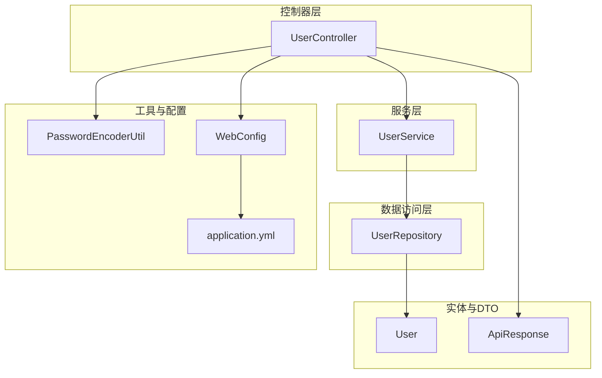
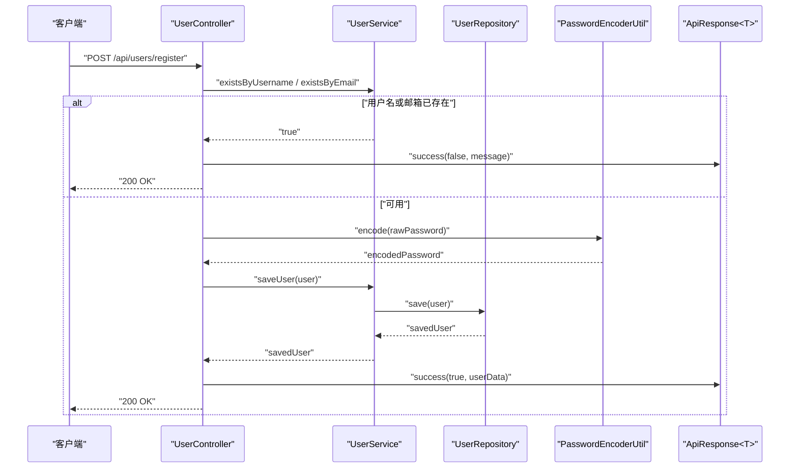
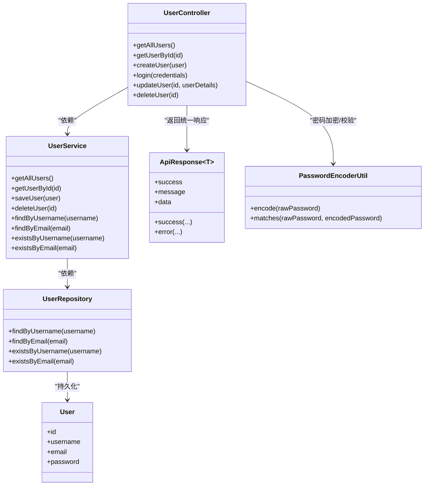

# 用户管理API

<cite>
**本文引用的文件列表**
- [UserController.java](file://tudianersha/src/main/java/com/tudianersha/controller/UserController.java)
- [ApiResponse.java](file://tudianersha/src/main/java/com/tudianersha/dto/ApiResponse.java)
- [User.java](file://tudianersha/src/main/java/com/tudianersha/entity/User.java)
- [UserService.java](file://tudianersha/src/main/java/com/tudianersha/service/UserService.java)
- [UserRepository.java](file://tudianersha/src/main/java/com/tudianersha/repository/UserRepository.java)
- [PasswordEncoderUtil.java](file://tudianersha/src/main/java/com/tudianersha/util/PasswordEncoderUtil.java)
- [WebConfig.java](file://tudianersha/src/main/java/com/tudianersha/config/WebConfig.java)
- [application.yml](file://tudianersha/src/main/resources/application.yml)
</cite>

## 目录
1. [简介](#简介)
2. [项目结构与入口](#项目结构与入口)
3. [核心组件](#核心组件)
4. [架构总览](#架构总览)
5. [详细接口文档](#详细接口文档)
6. [依赖关系分析](#依赖关系分析)
7. [性能与安全考量](#性能与安全考量)
8. [故障排查指南](#故障排查指南)
9. [结论](#结论)

## 简介
本文件为 UserController 类的完整API文档，覆盖用户注册、登录、查询、更新与删除等端点。文档详细说明每个接口的HTTP方法、URL路径、请求头、请求体JSON结构、响应体结构（统一 ApiResponse<T> 格式）、状态码以及安全注意事项，并提供 curl 与 JavaScript fetch 的实际调用示例。同时解释密码加密机制（PasswordEncoderUtil）在API层面的表现，说明当前会话管理现状（无JWT，未来可扩展），并标注敏感操作的安全建议。

## 项目结构与入口
- 控制器层：UserController 提供REST接口，位于包 com.tudianersha.controller。
- 数据传输对象：ApiResponse<T> 统一响应格式，位于包 com.tudianersha.dto。
- 实体模型：User 表示用户实体，位于包 com.tudianersha.entity。
- 服务层：UserService 封装业务逻辑，位于包 com.tudianersha.service。
- 数据访问层：UserRepository 继承JPA，位于包 com.tudianersha.repository。
- 工具类：PasswordEncoderUtil 使用BCrypt进行密码加密与校验，位于包 com.tudianersha.util。
- 跨域配置：WebConfig 允许跨域访问 /api/**，位于包 com.tudianersha.config。
- 应用配置：application.yml 定义数据库连接、JPA参数、日志级别等，位于 resources。

图表来源
- [UserController.java](file://tudianersha/src/main/java/com/tudianersha/controller/UserController.java#L1-L152)
- [UserService.java](file://tudianersha/src/main/java/com/tudianersha/service/UserService.java#L1-L48)
- [UserRepository.java](file://tudianersha/src/main/java/com/tudianersha/repository/UserRepository.java#L1-L15)
- [User.java](file://tudianersha/src/main/java/com/tudianersha/entity/User.java#L1-L73)
- [ApiResponse.java](file://tudianersha/src/main/java/com/tudianersha/dto/ApiResponse.java#L1-L80)
- [PasswordEncoderUtil.java](file://tudianersha/src/main/java/com/tudianersha/util/PasswordEncoderUtil.java#L1-L33)
- [WebConfig.java](file://tudianersha/src/main/java/com/tudianersha/config/WebConfig.java#L1-L24)
- [application.yml](file://tudianersha/src/main/resources/application.yml#L1-L57)

章节来源
- [UserController.java](file://tudianersha/src/main/java/com/tudianersha/controller/UserController.java#L1-L152)
- [WebConfig.java](file://tudianersha/src/main/java/com/tudianersha/config/WebConfig.java#L1-L24)
- [application.yml](file://tudianersha/src/main/resources/application.yml#L1-L57)

## 核心组件
- 统一响应格式 ApiResponse<T>
  - 字段：success（布尔）、message（字符串）、data（泛型数据）。
  - 方法：success(...)、error(...) 用于构造成功/失败响应。
- 用户实体 User
  - 字段：id、username、email、password。
- 密码加密工具 PasswordEncoderUtil
  - encode(rawPassword)：对原始密码进行BCrypt加密。
  - matches(rawPassword, encodedPassword)：验证原始密码与加密密码是否匹配。
- 服务层 UserService
  - 提供查询、保存、删除、存在性检查、按用户名/邮箱查找等方法。
- 数据访问层 UserRepository
  - 继承JPA，提供按用户名/邮箱查询与存在性检查。

章节来源
- [ApiResponse.java](file://tudianersha/src/main/java/com/tudianersha/dto/ApiResponse.java#L1-L80)
- [User.java](file://tudianersha/src/main/java/com/tudianersha/entity/User.java#L1-L73)
- [PasswordEncoderUtil.java](file://tudianersha/src/main/java/com/tudianersha/util/PasswordEncoderUtil.java#L1-L33)
- [UserService.java](file://tudianersha/src/main/java/com/tudianersha/service/UserService.java#L1-L48)
- [UserRepository.java](file://tudianersha/src/main/java/com/tudianersha/repository/UserRepository.java#L1-L15)

## 架构总览
下图展示用户相关接口的调用链与组件交互。

图表来源
- [UserController.java](file://tudianersha/src/main/java/com/tudianersha/controller/UserController.java#L42-L84)
- [UserService.java](file://tudianersha/src/main/java/com/tudianersha/service/UserService.java#L25-L48)
- [UserRepository.java](file://tudianersha/src/main/java/com/tudianersha/repository/UserRepository.java#L9-L15)
- [PasswordEncoderUtil.java](file://tudianersha/src/main/java/com/tudianersha/util/PasswordEncoderUtil.java#L19-L31)
- [ApiResponse.java](file://tudianersha/src/main/java/com/tudianersha/dto/ApiResponse.java#L23-L46)

## 详细接口文档

### 通用约定
- 基础路径：/api/users
- 统一响应体结构：ApiResponse<T>
  - 字段：
    - success：布尔值，表示请求是否成功
    - message：字符串，描述本次操作的结果信息
    - data：泛型数据，承载具体业务数据（如用户信息）
- 跨域策略：/api/** 允许任意来源、任意方法、任意头部，且不携带凭据
- 会话管理：当前未实现JWT；登录成功后返回用户信息，前端可自行维护会话（例如存储于本地存储或内存中）

章节来源
- [ApiResponse.java](file://tudianersha/src/main/java/com/tudianersha/dto/ApiResponse.java#L1-L80)
- [WebConfig.java](file://tudianersha/src/main/java/com/tudianersha/config/WebConfig.java#L1-L24)

### POST /api/users/register（用户注册）
- 功能：注册新用户
- 请求方法：POST
- URL：/api/users/register
- 请求头：
  - Content-Type: application/json
- 请求体JSON结构（User）
  - 字段：
    - username：字符串，必填
    - email：字符串，必填
    - password：字符串，必填
- 响应体JSON结构（ApiResponse<Map<String,Object>>）
  - data 包含：
    - id：数字，用户ID
    - username：字符串，用户名
    - email：字符串，邮箱
- 可能返回的状态码：
  - 200：注册成功
  - 400：用户名已存在或邮箱已被注册
  - 500：服务器内部错误
- curl 示例：
  - curl -X POST http://localhost:8010/api/users -H "Content-Type: application/json" -d '{"username":"张三","email":"zhangsan@example.com","password":"123456"}'
- JavaScript fetch 示例：
  - fetch('http://localhost:8010/api/users', {
      method: 'POST',
      headers: { 'Content-Type': 'application/json' },
      body: JSON.stringify({ username: "张三", email: "zhangsan@example.com", password: "123456" })
    }).then(r => r.json()).then(console.log);

章节来源
- [UserController.java](file://tudianersha/src/main/java/com/tudianersha/controller/UserController.java#L42-L84)
- [UserService.java](file://tudianersha/src/main/java/com/tudianersha/service/UserService.java#L41-L48)
- [PasswordEncoderUtil.java](file://tudianersha/src/main/java/com/tudianersha/util/PasswordEncoderUtil.java#L19-L31)
- [application.yml](file://tudianersha/src/main/resources/application.yml#L1-L20)

### POST /api/users/login（用户登录）
- 功能：用户名或邮箱+密码登录
- 请求方法：POST
- URL：/api/users/login
- 请求头：
  - Content-Type: application/json
- 请求体JSON结构（Map<String,String>）
  - account：字符串，用户名或邮箱，必填
  - password：字符串，密码，必填
- 响应体JSON结构（ApiResponse<Map<String,Object>>）
  - data 包含：
    - id：数字，用户ID
    - username：字符串，用户名
    - email：字符串，邮箱
- 可能返回的状态码：
  - 200：登录成功
  - 400：用户名或密码错误
- curl 示例：
  - curl -X POST http://localhost:8010/api/users/login -H "Content-Type: application/json" -d '{"account":"张三","password":"123456"}'
- JavaScript fetch 示例：
  - fetch('http://localhost:8010/api/users/login', {
      method: 'POST',
      headers: { 'Content-Type': 'application/json' },
      body: JSON.stringify({ account: "张三", password: "123456" })
    }).then(r => r.json()).then(console.log);

章节来源
- [UserController.java](file://tudianersha/src/main/java/com/tudianersha/controller/UserController.java#L86-L124)
- [UserService.java](file://tudianersha/src/main/java/com/tudianersha/service/UserService.java#L33-L40)
- [PasswordEncoderUtil.java](file://tudianersha/src/main/java/com/tudianersha/util/PasswordEncoderUtil.java#L29-L31)

### GET /api/users/{id}（获取用户信息）
- 功能：根据用户ID获取用户信息
- 请求方法：GET
- URL：/api/users/{id}
- 路径参数：
  - id：数字，用户ID
- 响应体JSON结构（ApiResponse<User>）
  - data：User 对象（不包含密码）
- 可能返回的状态码：
  - 200：用户存在
  - 404：用户不存在
- curl 示例：
  - curl http://localhost:8010/api/users/1
- JavaScript fetch 示例：
  - fetch('http://localhost:8010/api/users/1').then(r => r.json()).then(console.log);

章节来源
- [UserController.java](file://tudianersha/src/main/java/com/tudianersha/controller/UserController.java#L25-L40)
- [UserService.java](file://tudianersha/src/main/java/com/tudianersha/service/UserService.java#L21-L23)
- [User.java](file://tudianersha/src/main/java/com/tudianersha/entity/User.java#L1-L73)

### PUT /api/users/{id}（更新用户）
- 功能：更新用户信息（用户名、邮箱、密码）
- 请求方法：PUT
- URL：/api/users/{id}
- 路径参数：
  - id：数字，用户ID
- 请求头：
  - Content-Type: application/json
- 请求体JSON结构（User）
  - username：字符串，可选
  - email：字符串，可选
  - password：字符串，可选
- 响应体：
  - User 对象（200 OK）
- 可能返回的状态码：
  - 200：更新成功
  - 404：用户不存在
- curl 示例：
  - curl -X PUT http://localhost:8010/api/users/1 -H "Content-Type: application/json" -d '{"username":"李四","email":"lisi@example.com","password":"newpwd"}'
- JavaScript fetch 示例：
  - fetch('http://localhost:8010/api/users/1', {
      method: 'PUT',
      headers: { 'Content-Type': 'application/json' },
      body: JSON.stringify({ username: "李四", email: "lisi@example.com", password: "newpwd" })
    }).then(r => r.json()).then(console.log);

章节来源
- [UserController.java](file://tudianersha/src/main/java/com/tudianersha/controller/UserController.java#L126-L140)
- [UserService.java](file://tudianersha/src/main/java/com/tudianersha/service/UserService.java#L25-L31)
- [User.java](file://tudianersha/src/main/java/com/tudianersha/entity/User.java#L1-L73)

### DELETE /api/users/{id}（删除用户）
- 功能：删除指定用户
- 请求方法：DELETE
- URL：/api/users/{id}
- 路径参数：
  - id：数字，用户ID
- 响应体：
  - 204 No Content（删除成功）
  - 404 Not Found（用户不存在）
- curl 示例：
  - curl -X DELETE http://localhost:8010/api/users/1
- JavaScript fetch 示例：
  - fetch('http://localhost:8010/api/users/1', { method: 'DELETE' }).then(r => console.log(r.status));

章节来源
- [UserController.java](file://tudianersha/src/main/java/com/tudianersha/controller/UserController.java#L142-L151)
- [UserService.java](file://tudianersha/src/main/java/com/tudianersha/service/UserService.java#L29-L31)

## 依赖关系分析

图表来源
- [UserController.java](file://tudianersha/src/main/java/com/tudianersha/controller/UserController.java#L1-L152)
- [UserService.java](file://tudianersha/src/main/java/com/tudianersha/service/UserService.java#L1-L48)
- [UserRepository.java](file://tudianersha/src/main/java/com/tudianersha/repository/UserRepository.java#L1-L15)
- [User.java](file://tudianersha/src/main/java/com/tudianersha/entity/User.java#L1-L73)
- [ApiResponse.java](file://tudianersha/src/main/java/com/tudianersha/dto/ApiResponse.java#L1-L80)
- [PasswordEncoderUtil.java](file://tudianersha/src/main/java/com/tudianersha/util/PasswordEncoderUtil.java#L1-L33)

## 性能与安全考量
- 性能
  - 查询与保存均通过JPA完成，数据库方言为MySQL8Dialect，DDL自动更新，适合开发环境；生产环境建议关闭自动更新并使用迁移脚本。
  - 日志级别设置为debug，便于开发调试；生产环境建议调整为info或warn以降低开销。
- 安全
  - 密码加密：API层面通过 PasswordEncoderUtil 使用BCrypt对密码进行不可逆加密，登录时使用 matches 进行验证，避免明文密码泄露。
  - 会话管理：当前未实现JWT，登录成功后返回用户信息，前端可自行维护会话（例如存入localStorage或内存）。建议后续引入JWT以提升安全性与可扩展性。
  - 跨域：/api/** 允许任意来源，生产环境应限制允许的域名并开启凭据支持。
  - 敏感字段：响应体中的用户信息不包含密码字段，避免敏感信息泄露。
- 最佳实践
  - 前端在登录成功后妥善存储用户信息，避免明文存储密码。
  - 后续可引入Spring Security与JWT，实现统一认证与授权。
  - 生产环境启用HTTPS，限制跨域来源，开启CORS凭据支持。

章节来源
- [PasswordEncoderUtil.java](file://tudianersha/src/main/java/com/tudianersha/util/PasswordEncoderUtil.java#L1-L33)
- [WebConfig.java](file://tudianersha/src/main/java/com/tudianersha/config/WebConfig.java#L1-L24)
- [application.yml](file://tudianersha/src/main/resources/application.yml#L1-L57)

## 故障排查指南
- 注册失败
  - 现象：返回“用户名已存在”或“邮箱已被注册”
  - 排查：确认用户名与邮箱唯一性；检查数据库是否存在重复记录。
- 登录失败
  - 现象：返回“用户名或密码错误”
  - 排查：确认 account 传入的是用户名或邮箱；确认密码正确；检查数据库中用户记录的加密密码是否有效。
- 获取用户信息失败
  - 现象：返回404
  - 排查：确认id是否存在；检查数据库记录。
- 更新或删除失败
  - 现象：返回404
  - 排查：确认id是否存在；检查数据库记录。
- 跨域问题
  - 现象：浏览器报跨域错误
  - 排查：确认 /api/** 已配置允许跨域；生产环境限制允许的来源。

章节来源
- [UserController.java](file://tudianersha/src/main/java/com/tudianersha/controller/UserController.java#L25-L151)
- [UserService.java](file://tudianersha/src/main/java/com/tudianersha/service/UserService.java#L17-L48)
- [WebConfig.java](file://tudianersha/src/main/java/com/tudianersha/config/WebConfig.java#L1-L24)

## 结论
本文档系统梳理了 UserController 的全部用户管理接口，明确了请求/响应结构、状态码与安全注意事项，并提供了实际调用示例。密码加密机制在API层面通过 PasswordEncoderUtil 得到体现，当前会话管理未采用JWT，建议后续引入以增强安全性与可扩展性。生产部署时请关注跨域、日志级别与数据库DDL策略等配置项。