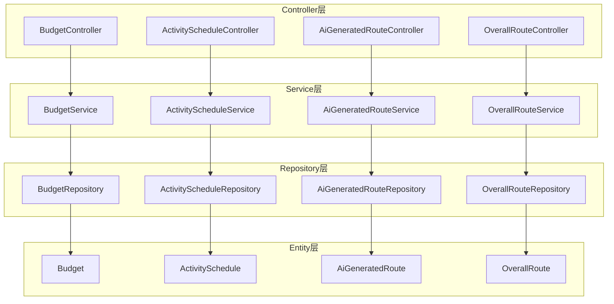
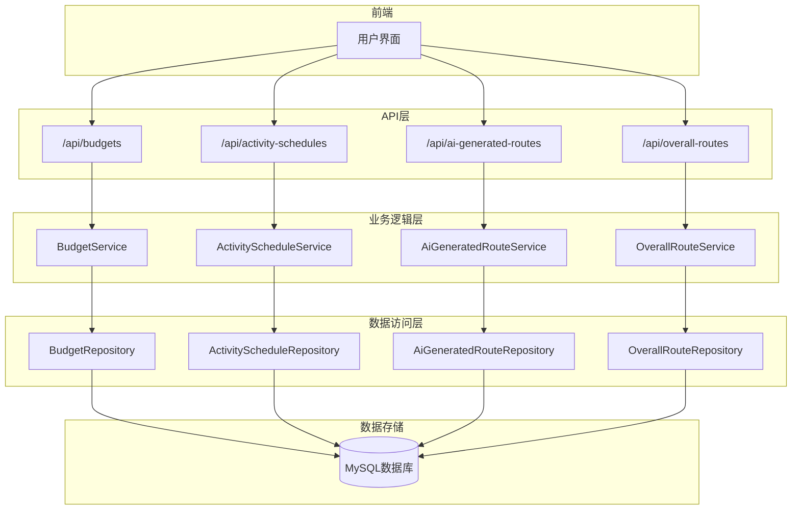
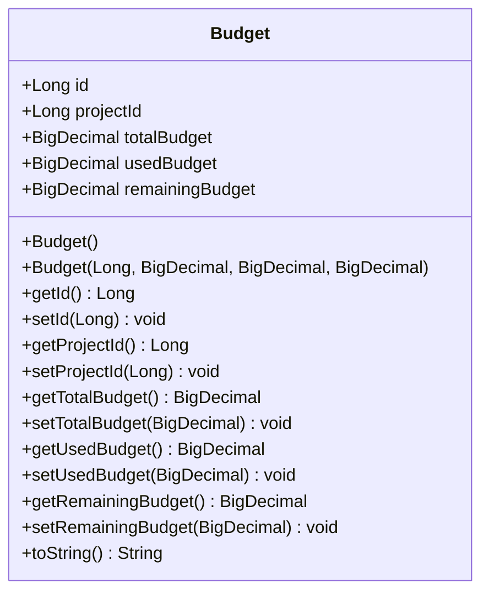
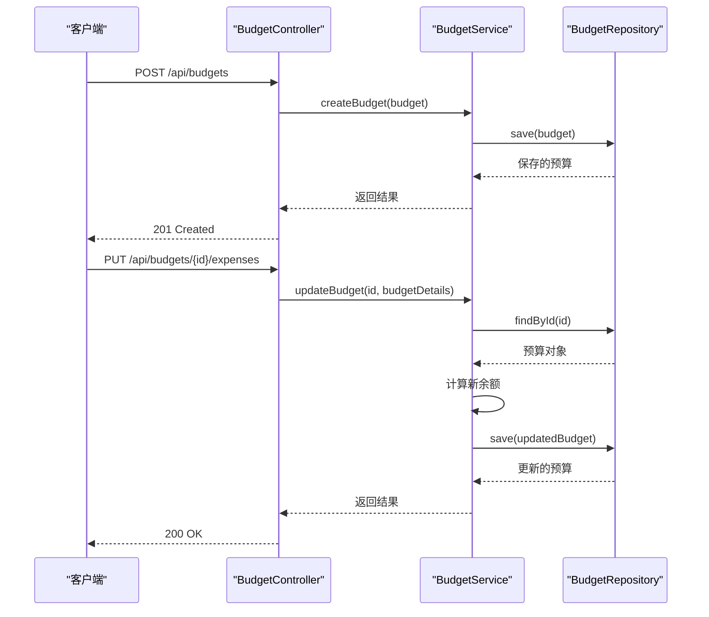
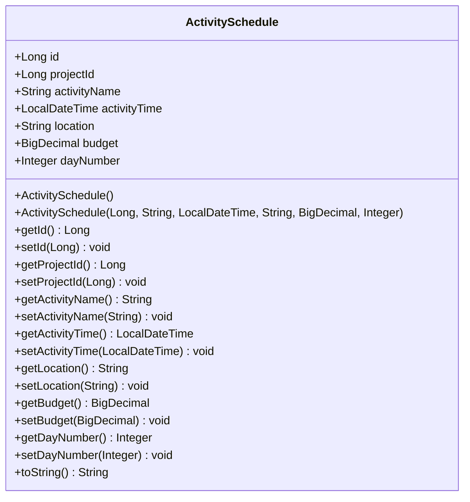
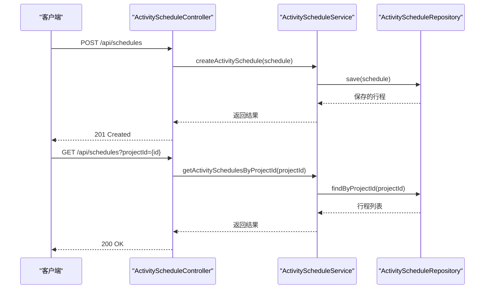
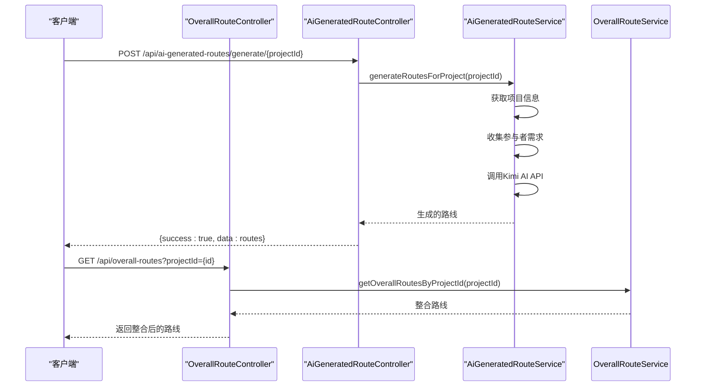
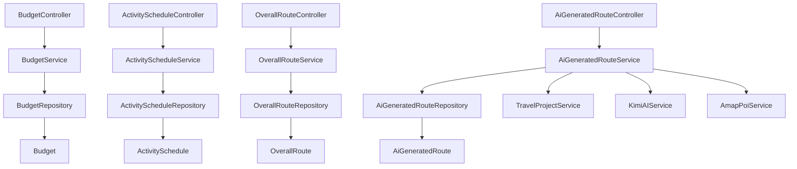

# 预算与行程管理API

<cite>
**本文档引用的文件**
- [BudgetController.java](file://tudianersha/src/main/java/com/tudianersha/controller/BudgetController.java)
- [ActivityScheduleController.java](file://tudianersha/src/main/java/com/tudianersha/controller/ActivityScheduleController.java)
- [OverallRouteController.java](file://tudianersha/src/main/java/com/tudianersha/controller/OverallRouteController.java)
- [AiGeneratedRouteController.java](file://tudianersha/src/main/java/com/tudianersha/controller/AiGeneratedRouteController.java)
- [Budget.java](file://tudianersha/src/main/java/com/tudianersha/entity/Budget.java)
- [ActivitySchedule.java](file://tudianersha/src/main/java/com/tudianersha/entity/ActivitySchedule.java)
- [OverallRoute.java](file://tudianersha/src/main/java/com/tudianersha/entity/OverallRoute.java)
- [AiGeneratedRoute.java](file://tudianersha/src/main/java/com/tudianersha/entity/AiGeneratedRoute.java)
- [BudgetService.java](file://tudianersha/src/main/java/com/tudianersha/service/BudgetService.java)
- [ActivityScheduleService.java](file://tudianersha/src/main/java/com/tudianersha/service/ActivityScheduleService.java)
- [OverallRouteService.java](file://tudianersha/src/main/java/com/tudianersha/service/OverallRouteService.java)
- [AiGeneratedRouteService.java](file://tudianersha/src/main/java/com/tudianersha/service/AiGeneratedRouteService.java)
- [BudgetRepository.java](file://tudianersha/src/main/java/com/tudianersha/repository/BudgetRepository.java)
- [ActivityScheduleRepository.java](file://tudianersha/src/main/java/com/tudianersha/repository/ActivityScheduleRepository.java)
- [ApiResponse.java](file://tudianersha/src/main/java/com/tudianersha/dto/ApiResponse.java)
- [application.yml](file://tudianersha/src/main/resources/application.yml)
</cite>

## 目录
1. [简介](#简介)
2. [项目结构](#项目结构)
3. [核心组件](#核心组件)
4. [架构概述](#架构概述)
5. [详细组件分析](#详细组件分析)
6. [依赖分析](#依赖分析)
7. [性能考虑](#性能考虑)
8. [故障排除指南](#故障排除指南)
9. [结论](#结论)

## 简介
本文档详细描述了途点儿啥平台的预算与行程管理API。系统提供完整的预算控制功能，包括预算设置、查询和支出管理，以及行程安排和AI生成路线的整合功能。API设计遵循RESTful原则，使用统一的响应格式，支持项目级别的预算管理和行程规划。

## 项目结构
系统采用标准的Spring Boot项目结构，分为controller、service、repository、entity和dto等模块。预算和行程管理功能分别由独立的控制器和服务类处理，确保职责分离和代码可维护性。

**图示来源**
- [BudgetController.java](file://tudianersha/src/main/java/com/tudianersha/controller/BudgetController.java)
- [ActivityScheduleController.java](file://tudianersha/src/main/java/com/tudianersha/controller/ActivityScheduleController.java)
- [AiGeneratedRouteController.java](file://tudianersha/src/main/java/com/tudianersha/controller/AiGeneratedRouteController.java)
- [OverallRouteController.java](file://tudianersha/src/main/java/com/tudianersha/controller/OverallRouteController.java)

**章节来源**
- [BudgetController.java](file://tudianersha/src/main/java/com/tudianersha/controller/BudgetController.java)
- [ActivityScheduleController.java](file://tudianersha/src/main/java/com/tudianersha/controller/ActivityScheduleController.java)

## 核心组件

预算与行程管理系统的三个核心组件是预算管理、活动行程安排和路线整合。预算管理组件处理项目的财务规划，包括总预算设置和支出跟踪。活动行程安排组件管理具体的活动计划，包括时间、地点和预算分配。路线整合组件将AI生成的路线与用户自定义安排相结合，提供完整的行程解决方案。

**章节来源**
- [BudgetController.java](file://tudianersha/src/main/java/com/tudianersha/controller/BudgetController.java)
- [ActivityScheduleController.java](file://tudianersha/src/main/java/com/tudianersha/controller/ActivityScheduleController.java)
- [OverallRouteController.java](file://tudianersha/src/main/java/com/tudianersha/controller/OverallRouteController.java)

## 架构概述

系统采用分层架构，从控制器层到实体层形成清晰的数据流。每个功能模块都有对应的控制器、服务和仓库组件，确保单一职责原则。预算和行程数据通过项目ID关联，实现项目级别的统一管理。

**图示来源**
- [BudgetController.java](file://tudianersha/src/main/java/com/tudianersha/controller/BudgetController.java)
- [ActivityScheduleController.java](file://tudianersha/src/main/java/com/tudianersha/controller/ActivityScheduleController.java)
- [AiGeneratedRouteController.java](file://tudianersha/src/main/java/com/tudianersha/controller/AiGeneratedRouteController.java)
- [OverallRouteController.java](file://tudianersha/src/main/java/com/tudianersha/controller/OverallRouteController.java)

## 详细组件分析

### 预算管理分析
预算管理组件提供完整的预算生命周期管理功能，包括创建、读取、更新和删除操作。系统通过精确的财务计算确保预算数据的准确性，并提供超支预警机制。

#### 预算实体结构

**图示来源**
- [Budget.java](file://tudianersha/src/main/java/com/tudianersha/entity/Budget.java)

#### 预算API操作流程

**图示来源**
- [BudgetController.java](file://tudianersha/src/main/java/com/tudianersha/controller/BudgetController.java)
- [BudgetService.java](file://tudianersha/src/main/java/com/tudianersha/service/BudgetService.java)
- [BudgetRepository.java](file://tudianersha/src/main/java/com/tudianersha/repository/BudgetRepository.java)

**章节来源**
- [BudgetController.java](file://tudianersha/src/main/java/com/tudianersha/controller/BudgetController.java)
- [Budget.java](file://tudianersha/src/main/java/com/tudianersha/entity/Budget.java)

### 行程安排分析
行程安排组件管理用户的活动计划，支持按项目查询和排序功能。每个活动可以关联预算，实现精细化的财务控制。

#### 活动行程实体结构

**图示来源**
- [ActivitySchedule.java](file://tudianersha/src/main/java/com/tudianersha/entity/ActivitySchedule.java)

#### 行程API操作流程

**图示来源**
- [ActivityScheduleController.java](file://tudianersha/src/main/java/com/tudianersha/controller/ActivityScheduleController.java)
- [ActivityScheduleService.java](file://tudianersha/src/main/java/com/tudianersha/service/ActivityScheduleService.java)
- [ActivityScheduleRepository.java](file://tudianersha/src/main/java/com/tudianersha/repository/ActivityScheduleRepository.java)

**章节来源**
- [ActivityScheduleController.java](file://tudianersha/src/main/java/com/tudianersha/controller/ActivityScheduleController.java)
- [ActivitySchedule.java](file://tudianersha/src/main/java/com/tudianersha/entity/ActivitySchedule.java)

### 路线整合分析
路线整合组件将AI生成的智能路线与用户自定义的行程安排相结合，提供最优的旅行方案。系统支持生成多条备选路线供用户选择。

#### 路线整合控制器流程

**图示来源**
- [AiGeneratedRouteController.java](file://tudianersha/src/main/java/com/tudianersha/controller/AiGeneratedRouteController.java)
- [AiGeneratedRouteService.java](file://tudianersha/src/main/java/com/tudianersha/service/AiGeneratedRouteService.java)
- [OverallRouteController.java](file://tudianersha/src/main/java/com/tudianersha/controller/OverallRouteController.java)

**章节来源**
- [AiGeneratedRouteController.java](file://tudianersha/src/main/java/com/tudianersha/controller/AiGeneratedRouteController.java)
- [OverallRouteController.java](file://tudianersha/src/main/java/com/tudianersha/controller/OverallRouteController.java)

## 依赖分析

系统各组件之间的依赖关系清晰，遵循依赖倒置原则。控制器依赖服务，服务依赖仓库，形成单向依赖链，避免循环依赖。

**图示来源**
- [BudgetController.java](file://tudianersha/src/main/java/com/tudianersha/controller/BudgetController.java)
- [BudgetService.java](file://tudianersha/src/main/java/com/tudianersha/service/BudgetService.java)
- [BudgetRepository.java](file://tudianersha/src/main/java/com/tudianersha/repository/BudgetRepository.java)
- [ActivityScheduleController.java](file://tudianersha/src/main/java/com/tudianersha/controller/ActivityScheduleController.java)
- [AiGeneratedRouteController.java](file://tudianersha/src/main/java/com/tudianersha/controller/AiGeneratedRouteController.java)
- [OverallRouteController.java](file://tudianersha/src/main/java/com/tudianersha/controller/OverallRouteController.java)

**章节来源**
- [BudgetController.java](file://tudianersha/src/main/java/com/tudianersha/controller/BudgetController.java)
- [ActivityScheduleController.java](file://tudianersha/src/main/java/com/tudianersha/controller/ActivityScheduleController.java)
- [AiGeneratedRouteController.java](file://tudianersha/src/main/java/com/tudianersha/controller/AiGeneratedRouteController.java)

## 性能考虑
系统在设计时考虑了性能优化，包括数据库索引、缓存策略和异步处理。预算计算和AI路线生成等耗时操作应考虑异步执行，避免阻塞主线程。数据库查询使用JPA的内置方法，确保查询效率。

## 故障排除指南
当遇到API调用失败时，首先检查请求格式是否正确，特别是JSON数据结构。对于预算相关的操作，确保总预算、已用预算和剩余预算的一致性。AI路线生成失败时，检查Kimi API密钥配置和网络连接。

**章节来源**
- [ApiResponse.java](file://tudianersha/src/main/java/com/tudianersha/dto/ApiResponse.java)
- [application.yml](file://tudianersha/src/main/resources/application.yml)

## 结论
预算与行程管理API提供了完整的旅行规划解决方案，从财务控制到行程安排再到智能路线生成，形成了闭环的用户体验。系统架构清晰，组件职责明确，易于维护和扩展。通过统一的API设计和响应格式，确保了前后端交互的一致性和可靠性。