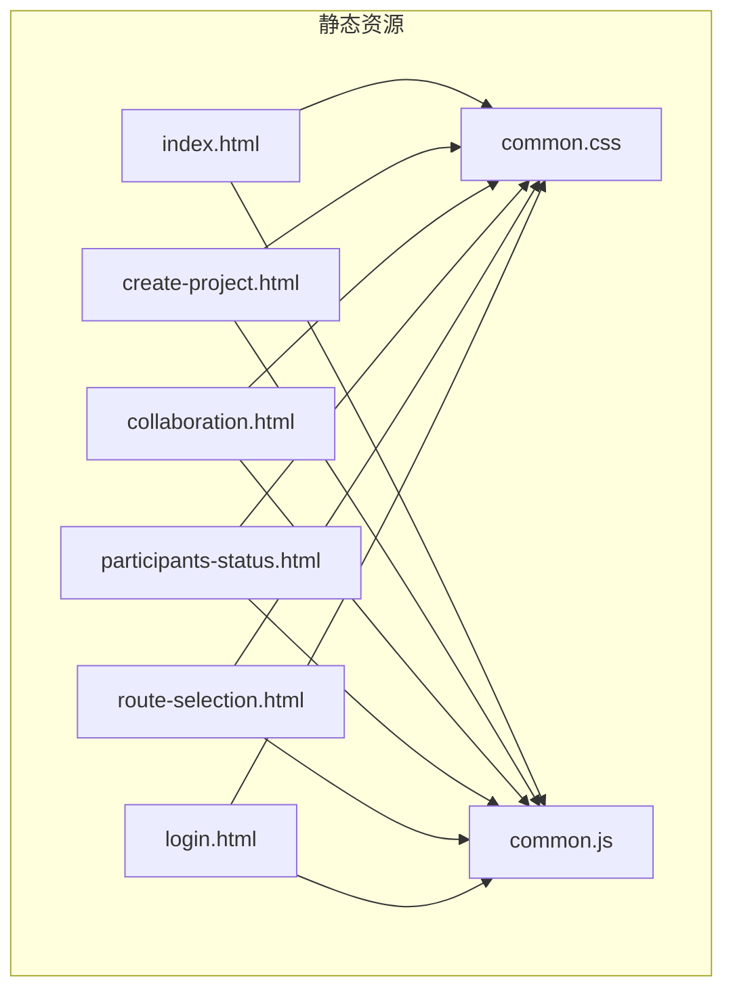
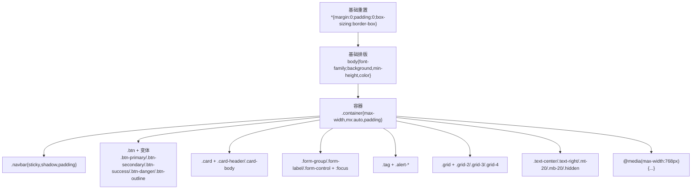
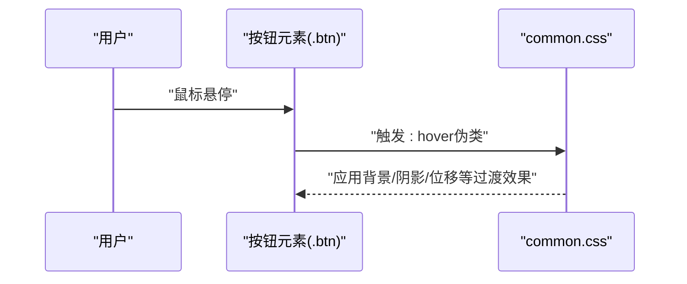
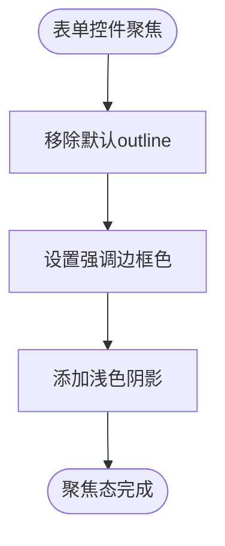
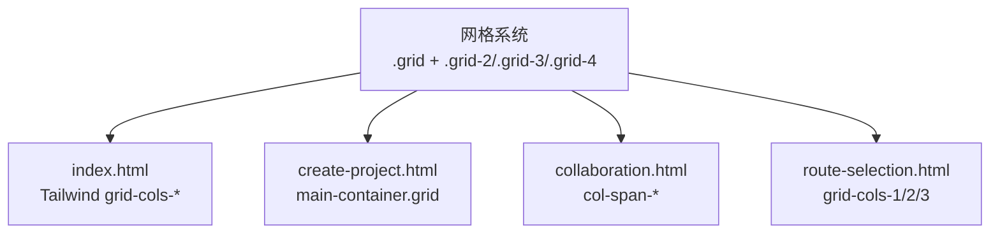
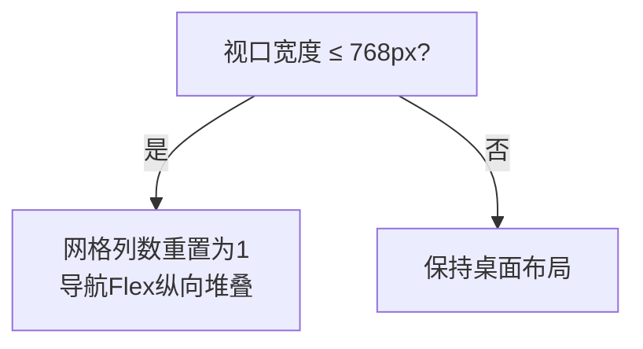
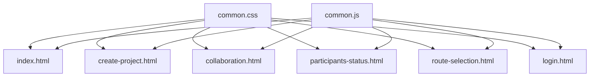
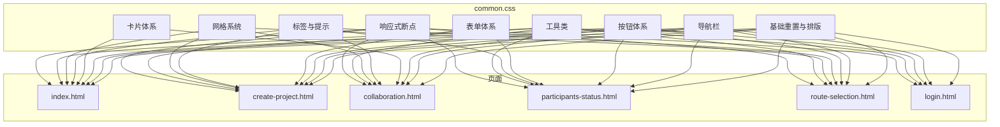

# CSS样式与响应式设计

<cite>
**本文引用的文件**
- [common.css](file://tudianersha/src/main/resources/static/css/common.css)
- [index.html](file://tudianersha/src/main/resources/static/index.html)
- [create-project.html](file://tudianersha/src/main/resources/static/create-project.html)
- [collaboration.html](file://tudianersha/src/main/resources/static/collaboration.html)
- [participants-status.html](file://tudianersha/src/main/resources/static/participants-status.html)
- [route-selection.html](file://tudianersha/src/main/resources/static/route-selection.html)
- [login.html](file://tudianersha/src/main/resources/static/login.html)
- [common.js](file://tudianersha/src/main/resources/static/js/common.js)
</cite>

## 目录
1. [引言](#引言)
2. [项目结构](#项目结构)
3. [核心组件](#核心组件)
4. [架构总览](#架构总览)
5. [详细组件分析](#详细组件分析)
6. [依赖关系分析](#依赖关系分析)
7. [性能考量](#性能考量)
8. [故障排查指南](#故障排查指南)
9. [结论](#结论)
10. [附录](#附录)

## 引言
本文件系统性梳理项目中CSS样式架构与设计规范，围绕全局样式重置、字体排版、色彩系统、响应式布局、网格与弹性布局、常用UI组件（按钮、输入框、状态标签、卡片容器等）展开，并结合index.html中的项目卡片布局与create-project.html中的表单区域，说明CSS类的组合使用方式与交互状态（hover、disabled等）。同时提供样式架构图与组件样式对照表，指导开发者进行主题定制与样式扩展。

## 项目结构
- 样式入口：common.css 提供全局重置、通用组件与工具类
- 页面文件：
  - index.html：项目列表与卡片布局
  - create-project.html：表单与网格布局
  - collaboration.html：网格布局与协作界面
  - participants-status.html：成员状态页面
  - route-selection.html：AI路线方案网格布局
  - login.html：登录/注册页面（Tailwind主题）
- JS工具：common.js 提供API封装、认证与提示等工具方法



图表来源
- [common.css](file://tudianersha/src/main/resources/static/css/common.css#L1-L295)
- [index.html](file://tudianersha/src/main/resources/static/index.html#L1-L515)
- [create-project.html](file://tudianersha/src/main/resources/static/create-project.html#L1-L800)
- [collaboration.html](file://tudianersha/src/main/resources/static/collaboration.html#L1-L800)
- [participants-status.html](file://tudianersha/src/main/resources/static/participants-status.html#L1-L436)
- [route-selection.html](file://tudianersha/src/main/resources/static/route-selection.html#L1-L606)
- [login.html](file://tudianersha/src/main/resources/static/login.html#L1-L405)
- [common.js](file://tudianersha/src/main/resources/static/js/common.js#L1-L272)

章节来源
- [common.css](file://tudianersha/src/main/resources/static/css/common.css#L1-L295)
- [index.html](file://tudianersha/src/main/resources/static/index.html#L1-L515)
- [create-project.html](file://tudianersha/src/main/resources/static/create-project.html#L1-L800)
- [collaboration.html](file://tudianersha/src/main/resources/static/collaboration.html#L1-L800)
- [participants-status.html](file://tudianersha/src/main/resources/static/participants-status.html#L1-L436)
- [route-selection.html](file://tudianersha/src/main/resources/static/route-selection.html#L1-L606)
- [login.html](file://tudianersha/src/main/resources/static/login.html#L1-L405)
- [common.js](file://tudianersha/src/main/resources/static/js/common.js#L1-L272)

## 核心组件
- 全局重置与基础排版
  - 通配符重置与盒模型统一
  - 基础字体族与背景渐变
  - 容器最大宽度与内边距
- 导航栏
  - 吸顶定位、阴影、品牌与菜单布局
- 按钮体系
  - 主色、次色、成功、危险、描边等变体
  - hover状态与过渡效果
- 卡片体系
  - 卡片容器、头部、正文
- 表单体系
  - 分组、标签、控件、聚焦态
- 状态标签与提示
  - 标签与提示消息（成功/错误/信息）
- 网格与工具类
  - 2/3/4列网格、间距与对齐工具类
- 响应式断点
  - 768px以下的网格与导航布局调整

章节来源
- [common.css](file://tudianersha/src/main/resources/static/css/common.css#L1-L295)

## 架构总览
common.css采用“基础重置 + 通用组件 + 工具类”的分层架构：
- 基础层：通配符重置、基础排版、容器
- 组件层：导航、按钮、卡片、表单、标签、提示
- 响应式层：媒体查询断点下的布局调整



图表来源
- [common.css](file://tudianersha/src/main/resources/static/css/common.css#L1-L295)

## 详细组件分析

### 全局样式重置与基础排版
- 通配符重置确保盒模型一致性
- body设置字体族、背景渐变、最小高度与文字颜色
- 容器类限制最大宽度并居中，提供统一内边距

章节来源
- [common.css](file://tudianersha/src/main/resources/static/css/common.css#L1-L20)

### 导航栏
- 吸顶定位与阴影提升层级感
- Flex布局实现品牌与菜单两端对齐
- 菜单项悬停切换背景与文字色

章节来源
- [common.css](file://tudianersha/src/main/resources/static/css/common.css#L21-L63)
- [index.html](file://tudianersha/src/main/resources/static/index.html#L31-L63)

### 按钮体系
- 基础按钮类提供统一尺寸、圆角、指针、过渡与内联块显示
- 主题变体：主色、次色、成功、危险、描边
- hover状态：主色按钮带位移与阴影，描边按钮实现反色填充
- 与页面结合：index.html中的“创建新旅程”按钮、create-project.html中的“提交并生成AI方案”按钮



图表来源
- [common.css](file://tudianersha/src/main/resources/static/css/common.css#L63-L123)
- [index.html](file://tudianersha/src/main/resources/static/index.html#L68-L79)
- [create-project.html](file://tudianersha/src/main/resources/static/create-project.html#L348-L395)

章节来源
- [common.css](file://tudianersha/src/main/resources/static/css/common.css#L63-L123)
- [index.html](file://tudianersha/src/main/resources/static/index.html#L68-L79)
- [create-project.html](file://tudianersha/src/main/resources/static/create-project.html#L348-L395)

### 卡片体系
- 卡片容器提供背景、圆角、内边距、阴影与底部间距
- 卡片头部与正文分别控制字号、字重、颜色与间距
- 与页面结合：index.html中的项目卡片容器与内部结构

```mermaid
classDiagram
class Card {
"+.card"
"+.card-header"
"+.card-body"
}
class Page {
"+index.html 项目卡片"
}
Card <.. Page : "被使用"
```

图表来源
- [common.css](file://tudianersha/src/main/resources/static/css/common.css#L124-L143)
- [index.html](file://tudianersha/src/main/resources/static/index.html#L380-L473)

章节来源
- [common.css](file://tudianersha/src/main/resources/static/css/common.css#L124-L143)
- [index.html](file://tudianersha/src/main/resources/static/index.html#L380-L473)

### 表单体系
- 分组、标签、控件三要素统一间距与过渡
- 控件聚焦态：去除outline、设置边框强调色与浅色阴影
- 文本域支持纵向可调
- 与页面结合：create-project.html中的表单区域与输入控件



图表来源
- [common.css](file://tudianersha/src/main/resources/static/css/common.css#L144-L175)
- [create-project.html](file://tudianersha/src/main/resources/static/create-project.html#L440-L478)

章节来源
- [common.css](file://tudianersha/src/main/resources/static/css/common.css#L144-L175)
- [create-project.html](file://tudianersha/src/main/resources/static/create-project.html#L440-L478)

### 状态标签与提示
- 标签：支持主色、成功、警告、危险等主题色
- 提示：成功/错误/信息三类提示消息
- 与页面结合：index.html中的状态徽章、common.js中的提示消息

章节来源
- [common.css](file://tudianersha/src/main/resources/static/css/common.css#L195-L218)
- [common.css](file://tudianersha/src/main/resources/static/css/common.css#L235-L263)
- [common.js](file://tudianersha/src/main/resources/static/js/common.js#L123-L146)
- [index.html](file://tudianersha/src/main/resources/static/index.html#L400-L425)

### 网格与工具类
- 网格：2/3/4列网格模板，gap统一间距
- 工具类：文本对齐、外边距、隐藏等
- 与页面结合：
  - index.html：项目卡片网格（Tailwind）
  - create-project.html：左右两栏网格布局
  - collaboration.html：左侧/中间/右侧三栏网格
  - route-selection.html：方案卡片网格



图表来源
- [common.css](file://tudianersha/src/main/resources/static/css/common.css#L176-L194)
- [index.html](file://tudianersha/src/main/resources/static/index.html#L93-L141)
- [create-project.html](file://tudianersha/src/main/resources/static/create-project.html#L26-L40)
- [collaboration.html](file://tudianersha/src/main/resources/static/collaboration.html#L108-L169)
- [route-selection.html](file://tudianersha/src/main/resources/static/route-selection.html#L81-L91)

章节来源
- [common.css](file://tudianersha/src/main/resources/static/css/common.css#L176-L194)
- [index.html](file://tudianersha/src/main/resources/static/index.html#L93-L141)
- [create-project.html](file://tudianersha/src/main/resources/static/create-project.html#L26-L40)
- [collaboration.html](file://tudianersha/src/main/resources/static/collaboration.html#L108-L169)
- [route-selection.html](file://tudianersha/src/main/resources/static/route-selection.html#L81-L91)

### 响应式布局
- 断点：768px以下
  - 网格：2/3/4列均变为单列
  - 导航菜单：Flex方向改为纵向堆叠
- 与页面结合：common.css媒体查询与各页面布局



图表来源
- [common.css](file://tudianersha/src/main/resources/static/css/common.css#L285-L295)

章节来源
- [common.css](file://tudianersha/src/main/resources/static/css/common.css#L285-L295)

### 交互状态与禁用态
- hover：按钮、导航、卡片等悬停反馈
- disabled：页面中通过禁用属性实现禁用态（如路由选择页面的按钮禁用逻辑）
- 与页面结合：common.js中的加载态与按钮禁用

章节来源
- [common.css](file://tudianersha/src/main/resources/static/css/common.css#L58-L63)
- [common.css](file://tudianersha/src/main/resources/static/css/common.css#L80-L123)
- [route-selection.html](file://tudianersha/src/main/resources/static/route-selection.html#L496-L525)
- [common.js](file://tudianersha/src/main/resources/static/js/common.js#L260-L272)

## 依赖关系分析
- 样式依赖
  - 所有页面均引入common.css作为基础样式
  - index.html、collaboration.html、route-selection.html大量使用Tailwind类，形成“基础样式 + Tailwind实用类”的混合策略
  - create-project.html、participants-status.html、login.html主要使用自定义样式与少量Tailwind
- JS依赖
  - common.js提供API封装、认证、提示与工具方法，页面通过脚本调用



图表来源
- [common.css](file://tudianersha/src/main/resources/static/css/common.css#L1-L295)
- [index.html](file://tudianersha/src/main/resources/static/index.html#L1-L515)
- [create-project.html](file://tudianersha/src/main/resources/static/create-project.html#L1-L800)
- [collaboration.html](file://tudianersha/src/main/resources/static/collaboration.html#L1-L800)
- [participants-status.html](file://tudianersha/src/main/resources/static/participants-status.html#L1-L436)
- [route-selection.html](file://tudianersha/src/main/resources/static/route-selection.html#L1-L606)
- [login.html](file://tudianersha/src/main/resources/static/login.html#L1-L405)
- [common.js](file://tudianersha/src/main/resources/static/js/common.js#L1-L272)

章节来源
- [common.css](file://tudianersha/src/main/resources/static/css/common.css#L1-L295)
- [common.js](file://tudianersha/src/main/resources/static/js/common.js#L1-L272)

## 性能考量
- 样式体积小、规则集中，减少重复定义
- 使用媒体查询仅在必要处生效，避免过度重绘
- 通过工具类（Tailwind）减少自定义样式的维护成本
- 建议：将高频使用的组件类抽取为可复用的Tailwind变体，进一步降低CSS体量

## 故障排查指南
- 按钮无hover效果
  - 检查是否正确应用按钮类与hover伪类
  - 章节来源
    - [common.css](file://tudianersha/src/main/resources/static/css/common.css#L63-L123)
- 表单控件聚焦无强调
  - 检查是否使用了.form-control与:focus规则
  - 章节来源
    - [common.css](file://tudianersha/src/main/resources/static/css/common.css#L144-L175)
- 网格布局异常
  - 检查是否正确使用.grid与.grid-N类
  - 章节来源
    - [common.css](file://tudianersha/src/main/resources/static/css/common.css#L176-L194)
- 响应式布局未生效
  - 检查viewport meta与@media断点
  - 章节来源
    - [common.css](file://tudianersha/src/main/resources/static/css/common.css#L285-L295)
- 提示消息不显示
  - 检查common.js中的showAlert调用与.alert类
  - 章节来源
    - [common.js](file://tudianersha/src/main/resources/static/js/common.js#L123-L146)
    - [common.css](file://tudianersha/src/main/resources/static/css/common.css#L195-L218)

## 结论
本项目采用“基础重置 + 通用组件 + 工具类”的CSS架构，配合Tailwind实用类实现快速布局与一致风格。按钮、卡片、表单、网格与响应式断点构成完整的UI基础设施，满足项目列表、表单填写、协作编辑等场景需求。建议在主题定制时优先沿用现有组件类与命名约定，减少自定义样式冲突。

## 附录

### 样式架构图（代码级映射）


图表来源
- [common.css](file://tudianersha/src/main/resources/static/css/common.css#L1-L295)
- [index.html](file://tudianersha/src/main/resources/static/index.html#L1-L515)
- [create-project.html](file://tudianersha/src/main/resources/static/create-project.html#L1-L800)
- [collaboration.html](file://tudianersha/src/main/resources/static/collaboration.html#L1-L800)
- [participants-status.html](file://tudianersha/src/main/resources/static/participants-status.html#L1-L436)
- [route-selection.html](file://tudianersha/src/main/resources/static/route-selection.html#L1-L606)
- [login.html](file://tudianersha/src/main/resources/static/login.html#L1-L405)

### 组件样式对照表（路径索引）
- 导航栏
  - 类名：.navbar, .navbar-brand, .navbar-menu
  - 路径：[common.css](file://tudianersha/src/main/resources/static/css/common.css#L21-L63)，[index.html](file://tudianersha/src/main/resources/static/index.html#L31-L63)
- 按钮
  - 类名：.btn, .btn-primary, .btn-secondary, .btn-success, .btn-danger, .btn-outline
  - 路径：[common.css](file://tudianersha/src/main/resources/static/css/common.css#L63-L123)，[index.html](file://tudianersha/src/main/resources/static/index.html#L68-L79)，[create-project.html](file://tudianersha/src/main/resources/static/create-project.html#L348-L395)
- 卡片
  - 类名：.card, .card-header, .card-body
  - 路径：[common.css](file://tudianersha/src/main/resources/static/css/common.css#L124-L143)，[index.html](file://tudianersha/src/main/resources/static/index.html#L380-L473)
- 表单
  - 类名：.form-group, .form-label, .form-control, :focus
  - 路径：[common.css](file://tudianersha/src/main/resources/static/css/common.css#L144-L175)，[create-project.html](file://tudianersha/src/main/resources/static/create-project.html#L440-L478)
- 标签与提示
  - 类名：.tag, .tag-*, .alert, .alert-*
  - 路径：[common.css](file://tudianersha/src/main/resources/static/css/common.css#L195-L218)，[common.css](file://tudianersha/src/main/resources/static/css/common.css#L235-L263)，[common.js](file://tudianersha/src/main/resources/static/js/common.js#L123-L146)，[index.html](file://tudianersha/src/main/resources/static/index.html#L400-L425)
- 网格与工具类
  - 类名：.grid, .grid-2, .grid-3, .grid-4, .text-center, .text-right, .mt-20, .mb-20, .hidden
  - 路径：[common.css](file://tudianersha/src/main/resources/static/css/common.css#L176-L194)，[common.css](file://tudianersha/src/main/resources/static/css/common.css#L265-L284)，[index.html](file://tudianersha/src/main/resources/static/index.html#L93-L141)，[create-project.html](file://tudianersha/src/main/resources/static/create-project.html#L26-L40)，[collaboration.html](file://tudianersha/src/main/resources/static/collaboration.html#L108-L169)，[route-selection.html](file://tudianersha/src/main/resources/static/route-selection.html#L81-L91)
- 响应式断点
  - 规则：@media (max-width: 768px)
  - 路径：[common.css](file://tudianersha/src/main/resources/static/css/common.css#L285-L295)