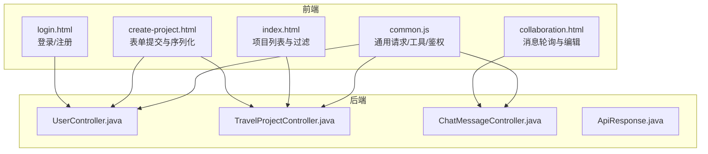
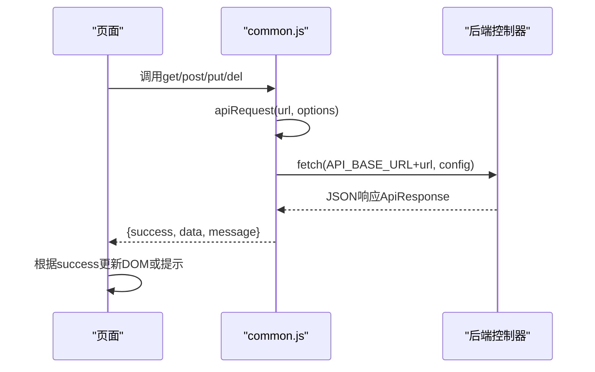
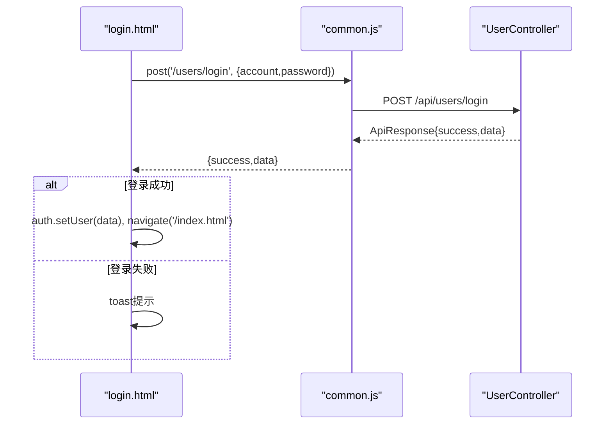
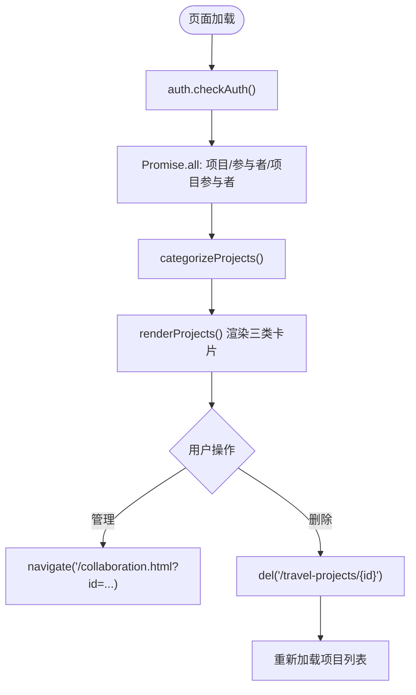
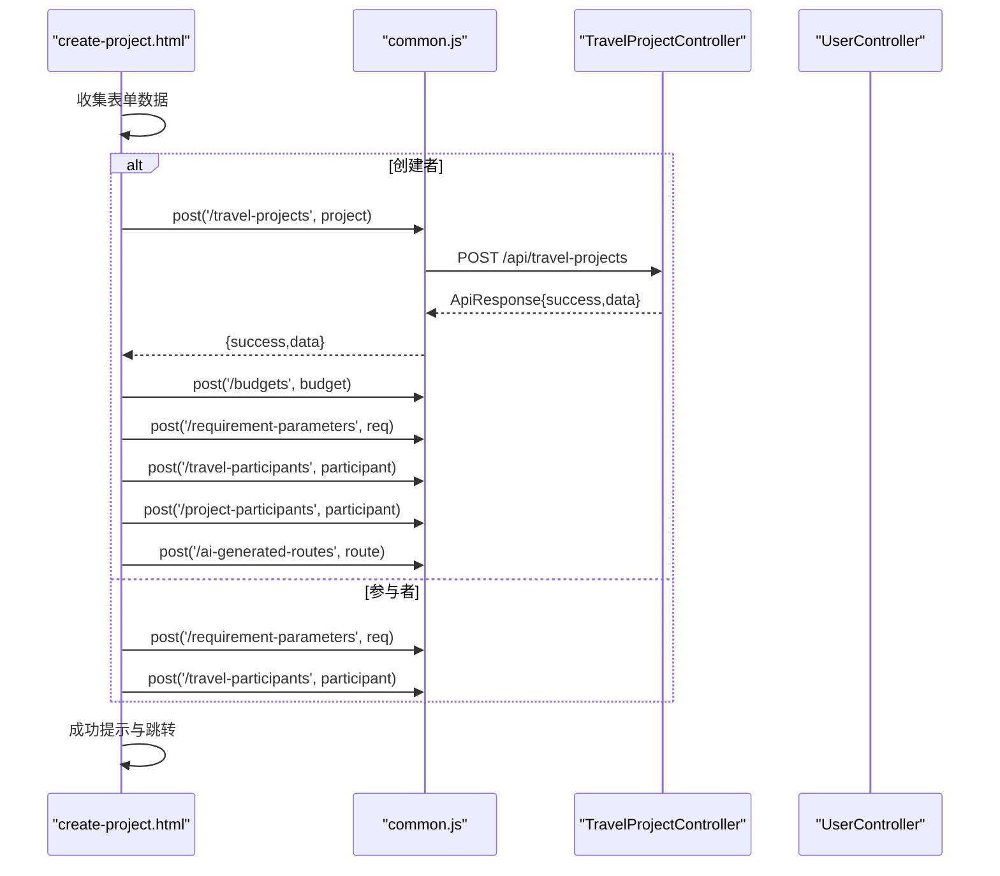
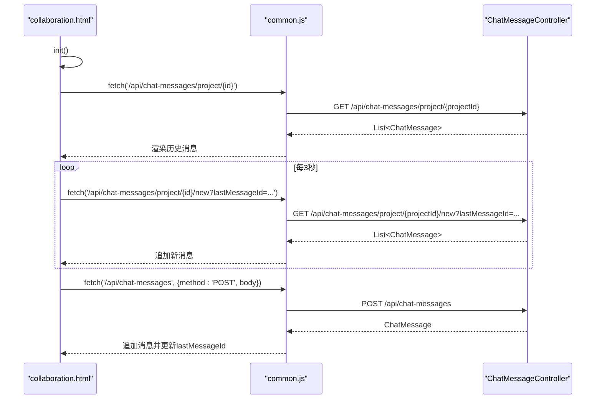
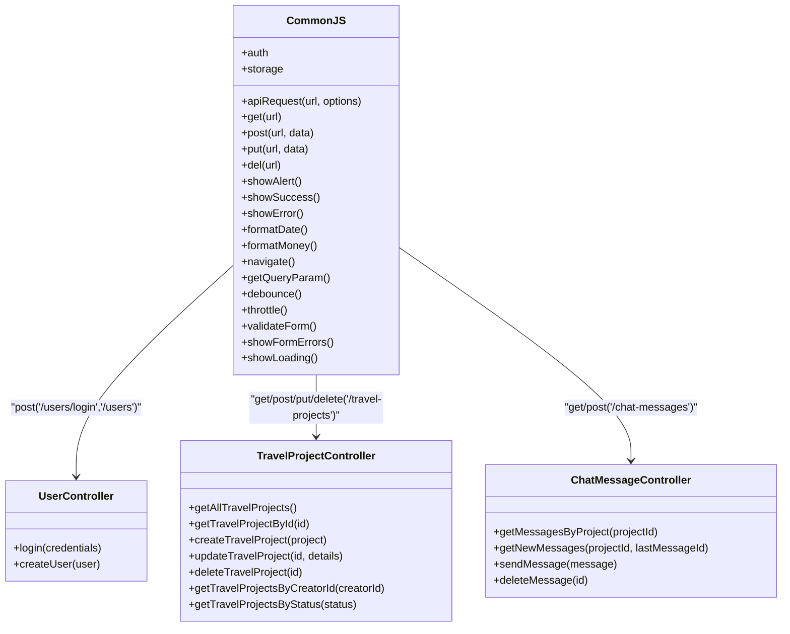

# JavaScript交互逻辑

<cite>
**本文引用的文件**
- [common.js](file://tudianersha/src/main/resources/static/js/common.js)
- [index.html](file://tudianersha/src/main/resources/static/index.html)
- [create-project.html](file://tudianersha/src/main/resources/static/create-project.html)
- [collaboration.html](file://tudianersha/src/main/resources/static/collaboration.html)
- [login.html](file://tudianersha/src/main/resources/static/login.html)
- [UserController.java](file://tudianersha/src/main/java/com/tudianersha/controller/UserController.java)
- [TravelProjectController.java](file://tudianersha/src/main/java/com/tudianersha/controller/TravelProjectController.java)
- [ChatMessageController.java](file://tudianersha/src/main/java/com/tudianersha/controller/ChatMessageController.java)
- [ApiResponse.java](file://tudianersha/src/main/java/com/tudianersha/dto/ApiResponse.java)
</cite>

## 目录
1. [简介](#简介)
2. [项目结构](#项目结构)
3. [核心组件](#核心组件)
4. [架构总览](#架构总览)
5. [详细组件分析](#详细组件分析)
6. [依赖关系分析](#依赖关系分析)
7. [性能考量](#性能考量)
8. [故障排查指南](#故障排查指南)
9. [结论](#结论)
10. [附录](#附录)

## 简介
本文件系统性解析前端JavaScript交互逻辑，重点覆盖：
- 通用HTTP请求封装与统一错误处理、加载状态管理
- 用户认证与会话管理
- 页面级交互：项目列表按角色过滤、项目创建表单提交与数据序列化、协作页面消息轮询
- 与后端接口的对接方式（UserController、TravelProjectController、ChatMessageController等）
- 关键交互流程图与常见异步问题的解决方案

## 项目结构
前端静态资源位于静态目录，包含通用JS库与多个HTML页面；后端采用Spring Boot REST风格控制器，统一返回ApiResponse包装。

图表来源
- [common.js](file://tudianersha/src/main/resources/static/js/common.js#L1-L272)
- [index.html](file://tudianersha/src/main/resources/static/index.html#L1-L515)
- [create-project.html](file://tudianersha/src/main/resources/static/create-project.html#L1-L1958)
- [collaboration.html](file://tudianersha/src/main/resources/static/collaboration.html#L1-L1875)
- [login.html](file://tudianersha/src/main/resources/static/login.html#L1-L405)
- [UserController.java](file://tudianersha/src/main/java/com/tudianersha/controller/UserController.java#L1-L152)
- [TravelProjectController.java](file://tudianersha/src/main/java/com/tudianersha/controller/TravelProjectController.java#L1-L85)
- [ChatMessageController.java](file://tudianersha/src/main/java/com/tudianersha/controller/ChatMessageController.java#L1-L44)
- [ApiResponse.java](file://tudianersha/src/main/java/com/tudianersha/dto/ApiResponse.java#L1-L80)

章节来源
- [common.js](file://tudianersha/src/main/resources/static/js/common.js#L1-L272)
- [index.html](file://tudianersha/src/main/resources/static/index.html#L1-L515)
- [create-project.html](file://tudianersha/src/main/resources/static/create-project.html#L1-L1958)
- [collaboration.html](file://tudianersha/src/main/resources/static/collaboration.html#L1-L1875)
- [login.html](file://tudianersha/src/main/resources/static/login.html#L1-L405)
- [UserController.java](file://tudianersha/src/main/java/com/tudianersha/controller/UserController.java#L1-L152)
- [TravelProjectController.java](file://tudianersha/src/main/java/com/tudianersha/controller/TravelProjectController.java#L1-L85)
- [ChatMessageController.java](file://tudianersha/src/main/java/com/tudianersha/controller/ChatMessageController.java#L1-L44)
- [ApiResponse.java](file://tudianersha/src/main/java/com/tudianersha/dto/ApiResponse.java#L1-L80)

## 核心组件
- 通用请求与工具
  - 请求封装：基于fetch的apiRequest，统一Content-Type、响应类型判断、空响应处理、统一返回结构
  - CRUD便捷方法：get/post/put/del
  - 本地存储：storage封装localStorage
  - 鉴权：auth封装用户信息持久化、登录状态检查、登出跳转
  - UI辅助：消息提示、日期/金额格式化、页面跳转、URL参数解析、防抖/节流、表单校验与错误渲染、加载动画
- 页面级交互
  - index.html：加载项目与参与者数据，按用户角色分类渲染卡片
  - create-project.html：表单数据收集与序列化，提交到后端并动态更新UI
  - collaboration.html：路线数据展示、@提及、消息发送与轮询
  - login.html：登录/注册表单，调用UserController接口

章节来源
- [common.js](file://tudianersha/src/main/resources/static/js/common.js#L1-L272)
- [index.html](file://tudianersha/src/main/resources/static/index.html#L1-L515)
- [create-project.html](file://tudianersha/src/main/resources/static/create-project.html#L1-L1958)
- [collaboration.html](file://tudianersha/src/main/resources/static/collaboration.html#L1-L1875)
- [login.html](file://tudianersha/src/main/resources/static/login.html#L1-L405)

## 架构总览
前端通过common.js统一发起HTTP请求，后端控制器返回统一ApiResponse包装。页面根据返回结构决定UI更新与错误提示。

图表来源
- [common.js](file://tudianersha/src/main/resources/static/js/common.js#L1-L120)
- [ApiResponse.java](file://tudianersha/src/main/java/com/tudianersha/dto/ApiResponse.java#L1-L80)

## 详细组件分析

### 通用HTTP请求与工具（common.js）
- 请求基座
  - API_BASE_URL统一前缀，避免硬编码
  - apiRequest负责：
    - 合并默认headers（含Content-Type: application/json）
    - 校验response.ok，非2xx抛出错误
    - content-type非json或204时返回{success:true, data:null}
    - 文本为空返回{success:true, data:null}
    - JSON解析后直接返回后端ApiResponse对象
    - 捕获异常并返回{success:false, error}
- CRUD便捷方法
  - get/post/put/del分别传入url与可选data/body
- 本地存储
  - storage.set/get/remove/clear
- 鉴权
  - auth.setUser/getUser/isLoggedIn/logout/checkAuth
- UI与工具
  - showAlert/showSuccess/showError
  - formatDate/formatMoney
  - navigate/getQueryParam
  - debounce/throttle
  - validateForm/showFormErrors
  - showLoading（返回hide函数）

章节来源
- [common.js](file://tudianersha/src/main/resources/static/js/common.js#L1-L272)

### 用户登录流程（login.html）
- 登录
  - 组装账号/密码，调用post('/users/login')
  - 若success，auth.setUser并跳转首页
  - 否则提示错误
- 注册
  - 发送验证码：post('/email/send-code')
  - 注册：post('/users', {username,email,password})
- 验证码计时与提示toast

图表来源
- [login.html](file://tudianersha/src/main/resources/static/login.html#L270-L300)
- [UserController.java](file://tudianersha/src/main/java/com/tudianersha/controller/UserController.java#L86-L124)
- [ApiResponse.java](file://tudianersha/src/main/java/com/tudianersha/dto/ApiResponse.java#L1-L80)

章节来源
- [login.html](file://tudianersha/src/main/resources/static/login.html#L1-L405)
- [UserController.java](file://tudianersha/src/main/java/com/tudianersha/controller/UserController.java#L1-L152)
- [ApiResponse.java](file://tudianersha/src/main/java/com/tudianersha/dto/ApiResponse.java#L1-L80)

### 项目列表与角色过滤（index.html）
- 登录检查：auth.checkAuth
- 初始化：显示用户名、头像、欢迎语
- 数据加载：Promise.all并行获取旅行项目、参与者、项目参与者
- 角色分类：
  - 创建者：creator
  - 编辑者：editor（参与者且权限为编辑者）
  - 参与者：viewer（非创建者，且项目状态为协作中/进行中）
- 渲染：按容器渲染卡片，支持管理/删除入口
- 删除项目：del('/travel-projects/{id}')，成功后重新加载

图表来源
- [index.html](file://tudianersha/src/main/resources/static/index.html#L290-L355)
- [index.html](file://tudianersha/src/main/resources/static/index.html#L358-L473)
- [index.html](file://tudianersha/src/main/resources/static/index.html#L475-L511)

章节来源
- [index.html](file://tudianersha/src/main/resources/static/index.html#L1-L515)

### 项目创建流程（create-project.html）
- 表单数据收集
  - 兴趣标签选择（最多5个）
  - 想去/不喜欢的景点输入框（动态增删）
  - 预算项（可编辑/删除/新增）
  - 项目名称、目的地、起止日期
- 提交策略
  - 创建者：post('/travel-projects')创建项目，post('/budgets')写入预算，post('/requirement-parameters')保存偏好，post('/travel-participants')与post('/project-participants')建立关系，post('/ai-generated-routes')生成AI路线
  - 参与者：post('/requirement-parameters')提交偏好，post('/travel-participants')登记为成员
- 草稿与分享
  - localStorage草稿保存/加载
  - 生成分享链接供他人参与

图表来源
- [create-project.html](file://tudianersha/src/main/resources/static/create-project.html#L1712-L1958)
- [TravelProjectController.java](file://tudianersha/src/main/java/com/tudianersha/controller/TravelProjectController.java#L1-L85)
- [UserController.java](file://tudianersha/src/main/java/com/tudianersha/controller/UserController.java#L1-L152)

章节来源
- [create-project.html](file://tudianersha/src/main/resources/static/create-project.html#L1-L1958)
- [TravelProjectController.java](file://tudianersha/src/main/java/com/tudianersha/controller/TravelProjectController.java#L1-L85)
- [UserController.java](file://tudianersha/src/main/java/com/tudianersha/controller/UserController.java#L1-L152)

### 协作页面消息轮询（collaboration.html）
- 初始化顺序
  - loadProjectInfo：获取项目信息与目的地城市
  - loadDayOptions：获取AI路线并生成天数下拉
  - handleInviteLink：通过邀请链接自动加入项目
  - loadProjectParticipants：加载参与者并渲染头像
  - loadChatMessages：首次拉取历史消息
  - pollNewMessages：每3秒轮询新消息
- 消息发送
  - sendMessage：POST /api/chat-messages，保存后立即追加到视图
- @提及
  - 输入@触发下拉，选择后插入@用户名

图表来源
- [collaboration.html](file://tudianersha/src/main/resources/static/collaboration.html#L1196-L1278)
- [collaboration.html](file://tudianersha/src/main/resources/static/collaboration.html#L1280-L1430)
- [collaboration.html](file://tudianersha/src/main/resources/static/collaboration.html#L1439-L1500)
- [ChatMessageController.java](file://tudianersha/src/main/java/com/tudianersha/controller/ChatMessageController.java#L1-L44)

章节来源
- [collaboration.html](file://tudianersha/src/main/resources/static/collaboration.html#L1-L1875)
- [ChatMessageController.java](file://tudianersha/src/main/java/com/tudianersha/controller/ChatMessageController.java#L1-L44)

## 依赖关系分析
- 前端对后端的依赖
  - common.js依赖后端统一返回ApiResponse，前端据此判断success/data/message
  - 页面通过common.js的get/post/put/del与各Controller交互
- 控制器职责
  - UserController：用户登录/注册
  - TravelProjectController：旅行项目CRUD
  - ChatMessageController：聊天消息查询/新增/删除

图表来源
- [common.js](file://tudianersha/src/main/resources/static/js/common.js#L1-L272)
- [UserController.java](file://tudianersha/src/main/java/com/tudianersha/controller/UserController.java#L1-L152)
- [TravelProjectController.java](file://tudianersha/src/main/java/com/tudianersha/controller/TravelProjectController.java#L1-L85)
- [ChatMessageController.java](file://tudianersha/src/main/java/com/tudianersha/controller/ChatMessageController.java#L1-L44)

章节来源
- [common.js](file://tudianersha/src/main/resources/static/js/common.js#L1-L272)
- [UserController.java](file://tudianersha/src/main/java/com/tudianersha/controller/UserController.java#L1-L152)
- [TravelProjectController.java](file://tudianersha/src/main/java/com/tudianersha/controller/TravelProjectController.java#L1-L85)
- [ChatMessageController.java](file://tudianersha/src/main/java/com/tudianersha/controller/ChatMessageController.java#L1-L44)

## 性能考量
- 并发优化
  - index.html使用Promise.all并发加载项目/参与者/项目参与者，减少总等待时间
- 防抖与节流
  - 地图/POI搜索使用debounce降低请求频率
- 轮询策略
  - collaboration.html每3秒轮询新消息，可根据场景调整间隔或改用WebSocket
- UI反馈
  - showLoading禁用按钮并显示加载文案，提升用户体验
- 数据缓存
  - localStorage草稿与参与者头像渲染优化

[本节为通用指导，无需特定文件引用]

## 故障排查指南
- 请求失败
  - 检查apiRequest中response.ok与content-type判断，确认后端返回JSON
  - 查看控制台错误与common.js返回的{success:false,error}
- 登录/注册异常
  - 确认UserController接口路径与参数结构
  - login.html中对result.data的兼容处理（嵌套ApiResponse）
- 项目创建失败
  - 检查create-project.html中表单必填校验与日期逻辑
  - 确认TravelProjectController接收字段与类型
- 协作消息不刷新
  - 确认ChatMessageController接口与lastMessageId传递
  - 检查pollNewMessages定时器是否启动
- 本地存储问题
  - storage封装与localStorage异常处理，注意跨域/隐私模式限制

章节来源
- [common.js](file://tudianersha/src/main/resources/static/js/common.js#L1-L120)
- [login.html](file://tudianersha/src/main/resources/static/login.html#L270-L347)
- [create-project.html](file://tudianersha/src/main/resources/static/create-project.html#L1712-L1958)
- [collaboration.html](file://tudianersha/src/main/resources/static/collaboration.html#L1196-L1278)

## 结论
本项目前端通过common.js实现了统一的HTTP请求与工具能力，配合后端统一的ApiResponse，使页面交互简洁可靠。index.html的角色过滤、create-project.html的表单序列化与提交、collaboration.html的消息轮询均体现了清晰的流程与良好的错误处理。建议后续可引入WebSocket替代轮询以进一步降低延迟与服务器压力。

[本节为总结性内容，无需特定文件引用]

## 附录
- 常见异步问题与对策
  - 并发请求：使用Promise.all并行加载，合理降级与容错
  - 轮询风暴：设置合理间隔，必要时停止轮询或改为事件驱动
  - 错误传播：统一捕获与提示，避免静默失败
  - 数据一致性：提交后及时更新UI并维护lastMessageId等游标

[本节为通用指导，无需特定文件引用]