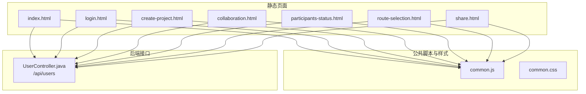
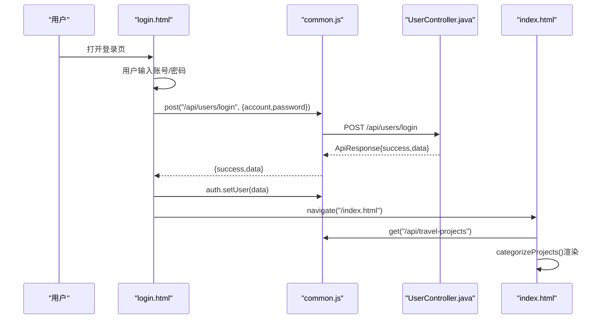
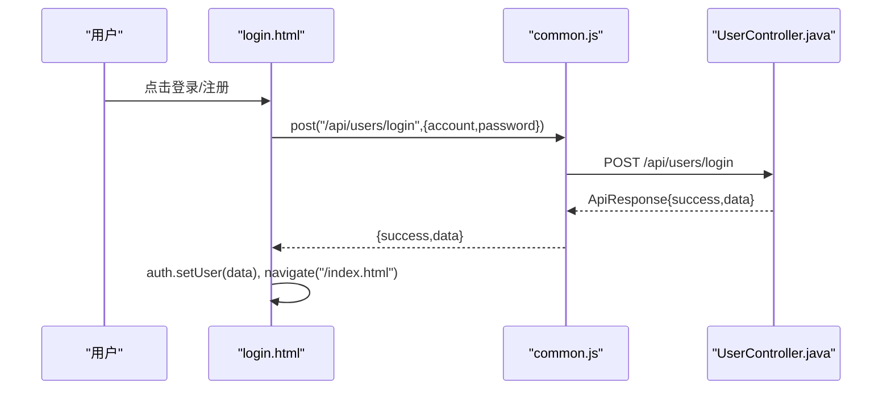
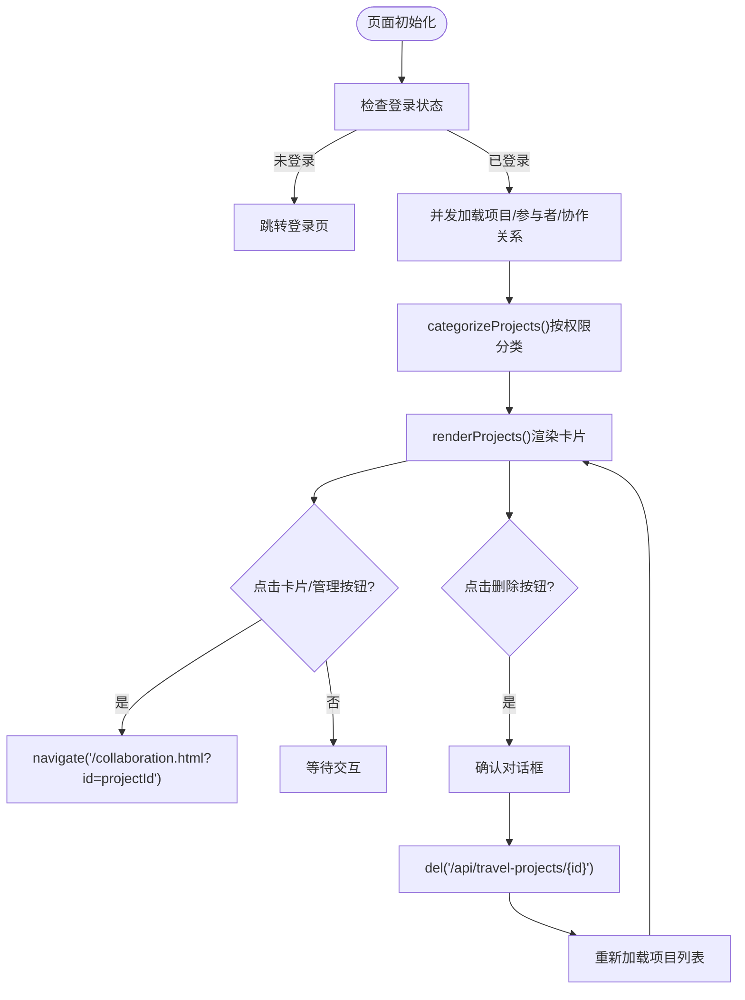
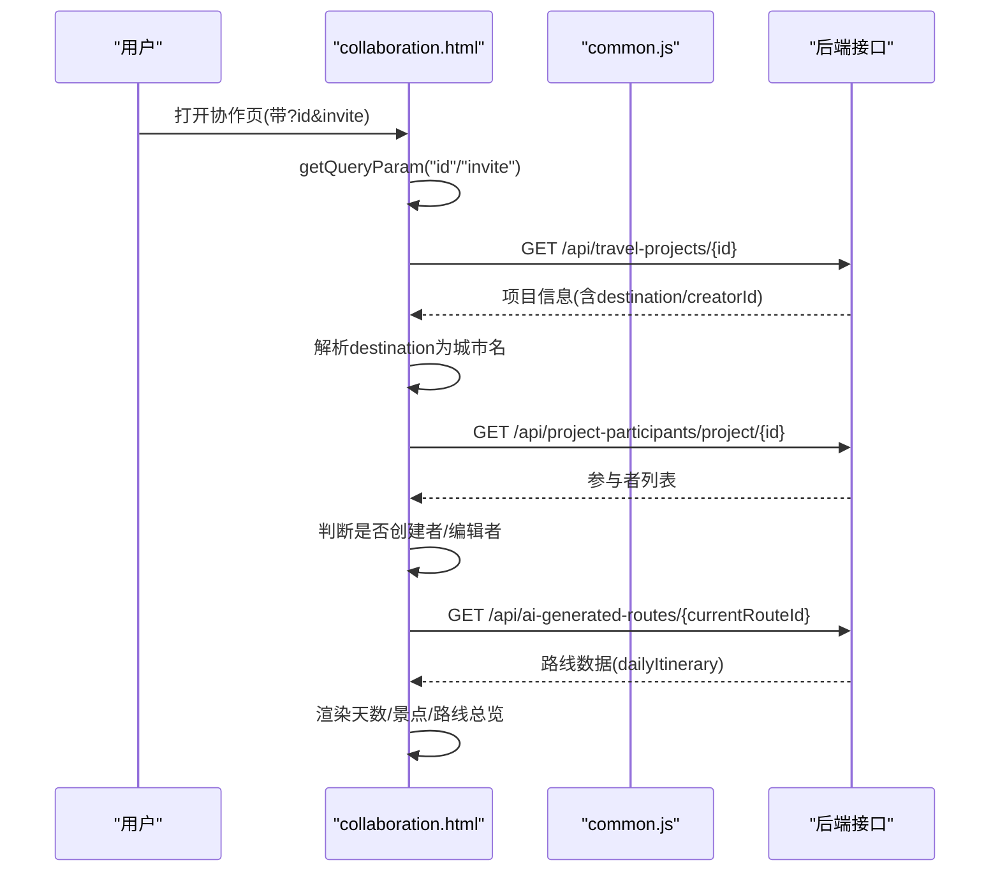
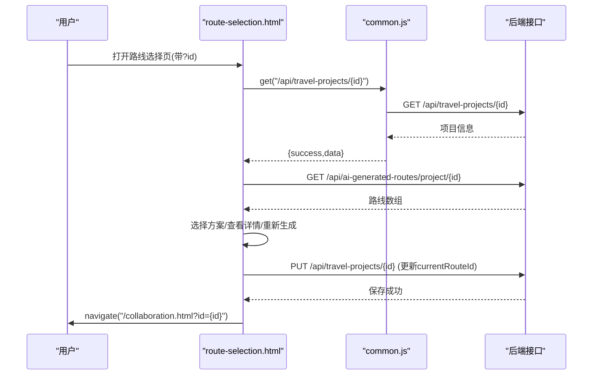
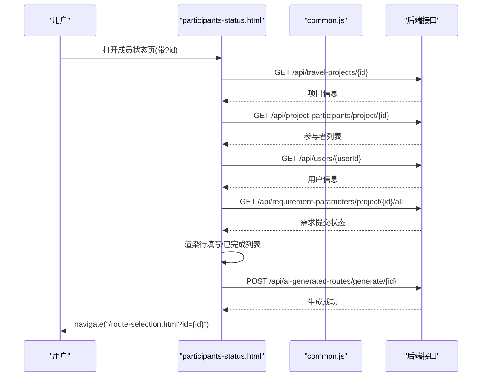
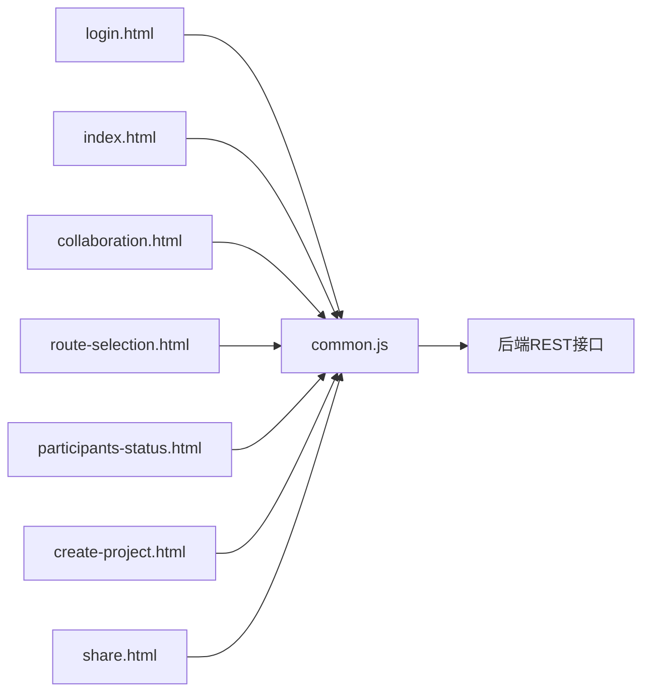

# 前端架构设计

<cite>
**本文引用的文件**
- [index.html](file://tudianersha/src/main/resources/static/index.html)
- [login.html](file://tudianersha/src/main/resources/static/login.html)
- [create-project.html](file://tudianersha/src/main/resources/static/create-project.html)
- [collaboration.html](file://tudianersha/src/main/resources/static/collaboration.html)
- [participants-status.html](file://tudianersha/src/main/resources/static/participants-status.html)
- [route-selection.html](file://tudianersha/src/main/resources/static/route-selection.html)
- [share.html](file://tudianersha/src/main/resources/static/share.html)
- [common.js](file://tudianersha/src/main/resources/static/js/common.js)
- [common.css](file://tudianersha/src/main/resources/static/css/common.css)
- [UserController.java](file://tudianersha/src/main/java/com/tudianersha/controller/UserController.java)
</cite>

## 目录
1. [引言](#引言)
2. [项目结构](#项目结构)
3. [核心组件](#核心组件)
4. [架构总览](#架构总览)
5. [详细组件分析](#详细组件分析)
6. [依赖关系分析](#依赖关系分析)
7. [性能考虑](#性能考虑)
8. [故障排查指南](#故障排查指南)
9. [结论](#结论)

## 引言
本文件系统性阐述前端页面架构与交互逻辑，重点围绕基于静态HTML文件的单页应用风格设计，说明JavaScript如何通过fetch API与后端REST接口通信，实现用户登录、项目加载、数据提交等功能；同时分析common.js中封装的通用HTTP请求函数及其错误处理机制，解释CSS样式文件如何实现响应式布局与现代化UI组件（卡片、按钮、状态标签）。结合index.html中的categorizeProjects()函数，说明前端如何根据用户权限分类展示项目列表，并描述页面间数据传递机制（如通过URL参数传递projectId）。最后提供前端组件结构图和关键交互流程图，帮助开发者理解UI状态管理。

## 项目结构
前端采用静态HTML+JS+CSS组织方式，页面位于静态资源目录，公共逻辑集中在common.js，样式统一在common.css中维护。页面之间通过URL参数传递数据，配合common.js提供的导航、鉴权、存储等工具实现单页应用风格的页面切换与状态管理。

图表来源
- [index.html](file://tudianersha/src/main/resources/static/index.html#L1-L515)
- [login.html](file://tudianersha/src/main/resources/static/login.html#L1-L405)
- [create-project.html](file://tudianersha/src/main/resources/static/create-project.html#L1-L800)
- [collaboration.html](file://tudianersha/src/main/resources/static/collaboration.html#L1-L800)
- [participants-status.html](file://tudianersha/src/main/resources/static/participants-status.html#L1-L436)
- [route-selection.html](file://tudianersha/src/main/resources/static/route-selection.html#L1-L606)
- [share.html](file://tudianersha/src/main/resources/static/share.html#L1-L333)
- [common.js](file://tudianersha/src/main/resources/static/js/common.js#L1-L272)
- [common.css](file://tudianersha/src/main/resources/static/css/common.css#L1-L295)
- [UserController.java](file://tudianersha/src/main/java/com/tudianersha/controller/UserController.java#L1-L152)

章节来源
- [index.html](file://tudianersha/src/main/resources/static/index.html#L1-L515)
- [common.js](file://tudianersha/src/main/resources/static/js/common.js#L1-L272)
- [common.css](file://tudianersha/src/main/resources/static/css/common.css#L1-L295)

## 核心组件
- 通用HTTP请求封装：在common.js中提供get/post/put/del等方法，统一处理content-type、响应体解析、错误返回等，简化各页面对后端API的调用。
- 鉴权与存储：auth模块负责用户登录状态检查、用户信息持久化与登出；storage模块提供localStorage封装。
- 工具函数：navigate、getQueryParam、formatDate、formatMoney、showAlert/showSuccess/showError、防抖节流、表单校验等。
- 样式体系：common.css提供导航、卡片、按钮、网格、标签、加载动画、响应式等通用样式，支撑页面UI一致性。

章节来源
- [common.js](file://tudianersha/src/main/resources/static/js/common.js#L1-L272)
- [common.css](file://tudianersha/src/main/resources/static/css/common.css#L1-L295)

## 架构总览
前端通过common.js统一发起fetch请求，后端由Spring MVC控制器提供REST接口。页面通过URL参数传递数据，利用auth/storage实现会话管理与页面跳转。index.html作为主入口，加载项目数据并按权限分类渲染；collaboration.html负责协作编辑；route-selection.html负责AI路线方案选择；participants-status.html负责成员状态与生成AI路线；login.html负责登录注册；create-project.html负责创建项目与偏好设置；share.html负责行程分享与PDF生成。

图表来源
- [login.html](file://tudianersha/src/main/resources/static/login.html#L270-L294)
- [common.js](file://tudianersha/src/main/resources/static/js/common.js#L42-L66)
- [UserController.java](file://tudianersha/src/main/java/com/tudianersha/controller/UserController.java#L86-L124)
- [index.html](file://tudianersha/src/main/resources/static/index.html#L290-L355)

## 详细组件分析

### 登录与注册页面（login.html）
- 功能要点
  - 切换登录/注册表单，表单字段校验（邮箱、验证码、密码一致性等）。
  - 通过post("/api/users/login")进行登录，成功后使用auth.setUser保存用户信息并跳转首页。
  - 通过post("/api/users")进行注册，成功后提示返回登录。
  - 发送验证码接口调用post("/api/email/send-code")，并做嵌套ApiResponse兼容处理。
- 错误处理
  - 对空值、格式错误、前后端返回message进行提示。
  - 使用showToast统一提示，避免阻断用户操作。
- 交互流程
  - 登录/注册提交 -> 调用common.js封装的post -> 后端返回ApiResponse -> 成功则保存用户并跳转，失败则提示。

图表来源
- [login.html](file://tudianersha/src/main/resources/static/login.html#L270-L294)
- [common.js](file://tudianersha/src/main/resources/static/js/common.js#L42-L66)
- [UserController.java](file://tudianersha/src/main/java/com/tudianersha/controller/UserController.java#L86-L124)

章节来源
- [login.html](file://tudianersha/src/main/resources/static/login.html#L1-L405)
- [common.js](file://tudianersha/src/main/resources/static/js/common.js#L1-L272)
- [UserController.java](file://tudianersha/src/main/java/com/tudianersha/controller/UserController.java#L1-L152)

### 主页与项目分类（index.html）
- 功能要点
  - 登录状态检查：未登录则跳转登录页。
  - 加载项目、参与者、协作关系数据，Promise.all并发请求提升性能。
  - categorizeProjects()按权限分类：创建者、编辑者、参与者（含协作中/进行中）。
  - 渲染项目卡片：不同角色渲染不同操作（管理、删除、查看详情）。
  - 删除项目：调用del("/api/travel-projects/{id}")，删除成功后重新加载。
  - 顶部用户菜单：下拉切换、退出登录。
- 关键交互
  - 项目卡片点击 -> navigate到协作页（携带projectId）。
  - 管理按钮 -> navigate到协作页（携带projectId）。
  - 删除按钮 -> 确认后调用删除接口并刷新列表。

图表来源
- [index.html](file://tudianersha/src/main/resources/static/index.html#L180-L355)
- [index.html](file://tudianersha/src/main/resources/static/index.html#L357-L512)
- [common.js](file://tudianersha/src/main/resources/static/js/common.js#L42-L66)

章节来源
- [index.html](file://tudianersha/src/main/resources/static/index.html#L1-L515)
- [common.js](file://tudianersha/src/main/resources/static/js/common.js#L1-L272)

### 协作编辑页面（collaboration.html）
- 功能要点
  - 通过URL参数获取projectId，若缺失则跳回首页。
  - 检查当前用户是否为创建者或编辑者，决定是否显示权限管理与新增活动按钮。
  - 通过后端代理接口解析目的地城市名，支持邀请链接自动加入项目。
  - 加载AI生成路线的天数选项，解析每日行程并渲染景点列表与路线总览。
  - 聊天室支持@成员提醒，支持导出PDF。
- 数据传递
  - URL参数：id（项目ID）、invite（邀请令牌）。
  - 通过getQueryParam获取并传入后端接口。
- 错误处理
  - 对API响应状态进行判断，失败时提示并记录日志。

图表来源
- [collaboration.html](file://tudianersha/src/main/resources/static/collaboration.html#L360-L544)
- [collaboration.html](file://tudianersha/src/main/resources/static/collaboration.html#L545-L720)

章节来源
- [collaboration.html](file://tudianersha/src/main/resources/static/collaboration.html#L1-L800)

### 路线选择页面（route-selection.html）
- 功能要点
  - 加载项目信息与AI生成的多个路线方案，支持查看详情与重新生成。
  - 选择方案后更新项目currentRouteId并跳转协作页。
  - 详情弹窗展示预算明细与每日行程安排。
- 数据传递
  - URL参数：id（项目ID）。
- 错误处理
  - 对API响应状态进行判断，失败时提示并允许重新生成。

图表来源
- [route-selection.html](file://tudianersha/src/main/resources/static/route-selection.html#L112-L170)
- [route-selection.html](file://tudianersha/src/main/resources/static/route-selection.html#L170-L220)
- [route-selection.html](file://tudianersha/src/main/resources/static/route-selection.html#L528-L569)

章节来源
- [route-selection.html](file://tudianersha/src/main/resources/static/route-selection.html#L1-L606)

### 参与成员状态页面（participants-status.html）
- 功能要点
  - 展示参与成员的填写状态（正在填写/已完成）。
  - 复制邀请链接，生成AI路线方案并跳转路线选择页。
  - 定时轮询更新状态。
- 数据传递
  - URL参数：id（项目ID）。
- 错误处理
  - 对API异常进行捕获并提示。

图表来源
- [participants-status.html](file://tudianersha/src/main/resources/static/participants-status.html#L262-L312)
- [participants-status.html](file://tudianersha/src/main/resources/static/participants-status.html#L381-L426)

章节来源
- [participants-status.html](file://tudianersha/src/main/resources/static/participants-status.html#L1-L436)

### 创建项目页面（create-project.html）
- 功能要点
  - 高德地图自动完成与POI搜索，支持添加/删除想去/不喜欢的景点。
  - 预算汇总与每日预算计算。
  - 提交后生成AI方案并跳转路线选择页。
- 数据传递
  - URL参数：projectId（用于邀请链接场景）。
- 错误处理
  - 对API响应进行判断，失败时提示。

章节来源
- [create-project.html](file://tudianersha/src/main/resources/static/create-project.html#L1-L800)

### 分享与PDF页面（share.html）
- 功能要点
  - 预览行程安排与预算明细。
  - 生成PDF链接与分享链接，保存共享记录。
- 数据传递
  - URL参数：id（项目ID）。
- 错误处理
  - 对API异常进行捕获并提示。

章节来源
- [share.html](file://tudianersha/src/main/resources/static/share.html#L1-L333)

## 依赖关系分析
- 页面依赖关系
  - 所有页面均引入common.js，依赖其API封装、鉴权、导航、工具函数。
  - 页面间通过navigate进行跳转，通过getQueryParam传递数据。
- 后端接口依赖
  - 登录/注册：/api/users、/api/users/login
  - 项目与参与者：/api/travel-projects、/api/project-participants
  - AI路线：/api/ai-generated-routes
  - 地理编码：/api/amap-test/geocode
  - 共享文档：/api/shared-documents
- 错误处理与容错
  - common.js对fetch响应进行统一处理，返回{success,error}结构，便于前端分支处理。
  - login.html对嵌套ApiResponse做兼容处理，确保验证码流程稳定。
  - 各页面对网络异常、空响应、非JSON响应进行健壮处理。

图表来源
- [common.js](file://tudianersha/src/main/resources/static/js/common.js#L1-L272)
- [login.html](file://tudianersha/src/main/resources/static/login.html#L270-L294)
- [index.html](file://tudianersha/src/main/resources/static/index.html#L290-L355)
- [collaboration.html](file://tudianersha/src/main/resources/static/collaboration.html#L360-L544)
- [route-selection.html](file://tudianersha/src/main/resources/static/route-selection.html#L112-L170)
- [participants-status.html](file://tudianersha/src/main/resources/static/participants-status.html#L262-L312)
- [create-project.html](file://tudianersha/src/main/resources/static/create-project.html#L1-L800)
- [share.html](file://tudianersha/src/main/resources/static/share.html#L163-L204)

章节来源
- [common.js](file://tudianersha/src/main/resources/static/js/common.js#L1-L272)
- [UserController.java](file://tudianersha/src/main/java/com/tudianersha/controller/UserController.java#L1-L152)

## 性能考虑
- 并发请求：index.html使用Promise.all并发加载项目、参与者、协作关系，减少首屏等待时间。
- 防抖与节流：common.js提供debounce/throttle，适合高频输入/滚动场景（如搜索、滚动加载）。
- 响应式布局：common.css提供@media规则，移动端优先，降低重排成本。
- 图片与第三方资源：路由选择页对多图拼接与占位图做了容错处理，避免因图片加载失败影响整体体验。

## 故障排查指南
- 登录失败
  - 检查后端接口是否可达，确认/account与/password字段是否正确传递。
  - 查看控制台错误与后端日志，确认用户名/邮箱是否存在、密码是否匹配。
- 项目加载异常
  - 确认API返回是否为JSON，content-type是否为application/json。
  - 检查index.html中Promise.all的三个接口是否都返回success。
- 权限判断问题
  - collaboration.html需确认project-participants接口返回的permission字段是否符合预期。
- 邀请链接加入项目
  - 检查inviteToken是否有效，后端是否允许匿名访问项目参与者接口。
- UI状态不一致
  - 使用showSuccess/showError统一提示，避免静默失败。
  - 对关键按钮增加禁用与加载态，防止重复提交。

章节来源
- [login.html](file://tudianersha/src/main/resources/static/login.html#L270-L294)
- [index.html](file://tudianersha/src/main/resources/static/index.html#L290-L355)
- [collaboration.html](file://tudianersha/src/main/resources/static/collaboration.html#L360-L544)
- [common.js](file://tudianersha/src/main/resources/static/js/common.js#L120-L175)

## 结论
该前端架构以静态HTML为基础，借助common.js统一的HTTP请求封装与鉴权工具，实现了登录、项目加载、权限分类、协作编辑、路线选择、成员状态、分享与PDF导出等完整业务闭环。页面间通过URL参数传递数据，配合导航与存储工具实现单页应用风格的流畅体验。样式体系采用common.css统一规范，保证了响应式与一致性。通过Promise.all并发请求与防抖节流等优化手段，在保证用户体验的同时兼顾性能与稳定性。