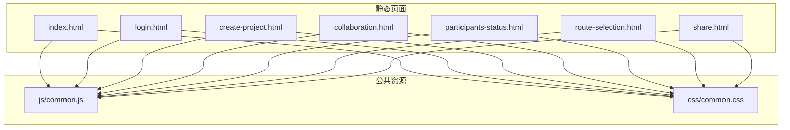
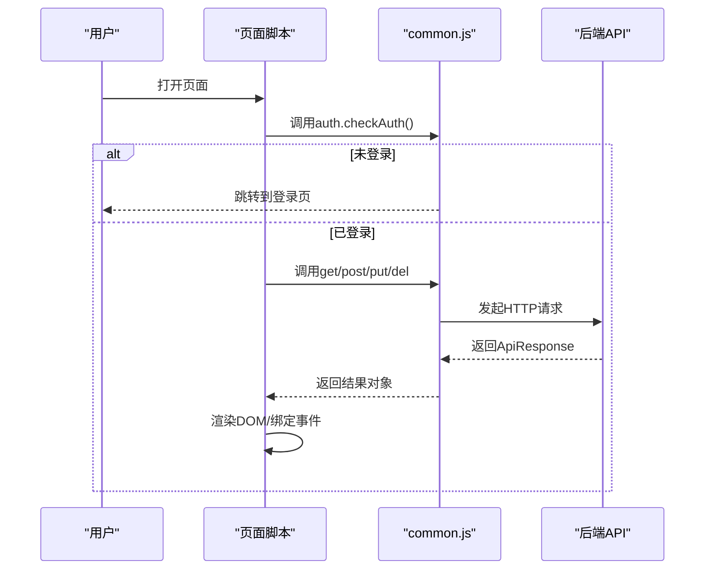
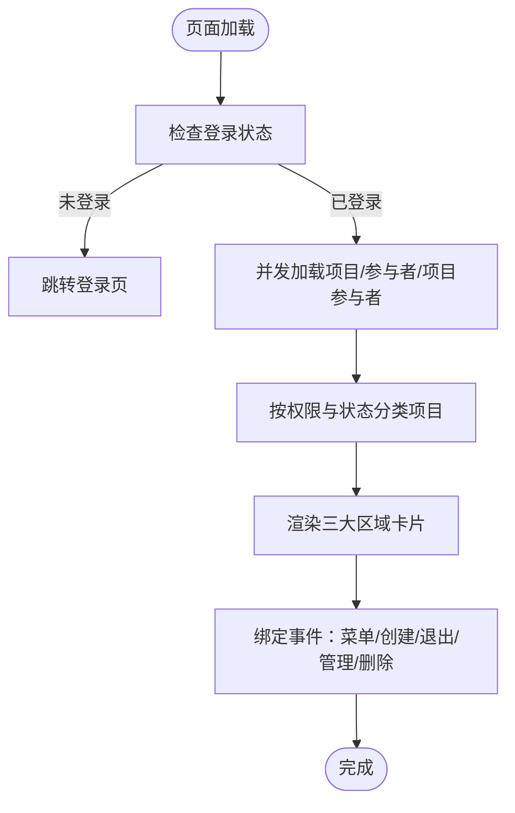
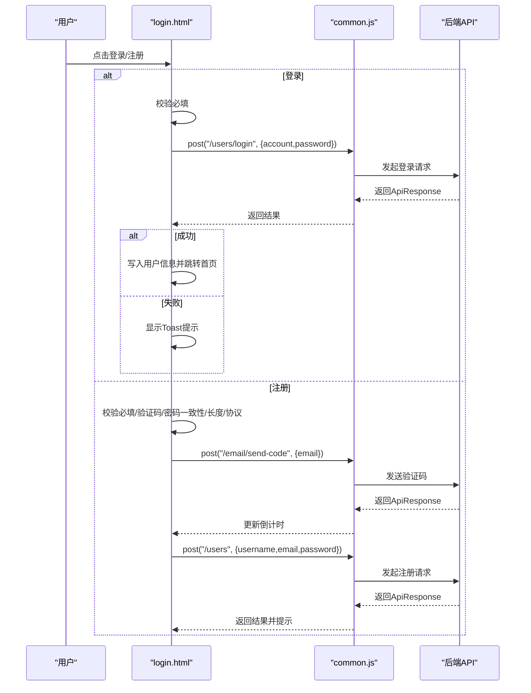
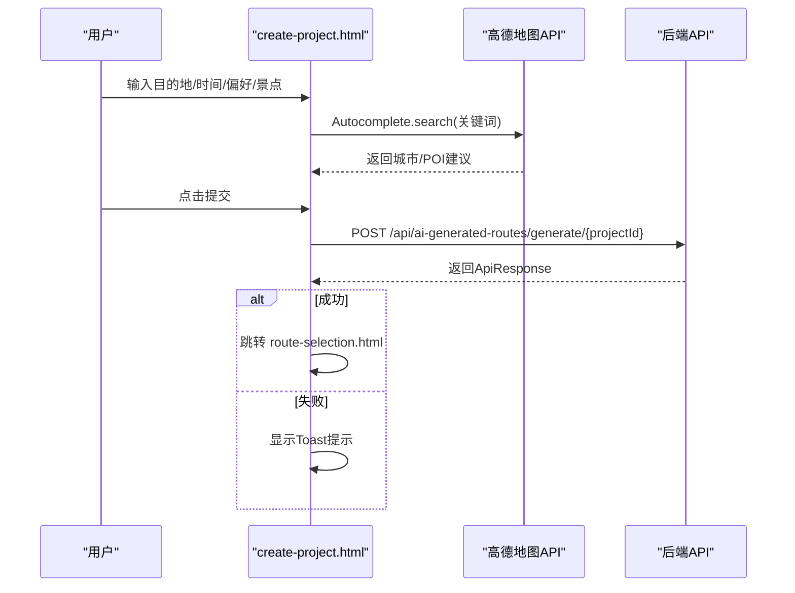
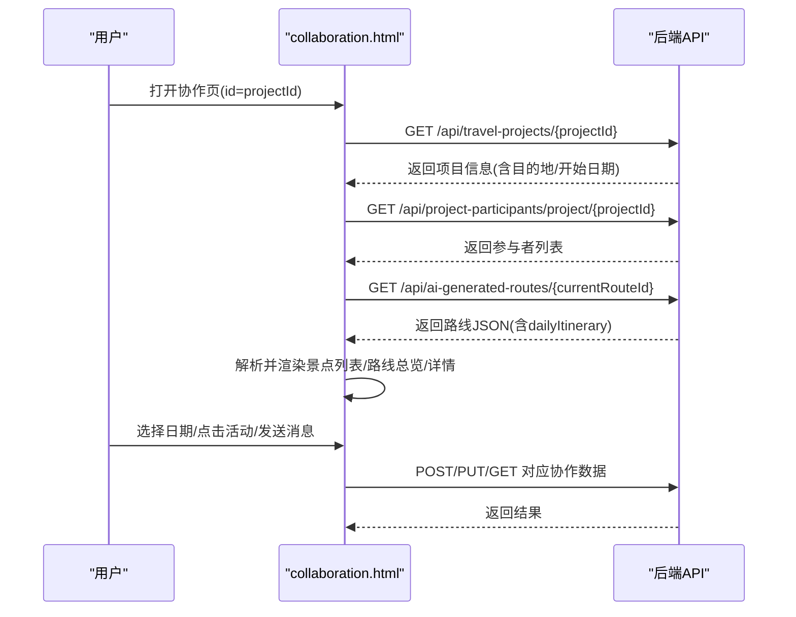
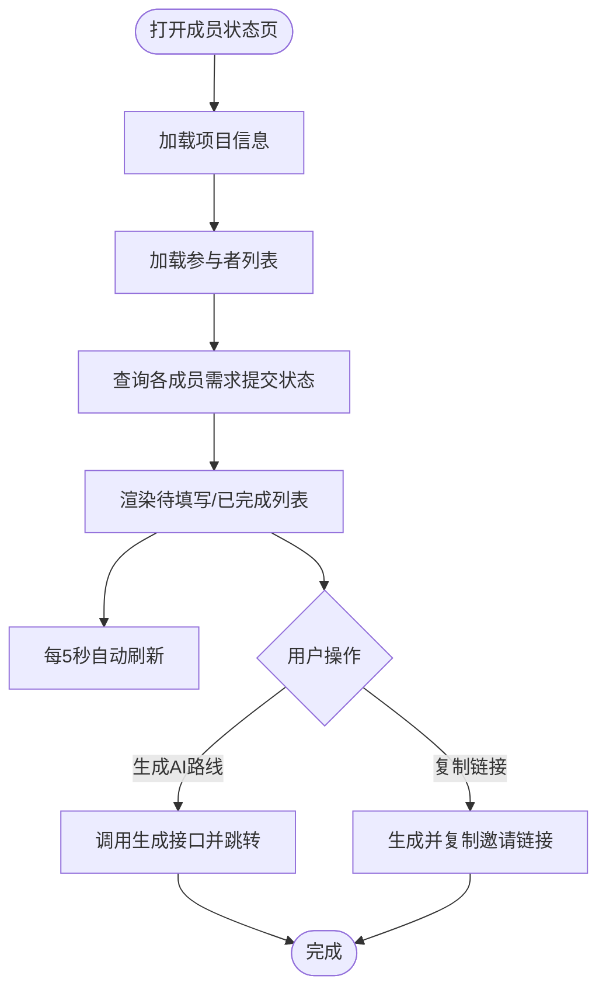
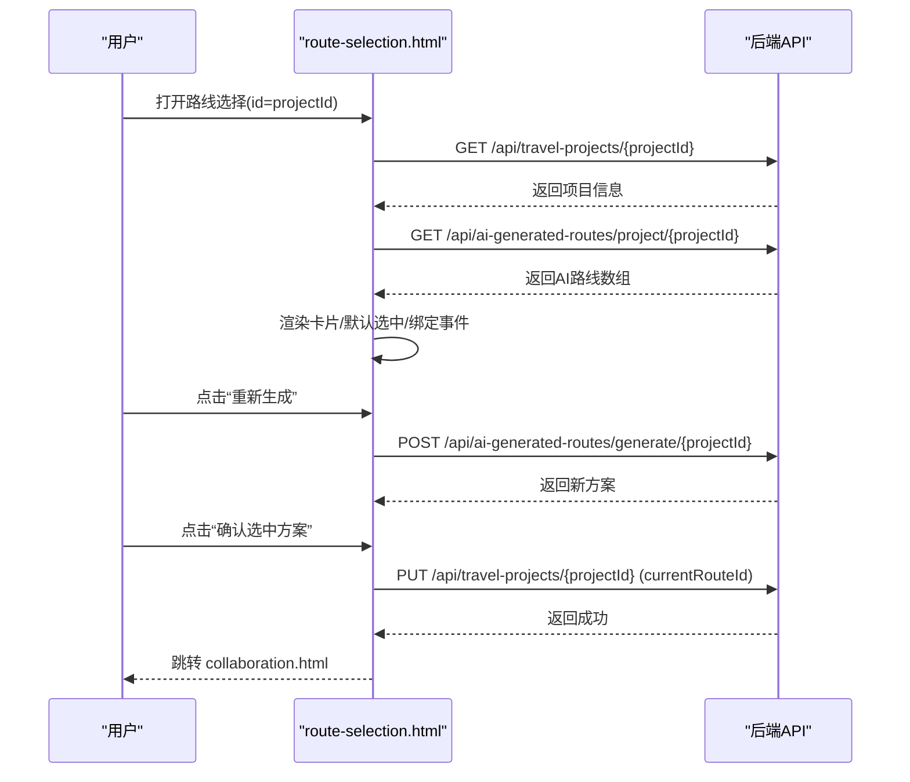
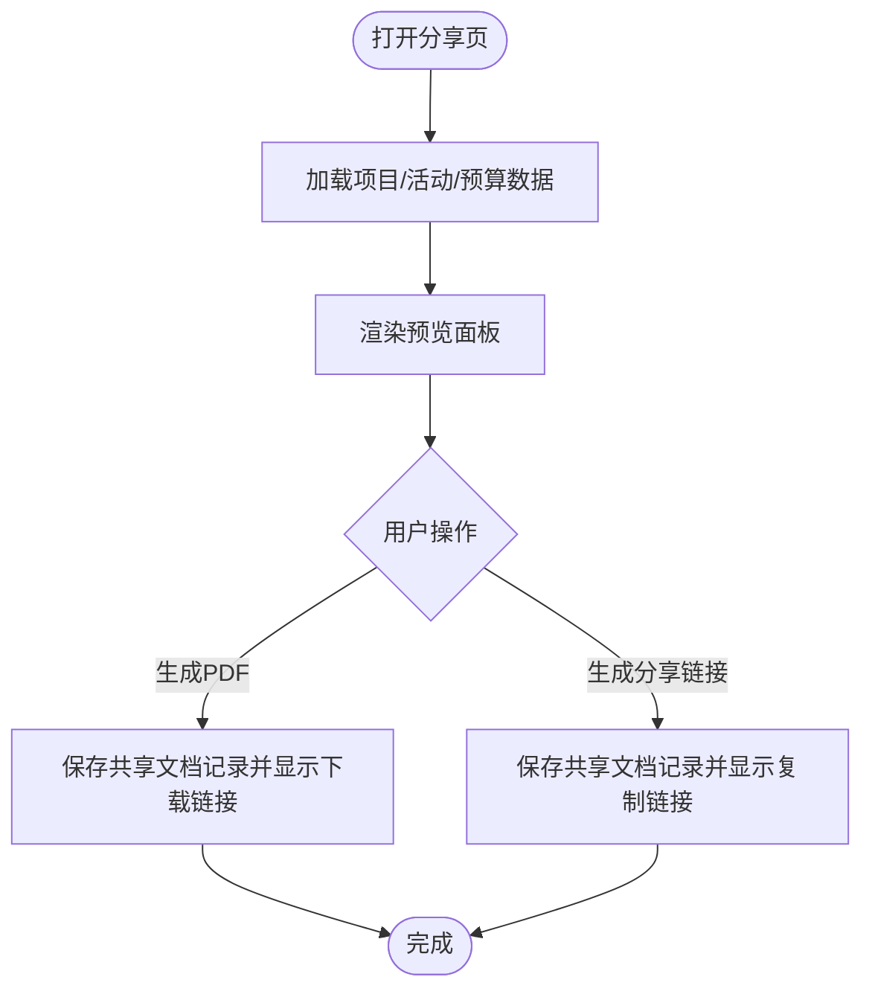
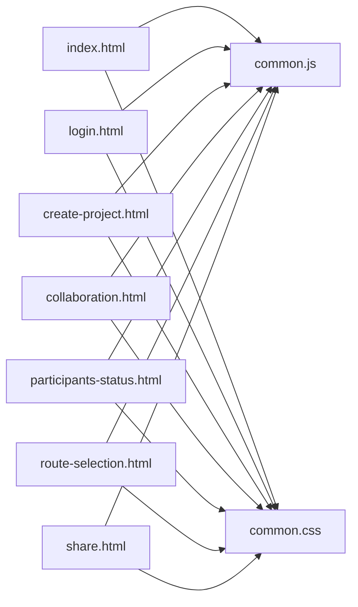

# 页面结构

<cite>
**本文引用的文件**
- [index.html](file://tudianersha/src/main/resources/static/index.html)
- [login.html](file://tudianersha/src/main/resources/static/login.html)
- [create-project.html](file://tudianersha/src/main/resources/static/create-project.html)
- [collaboration.html](file://tudianersha/src/main/resources/static/collaboration.html)
- [participants-status.html](file://tudianersha/src/main/resources/static/participants-status.html)
- [route-selection.html](file://tudianersha/src/main/resources/static/route-selection.html)
- [share.html](file://tudianersha/src/main/resources/static/share.html)
- [common.js](file://tudianersha/src/main/resources/static/js/common.js)
- [common.css](file://tudianersha/src/main/resources/static/css/common.css)
</cite>

## 目录
1. [引言](#引言)
2. [项目结构](#项目结构)
3. [核心组件](#核心组件)
4. [架构总览](#架构总览)
5. [详细组件分析](#详细组件分析)
6. [依赖关系分析](#依赖关系分析)
7. [性能考量](#性能考量)
8. [故障排查指南](#故障排查指南)
9. [结论](#结论)

## 引言
本文件面向前端开发者与产品/运营人员，系统性梳理途点儿啥旅行规划平台的静态HTML页面结构与交互职责，并结合页面中的DOM结构、数据属性与JavaScript钩子，说明各页面如何与后端API协同工作。重点覆盖：
- index.html作为主入口，负责项目列表展示与导航；
- login.html的表单结构与验证逻辑；
- create-project.html中旅行项目创建表单的设计与数据绑定方式；
- collaboration.html与participants-status.html在多人协作场景下的状态同步机制；
- route-selection.html如何展示AI生成的多条路线供用户选择；
- share.html用于行程分享的布局设计。

## 项目结构
前端页面位于资源目录 static 下，采用按页面拆分的组织方式，配合统一的公共脚本 common.js 与样式 common.css，实现跨页面的一致行为与UI风格。

图表来源
- [index.html](file://tudianersha/src/main/resources/static/index.html#L1-L515)
- [login.html](file://tudianersha/src/main/resources/static/login.html#L1-L405)
- [create-project.html](file://tudianersha/src/main/resources/static/create-project.html#L1-L800)
- [collaboration.html](file://tudianersha/src/main/resources/static/collaboration.html#L1-L800)
- [participants-status.html](file://tudianersha/src/main/resources/static/participants-status.html#L1-L436)
- [route-selection.html](file://tudianersha/src/main/resources/static/route-selection.html#L1-L606)
- [share.html](file://tudianersha/src/main/resources/static/share.html#L1-L333)
- [common.js](file://tudianersha/src/main/resources/static/js/common.js#L1-L272)
- [common.css](file://tudianersha/src/main/resources/static/css/common.css#L1-L295)

章节来源
- [index.html](file://tudianersha/src/main/resources/static/index.html#L1-L515)
- [login.html](file://tudianersha/src/main/resources/static/login.html#L1-L405)
- [create-project.html](file://tudianersha/src/main/resources/static/create-project.html#L1-L800)
- [collaboration.html](file://tudianersha/src/main/resources/static/collaboration.html#L1-L800)
- [participants-status.html](file://tudianersha/src/main/resources/static/participants-status.html#L1-L436)
- [route-selection.html](file://tudianersha/src/main/resources/static/route-selection.html#L1-L606)
- [share.html](file://tudianersha/src/main/resources/static/share.html#L1-L333)
- [common.js](file://tudianersha/src/main/resources/static/js/common.js#L1-L272)
- [common.css](file://tudianersha/src/main/resources/static/css/common.css#L1-L295)

## 核心组件
- 通用API封装与认证模块：统一的get/post/put/del与auth/storage工具，简化页面对后端API的调用与会话管理。
- 页面级事件绑定与数据渲染：各页面通过DOMContentLoaded与事件监听器完成初始化、表单提交、列表渲染与导航跳转。
- 高德地图集成：在创建行程页面集成Autocomplete与PlaceSearch插件，提供城市与POI搜索能力。
- 路线数据可视化：在协作与路线选择页面解析后端返回的JSON结构化行程，进行卡片化与详情展示。

章节来源
- [common.js](file://tudianersha/src/main/resources/static/js/common.js#L1-L272)
- [create-project.html](file://tudianersha/src/main/resources/static/create-project.html#L1-L800)
- [route-selection.html](file://tudianersha/src/main/resources/static/route-selection.html#L1-L606)
- [collaboration.html](file://tudianersha/src/main/resources/static/collaboration.html#L1-L800)

## 架构总览
前端页面通过统一的common.js与后端API交互，遵循如下流程：
- 登录校验：所有页面在加载时调用auth.checkAuth，未登录自动跳转登录页。
- 数据获取：通过get/post/put/del封装的API函数访问后端接口。
- 会话管理：auth.setUser/getUser/logout统一管理用户信息与登录状态。
- 页面跳转：navigate统一处理页面跳转，避免硬编码路径。

图表来源
- [common.js](file://tudianersha/src/main/resources/static/js/common.js#L1-L272)
- [index.html](file://tudianersha/src/main/resources/static/index.html#L1-L515)
- [login.html](file://tudianersha/src/main/resources/static/login.html#L1-L405)
- [collaboration.html](file://tudianersha/src/main/resources/static/collaboration.html#L1-L800)
- [route-selection.html](file://tudianersha/src/main/resources/static/route-selection.html#L1-L606)
- [participants-status.html](file://tudianersha/src/main/resources/static/participants-status.html#L1-L436)
- [create-project.html](file://tudianersha/src/main/resources/static/create-project.html#L1-L800)
- [share.html](file://tudianersha/src/main/resources/static/share.html#L1-L333)

## 详细组件分析

### index.html 主入口与项目列表
- 导航与用户信息：包含创建新项目、帮助中心、关于我们导航项，以及用户头像与下拉菜单（含退出登录）。
- 三大项目区域：
  - 我创建的旅途：仅展示创建者身份的项目，支持删除与“管理旅程”跳转。
  - 我编辑的旅途：展示具有编辑权限的项目，显示“正在编辑”状态。
  - 我参与的旅途：展示非创建者且处于“协作中/进行中”的项目，显示“已参与”状态。
- 项目卡片：
  - 列表项包含项目名称、目的地、状态徽章、参与者人数等信息。
  - 创建者卡片额外提供删除与管理按钮；普通卡片点击跳转协作页。
- 数据加载与分类：
  - 同步加载旅行项目、旅行参与者与项目参与者三类数据，按权限与状态进行分类渲染。
  - 通过去重合并两个参与者集合，统计实际参与人数。
- 交互与导航：
  - 创建按钮与导航栏“创建新项目”均跳转到创建行程页。
  - 退出登录清除本地用户信息并跳转登录页。
  - 成功/失败提示通过固定Toast组件展示。

图表来源
- [index.html](file://tudianersha/src/main/resources/static/index.html#L1-L515)

章节来源
- [index.html](file://tudianersha/src/main/resources/static/index.html#L1-L515)

### login.html 登录与注册表单
- 结构组成：
  - 标签页切换：登录/注册双面板，点击切换。
  - 登录表单：账号（邮箱）、密码、第三方登录入口。
  - 注册表单：用户名、邮箱、验证码输入与倒计时发送、密码与确认密码、用户协议勾选。
- 验证逻辑：
  - 登录：必填校验，调用后端登录接口，成功后写入用户信息并跳转首页。
  - 注册：必填校验、验证码一致性校验、两次密码一致性、密码长度、协议勾选；验证码发送通过邮箱正则校验与倒计时控制。
- 交互细节：
  - Toast提示统一使用固定提示框。
  - 微信登录按钮预留提示，后续扩展。
  - Tab切换时动态更新提示文案与事件绑定。

图表来源
- [login.html](file://tudianersha/src/main/resources/static/login.html#L1-L405)
- [common.js](file://tudianersha/src/main/resources/static/js/common.js#L1-L272)

章节来源
- [login.html](file://tudianersha/src/main/resources/static/login.html#L1-L405)
- [common.js](file://tudianersha/src/main/resources/static/js/common.js#L1-L272)

### create-project.html 旅行项目创建表单
- 布局结构：
  - 左侧：旅行基本信息（目的地、开始/结束时间）、兴趣偏好（多选图标）、想去/不喜欢的景点列表（支持动态添加）。
  - 右侧：预算汇总（每日预算项与合计）与协作分享入口（初始隐藏）。
- 数据绑定与交互：
  - 城市搜索：集成高德地图Autocomplete，支持防抖搜索与下拉提示。
  - POI搜索：针对“想去/不喜欢”输入框提供自动补全与下拉列表。
  - 预算项：默认包含若干预算项，支持动态增删与实时计算每日合计。
  - 行为：提交后调用后端生成AI方案接口，随后跳转到路线选择页。
- 协作分享：
  - 创建成功后显示“分享协作链接”，支持复制与查看成员。
  - 参与者通过链接进入后可填写偏好，最终驱动AI路线生成。

图表来源
- [create-project.html](file://tudianersha/src/main/resources/static/create-project.html#L1-L800)
- [common.js](file://tudianersha/src/main/resources/static/js/common.js#L1-L272)

章节来源
- [create-project.html](file://tudianersha/src/main/resources/static/create-project.html#L1-L800)
- [common.js](file://tudianersha/src/main/resources/static/js/common.js#L1-L272)

### collaboration.html 多人协作界面
- 结构划分：
  - 左侧：景点列表（按天筛选）、右侧：路线总览（横向网格）、右侧：景点详情与AI介绍、底部：团队聊天。
- 协作机制：
  - 权限管理：创建者显示“权限管理”按钮，支持编辑者/查看者角色切换。
  - 邀请机制：通过邀请token自动加入项目并刷新参与者列表。
  - 路线展示：从项目关联的AI路线中解析每日行程，支持日期切换与活动详情。
  - 聊天：@提及功能、消息滚动、发送按钮。
- 数据来源：
  - 项目信息、参与者列表、路线数据、活动数据均来自后端API。
  - 目的地城市解析：若为非标准城市名，通过后端Geocoding接口解析真实城市名。

图表来源
- [collaboration.html](file://tudianersha/src/main/resources/static/collaboration.html#L1-L800)
- [common.js](file://tudianersha/src/main/resources/static/js/common.js#L1-L272)

章节来源
- [collaboration.html](file://tudianersha/src/main/resources/static/collaboration.html#L1-L800)
- [common.js](file://tudianersha/src/main/resources/static/js/common.js#L1-L272)

### participants-status.html 成员状态与AI生成
- 视图职责：
  - 展示所有参与者的填写状态（进行中/已完成），并提供复制邀请链接与生成AI路线按钮。
  - 自动每5秒刷新一次数据，保证状态实时性。
- 业务流程：
  - 生成AI路线：调用后端生成接口，成功后跳转到路线选择页。
  - 复制邀请链接：生成带token的分享URL，粘贴后参与者可填写偏好。

图表来源
- [participants-status.html](file://tudianersha/src/main/resources/static/participants-status.html#L1-L436)
- [common.js](file://tudianersha/src/main/resources/static/js/common.js#L1-L272)

章节来源
- [participants-status.html](file://tudianersha/src/main/resources/static/participants-status.html#L1-L436)
- [common.js](file://tudianersha/src/main/resources/static/js/common.js#L1-L272)

### route-selection.html AI路线选择
- 展示策略：
  - 并发加载项目信息与AI路线列表，支持默认选中第一条并展示详情模态。
  - 每条路线卡片包含封面图（支持多图拼接）、推荐指数、标签、预算、景点/餐厅/交通概览、选择/查看详情按钮。
- 交互流程：
  - 重新生成：覆盖当前方案，保持选中状态不变。
  - 确认选择：将所选路线ID写回项目currentRouteId，然后跳转协作页。
  - 详情模态：解析dailyItinerary结构化数据，按天/活动渲染；若无结构化数据，则展示美化后的AI原始内容。

图表来源
- [route-selection.html](file://tudianersha/src/main/resources/static/route-selection.html#L1-L606)
- [common.js](file://tudianersha/src/main/resources/static/js/common.js#L1-L272)

章节来源
- [route-selection.html](file://tudianersha/src/main/resources/static/route-selection.html#L1-L606)
- [common.js](file://tudianersha/src/main/resources/static/js/common.js#L1-L272)

### share.html 行程分享
- 预览与导出：
  - 预览面板展示项目标题、基本信息、每日活动与预算明细。
  - 支持生成PDF与生成分享链接两种导出方式，分别保存到共享文档记录并提供下载/复制链接。
- 数据来源：
  - 通过get封装的API获取项目、活动与预算数据，按天聚合渲染。

图表来源
- [share.html](file://tudianersha/src/main/resources/static/share.html#L1-L333)
- [common.js](file://tudianersha/src/main/resources/static/js/common.js#L1-L272)

章节来源
- [share.html](file://tudianersha/src/main/resources/static/share.html#L1-L333)
- [common.js](file://tudianersha/src/main/resources/static/js/common.js#L1-L272)

## 依赖关系分析
- 页面到公共库：
  - 所有页面均引入 /js/common.js 与 /css/common.css，确保统一的API封装、认证、样式与工具函数。
- 页面到后端API：
  - 通过封装的get/post/put/del与auth/storage，页面以统一模式访问后端接口，减少重复代码与耦合度。
- 页面间导航：
  - 通过navigate统一跳转，避免硬编码路径导致的维护成本。

图表来源
- [index.html](file://tudianersha/src/main/resources/static/index.html#L1-L515)
- [login.html](file://tudianersha/src/main/resources/static/login.html#L1-L405)
- [create-project.html](file://tudianersha/src/main/resources/static/create-project.html#L1-L800)
- [collaboration.html](file://tudianersha/src/main/resources/static/collaboration.html#L1-L800)
- [participants-status.html](file://tudianersha/src/main/resources/static/participants-status.html#L1-L436)
- [route-selection.html](file://tudianersha/src/main/resources/static/route-selection.html#L1-L606)
- [share.html](file://tudianersha/src/main/resources/static/share.html#L1-L333)
- [common.js](file://tudianersha/src/main/resources/static/js/common.js#L1-L272)
- [common.css](file://tudianersha/src/main/resources/static/css/common.css#L1-L295)

章节来源
- [common.js](file://tudianersha/src/main/resources/static/js/common.js#L1-L272)
- [common.css](file://tudianersha/src/main/resources/static/css/common.css#L1-L295)

## 性能考量
- 并发加载：首页同时发起多个API请求，缩短首屏渲染时间。
- 防抖与节流：创建页对高德搜索与输入事件采用防抖/节流，降低频繁请求与DOM更新压力。
- 懒加载与条件渲染：协作页在无路线时显示提示，避免无效渲染。
- 本地存储：使用localStorage缓存用户信息，减少重复登录与网络往返。

## 故障排查指南
- 登录失败：
  - 检查登录表单必填字段与邮箱格式；查看后端返回message并结合Toast提示定位问题。
- 验证码异常：
  - 确认邮箱格式正确、倒计时逻辑正常；检查common.js对嵌套ApiResponse的兼容处理。
- 项目列表为空：
  - 确认auth.isLoggedIn返回true；检查后端返回数据结构与权限过滤逻辑。
- 路线选择无数据：
  - 确认项目currentRouteId存在；检查后端AI生成接口是否返回dailyItinerary。
- 协作页无成员：
  - 确认邀请token有效并已加入项目；检查后端project-participants接口返回。
- 分享页PDF/链接：
  - 确认共享文档记录保存成功；模拟下载需后端支持。

章节来源
- [login.html](file://tudianersha/src/main/resources/static/login.html#L1-L405)
- [index.html](file://tudianersha/src/main/resources/static/index.html#L1-L515)
- [route-selection.html](file://tudianersha/src/main/resources/static/route-selection.html#L1-L606)
- [collaboration.html](file://tudianersha/src/main/resources/static/collaboration.html#L1-L800)
- [share.html](file://tudianersha/src/main/resources/static/share.html#L1-L333)
- [common.js](file://tudianersha/src/main/resources/static/js/common.js#L1-L272)

## 结论
本项目前端页面围绕“创建—协作—选择—分享”的主线展开，通过统一的common.js与common.css实现跨页面一致的交互体验与数据流。index.html承担主入口与项目管理职责；login.html提供完善的登录/注册流程；create-project.html完成旅行需求收集与AI生成触发；collaboration.html与participants-status.html构建协作闭环；route-selection.html负责AI方案的选择与落地；share.html提供行程导出与分享能力。整体结构清晰、职责明确，便于扩展与维护。