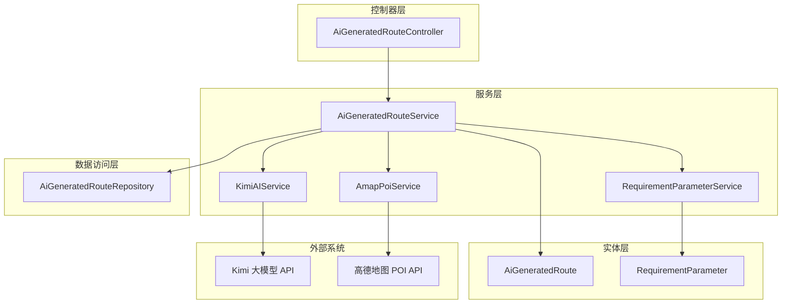
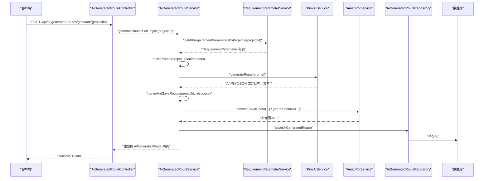
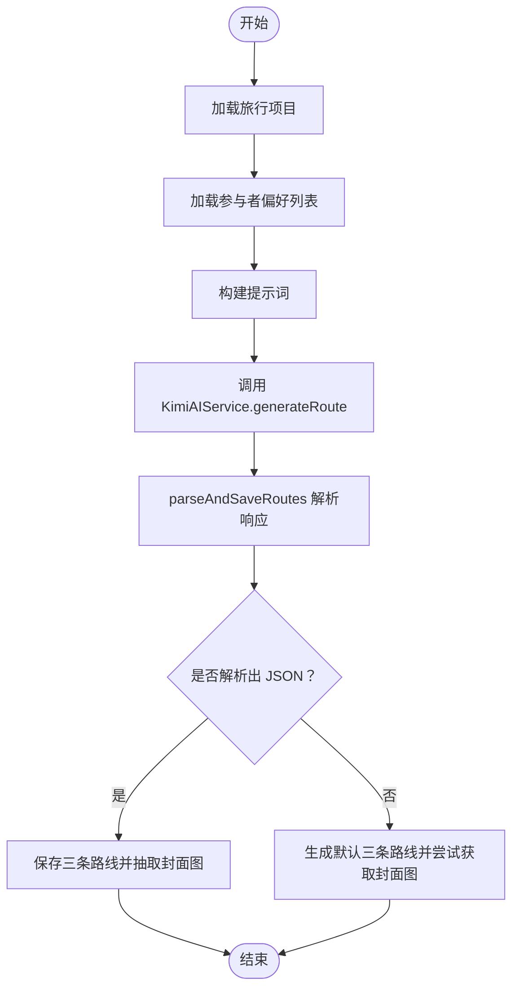
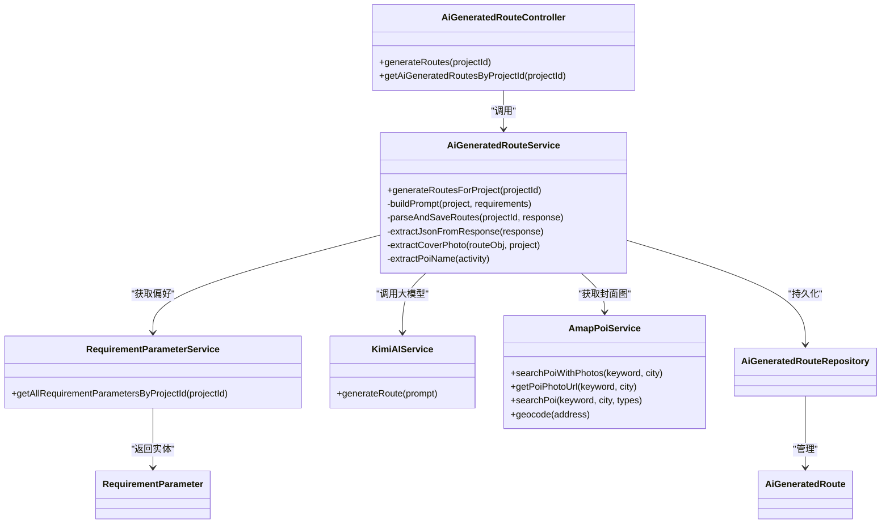

# AI路线生成

<cite>
**本文引用的文件列表**
- [AiGeneratedRouteController.java](file://tudianersha/src/main/java/com/tudianersha/controller/AiGeneratedRouteController.java)
- [AiGeneratedRouteService.java](file://tudianersha/src/main/java/com/tudianersha/service/AiGeneratedRouteService.java)
- [RequirementParameter.java](file://tudianersha/src/main/java/com/tudianersha/entity/RequirementParameter.java)
- [RequirementParameterService.java](file://tudianersha/src/main/java/com/tudianersha/service/RequirementParameterService.java)
- [KimiAIService.java](file://tudianersha/src/main/java/com/tudianersha/service/KimiAIService.java)
- [AmapPoiService.java](file://tudianersha/src/main/java/com/tudianersha/service/AmapPoiService.java)
- [AiGeneratedRoute.java](file://tudianersha/src/main/java/com/tudianersha/entity/AiGeneratedRoute.java)
- [AiGeneratedRouteRepository.java](file://tudianersha/src/main/java/com/tudianersha/repository/AiGeneratedRouteRepository.java)
- [application.yml](file://tudianersha/src/main/resources/application.yml)
</cite>

## 目录
1. [简介](#简介)
2. [项目结构](#项目结构)
3. [核心组件](#核心组件)
4. [架构总览](#架构总览)
5. [组件详解](#组件详解)
6. [依赖关系分析](#依赖关系分析)
7. [性能与延迟处理](#性能与延迟处理)
8. [故障排查指南](#故障排查指南)
9. [结论](#结论)
10. [附录](#附录)

## 简介
本文件深入解析“AI智能路线生成模块”的技术实现，围绕以下目标展开：
- AiGeneratedRouteController 如何接收用户需求参数并触发 AI 推荐流程
- AiGeneratedRouteService 如何整合 KimiAIService 与 AmapPoiService 获取个性化路线建议
- RequirementParameter 实体在收集用户偏好（如出行时间、兴趣点类型）中的作用
- KimiAIService 调用大模型 API 生成文本描述的交互过程
- AmapPoiService 解析地理信息数据的实现细节
- AI 生成结果的存储结构（AiGeneratedRoute 实体）与前端展示逻辑的对接方式
- AI 响应延迟的处理机制与缓存策略

## 项目结构
该模块位于后端 Spring Boot 工程 tudianersha 中，采用典型的分层架构：
- 控制器层：AiGeneratedRouteController 提供 REST 接口
- 服务层：AiGeneratedRouteService 负责业务编排与数据处理
- 数据访问层：AiGeneratedRouteRepository 基于 JPA
- 实体层：AiGeneratedRoute、RequirementParameter 等
- 外部集成：KimiAIService（大模型）、AmapPoiService（地理信息）

图表来源
- [AiGeneratedRouteController.java](file://tudianersha/src/main/java/com/tudianersha/controller/AiGeneratedRouteController.java#L1-L112)
- [AiGeneratedRouteService.java](file://tudianersha/src/main/java/com/tudianersha/service/AiGeneratedRouteService.java#L1-L120)
- [RequirementParameterService.java](file://tudianersha/src/main/java/com/tudianersha/service/RequirementParameterService.java#L1-L40)
- [KimiAIService.java](file://tudianersha/src/main/java/com/tudianersha/service/KimiAIService.java#L1-L176)
- [AmapPoiService.java](file://tudianersha/src/main/java/com/tudianersha/service/AmapPoiService.java#L1-L120)
- [AiGeneratedRouteRepository.java](file://tudianersha/src/main/java/com/tudianersha/repository/AiGeneratedRouteRepository.java#L1-L12)
- [AiGeneratedRoute.java](file://tudianersha/src/main/java/com/tudianersha/entity/AiGeneratedRoute.java#L1-L193)
- [RequirementParameter.java](file://tudianersha/src/main/java/com/tudianersha/entity/RequirementParameter.java#L1-L123)

章节来源
- [AiGeneratedRouteController.java](file://tudianersha/src/main/java/com/tudianersha/controller/AiGeneratedRouteController.java#L1-L112)
- [AiGeneratedRouteService.java](file://tudianersha/src/main/java/com/tudianersha/service/AiGeneratedRouteService.java#L1-L120)
- [application.yml](file://tudianersha/src/main/resources/application.yml#L47-L57)

## 核心组件
- AiGeneratedRouteController：提供查询、创建、更新、删除、按项目查询及触发生成的接口；其中生成接口会清理旧方案并批量生成新方案。
- AiGeneratedRouteService：构建提示词、调用 KimiAIService、解析 JSON、抽取封面图、回填 AiGeneratedRoute 并持久化。
- RequirementParameter：记录每位参与者的偏好（兴趣标签、每日预算、心愿单、不喜欢列表等），作为提示词构建的基础。
- KimiAIService：封装 Moonshot 大模型 API 的调用，设置模型、温度、最大 token，并解析返回内容。
- AmapPoiService：封装高德 POI 文本检索、图片提取、地理编码等能力，支持从景点名称提取封面图。
- AiGeneratedRoute：持久化 AI 生成的路线方案，包含标题、标签、景点/餐厅数量、交通方式、预算、评分、每日行程、封面图等。

章节来源
- [AiGeneratedRouteController.java](file://tudianersha/src/main/java/com/tudianersha/controller/AiGeneratedRouteController.java#L72-L112)
- [AiGeneratedRouteService.java](file://tudianersha/src/main/java/com/tudianersha/service/AiGeneratedRouteService.java#L63-L120)
- [RequirementParameter.java](file://tudianersha/src/main/java/com/tudianersha/entity/RequirementParameter.java#L1-L123)
- [KimiAIService.java](file://tudianersha/src/main/java/com/tudianersha/service/KimiAIService.java#L41-L98)
- [AmapPoiService.java](file://tudianersha/src/main/java/com/tudianersha/service/AmapPoiService.java#L196-L219)
- [AiGeneratedRoute.java](file://tudianersha/src/main/java/com/tudianersha/entity/AiGeneratedRoute.java#L1-L193)

## 架构总览
AI 路线生成的端到端流程如下：

图表来源
- [AiGeneratedRouteController.java](file://tudianersha/src/main/java/com/tudianersha/controller/AiGeneratedRouteController.java#L82-L112)
- [AiGeneratedRouteService.java](file://tudianersha/src/main/java/com/tudianersha/service/AiGeneratedRouteService.java#L63-L120)
- [RequirementParameterService.java](file://tudianersha/src/main/java/com/tudianersha/service/RequirementParameterService.java#L33-L40)
- [KimiAIService.java](file://tudianersha/src/main/java/com/tudianersha/service/KimiAIService.java#L41-L98)
- [AmapPoiService.java](file://tudianersha/src/main/java/com/tudianersha/service/AmapPoiService.java#L196-L219)
- [AiGeneratedRouteRepository.java](file://tudianersha/src/main/java/com/tudianersha/repository/AiGeneratedRouteRepository.java#L1-L12)

## 组件详解

### 控制器：AiGeneratedRouteController
- 提供标准 CRUD 与按项目查询接口
- 重点方法 generateRoutes：先清理旧方案，再调用服务层生成新方案，统一返回结构包含 success、message、data

章节来源
- [AiGeneratedRouteController.java](file://tudianersha/src/main/java/com/tudianersha/controller/AiGeneratedRouteController.java#L72-L112)

### 服务：AiGeneratedRouteService
- generateRoutesForProject：组装旅行项目与参与者偏好，构建提示词，调用 KimiAIService，解析并保存三条路线
- buildPrompt：将项目信息与各参与者的兴趣标签、心愿单、不喜欢列表、预算分配等拼接为结构化提示词
- parseAndSaveRoutes：从 AI 响应中提取 JSON（兼容代码块包裹），解析 routes 数组，填充 AiGeneratedRoute 字段；若解析失败则回退生成默认方案并尝试从高德获取封面图
- extractJsonFromResponse：从可能被代码块包裹的响应中提取 JSON
- extractCoverPhoto：从每日行程中抽取出景点活动，解析 POI 名称，调用 AmapPoiService 获取封面图
- extractPoiName：清洗活动字符串，提取 POI 名称

图表来源
- [AiGeneratedRouteService.java](file://tudianersha/src/main/java/com/tudianersha/service/AiGeneratedRouteService.java#L63-L120)
- [AiGeneratedRouteService.java](file://tudianersha/src/main/java/com/tudianersha/service/AiGeneratedRouteService.java#L194-L360)
- [AiGeneratedRouteService.java](file://tudianersha/src/main/java/com/tudianersha/service/AiGeneratedRouteService.java#L362-L486)

章节来源
- [AiGeneratedRouteService.java](file://tudianersha/src/main/java/com/tudianersha/service/AiGeneratedRouteService.java#L63-L120)
- [AiGeneratedRouteService.java](file://tudianersha/src/main/java/com/tudianersha/service/AiGeneratedRouteService.java#L194-L360)
- [AiGeneratedRouteService.java](file://tudianersha/src/main/java/com/tudianersha/service/AiGeneratedRouteService.java#L362-L486)

### 实体：RequirementParameter
- 字段：项目 ID、用户 ID、兴趣标签、每日预算、心愿单、不喜欢列表、预算明细
- 作用：作为提示词构建的输入源，体现每位参与者的偏好与约束

章节来源
- [RequirementParameter.java](file://tudianersha/src/main/java/com/tudianersha/entity/RequirementParameter.java#L1-L123)
- [RequirementParameterService.java](file://tudianersha/src/main/java/com/tudianersha/service/RequirementParameterService.java#L33-L40)

### 大模型集成：KimiAIService
- 配置：从配置文件读取 API Key、URL、模型名
- 请求：构造 messages（system + user），设置 temperature、max_tokens
- 超时：连接/读写超时均较宽松，以适配大模型较长响应
- 响应：解析 choices[0].message.content 返回文本

章节来源
- [KimiAIService.java](file://tudianersha/src/main/java/com/tudianersha/service/KimiAIService.java#L1-L176)
- [application.yml](file://tudianersha/src/main/resources/application.yml#L47-L57)

### 地理信息集成：AmapPoiService
- 搜索 POI：按关键词与城市检索，限定景点类型，计算名称匹配度，选择最佳匹配
- 图片提取：安全提取 photos 数组，返回多张图片 URL
- 封面图：提供 getPoiPhotoUrl，若无图片则返回占位图
- 自动补全：searchPoi 支持类型过滤
- 地理编码：geocode 将地址解析为城市等信息

章节来源
- [AmapPoiService.java](file://tudianersha/src/main/java/com/tudianersha/service/AmapPoiService.java#L1-L120)
- [AmapPoiService.java](file://tudianersha/src/main/java/com/tudianersha/service/AmapPoiService.java#L196-L219)
- [AmapPoiService.java](file://tudianersha/src/main/java/com/tudianersha/service/AmapPoiService.java#L221-L363)

### 存储结构：AiGeneratedRoute
- 字段：项目 ID、完整响应内容、生成时间、兴趣标签、标题、标签、景点数量、餐厅数量、交通方式、总预算、推荐指数、每日行程 JSON、封面图 URL（可多张）
- 用途：持久化 AI 生成的路线方案，供前端展示与二次加工

章节来源
- [AiGeneratedRoute.java](file://tudianersha/src/main/java/com/tudianersha/entity/AiGeneratedRoute.java#L1-L193)
- [AiGeneratedRouteRepository.java](file://tudianersha/src/main/java/com/tudianersha/repository/AiGeneratedRouteRepository.java#L1-L12)

## 依赖关系分析

图表来源
- [AiGeneratedRouteController.java](file://tudianersha/src/main/java/com/tudianersha/controller/AiGeneratedRouteController.java#L1-L112)
- [AiGeneratedRouteService.java](file://tudianersha/src/main/java/com/tudianersha/service/AiGeneratedRouteService.java#L1-L120)
- [RequirementParameterService.java](file://tudianersha/src/main/java/com/tudianersha/service/RequirementParameterService.java#L1-L40)
- [RequirementParameter.java](file://tudianersha/src/main/java/com/tudianersha/entity/RequirementParameter.java#L1-L123)
- [KimiAIService.java](file://tudianersha/src/main/java/com/tudianersha/service/KimiAIService.java#L1-L176)
- [AmapPoiService.java](file://tudianersha/src/main/java/com/tudianersha/service/AmapPoiService.java#L1-L120)
- [AiGeneratedRouteRepository.java](file://tudianersha/src/main/java/com/tudianersha/repository/AiGeneratedRouteRepository.java#L1-L12)
- [AiGeneratedRoute.java](file://tudianersha/src/main/java/com/tudianersha/entity/AiGeneratedRoute.java#L1-L193)

## 性能与延迟处理
- 大模型调用超时配置：连接/读写超时均设置为较长值，以应对大模型较长响应时间
- JSON 解析容错：当 AI 返回非结构化文本或 JSON 不完整时，服务层会回退生成默认三条路线，并尝试从高德获取封面图
- 封面图策略：从每日行程中抽取景点活动，解析 POI 名称，调用高德 POI 检索并选取多张图片合并为封面图
- 缓存策略：当前未见专用缓存实现；建议对热门目的地的 POI 图片与常用提示词进行缓存，以降低重复请求与解析成本

章节来源
- [KimiAIService.java](file://tudianersha/src/main/java/com/tudianersha/service/KimiAIService.java#L28-L35)
- [AiGeneratedRouteService.java](file://tudianersha/src/main/java/com/tudianersha/service/AiGeneratedRouteService.java#L294-L360)
- [AmapPoiService.java](file://tudianersha/src/main/java/com/tudianersha/service/AmapPoiService.java#L196-L219)

## 故障排查指南
- Kimi API 调用失败
  - 现象：抛出异常，提示 Kimi API 调用失败或响应格式不符合预期
  - 排查：检查配置文件中的 API Key、URL、模型名；确认网络可达性；查看响应体结构
  - 参考路径：[KimiAIService.generateRoute](file://tudianersha/src/main/java/com/tudianersha/service/KimiAIService.java#L41-L98)
- 高德 POI 检索失败
  - 现象：返回空结果或异常
  - 排查：确认关键词与城市编码正确；检查 API Key；查看返回状态与字段是否存在
  - 参考路径：[AmapPoiService.searchPoiWithPhotos](file://tudianersha/src/main/java/com/tudianersha/service/AmapPoiService.java#L44-L120)
- JSON 解析失败导致回退
  - 现象：AI 返回非结构化文本，服务层生成默认三条路线
  - 排查：检查提示词是否满足 JSON 结构要求；确认大模型返回格式
  - 参考路径：[AiGeneratedRouteService.parseAndSaveRoutes](file://tudianersha/src/main/java/com/tudianersha/service/AiGeneratedRouteService.java#L194-L360)
- 生成接口返回错误
  - 现象：生成失败返回 BAD_REQUEST 或 INTERNAL_SERVER_ERROR
  - 排查：确认项目存在且包含至少一条偏好；检查控制器异常分支
  - 参考路径：[AiGeneratedRouteController.generateRoutes](file://tudianersha/src/main/java/com/tudianersha/controller/AiGeneratedRouteController.java#L82-L112)

章节来源
- [KimiAIService.java](file://tudianersha/src/main/java/com/tudianersha/service/KimiAIService.java#L41-L98)
- [AmapPoiService.java](file://tudianersha/src/main/java/com/tudianersha/service/AmapPoiService.java#L44-L120)
- [AiGeneratedRouteService.java](file://tudianersha/src/main/java/com/tudianersha/service/AiGeneratedRouteService.java#L194-L360)
- [AiGeneratedRouteController.java](file://tudianersha/src/main/java/com/tudianersha/controller/AiGeneratedRouteController.java#L82-L112)

## 结论
该模块通过清晰的分层设计与稳健的容错机制，实现了从用户偏好到 AI 生成再到地理信息增强的完整闭环。KimiAIService 与 AmapPoiService 的组合既保证了创意路线的生成质量，又提升了封面图与真实 POI 的可用性。建议后续引入缓存与重试策略，进一步提升稳定性与性能。

## 附录
- 配置项参考
  - Kimi API Key、URL、模型名：参见 [application.yml](file://tudianersha/src/main/resources/application.yml#L47-L57)
  - 数据库连接与 JPA 配置：参见 [application.yml](file://tudianersha/src/main/resources/application.yml#L1-L20)