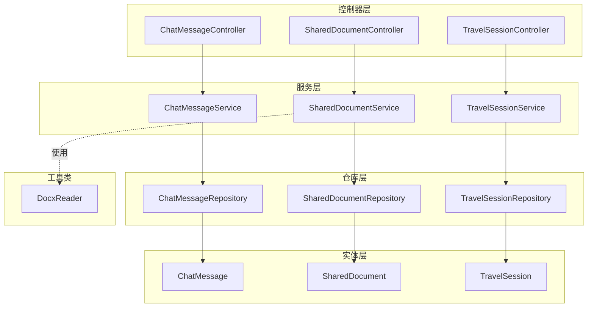
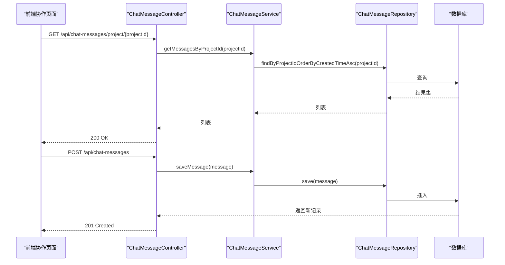
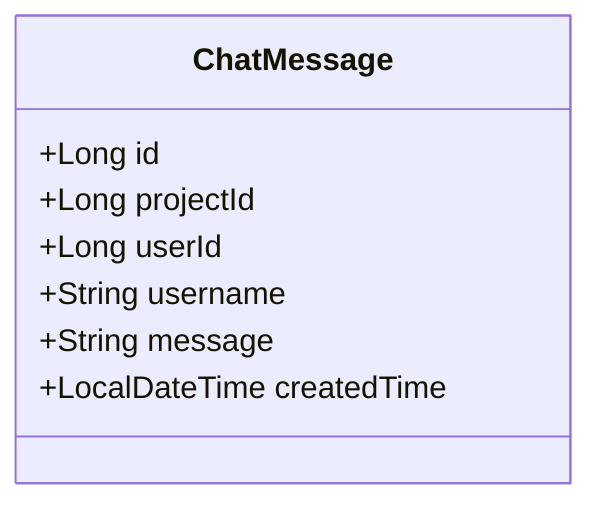
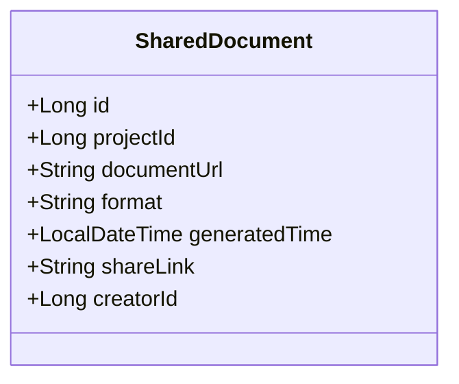
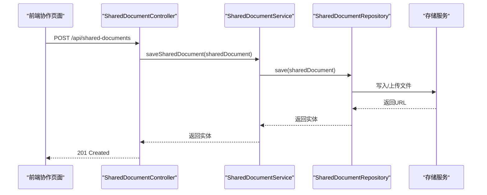
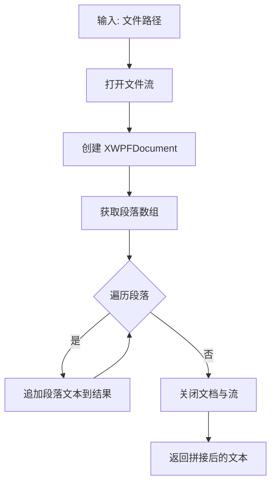
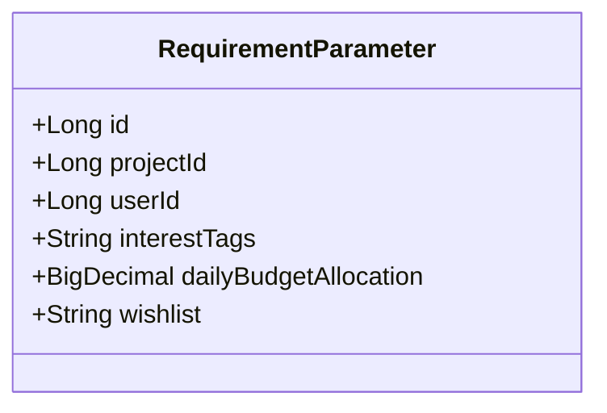
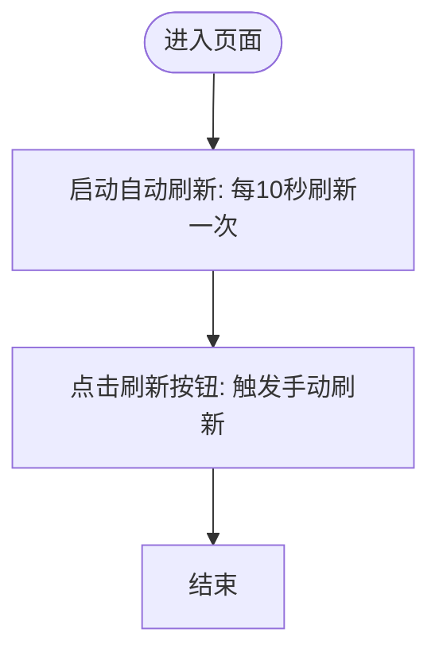
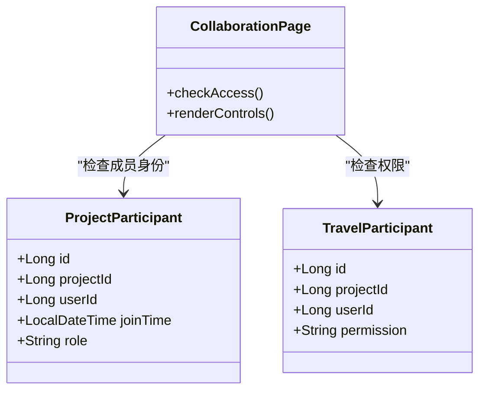
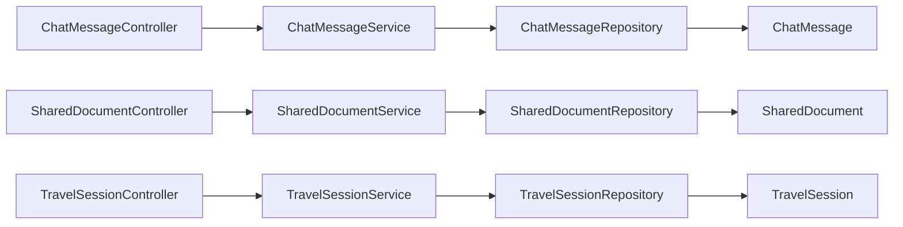

# 协作功能

<cite>
**本文引用的文件**
- [ChatMessageController.java](file://tudianersha/src/main/java/com/tudianersha/controller/ChatMessageController.java)
- [ChatMessageService.java](file://tudianersha/src/main/java/com/tudianersha/service/ChatMessageService.java)
- [ChatMessageRepository.java](file://tudianersha/src/main/java/com/tudianersha/repository/ChatMessageRepository.java)
- [ChatMessage.java](file://tudianersha/src/main/java/com/tudianersha/entity/ChatMessage.java)
- [SharedDocumentController.java](file://tudianersha/src/main/java/com/tudianersha/controller/SharedDocumentController.java)
- [SharedDocumentService.java](file://tudianersha/src/main/java/com/tudianersha/service/SharedDocumentService.java)
- [SharedDocumentRepository.java](file://tudianersha/src/main/java/com/tudianersha/repository/SharedDocumentRepository.java)
- [SharedDocument.java](file://tudianersha/src/main/java/com/tudianersha/entity/SharedDocument.java)
- [DocxReader.java](file://tudianersha/src/main/java/com/tudianersha/util/DocxReader.java)
- [ProjectParticipant.java](file://tudianersha/src/main/java/com/tudianersha/entity/ProjectParticipant.java)
- [ProjectParticipantRepository.java](file://tudianersha/src/main/java/com/tudianersha/repository/ProjectParticipantRepository.java)
- [ProjectParticipantService.java](file://tudianersha/src/main/java/com/tudianersha/service/ProjectParticipantService.java)
- [TravelParticipant.java](file://tudianersha/src/main/java/com/tudianersha/entity/TravelParticipant.java)
- [TravelParticipantRepository.java](file://tudianersha/src/main/java/com/tudianersha/repository/TravelParticipantRepository.java)
- [TravelParticipantService.java](file://tudianersha/src/main/java/com/tudianersha/service/TravelParticipantService.java)
- [TravelSession.java](file://tudianersha/src/main/java/com/tudianersha/entity/TravelSession.java)
- [TravelSessionRepository.java](file://tudianersha/src/main/java/com/tudianersha/repository/TravelSessionRepository.java)
- [TravelSessionService.java](file://tudianersha/src/main/java/com/tudianersha/service/TravelSessionService.java)
- [TravelSessionController.java](file://tudianersha/src/main/java/com/tudianersha/controller/TravelSessionController.java)
- [collaboration.html](file://tudianersha/src/main/resources/static/collaboration.html)
- [application.yml](file://tudianersha/src/main/resources/application.yml)
- [RequirementParameterController.java](file://tudianersha/src/main/java/com/tudianersha/controller/RequirementParameterController.java)
- [RequirementParameter.java](file://tudianersha/src/main/java/com/tudianersha/entity/RequirementParameter.java)
- [common.js](file://tudianersha/src/main/resources/static/js/common.js)
</cite>

## 更新摘要
**变更内容**
- 新增用户访问标记功能，通过加载所有用户需求参数并进行模糊匹配，实现“xxx想去”标记
- 新增手动刷新按钮和每10秒自动刷新机制，确保数据实时同步
- 更新权限控制机制，确保仅项目成员可访问
- 更新前端协作页面，增加刷新按钮和用户标记显示

## 目录
1. [引言](#引言)
2. [项目结构](#项目结构)
3. [核心组件](#核心组件)
4. [架构总览](#架构总览)
5. [详细组件分析](#详细组件分析)
6. [依赖关系分析](#依赖关系分析)
7. [性能考虑](#性能考虑)
8. [故障排查指南](#故障排查指南)
9. [结论](#结论)
10. [附录](#附录)

## 引言
本文件系统性阐述协作功能模块的设计与实现，覆盖实时聊天与文档共享两大核心能力。重点包括：
- ChatMessageController 如何处理消息发送与拉取请求
- ChatMessageService 的消息查询与持久化策略
- ChatMessage 实体的时间戳、归属等字段设计考量
- SharedDocumentController 对文件上传、下载、分享链接生成的处理逻辑
- SharedDocumentService 与数据仓库的交互方式
- DocxReader 工具类对 DOCX 文档内容解析与关键信息提取
- 权限控制机制（基于项目成员角色）以确保仅项目成员可访问
- 高并发场景下的性能优化建议
- 新增用户访问标记功能，通过加载所有用户需求参数并进行模糊匹配，实现“xxx想去”标记
- 新增手动刷新按钮和每10秒自动刷新机制，确保数据实时同步

## 项目结构
协作功能相关代码采用分层架构组织，按职责划分为控制器、服务、仓库与实体，并辅以工具类与前端静态页面：
- 控制器层：负责 HTTP 接口定义与参数绑定
- 服务层：封装业务逻辑与数据访问
- 仓库层：基于 Spring Data JPA 提供数据访问接口
- 实体层：映射数据库表结构
- 工具类：如 DOCX 解析
- 前端页面：协作页面提供聊天与文档操作入口



图表来源
- [ChatMessageController.java](file://tudianersha/src/main/java/com/tudianersha/controller/ChatMessageController.java#L1-L45)
- [ChatMessageService.java](file://tudianersha/src/main/java/com/tudianersha/service/ChatMessageService.java#L1-L32)
- [ChatMessageRepository.java](file://tudianersha/src/main/java/com/tudianersha/repository/ChatMessageRepository.java#L1-L16)
- [ChatMessage.java](file://tudianersha/src/main/java/com/tudianersha/entity/ChatMessage.java#L1-L90)
- [SharedDocumentController.java](file://tudianersha/src/main/java/com/tudianersha/controller/SharedDocumentController.java#L1-L83)
- [SharedDocumentService.java](file://tudianersha/src/main/java/com/tudianersha/service/SharedDocumentService.java#L1-L40)
- [SharedDocumentRepository.java](file://tudianersha/src/main/java/com/tudianersha/repository/SharedDocumentRepository.java#L1-L13)
- [SharedDocument.java](file://tudianersha/src/main/java/com/tudianersha/entity/SharedDocument.java#L1-L114)
- [DocxReader.java](file://tudianersha/src/main/java/com/tudianersha/util/DocxReader.java#L1-L44)
- [TravelSessionController.java](file://tudianersha/src/main/java/com/tudianersha/controller/TravelSessionController.java#L1-L82)
- [TravelSessionService.java](file://tudianersha/src/main/java/com/tudianersha/service/TravelSessionService.java#L1-L40)
- [TravelSessionRepository.java](file://tudianersha/src/main/java/com/tudianersha/repository/TravelSessionRepository.java#L1-L13)
- [TravelSession.java](file://tudianersha/src/main/java/com/tudianersha/entity/TravelSession.java#L1-L100)

章节来源
- [application.yml](file://tudianersha/src/main/resources/application.yml#L1-L57)

## 核心组件
- 实时聊天模块
  - 控制器：提供按项目拉取消息、增量拉取、发送与删除消息的接口
  - 服务：封装查询与保存逻辑，委托仓库执行
  - 仓库：提供按项目与增量条件的查询方法
  - 实体：包含项目标识、用户标识、用户名、消息正文与创建时间等字段
- 文档共享模块
  - 控制器：提供文档列表、详情、创建、更新、删除、按项目/创建者筛选等接口
  - 服务：封装 CRUD 与按项目/创建者查询
  - 仓库：提供按项目与创建者查询
  - 实体：包含项目标识、文档 URL、格式、生成时间、分享链接、创建者等字段
- DOCX 解析工具
  - 通过 Apache POI 读取段落文本，输出纯文本内容
- 用户访问标记模块
  - 控制器：提供按项目加载所有用户需求参数的接口
  - 服务：封装查询与模糊匹配逻辑
  - 实体：包含用户愿望清单等字段
- 实时同步模块
  - 前端：提供手动刷新按钮和自动刷新机制
  - 后端：提供数据更新接口

章节来源
- [ChatMessageController.java](file://tudianersha/src/main/java/com/tudianersha/controller/ChatMessageController.java#L1-L45)
- [ChatMessageService.java](file://tudianersha/src/main/java/com/tudianersha/service/ChatMessageService.java#L1-L32)
- [ChatMessageRepository.java](file://tudianersha/src/main/java/com/tudianersha/repository/ChatMessageRepository.java#L1-L16)
- [ChatMessage.java](file://tudianersha/src/main/java/com/tudianersha/entity/ChatMessage.java#L1-L90)
- [SharedDocumentController.java](file://tudianersha/src/main/java/com/tudianersha/controller/SharedDocumentController.java#L1-L83)
- [SharedDocumentService.java](file://tudianersha/src/main/java/com/tudianersha/service/SharedDocumentService.java#L1-L40)
- [SharedDocumentRepository.java](file://tudianersha/src/main/java/com/tudianersha/repository/SharedDocumentRepository.java#L1-L13)
- [SharedDocument.java](file://tudianersha/src/main/java/com/tudianersha/entity/SharedDocument.java#L1-L114)
- [DocxReader.java](file://tudianersha/src/main/java/com/tudianersha/util/DocxReader.java#L1-L44)
- [RequirementParameterController.java](file://tudianersha/src/main/java/com/tudianersha/controller/RequirementParameterController.java#L1-L85)
- [RequirementParameter.java](file://tudianersha/src/main/java/com/tudianersha/entity/RequirementParameter.java#L1-L114)
- [common.js](file://tudianersha/src/main/resources/static/js/common.js#L1-L272)

## 架构总览
协作功能遵循典型的 MVC 分层与仓库模式，控制器负责请求接入与响应封装，服务层编排业务流程，仓库层抽象数据访问，实体层承载数据模型。前端协作页面通过 AJAX 调用后端接口，实现聊天与文档的实时交互。



图表来源
- [ChatMessageController.java](file://tudianersha/src/main/java/com/tudianersha/controller/ChatMessageController.java#L1-L45)
- [ChatMessageService.java](file://tudianersha/src/main/java/com/tudianersha/service/ChatMessageService.java#L1-L32)
- [ChatMessageRepository.java](file://tudianersha/src/main/java/com/tudianersha/repository/ChatMessageRepository.java#L1-L16)

## 详细组件分析

### 实时聊天组件分析

#### 控制器层：ChatMessageController
- 提供按项目拉取历史消息、按 lastMessageId 拉取增量消息、发送消息、删除消息的接口
- 使用 ResponseEntity 封装响应，返回标准 HTTP 状态码

章节来源
- [ChatMessageController.java](file://tudianersha/src/main/java/com/tudianersha/controller/ChatMessageController.java#L1-L45)

#### 服务层：ChatMessageService
- 通过仓库方法实现：
  - 按项目升序查询所有消息
  - 按项目与大于某 id 的条件升序查询增量消息
  - 保存消息与删除消息

章节来源
- [ChatMessageService.java](file://tudianersha/src/main/java/com/tudianersha/service/ChatMessageService.java#L1-L32)
- [ChatMessageRepository.java](file://tudianersha/src/main/java/com/tudianersha/repository/ChatMessageRepository.java#L1-L16)

#### 实体层：ChatMessage
- 字段设计要点：
  - 项目标识与用户标识用于权限与分组
  - 用户名便于展示，避免跨表查询
  - 消息正文为 TEXT 类型，支持长文本
  - 创建时间用于排序与增量拉取
- 设计考量：
  - 时间戳字段便于前端按时间线渲染
  - 增量拉取依赖 created_time 或 id 辅助排序，当前实现使用 id 大于条件



图表来源
- [ChatMessage.java](file://tudianersha/src/main/java/com/tudianersha/entity/ChatMessage.java#L1-L90)

#### 数据流与处理逻辑
- 历史消息拉取：按项目 id 升序返回全部消息
- 增量消息拉取：基于 lastMessageId 的 id 大于条件，升序返回新增消息
- 发送消息：保存消息实体，返回新建记录
- 删除消息：根据 id 删除

```mermaid
flowchart TD
Start(["进入控制器"]) --> Route{"请求类型？"}
Route --> |GET /project/{projectId}| Hist["调用服务: 按项目升序查询"]
Route --> |GET /project/{projectId}/new?lastMessageId| Incr["调用服务: 按项目+lastMessageId升序查询"]
Route --> |POST| Save["调用服务: 保存消息"]
Route --> |DELETE| Del["调用服务: 删除消息"]
Hist --> Resp["返回消息列表"]
Incr --> Resp
Save --> Resp
Del --> Resp
Resp --> End(["结束"])
```

图表来源
- [ChatMessageController.java](file://tudianersha/src/main/java/com/tudianersha/controller/ChatMessageController.java#L1-L45)
- [ChatMessageService.java](file://tudianersha/src/main/java/com/tudianersha/service/ChatMessageService.java#L1-L32)

章节来源
- [ChatMessageController.java](file://tudianersha/src/main/java/com/tudianersha/controller/ChatMessageController.java#L1-L45)
- [ChatMessageService.java](file://tudianersha/src/main/java/com/tudianersha/service/ChatMessageService.java#L1-L32)
- [ChatMessageRepository.java](file://tudianersha/src/main/java/com/tudianersha/repository/ChatMessageRepository.java#L1-L16)
- [ChatMessage.java](file://tudianersha/src/main/java/com/tudianersha/entity/ChatMessage.java#L1-L90)

### 文档共享组件分析

#### 控制器层：SharedDocumentController
- 提供文档列表、按 id 获取、创建、更新、删除、按项目与创建者筛选等接口
- 统一使用 ResponseEntity 返回状态码与数据

章节来源
- [SharedDocumentController.java](file://tudianersha/src/main/java/com/tudianersha/controller/SharedDocumentController.java#L1-L83)

#### 服务层：SharedDocumentService
- 提供 CRUD 与按项目/创建者查询
- 与仓库解耦，便于扩展存储介质（本地文件系统或对象存储）

章节来源
- [SharedDocumentService.java](file://tudianersha/src/main/java/com/tudianersha/service/SharedDocumentService.java#L1-L40)
- [SharedDocumentRepository.java](file://tudianersha/src/main/java/com/tudianersha/repository/SharedDocumentRepository.java#L1-L13)

#### 实体层：SharedDocument
- 字段设计要点：
  - 项目标识与创建者标识用于权限控制
  - 文档 URL 与格式用于前端展示与下载
  - 生成时间用于排序与审计
  - 分享链接用于外部分享



图表来源
- [SharedDocument.java](file://tudianersha/src/main/java/com/tudianersha/entity/SharedDocument.java#L1-L114)

#### 数据流与处理逻辑
- 列表与筛选：按项目/创建者查询
- 创建：保存实体并返回
- 更新：按 id 查找并部分更新字段
- 删除：按 id 删除



图表来源
- [SharedDocumentController.java](file://tudianersha/src/main/java/com/tudianersha/controller/SharedDocumentController.java#L1-L83)
- [SharedDocumentService.java](file://tudianersha/src/main/java/com/tudianersha/service/SharedDocumentService.java#L1-L40)
- [SharedDocumentRepository.java](file://tudianersha/src/main/java/com/tudianersha/repository/SharedDocumentRepository.java#L1-L13)

章节来源
- [SharedDocumentController.java](file://tudianersha/src/main/java/com/tudianersha/controller/SharedDocumentController.java#L1-L83)
- [SharedDocumentService.java](file://tudianersha/src/main/java/com/tudianersha/service/SharedDocumentService.java#L1-L40)
- [SharedDocumentRepository.java](file://tudianersha/src/main/java/com/tudianersha/repository/SharedDocumentRepository.java#L1-L13)
- [SharedDocument.java](file://tudianersha/src/main/java/com/tudianersha/entity/SharedDocument.java#L1-L114)

### DOCX 解析工具类：DocxReader
- 通过 Apache POI 读取 DOCX 文件，遍历段落并拼接文本
- 提供读取与打印方法，异常时返回错误信息字符串



图表来源
- [DocxReader.java](file://tudianersha/src/main/java/com/tudianersha/util/DocxReader.java#L1-L44)

章节来源
- [DocxReader.java](file://tudianersha/src/main/java/com/tudianersha/util/DocxReader.java#L1-L44)

### 用户访问标记组件分析

#### 控制器层：RequirementParameterController
- 提供按项目加载所有用户需求参数的接口
- 使用 ResponseEntity 封装响应，返回标准 HTTP 状态码

章节来源
- [RequirementParameterController.java](file://tudianersha/src/main/java/com/tudianersha/controller/RequirementParameterController.java#L1-L85)

#### 服务层：RequirementParameterService
- 通过仓库方法实现：
  - 按项目查询所有用户需求参数
  - 模糊匹配用户愿望清单

章节来源
- [RequirementParameterService.java](file://tudianersha/src/main/java/com/tudianersha/service/RequirementParameterService.java#L1-L40)
- [RequirementParameterRepository.java](file://tudianersha/src/main/java/com/tudianersha/repository/RequirementParameterRepository.java#L1-L13)

#### 实体层：RequirementParameter
- 字段设计要点：
  - 项目标识用于权限与分组
  - 用户愿望清单用于模糊匹配
- 设计考量：
  - 模糊匹配字段便于前端显示“xxx想去”标记



图表来源
- [RequirementParameter.java](file://tudianersha/src/main/java/com/tudianersha/entity/RequirementParameter.java#L1-L114)

#### 数据流与处理逻辑
- 加载所有用户需求参数：按项目查询所有用户需求参数
- 模糊匹配：遍历用户愿望清单，进行模糊匹配
- 显示标记：前端显示“xxx想去”标记

```mermaid
flowchart TD
Start(["进入控制器"]) --> Route{"请求类型？"}
Route --> |GET /project/{projectId}/all| Load["调用服务: 按项目查询所有用户需求参数"]
Load --> Match["调用服务: 模糊匹配用户愿望清单"]
Match --> Display["前端显示“xxx想去”标记"]
Display --> End(["结束"])
```

图表来源
- [RequirementParameterController.java](file://tudianersha/src/main/java/com/tudianersha/controller/RequirementParameterController.java#L1-L85)
- [RequirementParameterService.java](file://tudianersha/src/main/java/com/tudianersha/service/RequirementParameterService.java#L1-L40)

章节来源
- [RequirementParameterController.java](file://tudianersha/src/main/java/com/tudianersha/controller/RequirementParameterController.java#L1-L85)
- [RequirementParameterService.java](file://tudianersha/src/main/java/com/tudianersha/service/RequirementParameterService.java#L1-L40)
- [RequirementParameterRepository.java](file://tudianersha/src/main/java/com/tudianersha/repository/RequirementParameterRepository.java#L1-L13)
- [RequirementParameter.java](file://tudianersha/src/main/java/com/tudianersha/entity/RequirementParameter.java#L1-L114)

### 实时同步组件分析

#### 前端：common.js
- 提供手动刷新按钮和自动刷新机制
- 使用 setInterval 实现每10秒自动刷新

章节来源
- [common.js](file://tudianersha/src/main/resources/static/js/common.js#L1-L272)

#### 数据流与处理逻辑
- 手动刷新：点击刷新按钮，触发手动刷新
- 自动刷新：每10秒自动刷新一次



图表来源
- [common.js](file://tudianersha/src/main/resources/static/js/common.js#L1-L272)

章节来源
- [common.js](file://tudianersha/src/main/resources/static/js/common.js#L1-L272)

### 权限控制机制
- 项目成员角色模型
  - 项目参与者：ProjectParticipant（角色：创建者/编辑者/查看者）
  - 行程参与者：TravelParticipant（权限：创建者/编辑者/查看者）
- 前端协作页面在加载项目时会检查当前用户是否为项目成员，并据此显示协作入口与权限管理按钮
- 后端可通过项目成员仓库与服务进行存在性校验与角色判断，从而限制对聊天与文档的访问



图表来源
- [ProjectParticipant.java](file://tudianersha/src/main/java/com/tudianersha/entity/ProjectParticipant.java#L1-L87)
- [TravelParticipant.java](file://tudianersha/src/main/java/com/tudianersha/entity/TravelParticipant.java#L1-L73)
- [collaboration.html](file://tudianersha/src/main/resources/static/collaboration.html#L1-L200)

章节来源
- [ProjectParticipant.java](file://tudianersha/src/main/java/com/tudianersha/entity/ProjectParticipant.java#L1-L87)
- [ProjectParticipantRepository.java](file://tudianersha/src/main/java/com/tudianersha/repository/ProjectParticipantRepository.java#L1-L16)
- [ProjectParticipantService.java](file://tudianersha/src/main/java/com/tudianersha/service/ProjectParticipantService.java#L1-L48)
- [TravelParticipant.java](file://tudianersha/src/main/java/com/tudianersha/entity/TravelParticipant.java#L1-L73)
- [TravelParticipantRepository.java](file://tudianersha/src/main/java/com/tudianersha/repository/TravelParticipantRepository.java#L1-L17)
- [TravelParticipantService.java](file://tudianersha/src/main/java/com/tudianersha/service/TravelParticipantService.java#L1-L52)
- [collaboration.html](file://tudianersha/src/main/resources/static/collaboration.html#L1-L200)

## 依赖关系分析
- 控制器依赖服务，服务依赖仓库，仓库依赖实体
- 实体之间无直接循环依赖，耦合度低
- 服务层承担业务编排，仓库层承担数据存取，职责清晰



图表来源
- [ChatMessageController.java](file://tudianersha/src/main/java/com/tudianersha/controller/ChatMessageController.java#L1-L45)
- [ChatMessageService.java](file://tudianersha/src/main/java/com/tudianersha/service/ChatMessageService.java#L1-L32)
- [ChatMessageRepository.java](file://tudianersha/src/main/java/com/tudianersha/repository/ChatMessageRepository.java#L1-L16)
- [ChatMessage.java](file://tudianersha/src/main/java/com/tudianersha/entity/ChatMessage.java#L1-L90)
- [SharedDocumentController.java](file://tudianersha/src/main/java/com/tudianersha/controller/SharedDocumentController.java#L1-L83)
- [SharedDocumentService.java](file://tudianersha/src/main/java/com/tudianersha/service/SharedDocumentService.java#L1-L40)
- [SharedDocumentRepository.java](file://tudianersha/src/main/java/com/tudianersha/repository/SharedDocumentRepository.java#L1-L13)
- [SharedDocument.java](file://tudianersha/src/main/java/com/tudianersha/entity/SharedDocument.java#L1-L114)
- [TravelSessionController.java](file://tudianersha/src/main/java/com/tudianersha/controller/TravelSessionController.java#L1-L82)
- [TravelSessionService.java](file://tudianersha/src/main/java/com/tudianersha/service/TravelSessionService.java#L1-L40)
- [TravelSessionRepository.java](file://tudianersha/src/main/java/com/tudianersha/repository/TravelSessionRepository.java#L1-L13)
- [TravelSession.java](file://tudianersha/src/main/java/com/tudianersha/entity/TravelSession.java#L1-L100)

章节来源
- [ChatMessageController.java](file://tudianersha/src/main/java/com/tudianersha/controller/ChatMessageController.java#L1-L45)
- [ChatMessageService.java](file://tudianersha/src/main/java/com/tudianersha/service/ChatMessageService.java#L1-L32)
- [ChatMessageRepository.java](file://tudianersha/src/main/java/com/tudianersha/repository/ChatMessageRepository.java#L1-L16)
- [ChatMessage.java](file://tudianersha/src/main/java/com/tudianersha/entity/ChatMessage.java#L1-L90)
- [SharedDocumentController.java](file://tudianersha/src/main/java/com/tudianersha/controller/SharedDocumentController.java#L1-L83)
- [SharedDocumentService.java](file://tudianersha/src/main/java/com/tudianersha/service/SharedDocumentService.java#L1-L40)
- [SharedDocumentRepository.java](file://tudianersha/src/main/java/com/tudianersha/repository/SharedDocumentRepository.java#L1-L13)
- [SharedDocument.java](file://tudianersha/src/main/java/com/tudianersha/entity/SharedDocument.java#L1-L114)
- [TravelSessionController.java](file://tudianersha/src/main/java/com/tudianersha/controller/TravelSessionController.java#L1-L82)
- [TravelSessionService.java](file://tudianersha/src/main/java/com/tudianersha/service/TravelSessionService.java#L1-L40)
- [TravelSessionRepository.java](file://tudianersha/src/main/java/com/tudianersha/repository/TravelSessionRepository.java#L1-L13)
- [TravelSession.java](file://tudianersha/src/main/java/com/tudianersha/entity/TravelSession.java#L1-L100)

## 性能考虑
- 数据库索引
  - 在 ChatMessage 的 project_id 与 created_time 上建立复合索引，加速按项目与时间的查询
  - 在 SharedDocument 的 project_id 与 creator_id 建立索引，提升筛选效率
- 分页与批量
  - 历史消息与文档列表建议增加分页参数，避免一次性返回大量数据
- 增量拉取
  - 增量消息接口使用 lastMessageId 的 id 大于条件，减少网络传输与前端渲染压力
- 缓存
  - 对热点项目的消息列表与文档列表可引入缓存（如 Redis），降低数据库压力
- 并发写入
  - 消息发送与文档上传应使用幂等键与唯一约束，避免重复数据
- 存储优化
  - 文档上传建议采用对象存储（如 OSS/MinIO），并开启 CDN 加速
- 前端优化
  - 聊天消息滚动至底部、懒加载图片与附件、节流/防抖输入事件
- 实时同步优化
  - 手动刷新按钮添加旋转动画，提升用户体验
  - 自动刷新间隔设置为10秒，平衡实时性与性能

## 故障排查指南
- 消息无法拉取
  - 检查项目 id 是否正确，确认数据库中是否存在对应记录
  - 确认 created_time 或 id 排序是否符合预期
- 增量消息缺失
  - 确认 lastMessageId 参数是否传递且有效
  - 检查数据库中是否存在 id 大于 lastMessageId 的记录
- 文档上传失败
  - 检查存储服务可用性与权限
  - 确认文件格式与大小限制
- 权限问题
  - 确认当前用户是否为项目成员
  - 检查角色/权限字段是否正确设置
- 用户访问标记不显示
  - 检查用户愿望清单是否为空
  - 确认模糊匹配逻辑是否正确
- 实时同步失败
  - 检查自动刷新间隔是否正确
  - 确认手动刷新按钮是否正常工作

章节来源
- [ChatMessageController.java](file://tudianersha/src/main/java/com/tudianersha/controller/ChatMessageController.java#L1-L45)
- [ChatMessageService.java](file://tudianersha/src/main/java/com/tudianersha/service/ChatMessageService.java#L1-L32)
- [SharedDocumentController.java](file://tudianersha/src/main/java/com/tudianersha/controller/SharedDocumentController.java#L1-L83)
- [SharedDocumentService.java](file://tudianersha/src/main/java/com/tudianersha/service/SharedDocumentService.java#L1-L40)
- [ProjectParticipant.java](file://tudianersha/src/main/java/com/tudianersha/entity/ProjectParticipant.java#L1-L87)
- [TravelParticipant.java](file://tudianersha/src/main/java/com/tudianersha/entity/TravelParticipant.java#L1-L73)

## 结论
协作功能模块通过清晰的分层设计实现了实时聊天与文档共享的核心能力。控制器简洁地暴露接口，服务层承担业务编排，仓库层抽象数据访问，实体层承载数据模型。结合项目成员角色与前端协作页面，形成完整的权限控制闭环。新增用户访问标记功能，通过加载所有用户需求参数并进行模糊匹配，实现“xxx想去”标记。新增手动刷新按钮和每10秒自动刷新机制，确保数据实时同步。未来可在索引优化、分页、缓存与对象存储等方面进一步提升性能与可扩展性。

## 附录
- 前端协作页面入口与权限管理
  - 页面包含权限管理弹窗与参与者列表渲染逻辑，支持角色变更与权限保存
- 数据库配置
  - application.yml 中配置了数据源与 JPA 方言，确保实体与表结构一致

章节来源
- [collaboration.html](file://tudianersha/src/main/resources/static/collaboration.html#L1075-L1176)
- [application.yml](file://tudianersha/src/main/resources/application.yml#L1-L57)