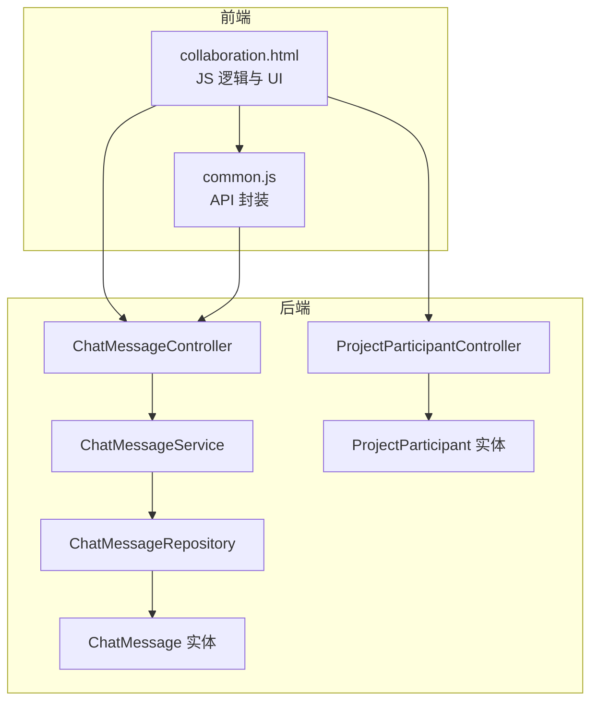
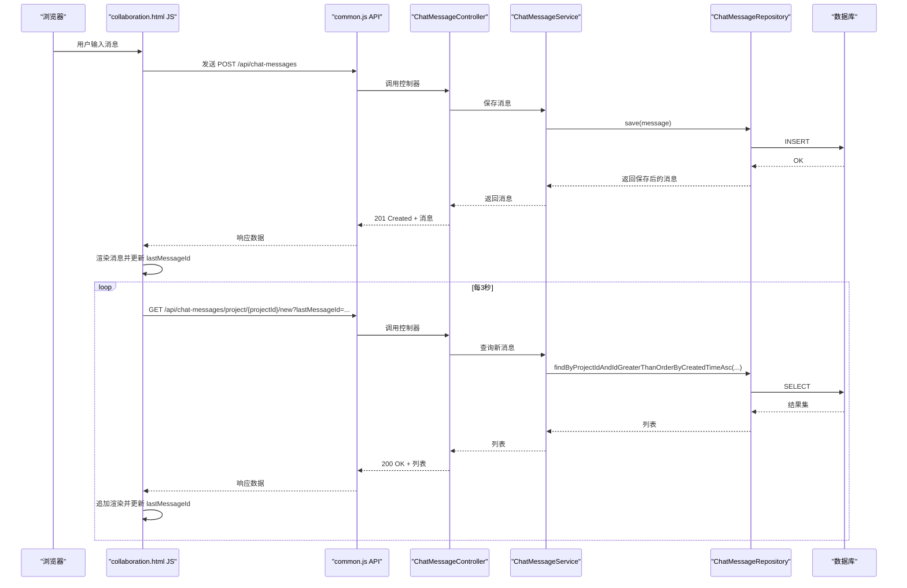
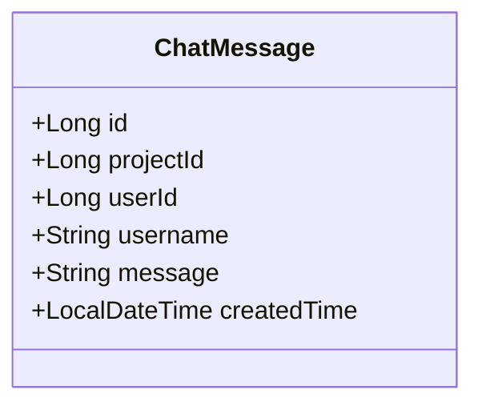
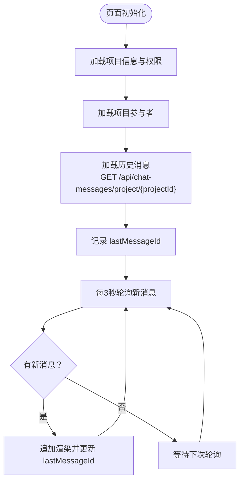
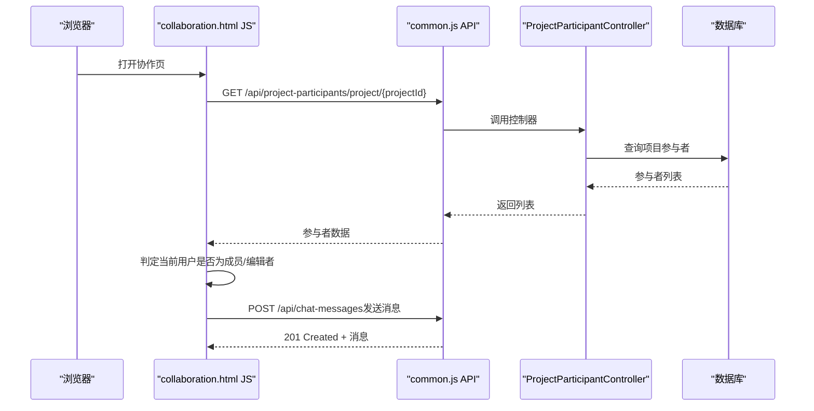
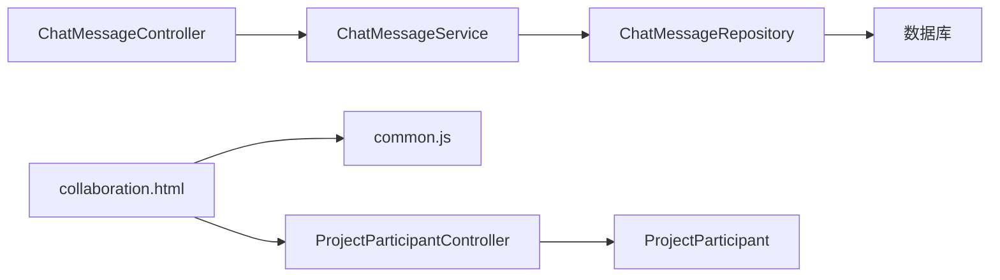
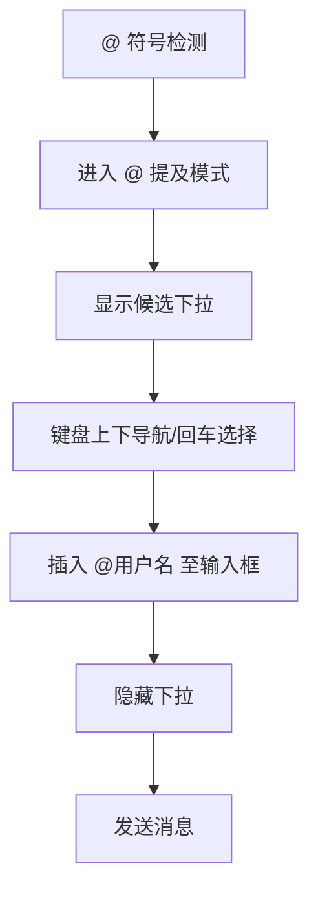

# 实时聊天

<cite>
**本文引用的文件**
- [ChatMessageController.java](file://tudianersha/src/main/java/com/tudianersha/controller/ChatMessageController.java)
- [ChatMessageService.java](file://tudianersha/src/main/java/com/tudianersha/service/ChatMessageService.java)
- [ChatMessageRepository.java](file://tudianersha/src/main/java/com/tudianersha/repository/ChatMessageRepository.java)
- [ChatMessage.java](file://tudianersha/src/main/java/com/tudianersha/entity/ChatMessage.java)
- [collaboration.html](file://tudianersha/src/main/resources/static/collaboration.html)
- [common.js](file://tudianersha/src/main/resources/static/js/common.js)
- [ProjectParticipantController.java](file://tudianersha/src/main/java/com/tudianersha/controller/ProjectParticipantController.java)
- [ProjectParticipant.java](file://tudianersha/src/main/java/com/tudianersha/entity/ProjectParticipant.java)
- [application.yml](file://tudianersha/src/main/resources/application.yml)
</cite>

## 目录
1. [简介](#简介)
2. [项目结构](#项目结构)
3. [核心组件](#核心组件)
4. [架构总览](#架构总览)
5. [详细组件分析](#详细组件分析)
6. [依赖关系分析](#依赖关系分析)
7. [性能考量](#性能考量)
8. [故障排查指南](#故障排查指南)
9. [结论](#结论)
10. [附录](#附录)

## 简介
本文件系统性阐述实时聊天功能的实现机制，覆盖以下关键点：
- 前端通过轮询方式调用后端接口拉取消息，以及@提及功能的交互实现
- ChatMessageController 的三个核心API端点：按项目加载历史消息、获取新消息、发送消息
- ChatMessageService 如何通过 JPA 保存和查询消息记录
- ChatMessage 实体类字段设计的意义
- 消息权限控制机制：确保仅项目成员可发送和查看消息
- 前端 JavaScript 解析响应并动态渲染聊天列表的流程
- 高并发场景下使用 WebSocket 替代轮询的优化方向

## 项目结构
该功能涉及前后端分层清晰的模块划分：
- 控制层：ChatMessageController 提供 REST 接口
- 服务层：ChatMessageService 封装业务逻辑
- 数据访问层：ChatMessageRepository 基于 Spring Data JPA
- 实体层：ChatMessage 定义消息持久化模型
- 前端：collaboration.html 负责 UI、@提及交互与轮询刷新
- 通用工具：common.js 提供统一的 API 请求封装

图表来源
- [ChatMessageController.java](file://tudianersha/src/main/java/com/tudianersha/controller/ChatMessageController.java#L1-L44)
- [ChatMessageService.java](file://tudianersha/src/main/java/com/tudianersha/service/ChatMessageService.java#L1-L31)
- [ChatMessageRepository.java](file://tudianersha/src/main/java/com/tudianersha/repository/ChatMessageRepository.java#L1-L16)
- [ChatMessage.java](file://tudianersha/src/main/java/com/tudianersha/entity/ChatMessage.java#L1-L90)
- [ProjectParticipantController.java](file://tudianersha/src/main/java/com/tudianersha/controller/ProjectParticipantController.java#L1-L91)
- [ProjectParticipant.java](file://tudianersha/src/main/java/com/tudianersha/entity/ProjectParticipant.java#L1-L87)
- [collaboration.html](file://tudianersha/src/main/resources/static/collaboration.html#L1208-L1858)
- [common.js](file://tudianersha/src/main/resources/static/js/common.js#L1-L272)

章节来源
- [ChatMessageController.java](file://tudianersha/src/main/java/com/tudianersha/controller/ChatMessageController.java#L1-L44)
- [ChatMessageService.java](file://tudianersha/src/main/java/com/tudianersha/service/ChatMessageService.java#L1-L31)
- [ChatMessageRepository.java](file://tudianersha/src/main/java/com/tudianersha/repository/ChatMessageRepository.java#L1-L16)
- [ChatMessage.java](file://tudianersha/src/main/java/com/tudianersha/entity/ChatMessage.java#L1-L90)
- [collaboration.html](file://tudianersha/src/main/resources/static/collaboration.html#L1208-L1858)
- [common.js](file://tudianersha/src/main/resources/static/js/common.js#L1-L272)
- [ProjectParticipantController.java](file://tudianersha/src/main/java/com/tudianersha/controller/ProjectParticipantController.java#L1-L91)
- [ProjectParticipant.java](file://tudianersha/src/main/java/com/tudianersha/entity/ProjectParticipant.java#L1-L87)

## 核心组件
- ChatMessageController：暴露三个核心端点
  - GET /api/chat-messages/project/{projectId}：按项目加载历史消息
  - GET /api/chat-messages/project/{projectId}/new?lastMessageId=...：获取新消息
  - POST /api/chat-messages：发送消息
- ChatMessageService：封装消息查询与保存
- ChatMessageRepository：基于 JPA 的数据访问接口
- ChatMessage 实体：定义消息字段与持久化映射
- 前端 collaboration.html：负责@提及交互、轮询刷新、消息渲染
- common.js：统一 API 请求封装，简化前端调用

章节来源
- [ChatMessageController.java](file://tudianersha/src/main/java/com/tudianersha/controller/ChatMessageController.java#L1-L44)
- [ChatMessageService.java](file://tudianersha/src/main/java/com/tudianersha/service/ChatMessageService.java#L1-L31)
- [ChatMessageRepository.java](file://tudianersha/src/main/java/com/tudianersha/repository/ChatMessageRepository.java#L1-L16)
- [ChatMessage.java](file://tudianersha/src/main/java/com/tudianersha/entity/ChatMessage.java#L1-L90)
- [collaboration.html](file://tudianersha/src/main/resources/static/collaboration.html#L1208-L1858)
- [common.js](file://tudianersha/src/main/resources/static/js/common.js#L1-L272)

## 架构总览
后端采用典型的三层架构：控制器接收请求，服务层执行业务逻辑，仓库层进行数据持久化。前端通过 AJAX 调用后端接口，使用轮询策略定时拉取新消息，并在 UI 层动态渲染。

图表来源
- [ChatMessageController.java](file://tudianersha/src/main/java/com/tudianersha/controller/ChatMessageController.java#L1-L44)
- [ChatMessageService.java](file://tudianersha/src/main/java/com/tudianersha/service/ChatMessageService.java#L1-L31)
- [ChatMessageRepository.java](file://tudianersha/src/main/java/com/tudianersha/repository/ChatMessageRepository.java#L1-L16)
- [collaboration.html](file://tudianersha/src/main/resources/static/collaboration.html#L1208-L1858)
- [common.js](file://tudianersha/src/main/resources/static/js/common.js#L1-L272)

## 详细组件分析

### 后端控制器：ChatMessageController
- GET /api/chat-messages/project/{projectId}
  - 作用：按项目加载历史消息，按创建时间升序排列
  - 实现：委托服务层查询，返回 200 OK
- GET /api/chat-messages/project/{projectId}/new?lastMessageId=...
  - 作用：获取自 lastMessageId 之后的新消息
  - 实现：根据 lastMessageId 上界筛选，按创建时间升序返回
- POST /api/chat-messages
  - 作用：发送消息
  - 实现：保存消息并返回 201 Created
- DELETE /api/chat-messages/{id}
  - 作用：删除消息
  - 实现：删除对应记录并返回 204 No Content

章节来源
- [ChatMessageController.java](file://tudianersha/src/main/java/com/tudianersha/controller/ChatMessageController.java#L1-L44)

### 服务层：ChatMessageService
- getMessagesByProjectId(projectId)
  - 作用：按项目 ID 查询全部消息，升序排列
  - 复杂度：O(n log n)（由数据库排序决定）
- getNewMessages(projectId, lastMessageId)
  - 作用：查询大于 lastMessageId 的新消息
  - 复杂度：O(k log k)，k 为新增消息数量
- saveMessage(message)
  - 作用：持久化消息
  - 复杂度：O(1)
- deleteMessage(id)
  - 作用：删除消息
  - 复杂度：O(1)

章节来源
- [ChatMessageService.java](file://tudianersha/src/main/java/com/tudianersha/service/ChatMessageService.java#L1-L31)

### 数据访问层：ChatMessageRepository
- findByProjectIdOrderByCreatedTimeAsc(projectId)
  - 作用：按项目 ID 查询并按创建时间升序
- findByProjectIdAndIdGreaterThanOrderByCreatedTimeAsc(projectId, lastMessageId)
  - 作用：查询大于某 ID 的消息并按创建时间升序

章节来源
- [ChatMessageRepository.java](file://tudianersha/src/main/java/com/tudianersha/repository/ChatMessageRepository.java#L1-L16)

### 实体模型：ChatMessage
- 字段设计与意义
  - id：主键，自增
  - projectId：项目标识，用于消息隔离
  - userId：发送者用户 ID
  - username：发送者用户名，便于展示
  - message：消息正文（TEXT 类型）
  - createdTime：消息创建时间，用于排序与增量拉取
- 设计要点
  - 通过 projectId 实现“按项目隔离”，天然支持多项目聊天
  - createdTime 作为排序与增量拉取的关键字段
  - message 使用 TEXT 类型，满足较长文本需求

图表来源
- [ChatMessage.java](file://tudianersha/src/main/java/com/tudianersha/entity/ChatMessage.java#L1-L90)

章节来源
- [ChatMessage.java](file://tudianersha/src/main/java/com/tudianersha/entity/ChatMessage.java#L1-L90)

### 前端：collaboration.html 的轮询与渲染
- 初始化与权限
  - 通过 URL 参数获取 projectId
  - 登录校验：未登录重定向至登录页
  - 项目权限：创建者或编辑者可编辑；查看者仅可查看
- 加载历史消息
  - GET /api/chat-messages/project/{projectId}
  - 渲染到聊天区域，记录最大消息 ID（lastMessageId）
- 轮询新消息
  - 每 3 秒调用 GET /api/chat-messages/project/{projectId}/new?lastMessageId=...
  - 若有新增消息，追加渲染并更新 lastMessageId
- @提及功能
  - 输入框检测 @ 符号，弹出候选下拉
  - 支持键盘上下移动、回车选择、ESC 关闭
  - 选择后插入 "@用户名 " 并聚焦输入框
- 发送消息
  - POST /api/chat-messages，携带 projectId、userId、username、message、createdTime
  - 成功后立即渲染并更新 lastMessageId

图表来源
- [collaboration.html](file://tudianersha/src/main/resources/static/collaboration.html#L1208-L1858)

章节来源
- [collaboration.html](file://tudianersha/src/main/resources/static/collaboration.html#L1208-L1858)

### 前端 JavaScript：解析响应与动态渲染
- 解析响应数据
  - GET 历史消息：返回消息数组，按 createdTime 升序
  - GET 新消息：返回新增消息数组
  - POST 发送消息：返回保存后的消息对象
- 动态渲染
  - renderChat(messages)：完整渲染消息列表
  - appendNewMessages(messages)：追加渲染新消息
  - formatTimeAgo(timestamp)：人性化时间显示
- 交互细节
  - 输入框 Enter 键发送消息
  - @提及候选下拉支持键盘导航与点击选择

章节来源
- [collaboration.html](file://tudianersha/src/main/resources/static/collaboration.html#L1208-L1858)

### 权限控制机制
- 项目成员判定
  - 通过 GET /api/project-participants/project/{projectId} 获取项目参与者列表
  - 根据当前用户 ID 判断是否为成员
- 编辑权限
  - 创建者拥有编辑权限
  - 非创建者需为编辑者才可编辑
- 消息可见性
  - 历史消息与新消息均按 projectId 过滤，天然保证仅项目成员可见
- 消息发送
  - 前端在发送时携带 userId 与 username，后端未做额外鉴权（建议在控制器层增加鉴权）

图表来源
- [ProjectParticipantController.java](file://tudianersha/src/main/java/com/tudianersha/controller/ProjectParticipantController.java#L1-L91)
- [ProjectParticipant.java](file://tudianersha/src/main/java/com/tudianersha/entity/ProjectParticipant.java#L1-L87)
- [collaboration.html](file://tudianersha/src/main/resources/static/collaboration.html#L1208-L1858)

章节来源
- [ProjectParticipantController.java](file://tudianersha/src/main/java/com/tudianersha/controller/ProjectParticipantController.java#L1-L91)
- [ProjectParticipant.java](file://tudianersha/src/main/java/com/tudianersha/entity/ProjectParticipant.java#L1-L87)
- [collaboration.html](file://tudianersha/src/main/resources/static/collaboration.html#L1208-L1858)

## 依赖关系分析
- 控制器依赖服务层
- 服务层依赖仓库层
- 仓库层依赖 JPA/Hibernate 与数据库
- 前端依赖 common.js 的 API 封装
- 前端依赖项目参与者接口进行权限判断

图表来源
- [ChatMessageController.java](file://tudianersha/src/main/java/com/tudianersha/controller/ChatMessageController.java#L1-L44)
- [ChatMessageService.java](file://tudianersha/src/main/java/com/tudianersha/service/ChatMessageService.java#L1-L31)
- [ChatMessageRepository.java](file://tudianersha/src/main/java/com/tudianersha/repository/ChatMessageRepository.java#L1-L16)
- [collaboration.html](file://tudianersha/src/main/resources/static/collaboration.html#L1208-L1858)
- [common.js](file://tudianersha/src/main/resources/static/js/common.js#L1-L272)
- [ProjectParticipantController.java](file://tudianersha/src/main/java/com/tudianersha/controller/ProjectParticipantController.java#L1-L91)
- [ProjectParticipant.java](file://tudianersha/src/main/java/com/tudianersha/entity/ProjectParticipant.java#L1-L87)

章节来源
- [ChatMessageController.java](file://tudianersha/src/main/java/com/tudianersha/controller/ChatMessageController.java#L1-L44)
- [ChatMessageService.java](file://tudianersha/src/main/java/com/tudianersha/service/ChatMessageService.java#L1-L31)
- [ChatMessageRepository.java](file://tudianersha/src/main/java/com/tudianersha/repository/ChatMessageRepository.java#L1-L16)
- [collaboration.html](file://tudianersha/src/main/resources/static/collaboration.html#L1208-L1858)
- [common.js](file://tudianersha/src/main/resources/static/js/common.js#L1-L272)
- [ProjectParticipantController.java](file://tudianersha/src/main/java/com/tudianersha/controller/ProjectParticipantController.java#L1-L91)
- [ProjectParticipant.java](file://tudianersha/src/main/java/com/tudianersha/entity/ProjectParticipant.java#L1-L87)

## 性能考量
- 轮询频率
  - 当前每 3 秒轮询一次，适合中小规模并发；在高并发场景下建议改为 WebSocket
- 数据量与索引
  - 建议在 chat_messages.project_id、created_time、id 上建立合适索引，提升查询效率
- 增量拉取
  - 使用 lastMessageId 作为上界，避免重复渲染与网络传输
- 前端渲染
  - 追加渲染优于整页刷新，减少 DOM 操作成本

[本节为通用指导，无需列出章节来源]

## 故障排查指南
- 发送消息失败
  - 检查前端是否正确携带 projectId、userId、username、message、createdTime
  - 查看后端日志与数据库连接配置
- 无法看到新消息
  - 确认 lastMessageId 是否被正确更新
  - 检查轮询间隔与网络状况
- 权限问题
  - 确认当前用户是否为项目成员
  - 检查项目角色（创建者/编辑者/查看者）是否具备相应权限

章节来源
- [collaboration.html](file://tudianersha/src/main/resources/static/collaboration.html#L1208-L1858)
- [application.yml](file://tudianersha/src/main/resources/application.yml#L1-L57)

## 结论
该实时聊天功能通过简洁的轮询机制实现了消息的发送与增量刷新，配合@提及交互提升了团队协作效率。消息权限控制基于项目成员身份，天然保证了数据隔离。在高并发场景下，建议引入 WebSocket 以降低延迟与服务器压力，同时可结合鉴权中间件进一步强化安全边界。

[本节为总结性内容，无需列出章节来源]

## 附录

### API 定义概览
- GET /api/chat-messages/project/{projectId}
  - 作用：按项目加载历史消息
  - 响应：200 OK + 消息数组（按 createdTime 升序）
- GET /api/chat-messages/project/{projectId}/new?lastMessageId=...
  - 作用：获取新消息
  - 响应：200 OK + 新增消息数组
- POST /api/chat-messages
  - 作用：发送消息
  - 请求体：包含 projectId、userId、username、message、createdTime
  - 响应：201 Created + 保存后的消息
- DELETE /api/chat-messages/{id}
  - 作用：删除消息
  - 响应：204 No Content

章节来源
- [ChatMessageController.java](file://tudianersha/src/main/java/com/tudianersha/controller/ChatMessageController.java#L1-L44)

### @提及交互流程

图表来源
- [collaboration.html](file://tudianersha/src/main/resources/static/collaboration.html#L1280-L1437)