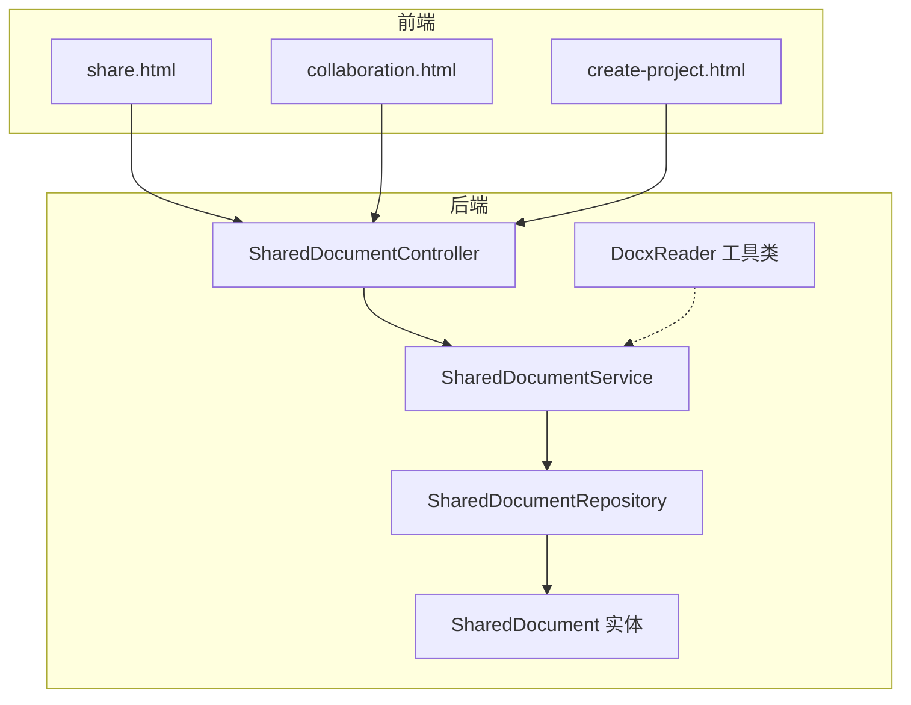
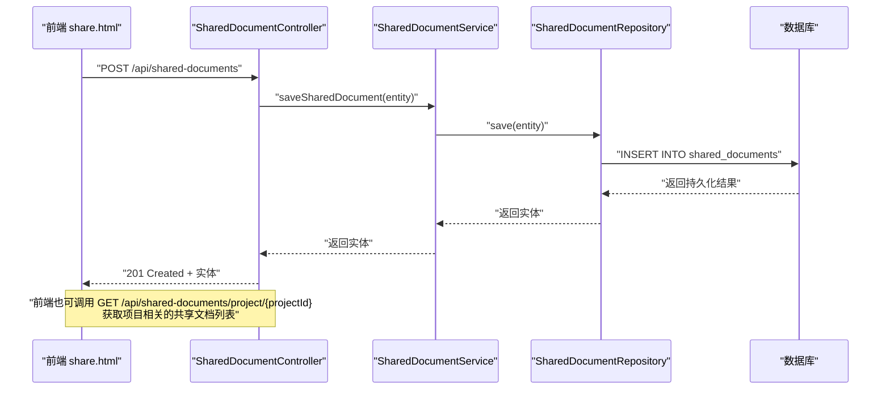
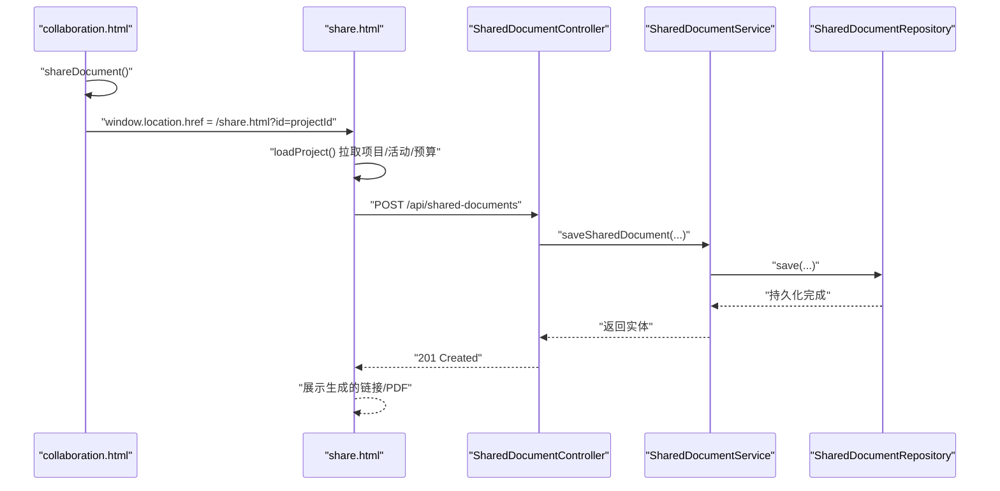
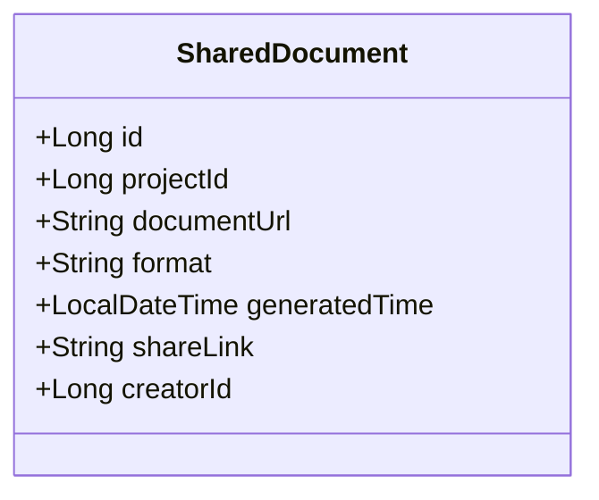
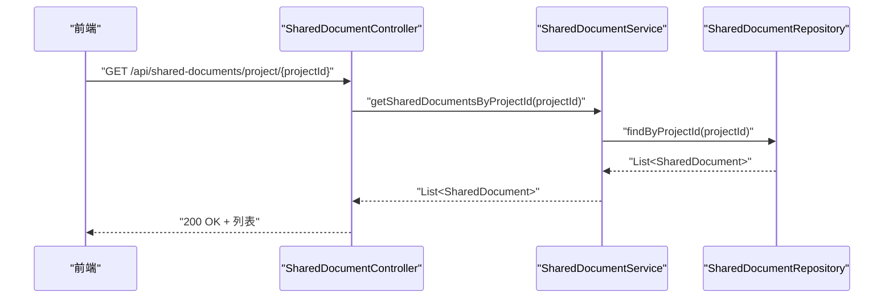
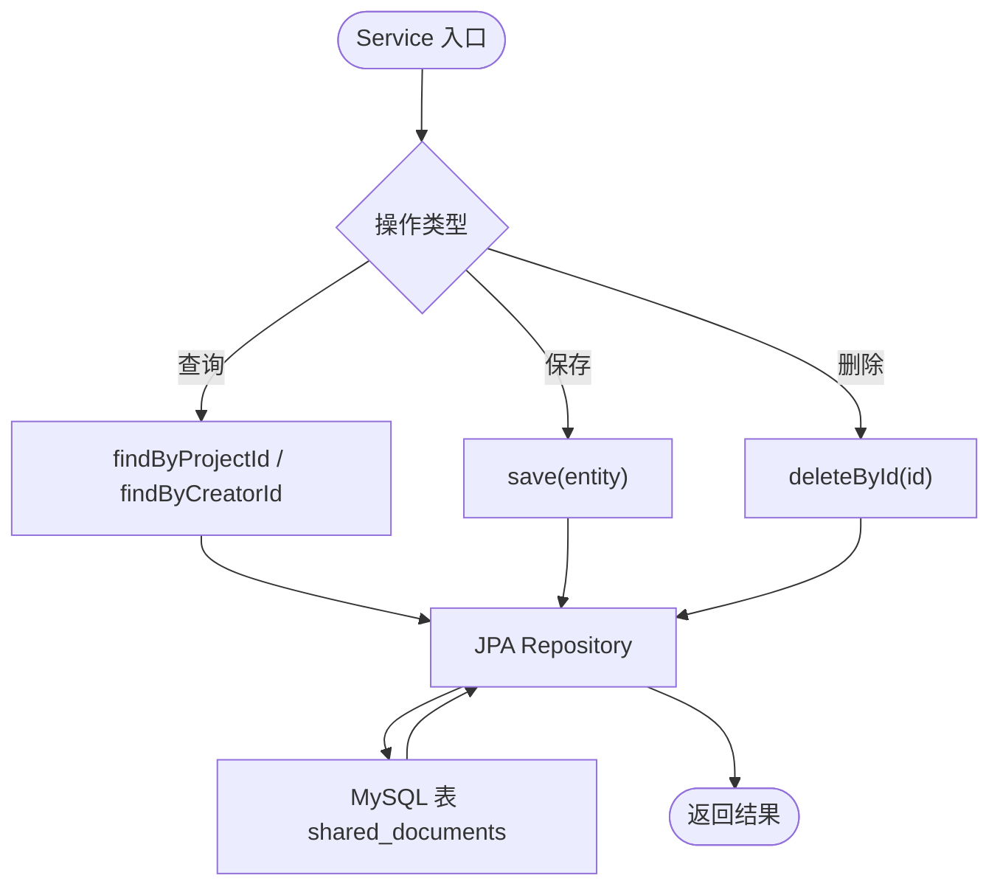
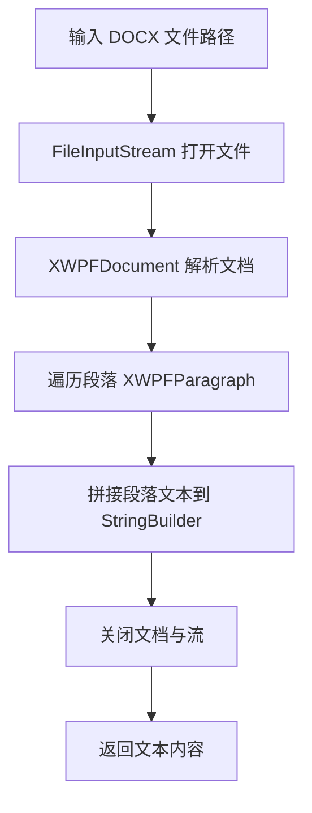
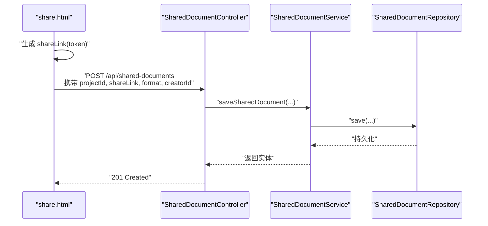
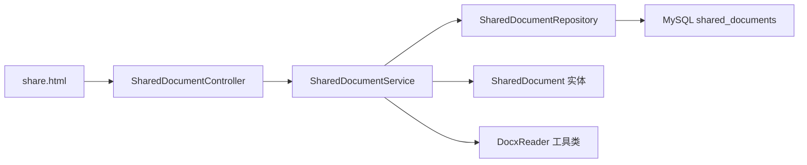

# 文档共享

<cite>
**本文引用的文件**
- [Application.java](file://tudianersha/src/main/java/com/tudianersha/Application.java)
- [application.yml](file://tudianersha/src/main/resources/application.yml)
- [schema.sql](file://tudianersha/src/main/resources/schema.sql)
- [SharedDocument.java](file://tudianersha/src/main/java/com/tudianersha/entity/SharedDocument.java)
- [SharedDocumentController.java](file://tudianersha/src/main/java/com/tudianersha/controller/SharedDocumentController.java)
- [SharedDocumentService.java](file://tudianersha/src/main/java/com/tudianersha/service/SharedDocumentService.java)
- [SharedDocumentRepository.java](file://tudianersha/src/main/java/com/tudianersha/repository/SharedDocumentRepository.java)
- [DocxReader.java](file://tudianersha/src/main/java/com/tudianersha/util/DocxReader.java)
- [share.html](file://tudianersha/src/main/resources/static/share.html)
- [collaboration.html](file://tudianersha/src/main/resources/static/collaboration.html)
- [create-project.html](file://tudianersha/src/main/resources/static/create-project.html)
</cite>

## 目录
1. [简介](#简介)
2. [项目结构](#项目结构)
3. [核心组件](#核心组件)
4. [架构总览](#架构总览)
5. [详细组件分析](#详细组件分析)
6. [依赖关系分析](#依赖关系分析)
7. [性能与可扩展性](#性能与可扩展性)
8. [故障排查指南](#故障排查指南)
9. [结论](#结论)
10. [附录](#附录)

## 简介
本文件围绕“文档共享”功能的全流程展开，从前端 shareDocument() 函数跳转到 share.html 页面，到 SharedDocumentController 提供的 RESTful 接口对共享文档进行增删改查；同时解释 SharedDocument 实体各字段的业务含义，分析 SharedDocumentService 如何与数据库交互持久化文档信息，介绍 DocxReader 工具类如何解析上传的 DOCX 文件内容；说明分享链接生成机制及其安全性考虑（通过 projectId 和 token 进行访问控制）；给出前端调用 /api/shared-documents/project/{projectId} 获取项目相关共享文档列表的实例；最后讨论文档存储路径管理及未来扩展至云存储服务的可行性。

## 项目结构
该模块属于 Spring Boot 应用 tudianersha 的一部分，采用分层架构：
- 控制器层：SharedDocumentController 提供 RESTful API
- 服务层：SharedDocumentService 封装业务逻辑
- 数据访问层：SharedDocumentRepository 继承 JPA，负责持久化
- 实体层：SharedDocument 映射数据库表 shared_documents
- 工具类：DocxReader 使用 Apache POI 解析 DOCX 内容
- 前端页面：share.html、collaboration.html、create-project.html

图示来源
- [SharedDocumentController.java](file://tudianersha/src/main/java/com/tudianersha/controller/SharedDocumentController.java#L1-L83)
- [SharedDocumentService.java](file://tudianersha/src/main/java/com/tudianersha/service/SharedDocumentService.java#L1-L40)
- [SharedDocumentRepository.java](file://tudianersha/src/main/java/com/tudianersha/repository/SharedDocumentRepository.java#L1-L13)
- [SharedDocument.java](file://tudianersha/src/main/java/com/tudianersha/entity/SharedDocument.java#L1-L114)
- [DocxReader.java](file://tudianersha/src/main/java/com/tudianersha/util/DocxReader.java#L1-L44)
- [share.html](file://tudianersha/src/main/resources/static/share.html#L1-L333)
- [collaboration.html](file://tudianersha/src/main/resources/static/collaboration.html#L1439-L1445)
- [create-project.html](file://tudianersha/src/main/resources/static/create-project.html#L1921-L1930)

章节来源
- [Application.java](file://tudianersha/src/main/java/com/tudianersha/Application.java#L1-L12)
- [application.yml](file://tudianersha/src/main/resources/application.yml#L1-L57)
- [schema.sql](file://tudianersha/src/main/resources/schema.sql#L102-L111)

## 核心组件
- SharedDocument 实体：映射数据库表 shared_documents，包含项目标识、文档 URL、格式、生成时间、分享链接、创建者 ID 等字段。
- SharedDocumentController：提供 GET/POST/PUT/DELETE 等 RESTful 接口，以及按项目或创建者查询的接口。
- SharedDocumentService：封装 CRUD 与查询逻辑，委托 Repository 完成持久化。
- SharedDocumentRepository：基于 JPA 的接口，提供按项目 ID、创建者 ID 查询的方法。
- DocxReader：使用 Apache POI 读取 DOCX 文本内容，便于后续内容检索或导出。
- 前端 share.html：实现分享流程，生成 PDF 或分享链接，并调用后端保存记录。

章节来源
- [SharedDocument.java](file://tudianersha/src/main/java/com/tudianersha/entity/SharedDocument.java#L1-L114)
- [SharedDocumentController.java](file://tudianersha/src/main/java/com/tudianersha/controller/SharedDocumentController.java#L1-L83)
- [SharedDocumentService.java](file://tudianersha/src/main/java/com/tudianersha/service/SharedDocumentService.java#L1-L40)
- [SharedDocumentRepository.java](file://tudianersha/src/main/java/com/tudianersha/repository/SharedDocumentRepository.java#L1-L13)
- [DocxReader.java](file://tudianersha/src/main/java/com/tudianersha/util/DocxReader.java#L1-L44)
- [share.html](file://tudianersha/src/main/resources/static/share.html#L264-L312)

## 架构总览
下面以序列图展示从前端 share.html 到后端 SharedDocumentController 的完整调用链，以及控制器到服务层再到数据层的处理流程。

图示来源
- [SharedDocumentController.java](file://tudianersha/src/main/java/com/tudianersha/controller/SharedDocumentController.java#L36-L40)
- [SharedDocumentController.java](file://tudianersha/src/main/java/com/tudianersha/controller/SharedDocumentController.java#L72-L76)
- [SharedDocumentService.java](file://tudianersha/src/main/java/com/tudianersha/service/SharedDocumentService.java#L25-L27)
- [SharedDocumentRepository.java](file://tudianersha/src/main/java/com/tudianersha/repository/SharedDocumentRepository.java#L1-L13)

## 详细组件分析

### 前端流程：shareDocument() 跳转至 share.html
- 前端 collaboration.html 中存在 shareDocument() 方法，当用户点击“分享”按钮时，会根据当前项目 ID 跳转到 share.html?id=projectId。
- share.html 页面加载后，会通过公共 JS 获取当前用户、项目 ID，并异步拉取项目信息、活动安排与预算，渲染预览。
- 在用户点击“生成PDF”或“生成分享链接”时，前端构造对应数据并调用后端 /api/shared-documents 接口保存一条记录，同时展示生成的链接或 PDF 下载地址。

图示来源
- [collaboration.html](file://tudianersha/src/main/resources/static/collaboration.html#L1439-L1445)
- [share.html](file://tudianersha/src/main/resources/static/share.html#L163-L331)
- [share.html](file://tudianersha/src/main/resources/static/share.html#L264-L312)
- [SharedDocumentController.java](file://tudianersha/src/main/java/com/tudianersha/controller/SharedDocumentController.java#L36-L40)

章节来源
- [collaboration.html](file://tudianersha/src/main/resources/static/collaboration.html#L1439-L1445)
- [share.html](file://tudianersha/src/main/resources/static/share.html#L163-L331)
- [share.html](file://tudianersha/src/main/resources/static/share.html#L264-L312)

### SharedDocument 实体字段的业务含义
- id：自增主键，唯一标识一条共享文档记录。
- projectId：所属项目的标识，用于按项目维度聚合共享文档。
- documentUrl：文档的实际存储地址（例如 PDF 文件路径或静态资源路径），用于下载或预览。
- format：文档格式，如 PDF、LINK 等，用于区分是链接型分享还是文件型分享。
- generatedTime：文档生成时间，用于排序与审计。
- shareLink：分享链接，可能是直接指向 PDF 的 URL，也可能是携带 token 的视图链接。
- creatorId：创建者的用户 ID，用于统计与权限控制。

图示来源
- [SharedDocument.java](file://tudianersha/src/main/java/com/tudianersha/entity/SharedDocument.java#L1-L114)

章节来源
- [SharedDocument.java](file://tudianersha/src/main/java/com/tudianersha/entity/SharedDocument.java#L1-L114)

### SharedDocumentController 提供的 RESTful API
- GET /api/shared-documents：获取所有共享文档
- GET /api/shared-documents/{id}：按 ID 获取共享文档
- POST /api/shared-documents：创建共享文档
- PUT /api/shared-documents/{id}：更新共享文档
- DELETE /api/shared-documents/{id}：删除共享文档
- GET /api/shared-documents/project/{projectId}：按项目 ID 获取共享文档列表
- GET /api/shared-documents/creator/{creatorId}：按创建者 ID 获取共享文档列表

图示来源
- [SharedDocumentController.java](file://tudianersha/src/main/java/com/tudianersha/controller/SharedDocumentController.java#L72-L76)
- [SharedDocumentService.java](file://tudianersha/src/main/java/com/tudianersha/service/SharedDocumentService.java#L33-L35)
- [SharedDocumentRepository.java](file://tudianersha/src/main/java/com/tudianersha/repository/SharedDocumentRepository.java#L11-L11)

章节来源
- [SharedDocumentController.java](file://tudianersha/src/main/java/com/tudianersha/controller/SharedDocumentController.java#L20-L83)

### SharedDocumentService 与数据库交互
- Service 层通过 SharedDocumentRepository 完成数据持久化与查询：
  - findAll：获取全部记录
  - findById：按 ID 查询
  - save：保存或更新
  - deleteById：删除
  - findByProjectId：按项目 ID 查询
  - findByCreatorId：按创建者 ID 查询

图示来源
- [SharedDocumentService.java](file://tudianersha/src/main/java/com/tudianersha/service/SharedDocumentService.java#L17-L40)
- [SharedDocumentRepository.java](file://tudianersha/src/main/java/com/tudianersha/repository/SharedDocumentRepository.java#L1-L13)
- [schema.sql](file://tudianersha/src/main/resources/schema.sql#L102-L111)

章节来源
- [SharedDocumentService.java](file://tudianersha/src/main/java/com/tudianersha/service/SharedDocumentService.java#L17-L40)
- [SharedDocumentRepository.java](file://tudianersha/src/main/java/com/tudianersha/repository/SharedDocumentRepository.java#L1-L13)
- [schema.sql](file://tudianersha/src/main/resources/schema.sql#L102-L111)

### DocxReader 工具类解析 DOCX
- DocxReader 使用 Apache POI 的 XWPFDocument 读取 DOCX 文件中的段落文本，构建字符串内容。
- 该工具可用于将上传的 DOCX 文档内容提取为纯文本，便于后续索引、导出或内容校验。

图示来源
- [DocxReader.java](file://tudianersha/src/main/java/com/tudianersha/util/DocxReader.java#L1-L44)

章节来源
- [DocxReader.java](file://tudianersha/src/main/java/com/tudianersha/util/DocxReader.java#L1-L44)

### 分享链接生成机制与安全性
- 前端在 share.html 中生成两种类型的分享：
  - PDF：documentUrl 指向本地 PDF 资源，shareLink 与 documentUrl 相同，format 为 PDF。
  - 链接：shareLink 为携带 token 的视图链接，format 为 LINK。
- 前端在生成链接时，会将 projectId、creatorId、generatedTime、shareLink 等字段一并提交给后端保存。
- 安全性考虑：
  - 通过 projectId 限定可见范围，避免跨项目泄露。
  - 通过 token 增加临时访问令牌，结合后端访问控制策略，限制有效期与使用次数（建议在后端实现）。
  - 建议在后端对 /api/shared-documents/project/{projectId} 接口增加鉴权与权限校验，确保只有项目参与者或创建者可访问。

图示来源
- [share.html](file://tudianersha/src/main/resources/static/share.html#L290-L312)
- [share.html](file://tudianersha/src/main/resources/static/share.html#L264-L288)
- [SharedDocumentController.java](file://tudianersha/src/main/java/com/tudianersha/controller/SharedDocumentController.java#L36-L40)

章节来源
- [share.html](file://tudianersha/src/main/resources/static/share.html#L264-L312)

### 前端调用 /api/shared-documents/project/{projectId} 获取项目相关共享文档列表
- 前端在 share.html 中调用 POST /api/shared-documents 保存记录后，可进一步调用 GET /api/shared-documents/project/{projectId} 获取该项目的所有共享文档列表，用于展示历史分享记录或二次分享。
- 该接口由 SharedDocumentController 提供，Service 层委托 Repository 的 findByProjectId 实现。

章节来源
- [SharedDocumentController.java](file://tudianersha/src/main/java/com/tudianersha/controller/SharedDocumentController.java#L72-L76)
- [SharedDocumentService.java](file://tudianersha/src/main/java/com/tudianersha/service/SharedDocumentService.java#L33-L35)
- [SharedDocumentRepository.java](file://tudianersha/src/main/java/com/tudianersha/repository/SharedDocumentRepository.java#L11-L11)

### 文档存储路径管理与云存储扩展
- 当前 share.html 生成的 PDF 路径为本地静态资源路径（例如 /pdfs/...），format 字段为 PDF。
- 存储路径管理建议：
  - 采用统一的存储目录规范，如按项目 ID 分桶存放，避免文件名冲突。
  - 对于 DOCX 文件，可先解析内容，再生成 PDF 并保存到指定目录。
- 云存储扩展可行性：
  - 可替换为对象存储（如 OSS、Cos、S3）的上传与访问 URL，将 documentUrl 指向云端地址，提升可扩展性与可靠性。
  - 通过签名 URL 控制访问时效，结合 token 实现双重安全控制。
  - 建议在 Service 层抽象存储适配器，隔离底层存储差异。

章节来源
- [share.html](file://tudianersha/src/main/resources/static/share.html#L264-L288)
- [SharedDocument.java](file://tudianersha/src/main/java/com/tudianersha/entity/SharedDocument.java#L1-L114)

## 依赖关系分析
- 控制器依赖服务层，服务层依赖仓库层，仓库层依赖 JPA 与数据库。
- 实体映射数据库表 shared_documents，字段与表结构一致。
- 前端通过 RESTful 接口与后端交互，控制器提供统一入口。

图示来源
- [SharedDocumentController.java](file://tudianersha/src/main/java/com/tudianersha/controller/SharedDocumentController.java#L1-L83)
- [SharedDocumentService.java](file://tudianersha/src/main/java/com/tudianersha/service/SharedDocumentService.java#L1-L40)
- [SharedDocumentRepository.java](file://tudianersha/src/main/java/com/tudianersha/repository/SharedDocumentRepository.java#L1-L13)
- [SharedDocument.java](file://tudianersha/src/main/java/com/tudianersha/entity/SharedDocument.java#L1-L114)
- [DocxReader.java](file://tudianersha/src/main/java/com/tudianersha/util/DocxReader.java#L1-L44)
- [schema.sql](file://tudianersha/src/main/resources/schema.sql#L102-L111)

章节来源
- [SharedDocumentController.java](file://tudianersha/src/main/java/com/tudianersha/controller/SharedDocumentController.java#L1-L83)
- [SharedDocumentService.java](file://tudianersha/src/main/java/com/tudianersha/service/SharedDocumentService.java#L1-L40)
- [SharedDocumentRepository.java](file://tudianersha/src/main/java/com/tudianersha/repository/SharedDocumentRepository.java#L1-L13)
- [SharedDocument.java](file://tudianersha/src/main/java/com/tudianersha/entity/SharedDocument.java#L1-L114)
- [schema.sql](file://tudianersha/src/main/resources/schema.sql#L102-L111)

## 性能与可扩展性
- 查询优化：Repository 已提供按 projectId 与 creatorId 的查询方法，建议在数据库层面为这些字段建立索引以提升查询效率。
- 分页与缓存：对于大量共享文档的场景，可在控制器层引入分页参数与缓存策略，减少一次性返回的数据量。
- 存储扩展：将本地文件存储迁移至云存储，可显著提升并发能力与可用性；同时结合 CDN 加速访问。
- 安全增强：建议在后端对 /api/shared-documents/* 接口增加鉴权与权限校验，确保只有项目参与者或创建者可访问相应数据。

## 故障排查指南
- 前端调用失败：
  - 检查 API 基础路径与接口路径是否正确（/api/shared-documents）。
  - 确认浏览器网络面板中请求状态码与响应体。
- 后端异常：
  - 查看日志级别配置与 SQL 输出，定位数据库连接、DDL 自动更新等问题。
  - 确认 application.yml 中的数据库连接参数与驱动配置。
- DOCX 解析异常：
  - 检查文件路径是否正确、文件是否存在且可读。
  - 注意异常处理返回值，避免前端误判。

章节来源
- [application.yml](file://tudianersha/src/main/resources/application.yml#L1-L57)
- [DocxReader.java](file://tudianersha/src/main/java/com/tudianersha/util/DocxReader.java#L1-L44)

## 结论
本文梳理了“文档共享”功能从前端到后端的完整流程，明确了 SharedDocument 实体各字段的业务含义，阐述了控制器、服务与仓库的职责分工，解析了 DOCX 文件的读取流程，并总结了分享链接生成机制与安全性注意事项。同时给出了前端调用 /api/shared-documents/project/{projectId} 获取项目相关共享文档列表的实例，并讨论了文档存储路径管理与云存储扩展的可行性。建议后续在后端补充鉴权与权限校验、引入分页与缓存、以及将本地存储迁移至云存储，以提升系统的安全性、性能与可扩展性。

## 附录
- 数据库表结构参考：shared_documents 字段与实体映射一致，包含项目 ID、文档 URL、格式、生成时间、分享链接、创建者 ID 等。
- 前端页面：
  - share.html：实现分享流程与接口调用
  - collaboration.html：触发分享跳转
  - create-project.html：演示 token 生成与分享链接展示

章节来源
- [schema.sql](file://tudianersha/src/main/resources/schema.sql#L102-L111)
- [share.html](file://tudianersha/src/main/resources/static/share.html#L1-L333)
- [collaboration.html](file://tudianersha/src/main/resources/static/collaboration.html#L1439-L1445)
- [create-project.html](file://tudianersha/src/main/resources/static/create-project.html#L1921-L1930)