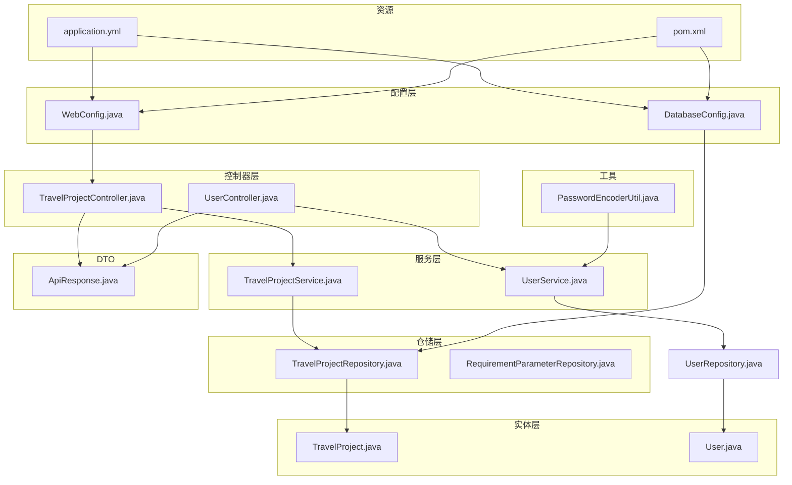
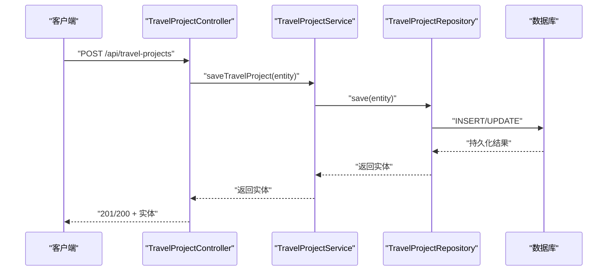
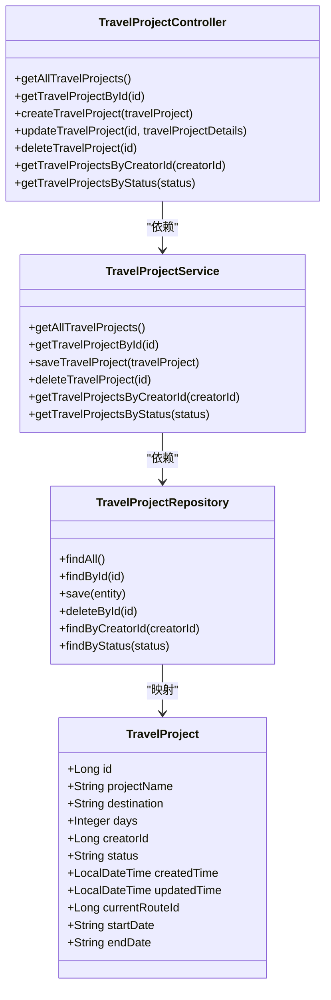
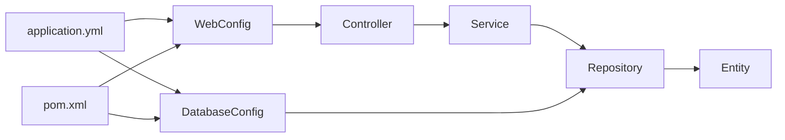

# 后端架构设计

<cite>
**本文引用的文件列表**
- [Application.java](file://tudianersha/src/main/java/com/tudianersha/Application.java)
- [WebConfig.java](file://tudianersha/src/main/java/com/tudianersha/config/WebConfig.java)
- [DatabaseConfig.java](file://tudianersha/src/main/java/com/tudianersha/config/DatabaseConfig.java)
- [TravelProjectController.java](file://tudianersha/src/main/java/com/tudianersha/controller/TravelProjectController.java)
- [UserController.java](file://tudianersha/src/main/java/com/tudianersha/controller/UserController.java)
- [TravelProjectService.java](file://tudianersha/src/main/java/com/tudianersha/service/TravelProjectService.java)
- [UserService.java](file://tudianersha/src/main/java/com/tudianersha/service/UserService.java)
- [TravelProjectRepository.java](file://tudianersha/src/main/java/com/tudianersha/repository/TravelProjectRepository.java)
- [RequirementParameterRepository.java](file://tudianersha/src/main/java/com/tudianersha/repository/RequirementParameterRepository.java)
- [TravelProject.java](file://tudianersha/src/main/java/com/tudianersha/entity/TravelProject.java)
- [User.java](file://tudianersha/src/main/java/com/tudianersha/entity/User.java)
- [ApiResponse.java](file://tudianersha/src/main/java/com/tudianersha/dto/ApiResponse.java)
- [PasswordEncoderUtil.java](file://tudianersha/src/main/java/com/tudianersha/util/PasswordEncoderUtil.java)
- [application.yml](file://tudianersha/src/main/resources/application.yml)
- [pom.xml](file://tudianersha/pom.xml)
</cite>

## 目录
1. [引言](#引言)
2. [项目结构](#项目结构)
3. [核心组件](#核心组件)
4. [架构总览](#架构总览)
5. [详细组件分析](#详细组件分析)
6. [依赖关系分析](#依赖关系分析)
7. [性能考量](#性能考量)
8. [故障排查指南](#故障排查指南)
9. [结论](#结论)
10. [附录：代码导航地图](#附录代码导航地图)

## 引言
本文件面向开发者与技术评审人员，系统性剖析后端系统的分层架构设计，重点围绕 MVC 模式中各层职责：
- Controller 层：负责 HTTP 请求路由与响应封装，统一返回格式。
- Service 层：实现核心业务逻辑与事务边界管理，协调多个仓储操作。
- Repository 层：负责数据持久化操作，基于 Spring Data JPA 提供标准 CRUD 与派生查询。
- Entity 层：映射数据库表结构，承载领域模型属性与方法。
同时，以 TravelProjectController 为例，说明其如何调用 TravelProjectService 完成项目创建，并通过 TravelProjectRepository 保存至数据库；强调依赖注入（DI）在组件解耦中的应用；解释 ApiResponse DTO 在统一 API 响应格式中的作用；分析分层间的调用链路与异常传播机制；最后讨论为何部分功能保留 MyBatis 支持（如复杂查询）而多数使用 JPA，并提供清晰的代码导航地图。

## 项目结构
后端采用典型的分层组织方式，按功能域划分包结构：
- config：配置类，启用 JPA 仓库扫描与 Web CORS。
- controller：REST 控制器，暴露 HTTP 接口。
- service：业务服务层，编排领域逻辑与仓储交互。
- repository：数据访问层，继承 Spring Data JPA 接口。
- entity：实体类，对应数据库表结构。
- dto：数据传输对象，统一响应格式。
- util：工具类，如密码编码等。
- resources：配置文件 application.yml、静态资源与初始化脚本。

图表来源
- [TravelProjectController.java](file://tudianersha/src/main/java/com/tudianersha/controller/TravelProjectController.java#L1-L85)
- [TravelProjectService.java](file://tudianersha/src/main/java/com/tudianersha/service/TravelProjectService.java#L1-L40)
- [TravelProjectRepository.java](file://tudianersha/src/main/java/com/tudianersha/repository/TravelProjectRepository.java#L1-L13)
- [TravelProject.java](file://tudianersha/src/main/java/com/tudianersha/entity/TravelProject.java#L1-L163)
- [UserController.java](file://tudianersha/src/main/java/com/tudianersha/controller/UserController.java#L1-L152)
- [UserService.java](file://tudianersha/src/main/java/com/tudianersha/service/UserService.java#L1-L48)
- [DatabaseConfig.java](file://tudianersha/src/main/java/com/tudianersha/config/DatabaseConfig.java#L1-L10)
- [WebConfig.java](file://tudianersha/src/main/java/com/tudianersha/config/WebConfig.java#L1-L24)
- [ApiResponse.java](file://tudianersha/src/main/java/com/tudianersha/dto/ApiResponse.java#L1-L80)
- [PasswordEncoderUtil.java](file://tudianersha/src/main/java/com/tudianersha/util/PasswordEncoderUtil.java#L1-L32)
- [application.yml](file://tudianersha/src/main/resources/application.yml#L1-L57)
- [pom.xml](file://tudianersha/pom.xml#L1-L180)

章节来源
- [Application.java](file://tudianersha/src/main/java/com/tudianersha/Application.java#L1-L12)
- [WebConfig.java](file://tudianersha/src/main/java/com/tudianersha/config/WebConfig.java#L1-L24)
- [DatabaseConfig.java](file://tudianersha/src/main/java/com/tudianersha/config/DatabaseConfig.java#L1-L10)
- [application.yml](file://tudianersha/src/main/resources/application.yml#L1-L57)
- [pom.xml](file://tudianersha/pom.xml#L1-L180)

## 核心组件
- Controller 层
  - 以 TravelProjectController 为例，提供 GET/POST/PUT/DELETE 等接口，负责参数接收、简单校验与响应封装。
  - 以 UserController 为例，演示统一 ApiResponse 包装与异常分支处理。
- Service 层
  - 以 TravelProjectService 为例，作为业务编排者，调用 Repository 执行持久化与查询。
  - 以 UserService 为例，演示业务规则（用户名/邮箱唯一性检查）、密码加密与仓储调用。
- Repository 层
  - 以 TravelProjectRepository 为例，继承 JpaRepository，提供标准 CRUD 与派生查询方法。
  - 以 RequirementParameterRepository 为例，展示自定义派生查询方法。
- Entity 层
  - 以 TravelProject 为例，使用 JPA 注解映射数据库表字段，提供完整 getter/setter。
  - 以 User 为例，体现用户实体的基本字段与业务约束。
- DTO 层
  - ApiResponse 统一响应结构，提供 success/error 工厂方法，便于前端一致处理。

章节来源
- [TravelProjectController.java](file://tudianersha/src/main/java/com/tudianersha/controller/TravelProjectController.java#L1-L85)
- [UserController.java](file://tudianersha/src/main/java/com/tudianersha/controller/UserController.java#L1-L152)
- [TravelProjectService.java](file://tudianersha/src/main/java/com/tudianersha/service/TravelProjectService.java#L1-L40)
- [UserService.java](file://tudianersha/src/main/java/com/tudianersha/service/UserService.java#L1-L48)
- [TravelProjectRepository.java](file://tudianersha/src/main/java/com/tudianersha/repository/TravelProjectRepository.java#L1-L13)
- [RequirementParameterRepository.java](file://tudianersha/src/main/java/com/tudianersha/repository/RequirementParameterRepository.java#L1-L14)
- [TravelProject.java](file://tudianersha/src/main/java/com/tudianersha/entity/TravelProject.java#L1-L163)
- [User.java](file://tudianersha/src/main/java/com/tudianersha/entity/User.java#L1-L200)
- [ApiResponse.java](file://tudianersha/src/main/java/com/tudianersha/dto/ApiResponse.java#L1-L80)

## 架构总览
下图展示了从 HTTP 请求到数据库写入的完整调用链路，以及各层职责与依赖方向。

图表来源
- [TravelProjectController.java](file://tudianersha/src/main/java/com/tudianersha/controller/TravelProjectController.java#L36-L40)
- [TravelProjectService.java](file://tudianersha/src/main/java/com/tudianersha/service/TravelProjectService.java#L25-L27)
- [TravelProjectRepository.java](file://tudianersha/src/main/java/com/tudianersha/repository/TravelProjectRepository.java#L1-L13)

## 详细组件分析

### TravelProjectController 分析
- 职责
  - 路由与参数绑定：定义 /api/travel-projects 的 REST 接口，接收路径变量与请求体。
  - 响应封装：对查询结果进行 ResponseEntity 封装；对创建场景返回 201。
  - 与 Service 协作：将实体交由 Service 层执行保存与查询。
- 关键点
  - 使用 @Autowired 注入 TravelProjectService，体现依赖注入解耦。
  - 对不存在的资源返回 404，体现健壮的资源状态判断。
- 与 ApiResponse 的关系
  - 该控制器未直接使用 ApiResponse 进行统一封装，但 UserController 展示了 ApiResponse 的使用范式，可作为统一风格参考。

章节来源
- [TravelProjectController.java](file://tudianersha/src/main/java/com/tudianersha/controller/TravelProjectController.java#L1-L85)

### TravelProjectService 分析
- 职责
  - 业务编排：将 Controller 的请求转换为仓储调用，必要时进行业务规则校验（如后续扩展）。
  - 事务边界：在 Spring 声明式事务管理下，保证跨仓储操作的一致性。
- 关键点
  - 使用 @Autowired 注入 TravelProjectRepository，体现 DI。
  - 提供 findAll、findById、save、deleteById、按 creatorId/status 查询等方法，满足典型 CRUD 与派生查询需求。

章节来源
- [TravelProjectService.java](file://tudianersha/src/main/java/com/tudianersha/service/TravelProjectService.java#L1-L40)

### TravelProjectRepository 分析
- 职责
  - 数据访问：继承 JpaRepository，自动获得标准 CRUD 与分页排序能力。
  - 自定义查询：通过方法命名约定提供 findByCreatorId、findByStatus 等派生查询。
- 关键点
  - 无需手写 SQL，简化开发与维护成本。
  - 与 Entity TravelProject 映射，字段与注解保持一致。

章节来源
- [TravelProjectRepository.java](file://tudianersha/src/main/java/com/tudianersha/repository/TravelProjectRepository.java#L1-L13)
- [TravelProject.java](file://tudianersha/src/main/java/com/tudianersha/entity/TravelProject.java#L1-L163)

### Entity 层（TravelProject）
- 职责
  - 领域建模：使用 @Entity/@Table/@Column 等注解映射数据库表结构。
  - 字段与行为：提供构造函数、getter/setter、toString 等。
- 关键点
  - 主键策略、非空约束与时间戳字段均在实体层面明确，便于 JPA 生成 DDL 与执行校验。

章节来源
- [TravelProject.java](file://tudianersha/src/main/java/com/tudianersha/entity/TravelProject.java#L1-L163)

### ApiResponse DTO 分析
- 职责
  - 统一响应格式：提供 success/error 工厂方法，屏蔽不同接口返回结构差异。
  - 前后端一致性：前端可统一解析 ApiResponse，减少适配成本。
- 关键点
  - UserController 展示了 ApiResponse 的使用方式，建议 Controller 层逐步迁移至统一包装。

章节来源
- [ApiResponse.java](file://tudianersha/src/main/java/com/tudianersha/dto/ApiResponse.java#L1-L80)
- [UserController.java](file://tudianersha/src/main/java/com/tudianersha/controller/UserController.java#L1-L152)

### 类图：Controller-Service-Repository-Entity 关系

图表来源
- [TravelProjectController.java](file://tudianersha/src/main/java/com/tudianersha/controller/TravelProjectController.java#L1-L85)
- [TravelProjectService.java](file://tudianersha/src/main/java/com/tudianersha/service/TravelProjectService.java#L1-L40)
- [TravelProjectRepository.java](file://tudianersha/src/main/java/com/tudianersha/repository/TravelProjectRepository.java#L1-L13)
- [TravelProject.java](file://tudianersha/src/main/java/com/tudianersha/entity/TravelProject.java#L1-L163)

### 复杂查询与 MyBatis 支持
- 现状
  - 多数查询使用 Spring Data JPA 的派生查询（方法命名约定），简洁高效。
  - pom.xml 中引入了 MyBatis Spring Boot Starter，表明系统具备 MyBatis 能力。
- 选择原则
  - 简单条件查询优先使用 JPA，提升开发效率与可维护性。
  - 复杂联表、动态条件、批量更新等场景可考虑 MyBatis，以获得更灵活的 SQL 控制权。
- 配置
  - application.yml 中配置了 MyBatis 的 Mapper 位置与类型别名包，便于后续扩展。

章节来源
- [pom.xml](file://tudianersha/pom.xml#L1-L180)
- [application.yml](file://tudianersha/src/main/resources/application.yml#L39-L42)

### 依赖注入（DI）与组件解耦
- DI 应用
  - Controller 通过 @Autowired 注入 Service；Service 通过 @Autowired 注入 Repository。
  - 通过 Spring 容器管理生命周期与依赖关系，降低耦合度，便于单元测试替换桩。
- 解耦效果
  - 控制器只关注 HTTP 语义与响应封装；服务层专注业务编排；仓储层专注数据访问；实体层专注领域模型。
  - 变更某一层不影响其他层的接口契约。

章节来源
- [TravelProjectController.java](file://tudianersha/src/main/java/com/tudianersha/controller/TravelProjectController.java#L1-L85)
- [TravelProjectService.java](file://tudianersha/src/main/java/com/tudianersha/service/TravelProjectService.java#L1-L40)
- [TravelProjectRepository.java](file://tudianersha/src/main/java/com/tudianersha/repository/TravelProjectRepository.java#L1-L13)

### 异常传播与统一响应
- 异常传播
  - Controller 层对资源不存在场景返回 404；对内部异常返回 500。
  - Service 层抛出的运行时异常会向上传播至 Controller，由 Spring MVC 统一处理。
- 统一响应
  - ApiResponse 提供统一结构，建议在 Controller 层逐步推广使用，提升前后端一致性。
  - UserController 展示了 ApiResponse 的使用范式，可作为迁移参考。

章节来源
- [TravelProjectController.java](file://tudianersha/src/main/java/com/tudianersha/controller/TravelProjectController.java#L20-L85)
- [UserController.java](file://tudianersha/src/main/java/com/tudianersha/controller/UserController.java#L1-L152)
- [ApiResponse.java](file://tudianersha/src/main/java/com/tudianersha/dto/ApiResponse.java#L1-L80)

## 依赖关系分析
- 组件耦合
  - 控制器依赖服务层；服务层依赖仓储接口；仓储接口依赖实体；配置类启用 JPA 与 Web 功能。
- 外部依赖
  - JPA 用于 ORM 与数据访问；MyBatis 作为可选增强；MySQL 作为数据源；Spring Web 提供 MVC 能力。
- 配置与环境
  - application.yml 配置数据源、JPA 方言与 MyBatis Mapper 位置；pom.xml 管理依赖版本。

图表来源
- [DatabaseConfig.java](file://tudianersha/src/main/java/com/tudianersha/config/DatabaseConfig.java#L1-L10)
- [WebConfig.java](file://tudianersha/src/main/java/com/tudianersha/config/WebConfig.java#L1-L24)
- [application.yml](file://tudianersha/src/main/resources/application.yml#L1-L57)
- [pom.xml](file://tudianersha/pom.xml#L1-L180)

章节来源
- [DatabaseConfig.java](file://tudianersha/src/main/java/com/tudianersha/config/DatabaseConfig.java#L1-L10)
- [WebConfig.java](file://tudianersha/src/main/java/com/tudianersha/config/WebConfig.java#L1-L24)
- [application.yml](file://tudianersha/src/main/resources/application.yml#L1-L57)
- [pom.xml](file://tudianersha/pom.xml#L1-L180)

## 性能考量
- 查询优化
  - 优先使用 JPA 派生查询，避免 N+1 查询；必要时使用 @Query + JPQL 或原生 SQL。
  - 对高频查询建立合适的索引（如 creator_id、status）。
- 事务与锁
  - 在 Service 层合理划分事务边界，避免长事务占用连接。
- 缓存策略
  - 对只读或低频变更的数据引入缓存（如 Redis），减少数据库压力。
- 分页与批量
  - 使用分页查询与批量写入，避免一次性加载过多数据。
- 日志与监控
  - 启用慢查询日志与 SQL 显示，结合 APM 工具定位瓶颈。

## 故障排查指南
- 常见问题
  - 数据库连接失败：检查 application.yml 中的 JDBC URL、用户名与密码。
  - JPA DDL 自动建表失败：确认数据库方言与驱动版本兼容。
  - MyBatis Mapper 未加载：确认 application.yml 中的 mapper-locations 与 type-aliases-package 配置。
- 排查步骤
  - 启用 Spring Boot 日志级别，观察启动阶段的配置加载与异常堆栈。
  - 使用 Postman/浏览器调试接口，核对请求路径、参数与响应体。
  - 在 Service 层添加关键日志点，定位异常发生的具体环节。
- 安全与合规
  - 密码存储使用 BCrypt 编码，避免明文存储；UserController 展示了编码与匹配流程。
  - CORS 配置需根据部署环境调整允许来源与方法。

章节来源
- [application.yml](file://tudianersha/src/main/resources/application.yml#L1-L57)
- [PasswordEncoderUtil.java](file://tudianersha/src/main/java/com/tudianersha/util/PasswordEncoderUtil.java#L1-L32)
- [WebConfig.java](file://tudianersha/src/main/java/com/tudianersha/config/WebConfig.java#L1-L24)

## 结论
本项目采用清晰的分层架构，Controller/Service/Repository/Entity 各司其职，配合依赖注入实现松耦合。TravelProjectController 通过 TravelProjectService 与 TravelProjectRepository 完成项目创建与持久化，体现了标准的 MVC 流程。ApiResponse 为统一响应格式提供了良好基础，建议在更多控制器中推广使用。对于复杂查询场景，MyBatis 作为可选增强手段，与 JPA 并行共存，兼顾开发效率与灵活性。整体架构易于扩展与维护，适合持续演进。

## 附录：代码导航地图
- 入口类
  - [Application.java](file://tudianersha/src/main/java/com/tudianersha/Application.java#L1-L12)
- 配置
  - [DatabaseConfig.java](file://tudianersha/src/main/java/com/tudianersha/config/DatabaseConfig.java#L1-L10)
  - [WebConfig.java](file://tudianersha/src/main/java/com/tudianersha/config/WebConfig.java#L1-L24)
  - [application.yml](file://tudianersha/src/main/resources/application.yml#L1-L57)
  - [pom.xml](file://tudianersha/pom.xml#L1-L180)
- 控制器
  - [TravelProjectController.java](file://tudianersha/src/main/java/com/tudianersha/controller/TravelProjectController.java#L1-L85)
  - [UserController.java](file://tudianersha/src/main/java/com/tudianersha/controller/UserController.java#L1-L152)
- 服务
  - [TravelProjectService.java](file://tudianersha/src/main/java/com/tudianersha/service/TravelProjectService.java#L1-L40)
  - [UserService.java](file://tudianersha/src/main/java/com/tudianersha/service/UserService.java#L1-L48)
- 仓储
  - [TravelProjectRepository.java](file://tudianersha/src/main/java/com/tudianersha/repository/TravelProjectRepository.java#L1-L13)
  - [RequirementParameterRepository.java](file://tudianersha/src/main/java/com/tudianersha/repository/RequirementParameterRepository.java#L1-L14)
- 实体
  - [TravelProject.java](file://tudianersha/src/main/java/com/tudianersha/entity/TravelProject.java#L1-L163)
  - [User.java](file://tudianersha/src/main/java/com/tudianersha/entity/User.java#L1-L200)
- DTO
  - [ApiResponse.java](file://tudianersha/src/main/java/com/tudianersha/dto/ApiResponse.java#L1-L80)
- 工具
  - [PasswordEncoderUtil.java](file://tudianersha/src/main/java/com/tudianersha/util/PasswordEncoderUtil.java#L1-L32)