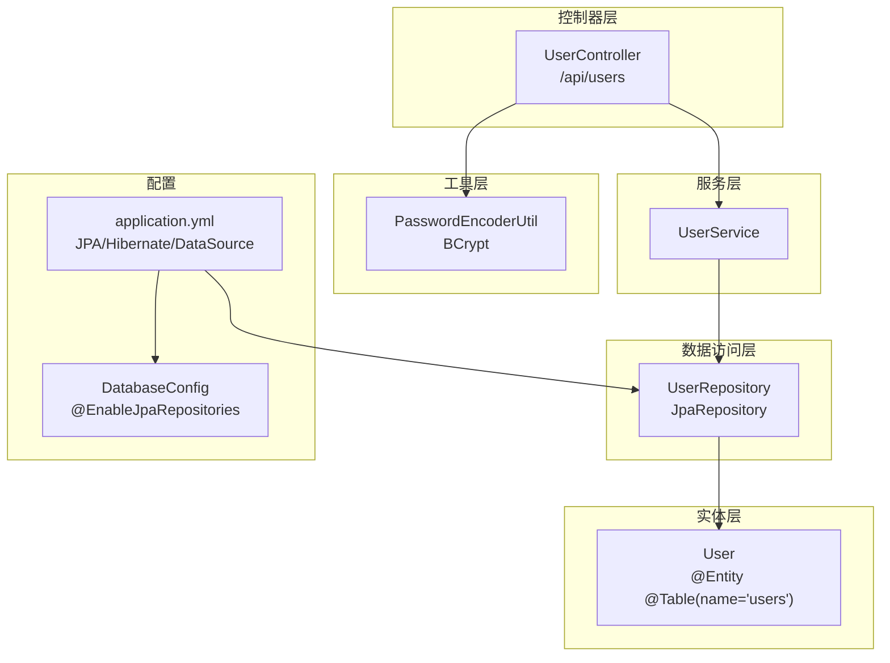
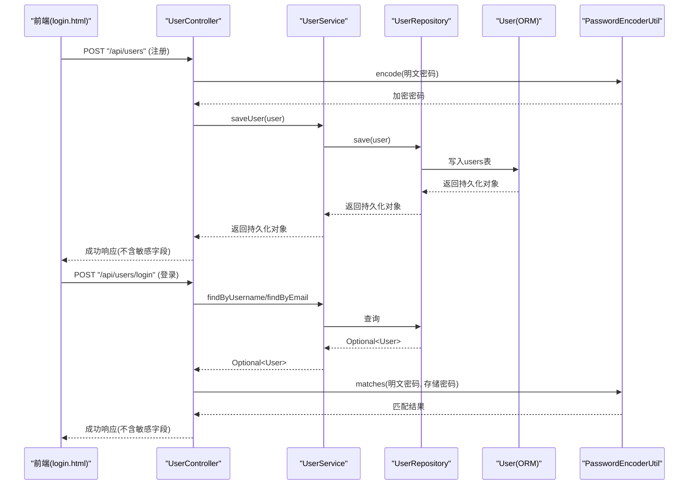
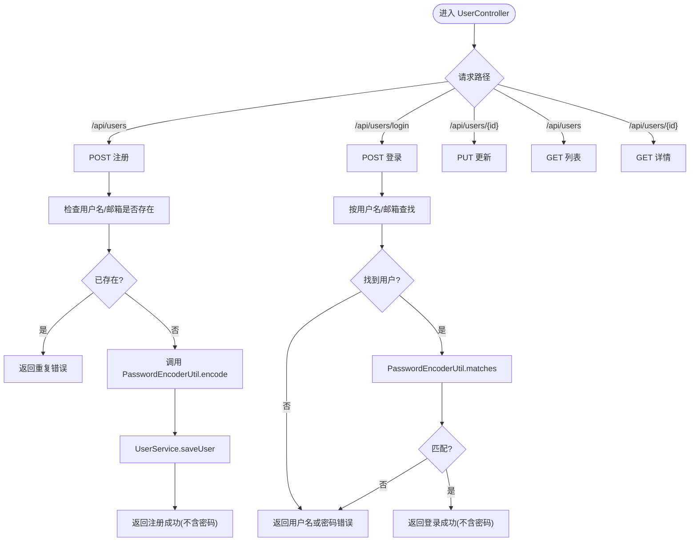
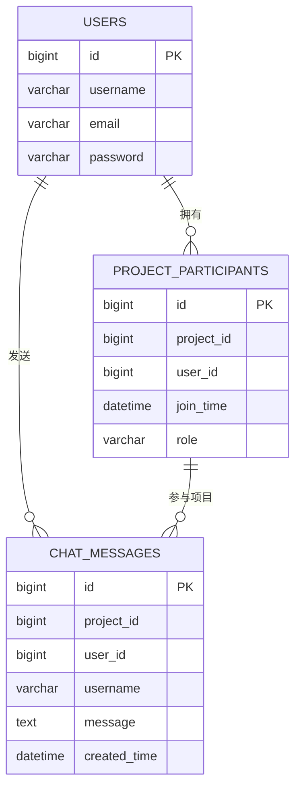
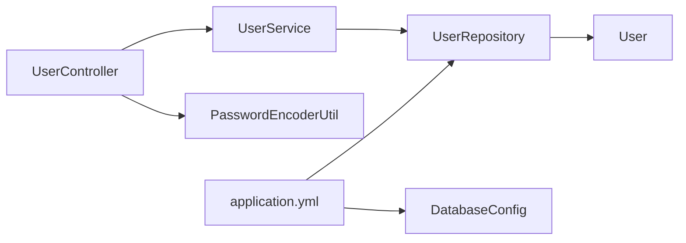

# 用户管理

<cite>
**本文引用的文件**
- [UserController.java](file://tudianersha/src/main/java/com/tudianersha/controller/UserController.java)
- [UserService.java](file://tudianersha/src/main/java/com/tudianersha/service/UserService.java)
- [UserRepository.java](file://tudianersha/src/main/java/com/tudianersha/repository/UserRepository.java)
- [User.java](file://tudianersha/src/main/java/com/tudianersha/entity/User.java)
- [PasswordEncoderUtil.java](file://tudianersha/src/main/java/com/tudianersha/util/PasswordEncoderUtil.java)
- [application.yml](file://tudianersha/src/main/resources/application.yml)
- [DatabaseConfig.java](file://tudianersha/src/main/java/com/tudianersha/config/DatabaseConfig.java)
- [UserServiceTest.java](file://tudianersha/src/test/java/com/tudianersha/UserServiceTest.java)
- [ProjectParticipant.java](file://tudianersha/src/main/java/com/tudianersha/entity/ProjectParticipant.java)
- [ProjectParticipantRepository.java](file://tudianersha/src/main/java/com/tudianersha/repository/ProjectParticipantRepository.java)
- [ChatMessage.java](file://tudianersha/src/main/java/com/tudianersha/entity/ChatMessage.java)
- [login.html](file://tudianersha/src/main/resources/static/login.html)
</cite>

## 目录
1. [简介](#简介)
2. [项目结构](#项目结构)
3. [核心组件](#核心组件)
4. [架构总览](#架构总览)
5. [详细组件分析](#详细组件分析)
6. [依赖关系分析](#依赖关系分析)
7. [性能考虑](#性能考虑)
8. [故障排查指南](#故障排查指南)
9. [结论](#结论)
10. [附录](#附录)

## 简介
本文件深入剖析用户管理模块的实现机制，涵盖：
- UserController 如何处理用户注册、登录、个人信息更新等 REST 接口
- UserService 中业务逻辑封装与事务管理现状
- UserRepository 基于 JPA 的数据访问操作
- User 实体类与数据库表的映射关系
- PasswordEncoderUtil 在密码加密与校验中的作用与实现原理
- 结合前端登录页面展示认证流程与安全策略
- 与项目参与（ProjectParticipant）、聊天消息（ChatMessage）模块的关联关系
- 常见问题排查方法与性能优化建议（缓存、防暴力破解）

## 项目结构
用户管理模块位于后端 Spring Boot 工程 tudianersha 下，采用分层架构：控制器（Controller）、服务（Service）、仓库（Repository）、实体（Entity）、工具（Util），并由配置文件统一管理数据源与 JPA 行为。

图表来源
- [UserController.java](file://tudianersha/src/main/java/com/tudianersha/controller/UserController.java#L1-L152)
- [UserService.java](file://tudianersha/src/main/java/com/tudianersha/service/UserService.java#L1-L48)
- [UserRepository.java](file://tudianersha/src/main/java/com/tudianersha/repository/UserRepository.java#L1-L15)
- [User.java](file://tudianersha/src/main/java/com/tudianersha/entity/User.java#L1-L73)
- [PasswordEncoderUtil.java](file://tudianersha/src/main/java/com/tudianersha/util/PasswordEncoderUtil.java#L1-L33)
- [application.yml](file://tudianersha/src/main/resources/application.yml#L1-L57)
- [DatabaseConfig.java](file://tudianersha/src/main/java/com/tudianersha/config/DatabaseConfig.java#L1-L10)

章节来源
- [application.yml](file://tudianersha/src/main/resources/application.yml#L1-L57)
- [DatabaseConfig.java](file://tudianersha/src/main/java/com/tudianersha/config/DatabaseConfig.java#L1-L10)

## 核心组件
- 控制器：UserController 提供用户查询、注册、登录、更新、删除接口，并在注册时调用密码加密工具，在登录时进行密码校验。
- 服务：UserService 封装业务逻辑，委托 UserRepository 完成持久化操作；当前未显式声明事务注解，但 Spring 默认行为满足单次保存场景。
- 数据访问：UserRepository 继承 JpaRepository，提供按用户名/邮箱查询与存在性检查方法。
- 实体：User 使用 JPA 注解映射 users 表，包含 id、username、email、password 字段。
- 工具：PasswordEncoderUtil 基于 BCrypt 进行密码编码与匹配。

章节来源
- [UserController.java](file://tudianersha/src/main/java/com/tudianersha/controller/UserController.java#L1-L152)
- [UserService.java](file://tudianersha/src/main/java/com/tudianersha/service/UserService.java#L1-L48)
- [UserRepository.java](file://tudianersha/src/main/java/com/tudianersha/repository/UserRepository.java#L1-L15)
- [User.java](file://tudianersha/src/main/java/com/tudianersha/entity/User.java#L1-L73)
- [PasswordEncoderUtil.java](file://tudianersha/src/main/java/com/tudianersha/util/PasswordEncoderUtil.java#L1-L33)

## 架构总览
用户管理模块遵循典型的 MVC + 分层架构，控制器负责请求接入与响应封装，服务层负责业务编排，仓库层负责数据访问，实体层负责 ORM 映射，工具层提供通用能力（如密码加密）。JPA/Hibernate 通过配置文件启用自动建模与 SQL 输出，便于调试。

图表来源
- [UserController.java](file://tudianersha/src/main/java/com/tudianersha/controller/UserController.java#L42-L124)
- [UserService.java](file://tudianersha/src/main/java/com/tudianersha/service/UserService.java#L17-L48)
- [UserRepository.java](file://tudianersha/src/main/java/com/tudianersha/repository/UserRepository.java#L9-L15)
- [User.java](file://tudianersha/src/main/java/com/tudianersha/entity/User.java#L1-L73)
- [PasswordEncoderUtil.java](file://tudianersha/src/main/java/com/tudianersha/util/PasswordEncoderUtil.java#L1-L33)
- [login.html](file://tudianersha/src/main/resources/static/login.html#L270-L316)

## 详细组件分析

### 控制器：UserController
- GET /api/users：返回所有用户列表，使用 ApiResponse 包裹。
- GET /api/users/{id}：按主键查询用户，不存在时返回 404。
- POST /api/users：注册接口
  - 校验用户名与邮箱唯一性
  - 调用 PasswordEncoderUtil 对原始密码进行加密
  - 保存用户并返回成功响应（不包含密码）
- POST /api/users/login：登录接口
  - 支持用户名或邮箱登录
  - 查询用户后使用 PasswordEncoderUtil.matches 校验密码
  - 返回用户基本信息（不包含密码）
- PUT /api/users/{id}：更新用户信息（包括密码）
- DELETE /api/users/{id}：删除用户

图表来源
- [UserController.java](file://tudianersha/src/main/java/com/tudianersha/controller/UserController.java#L25-L151)
- [PasswordEncoderUtil.java](file://tudianersha/src/main/java/com/tudianersha/util/PasswordEncoderUtil.java#L1-L33)

章节来源
- [UserController.java](file://tudianersha/src/main/java/com/tudianersha/controller/UserController.java#L25-L151)

### 服务：UserService
- 封装对 UserRepository 的调用，提供查询、保存、删除、唯一性检查等方法
- 当前未显式声明事务注解，但 Spring Boot 默认行为满足单次保存场景；若后续扩展批量操作或跨表事务，建议添加 @Transactional

章节来源
- [UserService.java](file://tudianersha/src/main/java/com/tudianersha/service/UserService.java#L1-L48)

### 数据访问：UserRepository
- 继承 JpaRepository<User, Long>，提供基础 CRUD
- 自定义方法：按用户名/邮箱查询与存在性检查，供控制器与服务层使用

章节来源
- [UserRepository.java](file://tudianersha/src/main/java/com/tudianersha/repository/UserRepository.java#L1-L15)

### 实体：User
- 使用 JPA 注解映射到数据库表 users
- 字段：id（自增主键）、username、email、password（均为非空）
- 提供标准的 getter/setter 与 toString

章节来源
- [User.java](file://tudianersha/src/main/java/com/tudianersha/entity/User.java#L1-L73)

### 工具：PasswordEncoderUtil（BCrypt）
- 提供静态方法 encode 与 matches
- 使用 BCryptPasswordEncoder 进行加密与匹配，具备抗彩虹表与成本因子控制的安全特性
- 控制器在注册时加密密码，在登录时验证密码

章节来源
- [PasswordEncoderUtil.java](file://tudianersha/src/main/java/com/tudianersha/util/PasswordEncoderUtil.java#L1-L33)
- [UserController.java](file://tudianersha/src/main/java/com/tudianersha/controller/UserController.java#L61-L114)

### 配置：application.yml 与 DatabaseConfig
- application.yml 配置数据源、JPA/Hibernate、日志级别等
- DatabaseConfig 启用 JPA 仓库扫描，确保 UserRepository 生效

章节来源
- [application.yml](file://tudianersha/src/main/resources/application.yml#L1-L57)
- [DatabaseConfig.java](file://tudianersha/src/main/java/com/tudianersha/config/DatabaseConfig.java#L1-L10)

### 测试：UserServiceTest
- 使用 @MockBean 模拟 UserRepository，验证 saveUser 与 findByUsername 的行为
- 展示了服务层对仓库层的依赖注入与调用方式

章节来源
- [UserServiceTest.java](file://tudianersha/src/test/java/com/tudianersha/UserServiceTest.java#L1-L55)

### 前端集成：login.html
- 前端通过 JS 调用 /api/users/login，接收后端返回的用户信息并进行页面跳转
- 登录成功后通过本地存储或会话维持状态（具体实现由前端公共脚本负责）

章节来源
- [login.html](file://tudianersha/src/main/resources/static/login.html#L270-L316)

### 与项目参与、聊天消息模块的关联
- 项目参与（ProjectParticipant）：用户作为项目成员存在，包含 project_id、user_id、角色、加入时间等字段，用于权限与协作控制
- 聊天消息（ChatMessage）：消息记录包含 project_id、user_id、username、message、created_time 等字段，用户在项目内进行交流

图表来源
- [User.java](file://tudianersha/src/main/java/com/tudianersha/entity/User.java#L1-L73)
- [ProjectParticipant.java](file://tudianersha/src/main/java/com/tudianersha/entity/ProjectParticipant.java#L1-L87)
- [ChatMessage.java](file://tudianersha/src/main/java/com/tudianersha/entity/ChatMessage.java#L1-L90)

章节来源
- [ProjectParticipant.java](file://tudianersha/src/main/java/com/tudianersha/entity/ProjectParticipant.java#L1-L87)
- [ProjectParticipantRepository.java](file://tudianersha/src/main/java/com/tudianersha/repository/ProjectParticipantRepository.java#L1-L16)
- [ChatMessage.java](file://tudianersha/src/main/java/com/tudianersha/entity/ChatMessage.java#L1-L90)

## 依赖关系分析
- 控制器依赖服务层与密码工具
- 服务层依赖仓库层
- 仓库层依赖实体与 JPA/Hibernate
- 配置文件驱动数据源与 JPA 行为

图表来源
- [UserController.java](file://tudianersha/src/main/java/com/tudianersha/controller/UserController.java#L1-L152)
- [UserService.java](file://tudianersha/src/main/java/com/tudianersha/service/UserService.java#L1-L48)
- [UserRepository.java](file://tudianersha/src/main/java/com/tudianersha/repository/UserRepository.java#L1-L15)
- [User.java](file://tudianersha/src/main/java/com/tudianersha/entity/User.java#L1-L73)
- [PasswordEncoderUtil.java](file://tudianersha/src/main/java/com/tudianersha/util/PasswordEncoderUtil.java#L1-L33)
- [application.yml](file://tudianersha/src/main/resources/application.yml#L1-L57)
- [DatabaseConfig.java](file://tudianersha/src/main/java/com/tudianersha/config/DatabaseConfig.java#L1-L10)

## 性能考虑
- 缓存用户信息
  - 可在 UserService 层引入缓存（如 Caffeine/Redis），对高频查询（如按 id、按用户名/邮箱）进行缓存，减少数据库压力
  - 注意缓存失效策略与一致性（写操作后主动失效相关缓存）
- 防暴力破解登录接口
  - 在控制器或网关层增加限流（如基于 IP 或账户维度的滑动窗口/令牌桶）
  - 登录失败次数阈值与临时封禁策略
- 数据库层面
  - 为 username、email 添加唯一索引（JPA 自动建模可配合）
  - 合理使用分页查询，避免一次性加载大量用户
- 日志与监控
  - 开启 JPA SQL 输出（已在配置中开启）便于定位慢查询
  - 对关键接口埋点监控（注册、登录、更新）

## 故障排查指南
- 注册失败
  - 检查用户名/邮箱是否重复（控制器已做存在性检查）
  - 确认密码加密是否正常执行（控制器调用 PasswordEncoderUtil.encode）
  - 查看数据库连接与 DDL 自动建模是否生效（application.yml）
- 登录无响应或失败
  - 确认前端提交的 account 字段是否正确（支持用户名或邮箱）
  - 检查 PasswordEncoderUtil.matches 是否被调用且匹配逻辑正确
  - 查看后端日志与数据库中用户记录是否存在
- 数据库异常
  - 检查 application.yml 中的数据库连接参数与驱动
  - 确认 JPA/Hibernate 配置（方言、DDL 自动建模）是否符合预期
- 单元测试验证
  - 使用 UserServiceTest 验证 saveUser 与 findByUsername 的行为是否符合预期

章节来源
- [UserController.java](file://tudianersha/src/main/java/com/tudianersha/controller/UserController.java#L42-L124)
- [UserServiceTest.java](file://tudianersha/src/test/java/com/tudianersha/UserServiceTest.java#L1-L55)
- [application.yml](file://tudianersha/src/main/resources/application.yml#L1-L57)

## 结论
用户管理模块以清晰的分层设计实现了基本的用户生命周期管理：注册、登录、更新与删除。密码安全通过 BCrypt 工具保障，控制器在关键路径上完成加密与校验。当前服务层未显式声明事务注解，但满足单次保存场景；未来可按需引入事务与缓存策略以提升可靠性与性能。与项目参与、聊天消息模块的实体关系明确，便于后续扩展权限与协作功能。

## 附录
- 接口清单（REST）
  - GET /api/users：获取全部用户
  - GET /api/users/{id}：按 id 获取用户
  - POST /api/users：注册用户（返回不含密码的用户信息）
  - POST /api/users/login：登录（返回不含密码的用户信息）
  - PUT /api/users/{id}：更新用户
  - DELETE /api/users/{id}：删除用户

章节来源
- [UserController.java](file://tudianersha/src/main/java/com/tudianersha/controller/UserController.java#L25-L151)