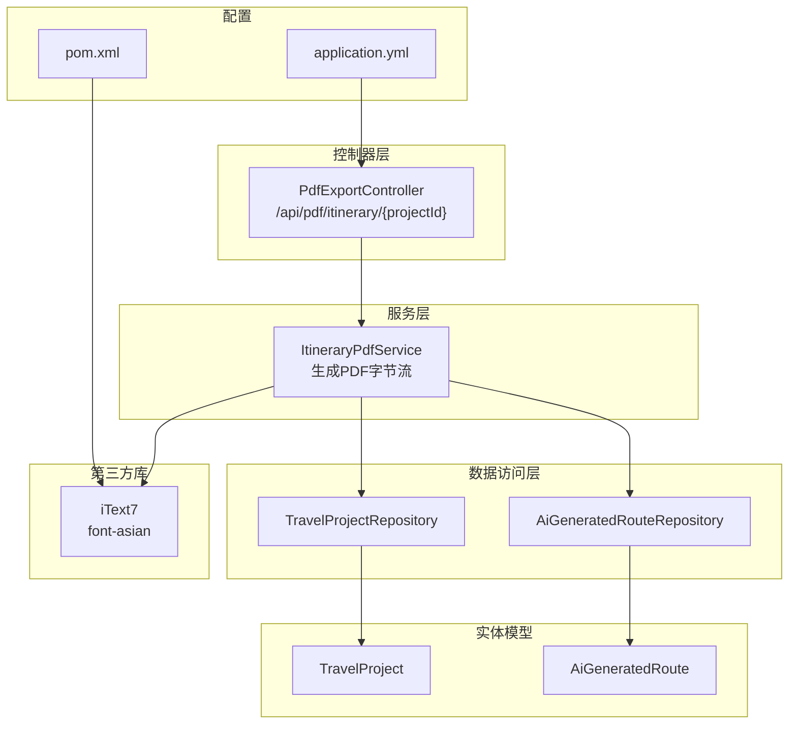
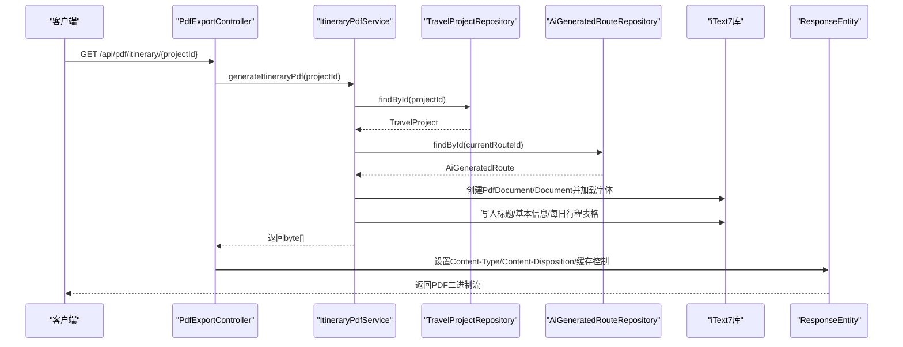
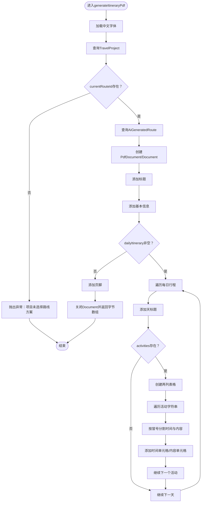
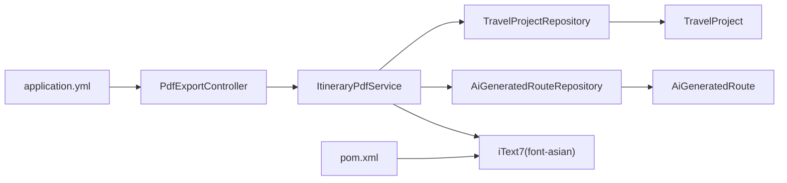

# PDF导出

<cite>
**本文引用的文件**
- [PdfExportController.java](file://tudianersha/src/main/java/com/tudianersha/controller/PdfExportController.java)
- [ItineraryPdfService.java](file://tudianersha/src/main/java/com/tudianersha/service/ItineraryPdfService.java)
- [AiGeneratedRoute.java](file://tudianersha/src/main/java/com/tudianersha/entity/AiGeneratedRoute.java)
- [TravelProject.java](file://tudianersha/src/main/java/com/tudianersha/entity/TravelProject.java)
- [pom.xml](file://tudianersha/pom.xml)
- [application.yml](file://tudianersha/src/main/resources/application.yml)
</cite>

## 目录
1. [简介](#简介)
2. [项目结构](#项目结构)
3. [核心组件](#核心组件)
4. [架构总览](#架构总览)
5. [组件详解](#组件详解)
6. [依赖关系分析](#依赖关系分析)
7. [性能考量](#性能考量)
8. [故障排查指南](#故障排查指南)
9. [结论](#结论)

## 简介
本文件围绕“行程PDF导出”功能进行技术实现解析，重点说明 PdfExportController 如何通过 ItineraryPdfService 利用 iText7 库将行程数据（包括活动安排、基本信息等）动态渲染为结构化 PDF 文档。内容覆盖：
- PDF 模板设计原则与中文字体嵌入（如 STSong-Light/UniGB-UCS2-H）以避免乱码
- 表格布局与样式定制（时间列与内容列两列布局）
- HTTP 接口设计与响应头设置
- 大文件导出的内存优化策略（基于内存输出流与及时关闭）
- 常见导出失败问题的排查与修复建议（字体缺失、数据空指针、文件流未关闭）

## 项目结构
与 PDF 导出直接相关的模块与文件如下：
- 控制器层：PdfExportController 提供 HTTP 接口
- 服务层：ItineraryPdfService 调用 iText7 渲染 PDF
- 数据模型：TravelProject、AiGeneratedRoute 存储项目与行程数据
- 构建配置：pom.xml 引入 iText7 及其亚洲字体支持
- 运行配置：application.yml 提供日志级别等运行参数

图表来源
- [PdfExportController.java](file://tudianersha/src/main/java/com/tudianersha/controller/PdfExportController.java#L1-L46)
- [ItineraryPdfService.java](file://tudianersha/src/main/java/com/tudianersha/service/ItineraryPdfService.java#L1-L167)
- [AiGeneratedRoute.java](file://tudianersha/src/main/java/com/tudianersha/entity/AiGeneratedRoute.java#L1-L193)
- [TravelProject.java](file://tudianersha/src/main/java/com/tudianersha/entity/TravelProject.java#L1-L163)
- [pom.xml](file://tudianersha/pom.xml#L139-L168)
- [application.yml](file://tudianersha/src/main/resources/application.yml#L43-L46)

章节来源
- [PdfExportController.java](file://tudianersha/src/main/java/com/tudianersha/controller/PdfExportController.java#L1-L46)
- [ItineraryPdfService.java](file://tudianersha/src/main/java/com/tudianersha/service/ItineraryPdfService.java#L1-L167)
- [AiGeneratedRoute.java](file://tudianersha/src/main/java/com/tudianersha/entity/AiGeneratedRoute.java#L1-L193)
- [TravelProject.java](file://tudianersha/src/main/java/com/tudianersha/entity/TravelProject.java#L1-L163)
- [pom.xml](file://tudianersha/pom.xml#L139-L168)
- [application.yml](file://tudianersha/src/main/resources/application.yml#L43-L46)

## 核心组件
- PdfExportController：提供 GET /api/pdf/itinerary/{projectId} 接口，负责接收导出请求、调用服务层并返回二进制 PDF 流；设置 Content-Type 为 application/pdf，并通过 Content-Disposition 设置下载文件名。
- ItineraryPdfService：核心 PDF 渲染逻辑，使用 iText7 创建 PdfDocument 和 Document，加载中文字体，解析 TravelProject 与 AiGeneratedRoute 的数据，按日生成标题与表格，最后关闭 Document 并返回字节数组。

章节来源
- [PdfExportController.java](file://tudianersha/src/main/java/com/tudianersha/controller/PdfExportController.java#L19-L46)
- [ItineraryPdfService.java](file://tudianersha/src/main/java/com/tudianersha/service/ItineraryPdfService.java#L43-L167)

## 架构总览
PDF 导出从 HTTP 请求到 PDF 输出的完整流程如下：

图表来源
- [PdfExportController.java](file://tudianersha/src/main/java/com/tudianersha/controller/PdfExportController.java#L24-L46)
- [ItineraryPdfService.java](file://tudianersha/src/main/java/com/tudianersha/service/ItineraryPdfService.java#L43-L167)

## 组件详解

### PdfExportController：HTTP 接口与响应
- 路径与方法：GET /api/pdf/itinerary/{projectId}
- 参数：路径变量 projectId（Long）
- 返回：ResponseEntity<byte[]>，包含 PDF 字节流、Content-Type: application/pdf、Content-Disposition: attachment、缓存控制头
- 错误处理：捕获异常并返回 500

章节来源
- [PdfExportController.java](file://tudianersha/src/main/java/com/tudianersha/controller/PdfExportController.java#L24-L46)

### ItineraryPdfService：PDF 渲染与模板设计
- 数据来源：
  - TravelProject：项目名称、目的地、开始/结束日期、当前路线ID
  - AiGeneratedRoute：每日行程 JSON（dailyItinerary），包含 day 与 activities 数组
- 字体与编码：
  - 使用 PdfFontFactory.createFont("STSong-Light", "UniGB-UCS2-H", EMBED_PREFER_EMBEDDED) 加载中文字体，确保中文不乱码
- 模板结构：
  - 标题：居中、加粗、较大字号、指定颜色
  - 基本信息：目的地与日期段落
  - 每日行程：
    - 天标题：第 N 天 + 日期
    - 表格：两列布局（时间列 20%，内容列 80%），时间列浅灰背景、居中对齐，内容列常规内边距
  - 页脚：生成日期与来源说明
- 内存与资源管理：
  - 使用 ByteArrayOutputStream 作为 PDF 输出目标，避免磁盘写入
  - 渲染完成后显式关闭 Document，确保资源释放

图表来源
- [ItineraryPdfService.java](file://tudianersha/src/main/java/com/tudianersha/service/ItineraryPdfService.java#L43-L167)

章节来源
- [ItineraryPdfService.java](file://tudianersha/src/main/java/com/tudianersha/service/ItineraryPdfService.java#L43-L167)

### 数据模型与字段映射
- TravelProject：包含项目名称、目的地、开始/结束日期、当前路线ID等
- AiGeneratedRoute：包含每日行程 JSON（dailyItinerary）、路线标题、预算等

章节来源
- [TravelProject.java](file://tudianersha/src/main/java/com/tudianersha/entity/TravelProject.java#L1-L163)
- [AiGeneratedRoute.java](file://tudianersha/src/main/java/com/tudianersha/entity/AiGeneratedRoute.java#L1-L193)

### 依赖与构建配置
- iText7 与亚洲字体支持：在 pom.xml 中引入 itext7-core、html2pdf 以及 font-asian，确保中文字体可用
- 日志级别：application.yml 中设置 com.tudianersha 包的日志级别为 debug，便于定位问题

章节来源
- [pom.xml](file://tudianersha/pom.xml#L139-L168)
- [application.yml](file://tudianersha/src/main/resources/application.yml#L43-L46)

## 依赖关系分析
- 控制器依赖服务：PdfExportController 注入 ItineraryPdfService
- 服务依赖仓库：ItineraryPdfService 注入 TravelProjectRepository 与 AiGeneratedRouteRepository
- 仓库依赖实体：两个 Repository 对应 TravelProject 与 AiGeneratedRoute 实体
- 第三方库：ItineraryPdfService 使用 iText7 进行 PDF 渲染
- 构建与运行：pom.xml 提供 iText7 依赖；application.yml 提供日志级别

图表来源
- [PdfExportController.java](file://tudianersha/src/main/java/com/tudianersha/controller/PdfExportController.java#L1-L46)
- [ItineraryPdfService.java](file://tudianersha/src/main/java/com/tudianersha/service/ItineraryPdfService.java#L1-L167)
- [AiGeneratedRoute.java](file://tudianersha/src/main/java/com/tudianersha/entity/AiGeneratedRoute.java#L1-L193)
- [TravelProject.java](file://tudianersha/src/main/java/com/tudianersha/entity/TravelProject.java#L1-L163)
- [pom.xml](file://tudianersha/pom.xml#L139-L168)
- [application.yml](file://tudianersha/src/main/resources/application.yml#L43-L46)

章节来源
- [PdfExportController.java](file://tudianersha/src/main/java/com/tudianersha/controller/PdfExportController.java#L1-L46)
- [ItineraryPdfService.java](file://tudianersha/src/main/java/com/tudianersha/service/ItineraryPdfService.java#L1-L167)
- [AiGeneratedRoute.java](file://tudianersha/src/main/java/com/tudianersha/entity/AiGeneratedRoute.java#L1-L193)
- [TravelProject.java](file://tudianersha/src/main/java/com/tudianersha/entity/TravelProject.java#L1-L163)
- [pom.xml](file://tudianersha/pom.xml#L139-L168)
- [application.yml](file://tudianersha/src/main/resources/application.yml#L43-L46)

## 性能考量
- 内存优先：使用 ByteArrayOutputStream 作为 PDF 输出目标，避免磁盘 IO，降低延迟与 IO 抖动
- 资源释放：渲染完成后显式关闭 Document，确保底层流与资源被及时回收
- 字体加载：通过 EmbeddingStrategy.PREFER_EMBEDDED 将字体嵌入，减少外部字体依赖带来的潜在开销与兼容性问题
- 数据解析：使用 Gson 将 dailyItinerary 解析为 JsonArray，逐条构造表格单元格，避免一次性加载过多数据到内存

章节来源
- [ItineraryPdfService.java](file://tudianersha/src/main/java/com/tudianersha/service/ItineraryPdfService.java#L57-L65)
- [ItineraryPdfService.java](file://tudianersha/src/main/java/com/tudianersha/service/ItineraryPdfService.java#L164-L166)

## 故障排查指南
- 字体缺失或乱码
  - 现象：中文显示为方块或乱码
  - 排查：确认已引入 font-asian 依赖；检查 createFont 的字体名称与编码是否正确；确保 EmbeddingStrategy 为 PREFER_EMBEDDED
  - 参考路径：[ItineraryPdfService.java](file://tudianersha/src/main/java/com/tudianersha/service/ItineraryPdfService.java#L63-L63)、[pom.xml](file://tudianersha/pom.xml#L163-L168)
- 数据空指针
  - 现象：项目不存在、路线不存在、dailyItinerary 为空导致异常
  - 排查：确认 TravelProject 的 currentRouteId 已设置；AiGeneratedRoute 的 dailyItinerary 为有效 JSON；项目日期格式与解析格式一致
  - 参考路径：[ItineraryPdfService.java](file://tudianersha/src/main/java/com/tudianersha/service/ItineraryPdfService.java#L45-L55)、[ItineraryPdfService.java](file://tudianersha/src/main/java/com/tudianersha/service/ItineraryPdfService.java#L88-L95)
- 文件流未关闭
  - 现象：长时间运行后内存占用上升或连接泄漏
  - 排查：确保 Document 在生成完成后被 close；ByteArrayOutputStream 不需要手动关闭，但需保证其生命周期在生成期间不受限
  - 参考路径：[ItineraryPdfService.java](file://tudianersha/src/main/java/com/tudianersha/service/ItineraryPdfService.java#L164-L166)
- HTTP 响应异常
  - 现象：浏览器无法下载或提示 500
  - 排查：确认 Content-Type 为 application/pdf；Content-Disposition 正确设置文件名；异常被捕获并返回 500
  - 参考路径：[PdfExportController.java](file://tudianersha/src/main/java/com/tudianersha/controller/PdfExportController.java#L31-L38)、[PdfExportController.java](file://tudianersha/src/main/java/com/tudianersha/controller/PdfExportController.java#L40-L45)
- 日志辅助定位
  - 建议将 com.tudianersha 包日志级别设为 debug，便于观察导出过程中的关键节点
  - 参考路径：[application.yml](file://tudianersha/src/main/resources/application.yml#L43-L46)

## 结论
该 PDF 导出功能通过清晰的分层设计与 iText7 的稳定能力，实现了对行程数据的结构化渲染。ItineraryPdfService 采用内存输出与显式资源释放策略，结合中文字体嵌入与表格样式定制，满足中文场景下的可读性与一致性需求。PdfExportController 提供简洁明确的 HTTP 接口，配合标准响应头，便于前端下载与集成。针对字体、数据与资源管理的关键点，本文提供了可操作的排查建议，有助于在生产环境中稳定运行。