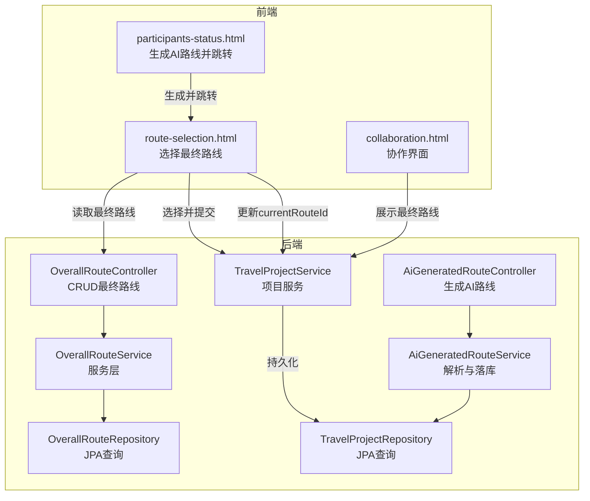
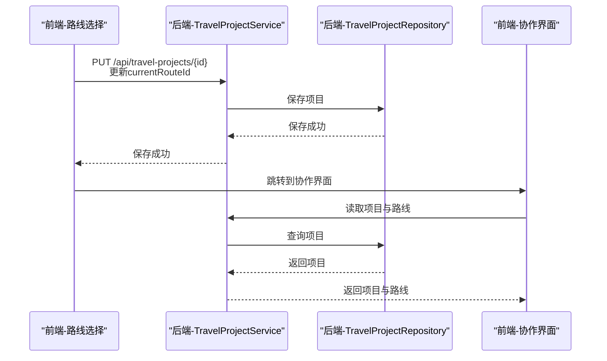
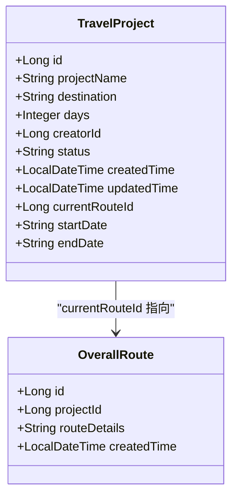
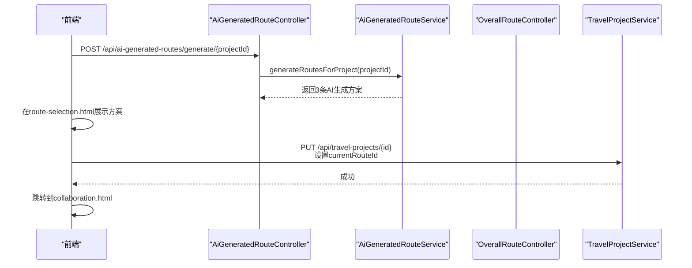
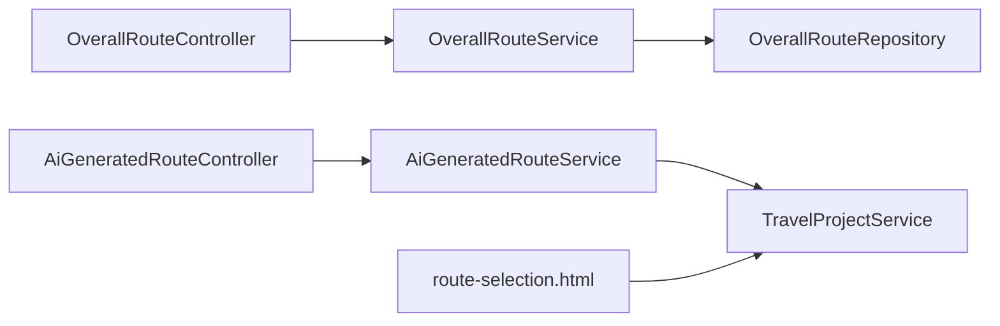

# 最终路线管理

<cite>
**本文引用的文件**
- [OverallRouteController.java](file://tudianersha/src/main/java/com/tudianersha/controller/OverallRouteController.java)
- [OverallRouteService.java](file://tudianersha/src/main/java/com/tudianersha/service/OverallRouteService.java)
- [OverallRouteRepository.java](file://tudianersha/src/main/java/com/tudianersha/repository/OverallRouteRepository.java)
- [OverallRoute.java](file://tudianersha/src/main/java/com/tudianersha/entity/OverallRoute.java)
- [TravelProject.java](file://tudianersha/src/main/java/com/tudianersha/entity/TravelProject.java)
- [AiGeneratedRouteController.java](file://tudianersha/src/main/java/com/tudianersha/controller/AiGeneratedRouteController.java)
- [AiGeneratedRouteService.java](file://tudianersha/src/main/java/com/tudianersha/service/AiGeneratedRouteService.java)
- [route-selection.html](file://tudianersha/src/main/resources/static/route-selection.html)
- [participants-status.html](file://tudianersha/src/main/resources/static/participants-status.html)
- [collaboration.html](file://tudianersha/src/main/resources/static/collaboration.html)
</cite>

## 目录
1. [简介](#简介)
2. [项目结构](#项目结构)
3. [核心组件](#核心组件)
4. [架构总览](#架构总览)
5. [详细组件分析](#详细组件分析)
6. [依赖关系分析](#依赖关系分析)
7. [性能考量](#性能考量)
8. [故障排查指南](#故障排查指南)
9. [结论](#结论)

## 简介
本文件围绕“最终路线选定模块”的架构设计与实现流程展开，重点说明：
- 用户如何在多条AI生成路线中选择最终方案；
- 选择后如何触发TravelProject的状态更新、路线数据持久化与协作界面流转；
- OverallRoute实体的设计要点（外键关联、路线元数据与版本控制字段的现状与建议）；
- OverallRouteRepository的查询优化策略；
- 路线切换、回滚与多用户并发选择的处理方案及异常场景应对策略。

## 项目结构
该模块涉及前后端协同：前端通过路由选择页展示AI生成的多个方案，用户点击“选择此方案”后，前端调用后端接口更新TravelProject的currentRouteId字段，从而完成最终路线的选定与流转。

图表来源
- [route-selection.html](file://tudianersha/src/main/resources/static/route-selection.html#L528-L568)
- [participants-status.html](file://tudianersha/src/main/resources/static/participants-status.html#L381-L414)
- [AiGeneratedRouteController.java](file://tudianersha/src/main/java/com/tudianersha/controller/AiGeneratedRouteController.java#L72-L112)
- [AiGeneratedRouteService.java](file://tudianersha/src/main/java/com/tudianersha/service/AiGeneratedRouteService.java#L70-L92)
- [OverallRouteController.java](file://tudianersha/src/main/java/com/tudianersha/controller/OverallRouteController.java#L13-L74)
- [OverallRouteService.java](file://tudianersha/src/main/java/com/tudianersha/service/OverallRouteService.java#L11-L36)
- [OverallRouteRepository.java](file://tudianersha/src/main/java/com/tudianersha/repository/OverallRouteRepository.java#L1-L12)
- [TravelProject.java](file://tudianersha/src/main/java/com/tudianersha/entity/TravelProject.java#L1-L163)

章节来源
- [route-selection.html](file://tudianersha/src/main/resources/static/route-selection.html#L528-L568)
- [participants-status.html](file://tudianersha/src/main/resources/static/participants-status.html#L381-L414)
- [AiGeneratedRouteController.java](file://tudianersha/src/main/java/com/tudianersha/controller/AiGeneratedRouteController.java#L72-L112)
- [AiGeneratedRouteService.java](file://tudianersha/src/main/java/com/tudianersha/service/AiGeneratedRouteService.java#L70-L92)
- [OverallRouteController.java](file://tudianersha/src/main/java/com/tudianersha/controller/OverallRouteController.java#L13-L74)
- [OverallRouteService.java](file://tudianersha/src/main/java/com/tudianersha/service/OverallRouteService.java#L11-L36)
- [OverallRouteRepository.java](file://tudianersha/src/main/java/com/tudianersha/repository/OverallRouteRepository.java#L1-L12)
- [TravelProject.java](file://tudianersha/src/main/java/com/tudianersha/entity/TravelProject.java#L1-L163)

## 核心组件
- OverallRouteController：提供最终路线的CRUD接口，支持按项目ID查询。
- OverallRouteService：封装对OverallRouteRepository的调用，提供业务方法。
- OverallRouteRepository：基于Spring Data JPA的接口，提供按项目ID查询的方法。
- OverallRoute实体：存储最终选定路线的元数据（项目ID、路线内容、创建时间等）。
- TravelProject实体：包含currentRouteId字段，用于指向最终选定的路线；同时包含项目状态、时间等字段。
- AiGeneratedRouteController/AiGeneratedRouteService：负责生成AI路线并落库，供用户在前端选择。
- 前端route-selection.html：用户选择最终路线并更新TravelProject.currentRouteId。

章节来源
- [OverallRouteController.java](file://tudianersha/src/main/java/com/tudianersha/controller/OverallRouteController.java#L13-L74)
- [OverallRouteService.java](file://tudianersha/src/main/java/com/tudianersha/service/OverallRouteService.java#L11-L36)
- [OverallRouteRepository.java](file://tudianersha/src/main/java/com/tudianersha/repository/OverallRouteRepository.java#L1-L12)
- [OverallRoute.java](file://tudianersha/src/main/java/com/tudianersha/entity/OverallRoute.java#L1-L74)
- [TravelProject.java](file://tudianersha/src/main/java/com/tudianersha/entity/TravelProject.java#L1-L163)
- [AiGeneratedRouteController.java](file://tudianersha/src/main/java/com/tudianersha/controller/AiGeneratedRouteController.java#L72-L112)
- [AiGeneratedRouteService.java](file://tudianersha/src/main/java/com/tudianersha/service/AiGeneratedRouteService.java#L70-L92)
- [route-selection.html](file://tudianersha/src/main/resources/static/route-selection.html#L528-L568)

## 架构总览
最终路线选定流程的关键路径如下：
- 生成阶段：前端在“参与者状态”页发起生成请求，后端调用AI服务生成3条方案并落库到AiGeneratedRoute。
- 选择阶段：前端在“路线选择”页展示方案，用户选择后更新TravelProject.currentRouteId。
- 协作阶段：前端跳转到“协作界面”，展示最终路线详情。

图表来源
- [route-selection.html](file://tudianersha/src/main/resources/static/route-selection.html#L528-L568)
- [participants-status.html](file://tudianersha/src/main/resources/static/participants-status.html#L381-L414)
- [collaboration.html](file://tudianersha/src/main/resources/static/collaboration.html#L584-L644)

## 详细组件分析

### OverallRouteController：接收用户选择并触发后续处理
- GET /api/overall-routes：列出所有最终路线。
- GET /api/overall-routes/{id}：按ID查询。
- POST /api/overall-routes：创建最终路线。
- PUT /api/overall-routes/{id}：更新最终路线。
- DELETE /api/overall-routes/{id}：删除最终路线。
- GET /api/overall-routes/project/{projectId}：按项目ID查询最终路线集合。

这些接口由OverallRouteService提供支撑，控制器仅负责参数绑定与HTTP响应。

章节来源
- [OverallRouteController.java](file://tudianersha/src/main/java/com/tudianersha/controller/OverallRouteController.java#L13-L74)
- [OverallRouteService.java](file://tudianersha/src/main/java/com/tudianersha/service/OverallRouteService.java#L11-L36)

### OverallRouteService：与TravelProject的关联机制
- 读写最终路线：findAll、findById、save、deleteById。
- 按项目ID查询：findByProjectId，用于前端在协作界面按项目维度加载最终路线。

注意：当前服务层未直接更新TravelProject的currentRouteId。最终路线选定通常由TravelProjectService负责持久化项目状态与currentRouteId。

章节来源
- [OverallRouteService.java](file://tudianersha/src/main/java/com/tudianersha/service/OverallRouteService.java#L11-L36)
- [OverallRouteRepository.java](file://tudianersha/src/main/java/com/tudianersha/repository/OverallRouteRepository.java#L1-L12)

### OverallRoute实体：结构设计与外键关联
- 主键：自增ID。
- 外键字段：project_id（非空），用于与TravelProject建立一对多关系。
- 路线元数据：route_details（TEXT类型），created_time（非空）。
- 未见版本控制字段（如乐观锁字段）。

建议：
- 若需要支持多版本路线与回滚，可在实体中增加版本号字段与时间戳字段。
- 对project_id建立数据库索引以提升按项目查询性能。

章节来源
- [OverallRoute.java](file://tudianersha/src/main/java/com/tudianersha/entity/OverallRoute.java#L1-L74)

### OverallRouteRepository：查询优化策略
- findByProjectId：按项目ID查询最终路线集合。
- 建议在数据库层面为project_id添加索引，以减少大表扫描成本。

章节来源
- [OverallRouteRepository.java](file://tudianersha/src/main/java/com/tudianersha/repository/OverallRouteRepository.java#L1-L12)

### TravelProject与最终路线的关联机制
- TravelProject包含currentRouteId字段，用于指向最终选定的路线。
- 前端在“路线选择”页提交后，调用TravelProjectService更新currentRouteId，随后跳转到协作界面。

图表来源
- [TravelProject.java](file://tudianersha/src/main/java/com/tudianersha/entity/TravelProject.java#L1-L163)
- [OverallRoute.java](file://tudianersha/src/main/java/com/tudianersha/entity/OverallRoute.java#L1-L74)

章节来源
- [TravelProject.java](file://tudianersha/src/main/java/com/tudianersha/entity/TravelProject.java#L1-L163)
- [route-selection.html](file://tudianersha/src/main/resources/static/route-selection.html#L528-L568)

### AI生成路线到最终路线的衔接
- AiGeneratedRouteController提供生成接口，AiGeneratedRouteService解析AI响应并落库。
- 用户在route-selection.html中选择某条方案后，前端更新TravelProject.currentRouteId，从而将“AI生成的候选方案”转化为“最终路线”。

图表来源
- [AiGeneratedRouteController.java](file://tudianersha/src/main/java/com/tudianersha/controller/AiGeneratedRouteController.java#L72-L112)
- [AiGeneratedRouteService.java](file://tudianersha/src/main/java/com/tudianersha/service/AiGeneratedRouteService.java#L70-L92)
- [route-selection.html](file://tudianersha/src/main/resources/static/route-selection.html#L528-L568)
- [collaboration.html](file://tudianersha/src/main/resources/static/collaboration.html#L584-L644)

## 依赖关系分析
- OverallRouteController依赖OverallRouteService。
- OverallRouteService依赖OverallRouteRepository。
- TravelProjectService依赖TravelProjectRepository（用于更新currentRouteId）。
- AiGeneratedRouteService依赖AiGeneratedRouteRepository与KimiAIService、TravelProjectService、RequirementParameterService、UserService、AmapPoiService。
- 前端route-selection.html依赖后端TravelProject接口更新currentRouteId。

图表来源
- [OverallRouteController.java](file://tudianersha/src/main/java/com/tudianersha/controller/OverallRouteController.java#L13-L74)
- [OverallRouteService.java](file://tudianersha/src/main/java/com/tudianersha/service/OverallRouteService.java#L11-L36)
- [OverallRouteRepository.java](file://tudianersha/src/main/java/com/tudianersha/repository/OverallRouteRepository.java#L1-L12)
- [AiGeneratedRouteController.java](file://tudianersha/src/main/java/com/tudianersha/controller/AiGeneratedRouteController.java#L72-L112)
- [AiGeneratedRouteService.java](file://tudianersha/src/main/java/com/tudianersha/service/AiGeneratedRouteService.java#L1-L120)
- [route-selection.html](file://tudianersha/src/main/resources/static/route-selection.html#L528-L568)

章节来源
- [OverallRouteController.java](file://tudianersha/src/main/java/com/tudianersha/controller/OverallRouteController.java#L13-L74)
- [OverallRouteService.java](file://tudianersha/src/main/java/com/tudianersha/service/OverallRouteService.java#L11-L36)
- [OverallRouteRepository.java](file://tudianersha/src/main/java/com/tudianersha/repository/OverallRouteRepository.java#L1-L12)
- [AiGeneratedRouteController.java](file://tudianersha/src/main/java/com/tudianersha/controller/AiGeneratedRouteController.java#L72-L112)
- [AiGeneratedRouteService.java](file://tudianersha/src/main/java/com/tudianersha/service/AiGeneratedRouteService.java#L1-L120)
- [route-selection.html](file://tudianersha/src/main/resources/static/route-selection.html#L528-L568)

## 性能考量
- 数据库索引：为OverallRoute.project_id建立索引，以加速按项目ID查询。
- 分页与缓存：若最终路线数量较大，建议在控制器层引入分页参数；对热点查询结果可考虑短期缓存。
- JSON解析与落库：AiGeneratedRouteService在解析AI响应时可能产生IO与字符串处理开销，建议对关键路径做超时与重试策略。
- 并发更新：TravelProject.currentRouteId的更新应采用幂等设计，避免重复选择导致的不一致。

[本节为通用性能建议，无需特定文件来源]

## 故障排查指南
- AI生成失败：前端收到失败响应时应提示用户重新生成或稍后重试。
- 选择后无法进入协作界面：检查TravelProjectService是否正确保存currentRouteId，以及前端跳转逻辑是否执行。
- 路线为空：协作界面在没有最终路线时会提示“暂未选择路线方案”，需引导用户回到路线选择页。
- 数据库查询慢：确认OverallRoute.project_id是否存在索引。

章节来源
- [AiGeneratedRouteController.java](file://tudianersha/src/main/java/com/tudianersha/controller/AiGeneratedRouteController.java#L72-L112)
- [route-selection.html](file://tudianersha/src/main/resources/static/route-selection.html#L528-L568)
- [collaboration.html](file://tudianersha/src/main/resources/static/collaboration.html#L584-L644)

## 结论
- 最终路线选定流程由前端“路线选择”页驱动，通过更新TravelProject.currentRouteId完成闭环。
- OverallRoute作为独立实体承载最终路线元数据，与TravelProject形成外键关联。
- OverallRouteRepository提供按项目ID查询能力，建议补充数据库索引以提升性能。
- 当前实现未包含版本控制与回滚机制，建议在实体层增加版本字段以支持多版本路线与回滚。
- 并发场景下，应确保选择操作的幂等性与一致性，必要时引入分布式锁或乐观锁策略。