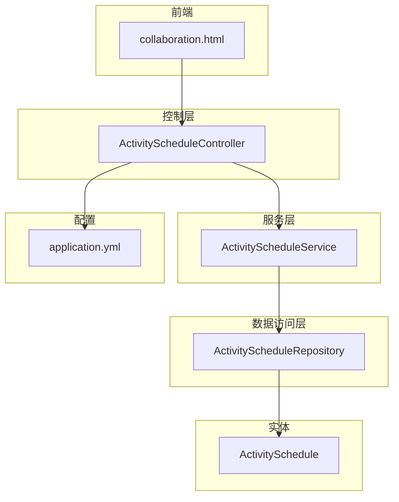
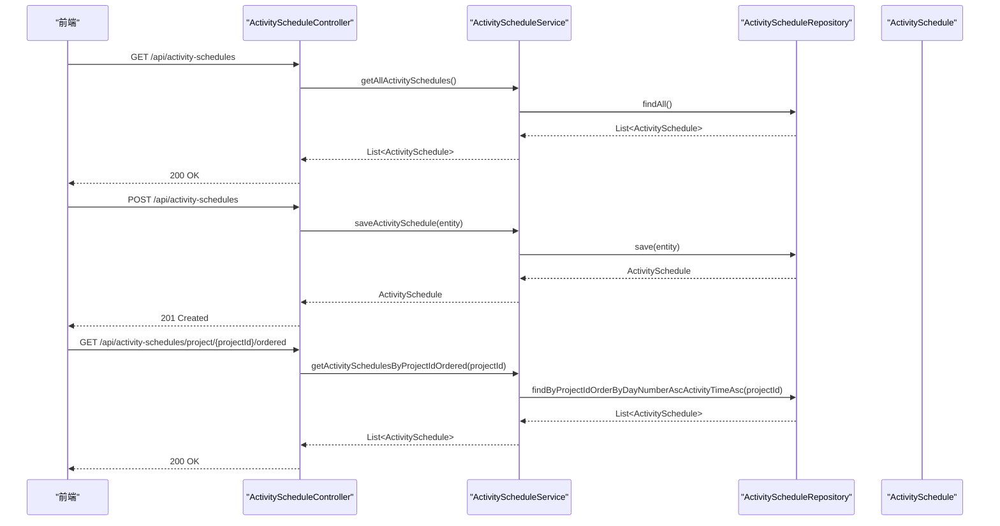
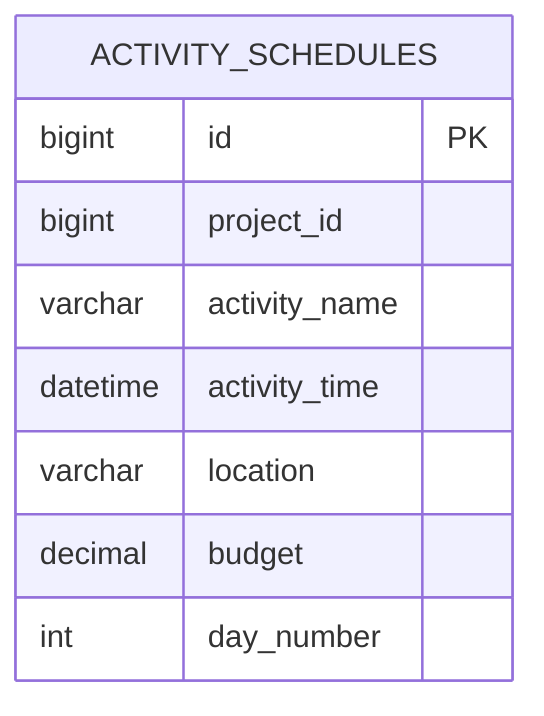
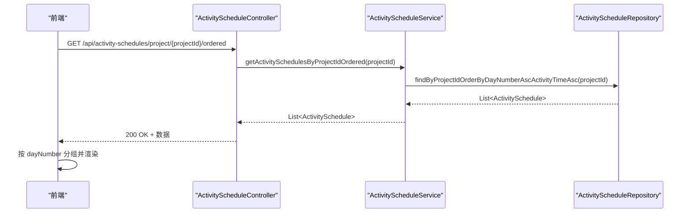
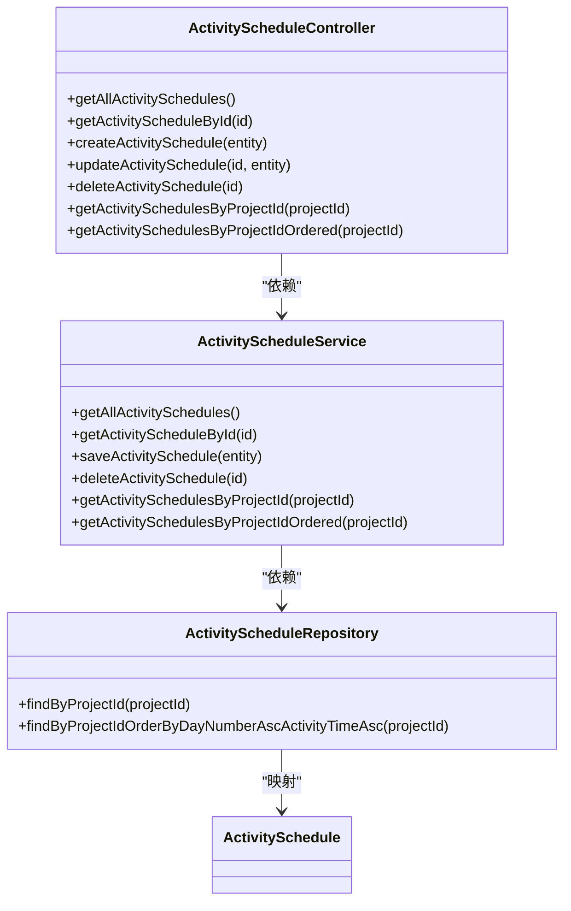

# 行程安排

<cite>
**本文引用的文件**
- [ActivityScheduleController.java](file://tudianersha/src/main/java/com/tudianersha/controller/ActivityScheduleController.java)
- [ActivityScheduleService.java](file://tudianersha/src/main/java/com/tudianersha/service/ActivityScheduleService.java)
- [ActivityScheduleRepository.java](file://tudianersha/src/main/java/com/tudianersha/repository/ActivityScheduleRepository.java)
- [ActivitySchedule.java](file://tudianersha/src/main/java/com/tudianersha/entity/ActivitySchedule.java)
- [application.yml](file://tudianersha/src/main/resources/application.yml)
- [collaboration.html](file://tudianersha/src/main/resources/static/collaboration.html)
</cite>

## 目录
1. [简介](#简介)
2. [项目结构](#项目结构)
3. [核心组件](#核心组件)
4. [架构总览](#架构总览)
5. [详细组件分析](#详细组件分析)
6. [依赖分析](#依赖分析)
7. [性能考虑](#性能考虑)
8. [故障排查指南](#故障排查指南)
9. [结论](#结论)
10. [附录](#附录)

## 简介
本文件围绕“活动安排”功能进行深入技术解析，聚焦以下目标：
- RESTful 接口设计：梳理 ActivityScheduleController 的创建、查询、更新、删除等端点及其行为。
- 核心业务逻辑：ActivityScheduleService 的职责边界与扩展点（含时间冲突检测的实现机制与优化建议）。
- 数据访问层：ActivityScheduleRepository 基于 Spring Data JPA 的方法命名查询与排序策略。
- 实体模型：ActivitySchedule 字段含义、时间戳处理与数据库映射关系。
- 前端调用示例与常见错误处理：并发修改冲突与无效时间格式的异常捕获与应对。

## 项目结构
该模块采用经典的三层架构（控制层、服务层、数据访问层），并以 Spring MVC + Spring Data JPA 技术栈实现。关键文件分布如下：
- 控制层：ActivityScheduleController 提供 RESTful 端点
- 服务层：ActivityScheduleService 封装业务规则与数据聚合
- 数据访问层：ActivityScheduleRepository 继承 JpaRepository，提供方法命名查询
- 实体层：ActivitySchedule 映射 activity_schedules 表
- 配置：application.yml 定义数据源与 JPA 方言
- 前端：collaboration.html 展示前端如何调用后端接口并渲染行程

图表来源
- [ActivityScheduleController.java](file://tudianersha/src/main/java/com/tudianersha/controller/ActivityScheduleController.java#L1-L83)
- [ActivityScheduleService.java](file://tudianersha/src/main/java/com/tudianersha/service/ActivityScheduleService.java#L1-L40)
- [ActivityScheduleRepository.java](file://tudianersha/src/main/java/com/tudianersha/repository/ActivityScheduleRepository.java#L1-L13)
- [ActivitySchedule.java](file://tudianersha/src/main/java/com/tudianersha/entity/ActivitySchedule.java#L1-L115)
- [application.yml](file://tudianersha/src/main/resources/application.yml#L1-L57)
- [collaboration.html](file://tudianersha/src/main/resources/static/collaboration.html#L1670-L1750)

章节来源
- [ActivityScheduleController.java](file://tudianersha/src/main/java/com/tudianersha/controller/ActivityScheduleController.java#L1-L83)
- [ActivityScheduleService.java](file://tudianersha/src/main/java/com/tudianersha/service/ActivityScheduleService.java#L1-L40)
- [ActivityScheduleRepository.java](file://tudianersha/src/main/java/com/tudianersha/repository/ActivityScheduleRepository.java#L1-L13)
- [ActivitySchedule.java](file://tudianersha/src/main/java/com/tudianersha/entity/ActivitySchedule.java#L1-L115)
- [application.yml](file://tudianersha/src/main/resources/application.yml#L1-L57)
- [collaboration.html](file://tudianersha/src/main/resources/static/collaboration.html#L1670-L1750)

## 核心组件
- 控制器层：提供统一的 RESTful 资源端点，支持按项目维度分页与排序查询。
- 服务层：封装持久化与查询逻辑，为控制器提供稳定的业务接口。
- 数据访问层：基于方法命名查询实现按项目 ID 查询与排序。
- 实体层：定义字段、主键、列映射与类型约束，支撑 JPA 映射与数据库存储。

章节来源
- [ActivityScheduleController.java](file://tudianersha/src/main/java/com/tudianersha/controller/ActivityScheduleController.java#L1-L83)
- [ActivityScheduleService.java](file://tudianersha/src/main/java/com/tudianersha/service/ActivityScheduleService.java#L1-L40)
- [ActivityScheduleRepository.java](file://tudianersha/src/main/java/com/tudianersha/repository/ActivityScheduleRepository.java#L1-L13)
- [ActivitySchedule.java](file://tudianersha/src/main/java/com/tudianersha/entity/ActivitySchedule.java#L1-L115)

## 架构总览
下图展示从控制器到服务再到数据访问与实体的完整调用链：

图表来源
- [ActivityScheduleController.java](file://tudianersha/src/main/java/com/tudianersha/controller/ActivityScheduleController.java#L1-L83)
- [ActivityScheduleService.java](file://tudianersha/src/main/java/com/tudianersha/service/ActivityScheduleService.java#L1-L40)
- [ActivityScheduleRepository.java](file://tudianersha/src/main/java/com/tudianersha/repository/ActivityScheduleRepository.java#L1-L13)

## 详细组件分析

### RESTful 接口设计（ActivityScheduleController）
- 资源路径：/api/activity-schedules
- 方法与端点：
  - GET /api/activity-schedules：获取全部行程
  - GET /api/activity-schedules/{id}：按 ID 获取单条行程
  - POST /api/activity-schedules：创建新行程
  - PUT /api/activity-schedules/{id}：按 ID 更新行程
  - DELETE /api/activity-schedules/{id}：按 ID 删除行程
  - GET /api/activity-schedules/project/{projectId}：按项目 ID 查询行程（无序）
  - GET /api/activity-schedules/project/{projectId}/ordered：按项目 ID 查询并按“天数升序+时间升序”排序

- 请求与响应：
  - 创建与更新：请求体为 ActivitySchedule 对象；返回 201/200；失败时返回 404（当资源不存在时）
  - 查询：返回 200，包含行程列表或单个对象
  - 删除：返回 204（无内容）

- 错误处理：
  - 当资源不存在时，返回 404；未显式声明全局异常处理器，控制器内通过 Optional 判断与状态码返回实现基本错误分支。

章节来源
- [ActivityScheduleController.java](file://tudianersha/src/main/java/com/tudianersha/controller/ActivityScheduleController.java#L1-L83)

### 核心业务逻辑（ActivityScheduleService）
- 职责：
  - 提供查询与持久化能力，委托给 Repository
  - 支持按项目 ID 查询与排序
- 关键方法：
  - getAllActivitySchedules：全量查询
  - getActivityScheduleById：按 ID 查询
  - saveActivitySchedule：保存或更新
  - deleteActivitySchedule：按 ID 删除
  - getActivitySchedulesByProjectId：按项目 ID 查询
  - getActivitySchedulesByProjectIdOrdered：按项目 ID 查询并排序（天数升序、时间升序）

- 时间冲突检测：
  - 当前实现未在 Service 层内置时间冲突检测算法。若需防止同一项目内行程重叠，可在 saveActivitySchedule 前增加冲突校验逻辑（见“性能考虑”与“故障排查指南”中的建议）。

章节来源
- [ActivityScheduleService.java](file://tudianersha/src/main/java/com/tudianersha/service/ActivityScheduleService.java#L1-L40)

### 数据访问层（ActivityScheduleRepository）
- 继承 JpaRepository<ActivitySchedule, Long>，天然具备 CRUD 能力
- 自定义方法命名查询：
  - findByProjectId：按项目 ID 查询
  - findByProjectIdOrderByDayNumberAscActivityTimeAsc：按项目 ID 查询并排序（天数升序、时间升序）
- 复杂度与性能：
  - findByProjectId：基于索引扫描，复杂度 O(log N + k)，k 为匹配结果数量
  - findByProjectIdOrderByDayNumberAscActivityTimeAsc：排序由数据库完成，复杂度 O(n log n)，其中 n 为匹配数量

章节来源
- [ActivityScheduleRepository.java](file://tudianersha/src/main/java/com/tudianersha/repository/ActivityScheduleRepository.java#L1-L13)

### 实体模型（ActivitySchedule）
- 表映射：@Table(name = "activity_schedules")
- 主键：@Id + @GeneratedValue(strategy = GenerationType.IDENTITY)
- 字段与约束：
  - projectId：非空，用于分组项目行程
  - activityName：非空，活动名称
  - activityTime：可空，活动时间（LocalDateTime）
  - location：可空，地点
  - budget：精度 10，标度 2，金额
  - dayNumber：可空，第几天
- 时间戳处理：
  - 未使用 @CreationTimestamp/@UpdateTimestamp 等注解，默认不自动维护创建/更新时间戳
- 数据库方言与 DDL：
  - application.yml 中设置 MySQL8Dialect，DDL 自动更新为 update

图表来源
- [ActivitySchedule.java](file://tudianersha/src/main/java/com/tudianersha/entity/ActivitySchedule.java#L1-L115)
- [application.yml](file://tudianersha/src/main/resources/application.yml#L1-L57)

章节来源
- [ActivitySchedule.java](file://tudianersha/src/main/java/com/tudianersha/entity/ActivitySchedule.java#L1-L115)
- [application.yml](file://tudianersha/src/main/resources/application.yml#L1-L57)

### 前端调用示例与集成点
- 前端页面 collaboration.html 展示了如何拉取项目下的行程并渲染预览：
  - 使用 GET /api/activity-schedules/project/{projectId}/ordered 获取已排序的行程列表
  - 基于 dayNumber 分组并按时间排序展示
- 前端交互流程（节选）：
  - 发起 GET 请求获取行程
  - 将返回的数组按 dayNumber 分组
  - 渲染每个分组内的活动项

图表来源
- [ActivityScheduleController.java](file://tudianersha/src/main/java/com/tudianersha/controller/ActivityScheduleController.java#L70-L83)
- [ActivityScheduleService.java](file://tudianersha/src/main/java/com/tudianersha/service/ActivityScheduleService.java#L32-L40)
- [ActivityScheduleRepository.java](file://tudianersha/src/main/java/com/tudianersha/repository/ActivityScheduleRepository.java#L9-L12)
- [collaboration.html](file://tudianersha/src/main/resources/static/collaboration.html#L185-L218)

章节来源
- [collaboration.html](file://tudianersha/src/main/resources/static/collaboration.html#L185-L218)

## 依赖分析
- 控制器依赖服务层，服务层依赖数据访问层，数据访问层依赖实体与数据库
- 控制器与服务层之间为松耦合，便于单元测试与替换实现
- Repository 的方法命名查询与排序策略清晰，避免手写 JPQL，降低维护成本

图表来源
- [ActivityScheduleController.java](file://tudianersha/src/main/java/com/tudianersha/controller/ActivityScheduleController.java#L1-L83)
- [ActivityScheduleService.java](file://tudianersha/src/main/java/com/tudianersha/service/ActivityScheduleService.java#L1-L40)
- [ActivityScheduleRepository.java](file://tudianersha/src/main/java/com/tudianersha/repository/ActivityScheduleRepository.java#L1-L13)
- [ActivitySchedule.java](file://tudianersha/src/main/java/com/tudianersha/entity/ActivitySchedule.java#L1-L115)

章节来源
- [ActivityScheduleController.java](file://tudianersha/src/main/java/com/tudianersha/controller/ActivityScheduleController.java#L1-L83)
- [ActivityScheduleService.java](file://tudianersha/src/main/java/com/tudianersha/service/ActivityScheduleService.java#L1-L40)
- [ActivityScheduleRepository.java](file://tudianersha/src/main/java/com/tudianersha/repository/ActivityScheduleRepository.java#L1-L13)
- [ActivitySchedule.java](file://tudianersha/src/main/java/com/tudianersha/entity/ActivitySchedule.java#L1-L115)

## 性能考虑
- 查询排序：
  - findByProjectIdOrderByDayNumberAscActivityTimeAsc 在数据库层面完成排序，适合中小规模数据；若数据量大，建议在数据库层建立复合索引（project_id, day_number, activity_time）以提升排序效率。
- 冲突检测算法（建议实现位置：Service.saveActivitySchedule 前）：
  - 输入：待保存的 ActivitySchedule（含 projectId、dayNumber、activityTime）
  - 步骤：
    1) 按项目与天数过滤候选集合
    2) 若存在相同 dayNumber 的活动，比较 activityTime 是否与现有活动时间区间重叠
    3) 若重叠，抛出业务异常（例如重复时间冲突）
  - 复杂度：过滤 O(n) + 排序/二分查找 O(n log n)，整体 O(n log n)
  - 优化：在数据库层建立唯一/唯一性约束（如联合唯一索引）以减少重复插入；在应用层缓存项目级活动列表，减少重复查询。
- 并发修改：
  - 建议引入乐观锁（版本号字段）或在更新时携带期望版本，避免覆盖他人修改。
- 时间格式：
  - 建议在控制器层增加参数校验（@Valid 或自定义校验器），对 activityTime 进行格式与范围校验，提前返回 400。

[本节为通用性能建议，不直接分析具体代码文件]

## 故障排查指南
- 404 未找到：
  - 场景：按 ID 查询或更新/删除不存在的资源
  - 处理：控制器已返回 404；前端应提示用户资源不存在
- 500 服务器错误：
  - 场景：数据库异常、连接超时、DDL 异常（当前配置为 update，可能因方言或驱动问题导致）
  - 处理：检查 application.yml 中的数据库连接与方言配置；查看日志级别为 debug 以定位异常堆栈
- 时间格式异常：
  - 场景：activityTime 传入格式不正确
  - 处理：在控制器层增加参数校验，返回 400；或在 Service 层捕获转换异常并包装为业务异常
- 并发修改冲突：
  - 场景：多客户端同时更新同一资源
  - 处理：引入乐观锁（版本号）或在 Service 层增加幂等校验；必要时在控制器层捕获并发异常并提示重试
- 行程重叠：
  - 场景：同一项目内同一天的时间段冲突
  - 处理：在 Service.saveActivitySchedule 前实现冲突检测算法（见“性能考虑”），返回 409/400 并提示冲突详情

章节来源
- [ActivityScheduleController.java](file://tudianersha/src/main/java/com/tudianersha/controller/ActivityScheduleController.java#L20-L83)
- [application.yml](file://tudianersha/src/main/resources/application.yml#L1-L57)

## 结论
- ActivityScheduleController 提供了完整的 CRUD 与按项目维度的查询接口，满足日常行程管理需求。
- ActivityScheduleService 作为业务门面，职责清晰；当前未内置时间冲突检测，建议在 Service 层补充冲突校验与并发控制策略。
- ActivityScheduleRepository 借助方法命名查询与排序，简洁高效；建议配合数据库索引优化排序性能。
- 实体层字段与数据库映射明确，未使用自动时间戳，便于灵活控制生命周期。
- 前端通过 GET /api/activity-schedules/project/{projectId}/ordered 获取已排序数据，渲染体验良好。

[本节为总结性内容，不直接分析具体代码文件]

## 附录

### RESTful 端点一览
- GET /api/activity-schedules：获取全部行程
- GET /api/activity-schedules/{id}：按 ID 获取单条行程
- POST /api/activity-schedules：创建新行程
- PUT /api/activity-schedules/{id}：按 ID 更新行程
- DELETE /api/activity-schedules/{id}：按 ID 删除行程
- GET /api/activity-schedules/project/{projectId}：按项目 ID 查询（无序）
- GET /api/activity-schedules/project/{projectId}/ordered：按项目 ID 查询并排序（天数升序、时间升序）

章节来源
- [ActivityScheduleController.java](file://tudianersha/src/main/java/com/tudianersha/controller/ActivityScheduleController.java#L1-L83)