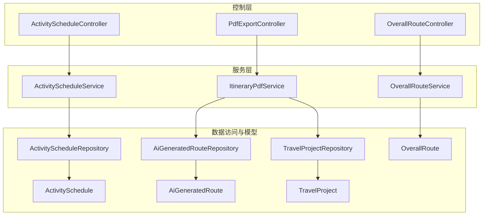
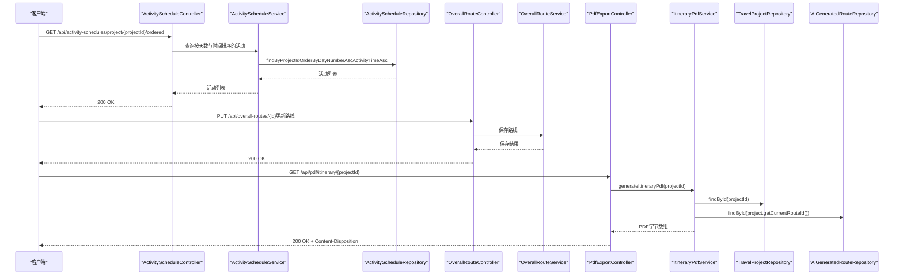
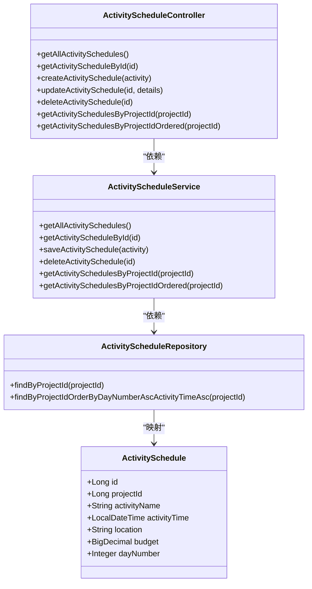
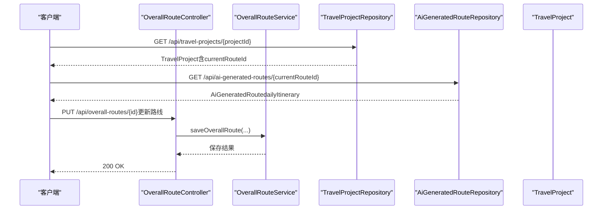
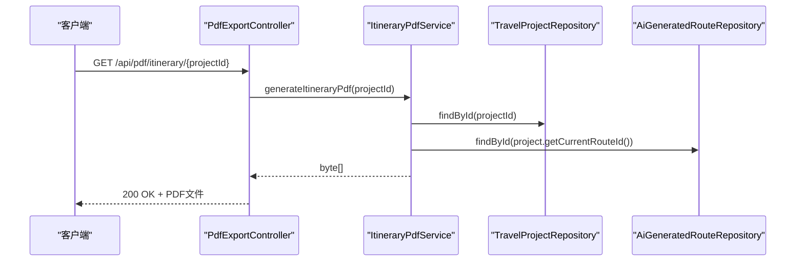
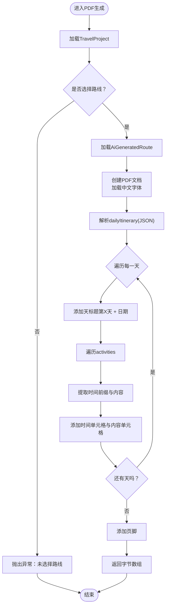
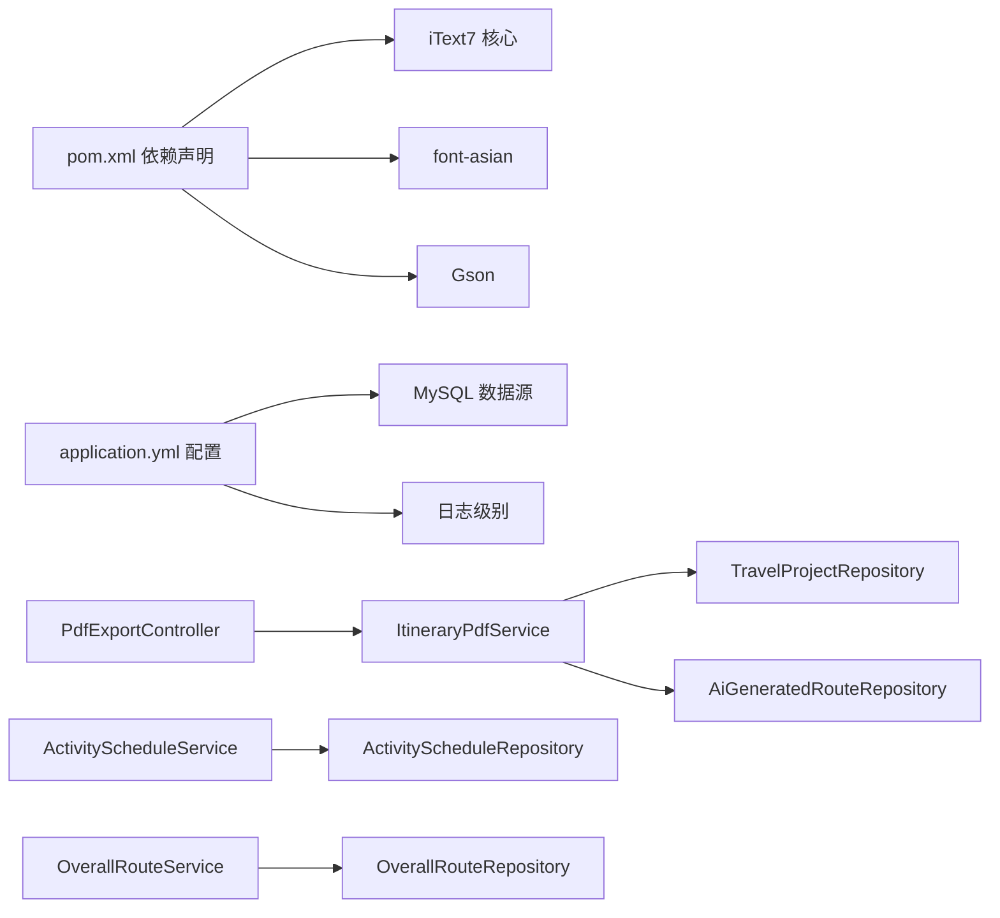

# 行程管理

<cite>
**本文引用的文件**
- [ActivityScheduleController.java](file://tudianersha/src/main/java/com/tudianersha/controller/ActivityScheduleController.java)
- [ActivityScheduleService.java](file://tudianersha/src/main/java/com/tudianersha/service/ActivityScheduleService.java)
- [ActivitySchedule.java](file://tudianersha/src/main/java/com/tudianersha/entity/ActivitySchedule.java)
- [ActivityScheduleRepository.java](file://tudianersha/src/main/java/com/tudianersha/repository/ActivityScheduleRepository.java)
- [OverallRouteController.java](file://tudianersha/src/main/java/com/tudianersha/controller/OverallRouteController.java)
- [OverallRouteService.java](file://tudianersha/src/main/java/com/tudianersha/service/OverallRouteService.java)
- [OverallRoute.java](file://tudianersha/src/main/java/com/tudianersha/entity/OverallRoute.java)
- [AiGeneratedRoute.java](file://tudianersha/src/main/java/com/tudianersha/entity/AiGeneratedRoute.java)
- [TravelProject.java](file://tudianersha/src/main/java/com/tudianersha/entity/TravelProject.java)
- [TravelProjectRepository.java](file://tudianersha/src/main/java/com/tudianersha/repository/TravelProjectRepository.java)
- [ItineraryPdfService.java](file://tudianersha/src/main/java/com/tudianersha/service/ItineraryPdfService.java)
- [PdfExportController.java](file://tudianersha/src/main/java/com/tudianersha/controller/PdfExportController.java)
- [pom.xml](file://tudianersha/pom.xml)
- [application.yml](file://tudianersha/src/main/resources/application.yml)
</cite>

## 目录
1. [简介](#简介)
2. [项目结构](#项目结构)
3. [核心组件](#核心组件)
4. [架构总览](#架构总览)
5. [详细组件分析](#详细组件分析)
6. [依赖关系分析](#依赖关系分析)
7. [性能考量](#性能考量)
8. [故障排查指南](#故障排查指南)
9. [结论](#结论)

## 简介
本文件面向“行程管理”模块，系统性解析以下三大功能：
- 活动安排：基于每日行程的增删改查与排序查询
- 最终路线选定：在多条AI推荐路线中选择并绑定至旅行项目
- PDF导出：将行程渲染为格式化PDF并通过接口提供下载

同时，文档深入说明：
- ActivityScheduleController与ActivityScheduleService如何协作完成活动管理
- OverallRouteController与OverallRouteService在路线选择中的处理流程
- ItineraryPdfService如何利用iText7将行程数据渲染为PDF，并通过PdfExportController提供下载
- PDF模板设计、中文字体支持与动态内容填充的技术细节
- 导出失败的常见原因与解决方案

## 项目结构
围绕“行程管理”，后端采用经典的三层架构：Controller（控制器）、Service（服务层）、Repository/Entity（数据访问与模型）。前端静态资源位于resources/static，包含路线选择与协作页面，用于展示与交互。

图表来源
- [ActivityScheduleController.java](file://tudianersha/src/main/java/com/tudianersha/controller/ActivityScheduleController.java#L1-L83)
- [ActivityScheduleService.java](file://tudianersha/src/main/java/com/tudianersha/service/ActivityScheduleService.java#L1-L40)
- [ActivityScheduleRepository.java](file://tudianersha/src/main/java/com/tudianersha/repository/ActivityScheduleRepository.java#L1-L13)
- [OverallRouteController.java](file://tudianersha/src/main/java/com/tudianersha/controller/OverallRouteController.java#L1-L74)
- [OverallRouteService.java](file://tudianersha/src/main/java/com/tudianersha/service/OverallRouteService.java#L1-L36)
- [ItineraryPdfService.java](file://tudianersha/src/main/java/com/tudianersha/service/ItineraryPdfService.java#L1-L168)
- [PdfExportController.java](file://tudianersha/src/main/java/com/tudianersha/controller/PdfExportController.java#L1-L47)
- [TravelProjectRepository.java](file://tudianersha/src/main/java/com/tudianersha/repository/TravelProjectRepository.java#L1-L13)
- [AiGeneratedRoute.java](file://tudianersha/src/main/java/com/tudianersha/entity/AiGeneratedRoute.java#L1-L193)
- [ActivitySchedule.java](file://tudianersha/src/main/java/com/tudianersha/entity/ActivitySchedule.java#L1-L115)
- [OverallRoute.java](file://tudianersha/src/main/java/com/tudianersha/entity/OverallRoute.java#L1-L74)
- [TravelProject.java](file://tudianersha/src/main/java/com/tudianersha/entity/TravelProject.java#L1-L163)

章节来源
- [ActivityScheduleController.java](file://tudianersha/src/main/java/com/tudianersha/controller/ActivityScheduleController.java#L1-L83)
- [OverallRouteController.java](file://tudianersha/src/main/java/com/tudianersha/controller/OverallRouteController.java#L1-L74)
- [PdfExportController.java](file://tudianersha/src/main/java/com/tudianersha/controller/PdfExportController.java#L1-L47)

## 核心组件
- 活动安排（ActivitySchedule）
  - 控制器：提供按项目查询、带排序的活动列表、增删改查等REST接口
  - 服务：封装JPA仓库方法，提供按项目ID查询与排序查询
  - 实体与仓库：定义活动字段、按项目ID与按天数+时间排序的查询方法
- 最终路线选定（OverallRoute/AiGeneratedRoute）
  - 控制器：提供路线的增删改查与按项目查询
  - 服务：封装仓库方法
  - 关联机制：TravelProject维护currentRouteId，指向AiGeneratedRoute的当前方案
- PDF导出（ItineraryPdfService/PdfExportController）
  - 服务：读取TravelProject与AiGeneratedRoute，解析每日行程JSON，使用iText7生成PDF
  - 控制器：提供下载接口，设置响应头并返回字节数组

章节来源
- [ActivityScheduleService.java](file://tudianersha/src/main/java/com/tudianersha/service/ActivityScheduleService.java#L1-L40)
- [ActivityScheduleRepository.java](file://tudianersha/src/main/java/com/tudianersha/repository/ActivityScheduleRepository.java#L1-L13)
- [ActivitySchedule.java](file://tudianersha/src/main/java/com/tudianersha/entity/ActivitySchedule.java#L1-L115)
- [OverallRouteService.java](file://tudianersha/src/main/java/com/tudianersha/service/OverallRouteService.java#L1-L36)
- [AiGeneratedRoute.java](file://tudianersha/src/main/java/com/tudianersha/entity/AiGeneratedRoute.java#L1-L193)
- [TravelProject.java](file://tudianersha/src/main/java/com/tudianersha/entity/TravelProject.java#L1-L163)
- [ItineraryPdfService.java](file://tudianersha/src/main/java/com/tudianersha/service/ItineraryPdfService.java#L1-L168)
- [PdfExportController.java](file://tudianersha/src/main/java/com/tudianersha/controller/PdfExportController.java#L1-L47)

## 架构总览
下图展示了“活动安排—最终路线—PDF导出”的端到端调用链路与数据流向。

图表来源
- [ActivityScheduleController.java](file://tudianersha/src/main/java/com/tudianersha/controller/ActivityScheduleController.java#L72-L82)
- [ActivityScheduleService.java](file://tudianersha/src/main/java/com/tudianersha/service/ActivityScheduleService.java#L33-L39)
- [ActivityScheduleRepository.java](file://tudianersha/src/main/java/com/tudianersha/repository/ActivityScheduleRepository.java#L11-L13)
- [OverallRouteController.java](file://tudianersha/src/main/java/com/tudianersha/controller/OverallRouteController.java#L42-L56)
- [OverallRouteService.java](file://tudianersha/src/main/java/com/tudianersha/service/OverallRouteService.java#L25-L27)
- [PdfExportController.java](file://tudianersha/src/main/java/com/tudianersha/controller/PdfExportController.java#L24-L46)
- [ItineraryPdfService.java](file://tudianersha/src/main/java/com/tudianersha/service/ItineraryPdfService.java#L43-L166)
- [TravelProjectRepository.java](file://tudianersha/src/main/java/com/tudianersha/repository/TravelProjectRepository.java#L1-L13)
- [AiGeneratedRoute.java](file://tudianersha/src/main/java/com/tudianersha/entity/AiGeneratedRoute.java#L1-L193)

## 详细组件分析

### 活动安排：ActivityScheduleController与ActivityScheduleService
- 控制器职责
  - 提供活动列表、按ID查询、新增、更新、删除
  - 新增/更新时直接透传请求体到服务层持久化
  - 提供按项目ID查询与“按天数升序、时间升序”的排序查询
- 服务层职责
  - 通过仓库执行数据库操作
  - 提供按项目ID与排序查询方法
- 数据模型
  - ActivitySchedule包含项目ID、活动名称、时间、地点、预算、天数等字段
- 时间冲突检测
  - 在现有代码中未发现显式的“时间冲突检测”逻辑；若需实现，可在服务层保存前进行同项目、同天的活动时间范围比对，或在DAO层增加自定义查询以避免重叠

图表来源
- [ActivityScheduleController.java](file://tudianersha/src/main/java/com/tudianersha/controller/ActivityScheduleController.java#L1-L83)
- [ActivityScheduleService.java](file://tudianersha/src/main/java/com/tudianersha/service/ActivityScheduleService.java#L1-L40)
- [ActivityScheduleRepository.java](file://tudianersha/src/main/java/com/tudianersha/repository/ActivityScheduleRepository.java#L1-L13)
- [ActivitySchedule.java](file://tudianersha/src/main/java/com/tudianersha/entity/ActivitySchedule.java#L1-L115)

章节来源
- [ActivityScheduleController.java](file://tudianersha/src/main/java/com/tudianersha/controller/ActivityScheduleController.java#L20-L82)
- [ActivityScheduleService.java](file://tudianersha/src/main/java/com/tudianersha/service/ActivityScheduleService.java#L17-L39)
- [ActivityScheduleRepository.java](file://tudianersha/src/main/java/com/tudianersha/repository/ActivityScheduleRepository.java#L9-L13)
- [ActivitySchedule.java](file://tudianersha/src/main/java/com/tudianersha/entity/ActivitySchedule.java#L15-L31)

### 最终路线选定：OverallRouteController与OverallRouteService
- 控制器职责
  - 提供路线的增删改查与按项目查询
- 服务层职责
  - 封装仓库方法，提供按项目ID查询
- 关联机制
  - TravelProject维护currentRouteId，指向AiGeneratedRoute的当前方案
  - 前端协作页面会依据该项目的currentRouteId加载对应路线的每日行程

图表来源
- [OverallRouteController.java](file://tudianersha/src/main/java/com/tudianersha/controller/OverallRouteController.java#L1-L74)
- [OverallRouteService.java](file://tudianersha/src/main/java/com/tudianersha/service/OverallRouteService.java#L1-L36)
- [TravelProject.java](file://tudianersha/src/main/java/com/tudianersha/entity/TravelProject.java#L122-L130)
- [AiGeneratedRoute.java](file://tudianersha/src/main/java/com/tudianersha/entity/AiGeneratedRoute.java#L47-L49)

章节来源
- [OverallRouteController.java](file://tudianersha/src/main/java/com/tudianersha/controller/OverallRouteController.java#L20-L74)
- [OverallRouteService.java](file://tudianersha/src/main/java/com/tudianersha/service/OverallRouteService.java#L17-L36)
- [TravelProject.java](file://tudianersha/src/main/java/com/tudianersha/entity/TravelProject.java#L122-L130)
- [AiGeneratedRoute.java](file://tudianersha/src/main/java/com/tudianersha/entity/AiGeneratedRoute.java#L47-L49)

### PDF导出：ItineraryPdfService与PdfExportController
- PDF生成流程
  - 读取TravelProject与AiGeneratedRoute，校验项目存在且已选择路线
  - 使用iText7创建PDF文档，加载中文字体
  - 解析AiGeneratedRoute.dailyItinerary（JSON数组），逐天渲染标题与活动表格
  - 添加页脚信息，返回字节数组
- 下载接口
  - 设置Content-Type为application/pdf，Content-Disposition为附件下载
  - 返回200 OK与字节数组；异常时返回500

图表来源
- [PdfExportController.java](file://tudianersha/src/main/java/com/tudianersha/controller/PdfExportController.java#L24-L46)
- [ItineraryPdfService.java](file://tudianersha/src/main/java/com/tudianersha/service/ItineraryPdfService.java#L43-L166)
- [TravelProjectRepository.java](file://tudianersha/src/main/java/com/tudianersha/repository/TravelProjectRepository.java#L1-L13)
- [AiGeneratedRoute.java](file://tudianersha/src/main/java/com/tudianersha/entity/AiGeneratedRoute.java#L47-L49)

章节来源
- [PdfExportController.java](file://tudianersha/src/main/java/com/tudianersha/controller/PdfExportController.java#L19-L46)
- [ItineraryPdfService.java](file://tudianersha/src/main/java/com/tudianersha/service/ItineraryPdfService.java#L43-L166)

### PDF模板设计、中文字体支持与动态内容填充
- 模板设计
  - 标题：居中、加粗、蓝色主题色
  - 基本信息：目的地与日期段落，居中
  - 每日行程：天标题（第X天 + 日期），下方表格两列（时间、内容）
  - 页脚：生成时间与平台标识
- 中文字体支持
  - 通过PdfFontFactory加载STSong-Light字体，支持UniGB-UCS2-H编码
  - 依赖已在pom.xml中声明iText7与font-asian
- 动态内容填充
  - 从AiGeneratedRoute.dailyItinerary解析JSON数组
  - 逐天计算日期（基于TravelProject.startDate）
  - 从每条活动字符串中提取时间前缀与内容，填充表格单元格

图表来源
- [ItineraryPdfService.java](file://tudianersha/src/main/java/com/tudianersha/service/ItineraryPdfService.java#L43-L166)
- [AiGeneratedRoute.java](file://tudianersha/src/main/java/com/tudianersha/entity/AiGeneratedRoute.java#L47-L49)
- [TravelProject.java](file://tudianersha/src/main/java/com/tudianersha/entity/TravelProject.java#L131-L145)

章节来源
- [ItineraryPdfService.java](file://tudianersha/src/main/java/com/tudianersha/service/ItineraryPdfService.java#L62-L166)
- [pom.xml](file://tudianersha/pom.xml#L151-L168)

## 依赖关系分析
- 技术栈
  - Spring Boot Web/JPA + MySQL
  - iText7用于PDF生成，font-asian提供中文字体支持
  - Gson用于JSON解析
- 外部集成
  - Kimi AI与高德地图API在其他模块使用，PDF导出不直接依赖
- 组件耦合
  - 控制器仅负责参数接收与响应封装，业务逻辑集中在服务层
  - 服务层通过仓库访问数据库，保持低耦合
  - PDF服务依赖项目与路线仓库，形成清晰的数据边界

图表来源
- [pom.xml](file://tudianersha/pom.xml#L151-L168)
- [application.yml](file://tudianersha/src/main/resources/application.yml#L1-L57)
- [PdfExportController.java](file://tudianersha/src/main/java/com/tudianersha/controller/PdfExportController.java#L1-L47)
- [ItineraryPdfService.java](file://tudianersha/src/main/java/com/tudianersha/service/ItineraryPdfService.java#L1-L168)
- [ActivityScheduleService.java](file://tudianersha/src/main/java/com/tudianersha/service/ActivityScheduleService.java#L1-L40)
- [OverallRouteService.java](file://tudianersha/src/main/java/com/tudianersha/service/OverallRouteService.java#L1-L36)

章节来源
- [pom.xml](file://tudianersha/pom.xml#L1-L180)
- [application.yml](file://tudianersha/src/main/resources/application.yml#L1-L57)

## 性能考量
- 查询优化
  - 活动按项目ID与“天数+时间”排序查询，建议在数据库层面建立复合索引以提升排序效率
- PDF生成
  - 大量文本与表格渲染时注意内存占用，可考虑分页或延迟加载策略
- 并发与事务
  - PDF导出与活动/路线更新应避免竞态条件；建议在导出前加锁或读取快照
- 字体与编码
  - 中文字体嵌入会增大PDF体积，可评估是否使用系统字体或外部字体资源

## 故障排查指南
- PDF导出失败
  - 项目不存在：检查projectId是否正确
  - 未选择路线：确保TravelProject.currentRouteId非空
  - 路线方案不存在：确认AiGeneratedRoute记录存在
  - dailyItinerary为空或格式错误：确认AI生成的JSON结构正确
  - 字体加载失败：确认font-asian依赖已引入，字体名称与编码匹配
- 控制器异常
  - PdfExportController捕获异常并返回500，查看日志定位具体异常
- 活动冲突检测缺失
  - 若出现时间重叠，可在服务层增加冲突检测逻辑并在保存前校验

章节来源
- [ItineraryPdfService.java](file://tudianersha/src/main/java/com/tudianersha/service/ItineraryPdfService.java#L43-L66)
- [PdfExportController.java](file://tudianersha/src/main/java/com/tudianersha/controller/PdfExportController.java#L24-L46)
- [TravelProject.java](file://tudianersha/src/main/java/com/tudianersha/entity/TravelProject.java#L122-L130)
- [AiGeneratedRoute.java](file://tudianersha/src/main/java/com/tudianersha/entity/AiGeneratedRoute.java#L47-L49)

## 结论
本模块以清晰的分层架构实现了“活动安排—路线选择—PDF导出”的完整闭环。活动管理通过REST接口与JPA查询实现高效增删改查；路线选择通过TravelProject.currentRouteId与AiGeneratedRoute.dailyItinerary实现灵活绑定与可视化展示；PDF导出利用iText7与中文字体实现高质量输出。未来可在活动时间冲突检测、索引优化与并发控制方面进一步增强稳定性与性能。