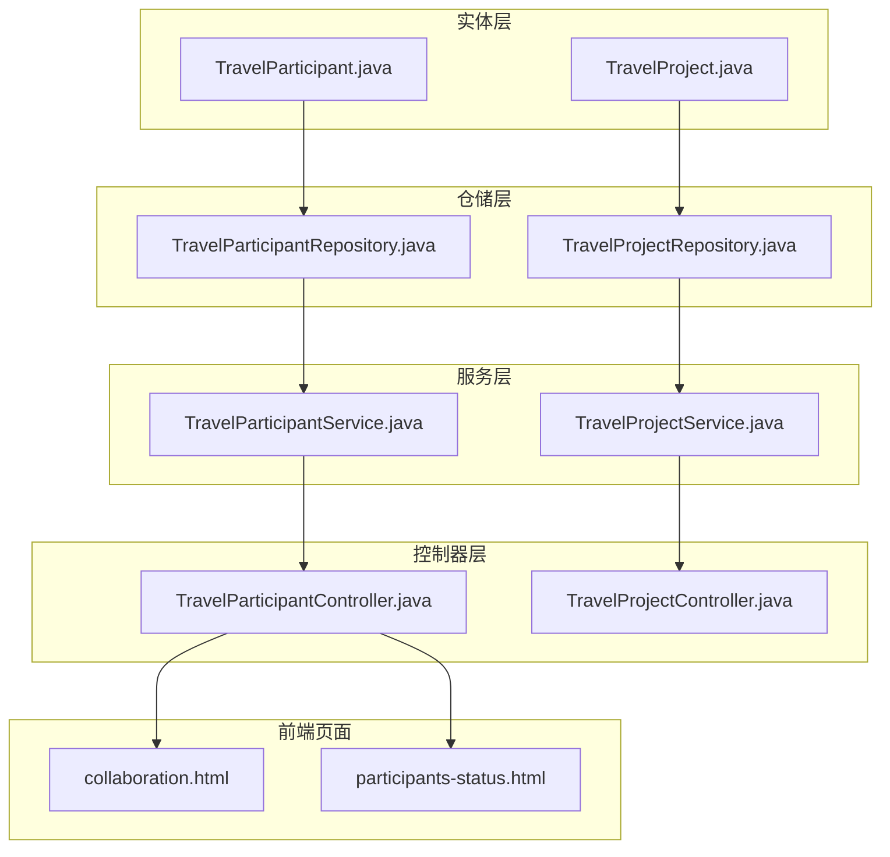
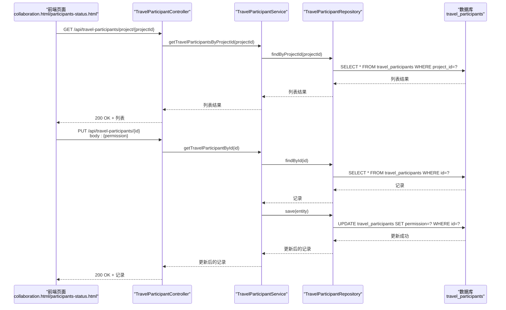
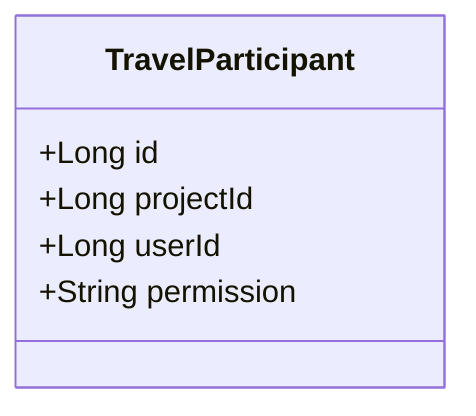
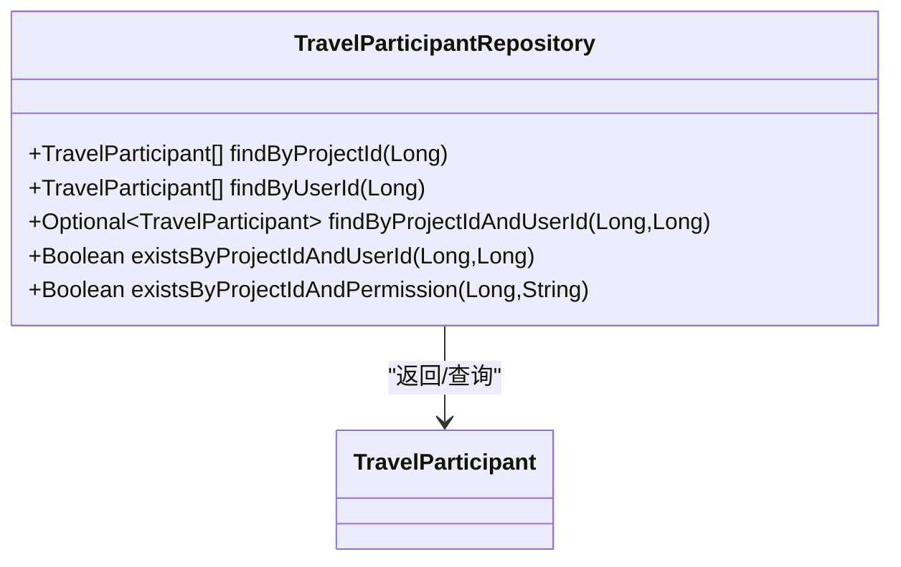
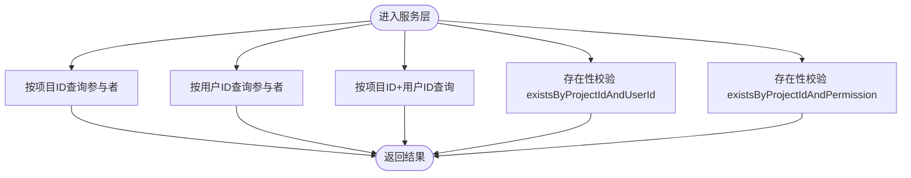
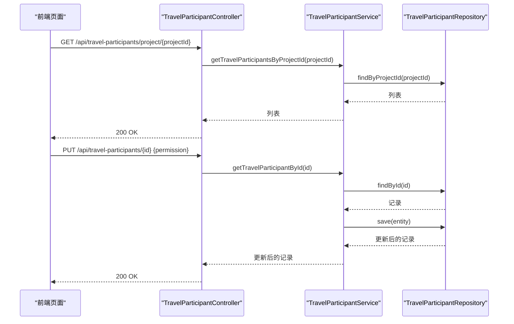
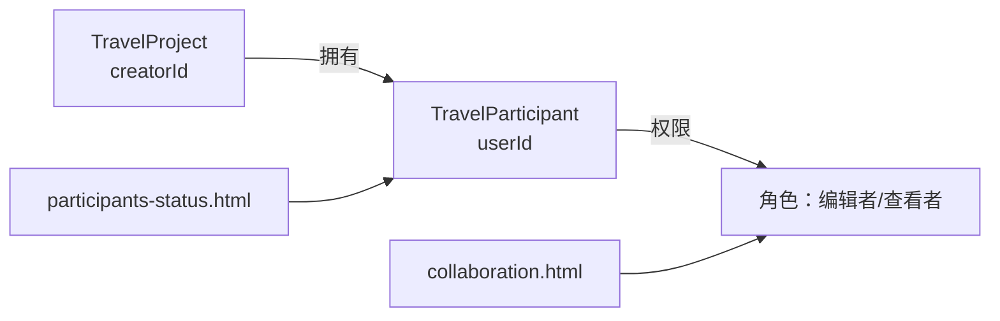
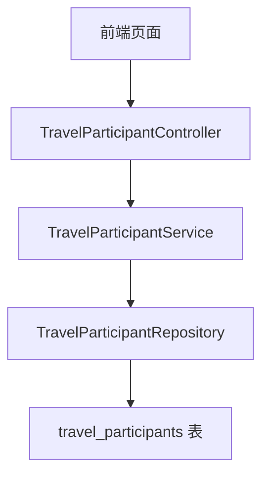

# 参与者管理

<cite>
**本文引用的文件**
- [TravelParticipant.java](file://tudianersha/src/main/java/com/tudianersha/entity/TravelParticipant.java)
- [TravelParticipantRepository.java](file://tudianersha/src/main/java/com/tudianersha/repository/TravelParticipantRepository.java)
- [TravelParticipantService.java](file://tudianersha/src/main/java/com/tudianersha/service/TravelParticipantService.java)
- [TravelParticipantController.java](file://tudianersha/src/main/java/com/tudianersha/controller/TravelParticipantController.java)
- [schema.sql](file://tudianersha/src/main/resources/schema.sql)
- [collaboration.html](file://tudianersha/src/main/resources/static/collaboration.html)
- [participants-status.html](file://tudianersha/src/main/resources/static/participants-status.html)
- [TravelProject.java](file://tudianersha/src/main/java/com/tudianersha/entity/TravelProject.java)
- [TravelProjectController.java](file://tudianersha/src/main/java/com/tudianersha/controller/TravelProjectController.java)
- [TravelProjectRepository.java](file://tudianersha/src/main/java/com/tudianersha/repository/TravelProjectRepository.java)
- [TravelProjectService.java](file://tudianersha/src/main/java/com/tudianersha/service/TravelProjectService.java)
</cite>

## 目录
1. [引言](#引言)
2. [项目结构](#项目结构)
3. [核心组件](#核心组件)
4. [架构总览](#架构总览)
5. [详细组件分析](#详细组件分析)
6. [依赖分析](#依赖分析)
7. [性能考虑](#性能考虑)
8. [故障排查指南](#故障排查指南)
9. [结论](#结论)
10. [附录](#附录)

## 引言
本文件围绕旅行项目“参与者管理”模块进行系统化设计与实现解析，重点覆盖以下方面：
- 实体层：TravelParticipant 的三个核心字段（项目ID、用户ID、权限）的业务语义与数据库约束关系
- 仓储层：基于项目ID与用户ID的多维查询方法及 existsBy 在权限校验中的应用
- 服务层：参与者添加、查询、权限更新与移除的业务流程，以及并发场景下的数据一致性保障策略
- 控制器层：REST API 设计与使用方式，包括按项目查询参与者、按用户查询参与项目等端点
- 权限控制与协作：如何通过权限机制支撑多人协同功能，并给出典型使用案例与安全最佳实践

## 项目结构
参与者管理模块位于 Spring Boot 工程 tudianersha 中，采用分层架构组织：
- 实体层：定义持久化模型与映射关系
- 仓储层：基于 Spring Data JPA 提供数据访问接口
- 服务层：封装业务逻辑与事务边界
- 控制器层：对外暴露 REST API
- 前端页面：协作与权限管理界面，用于展示与操作参与者状态

图示来源
- [TravelParticipant.java](file://tudianersha/src/main/java/com/tudianersha/entity/TravelParticipant.java#L1-L73)
- [TravelParticipantRepository.java](file://tudianersha/src/main/java/com/tudianersha/repository/TravelParticipantRepository.java#L1-L17)
- [TravelParticipantService.java](file://tudianersha/src/main/java/com/tudianersha/service/TravelParticipantService.java#L1-L52)
- [TravelParticipantController.java](file://tudianersha/src/main/java/com/tudianersha/controller/TravelParticipantController.java#L1-L80)
- [TravelProject.java](file://tudianersha/src/main/java/com/tudianersha/entity/TravelProject.java#L1-L163)
- [TravelProjectRepository.java](file://tudianersha/src/main/java/com/tudianersha/repository/TravelProjectRepository.java#L1-L13)
- [TravelProjectService.java](file://tudianersha/src/main/java/com/tudianersha/service/TravelProjectService.java#L1-L40)
- [TravelProjectController.java](file://tudianersha/src/main/java/com/tudianersha/controller/TravelProjectController.java#L1-L85)
- [collaboration.html](file://tudianersha/src/main/resources/static/collaboration.html#L258-L1176)
- [participants-status.html](file://tudianersha/src/main/resources/static/participants-status.html#L274-L350)

章节来源
- [TravelParticipant.java](file://tudianersha/src/main/java/com/tudianersha/entity/TravelParticipant.java#L1-L73)
- [TravelParticipantRepository.java](file://tudianersha/src/main/java/com/tudianersha/repository/TravelParticipantRepository.java#L1-L17)
- [TravelParticipantService.java](file://tudianersha/src/main/java/com/tudianersha/service/TravelParticipantService.java#L1-L52)
- [TravelParticipantController.java](file://tudianersha/src/main/java/com/tudianersha/controller/TravelParticipantController.java#L1-L80)
- [schema.sql](file://tudianersha/src/main/resources/schema.sql#L35-L41)
- [collaboration.html](file://tudianersha/src/main/resources/static/collaboration.html#L258-L1176)
- [participants-status.html](file://tudianersha/src/main/resources/static/participants-status.html#L274-L350)

## 核心组件
- 实体类 TravelParticipant
  - 字段：项目ID、用户ID、权限
  - 约束：非空；权限为字符串枚举值（创建者/编辑者/查看者）
- 仓储接口 TravelParticipantRepository
  - 查询：按项目ID、按用户ID、按项目ID+用户ID、按项目ID+权限是否存在
  - existsBy 在权限校验中用于快速判断是否存在特定角色或成员
- 服务类 TravelParticipantService
  - 提供参与者 CRUD 与多维查询；封装 existsBy 以支持权限校验
- 控制器 TravelParticipantController
  - 对外暴露 REST API：列出、按ID查询、新增、更新、删除、按项目查询、按用户查询

章节来源
- [TravelParticipant.java](file://tudianersha/src/main/java/com/tudianersha/entity/TravelParticipant.java#L1-L73)
- [TravelParticipantRepository.java](file://tudianersha/src/main/java/com/tudianersha/repository/TravelParticipantRepository.java#L1-L17)
- [TravelParticipantService.java](file://tudianersha/src/main/java/com/tudianersha/service/TravelParticipantService.java#L1-L52)
- [TravelParticipantController.java](file://tudianersha/src/main/java/com/tudianersha/controller/TravelParticipantController.java#L1-L80)

## 架构总览
参与者管理遵循经典的分层架构，控制器负责请求接入与响应封装，服务层承载业务规则，仓储层负责数据存取，实体层映射数据库表。

图示来源
- [TravelParticipantController.java](file://tudianersha/src/main/java/com/tudianersha/controller/TravelParticipantController.java#L69-L79)
- [TravelParticipantController.java](file://tudianersha/src/main/java/com/tudianersha/controller/TravelParticipantController.java#L42-L56)
- [TravelParticipantService.java](file://tudianersha/src/main/java/com/tudianersha/service/TravelParticipantService.java#L33-L51)
- [TravelParticipantRepository.java](file://tudianersha/src/main/java/com/tudianersha/repository/TravelParticipantRepository.java#L12-L17)
- [schema.sql](file://tudianersha/src/main/resources/schema.sql#L35-L41)

## 详细组件分析

### 实体类：TravelParticipant
- 字段与约束
  - 项目ID：非空，关联 travel_participants.project_id
  - 用户ID：非空，关联 travel_participants.user_id
  - 权限：非空，字符串类型，取值范围包含“创建者/编辑者/查看者”
- 业务含义
  - 项目ID：标识该记录属于哪个旅行项目
  - 用户ID：标识该记录属于哪个用户
  - 权限：决定用户对项目的操作能力（编辑/查看）
- 数据库映射
  - 表名：travel_participants
  - 主键：自增 id
  - 约束：三列均非空

图示来源
- [TravelParticipant.java](file://tudianersha/src/main/java/com/tudianersha/entity/TravelParticipant.java#L1-L73)
- [schema.sql](file://tudianersha/src/main/resources/schema.sql#L35-L41)

章节来源
- [TravelParticipant.java](file://tudianersha/src/main/java/com/tudianersha/entity/TravelParticipant.java#L1-L73)
- [schema.sql](file://tudianersha/src/main/resources/schema.sql#L35-L41)

### 仓储层：TravelParticipantRepository
- 方法族
  - findByProjectId：按项目ID查询所有参与者
  - findByUserId：按用户ID查询其参与的所有项目
  - findByProjectIdAndUserId：按项目ID+用户ID精确匹配
  - existsByProjectIdAndUserId：存在性检查（用于权限校验）
  - existsByProjectIdAndPermission：存在性检查（用于角色存在性校验）
- 应用场景
  - existsBy 在控制器或服务层用于快速判定是否具备某角色或是否为项目成员，避免不必要的后续操作

图示来源
- [TravelParticipantRepository.java](file://tudianersha/src/main/java/com/tudianersha/repository/TravelParticipantRepository.java#L1-L17)

章节来源
- [TravelParticipantRepository.java](file://tudianersha/src/main/java/com/tudianersha/repository/TravelParticipantRepository.java#L1-L17)

### 服务层：TravelParticipantService
- 能力概览
  - CRUD：findAll、findById、save、delete
  - 多维查询：按项目ID、按用户ID、按项目ID+用户ID
  - 存在性校验：existsByProjectIdAndUserId、existsByProjectIdAndPermission
- 并发与一致性
  - 采用 Spring Data JPA 的 save 操作，由 ORM 层保证基本的数据一致性
  - 若需强一致的并发控制（如“先检查再写入”的原子性），可在服务层引入事务注解与锁策略（见“性能考虑”与“故障排查指南”）

图示来源
- [TravelParticipantService.java](file://tudianersha/src/main/java/com/tudianersha/service/TravelParticipantService.java#L1-L52)
- [TravelParticipantRepository.java](file://tudianersha/src/main/java/com/tudianersha/repository/TravelParticipantRepository.java#L12-L17)

章节来源
- [TravelParticipantService.java](file://tudianersha/src/main/java/com/tudianersha/service/TravelParticipantService.java#L1-L52)

### 控制器层：TravelParticipantController
- REST API 设计
  - GET /api/travel-participants：列出所有参与者
  - GET /api/travel-participants/{id}：按ID查询
  - POST /api/travel-participants：新增参与者
  - PUT /api/travel-participants/{id}：更新参与者（可更新项目ID、用户ID、权限）
  - DELETE /api/travel-participants/{id}：删除参与者
  - GET /api/travel-participants/project/{projectId}：按项目查询参与者
  - GET /api/travel-participants/user/{userId}：按用户查询参与项目
- 使用方式
  - 前端协作页面通过上述端点拉取参与者列表、更新权限、移除成员
  - 页面中“权限管理弹窗”支持批量更新参与者权限（编辑者/查看者）

图示来源
- [TravelParticipantController.java](file://tudianersha/src/main/java/com/tudianersha/controller/TravelParticipantController.java#L69-L79)
- [TravelParticipantController.java](file://tudianersha/src/main/java/com/tudianersha/controller/TravelParticipantController.java#L42-L56)
- [TravelParticipantService.java](file://tudianersha/src/main/java/com/tudianersha/service/TravelParticipantService.java#L33-L51)
- [TravelParticipantRepository.java](file://tudianersha/src/main/java/com/tudianersha/repository/TravelParticipantRepository.java#L12-L17)

章节来源
- [TravelParticipantController.java](file://tudianersha/src/main/java/com/tudianersha/controller/TravelParticipantController.java#L1-L80)
- [collaboration.html](file://tudianersha/src/main/resources/static/collaboration.html#L258-L1176)
- [participants-status.html](file://tudianersha/src/main/resources/static/participants-status.html#L274-L350)

### 权限控制与协作场景
- 权限模型
  - 编辑者：可查看与编辑项目内容
  - 查看者：仅可查看，不可编辑
- 前端协作页面
  - “权限管理弹窗”展示参与者列表，允许将参与者角色从“编辑者”切换为“查看者”，反之亦然
  - “参与者状态”页面统计未提交需求与已提交需求的参与者数量，并渲染列表
- 与项目拥有者的关系
  - 旅行项目实体包含创建者字段，前端页面在渲染时会过滤掉创建者，仅展示普通参与者
  - 项目控制器提供按创建者查询项目的能力，便于构建“我创建的旅途”等视图

图示来源
- [TravelProject.java](file://tudianersha/src/main/java/com/tudianersha/entity/TravelProject.java#L1-L163)
- [TravelProjectController.java](file://tudianersha/src/main/java/com/tudianersha/controller/TravelProjectController.java#L74-L85)
- [collaboration.html](file://tudianersha/src/main/resources/static/collaboration.html#L258-L1176)
- [participants-status.html](file://tudianersha/src/main/resources/static/participants-status.html#L274-L350)

章节来源
- [TravelProject.java](file://tudianersha/src/main/java/com/tudianersha/entity/TravelProject.java#L1-L163)
- [TravelProjectController.java](file://tudianersha/src/main/java/com/tudianersha/controller/TravelProjectController.java#L74-L85)
- [collaboration.html](file://tudianersha/src/main/resources/static/collaboration.html#L258-L1176)
- [participants-status.html](file://tudianersha/src/main/resources/static/participants-status.html#L274-L350)

## 依赖分析
- 组件耦合
  - 控制器依赖服务层；服务层依赖仓储层；实体层被仓储层使用
  - 仓储层与数据库表 travel_participants 直接对应
- 外部依赖
  - Spring Data JPA 提供基于方法名的查询能力
  - 前端静态页面通过 AJAX 调用后端 API

图示来源
- [TravelParticipantController.java](file://tudianersha/src/main/java/com/tudianersha/controller/TravelParticipantController.java#L1-L80)
- [TravelParticipantService.java](file://tudianersha/src/main/java/com/tudianersha/service/TravelParticipantService.java#L1-L52)
- [TravelParticipantRepository.java](file://tudianersha/src/main/java/com/tudianersha/repository/TravelParticipantRepository.java#L1-L17)
- [schema.sql](file://tudianersha/src/main/resources/schema.sql#L35-L41)

章节来源
- [TravelParticipantController.java](file://tudianersha/src/main/java/com/tudianersha/controller/TravelParticipantController.java#L1-L80)
- [TravelParticipantService.java](file://tudianersha/src/main/java/com/tudianersha/service/TravelParticipantService.java#L1-L52)
- [TravelParticipantRepository.java](file://tudianersha/src/main/java/com/tudianersha/repository/TravelParticipantRepository.java#L1-L17)
- [schema.sql](file://tudianersha/src/main/resources/schema.sql#L35-L41)

## 性能考虑
- 查询优化
  - 使用 existsBy 进行存在性检查，避免不必要的全量查询
  - 对高频查询（按项目ID、按用户ID）可考虑在数据库层面建立索引（建议在 travel_participants 上增加复合索引）
- 并发与一致性
  - 若需要“先检查再写入”的原子性（例如“只有当某用户不是编辑者时才提升为编辑者”），可在服务层引入事务注解与数据库锁（如悲观锁或乐观锁），并在控制器层捕获并发冲突异常
- 前端交互
  - 权限批量更新时，建议采用幂等更新策略，避免重复提交导致的多次权限变更

[本节为通用指导，不直接分析具体文件]

## 故障排查指南
- 常见问题
  - 更新权限后前端未生效：确认控制器 PUT 接口是否正确调用并返回 200 OK
  - 无法查询到某用户的参与项目：检查按用户ID查询接口与数据库记录是否匹配
  - 权限校验失败：确认 existsBy 的调用顺序与参数是否正确
- 定位手段
  - 查看控制器返回状态码与响应体
  - 在服务层打印关键参数（项目ID、用户ID、权限）以核对逻辑
  - 检查数据库中 travel_participants 是否存在对应记录

章节来源
- [TravelParticipantController.java](file://tudianersha/src/main/java/com/tudianersha/controller/TravelParticipantController.java#L1-L80)
- [TravelParticipantService.java](file://tudianersha/src/main/java/com/tudianersha/service/TravelParticipantService.java#L1-L52)
- [TravelParticipantRepository.java](file://tudianersha/src/main/java/com/tudianersha/repository/TravelParticipantRepository.java#L1-L17)

## 结论
参与者管理模块以清晰的分层设计实现了旅行项目中的多人协作能力。通过实体层的明确字段与约束、仓储层的多维查询与存在性检查、服务层的业务封装与事务边界、控制器层的 REST API 暴露，以及前端页面的权限管理与状态展示，形成了完整的参与者生命周期管理闭环。在并发场景下，建议结合事务与锁策略进一步强化一致性保障；在性能方面，可通过索引与 existsBy 查询优化提升响应速度。

[本节为总结性内容，不直接分析具体文件]

## 附录

### API 规范（摘要）
- GET /api/travel-participants
  - 功能：列出所有参与者
  - 返回：200 OK + 列表
- GET /api/travel-participants/{id}
  - 功能：按ID查询参与者
  - 返回：200 OK 或 404 Not Found
- POST /api/travel-participants
  - 功能：新增参与者
  - 请求体：TravelParticipant
  - 返回：201 Created + 新记录
- PUT /api/travel-participants/{id}
  - 功能：更新参与者（可更新项目ID、用户ID、权限）
  - 请求体：部分字段
  - 返回：200 OK 或 404 Not Found
- DELETE /api/travel-participants/{id}
  - 功能：删除参与者
  - 返回：204 No Content 或 404 Not Found
- GET /api/travel-participants/project/{projectId}
  - 功能：按项目查询参与者
  - 返回：200 OK + 列表
- GET /api/travel-participants/user/{userId}
  - 功能：按用户查询参与项目
  - 返回：200 OK + 列表

章节来源
- [TravelParticipantController.java](file://tudianersha/src/main/java/com/tudianersha/controller/TravelParticipantController.java#L1-L80)

### 典型使用案例
- 场景一：项目创建者邀请成员并设置权限
  - 步骤：创建参与者记录（默认为查看者），随后通过权限管理弹窗将其提升为编辑者
  - 关键接口：POST /api/travel-participants、PUT /api/travel-participants/{id}
- 场景二：项目成员退出协作
  - 步骤：调用 DELETE /api/travel-participants/{id} 移除成员
- 场景三：查看某项目的所有成员
  - 步骤：GET /api/travel-participants/project/{projectId}
- 场景四：查看某用户参与的所有项目
  - 步骤：GET /api/travel-participants/user/{userId}

章节来源
- [collaboration.html](file://tudianersha/src/main/resources/static/collaboration.html#L258-L1176)
- [participants-status.html](file://tudianersha/src/main/resources/static/participants-status.html#L274-L350)
- [TravelParticipantController.java](file://tudianersha/src/main/java/com/tudianersha/controller/TravelParticipantController.java#L69-L79)

### 安全最佳实践
- 输入校验：在控制器层对请求体进行参数校验（如项目ID、用户ID、权限值）
- 权限校验：在服务层使用 existsBy 进行存在性与角色校验，避免越权操作
- 幂等更新：对权限更新接口采用幂等策略，防止重复提交造成状态抖动
- 事务边界：对“先检查后写入”的关键路径使用事务，确保原子性与一致性

[本节为通用指导，不直接分析具体文件]