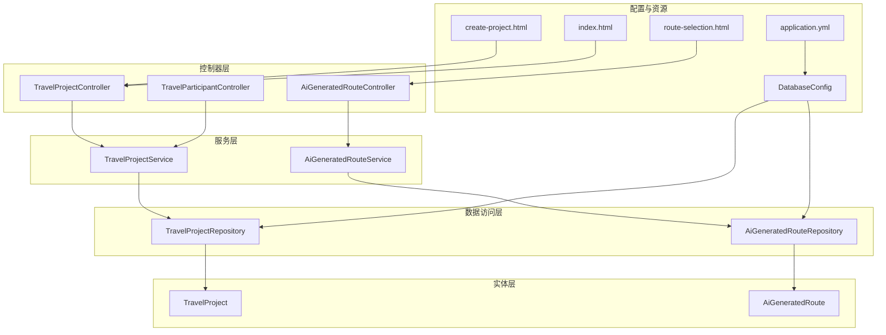
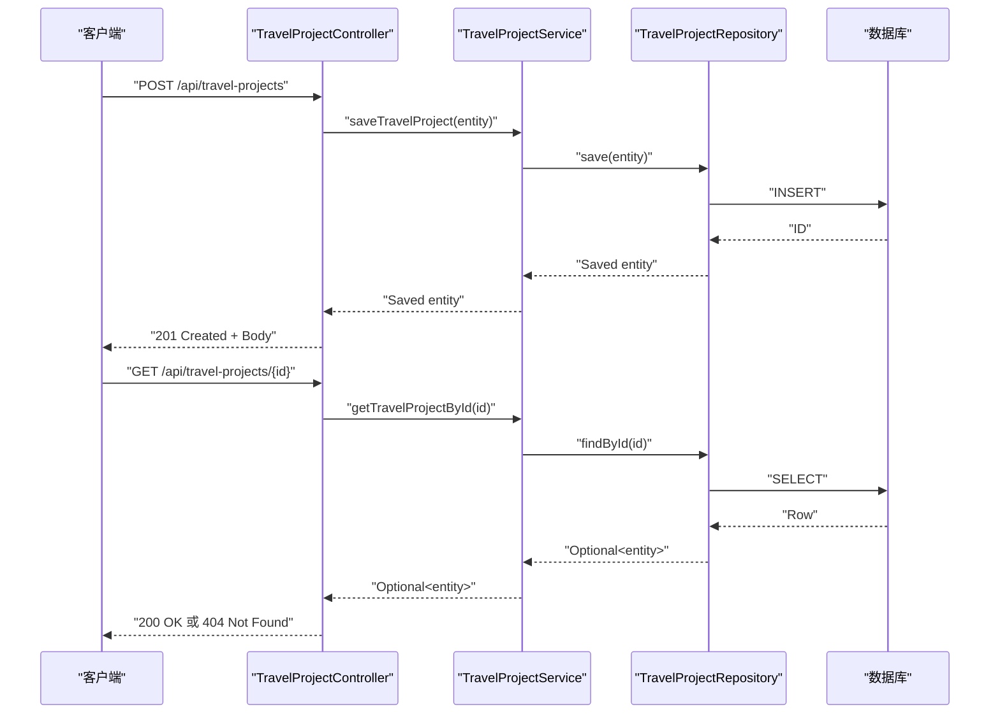
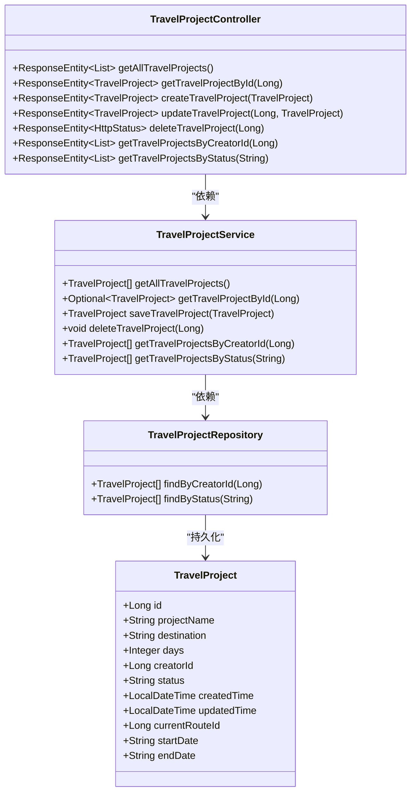
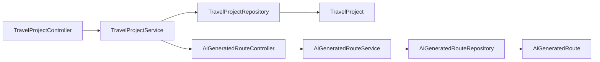

# 项目核心管理

<cite>
**本文引用的文件**
- [TravelProject.java](file://tudianersha/src/main/java/com/tudianersha/entity/TravelProject.java)
- [TravelProjectRepository.java](file://tudianersha/src/main/java/com/tudianersha/repository/TravelProjectRepository.java)
- [TravelProjectService.java](file://tudianersha/src/main/java/com/tudianersha/service/TravelProjectService.java)
- [TravelProjectController.java](file://tudianersha/src/main/java/com/tudianersha/controller/TravelProjectController.java)
- [Application.java](file://tudianersha/src/main/java/com/tudianersha/Application.java)
- [DatabaseConfig.java](file://tudianersha/src/main/java/com/tudianersha/config/DatabaseConfig.java)
- [application.yml](file://tudianersha/src/main/resources/application.yml)
- [AiGeneratedRouteService.java](file://tudianersha/src/main/java/com/tudianersha/service/AiGeneratedRouteService.java)
- [AiGeneratedRouteController.java](file://tudianersha/src/main/java/com/tudianersha/controller/AiGeneratedRouteController.java)
- [TravelParticipantController.java](file://tudianersha/src/main/java/com/tudianersha/controller/TravelParticipantController.java)
- [create-project.html](file://tudianersha/src/main/resources/static/create-project.html)
- [index.html](file://tudianersha/src/main/resources/static/index.html)
- [route-selection.html](file://tudianersha/src/main/resources/static/route-selection.html)
</cite>

## 目录
1. [简介](#简介)
2. [项目结构](#项目结构)
3. [核心组件](#核心组件)
4. [架构总览](#架构总览)
5. [详细组件分析](#详细组件分析)
6. [依赖分析](#依赖分析)
7. [性能考量](#性能考量)
8. [故障排查指南](#故障排查指南)
9. [结论](#结论)
10. [附录](#附录)

## 简介
本文件围绕旅行项目核心管理功能展开，系统性解析 TravelProject 实体类的属性设计与数据库映射、TravelProjectRepository 的 JPA CRUD 与自定义查询、TravelProjectService 的业务封装与异常处理策略，以及 TravelProjectController 暴露的 RESTful API 端点（GET/POST/PUT/DELETE）及其调用链路。同时，结合前端交互与相关模块（AI路线生成、参与者管理）说明项目状态（草稿/规划中/已归档）变更对系统其他模块的影响，并提供 API 使用示例与常见问题排查建议。

## 项目结构
项目采用典型的 Spring Boot 分层架构：
- 控制器层：负责接收 HTTP 请求、组织响应、调用服务层
- 服务层：封装业务逻辑、协调仓储与外部服务
- 数据访问层：基于 Spring Data JPA 的仓库接口
- 实体层：基于 JPA 注解的持久化模型
- 配置与资源：数据库连接、JPA 方言、应用配置、静态页面

图表来源
- [TravelProjectController.java](file://tudianersha/src/main/java/com/tudianersha/controller/TravelProjectController.java#L1-L85)
- [AiGeneratedRouteController.java](file://tudianersha/src/main/java/com/tudianersha/controller/AiGeneratedRouteController.java#L1-L112)
- [TravelParticipantController.java](file://tudianersha/src/main/java/com/tudianersha/controller/TravelParticipantController.java#L1-L80)
- [TravelProjectService.java](file://tudianersha/src/main/java/com/tudianersha/service/TravelProjectService.java#L1-L40)
- [AiGeneratedRouteService.java](file://tudianersha/src/main/java/com/tudianersha/service/AiGeneratedRouteService.java#L1-L104)
- [TravelProjectRepository.java](file://tudianersha/src/main/java/com/tudianersha/repository/TravelProjectRepository.java#L1-L13)
- [AiGeneratedRouteRepository.java](file://tudianersha/src/main/java/com/tudianersha/repository/AiGeneratedRouteRepository.java#L1-L12)
- [DatabaseConfig.java](file://tudianersha/src/main/java/com/tudianersha/config/DatabaseConfig.java#L1-L10)
- [application.yml](file://tudianersha/src/main/resources/application.yml#L1-L57)
- [create-project.html](file://tudianersha/src/main/resources/static/create-project.html#L1760-L1798)
- [index.html](file://tudianersha/src/main/resources/static/index.html#L341-L421)
- [route-selection.html](file://tudianersha/src/main/resources/static/route-selection.html#L140-L177)

章节来源
- [TravelProjectController.java](file://tudianersha/src/main/java/com/tudianersha/controller/TravelProjectController.java#L1-L85)
- [TravelProjectService.java](file://tudianersha/src/main/java/com/tudianersha/service/TravelProjectService.java#L1-L40)
- [TravelProjectRepository.java](file://tudianersha/src/main/java/com/tudianersha/repository/TravelProjectRepository.java#L1-L13)
- [TravelProject.java](file://tudianersha/src/main/java/com/tudianersha/entity/TravelProject.java#L1-L163)
- [DatabaseConfig.java](file://tudianersha/src/main/java/com/tudianersha/config/DatabaseConfig.java#L1-L10)
- [application.yml](file://tudianersha/src/main/resources/application.yml#L1-L57)

## 核心组件
- 实体类 TravelProject：定义旅行项目的核心属性（名称、目的地、天数、创建者、状态、时间戳、当前路线ID、起止日期等），并以 JPA 注解完成数据库映射。
- 仓库接口 TravelProjectRepository：继承 JpaRepository，提供基础 CRUD 与两个自定义查询方法（按创建者ID、按状态）。
- 服务类 TravelProjectService：封装业务逻辑，提供查询、保存、删除与自定义查询方法，作为控制器与仓库的桥梁。
- 控制器 TravelProjectController：暴露 RESTful 端点，处理 GET/POST/PUT/DELETE 请求，返回标准 HTTP 状态码与响应体。

章节来源
- [TravelProject.java](file://tudianersha/src/main/java/com/tudianersha/entity/TravelProject.java#L1-L163)
- [TravelProjectRepository.java](file://tudianersha/src/main/java/com/tudianersha/repository/TravelProjectRepository.java#L1-L13)
- [TravelProjectService.java](file://tudianersha/src/main/java/com/tudianersha/service/TravelProjectService.java#L1-L40)
- [TravelProjectController.java](file://tudianersha/src/main/java/com/tudianersha/controller/TravelProjectController.java#L1-L85)

## 架构总览
下图展示了 TravelProject 相关端到端调用链路，从浏览器/客户端发起请求，经由控制器、服务层、仓库层，最终落到数据库。

图表来源
- [TravelProjectController.java](file://tudianersha/src/main/java/com/tudianersha/controller/TravelProjectController.java#L1-L85)
- [TravelProjectService.java](file://tudianersha/src/main/java/com/tudianersha/service/TravelProjectService.java#L1-L40)
- [TravelProjectRepository.java](file://tudianersha/src/main/java/com/tudianersha/repository/TravelProjectRepository.java#L1-L13)

## 详细组件分析

### 实体类 TravelProject 设计与数据库映射
- 属性与注解要点
  - 主键与表映射：@Entity、@Table(name = "travel_projects")
  - 自增主键：@GeneratedValue(strategy = GenerationType.IDENTITY)
  - 字段约束：@Column(..., nullable = false) 对关键字段施加非空约束
  - 时间字段：LocalDateTime createdTime/updatedTime
  - 关联字段：currentRouteId（当前方案ID）
  - 业务字段：projectName、destination、days、creatorId、status（草稿/规划中/已归档）、startDate、endDate
- 复杂度与性能
  - 字段均为标量类型，无复杂嵌套对象，序列化/反序列化开销低
  - 未见索引注解，查询性能取决于仓库自定义方法与数据库层面的索引策略
- 数据一致性
  - 通过 JPA 映射与数据库 DDL 自动更新（application.yml 中 hibernate.ddl-auto: update）

章节来源
- [TravelProject.java](file://tudianersha/src/main/java/com/tudianersha/entity/TravelProject.java#L1-L163)
- [application.yml](file://tudianersha/src/main/resources/application.yml#L11-L16)

### 仓库层 TravelProjectRepository 的 CRUD 与自定义查询
- 继承关系：JpaRepository<TravelProject, Long>
- 基础能力：findAll、findById、save、deleteById 等
- 自定义查询：
  - findByCreatorId(Long)：按创建者ID查询项目列表
  - findByStatus(String)：按状态查询项目列表
- 复杂度分析
  - 自定义查询方法遵循 Spring Data JPA 方法命名规范，底层由动态 SQL 生成，时间复杂度与表规模成正比；建议在数据库层面为 creator_id、status 添加索引以优化查询

章节来源
- [TravelProjectRepository.java](file://tudianersha/src/main/java/com/tudianersha/repository/TravelProjectRepository.java#L1-L13)

### 服务层 TravelProjectService 的业务封装
- 职责边界
  - 提供 getAllTravelProjects、getTravelProjectById、saveTravelProject、deleteTravelProject 等方法
  - 提供 getTravelProjectsByCreatorId、getTravelProjectsByStatus 用于自定义查询
- 异常处理策略
  - 当前实现未显式声明事务注解，也未捕获异常并转换为统一响应；控制器层通过 Optional 判断存在性并返回 404
  - 建议在服务层增加 @Transactional 以保证数据一致性；对非法输入抛出运行时异常，由全局异常处理器统一返回
- 数据验证
  - 未见显式校验逻辑；可在服务层对关键字段（如 status、days、startDate/endDate）进行校验，避免脏数据入库

章节来源
- [TravelProjectService.java](file://tudianersha/src/main/java/com/tudianersha/service/TravelProjectService.java#L1-L40)

### 控制器层 TravelProjectController 的 RESTful API
- 端点一览
  - GET /api/travel-projects → 返回全部项目列表
  - GET /api/travel-projects/{id} → 按 ID 查询，不存在返回 404
  - POST /api/travel-projects → 创建项目，返回 201
  - PUT /api/travel-projects/{id} → 更新项目，不存在返回 404
  - DELETE /api/travel-projects/{id} → 删除项目，不存在返回 404
  - GET /api/travel-projects/creator/{creatorId} → 按创建者查询
  - GET /api/travel-projects/status/{status} → 按状态查询
- 参数与响应
  - 请求体：TravelProject 实体（JSON）
  - 响应体：TravelProject 或列表；状态码：200/201/404/204
- 错误处理
  - 通过 Optional 判断存在性，不存在时返回 404；未见全局异常处理，建议引入统一异常处理

章节来源
- [TravelProjectController.java](file://tudianersha/src/main/java/com/tudianersha/controller/TravelProjectController.java#L1-L85)

### 项目状态变更对系统其他模块的影响
- 状态枚举与前端展示
  - 前端页面根据项目状态渲染不同入口与权限（如“协作中/进行中”才允许参与），体现了状态驱动的 UI 行为
- 与 AI 路线生成的耦合
  - AI 路线生成服务依赖 TravelProject 的基本信息（名称、目的地、天数、起止日期），状态变化可能影响后续流程（如仅在“协作中/进行中”阶段生成路线）
- 与参与者管理的联动
  - 创建项目后，前端会自动将当前用户加入参与者列表；状态变化会影响用户可见性与协作入口

章节来源
- [index.html](file://tudianersha/src/main/resources/static/index.html#L341-L421)
- [create-project.html](file://tudianersha/src/main/resources/static/create-project.html#L1296-L1357)
- [AiGeneratedRouteService.java](file://tudianersha/src/main/java/com/tudianersha/service/AiGeneratedRouteService.java#L70-L92)

### 完整调用链路示例（创建/更新/查询/删除）
- 创建项目
  - 前端：收集项目信息（名称、目的地、天数、起止日期等），计算天数并提交
  - 后端：TravelProjectController 接收请求，TravelProjectService 保存实体，TravelProjectRepository 写入数据库
- 更新项目
  - TravelProjectController 接收 PUT 请求，按 ID 查找实体，逐字段覆盖后保存
- 查询项目
  - GET /api/travel-projects → 返回全部；GET /api/travel-projects/{id} → 返回单个；按创建者/状态查询对应端点
- 删除项目
  - TravelProjectController 接收 DELETE 请求，TravelProjectService 调用仓库删除

章节来源
- [create-project.html](file://tudianersha/src/main/resources/static/create-project.html#L1760-L1798)
- [TravelProjectController.java](file://tudianersha/src/main/java/com/tudianersha/controller/TravelProjectController.java#L1-L85)
- [TravelProjectService.java](file://tudianersha/src/main/java/com/tudianersha/service/TravelProjectService.java#L1-L40)
- [TravelProjectRepository.java](file://tudianersha/src/main/java/com/tudianersha/repository/TravelProjectRepository.java#L1-L13)

### 类关系图（代码级）

图表来源
- [TravelProject.java](file://tudianersha/src/main/java/com/tudianersha/entity/TravelProject.java#L1-L163)
- [TravelProjectRepository.java](file://tudianersha/src/main/java/com/tudianersha/repository/TravelProjectRepository.java#L1-L13)
- [TravelProjectService.java](file://tudianersha/src/main/java/com/tudianersha/service/TravelProjectService.java#L1-L40)
- [TravelProjectController.java](file://tudianersha/src/main/java/com/tudianersha/controller/TravelProjectController.java#L1-L85)

## 依赖分析
- 组件耦合
  - 控制器仅依赖服务层；服务层仅依赖仓库接口；仓库接口依赖实体类；整体分层清晰，内聚性良好
- 外部依赖
  - 数据库：MySQL（application.yml 配置）
  - JPA/Hibernate：自动建模与方言（MySQL8Dialect）
  - JPA 启用：通过 DatabaseConfig 启用扫描 com.tudianersha.repository 包
- 潜在循环依赖
  - 未发现循环依赖迹象；TravelProjectController 与 AiGeneratedRouteController 分别依赖各自的服务，互不直接依赖

图表来源
- [TravelProjectController.java](file://tudianersha/src/main/java/com/tudianersha/controller/TravelProjectController.java#L1-L85)
- [TravelProjectService.java](file://tudianersha/src/main/java/com/tudianersha/service/TravelProjectService.java#L1-L40)
- [TravelProjectRepository.java](file://tudianersha/src/main/java/com/tudianersha/repository/TravelProjectRepository.java#L1-L13)
- [AiGeneratedRouteController.java](file://tudianersha/src/main/java/com/tudianersha/controller/AiGeneratedRouteController.java#L1-L112)
- [AiGeneratedRouteService.java](file://tudianersha/src/main/java/com/tudianersha/service/AiGeneratedRouteService.java#L1-L104)
- [AiGeneratedRouteRepository.java](file://tudianersha/src/main/java/com/tudianersha/repository/AiGeneratedRouteRepository.java#L1-L12)

章节来源
- [DatabaseConfig.java](file://tudianersha/src/main/java/com/tudianersha/config/DatabaseConfig.java#L1-L10)
- [application.yml](file://tudianersha/src/main/resources/application.yml#L1-L57)

## 性能考量
- 查询性能
  - 建议为 travel_projects 表的 creator_id、status 字段建立索引，以提升按创建者与状态查询的效率
- 事务与一致性
  - 在服务层添加 @Transactional，确保跨多个仓库操作的一致性
- 序列化与网络传输
  - 实体字段较少且简单，JSON 序列化开销低；可考虑 DTO 投影减少不必要的字段传输
- 并发与锁
  - 更新操作采用按 ID 覆盖写入；若存在并发修改，建议引入乐观锁（版本号）或行级锁

[本节为通用性能建议，无需列出具体文件来源]

## 故障排查指南
- 常见错误与定位
  - 404 Not Found：当按 ID 查询不存在的项目时返回；检查 URL 路径与 ID 是否正确
  - 500 Internal Server Error：服务层未捕获异常导致；建议引入全局异常处理，将业务异常转为 4xx
  - 数据库连接失败：检查 application.yml 中的数据库 URL、用户名、密码与驱动
- 日志与调试
  - application.yml 已开启 debug 日志级别，便于定位问题
- 前端交互问题
  - 创建项目时前端会校验必填字段与日期逻辑；若出现异常，查看控制台错误与网络请求响应

章节来源
- [TravelProjectController.java](file://tudianersha/src/main/java/com/tudianersha/controller/TravelProjectController.java#L1-L85)
- [application.yml](file://tudianersha/src/main/resources/application.yml#L43-L46)

## 结论
本项目围绕 TravelProject 实现了清晰的分层架构：控制器负责 API 端点，服务层封装业务与事务，仓库层提供 JPA 访问，实体类完成数据库映射。当前实现满足基本 CRUD 与自定义查询需求，但在事务管理、数据验证与异常处理方面仍有改进空间。项目状态与前端展示紧密耦合，状态变更直接影响协作入口与下游模块（如 AI 路线生成）的行为。建议补充全局异常处理、事务注解与索引优化，以提升稳定性与性能。

[本节为总结性内容，无需列出具体文件来源]

## 附录

### API 使用示例（路径与行为）
- 获取全部项目
  - 方法：GET
  - 路径：/api/travel-projects
  - 响应：200 OK + 项目列表
- 按 ID 获取项目
  - 方法：GET
  - 路径：/api/travel-projects/{id}
  - 响应：200 OK 或 404 Not Found
- 创建项目
  - 方法：POST
  - 路径：/api/travel-projects
  - 请求体：TravelProject JSON
  - 响应：201 Created + 新建实体
- 更新项目
  - 方法：PUT
  - 路径：/api/travel-projects/{id}
  - 请求体：TravelProject JSON（字段会被逐个覆盖）
  - 响应：200 OK 或 404 Not Found
- 删除项目
  - 方法：DELETE
  - 路径：/api/travel-projects/{id}
  - 响应：204 No Content 或 404 Not Found
- 按创建者查询
  - 方法：GET
  - 路径：/api/travel-projects/creator/{creatorId}
  - 响应：200 OK + 项目列表
- 按状态查询
  - 方法：GET
  - 路径：/api/travel-projects/status/{status}
  - 响应：200 OK + 项目列表

章节来源
- [TravelProjectController.java](file://tudianersha/src/main/java/com/tudianersha/controller/TravelProjectController.java#L1-L85)

### 项目状态与前端联动
- 前端首页根据项目状态筛选“我创建的/编辑中的/参与中的”项目卡片
- 路线选择页加载 TravelProject 与 AI 路线，状态影响可用性

章节来源
- [index.html](file://tudianersha/src/main/resources/static/index.html#L341-L421)
- [route-selection.html](file://tudianersha/src/main/resources/static/route-selection.html#L140-L177)