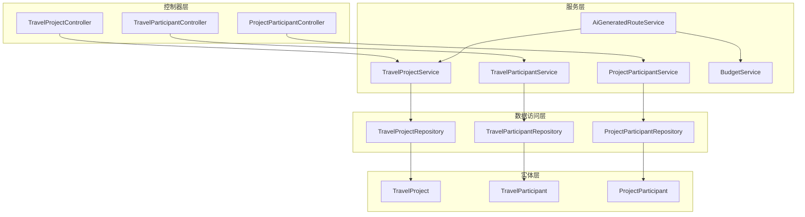
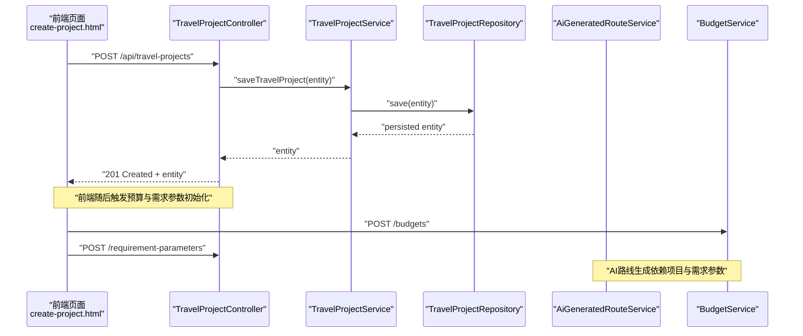
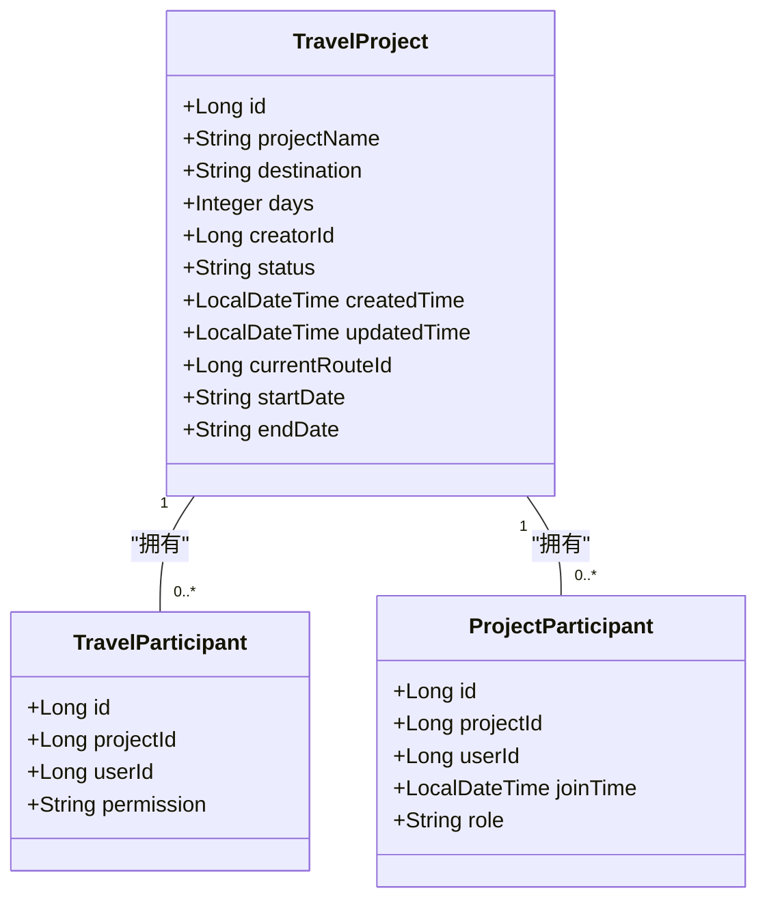
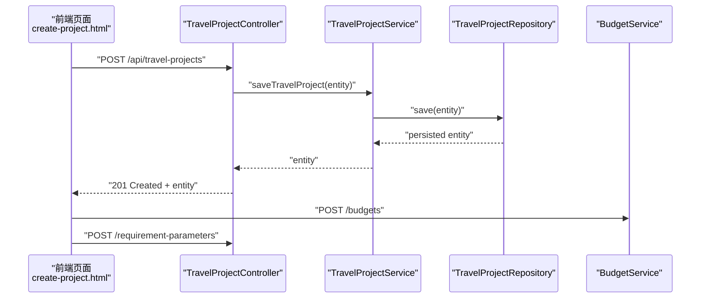
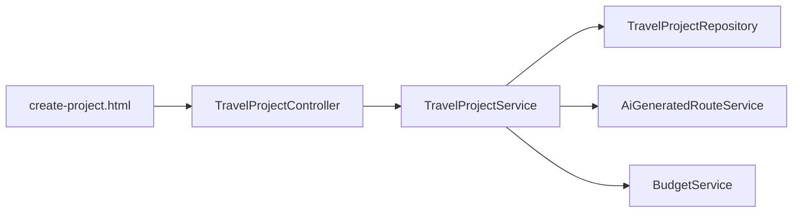

# 项目管理

<cite>
**本文引用的文件列表**
- [TravelProjectController.java](file://tudianersha/src/main/java/com/tudianersha/controller/TravelProjectController.java)
- [TravelProjectService.java](file://tudianersha/src/main/java/com/tudianersha/service/TravelProjectService.java)
- [TravelProjectRepository.java](file://tudianersha/src/main/java/com/tudianersha/repository/TravelProjectRepository.java)
- [TravelProject.java](file://tudianersha/src/main/java/com/tudianersha/entity/TravelProject.java)
- [TravelParticipant.java](file://tudianersha/src/main/java/com/tudianersha/entity/TravelParticipant.java)
- [ProjectParticipant.java](file://tudianersha/src/main/java/com/tudianersha/entity/ProjectParticipant.java)
- [TravelParticipantService.java](file://tudianersha/src/main/java/com/tudianersha/service/TravelParticipantService.java)
- [ProjectParticipantService.java](file://tudianersha/src/main/java/com/tudianersha/service/ProjectParticipantService.java)
- [TravelParticipantRepository.java](file://tudianersha/src/main/java/com/tudianersha/repository/TravelParticipantRepository.java)
- [ProjectParticipantRepository.java](file://tudianersha/src/main/java/com/tudianersha/repository/ProjectParticipantRepository.java)
- [AiGeneratedRouteService.java](file://tudianersha/src/main/java/com/tudianersha/service/AiGeneratedRouteService.java)
- [BudgetService.java](file://tudianersha/src/main/java/com/tudianersha/service/BudgetService.java)
- [create-project.html](file://tudianersha/src/main/resources/static/create-project.html)
</cite>

## 目录
1. [引言](#引言)
2. [项目结构](#项目结构)
3. [核心组件](#核心组件)
4. [架构总览](#架构总览)
5. [详细组件分析](#详细组件分析)
6. [依赖关系分析](#依赖关系分析)
7. [性能考量](#性能考量)
8. [故障排查指南](#故障排查指南)
9. [结论](#结论)
10. [附录](#附录)

## 引言
本文件围绕旅行项目管理模块进行系统性解析，重点覆盖：
- TravelProjectController 对项目创建、查询、更新、删除的处理逻辑
- TravelProjectService 的项目生命周期管理与业务规则
- TravelProjectRepository 的数据持久化机制
- 项目与参与者（TravelParticipant 与 ProjectParticipant）之间的关联关系、邀请机制、权限控制与状态同步
- 基于前端调用链展示项目创建时的事务处理流程
- 项目状态变更对 AI 路线生成、预算管理等模块的影响
- 并发访问控制与异常处理最佳实践

## 项目结构
项目采用经典的三层架构（Controller/Service/Repository）与 JPA 实体映射，模块划分清晰：
- 控制器层：负责 HTTP 请求接入与响应封装
- 服务层：承载业务规则与跨实体协调
- 数据访问层：基于 Spring Data JPA 简化 CRUD
- 实体层：以注解驱动数据库表结构定义

图表来源
- [TravelProjectController.java](file://tudianersha/src/main/java/com/tudianersha/controller/TravelProjectController.java#L1-L85)
- [TravelProjectService.java](file://tudianersha/src/main/java/com/tudianersha/service/TravelProjectService.java#L1-L40)
- [TravelProjectRepository.java](file://tudianersha/src/main/java/com/tudianersha/repository/TravelProjectRepository.java#L1-L13)
- [TravelProject.java](file://tudianersha/src/main/java/com/tudianersha/entity/TravelProject.java#L1-L163)
- [TravelParticipant.java](file://tudianersha/src/main/java/com/tudianersha/entity/TravelParticipant.java#L1-L73)
- [ProjectParticipant.java](file://tudianersha/src/main/java/com/tudianersha/entity/ProjectParticipant.java#L1-L87)
- [TravelParticipantService.java](file://tudianersha/src/main/java/com/tudianersha/service/TravelParticipantService.java#L1-L52)
- [ProjectParticipantService.java](file://tudianersha/src/main/java/com/tudianersha/service/ProjectParticipantService.java#L1-L48)
- [TravelParticipantRepository.java](file://tudianersha/src/main/java/com/tudianersha/repository/TravelParticipantRepository.java#L1-L17)
- [ProjectParticipantRepository.java](file://tudianersha/src/main/java/com/tudianersha/repository/ProjectParticipantRepository.java#L1-L16)
- [AiGeneratedRouteService.java](file://tudianersha/src/main/java/com/tudianersha/service/AiGeneratedRouteService.java#L1-L486)
- [BudgetService.java](file://tudianersha/src/main/java/com/tudianersha/service/BudgetService.java#L1-L36)

章节来源
- [TravelProjectController.java](file://tudianersha/src/main/java/com/tudianersha/controller/TravelProjectController.java#L1-L85)
- [TravelProjectService.java](file://tudianersha/src/main/java/com/tudianersha/service/TravelProjectService.java#L1-L40)
- [TravelProjectRepository.java](file://tudianersha/src/main/java/com/tudianersha/repository/TravelProjectRepository.java#L1-L13)

## 核心组件
- TravelProjectController：提供项目全量查询、按 ID 查询、创建、更新、删除、按创建者与状态过滤等接口；统一返回 HTTP 状态码与数据体。
- TravelProjectService：封装 TravelProjectRepository 的 CRUD 操作，并提供按创建者与状态查询能力；当前未显式声明事务注解，遵循 Spring 默认传播行为。
- TravelProjectRepository：继承 JpaRepository，提供按创建者与状态的查询方法，简化数据访问。

章节来源
- [TravelProjectController.java](file://tudianersha/src/main/java/com/tudianersha/controller/TravelProjectController.java#L1-L85)
- [TravelProjectService.java](file://tudianersha/src/main/java/com/tudianersha/service/TravelProjectService.java#L1-L40)
- [TravelProjectRepository.java](file://tudianersha/src/main/java/com/tudianersha/repository/TravelProjectRepository.java#L1-L13)

## 架构总览
下图展示项目创建到后续模块联动的关键交互路径，体现“前端发起 → 控制器 → 服务 → 持久化 → 其他模块”的闭环：

图表来源
- [TravelProjectController.java](file://tudianersha/src/main/java/com/tudianersha/controller/TravelProjectController.java#L36-L40)
- [TravelProjectService.java](file://tudianersha/src/main/java/com/tudianersha/service/TravelProjectService.java#L25-L27)
- [TravelProjectRepository.java](file://tudianersha/src/main/java/com/tudianersha/repository/TravelProjectRepository.java#L10-L13)
- [create-project.html](file://tudianersha/src/main/resources/static/create-project.html#L1797-L1833)
- [AiGeneratedRouteService.java](file://tudianersha/src/main/java/com/tudianersha/service/AiGeneratedRouteService.java#L70-L92)
- [BudgetService.java](file://tudianersha/src/main/java/com/tudianersha/service/BudgetService.java#L25-L27)

## 详细组件分析

### TravelProjectController：项目 CRUD 与筛选
- GET /api/travel-projects：返回全部项目
- GET /api/travel-projects/{id}：按 ID 查询，不存在则 404
- POST /api/travel-projects：创建项目并返回 201
- PUT /api/travel-projects/{id}：按 ID 更新，不存在则 404
- DELETE /api/travel-projects/{id}：按 ID 删除，不存在则 404
- GET /api/travel-projects/creator/{creatorId}：按创建者过滤
- GET /api/travel-projects/status/{status}：按状态过滤

处理要点
- 控制器仅做参数校验与响应封装，业务逻辑委托给服务层
- 更新接口直接设置多个字段后保存，未做差异比对与幂等保护

章节来源
- [TravelProjectController.java](file://tudianersha/src/main/java/com/tudianersha/controller/TravelProjectController.java#L20-L85)

### TravelProjectService：项目生命周期与业务规则
- 提供 findAll、findById、save、deleteById、findByCreatorId、findByStatus
- 未显式声明事务注解，遵循 Spring 默认传播行为（通常为 REQUIRED）
- 业务规则建议：在服务层增加状态机与权限校验，确保状态流转合法与操作者身份匹配

章节来源
- [TravelProjectService.java](file://tudianersha/src/main/java/com/tudianersha/service/TravelProjectService.java#L1-L40)

### TravelProjectRepository：数据持久化机制
- 继承 JpaRepository，天然具备 CRUD 能力
- 自定义查询：findByCreatorId、findByStatus
- 复杂查询可通过 @Query 或方法命名扩展

章节来源
- [TravelProjectRepository.java](file://tudianersha/src/main/java/com/tudianersha/repository/TravelProjectRepository.java#L1-L13)

### 实体模型：TravelProject、TravelParticipant、ProjectParticipant
- TravelProject：项目基本信息、状态、时间戳、当前路线 ID、起止日期等
- TravelParticipant：项目-用户-权限（创建者/编辑者/查看者）的细粒度权限表
- ProjectParticipant：项目-用户-加入时间-角色（创建者/编辑者/查看者）的角色表

图表来源
- [TravelProject.java](file://tudianersha/src/main/java/com/tudianersha/entity/TravelProject.java#L1-L163)
- [TravelParticipant.java](file://tudianersha/src/main/java/com/tudianersha/entity/TravelParticipant.java#L1-L73)
- [ProjectParticipant.java](file://tudianersha/src/main/java/com/tudianersha/entity/ProjectParticipant.java#L1-L87)

章节来源
- [TravelProject.java](file://tudianersha/src/main/java/com/tudianersha/entity/TravelProject.java#L1-L163)
- [TravelParticipant.java](file://tudianersha/src/main/java/com/tudianersha/entity/TravelParticipant.java#L1-L73)
- [ProjectParticipant.java](file://tudianersha/src/main/java/com/tudianersha/entity/ProjectParticipant.java#L1-L87)

### 参与者与权限：邀请机制、权限控制与状态同步
- TravelParticipant：细粒度权限（permission），适合“仅查看/可编辑/创建者”等场景
- ProjectParticipant：角色（role）与加入时间（joinTime），适合“成员角色管理”
- 建议的邀请流程（概念性）：
  1) 发起邀请：向 TravelParticipant 或 ProjectParticipant 写入记录
  2) 权限校验：控制器/服务层在读写项目时检查 permission/role
  3) 状态同步：当项目状态变化（如从“草稿”到“规划中”），可触发通知或刷新缓存
- 仓库层提供按项目/用户的查询与存在性判断，便于快速权限判定

章节来源
- [TravelParticipantService.java](file://tudianersha/src/main/java/com/tudianersha/service/TravelParticipantService.java#L1-L52)
- [ProjectParticipantService.java](file://tudianersha/src/main/java/com/tudianersha/service/ProjectParticipantService.java#L1-L48)
- [TravelParticipantRepository.java](file://tudianersha/src/main/java/com/tudianersha/repository/TravelParticipantRepository.java#L1-L17)
- [ProjectParticipantRepository.java](file://tudianersha/src/main/java/com/tudianersha/repository/ProjectParticipantRepository.java#L1-L16)

### 项目创建时的事务处理流程（基于前端调用链）
前端页面在创建项目成功后，会顺次：
- 生成分享链接
- 初始化预算（POST /budgets）
- 保存需求参数（POST /requirement-parameters）

该顺序体现了“先项目、后预算/需求”的依赖关系。若需强一致，可在服务层将项目创建与预算初始化纳入同一事务边界（建议在服务层增加 @Transactional）。

图表来源
- [create-project.html](file://tudianersha/src/main/resources/static/create-project.html#L1797-L1833)
- [TravelProjectController.java](file://tudianersha/src/main/java/com/tudianersha/controller/TravelProjectController.java#L36-L40)
- [TravelProjectService.java](file://tudianersha/src/main/java/com/tudianersha/service/TravelProjectService.java#L25-L27)
- [TravelProjectRepository.java](file://tudianersha/src/main/java/com/tudianersha/repository/TravelProjectRepository.java#L10-L13)
- [BudgetService.java](file://tudianersha/src/main/java/com/tudianersha/service/BudgetService.java#L25-L27)

### 项目状态变更对其他模块的影响
- AI 路线生成（AiGeneratedRouteService）：依赖项目基本信息与需求参数，状态变化可能触发重新生成或缓存失效
- 预算管理（BudgetService）：项目状态变化可能影响预算审批/冻结/释放等流程（建议在服务层增加状态联动）

章节来源
- [AiGeneratedRouteService.java](file://tudianersha/src/main/java/com/tudianersha/service/AiGeneratedRouteService.java#L70-L92)
- [BudgetService.java](file://tudianersha/src/main/java/com/tudianersha/service/BudgetService.java#L1-L36)

## 依赖关系分析
- 控制器依赖服务层，服务层依赖仓库层，仓库层依赖实体
- AiGeneratedRouteService 依赖 TravelProjectService 与 RequirementParameterService，间接依赖 TravelProject
- 前端通过 create-project.html 触发 TravelProjectController，进而影响 BudgetService

图表来源
- [create-project.html](file://tudianersha/src/main/resources/static/create-project.html#L1797-L1833)
- [TravelProjectController.java](file://tudianersha/src/main/java/com/tudianersha/controller/TravelProjectController.java#L36-L40)
- [TravelProjectService.java](file://tudianersha/src/main/java/com/tudianersha/service/TravelProjectService.java#L25-L27)
- [AiGeneratedRouteService.java](file://tudianersha/src/main/java/com/tudianersha/service/AiGeneratedRouteService.java#L70-L92)
- [BudgetService.java](file://tudianersha/src/main/java/com/tudianersha/service/BudgetService.java#L25-L27)

章节来源
- [TravelProjectController.java](file://tudianersha/src/main/java/com/tudianersha/controller/TravelProjectController.java#L1-L85)
- [TravelProjectService.java](file://tudianersha/src/main/java/com/tudianersha/service/TravelProjectService.java#L1-L40)
- [AiGeneratedRouteService.java](file://tudianersha/src/main/java/com/tudianersha/service/AiGeneratedRouteService.java#L1-L486)
- [BudgetService.java](file://tudianersha/src/main/java/com/tudianersha/service/BudgetService.java#L1-L36)

## 性能考量
- 查询优化：对高频查询（按创建者、按状态）建议在数据库层面建立索引
- 分页与排序：在控制器层引入分页参数，避免一次性加载大量数据
- 缓存策略：对只读列表与详情可引入 Redis 缓存，降低数据库压力
- 事务边界：将项目创建与预算初始化置于同一事务，减少不一致风险

## 故障排查指南
- 404 场景：控制器对不存在的资源返回 NOT_FOUND，检查 ID 是否正确或是否已被删除
- 500 场景：服务层未捕获异常时将向上抛出，建议在控制器层增加统一异常处理
- 并发冲突：多用户同时更新同一项目时可能出现脏写，建议引入乐观锁或请求幂等
- 权限问题：TravelParticipant/ProjectParticipant 存在性与权限校验不足时，应补充校验逻辑

章节来源
- [TravelProjectController.java](file://tudianersha/src/main/java/com/tudianersha/controller/TravelProjectController.java#L26-L34)
- [TravelParticipantService.java](file://tudianersha/src/main/java/com/tudianersha/service/TravelParticipantService.java#L33-L52)
- [ProjectParticipantService.java](file://tudianersha/src/main/java/com/tudianersha/service/ProjectParticipantService.java#L33-L48)

## 结论
- TravelProjectController/Service/Repository 形成清晰的分层职责，满足基本 CRUD 与筛选需求
- 参与者模型（TravelParticipant 与 ProjectParticipant）为权限与角色管理提供了基础
- 项目状态变更对 AI 路线生成与预算管理具有联动影响，建议在服务层增强状态机与事件驱动
- 建议在服务层增加事务边界、权限校验与异常处理，提升一致性与稳定性

## 附录
- 前端项目创建调用链参考：[create-project.html](file://tudianersha/src/main/resources/static/create-project.html#L1797-L1833)
- 控制器接口参考：[TravelProjectController.java](file://tudianersha/src/main/java/com/tudianersha/controller/TravelProjectController.java#L20-L85)
- 服务层接口参考：[TravelProjectService.java](file://tudianersha/src/main/java/com/tudianersha/service/TravelProjectService.java#L1-L40)
- 实体定义参考：[TravelProject.java](file://tudianersha/src/main/java/com/tudianersha/entity/TravelProject.java#L1-L163)，[TravelParticipant.java](file://tudianersha/src/main/java/com/tudianersha/entity/TravelParticipant.java#L1-L73)，[ProjectParticipant.java](file://tudianersha/src/main/java/com/tudianersha/entity/ProjectParticipant.java#L1-L87)