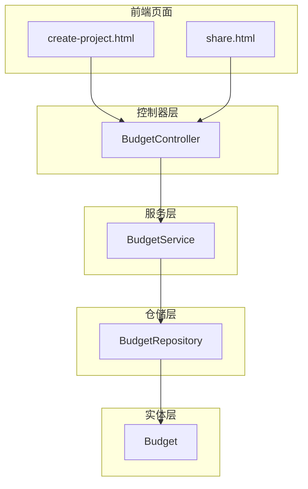
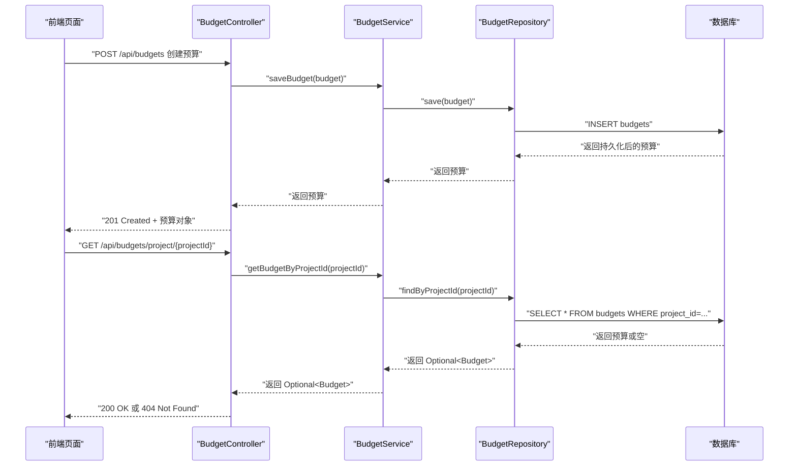
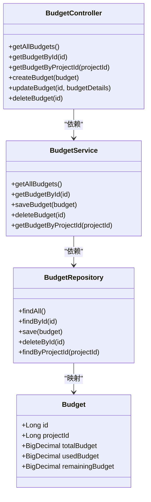
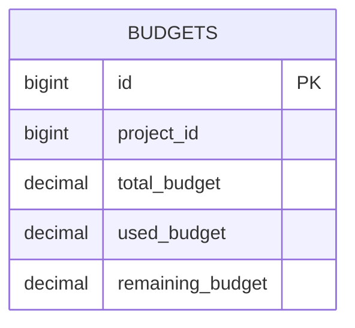
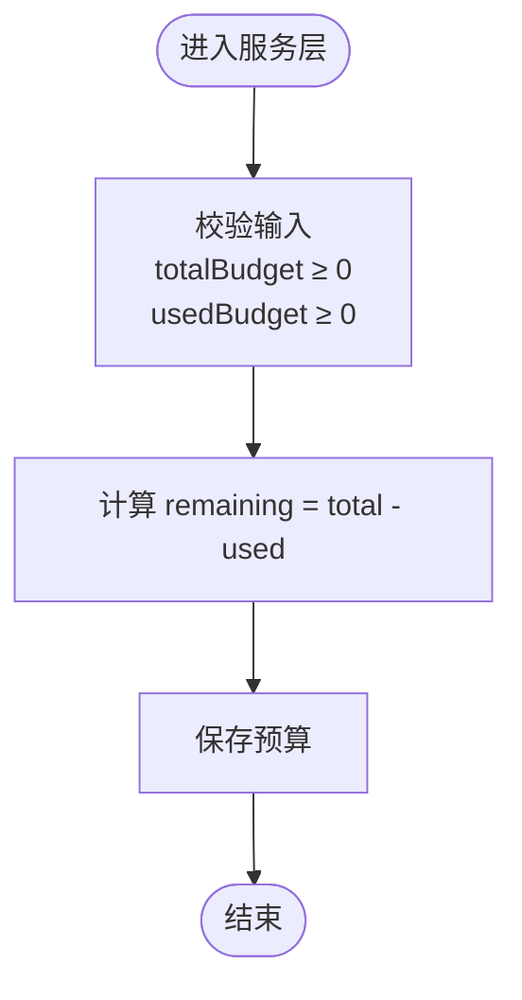

# 预算管理

<cite>
**本文引用的文件**
- [BudgetController.java](file://tudianersha/src/main/java/com/tudianersha/controller/BudgetController.java)
- [BudgetService.java](file://tudianersha/src/main/java/com/tudianersha/service/BudgetService.java)
- [BudgetRepository.java](file://tudianersha/src/main/java/com/tudianersha/repository/BudgetRepository.java)
- [Budget.java](file://tudianersha/src/main/java/com/tudianersha/entity/Budget.java)
- [application.yml](file://tudianersha/src/main/resources/application.yml)
- [create-project.html](file://tudianersha/src/main/resources/static/create-project.html)
- [share.html](file://tudianersha/src/main/resources/static/share.html)
</cite>

## 目录
1. [引言](#引言)
2. [项目结构](#项目结构)
3. [核心组件](#核心组件)
4. [架构总览](#架构总览)
5. [详细组件分析](#详细组件分析)
6. [依赖关系分析](#依赖关系分析)
7. [性能考量](#性能考量)
8. [故障排查指南](#故障排查指南)
9. [结论](#结论)
10. [附录](#附录)

## 引言
本文件围绕预算管理模块进行系统化技术文档梳理，重点解释以下方面：
- BudgetController 如何处理预算设置、费用录入、剩余金额计算等 API 请求
- BudgetService 中预算校验与统计逻辑的实现方式
- BudgetRepository 对预算数据的增删改查操作
- Budget 实体中预算总额、已花费金额、剩余金额等字段的设计意义
- 结合前端交互展示预算超支预警的触发条件与通知机制
- 预算数据与其他模块（如项目总览、报表导出）的集成方式
- 数据一致性保障措施，如使用数据库事务确保金额变更的原子性

## 项目结构
预算管理模块位于后端 Spring Boot 工程中，采用经典的分层架构：
- 控制器层：处理 HTTP 请求并返回响应
- 服务层：封装业务逻辑，协调仓储层
- 仓储层：基于 JPA 的数据访问接口
- 实体层：映射 budgets 表的数据模型
- 前端页面：预算项的可视化与交互（用于总预算/日预算的计算与展示）

图表来源
- [BudgetController.java](file://tudianersha/src/main/java/com/tudianersha/controller/BudgetController.java#L1-L79)
- [BudgetService.java](file://tudianersha/src/main/java/com/tudianersha/service/BudgetService.java#L1-L36)
- [BudgetRepository.java](file://tudianersha/src/main/java/com/tudianersha/repository/BudgetRepository.java#L1-L12)
- [Budget.java](file://tudianersha/src/main/java/com/tudianersha/entity/Budget.java#L1-L87)
- [create-project.html](file://tudianersha/src/main/resources/static/create-project.html#L1345-L1561)
- [share.html](file://tudianersha/src/main/resources/static/share.html#L237-L264)

章节来源
- [BudgetController.java](file://tudianersha/src/main/java/com/tudianersha/controller/BudgetController.java#L1-L79)
- [BudgetService.java](file://tudianersha/src/main/java/com/tudianersha/service/BudgetService.java#L1-L36)
- [BudgetRepository.java](file://tudianersha/src/main/java/com/tudianersha/repository/BudgetRepository.java#L1-L12)
- [Budget.java](file://tudianersha/src/main/java/com/tudianersha/entity/Budget.java#L1-L87)
- [create-project.html](file://tudianersha/src/main/resources/static/create-project.html#L1345-L1561)
- [share.html](file://tudianersha/src/main/resources/static/share.html#L237-L264)

## 核心组件
- BudgetController：提供 /api/budgets 的 REST 接口，包括获取全部预算、按 ID 获取、按项目 ID 获取、创建、更新、删除等。
- BudgetService：封装预算的查询、保存、删除与按项目 ID 查询。
- BudgetRepository：继承 JpaRepository，提供按项目 ID 查询预算的能力。
- Budget 实体：映射 budgets 表，包含项目标识、总预算、已使用预算、剩余预算等字段。

章节来源
- [BudgetController.java](file://tudianersha/src/main/java/com/tudianersha/controller/BudgetController.java#L1-L79)
- [BudgetService.java](file://tudianersha/src/main/java/com/tudianersha/service/BudgetService.java#L1-L36)
- [BudgetRepository.java](file://tudianersha/src/main/java/com/tudianersha/repository/BudgetRepository.java#L1-L12)
- [Budget.java](file://tudianersha/src/main/java/com/tudianersha/entity/Budget.java#L1-L87)

## 架构总览
预算管理遵循典型的 MVC 分层与数据访问模式：
- 控制器接收请求参数，调用服务层执行业务逻辑
- 服务层通过仓储层访问数据库
- 实体类映射数据库表结构
- 前端页面负责预算项的可视化与交互，用于计算每日总预算

图表来源
- [BudgetController.java](file://tudianersha/src/main/java/com/tudianersha/controller/BudgetController.java#L1-L79)
- [BudgetService.java](file://tudianersha/src/main/java/com/tudianersha/service/BudgetService.java#L1-L36)
- [BudgetRepository.java](file://tudianersha/src/main/java/com/tudianersha/repository/BudgetRepository.java#L1-L12)

## 详细组件分析

### 控制器层：BudgetController
职责与行为：
- 提供预算的增删改查接口
- 支持按项目 ID 查询预算
- 返回标准 HTTP 状态码与响应体

关键点：
- GET /api/budgets：返回所有预算
- GET /api/budgets/{id}：按主键查询
- GET /api/budgets/project/{projectId}：按项目 ID 查询
- POST /api/budgets：创建预算
- PUT /api/budgets/{id}：更新预算（会覆盖项目 ID、总预算、已使用预算、剩余预算）
- DELETE /api/budgets/{id}：删除预算

注意：
- 当前实现未在控制器层进行预算校验与统计逻辑，更新时直接覆盖字段值，建议在服务层补充校验与计算。

章节来源
- [BudgetController.java](file://tudianersha/src/main/java/com/tudianersha/controller/BudgetController.java#L1-L79)

### 服务层：BudgetService
职责与行为：
- 调用仓储层完成数据访问
- 提供按项目 ID 查询预算的能力
- 作为业务编排层，建议在此处增加预算校验与统计逻辑

当前实现：
- getAllBudgets、getBudgetById、saveBudget、deleteBudget、getBudgetByProjectId

建议增强：
- 在 save/update 时进行预算校验（如总预算 ≥ 已使用预算），并在更新时同步计算剩余预算
- 可以引入事务注解保证金额变更的原子性

章节来源
- [BudgetService.java](file://tudianersha/src/main/java/com/tudianersha/service/BudgetService.java#L1-L36)

### 仓储层：BudgetRepository
职责与行为：
- 继承 JpaRepository，提供通用的 CRUD 能力
- 自定义 findByProjectId 查询方法

注意：
- findByProjectId 返回 Optional，便于上层判空处理

章节来源
- [BudgetRepository.java](file://tudianersha/src/main/java/com/tudianersha/repository/BudgetRepository.java#L1-L12)

### 实体层：Budget
字段设计与意义：
- id：主键
- projectId：项目标识，用于关联项目维度的预算
- totalBudget：总预算（建议为“行程总预算”或“日均预算”的汇总）
- usedBudget：已使用预算
- remainingBudget：剩余预算

设计要点：
- 字段类型使用 BigDecimal，保证金额计算精度
- 三者之间应满足数学关系：remaining = total - used
- 建议在服务层统一维护该关系，避免脏数据

章节来源
- [Budget.java](file://tudianersha/src/main/java/com/tudianersha/entity/Budget.java#L1-L87)

### 剩余金额计算与费用录入
- 剩余金额计算：前端页面在用户编辑预算项时，会实时计算每日总预算；后端应确保 remaining = total - used 的一致性由服务层维护
- 费用录入：当前 BudgetController 的更新接口会直接覆盖 usedBudget/remainingBudget 字段，建议改为“新增费用”接口，并在服务层累加 usedBudget 后重新计算 remainingBudget

章节来源
- [create-project.html](file://tudianersha/src/main/resources/static/create-project.html#L1345-L1561)
- [BudgetController.java](file://tudianersha/src/main/java/com/tudianersha/controller/BudgetController.java#L1-L79)

### 预算超支预警与通知机制
当前仓库未发现专门的“预算超支预警”实现。建议在服务层增加如下逻辑：
- 预算超支判断：当 usedBudget > totalBudget 时触发预警
- 通知机制：可通过邮件服务或其他通知通道发送告警（参考应用配置中的邮件配置）

章节来源
- [application.yml](file://tudianersha/src/main/resources/application.yml#L1-L57)

### 与其他模块的集成
- 项目总览：前端 share.html 展示了总预算、已使用、剩余预算的预览，表明预算数据会参与项目概览页渲染
- 报表导出：前端 share.html 提供 PDF 下载入口，预算数据可作为导出内容的一部分

章节来源
- [share.html](file://tudianersha/src/main/resources/static/share.html#L237-L264)

## 依赖关系分析
- 控制器依赖服务层
- 服务层依赖仓储层
- 仓储层依赖实体类与数据库
- 前端页面依赖控制器提供的预算接口

图表来源
- [BudgetController.java](file://tudianersha/src/main/java/com/tudianersha/controller/BudgetController.java#L1-L79)
- [BudgetService.java](file://tudianersha/src/main/java/com/tudianersha/service/BudgetService.java#L1-L36)
- [BudgetRepository.java](file://tudianersha/src/main/java/com/tudianersha/repository/BudgetRepository.java#L1-L12)
- [Budget.java](file://tudianersha/src/main/java/com/tudianersha/entity/Budget.java#L1-L87)

## 性能考量
- 数据库访问：JPA 默认使用懒加载与二级缓存策略，建议在高频查询场景下启用合适的索引（如 project_id）
- 计算复杂度：预算计算为 O(1)，成本极低
- 前端交互：create-project.html 中的预算项编辑与每日总预算计算在浏览器端完成，减少网络往返

## 故障排查指南
- 404 Not Found：当按 ID 或项目 ID 查询不到预算时，控制器返回 404。请确认项目 ID 是否正确、预算是否已创建
- 500 Internal Server Error：当数据库连接异常或 SQL 执行失败时可能出现。检查 application.yml 中的数据库配置
- 金额不一致：若 usedBudget 与 totalBudget/remainingBudget 不满足数学关系，需检查服务层是否正确维护三者关系

章节来源
- [BudgetController.java](file://tudianersha/src/main/java/com/tudianersha/controller/BudgetController.java#L1-L79)
- [application.yml](file://tudianersha/src/main/resources/application.yml#L1-L57)

## 结论
- 当前预算模块实现了基础的 CRUD 与按项目 ID 查询能力
- 建议在服务层补充预算校验与统计逻辑，确保 remaining = total - used 的一致性
- 建议引入事务管理，保证金额变更的原子性
- 建议增加预算超支预警与通知机制
- 前端页面展示了预算项的可视化与交互，后续可将其与后端接口对接，形成闭环

## 附录

### API 定义（节选）
- GET /api/budgets：返回所有预算
- GET /api/budgets/{id}：按主键查询预算
- GET /api/budgets/project/{projectId}：按项目 ID 查询预算
- POST /api/budgets：创建预算
- PUT /api/budgets/{id}：更新预算（当前会覆盖项目 ID、总预算、已使用预算、剩余预算）
- DELETE /api/budgets/{id}：删除预算

章节来源
- [BudgetController.java](file://tudianersha/src/main/java/com/tudianersha/controller/BudgetController.java#L1-L79)

### 数据模型图

图表来源
- [Budget.java](file://tudianersha/src/main/java/com/tudianersha/entity/Budget.java#L1-L87)

### 建议的流程图（服务层预算校验与统计）

图表来源
- [BudgetService.java](file://tudianersha/src/main/java/com/tudianersha/service/BudgetService.java#L1-L36)
- [Budget.java](file://tudianersha/src/main/java/com/tudianersha/entity/Budget.java#L1-L87)