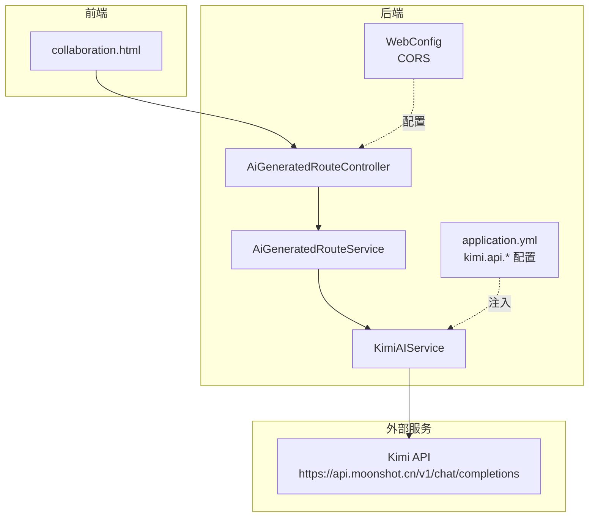
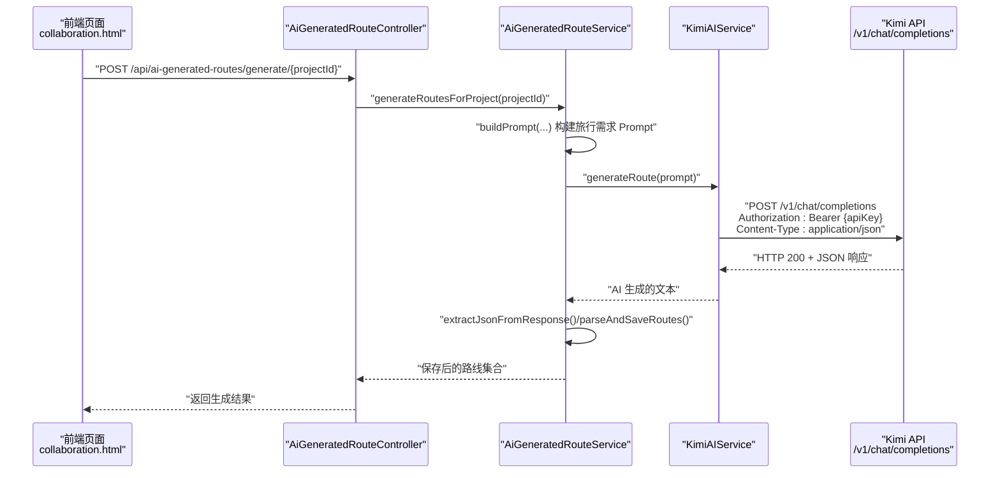
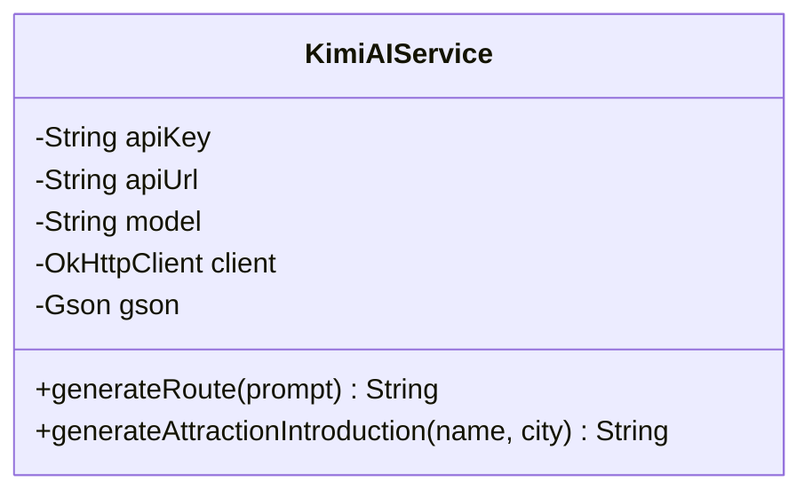
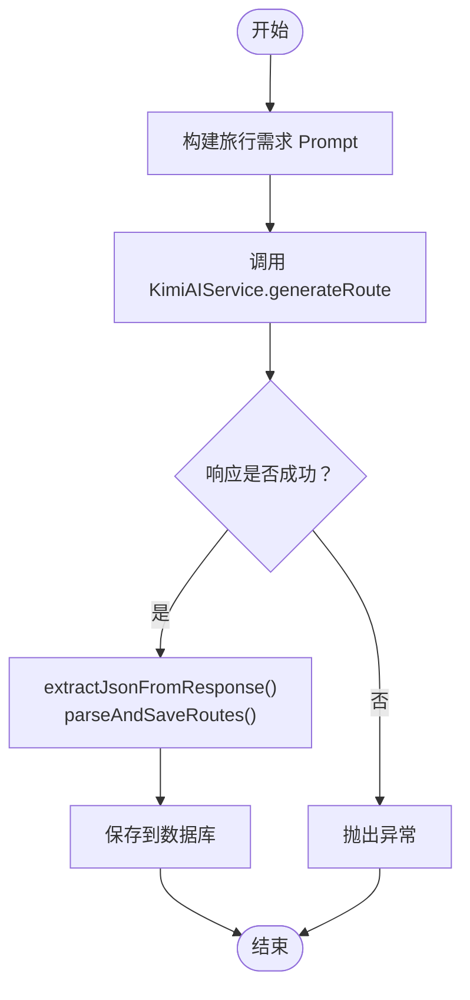
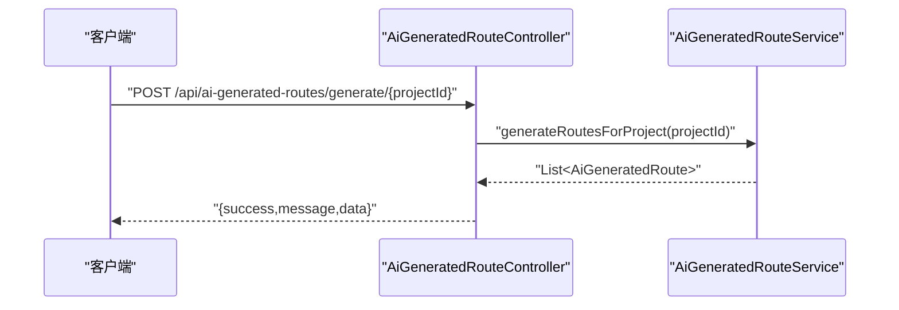
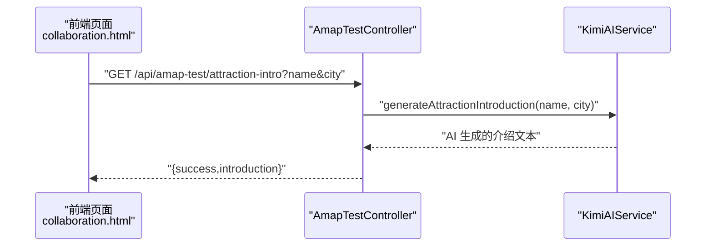
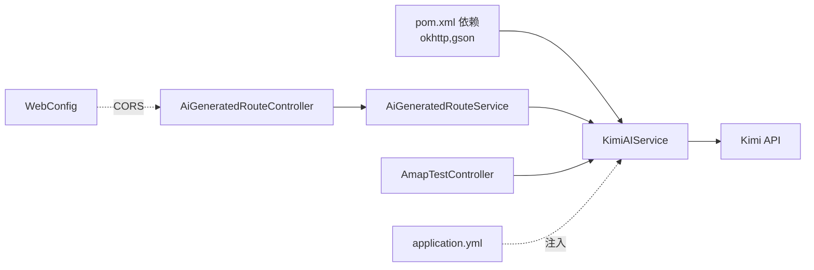

# Kimi AI 集成

<cite>
**本文引用的文件**
- [KimiAIService.java](file://tudianersha/src/main/java/com/tudianersha/service/KimiAIService.java)
- [AiGeneratedRouteService.java](file://tudianersha/src/main/java/com/tudianersha/service/AiGeneratedRouteService.java)
- [AiGeneratedRouteController.java](file://tudianersha/src/main/java/com/tudianersha/controller/AiGeneratedRouteController.java)
- [AmapTestController.java](file://tudianersha/src/main/java/com/tudianersha/controller/AmapTestController.java)
- [application.yml](file://tudianersha/src/main/resources/application.yml)
- [pom.xml](file://tudianersha/pom.xml)
- [WebConfig.java](file://tudianersha/src/main/java/com/tudianersha/config/WebConfig.java)
- [collaboration.html](file://tudianersha/src/main/resources/static/collaboration.html)
</cite>

## 目录
1. [简介](#简介)
2. [项目结构](#项目结构)
3. [核心组件](#核心组件)
4. [架构总览](#架构总览)
5. [详细组件分析](#详细组件分析)
6. [依赖关系分析](#依赖关系分析)
7. [性能考量](#性能考量)
8. [故障排查指南](#故障排查指南)
9. [结论](#结论)
10. [附录](#附录)

## 简介
本文件系统性讲解如何在本项目中集成 Kimi 大模型 AI 服务，重点覆盖：
- 通过 OkHttp3 向 https://api.moonshot.cn/v1/chat/completions 发送 POST 请求的技术实现
- 请求头携带 Bearer Token 认证（来自 kimi.api.key）
- 请求体构造（包含 system/user 角色消息、temperature、max_tokens 等参数）
- 响应解析逻辑（从 choices.message.content 中提取 AI 内容）
- generateRoute 方法如何将用户旅行需求转化为 Prompt 并生成结构化行程
- generateAttractionIntroduction 方法如何为特定景点生成详细介绍
- 结合 application.yml 的 kimi.api 配置项，说明 API 密钥、模型版本和端点 URL 的外部化配置机制
- 请求时序图与 JSON 示例（成功响应与错误处理：超时、非 200 状态码、响应格式异常）
- 连接、写入、读取超时设置（分别为 120s、120s、180s）对 AI 响应延迟的适应性设计
- 开发者调试建议与沙箱测试方案

## 项目结构
围绕 Kimi 集成的关键模块分布如下：
- 服务层：KimiAIService（封装 OkHttp3 调用与响应解析）、AiGeneratedRouteService（构建 Prompt、调用 Kimi 并解析结果）
- 控制器层：AiGeneratedRouteController（对外暴露生成接口）、AmapTestController（提供景点介绍接口，内部调用 KimiAIService）
- 配置：application.yml（kimi.api.key/url/model）、WebConfig（跨域）
- 前端：collaboration.html（前端页面中调用后端接口以展示 AI 生成的景点介绍）

图表来源
- [AiGeneratedRouteController.java](file://tudianersha/src/main/java/com/tudianersha/controller/AiGeneratedRouteController.java#L78-L112)
- [AiGeneratedRouteService.java](file://tudianersha/src/main/java/com/tudianersha/service/AiGeneratedRouteService.java#L60-L95)
- [KimiAIService.java](file://tudianersha/src/main/java/com/tudianersha/service/KimiAIService.java#L16-L35)
- [application.yml](file://tudianersha/src/main/resources/application.yml#L47-L53)
- [WebConfig.java](file://tudianersha/src/main/java/com/tudianersha/config/WebConfig.java#L1-L24)

章节来源
- [AiGeneratedRouteController.java](file://tudianersha/src/main/java/com/tudianersha/controller/AiGeneratedRouteController.java#L78-L112)
- [AiGeneratedRouteService.java](file://tudianersha/src/main/java/com/tudianersha/service/AiGeneratedRouteService.java#L60-L95)
- [KimiAIService.java](file://tudianersha/src/main/java/com/tudianersha/service/KimiAIService.java#L16-L35)
- [application.yml](file://tudianersha/src/main/resources/application.yml#L47-L53)
- [WebConfig.java](file://tudianersha/src/main/java/com/tudianersha/config/WebConfig.java#L1-L24)

## 核心组件
- KimiAIService：负责构建请求体、设置 Authorization 头、通过 OkHttp3 发送 POST 请求，并解析响应内容。
- AiGeneratedRouteService：负责拼装旅行需求 Prompt，调用 KimiAIService 生成路线，再解析并持久化。
- AiGeneratedRouteController：对外提供生成接口，删除旧方案并生成新方案。
- AmapTestController：提供景点介绍接口，内部调用 KimiAIService 生成景点介绍。
- application.yml：集中管理 Kimi API 的密钥、URL、模型版本；同时提供 CORS 配置。

章节来源
- [KimiAIService.java](file://tudianersha/src/main/java/com/tudianersha/service/KimiAIService.java#L16-L35)
- [AiGeneratedRouteService.java](file://tudianersha/src/main/java/com/tudianersha/service/AiGeneratedRouteService.java#L60-L95)
- [AiGeneratedRouteController.java](file://tudianersha/src/main/java/com/tudianersha/controller/AiGeneratedRouteController.java#L78-L112)
- [AmapTestController.java](file://tudianersha/src/main/java/com/tudianersha/controller/AmapTestController.java#L94-L121)
- [application.yml](file://tudianersha/src/main/resources/application.yml#L47-L53)

## 架构总览
下图展示了从控制器到服务再到 Kimi API 的调用链路，以及前端页面如何触发该链路。

图表来源
- [AiGeneratedRouteController.java](file://tudianersha/src/main/java/com/tudianersha/controller/AiGeneratedRouteController.java#L78-L112)
- [AiGeneratedRouteService.java](file://tudianersha/src/main/java/com/tudianersha/service/AiGeneratedRouteService.java#L60-L95)
- [KimiAIService.java](file://tudianersha/src/main/java/com/tudianersha/service/KimiAIService.java#L44-L98)
- [application.yml](file://tudianersha/src/main/resources/application.yml#L47-L53)

## 详细组件分析

### KimiAIService 组件
职责与实现要点：
- 外部化配置：通过 @Value 注入 kimi.api.key、kimi.api.url、kimi.api.model
- 客户端超时：OkHttpClient 分别设置 connectTimeout、writeTimeout、readTimeout（单位秒）
- 请求体构造：model、messages（system/user 角色消息）、temperature、max_tokens
- 请求头：Authorization: Bearer {apiKey}、Content-Type: application/json
- 响应解析：从 JSON 的 choices[0].message.content 中提取 AI 文本
- 错误处理：非 200 状态码抛出异常；响应格式异常抛出异常

图表来源
- [KimiAIService.java](file://tudianersha/src/main/java/com/tudianersha/service/KimiAIService.java#L16-L35)
- [KimiAIService.java](file://tudianersha/src/main/java/com/tudianersha/service/KimiAIService.java#L44-L98)
- [KimiAIService.java](file://tudianersha/src/main/java/com/tudianersha/service/KimiAIService.java#L108-L174)

章节来源
- [KimiAIService.java](file://tudianersha/src/main/java/com/tudianersha/service/KimiAIService.java#L16-L35)
- [KimiAIService.java](file://tudianersha/src/main/java/com/tudianersha/service/KimiAIService.java#L44-L98)
- [KimiAIService.java](file://tudianersha/src/main/java/com/tudianersha/service/KimiAIService.java#L108-L174)

### AiGeneratedRouteService 组件
职责与实现要点：
- 构建 Prompt：整合项目基础信息、参与者需求、生成规范与 JSON 输出模板
- 调用 KimiAIService：generateRoute(prompt)
- 解析与持久化：从 AI 响应中抽取 JSON（支持代码块包裹），解析 routes 数组，保存到数据库
- 失败回退：当 JSON 解析失败时，生成默认示例行程并保存

图表来源
- [AiGeneratedRouteService.java](file://tudianersha/src/main/java/com/tudianersha/service/AiGeneratedRouteService.java#L60-L95)
- [AiGeneratedRouteService.java](file://tudianersha/src/main/java/com/tudianersha/service/AiGeneratedRouteService.java#L194-L360)
- [AiGeneratedRouteService.java](file://tudianersha/src/main/java/com/tudianersha/service/AiGeneratedRouteService.java#L362-L486)

章节来源
- [AiGeneratedRouteService.java](file://tudianersha/src/main/java/com/tudianersha/service/AiGeneratedRouteService.java#L60-L95)
- [AiGeneratedRouteService.java](file://tudianersha/src/main/java/com/tudianersha/service/AiGeneratedRouteService.java#L194-L360)
- [AiGeneratedRouteService.java](file://tudianersha/src/main/java/com/tudianersha/service/AiGeneratedRouteService.java#L362-L486)

### AiGeneratedRouteController 组件
职责与实现要点：
- 对外提供生成接口：POST /api/ai-generated-routes/generate/{projectId}
- 行为：删除旧方案、生成新方案、返回结果或错误信息

图表来源
- [AiGeneratedRouteController.java](file://tudianersha/src/main/java/com/tudianersha/controller/AiGeneratedRouteController.java#L78-L112)
- [AiGeneratedRouteService.java](file://tudianersha/src/main/java/com/tudianersha/service/AiGeneratedRouteService.java#L60-L95)

章节来源
- [AiGeneratedRouteController.java](file://tudianersha/src/main/java/com/tudianersha/controller/AiGeneratedRouteController.java#L78-L112)

### AmapTestController 组件（与 Kimi 集成相关）
职责与实现要点：
- 提供 GET /api/amap-test/attraction-intro?name=...&city=... 接口
- 内部调用 KimiAIService.generateAttractionIntroduction(name, city) 生成景点介绍
- 返回 success/introduction 或错误信息

图表来源
- [AmapTestController.java](file://tudianersha/src/main/java/com/tudianersha/controller/AmapTestController.java#L94-L121)
- [KimiAIService.java](file://tudianersha/src/main/java/com/tudianersha/service/KimiAIService.java#L108-L174)

章节来源
- [AmapTestController.java](file://tudianersha/src/main/java/com/tudianersha/controller/AmapTestController.java#L94-L121)

### application.yml 中的 Kimi 配置
- kimi.api.key：API 密钥，用于 Authorization: Bearer
- kimi.api.url：Kimi API 端点 URL
- kimi.api.model：模型版本标识
- 同时提供 CORS 配置，允许前端跨域访问 /api/** 路由

章节来源
- [application.yml](file://tudianersha/src/main/resources/application.yml#L47-L53)
- [WebConfig.java](file://tudianersha/src/main/java/com/tudianersha/config/WebConfig.java#L1-L24)

## 依赖关系分析
- KimiAIService 依赖 OkHttp3 与 Gson
- AiGeneratedRouteService 依赖 KimiAIService、TravelProjectService、RequirementParameterService、AmapPoiService、AiGeneratedRouteRepository
- AiGeneratedRouteController 依赖 AiGeneratedRouteService
- AmapTestController 依赖 AmapPoiService 与 KimiAIService
- application.yml 提供外部化配置，WebConfig 提供跨域支持

图表来源
- [pom.xml](file://tudianersha/pom.xml#L137-L149)
- [KimiAIService.java](file://tudianersha/src/main/java/com/tudianersha/service/KimiAIService.java#L16-L35)
- [AiGeneratedRouteService.java](file://tudianersha/src/main/java/com/tudianersha/service/AiGeneratedRouteService.java#L60-L95)
- [AiGeneratedRouteController.java](file://tudianersha/src/main/java/com/tudianersha/controller/AiGeneratedRouteController.java#L78-L112)
- [AmapTestController.java](file://tudianersha/src/main/java/com/tudianersha/controller/AmapTestController.java#L94-L121)
- [application.yml](file://tudianersha/src/main/resources/application.yml#L47-L53)
- [WebConfig.java](file://tudianersha/src/main/java/com/tudianersha/config/WebConfig.java#L1-L24)

章节来源
- [pom.xml](file://tudianersha/pom.xml#L137-L149)
- [application.yml](file://tudianersha/src/main/resources/application.yml#L47-L53)

## 性能考量
- 超时设置（OkHttpClient）：
  - 连接超时：120s
  - 写入超时：120s
  - 读取超时：180s
- 设计动机：AI 生成通常需要较长等待时间，适当延长读取超时可降低因网络抖动导致的提前中断风险
- 建议：
  - 在生产环境可根据实际网络状况与 SLA 调整超时值
  - 对于高并发场景，可考虑连接池复用与限流策略
  - 前端展示加载态与重试机制，提升用户体验

章节来源
- [KimiAIService.java](file://tudianersha/src/main/java/com/tudianersha/service/KimiAIService.java#L28-L35)

## 故障排查指南
- 常见错误类型与处理：
  - 非 200 状态码：KimiAIService 抛出异常，提示 Kimi API 调用失败
  - 响应格式异常：KimiAIService 抛出异常，提示响应格式不符合预期
  - JSON 解析失败：AiGeneratedRouteService 捕获异常并生成默认示例行程
- 建议排查步骤：
  - 检查 application.yml 中 kimi.api.key/url/model 是否正确
  - 检查网络连通性与代理设置
  - 查看服务端日志（AiGeneratedRouteService 中的调试输出）
  - 使用 curl 或 Postman 直接调用 Kimi API，验证鉴权与请求体
- 前端调试：
  - collaboration.html 中点击“AI 正在生成介绍”时，检查浏览器控制台与网络面板
  - 确认 /api/amap-test/attraction-intro 返回的 introduction 字段存在且非空

章节来源
- [KimiAIService.java](file://tudianersha/src/main/java/com/tudianersha/service/KimiAIService.java#L77-L98)
- [KimiAIService.java](file://tudianersha/src/main/java/com/tudianersha/service/KimiAIService.java#L153-L174)
- [AiGeneratedRouteService.java](file://tudianersha/src/main/java/com/tudianersha/service/AiGeneratedRouteService.java#L294-L358)
- [collaboration.html](file://tudianersha/src/main/resources/static/collaboration.html#L977-L997)

## 结论
本项目通过 KimiAIService 将 Kimi 大模型能力无缝集成至旅行路线生成与景点介绍场景。服务层以清晰的职责划分实现了 Prompt 构造、请求发送、响应解析与持久化；控制器层提供简洁的 API；前端页面通过接口联动展示 AI 生成内容。配合合理的超时配置与错误处理，整体具备较好的稳定性与可维护性。

## 附录

### 请求与响应示例（概念性说明）
- 成功响应（简化）：
  - HTTP 200
  - JSON 字段包含 choices[].message.content，其中包含 AI 生成的文本
- 错误处理（概念性说明）：
  - 非 200 状态码：抛出异常，提示 Kimi API 调用失败
  - 响应格式异常：抛出异常，提示响应格式不符合预期
  - JSON 解析失败：AiGeneratedRouteService 生成默认示例行程并保存

章节来源
- [KimiAIService.java](file://tudianersha/src/main/java/com/tudianersha/service/KimiAIService.java#L77-L98)
- [AiGeneratedRouteService.java](file://tudianersha/src/main/java/com/tudianersha/service/AiGeneratedRouteService.java#L294-L358)

### 开发者调试建议与沙箱测试方案
- 沙箱测试步骤：
  - 在 application.yml 中临时替换 kimi.api.key 为测试密钥
  - 使用 curl 直接调用 Kimi API，确认鉴权与请求体格式
  - 在本地启动后端，调用 /api/ai-generated-routes/generate/{projectId} 生成路线
  - 在 collaboration.html 中选择某一天的景点，触发 /api/amap-test/attraction-intro 获取 AI 介绍
- 前端调试要点：
  - 检查浏览器控制台是否有网络错误或 CORS 报错
  - 确认 WebConfig 已生效（允许 /api/** 跨域）
- 日志与监控：
  - 关注 AiGeneratedRouteService 中的调试输出（JSON 提取与解析过程）
  - 如遇超时，检查 OkHttp3 超时配置是否合理

章节来源
- [application.yml](file://tudianersha/src/main/resources/application.yml#L47-L53)
- [WebConfig.java](file://tudianersha/src/main/java/com/tudianersha/config/WebConfig.java#L1-L24)
- [collaboration.html](file://tudianersha/src/main/resources/static/collaboration.html#L977-L997)