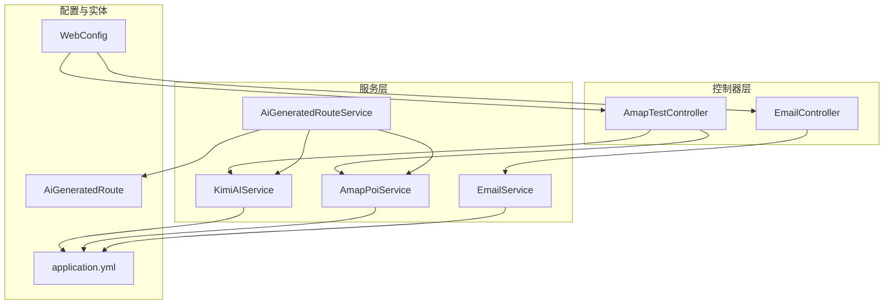
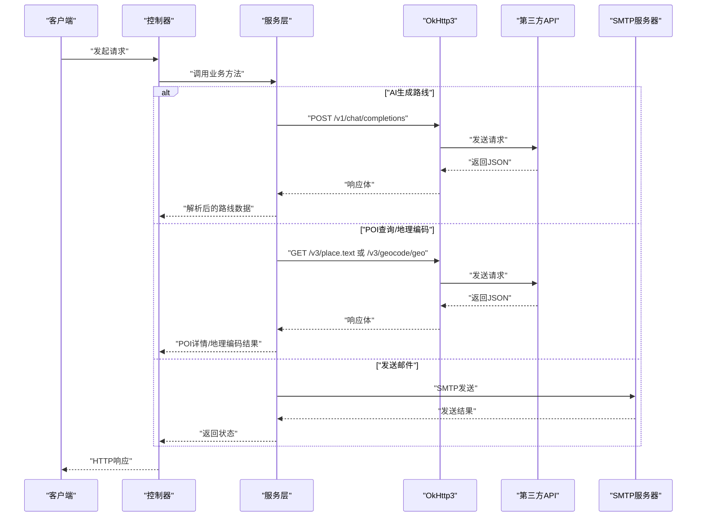
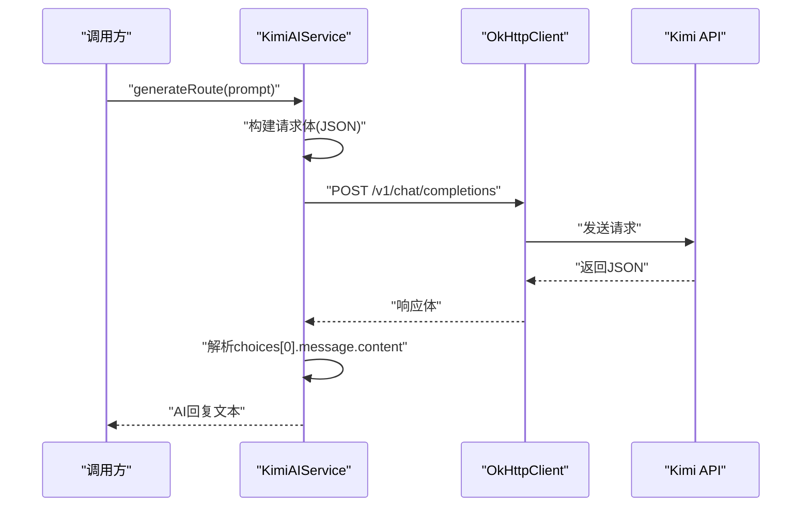
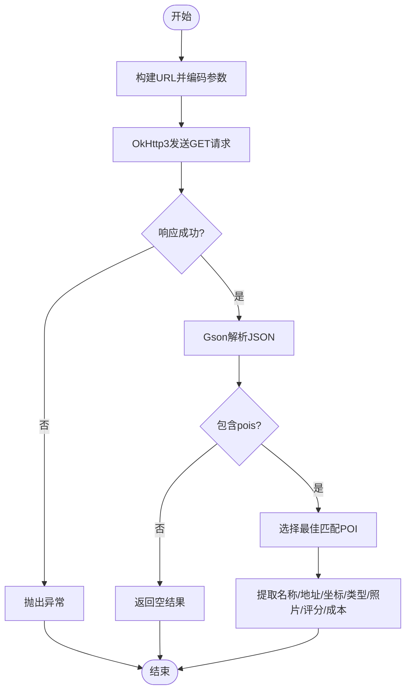
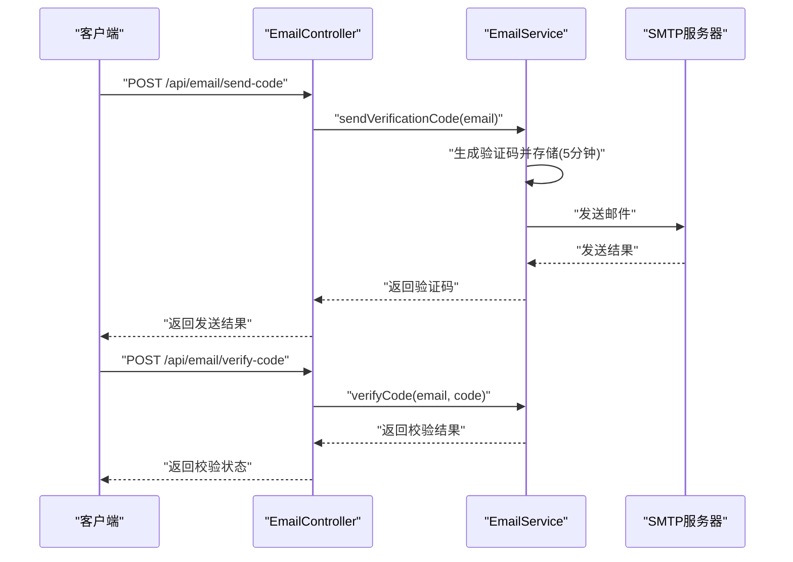
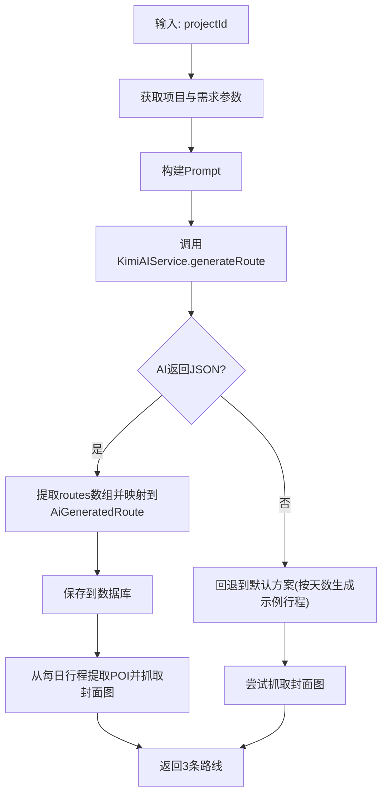
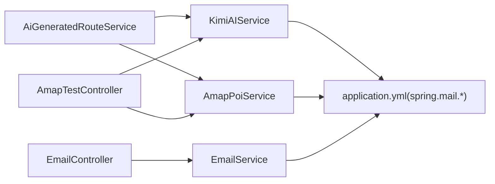

# 外部服务集成

<cite>
**本文引用的文件列表**
- [KimiAIService.java](file://tudianersha/src/main/java/com/tudianersha/service/KimiAIService.java)
- [AmapPoiService.java](file://tudianersha/src/main/java/com/tudianersha/service/AmapPoiService.java)
- [EmailService.java](file://tudianersha/src/main/java/com/tudianersha/service/EmailService.java)
- [AiGeneratedRouteService.java](file://tudianersha/src/main/java/com/tudianersha/service/AiGeneratedRouteService.java)
- [AmapTestController.java](file://tudianersha/src/main/java/com/tudianersha/controller/AmapTestController.java)
- [EmailController.java](file://tudianersha/src/main/java/com/tudianersha/controller/EmailController.java)
- [application.yml](file://tudianersha/src/main/resources/application.yml)
- [WebConfig.java](file://tudianersha/src/main/java/com/tudianersha/config/WebConfig.java)
- [AiGeneratedRoute.java](file://tudianersha/src/main/java/com/tudianersha/entity/AiGeneratedRoute.java)
</cite>

## 目录
1. [引言](#引言)
2. [项目结构](#项目结构)
3. [核心组件](#核心组件)
4. [架构总览](#架构总览)
5. [详细组件分析](#详细组件分析)
6. [依赖关系分析](#依赖关系分析)
7. [性能与可靠性](#性能与可靠性)
8. [故障排查指南](#故障排查指南)
9. [结论](#结论)
10. [附录](#附录)

## 引言
本文件聚焦系统与第三方服务的集成实现，围绕以下目标展开：
- KimiAIService 使用 OkHttp3 向 https://api.moonshot.cn/v1/chat/completions 发送 POST 请求，携带 API 密钥与用户需求参数，解析返回的 JSON 并生成个性化旅行路线。
- AmapPoiService 调用高德地图 POI 搜索 API（amap.api.key）获取景点信息，并提供地理编码、自动补全与图片抓取能力。
- EmailService 通过 QQ 邮箱 SMTP 服务器发送项目邀请邮件。
- 结合 application.yml 中的配置项，说明敏感信息（如密码、API 密钥）的外部化管理。
- 提供集成时序图，展示请求-响应流程。
- 讨论超时处理、重试机制与错误降级策略。
- 为开发者提供测试集成的沙箱环境建议。

## 项目结构
系统采用典型的 Spring Boot 分层架构，控制器负责对外接口，服务层编排业务逻辑，实体与仓库负责数据持久化，配置文件集中管理外部化配置。

图表来源
- [AmapTestController.java](file://tudianersha/src/main/java/com/tudianersha/controller/AmapTestController.java#L1-L173)
- [EmailController.java](file://tudianersha/src/main/java/com/tudianersha/controller/EmailController.java#L1-L82)
- [KimiAIService.java](file://tudianersha/src/main/java/com/tudianersha/service/KimiAIService.java#L1-L176)
- [AmapPoiService.java](file://tudianersha/src/main/java/com/tudianersha/service/AmapPoiService.java#L1-L363)
- [AiGeneratedRouteService.java](file://tudianersha/src/main/java/com/tudianersha/service/AiGeneratedRouteService.java#L1-L486)
- [EmailService.java](file://tudianersha/src/main/java/com/tudianersha/service/EmailService.java#L1-L105)
- [application.yml](file://tudianersha/src/main/resources/application.yml#L1-L57)
- [WebConfig.java](file://tudianersha/src/main/java/com/tudianersha/config/WebConfig.java#L1-L24)
- [AiGeneratedRoute.java](file://tudianersha/src/main/java/com/tudianersha/entity/AiGeneratedRoute.java#L1-L193)

章节来源
- [AmapTestController.java](file://tudianersha/src/main/java/com/tudianersha/controller/AmapTestController.java#L1-L173)
- [EmailController.java](file://tudianersha/src/main/java/com/tudianersha/controller/EmailController.java#L1-L82)
- [application.yml](file://tudianersha/src/main/resources/application.yml#L1-L57)
- [WebConfig.java](file://tudianersha/src/main/java/com/tudianersha/config/WebConfig.java#L1-L24)

## 核心组件
- KimiAIService：封装 OkHttp3 客户端，构建请求体，设置 Authorization 与 Content-Type 头，执行 POST 请求，解析 JSON 并提取 AI 回复内容；支持生成旅行路线与景点介绍两种场景。
- AmapPoiService：封装 OkHttp3 客户端，提供 POI 文本搜索、自动补全、地理编码、图片抓取与评分成本等能力；对高德 API 的响应进行安全解析与容错。
- EmailService：基于 JavaMailSender，发送验证码邮件；本地内存存储验证码（开发态），支持校验与过期控制。
- AiGeneratedRouteService：编排旅行路线生成流程，聚合项目与需求参数，构建 Prompt，调用 KimiAIService，解析并落库 AiGeneratedRoute 实体；若 AI 返回异常，回退到默认方案并尝试抓取封面图。
- 控制器：AmapTestController 提供 POI 查询、景点介绍、地理编码等测试接口；EmailController 提供验证码发送与校验接口。

章节来源
- [KimiAIService.java](file://tudianersha/src/main/java/com/tudianersha/service/KimiAIService.java#L1-L176)
- [AmapPoiService.java](file://tudianersha/src/main/java/com/tudianersha/service/AmapPoiService.java#L1-L363)
- [EmailService.java](file://tudianersha/src/main/java/com/tudianersha/service/EmailService.java#L1-L105)
- [AiGeneratedRouteService.java](file://tudianersha/src/main/java/com/tudianersha/service/AiGeneratedRouteService.java#L1-L486)
- [AmapTestController.java](file://tudianersha/src/main/java/com/tudianersha/controller/AmapTestController.java#L1-L173)
- [EmailController.java](file://tudianersha/src/main/java/com/tudianersha/controller/EmailController.java#L1-L82)

## 架构总览
系统通过 OkHttp3 与第三方 REST API 交互，通过 JavaMailSender 与 SMTP 交互，通过 Spring 配置文件集中管理敏感信息与服务地址。整体流程如下：

图表来源
- [KimiAIService.java](file://tudianersha/src/main/java/com/tudianersha/service/KimiAIService.java#L44-L98)
- [AmapPoiService.java](file://tudianersha/src/main/java/com/tudianersha/service/AmapPoiService.java#L44-L194)
- [EmailService.java](file://tudianersha/src/main/java/com/tudianersha/service/EmailService.java#L29-L54)
- [AmapTestController.java](file://tudianersha/src/main/java/com/tudianersha/controller/AmapTestController.java#L23-L121)
- [EmailController.java](file://tudianersha/src/main/java/com/tudianersha/controller/EmailController.java#L23-L81)

## 详细组件分析

### KimiAIService 组件分析
- 配置注入：从 application.yml 读取 kimi.api.key、kimi.api.url、kimi.api.model。
- OkHttp3 客户端：设置连接、写入、读取超时，满足 AI 生成较长响应的需求。
- 请求构建：构造 JSON 请求体，包含 system 与 user 角色消息；设置 Authorization 与 Content-Type 头。
- 响应解析：解析 choices 数组，提取第一条 choice 的 message.content。
- 错误处理：非成功响应抛出异常；响应格式不符合预期时抛出异常。
- 两个入口：
  - generateRoute：生成旅行路线。
  - generateAttractionIntroduction：生成景点介绍。

图表来源
- [KimiAIService.java](file://tudianersha/src/main/java/com/tudianersha/service/KimiAIService.java#L44-L98)

章节来源
- [KimiAIService.java](file://tudianersha/src/main/java/com/tudianersha/service/KimiAIService.java#L1-L176)
- [application.yml](file://tudianersha/src/main/resources/application.yml#L47-L53)

### AmapPoiService 组件分析
- 配置注入：从 application.yml 读取 amap.api.key，默认值存在以提升可用性。
- OkHttp3 客户端：设置连接与读取超时。
- 功能点：
  - searchPoiWithPhotos：按关键字与城市搜索 POI，计算最佳匹配，提取名称、地址、坐标、类型、照片、评分与成本。
  - getPoiPhotoUrl：返回 POI 第一张照片 URL，失败时返回占位图。
  - searchPoi：自动补全搜索，返回 POI 列表。
  - geocode：地理编码，解析城市、省、区信息。
- 安全解析：对高德 API 可能返回空数组或混合类型的字段进行安全判断与类型转换。
- 日志与调试：打印请求 URL、原始响应与关键字段，便于问题定位。

图表来源
- [AmapPoiService.java](file://tudianersha/src/main/java/com/tudianersha/service/AmapPoiService.java#L44-L194)

章节来源
- [AmapPoiService.java](file://tudianersha/src/main/java/com/tudianersha/service/AmapPoiService.java#L1-L363)
- [application.yml](file://tudianersha/src/main/resources/application.yml#L54-L57)

### EmailService 组件分析
- 配置注入：从 application.yml 读取 spring.mail.host、port、username、password、SMTP 参数与默认编码。
- JavaMailSender：Spring 提供的邮件发送组件。
- 发送验证码：生成6位随机验证码，记录有效期（5分钟），通过 SMTP 发送。
- 验证码校验：检查是否存在、是否过期、是否匹配，匹配成功后清理缓存。
- 控制器：EmailController 提供 /api/email/send-code 与 /api/email/verify-code 接口。

图表来源
- [EmailService.java](file://tudianersha/src/main/java/com/tudianersha/service/EmailService.java#L29-L82)
- [EmailController.java](file://tudianersha/src/main/java/com/tudianersha/controller/EmailController.java#L23-L81)
- [application.yml](file://tudianersha/src/main/resources/application.yml#L21-L38)

章节来源
- [EmailService.java](file://tudianersha/src/main/java/com/tudianersha/service/EmailService.java#L1-L105)
- [EmailController.java](file://tudianersha/src/main/java/com/tudianersha/controller/EmailController.java#L1-L82)
- [application.yml](file://tudianersha/src/main/resources/application.yml#L21-L38)

### AiGeneratedRouteService 组件分析
- 编排流程：获取项目与需求参数 → 构建 Prompt → 调用 KimiAIService 生成路线 → 解析 JSON → 落库 AiGeneratedRoute → 封面图抓取。
- Prompt 构建：包含项目基本信息、参与人数与需求汇总，并要求严格 JSON 格式输出。
- JSON 解析：支持 Markdown 代码块包裹的 JSON 与裸 JSON；解析失败时回退到默认方案，按天数生成示例行程并尝试抓取封面图。
- 封面图提取：从每日行程中抽取景点名称，调用 AmapPoiService.getPoiPhotoUrl 获取图片 URL，最多收集6张并合并为逗号分隔字符串。

图表来源
- [AiGeneratedRouteService.java](file://tudianersha/src/main/java/com/tudianersha/service/AiGeneratedRouteService.java#L70-L192)
- [AiGeneratedRouteService.java](file://tudianersha/src/main/java/com/tudianersha/service/AiGeneratedRouteService.java#L194-L360)
- [AiGeneratedRouteService.java](file://tudianersha/src/main/java/com/tudianersha/service/AiGeneratedRouteService.java#L362-L486)
- [AiGeneratedRoute.java](file://tudianersha/src/main/java/com/tudianersha/entity/AiGeneratedRoute.java#L1-L193)

章节来源
- [AiGeneratedRouteService.java](file://tudianersha/src/main/java/com/tudianersha/service/AiGeneratedRouteService.java#L1-L486)
- [AiGeneratedRoute.java](file://tudianersha/src/main/java/com/tudianersha/entity/AiGeneratedRoute.java#L1-L193)

## 依赖关系分析
- 组件耦合：
  - AiGeneratedRouteService 依赖 KimiAIService 与 AmapPoiService，形成“AI生成 + POI数据”的闭环。
  - 控制器层仅依赖对应服务，职责清晰。
- 外部依赖：
  - OkHttp3：用于 HTTP 请求。
  - Gson：用于 JSON 解析。
  - JavaMailSender：用于 SMTP 邮件发送。
- 配置依赖：
  - application.yml 管理 Kimi 与高德 API 密钥、模型、SMTP 参数等。

图表来源
- [AiGeneratedRouteService.java](file://tudianersha/src/main/java/com/tudianersha/service/AiGeneratedRouteService.java#L22-L42)
- [AmapTestController.java](file://tudianersha/src/main/java/com/tudianersha/controller/AmapTestController.java#L13-L22)
- [EmailController.java](file://tudianersha/src/main/java/com/tudianersha/controller/EmailController.java#L12-L19)
- [application.yml](file://tudianersha/src/main/resources/application.yml#L21-L57)

章节来源
- [AiGeneratedRouteService.java](file://tudianersha/src/main/java/com/tudianersha/service/AiGeneratedRouteService.java#L22-L42)
- [application.yml](file://tudianersha/src/main/resources/application.yml#L21-L57)

## 性能与可靠性
- 超时策略
  - KimiAIService：连接/写入/读取超时均设置为较长时间，满足 AI 生成较长响应的需要。
  - AmapPoiService：连接/读取超时较短，避免阻塞。
- 重试机制
  - 当前实现未内置重试；可在 OkHttp3 层通过自定义拦截器或在服务层增加重试逻辑（建议指数退避）。
- 错误降级
  - AI 生成失败时，AiGeneratedRouteService 回退到默认方案，按天数生成示例行程并尝试抓取封面图，保证用户体验。
  - POI 查询失败时，返回占位图，避免前端崩溃。
- CORS 放通
  - WebConfig 对 /api/** 放通跨域，便于前端联调。

章节来源
- [KimiAIService.java](file://tudianersha/src/main/java/com/tudianersha/service/KimiAIService.java#L28-L35)
- [AmapPoiService.java](file://tudianersha/src/main/java/com/tudianersha/service/AmapPoiService.java#L29-L35)
- [AiGeneratedRouteService.java](file://tudianersha/src/main/java/com/tudianersha/service/AiGeneratedRouteService.java#L294-L357)
- [WebConfig.java](file://tudianersha/src/main/java/com/tudianersha/config/WebConfig.java#L11-L23)

## 故障排查指南
- Kimi API 失败
  - 现象：IOException 抛出，响应非成功。
  - 排查：确认 kimi.api.key、kimi.api.url、kimi.api.model 是否正确；检查网络连通性与第三方配额。
  - 参考路径：[KimiAIService.generateRoute](file://tudianersha/src/main/java/com/tudianersha/service/KimiAIService.java#L77-L98)
- 高德 POI 查询失败
  - 现象：IOException 抛出，或返回空结果。
  - 排查：确认 amap.api.key 是否正确；检查关键字与城市编码；查看日志中的原始响应。
  - 参考路径：[AmapPoiService.searchPoiWithPhotos](file://tudianersha/src/main/java/com/tudianersha/service/AmapPoiService.java#L62-L194)
- 邮件发送失败
  - 现象：EmailService 抛出异常并记录错误。
  - 排查：确认 spring.mail.username、password、host、port、SMTP 启用 TLS；检查防火墙与账号授权。
  - 参考路径：[EmailService.sendVerificationCode](file://tudianersha/src/main/java/com/tudianersha/service/EmailService.java#L29-L54)
- AI 解析失败
  - 现象：JSON 解析异常，触发回退逻辑。
  - 排查：检查 Prompt 是否满足严格 JSON 输出要求；查看 AI 原始响应。
  - 参考路径：[AiGeneratedRouteService.parseAndSaveRoutes](file://tudianersha/src/main/java/com/tudianersha/service/AiGeneratedRouteService.java#L194-L360)

章节来源
- [KimiAIService.java](file://tudianersha/src/main/java/com/tudianersha/service/KimiAIService.java#L77-L98)
- [AmapPoiService.java](file://tudianersha/src/main/java/com/tudianersha/service/AmapPoiService.java#L62-L194)
- [EmailService.java](file://tudianersha/src/main/java/com/tudianersha/service/EmailService.java#L29-L54)
- [AiGeneratedRouteService.java](file://tudianersha/src/main/java/com/tudianersha/service/AiGeneratedRouteService.java#L194-L360)

## 结论
本系统通过 OkHttp3 与 JavaMailSender 与 Kimi、高德地图、QQ 邮箱等第三方服务完成深度集成。通过 application.yml 外部化敏感配置，结合严格的错误处理与回退策略，实现了较为稳健的旅行路线生成与邮件邀请功能。建议后续引入重试与熔断、监控埋点与日志分级，进一步提升稳定性与可观测性。

## 附录
- 配置项说明（来自 application.yml）
  - Kimi 相关：kimi.api.key、kimi.api.url、kimi.api.model
  - 高德地图：amap.api.key
  - 邮件 SMTP：spring.mail.host、port、username、password、SMTP 启用参数
- 测试建议
  - 沙箱环境：使用高德地图测试密钥与 Kimi 免费额度；使用 QQ 邮箱测试账号（建议专用测试邮箱）。
  - 联调接口：
    - POI 测试：/api/amap-test/poi-detail、/api/amap-test/poi-search、/api/amap-test/geocode
    - AI 介绍：/api/amap-test/attraction-intro
    - 邮件：/api/email/send-code、/api/email/verify-code

章节来源
- [application.yml](file://tudianersha/src/main/resources/application.yml#L21-L57)
- [AmapTestController.java](file://tudianersha/src/main/java/com/tudianersha/controller/AmapTestController.java#L23-L171)
- [EmailController.java](file://tudianersha/src/main/java/com/tudianersha/controller/EmailController.java#L23-L81)