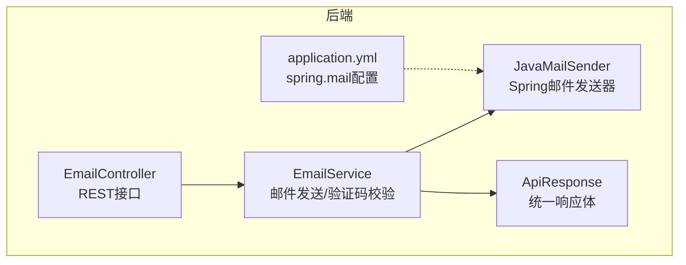
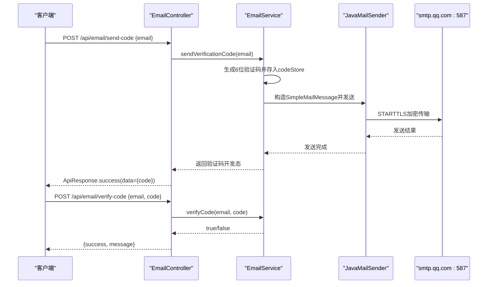
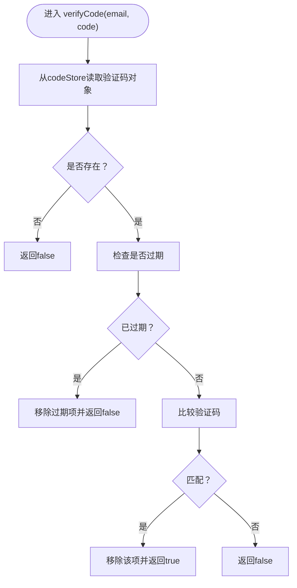
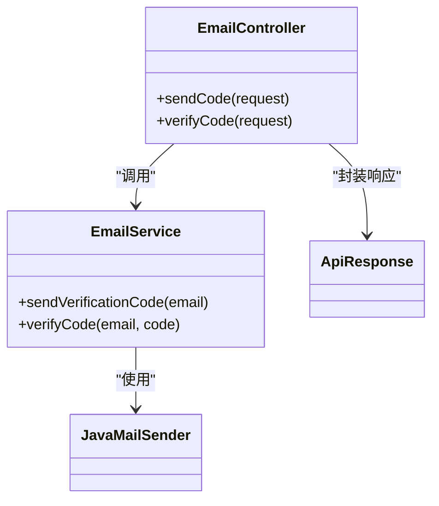

# 邮件服务集成

<cite>
**本文引用的文件**
- [EmailService.java](file://tudianersha/src/main/java/com/tudianersha/service/EmailService.java)
- [EmailController.java](file://tudianersha/src/main/java/com/tudianersha/controller/EmailController.java)
- [application.yml](file://tudianersha/src/main/resources/application.yml)
- [pom.xml](file://tudianersha/pom.xml)
- [ApiResponse.java](file://tudianersha/src/main/java/com/tudianersha/dto/ApiResponse.java)
- [Application.java](file://tudianersha/src/main/java/com/tudianersha/Application.java)
</cite>

## 目录
1. [简介](#简介)
2. [项目结构](#项目结构)
3. [核心组件](#核心组件)
4. [架构总览](#架构总览)
5. [详细组件分析](#详细组件分析)
6. [依赖关系分析](#依赖关系分析)
7. [性能与可扩展性](#性能与可扩展性)
8. [故障排查指南](#故障排查指南)
9. [结论](#结论)
10. [附录](#附录)

## 简介
本文件面向开发者，系统化说明如何在本项目中集成QQ邮箱SMTP服务，实现“发送验证码邮件”和“校验验证码”的端到端流程。内容覆盖：
- 基于Spring的JavaMailSender与QQ邮箱smtp.qq.com:587、STARTTLS加密的配置要点
- sendVerificationCode方法的验证码生成、存储与发送逻辑
- verifyCode方法的匹配与过期校验
- application.yml中spring.mail各字段的含义与设置
- 临时验证码存储的局限性与生产建议
- 异常处理与日志记录
- 邮件模板自定义与测试环境配置建议

## 项目结构
与邮件功能直接相关的模块位于以下路径：
- 控制器：EmailController 提供对外接口
- 服务层：EmailService 封装邮件发送与验证码校验
- 配置：application.yml 中的spring.mail配置
- 依赖：pom.xml 中引入spring-boot-starter-mail
- 统一响应：ApiResponse 统一前后端返回格式

图表来源
- [EmailController.java](file://tudianersha/src/main/java/com/tudianersha/controller/EmailController.java#L1-L82)
- [EmailService.java](file://tudianersha/src/main/java/com/tudianersha/service/EmailService.java#L1-L105)
- [application.yml](file://tudianersha/src/main/resources/application.yml#L21-L38)
- [ApiResponse.java](file://tudianersha/src/main/java/com/tudianersha/dto/ApiResponse.java#L1-L79)

章节来源
- [EmailController.java](file://tudianersha/src/main/java/com/tudianersha/controller/EmailController.java#L1-L82)
- [EmailService.java](file://tudianersha/src/main/java/com/tudianersha/service/EmailService.java#L1-L105)
- [application.yml](file://tudianersha/src/main/resources/application.yml#L21-L38)
- [pom.xml](file://tudianersha/pom.xml#L85-L90)
- [ApiResponse.java](file://tudianersha/src/main/java/com/tudianersha/dto/ApiResponse.java#L1-L79)

## 核心组件
- EmailController：暴露/send-code与/verify-code两个接口，负责参数校验与调用EmailService，并以ApiResponse封装返回。
- EmailService：核心业务实现，包括：
  - 生成6位数字验证码
  - 使用内存Map存储验证码及过期时间（开发态）
  - 通过JavaMailSender发送文本邮件
  - 校验验证码是否匹配且未过期
- application.yml：定义QQ邮箱SMTP服务器、端口、账号、授权码以及STARTTLS等安全属性。
- pom.xml：声明spring-boot-starter-mail依赖，确保JavaMailSender可用。

章节来源
- [EmailController.java](file://tudianersha/src/main/java/com/tudianersha/controller/EmailController.java#L1-L82)
- [EmailService.java](file://tudianersha/src/main/java/com/tudianersha/service/EmailService.java#L1-L105)
- [application.yml](file://tudianersha/src/main/resources/application.yml#L21-L38)
- [pom.xml](file://tudianersha/pom.xml#L85-L90)
- [ApiResponse.java](file://tudianersha/src/main/java/com/tudianersha/dto/ApiResponse.java#L1-L79)

## 架构总览
下图展示从客户端到服务端再到QQ邮箱SMTP的调用链路与关键对象交互。

图表来源
- [EmailController.java](file://tudianersha/src/main/java/com/tudianersha/controller/EmailController.java#L23-L80)
- [EmailService.java](file://tudianersha/src/main/java/com/tudianersha/service/EmailService.java#L29-L82)
- [application.yml](file://tudianersha/src/main/resources/application.yml#L21-L38)

## 详细组件分析

### EmailService：验证码发送与校验
- 验证码生成
  - 采用6位数字格式，范围000000~999999。
  - 生成后写入codeStore，键为邮箱地址，值为包含验证码与过期时间的对象。
- 邮件发送
  - 使用JavaMailSender发送SimpleMailMessage，主题与正文包含验证码提示与有效期说明。
  - 发生异常时抛出运行时异常，并输出错误日志。
- 验证码校验
  - 若无对应邮箱记录，直接返回失败。
  - 若当前时间超过过期时间，清理并返回失败。
  - 若验证码匹配，清理该条目并返回成功；否则返回失败。

图表来源
- [EmailService.java](file://tudianersha/src/main/java/com/tudianersha/service/EmailService.java#L56-L82)

章节来源
- [EmailService.java](file://tudianersha/src/main/java/com/tudianersha/service/EmailService.java#L29-L82)

### EmailController：接口与参数校验
- /api/email/send-code
  - 参数：email（必填，格式校验）
  - 调用EmailService发送验证码
  - 开发环境会将验证码放入响应数据（生产环境应移除）
- /api/email/verify-code
  - 参数：email、code（均不可为空）
  - 调用EmailService进行校验，返回success与message

章节来源
- [EmailController.java](file://tudianersha/src/main/java/com/tudianersha/controller/EmailController.java#L23-L80)
- [ApiResponse.java](file://tudianersha/src/main/java/com/tudianersha/dto/ApiResponse.java#L20-L53)

### application.yml：QQ邮箱SMTP配置
- host：smtp.qq.com
- port：587
- username：发件邮箱（示例为QQ邮箱）
- password：授权码（非登录密码）
- properties.mail.smtp.auth：true
- properties.mail.smtp.starttls.enable：true
- properties.mail.smtp.starttls.required：true
- properties.mail.smtp.connectiontimeout/writeTimeout/timeout：均为5000毫秒
- default-encoding：UTF-8

章节来源
- [application.yml](file://tudianersha/src/main/resources/application.yml#L21-L38)

### pom.xml：依赖声明
- spring-boot-starter-mail：提供JavaMailSender自动装配能力

章节来源
- [pom.xml](file://tudianersha/pom.xml#L85-L90)

## 依赖关系分析
- EmailController 依赖 EmailService
- EmailService 依赖 JavaMailSender（由Spring Boot自动装配）
- JavaMailSender 的行为受 application.yml 中 spring.mail 配置影响
- EmailController 使用 ApiResponse 统一封装响应

图表来源
- [EmailController.java](file://tudianersha/src/main/java/com/tudianersha/controller/EmailController.java#L1-L82)
- [EmailService.java](file://tudianersha/src/main/java/com/tudianersha/service/EmailService.java#L1-L105)
- [ApiResponse.java](file://tudianersha/src/main/java/com/tudianersha/dto/ApiResponse.java#L1-L79)

章节来源
- [EmailController.java](file://tudianersha/src/main/java/com/tudianersha/controller/EmailController.java#L1-L82)
- [EmailService.java](file://tudianersha/src/main/java/com/tudianersha/service/EmailService.java#L1-L105)
- [ApiResponse.java](file://tudianersha/src/main/java/com/tudianersha/dto/ApiResponse.java#L1-L79)

## 性能与可扩展性
- 验证码存储
  - 当前使用内存Map（codeStore），存在以下限制：
    - 应用重启后数据丢失
    - 单机部署时无法跨实例共享
    - 不支持高并发下的原子性与一致性
  - 生产建议：改用Redis等分布式缓存，具备过期策略、持久化与集群能力。
- 并发与线程安全
  - codeStore为HashMap，非线程安全；在高并发场景可能产生竞态条件。
  - 建议使用线程安全容器或加锁保护，或迁移到Redis。
- 超时与重试
  - application.yml中设置了连接、读写超时，建议在业务侧增加重试与熔断策略。
- 日志与监控
  - 当前使用System.out/System.err输出日志，建议接入统一日志框架（如SLF4J+Logback）并结合监控系统追踪发送成功率与耗时。

[本节为通用建议，不直接分析具体文件]

## 故障排查指南
- 发送失败
  - 现象：接口返回“发送失败，请稍后重试”，控制台打印错误信息
  - 排查要点：
    - 确认QQ邮箱授权码正确（非登录密码）
    - 检查网络连通性与防火墙对587端口放行
    - 查看STARTTLS配置是否启用且为必需
    - 关注JavaMailSender异常堆栈
- 验证失败
  - 现象：/verify-code返回success=false
  - 排查要点：
    - 确认邮箱与验证码均非空
    - 检查codeStore是否过期被清理
    - 核对验证码大小写与前后空格
- 开发环境返回验证码
  - 现象：/send-code响应中包含code字段
  - 建议：生产环境移除该行为，避免泄露

章节来源
- [EmailController.java](file://tudianersha/src/main/java/com/tudianersha/controller/EmailController.java#L23-L57)
- [EmailService.java](file://tudianersha/src/main/java/com/tudianersha/service/EmailService.java#L36-L54)
- [application.yml](file://tudianersha/src/main/resources/application.yml#L21-L38)

## 结论
本项目通过Spring JavaMailSender与QQ邮箱SMTP实现了基础的验证码邮件发送与校验流程。配置上遵循smtp.qq.com:587与STARTTLS加密要求，业务上以内存Map存储验证码，满足单机开发需求。生产环境中建议替换为Redis等分布式存储，完善并发控制、日志与监控体系，并移除开发态的验证码透传。

[本节为总结性内容，不直接分析具体文件]

## 附录

### API定义与调用建议
- 发送验证码
  - 方法：POST /api/email/send-code
  - 请求体：{ "email": "xxx@xx.com" }
  - 响应：ApiResponse，data包含code（开发态）
- 校验验证码
  - 方法：POST /api/email/verify-code
  - 请求体：{ "email": "xxx@xx.com", "code": "123456" }
  - 响应：{ "success": true/false, "message": "..." }

章节来源
- [EmailController.java](file://tudianersha/src/main/java/com/tudianersha/controller/EmailController.java#L23-L80)
- [ApiResponse.java](file://tudianersha/src/main/java/com/tudianersha/dto/ApiResponse.java#L20-L53)

### spring.mail配置要点说明
- host：SMTP服务器地址（QQ邮箱为smtp.qq.com）
- port：端口（587）
- username/password：发件邮箱与授权码
- properties.mail.smtp.auth：开启认证
- properties.mail.smtp.starttls.enable/required：启用并强制STARTTLS
- timeout相关：连接、读写、发送超时均为5000毫秒
- default-encoding：UTF-8

章节来源
- [application.yml](file://tudianersha/src/main/resources/application.yml#L21-L38)

### 邮件模板自定义建议
- 主题与正文：可在EmailService中按需调整SimpleMailMessage的subject与text
- HTML模板：若需要富文本，可切换为MimeMessage并使用HTML模板引擎（如Thymeleaf）
- 多语言：根据用户偏好动态选择语言版本的主题与正文

[本节为通用建议，不直接分析具体文件]

### 测试环境配置建议
- 开发环境
  - 可保留/verify-code接口用于快速联调
  - 仍建议关闭/移除响应中的验证码字段
- 测试环境
  - 使用独立的测试邮箱账号与授权码
  - 适当降低验证码有效期以便测试
- 生产环境
  - 使用Redis存储验证码
  - 启用更严格的超时与重试策略
  - 完善日志与告警，监控发送成功率与延迟

[本节为通用建议，不直接分析具体文件]