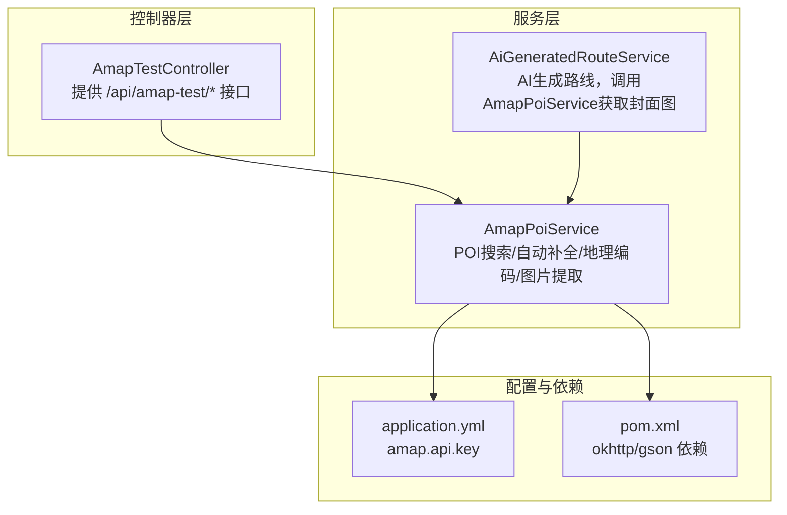
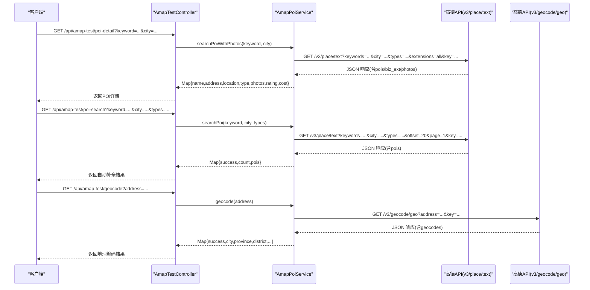
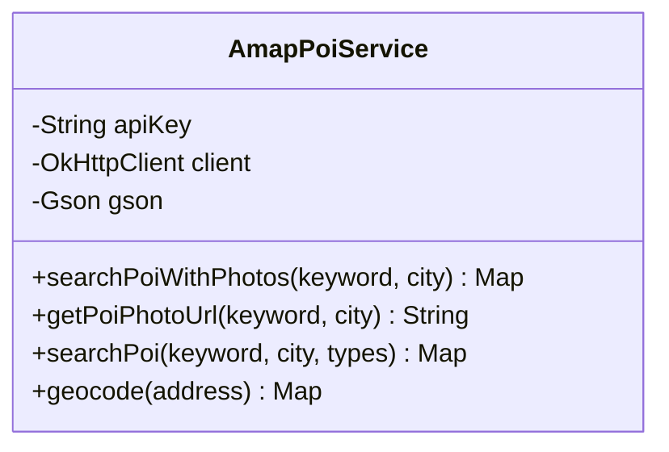
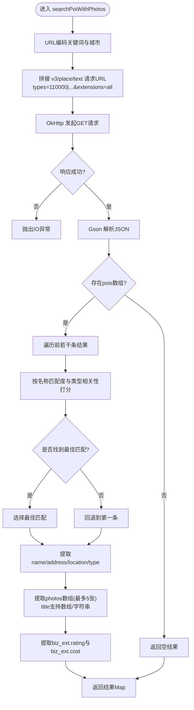
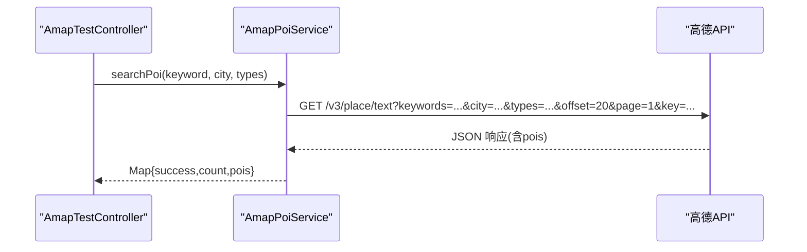
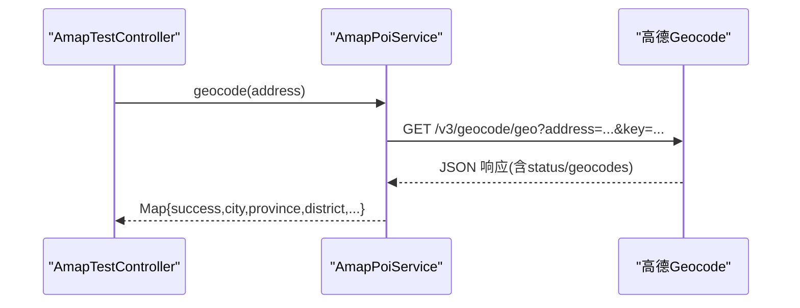
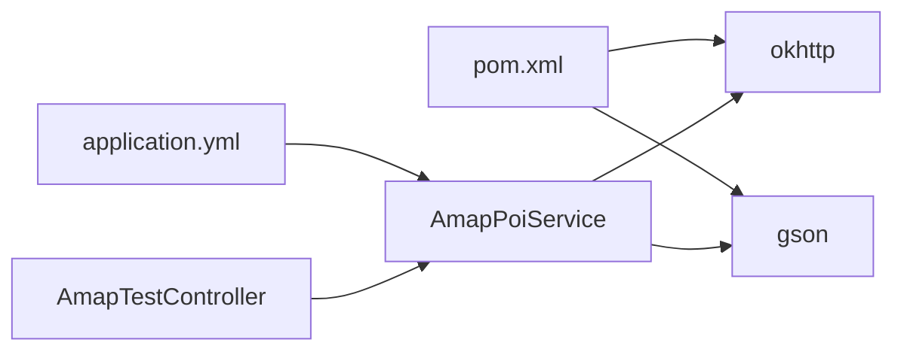

# 高德地图集成

<cite>
**本文引用的文件列表**
- [AmapPoiService.java](file://tudianersha/src/main/java/com/tudianersha/service/AmapPoiService.java)
- [AmapTestController.java](file://tudianersha/src/main/java/com/tudianersha/controller/AmapTestController.java)
- [AiGeneratedRouteService.java](file://tudianersha/src/main/java/com/tudianersha/service/AiGeneratedRouteService.java)
- [application.yml](file://tudianersha/src/main/resources/application.yml)
- [pom.xml](file://tudianersha/pom.xml)
</cite>

## 目录
1. [简介](#简介)
2. [项目结构](#项目结构)
3. [核心组件](#核心组件)
4. [架构总览](#架构总览)
5. [详细组件分析](#详细组件分析)
6. [依赖关系分析](#依赖关系分析)
7. [性能与超时配置](#性能与超时配置)
8. [API请求/响应与数据结构](#api请求响应与数据结构)
9. [容错与异常处理](#容错与异常处理)
10. [集成测试与排障指南](#集成测试与排障指南)
11. [结论](#结论)

## 简介
本文件面向开发者，系统性解析 AmapPoiService 与高德地图 API 的集成实现，重点覆盖：
- searchPoiWithPhotos 如何调用 v3/place/text 获取 POI 并附带图片等扩展信息
- types 参数过滤景点类型（110000|120000|130000|140000）
- extensions=all 获取扩展信息（如图片）
- 结果筛选算法：名称匹配度（完全匹配、包含、前缀）与类型相关性（景点/旅游/公园）打分，选择最佳匹配
- getPoiPhotoUrl、searchPoi（自动补全）、geocode（地理编码）方法的实现逻辑
- application.yml 中 amap.api.key 的注入与默认值机制
- OkHttpClient 的 30 秒连接/读取超时设置
- API 请求/响应示例与字段解析要点
- 对空数组、缺失字段等高德返回数据的容错处理
- 集成测试与异常排查建议

## 项目结构
该模块围绕“服务层 + 控制器”的分层设计组织，AmapPoiService 作为服务层负责与高德 API 交互；控制器对外暴露 REST 接口；应用配置通过 application.yml 注入；依赖通过 Maven 引入。

图表来源
- [AmapTestController.java](file://tudianersha/src/main/java/com/tudianersha/controller/AmapTestController.java#L1-L173)
- [AmapPoiService.java](file://tudianersha/src/main/java/com/tudianersha/service/AmapPoiService.java#L1-L363)
- [AiGeneratedRouteService.java](file://tudianersha/src/main/java/com/tudianersha/service/AiGeneratedRouteService.java#L1-L486)
- [application.yml](file://tudianersha/src/main/resources/application.yml#L1-L57)
- [pom.xml](file://tudianersha/pom.xml#L1-L180)

章节来源
- [AmapTestController.java](file://tudianersha/src/main/java/com/tudianersha/controller/AmapTestController.java#L1-L173)
- [AmapPoiService.java](file://tudianersha/src/main/java/com/tudianersha/service/AmapPoiService.java#L1-L363)
- [AiGeneratedRouteService.java](file://tudianersha/src/main/java/com/tudianersha/service/AiGeneratedRouteService.java#L1-L486)
- [application.yml](file://tudianersha/src/main/resources/application.yml#L1-L57)
- [pom.xml](file://tudianersha/pom.xml#L1-L180)

## 核心组件
- AmapPoiService：封装高德 POI 搜索、自动补全、地理编码、图片提取与容错处理
- AmapTestController：对外提供测试接口，验证 POI 搜索、详情、图片、自动补全、地理编码
- AiGeneratedRouteService：在生成 AI 路线时，调用 AmapPoiService 获取封面图

章节来源
- [AmapPoiService.java](file://tudianersha/src/main/java/com/tudianersha/service/AmapPoiService.java#L1-L363)
- [AmapTestController.java](file://tudianersha/src/main/java/com/tudianersha/controller/AmapTestController.java#L1-L173)
- [AiGeneratedRouteService.java](file://tudianersha/src/main/java/com/tudianersha/service/AiGeneratedRouteService.java#L1-L486)

## 架构总览
下图展示从控制器到服务层再到高德 API 的调用链路，以及关键数据流。

图表来源
- [AmapTestController.java](file://tudianersha/src/main/java/com/tudianersha/controller/AmapTestController.java#L1-L173)
- [AmapPoiService.java](file://tudianersha/src/main/java/com/tudianersha/service/AmapPoiService.java#L1-L363)

## 详细组件分析

### AmapPoiService 组件类图

图表来源
- [AmapPoiService.java](file://tudianersha/src/main/java/com/tudianersha/service/AmapPoiService.java#L1-L363)

章节来源
- [AmapPoiService.java](file://tudianersha/src/main/java/com/tudianersha/service/AmapPoiService.java#L1-L363)

### searchPoiWithPhotos 方法流程
- URL 编码：对关键词与城市进行 UTF-8 编码，确保中文字符安全传输
- 请求构造：调用 v3/place/text，设置 types=110000|120000|130000|140000 过滤景点类型，extensions=all 获取扩展信息（如图片）
- 结果筛选：遍历前若干条结果，按名称匹配度与类型相关性打分，选择最佳匹配；若无合适匹配则回退到第一条
- 字段提取：安全地提取 name/address/location/type；photos 数组中支持 title 为字符串或数组；biz_ext.rating/cost 提取评分与费用
- 返回结构：包含基础信息、图片数组（最多 5 张）、评分与费用

图表来源
- [AmapPoiService.java](file://tudianersha/src/main/java/com/tudianersha/service/AmapPoiService.java#L43-L193)

章节来源
- [AmapPoiService.java](file://tudianersha/src/main/java/com/tudianersha/service/AmapPoiService.java#L43-L193)

### searchPoi（自动补全）方法流程
- URL 编码：对关键词、城市、types 进行 UTF-8 编码
- 请求构造：调用 v3/place/text，offset=20，page=1，仅获取基础字段
- 结果封装：将 name/type/address/location 聚合成列表，返回 success/count/pois

图表来源
- [AmapPoiService.java](file://tudianersha/src/main/java/com/tudianersha/service/AmapPoiService.java#L228-L289)
- [AmapTestController.java](file://tudianersha/src/main/java/com/tudianersha/controller/AmapTestController.java#L123-L154)

章节来源
- [AmapPoiService.java](file://tudianersha/src/main/java/com/tudianersha/service/AmapPoiService.java#L228-L289)
- [AmapTestController.java](file://tudianersha/src/main/java/com/tudianersha/controller/AmapTestController.java#L123-L154)

### geocode（地理编码）方法流程
- URL 编码：对地址进行 UTF-8 编码
- 请求构造：调用 v3/geocode/geo
- 结果解析：校验 status=1，取 geocodes 第一个元素；city 可能为空数组或字符串，兼容 province fallback；输出 city/province/district

图表来源
- [AmapPoiService.java](file://tudianersha/src/main/java/com/tudianersha/service/AmapPoiService.java#L298-L360)
- [AmapTestController.java](file://tudianersha/src/main/java/com/tudianersha/controller/AmapTestController.java#L155-L172)

章节来源
- [AmapPoiService.java](file://tudianersha/src/main/java/com/tudianersha/service/AmapPoiService.java#L298-L360)
- [AmapTestController.java](file://tudianersha/src/main/java/com/tudianersha/controller/AmapTestController.java#L155-L172)

### getPoiPhotoUrl 方法
- 调用 searchPoiWithPhotos 获取 POI 详情
- 若存在 photos 且首张有 url，则返回该 URL；否则返回默认占位图

章节来源
- [AmapPoiService.java](file://tudianersha/src/main/java/com/tudianersha/service/AmapPoiService.java#L196-L219)

## 依赖关系分析
- 服务层依赖
  - OkHttp：发起 HTTP 请求
  - Gson：解析 JSON 响应
  - Spring @Value 注入 amap.api.key
- 控制器依赖
  - 自动装配 AmapPoiService，提供 REST 接口
- 应用配置
  - application.yml 中定义 amap.api.key
- 依赖管理
  - pom.xml 中引入 okhttp 与 gson

图表来源
- [pom.xml](file://tudianersha/pom.xml#L120-L169)
- [application.yml](file://tudianersha/src/main/resources/application.yml#L54-L57)
- [AmapPoiService.java](file://tudianersha/src/main/java/com/tudianersha/service/AmapPoiService.java#L1-L363)
- [AmapTestController.java](file://tudianersha/src/main/java/com/tudianersha/controller/AmapTestController.java#L1-L173)

章节来源
- [pom.xml](file://tudianersha/pom.xml#L120-L169)
- [application.yml](file://tudianersha/src/main/resources/application.yml#L54-L57)
- [AmapPoiService.java](file://tudianersha/src/main/java/com/tudianersha/service/AmapPoiService.java#L1-L363)
- [AmapTestController.java](file://tudianersha/src/main/java/com/tudianersha/controller/AmapTestController.java#L1-L173)

## 性能与超时配置
- OkHttpClient 默认超时
  - 连接超时：30 秒
  - 读取超时：30 秒
- 适用场景
  - 一般网络环境下的 POI 搜索与地理编码请求可满足大多数场景
  - 若网络波动较大，可考虑在服务层增加重试策略或调整超时

章节来源
- [AmapPoiService.java](file://tudianersha/src/main/java/com/tudianersha/service/AmapPoiService.java#L28-L34)

## API请求/响应与数据结构
- v3/place/text（POI 搜索）
  - URL 参数
    - keywords：关键词（已编码）
    - city：城市（已编码）
    - types：过滤景点类型（110000|120000|130000|140000）
    - offset/page：分页控制
    - key：高德 API 密钥
    - extensions=all：获取扩展信息（如图片）
  - 响应要点
    - pois：POI 列表
    - photos：图片数组，每项包含 url 与 title（可能为字符串或数组）
    - biz_ext：包含 rating 与 cost
- v3/geocode/geo（地理编码）
  - URL 参数
    - address：地址（已编码）
    - key：高德 API 密钥
  - 响应要点
    - status：1 表示成功
    - geocodes：结果数组，取首个元素
    - city/province/district：优先取 city，若为空数组则回退 province

章节来源
- [AmapPoiService.java](file://tudianersha/src/main/java/com/tudianersha/service/AmapPoiService.java#L43-L193)
- [AmapPoiService.java](file://tudianersha/src/main/java/com/tudianersha/service/AmapPoiService.java#L228-L289)
- [AmapPoiService.java](file://tudianersha/src/main/java/com/tudianersha/service/AmapPoiService.java#L298-L360)

## 容错与异常处理
- URL 编码
  - 对关键词、城市、types、地址统一进行 UTF-8 编码，避免特殊字符导致请求失败
- 响应校验
  - 对非成功状态直接抛出 IO 异常
  - 对 JSON 字段进行存在性与类型判断（isJsonPrimitive/isJsonArray），避免空数组/缺失字段引发异常
- 结果回退
  - 若最佳匹配未命中，回退到第一条结果
- 默认占位图
  - 当无法获取图片时，返回默认占位图 URL

章节来源
- [AmapPoiService.java](file://tudianersha/src/main/java/com/tudianersha/service/AmapPoiService.java#L43-L193)
- [AmapPoiService.java](file://tudianersha/src/main/java/com/tudianersha/service/AmapPoiService.java#L196-L219)

## 集成测试与排障指南
- 接口测试
  - POI 详情：GET /api/amap-test/poi-detail?keyword=...&city=...
  - POI 图片：GET /api/amap-test/poi-photo?keyword=...&city=...
  - 自动补全：GET /api/amap-test/poi-search?keyword=...&city=...&types=...
  - 地理编码：GET /api/amap-test/geocode?address=...
- 常见问题与排查
  - API 密钥无效
    - 确认 application.yml 中 amap.api.key 已正确填写
    - 若未配置，默认值来自服务层 @Value 的默认参数
  - 请求失败/超时
    - 检查网络连通性
    - 观察 OkHttpClient 超时设置（30 秒）
  - 返回空数组/无图片
    - 调整关键词与城市，或放宽 types 过滤条件
    - 使用自动补全接口先确认是否存在匹配结果
  - 字段缺失
    - 高德返回可能缺少 photos 或 biz_ext，代码已做安全判断；如仍异常，检查字段命名与版本差异
- 与 AI 生成路线联动
  - AiGeneratedRouteService 在生成路线时会调用 AmapPoiService.getPoiPhotoUrl 获取封面图，若失败会记录错误并继续流程

章节来源
- [AmapTestController.java](file://tudianersha/src/main/java/com/tudianersha/controller/AmapTestController.java#L1-L173)
- [AmapPoiService.java](file://tudianersha/src/main/java/com/tudianersha/service/AmapPoiService.java#L1-L363)
- [AiGeneratedRouteService.java](file://tudianersha/src/main/java/com/tudianersha/service/AiGeneratedRouteService.java#L320-L357)

## 结论
AmapPoiService 以简洁稳健的方式封装了高德地图 POI 搜索、自动补全与地理编码能力，并通过严格的字段校验与回退策略提升了鲁棒性。配合控制器提供的测试接口与 application.yml 的密钥注入机制，开发者可以快速完成集成与验证。建议在生产环境中结合业务需求进一步增强重试、限流与监控能力。