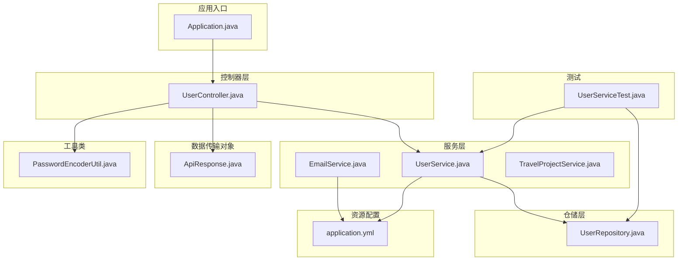
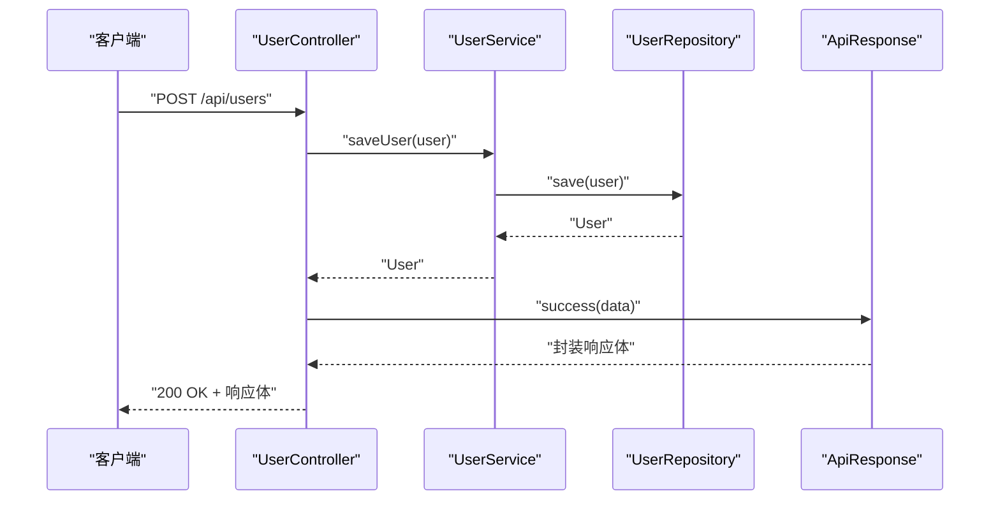
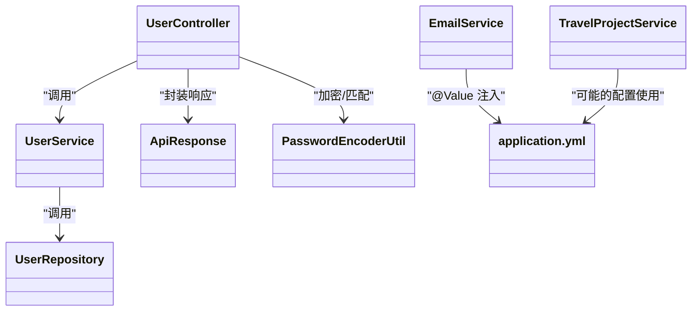

# 代码规范

<cite>
**本文引用的文件**
- [Application.java](file://tudianersha/src/main/java/com/tudianersha/Application.java)
- [UserController.java](file://tudianersha/src/main/java/com/tudianersha/controller/UserController.java)
- [UserService.java](file://tudianersha/src/main/java/com/tudianersha/service/UserService.java)
- [UserRepository.java](file://tudianersha/src/main/java/com/tudianersha/repository/UserRepository.java)
- [ApiResponse.java](file://tudianersha/src/main/java/com/tudianersha/dto/ApiResponse.java)
- [PasswordEncoderUtil.java](file://tudianersha/src/main/java/com/tudianersha/util/PasswordEncoderUtil.java)
- [EmailService.java](file://tudianersha/src/main/java/com/tudianersha/service/EmailService.java)
- [TravelProjectService.java](file://tudianersha/src/main/java/com/tudianersha/service/TravelProjectService.java)
- [application.yml](file://tudianersha/src/main/resources/application.yml)
- [pom.xml](file://tudianersha/pom.xml)
- [README.md](file://tudianersha/README.md)
- [UserServiceTest.java](file://tudianersha/src/test/java/com/tudianersha/UserServiceTest.java)
</cite>

## 目录
1. [引言](#引言)
2. [项目结构](#项目结构)
3. [核心组件](#核心组件)
4. [架构总览](#架构总览)
5. [详细组件分析](#详细组件分析)
6. [依赖关系分析](#依赖关系分析)
7. [性能与可维护性建议](#性能与可维护性建议)
8. [故障排查指南](#故障排查指南)
9. [结论](#结论)
10. [附录：规范与示例路径](#附录规范与示例路径)

## 引言
本规范旨在统一团队开发风格，提升代码可读性与可维护性。基于仓库现有实现，总结并固化如下规则：
- 类名采用大驼峰命名；方法名与变量名采用小驼峰命名；常量采用全大写加下划线。
- 所有公共方法必须包含Javadoc注释，明确功能、参数与返回值。
- 分层职责清晰：Controller层负责请求处理与响应封装；Service层实现核心业务逻辑；Repository层专注数据访问；各层通过接口解耦。
- Git提交信息采用“类型: 描述”的格式（如“feat: 添加用户注册功能”）。
- 禁止在代码中硬编码敏感信息（如数据库密码、邮件密码、API密钥等），应使用application.yml配置并通过@Value注入。
- 提供符合规范的代码示例路径，便于对照与落地执行。

## 项目结构
项目采用标准的分层目录组织，包含controller、service、repository、entity、dto、util以及resources等模块，便于按职责划分与扩展。

图表来源
- [Application.java](file://tudianersha/src/main/java/com/tudianersha/Application.java#L1-L12)
- [UserController.java](file://tudianersha/src/main/java/com/tudianersha/controller/UserController.java#L1-L152)
- [UserService.java](file://tudianersha/src/main/java/com/tudianersha/service/UserService.java#L1-L48)
- [UserRepository.java](file://tudianersha/src/main/java/com/tudianersha/repository/UserRepository.java#L1-L15)
- [ApiResponse.java](file://tudianersha/src/main/java/com/tudianersha/dto/ApiResponse.java#L1-L80)
- [PasswordEncoderUtil.java](file://tudianersha/src/main/java/com/tudianersha/util/PasswordEncoderUtil.java#L1-L33)
- [EmailService.java](file://tudianersha/src/main/java/com/tudianersha/service/EmailService.java#L1-L105)
- [TravelProjectService.java](file://tudianersha/src/main/java/com/tudianersha/service/TravelProjectService.java#L1-L40)
- [application.yml](file://tudianersha/src/main/resources/application.yml#L1-L57)
- [UserServiceTest.java](file://tudianersha/src/test/java/com/tudianersha/UserServiceTest.java#L1-L55)

章节来源
- [README.md](file://tudianersha/README.md#L1-L66)

## 核心组件
- 控制器层：统一接收HTTP请求，调用Service完成业务处理，并通过ApiResponse封装响应。
- 服务层：承载核心业务逻辑，对Repository进行组合，保证业务边界清晰。
- 仓储层：面向JPA接口，提供数据访问能力，避免在Service中直接操作持久化细节。
- DTO：统一响应结构，便于前后端契约一致。
- 工具类：如密码加密工具，集中处理通用能力。
- 配置与测试：application.yml集中管理敏感配置；UserServiceTest展示典型单元测试写法。

章节来源
- [UserController.java](file://tudianersha/src/main/java/com/tudianersha/controller/UserController.java#L1-L152)
- [UserService.java](file://tudianersha/src/main/java/com/tudianersha/service/UserService.java#L1-L48)
- [UserRepository.java](file://tudianersha/src/main/java/com/tudianersha/repository/UserRepository.java#L1-L15)
- [ApiResponse.java](file://tudianersha/src/main/java/com/tudianersha/dto/ApiResponse.java#L1-L80)
- [PasswordEncoderUtil.java](file://tudianersha/src/main/java/com/tudianersha/util/PasswordEncoderUtil.java#L1-L33)
- [EmailService.java](file://tudianersha/src/main/java/com/tudianersha/service/EmailService.java#L1-L105)
- [TravelProjectService.java](file://tudianersha/src/main/java/com/tudianersha/service/TravelProjectService.java#L1-L40)
- [UserServiceTest.java](file://tudianersha/src/test/java/com/tudianersha/UserServiceTest.java#L1-L55)

## 架构总览
控制器-服务-仓储三层协作，通过接口解耦，配合统一响应DTO与配置中心，形成清晰的职责边界与扩展点。

图表来源
- [UserController.java](file://tudianersha/src/main/java/com/tudianersha/controller/UserController.java#L1-L152)
- [UserService.java](file://tudianersha/src/main/java/com/tudianersha/service/UserService.java#L1-L48)
- [UserRepository.java](file://tudianersha/src/main/java/com/tudianersha/repository/UserRepository.java#L1-L15)
- [ApiResponse.java](file://tudianersha/src/main/java/com/tudianersha/dto/ApiResponse.java#L1-L80)

## 详细组件分析

### 控制器层：UserController
- 职责：接收请求、参数校验、调用Service、封装响应。
- 规范要点：
  - 方法命名采用小驼峰；类名采用大驼峰。
  - 公共方法均包含Javadoc注释，说明功能、参数与返回值。
  - 使用ApiResponse统一封装响应，避免直接返回原始实体或状态码。
  - 对异常与边界条件进行显式处理，返回友好提示。
- 示例路径：
  - [UserController.createUser(...)](file://tudianersha/src/main/java/com/tudianersha/controller/UserController.java#L42-L84)
  - [UserController.login(...)](file://tudianersha/src/main/java/com/tudianersha/controller/UserController.java#L86-L124)

章节来源
- [UserController.java](file://tudianersha/src/main/java/com/tudianersha/controller/UserController.java#L1-L152)
- [ApiResponse.java](file://tudianersha/src/main/java/com/tudianersha/dto/ApiResponse.java#L1-L80)

### 服务层：UserService
- 职责：编排业务流程，调用Repository，处理业务规则。
- 规范要点：
  - 方法命名采用小驼峰；类名采用大驼峰。
  - 通过@Autowired注入Repository，保持接口隔离。
  - 对外暴露纯业务方法，不直接处理HTTP响应。
- 示例路径：
  - [UserService.saveUser(...)](file://tudianersha/src/main/java/com/tudianersha/service/UserService.java#L25-L27)
  - [UserService.findByUsername(...)](file://tudianersha/src/main/java/com/tudianersha/service/UserService.java#L33-L35)

章节来源
- [UserService.java](file://tudianersha/src/main/java/com/tudianersha/service/UserService.java#L1-L48)
- [UserRepository.java](file://tudianersha/src/main/java/com/tudianersha/repository/UserRepository.java#L1-L15)

### 仓储层：UserRepository
- 职责：定义数据访问接口，提供查询与存在性判断方法。
- 规范要点：
  - 接口命名采用大驼峰；方法命名采用小驼峰。
  - 使用Spring Data JPA接口，减少样板代码。
- 示例路径：
  - [UserRepository.findByUsername(...)](file://tudianersha/src/main/java/com/tudianersha/repository/UserRepository.java#L11-L11)
  - [UserRepository.existsByEmail(...)](file://tudianersha/src/main/java/com/tudianersha/repository/UserRepository.java#L14-L14)

章节来源
- [UserRepository.java](file://tudianersha/src/main/java/com/tudianersha/repository/UserRepository.java#L1-L15)

### DTO：ApiResponse
- 职责：统一API响应结构，提供静态工厂方法简化调用。
- 规范要点：
  - 类名采用大驼峰；字段采用小驼峰；静态工厂方法采用小驼峰。
  - 提供success/error多种重载，满足不同场景。
- 示例路径：
  - [ApiResponse.success(...)](file://tudianersha/src/main/java/com/tudianersha/dto/ApiResponse.java#L23-L39)
  - [ApiResponse.error(...)](file://tudianersha/src/main/java/com/tudianersha/dto/ApiResponse.java#L44-L53)

章节来源
- [ApiResponse.java](file://tudianersha/src/main/java/com/tudianersha/dto/ApiResponse.java#L1-L80)

### 工具类：PasswordEncoderUtil
- 职责：提供密码加密与匹配能力。
- 规范要点：
  - 类名采用大驼峰；方法命名采用小驼峰；常量采用全大写加下划线。
  - 通过Javadoc说明入参与返回值。
- 示例路径：
  - [PasswordEncoderUtil.encode(...)](file://tudianersha/src/main/java/com/tudianersha/util/PasswordEncoderUtil.java#L19-L21)
  - [PasswordEncoderUtil.matches(...)](file://tudianersha/src/main/java/com/tudianersha/util/PasswordEncoderUtil.java#L29-L31)

章节来源
- [PasswordEncoderUtil.java](file://tudianersha/src/main/java/com/tudianersha/util/PasswordEncoderUtil.java#L1-L33)

### 配置与安全：application.yml 与 @Value
- 规范要点：
  - 禁止在代码中硬编码敏感信息；统一从application.yml读取。
  - 使用@Value注入配置项，避免散落的字符串常量。
- 示例路径：
  - [EmailService.fromEmail 注入](file://tudianersha/src/main/java/com/tudianersha/service/EmailService.java#L18-L19)
  - [application.yml 中的敏感配置](file://tudianersha/src/main/resources/application.yml#L1-L57)

章节来源
- [EmailService.java](file://tudianersha/src/main/java/com/tudianersha/service/EmailService.java#L1-L105)
- [application.yml](file://tudianersha/src/main/resources/application.yml#L1-L57)

### 测试：UserServiceTest
- 规范要点：
  - 使用@SpringBootTest与@MockBean模拟依赖，验证Service行为。
  - 断言清晰，覆盖关键分支。
- 示例路径：
  - [UserServiceTest.testSaveUser(...)](file://tudianersha/src/test/java/com/tudianersha/UserServiceTest.java#L26-L40)
  - [UserServiceTest.testFindByUsername(...)](file://tudianersha/src/test/java/com/tudianersha/UserServiceTest.java#L42-L55)

章节来源
- [UserServiceTest.java](file://tudianersha/src/test/java/com/tudianersha/UserServiceTest.java#L1-L55)

## 依赖关系分析
- 控制器依赖服务；服务依赖仓储接口；仓储接口由Spring Data JPA实现；工具类与配置通过依赖注入参与运行时。
- 依赖方向清晰，接口隔离良好，便于替换与扩展。

图表来源
- [UserController.java](file://tudianersha/src/main/java/com/tudianersha/controller/UserController.java#L1-L152)
- [UserService.java](file://tudianersha/src/main/java/com/tudianersha/service/UserService.java#L1-L48)
- [UserRepository.java](file://tudianersha/src/main/java/com/tudianersha/repository/UserRepository.java#L1-L15)
- [ApiResponse.java](file://tudianersha/src/main/java/com/tudianersha/dto/ApiResponse.java#L1-L80)
- [PasswordEncoderUtil.java](file://tudianersha/src/main/java/com/tudianersha/util/PasswordEncoderUtil.java#L1-L33)
- [EmailService.java](file://tudianersha/src/main/java/com/tudianersha/service/EmailService.java#L1-L105)
- [TravelProjectService.java](file://tudianersha/src/main/java/com/tudianersha/service/TravelProjectService.java#L1-L40)

## 性能与可维护性建议
- 响应封装：统一使用ApiResponse，减少重复逻辑，便于前端消费。
- 依赖注入：优先使用构造器注入或字段注入，避免在方法内重复创建对象。
- 日志与异常：在控制器与服务层记录关键日志，对外抛出明确异常，避免吞掉异常导致定位困难。
- 配置集中化：敏感信息与可变参数全部放入application.yml，通过@Value注入，便于运维与审计。
- 单元测试：为Service与工具类补充测试，覆盖正常与异常路径，保障变更稳定性。

[本节为通用建议，无需列出具体文件来源]

## 故障排查指南
- 数据库连接失败：检查application.yml中的数据库URL、用户名与密码是否正确；确认MySQL服务可用。
- 邮件发送失败：检查application.yml中的SMTP配置与授权码；确认网络可达；查看EmailService日志输出。
- 密码校验失败：确认前端传入明文与后端存储密文是否匹配；核对PasswordEncoderUtil的匹配逻辑。
- 控制器返回异常：检查ApiResponse封装是否正确；确认Service返回值是否为空或异常。

章节来源
- [application.yml](file://tudianersha/src/main/resources/application.yml#L1-L57)
- [EmailService.java](file://tudianersha/src/main/java/com/tudianersha/service/EmailService.java#L1-L105)
- [PasswordEncoderUtil.java](file://tudianersha/src/main/java/com/tudianersha/util/PasswordEncoderUtil.java#L1-L33)
- [UserController.java](file://tudianersha/src/main/java/com/tudianersha/controller/UserController.java#L1-L152)

## 结论
通过分层解耦、统一响应、集中配置与严格的命名与注释规范，本项目具备良好的可读性与可维护性基础。建议在后续迭代中持续遵循本规范，逐步完善测试覆盖率与文档化程度，确保团队协作效率与质量稳定提升。

[本节为总结，无需列出具体文件来源]

## 附录：规范与示例路径
- 命名规范
  - 类名：大驼峰（如UserController、UserService）
  - 方法与变量：小驼峰（如getUserById、userRepository）
  - 常量：全大写加下划线（如MAX_RETRY_COUNT）
- Javadoc规范
  - 所有公共方法需包含Javadoc，说明功能、参数、返回值与异常。
  - 示例路径：
    - [UserController.createUser(...)](file://tudianersha/src/main/java/com/tudianersha/controller/UserController.java#L42-L84)
    - [UserController.login(...)](file://tudianersha/src/main/java/com/tudianersha/controller/UserController.java#L86-L124)
    - [PasswordEncoderUtil.encode(...)](file://tudianersha/src/main/java/com/tudianersha/util/PasswordEncoderUtil.java#L19-L21)
- 分层职责
  - Controller：请求处理与响应封装
    - 示例路径：[UserController.java](file://tudianersha/src/main/java/com/tudianersha/controller/UserController.java#L1-L152)
  - Service：核心业务逻辑
    - 示例路径：[UserService.java](file://tudianersha/src/main/java/com/tudianersha/service/UserService.java#L1-L48)
  - Repository：数据访问
    - 示例路径：[UserRepository.java](file://tudianersha/src/main/java/com/tudianersha/repository/UserRepository.java#L1-L15)
- 统一响应
  - 示例路径：[ApiResponse.java](file://tudianersha/src/main/java/com/tudianersha/dto/ApiResponse.java#L1-L80)
- 配置与注入
  - 示例路径：
    - [EmailService.fromEmail 注入](file://tudianersha/src/main/java/com/tudianersha/service/EmailService.java#L18-L19)
    - [application.yml](file://tudianersha/src/main/resources/application.yml#L1-L57)
- 测试
  - 示例路径：[UserServiceTest.java](file://tudianersha/src/test/java/com/tudianersha/UserServiceTest.java#L1-L55)