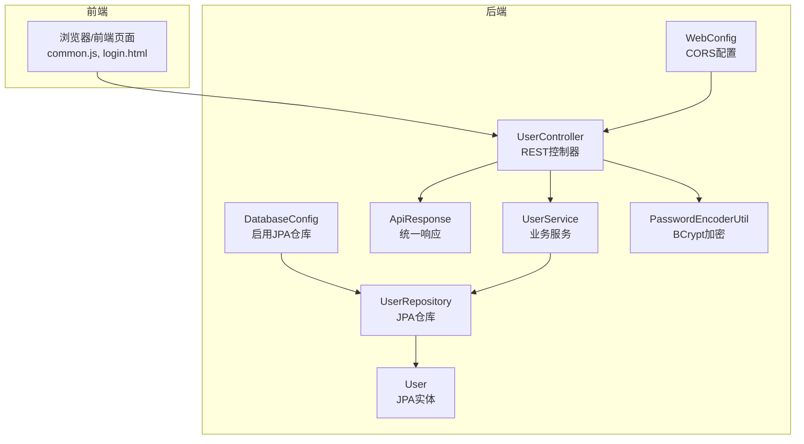
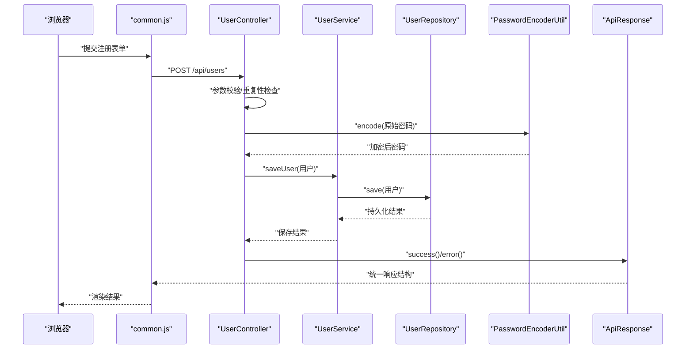
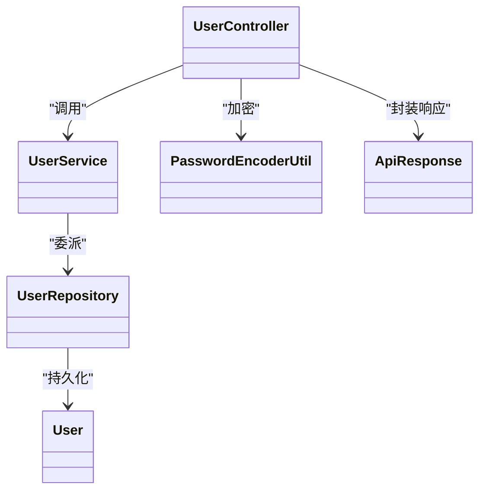
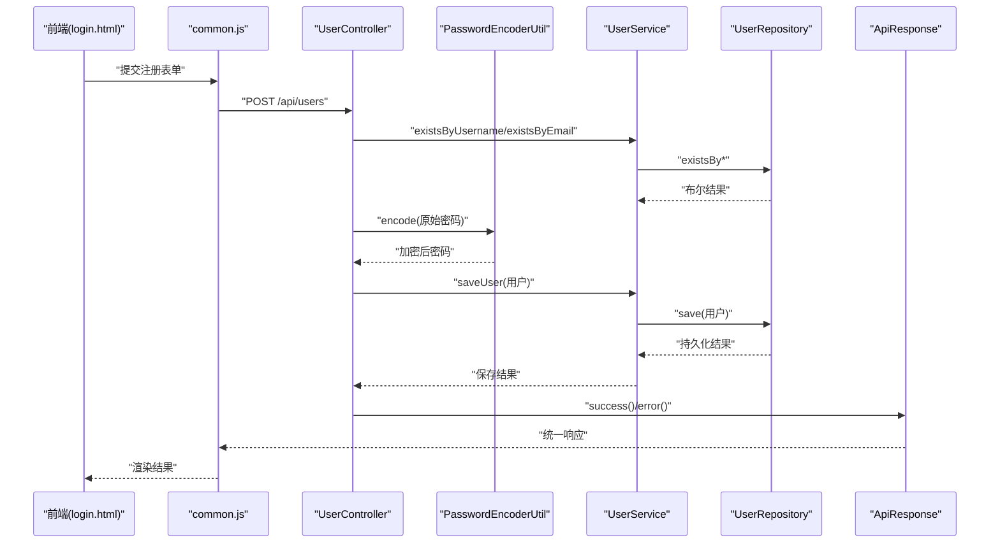

# 分层职责规范

<cite>
**本文引用的文件列表**
- [UserController.java](file://tudianersha/src/main/java/com/tudianersha/controller/UserController.java)
- [UserService.java](file://tudianersha/src/main/java/com/tudianersha/service/UserService.java)
- [UserRepository.java](file://tudianersha/src/main/java/com/tudianersha/repository/UserRepository.java)
- [User.java](file://tudianersha/src/main/java/com/tudianersha/entity/User.java)
- [PasswordEncoderUtil.java](file://tudianersha/src/main/java/com/tudianersha/util/PasswordEncoderUtil.java)
- [ApiResponse.java](file://tudianersha/src/main/java/com/tudianersha/dto/ApiResponse.java)
- [WebConfig.java](file://tudianersha/src/main/java/com/tudianersha/config/WebConfig.java)
- [DatabaseConfig.java](file://tudianersha/src/main/java/com/tudianersha/config/DatabaseConfig.java)
- [EmailController.java](file://tudianersha/src/main/java/com/tudianersha/controller/EmailController.java)
- [common.js](file://tudianersha/src/main/resources/static/js/common.js)
- [login.html](file://tudianersha/src/main/resources/static/login.html)
- [UserServiceTest.java](file://tudianersha/src/test/java/com/tudianersha/UserServiceTest.java)
- [application.yml](file://tudianersha/src/main/resources/application.yml)
</cite>

## 目录
1. [引言](#引言)
2. [项目结构](#项目结构)
3. [核心组件](#核心组件)
4. [架构总览](#架构总览)
5. [详细组件分析](#详细组件分析)
6. [依赖分析](#依赖分析)
7. [性能考虑](#性能考虑)
8. [故障排查指南](#故障排查指南)
9. [结论](#结论)
10. [附录](#附录)

## 引言
本文件旨在明确系统的分层职责边界与交互规范，确保架构清晰、职责单一：
- Controller 层：仅负责接收 HTTP 请求、参数校验、调用 Service 并封装 ApiResponse 返回，不得包含业务逻辑。
- Service 层：实现核心业务流程，如用户注册需校验用户名唯一性、加密密码、保存用户并发送欢迎邮件，保持事务性。
- Repository 层：仅封装 JPA 数据访问操作，不处理业务规则。
- Entity 层：为 JPA 实体，包含字段映射与基本关系定义。
- 禁止跨层调用（如 Controller 直接调用 Repository）。
- 统一异常处理策略：由 Controller 捕获并返回 ErrorResponse。

## 项目结构
系统采用典型的三层架构组织，按功能域划分包结构，职责边界清晰：
- controller：对外暴露 REST 接口，负责请求接入与响应封装
- service：承载业务逻辑，协调多个仓储与外部服务
- repository：基于 Spring Data JPA 的数据访问接口
- entity：JPA 实体类，映射数据库表结构
- util：工具类（如密码加密）
- dto：统一响应模型
- config：Web 与数据库配置
- resources/static：前端静态资源与页面

图表来源
- [WebConfig.java](file://tudianersha/src/main/java/com/tudianersha/config/WebConfig.java#L1-L24)
- [DatabaseConfig.java](file://tudianersha/src/main/java/com/tudianersha/config/DatabaseConfig.java#L1-L10)
- [ApiResponse.java](file://tudianersha/src/main/java/com/tudianersha/dto/ApiResponse.java#L1-L80)
- [UserController.java](file://tudianersha/src/main/java/com/tudianersha/controller/UserController.java#L1-L152)
- [UserService.java](file://tudianersha/src/main/java/com/tudianersha/service/UserService.java#L1-L48)
- [UserRepository.java](file://tudianersha/src/main/java/com/tudianersha/repository/UserRepository.java#L1-L15)
- [User.java](file://tudianersha/src/main/java/com/tudianersha/entity/User.java#L1-L73)
- [PasswordEncoderUtil.java](file://tudianersha/src/main/java/com/tudianersha/util/PasswordEncoderUtil.java#L1-L33)

章节来源
- [WebConfig.java](file://tudianersha/src/main/java/com/tudianersha/config/WebConfig.java#L1-L24)
- [DatabaseConfig.java](file://tudianersha/src/main/java/com/tudianersha/config/DatabaseConfig.java#L1-L10)

## 核心组件
- 统一响应模型：提供 success/error 两类静态工厂方法，保证前后端一致的响应结构。
- 控制器：UserController 提供用户管理与登录接口，内部完成参数校验与异常兜底。
- 业务服务：UserService 封装用户相关业务，仅委派给 Repository，不包含校验与异常处理。
- 数据访问：UserRepository 基于 JpaRepository，提供基础 CRUD 与条件查询。
- 实体模型：User 定义字段映射与构造函数，遵循 JPA 规范。
- 工具类：PasswordEncoderUtil 使用 BCrypt 进行密码加密与匹配。

章节来源
- [ApiResponse.java](file://tudianersha/src/main/java/com/tudianersha/dto/ApiResponse.java#L1-L80)
- [UserController.java](file://tudianersha/src/main/java/com/tudianersha/controller/UserController.java#L1-L152)
- [UserService.java](file://tudianersha/src/main/java/com/tudianersha/service/UserService.java#L1-L48)
- [UserRepository.java](file://tudianersha/src/main/java/com/tudianersha/repository/UserRepository.java#L1-L15)
- [User.java](file://tudianersha/src/main/java/com/tudianersha/entity/User.java#L1-L73)
- [PasswordEncoderUtil.java](file://tudianersha/src/main/java/com/tudianersha/util/PasswordEncoderUtil.java#L1-L33)

## 架构总览
下图展示典型请求在 MVC 各层之间的流转与职责分工：

图表来源
- [common.js](file://tudianersha/src/main/resources/static/js/common.js#L1-L42)
- [UserController.java](file://tudianersha/src/main/java/com/tudianersha/controller/UserController.java#L45-L84)
- [UserService.java](file://tudianersha/src/main/java/com/tudianersha/service/UserService.java#L25-L31)
- [UserRepository.java](file://tudianersha/src/main/java/com/tudianersha/repository/UserRepository.java#L1-L15)
- [PasswordEncoderUtil.java](file://tudianersha/src/main/java/com/tudianersha/util/PasswordEncoderUtil.java#L1-L33)
- [ApiResponse.java](file://tudianersha/src/main/java/com/tudianersha/dto/ApiResponse.java#L1-L80)

## 详细组件分析

### 控制器层（Controller）
- 职责边界
  - 接收 HTTP 请求，进行参数校验（如用户名/邮箱唯一性检查）
  - 调用 Service 执行业务流程
  - 统一封装 ApiResponse 返回，不包含业务规则
  - 捕获运行时异常并返回统一错误响应
- 关键点
  - 用户注册：先校验唯一性，再加密密码，最后保存并返回用户关键信息
  - 用户登录：支持用户名或邮箱登录，校验密码后返回用户信息
  - 统一返回：使用 ApiResponse.success()/error()，便于前端解析
- 依赖注入
  - 通过注解注入 UserService、PasswordEncoderUtil 等
- 异常处理
  - 捕获异常并返回 500 及错误消息，避免异常向上传播

章节来源
- [UserController.java](file://tudianersha/src/main/java/com/tudianersha/controller/UserController.java#L1-L152)
- [ApiResponse.java](file://tudianersha/src/main/java/com/tudianersha/dto/ApiResponse.java#L1-L80)
- [PasswordEncoderUtil.java](file://tudianersha/src/main/java/com/tudianersha/util/PasswordEncoderUtil.java#L1-L33)

### 业务服务层（Service）
- 职责边界
  - 实现核心业务流程，协调仓储与外部服务
  - 不处理参数校验与异常，保持纯业务逻辑
- 关键点
  - 用户查询与保存：委派给 UserRepository
  - 唯一性判断：委托给 Repository 的 existsBy* 方法
- 依赖注入
  - 通过注解注入 UserRepository

章节来源
- [UserService.java](file://tudianersha/src/main/java/com/tudianersha/service/UserService.java#L1-L48)
- [UserRepository.java](file://tudianersha/src/main/java/com/tudianersha/repository/UserRepository.java#L1-L15)

### 数据访问层（Repository）
- 职责边界
  - 仅封装 JPA/MyBatis 数据访问操作，不处理业务规则
- 关键点
  - 基于 JpaRepository 的标准 CRUD 与条件查询
  - 自定义 existsBy* / findBy* 方法，供 Service 使用
- 配置
  - 通过 DatabaseConfig 启用 JPA 仓库扫描

章节来源
- [UserRepository.java](file://tudianersha/src/main/java/com/tudianersha/repository/UserRepository.java#L1-L15)
- [DatabaseConfig.java](file://tudianersha/src/main/java/com/tudianersha/config/DatabaseConfig.java#L1-L10)

### 实体层（Entity）
- 职责边界
  - 定义 JPA 实体与字段映射，不包含业务逻辑
- 关键点
  - 主键、非空字段、构造函数与 getter/setter
  - 与数据库表结构一一对应

章节来源
- [User.java](file://tudianersha/src/main/java/com/tudianersha/entity/User.java#L1-L73)

### 工具类（Util）
- 职责边界
  - 提供通用工具能力，如密码加密与匹配
- 关键点
  - 使用 BCryptPasswordEncoder，保证安全性

章节来源
- [PasswordEncoderUtil.java](file://tudianersha/src/main/java/com/tudianersha/util/PasswordEncoderUtil.java#L1-L33)

### 统一响应模型（DTO）
- 职责边界
  - 统一前后端响应结构，屏蔽异常细节
- 关键点
  - 提供 success/error 两类静态工厂方法，简化控制器封装

章节来源
- [ApiResponse.java](file://tudianersha/src/main/java/com/tudianersha/dto/ApiResponse.java#L1-L80)

### 配置层（Config）
- WebConfig：配置 CORS，允许前端跨域访问 /api/*
- DatabaseConfig：启用 JPA 仓库扫描，定位 repository 包

章节来源
- [WebConfig.java](file://tudianersha/src/main/java/com/tudianersha/config/WebConfig.java#L1-L24)
- [DatabaseConfig.java](file://tudianersha/src/main/java/com/tudianersha/config/DatabaseConfig.java#L1-L10)

### 前端交互与测试参考
- common.js：封装通用 API 请求，直接返回后端 ApiResponse
- login.html：前端注册/登录流程示例，与后端接口对接
- UserServiceTest：演示如何通过 Mock 测试 Service 的保存与查询行为

章节来源
- [common.js](file://tudianersha/src/main/resources/static/js/common.js#L1-L42)
- [login.html](file://tudianersha/src/main/resources/static/login.html#L270-L400)
- [UserServiceTest.java](file://tudianersha/src/test/java/com/tudianersha/UserServiceTest.java#L1-L55)

## 依赖分析
- 控制器依赖服务：Controller -> Service
- 服务依赖仓储：Service -> Repository
- 仓储依赖实体：Repository -> Entity
- 控制器依赖工具与响应模型：Controller -> Util/DTO
- 前端依赖控制器：Front -> Controller

图表来源
- [UserController.java](file://tudianersha/src/main/java/com/tudianersha/controller/UserController.java#L1-L152)
- [UserService.java](file://tudianersha/src/main/java/com/tudianersha/service/UserService.java#L1-L48)
- [UserRepository.java](file://tudianersha/src/main/java/com/tudianersha/repository/UserRepository.java#L1-L15)
- [User.java](file://tudianersha/src/main/java/com/tudianersha/entity/User.java#L1-L73)
- [PasswordEncoderUtil.java](file://tudianersha/src/main/java/com/tudianersha/util/PasswordEncoderUtil.java#L1-L33)
- [ApiResponse.java](file://tudianersha/src/main/java/com/tudianersha/dto/ApiResponse.java#L1-L80)

## 性能考虑
- 控制器层尽量轻量，避免在 Controller 中执行复杂计算或 IO 操作
- Service 层聚合多个 Repository 调用时，注意批量操作与事务边界，减少不必要的往返
- Repository 层使用 existsBy*/findBy* 等方法，避免全表扫描
- 前端请求统一走 ApiResponse，减少额外封装成本

## 故障排查指南
- 前端无法跨域访问
  - 检查 WebConfig 中 CORS 配置是否生效
  - 确认请求路径以 /api 开头
- 注册失败或登录失败
  - 查看控制器日志与返回的 ApiResponse.message
  - 确认密码加密是否正常（PasswordEncoderUtil）
- 数据库连接或 JPA 配置
  - 检查 application.yml 中的数据源与 JPA 配置
  - 确认 DatabaseConfig 已启用 JPA 仓库扫描
- 验证码发送接口
  - EmailController 提供发送验证码接口，前端通过 common.js 调用

章节来源
- [WebConfig.java](file://tudianersha/src/main/java/com/tudianersha/config/WebConfig.java#L1-L24)
- [application.yml](file://tudianersha/src/main/resources/application.yml#L1-L57)
- [DatabaseConfig.java](file://tudianersha/src/main/java/com/tudianersha/config/DatabaseConfig.java#L1-L10)
- [EmailController.java](file://tudianersha/src/main/java/com/tudianersha/controller/EmailController.java#L1-L42)
- [common.js](file://tudianersha/src/main/resources/static/js/common.js#L1-L42)

## 结论
本项目严格遵循 MVC 分层职责边界：Controller 仅负责请求接入与响应封装，Service 承担业务流程，Repository 专注数据访问，Entity 保持模型纯净。通过统一响应模型与工具类，提升了可维护性与一致性。建议后续在 Service 层引入事务控制与统一异常处理，进一步增强健壮性与可测试性。

## 附录

### 用户注册流程调用链（代码级）

图表来源
- [login.html](file://tudianersha/src/main/resources/static/login.html#L350-L400)
- [common.js](file://tudianersha/src/main/resources/static/js/common.js#L1-L42)
- [UserController.java](file://tudianersha/src/main/java/com/tudianersha/controller/UserController.java#L45-L84)
- [UserService.java](file://tudianersha/src/main/java/com/tudianersha/service/UserService.java#L25-L47)
- [UserRepository.java](file://tudianersha/src/main/java/com/tudianersha/repository/UserRepository.java#L1-L15)
- [PasswordEncoderUtil.java](file://tudianersha/src/main/java/com/tudianersha/util/PasswordEncoderUtil.java#L1-L33)
- [ApiResponse.java](file://tudianersha/src/main/java/com/tudianersha/dto/ApiResponse.java#L1-L80)