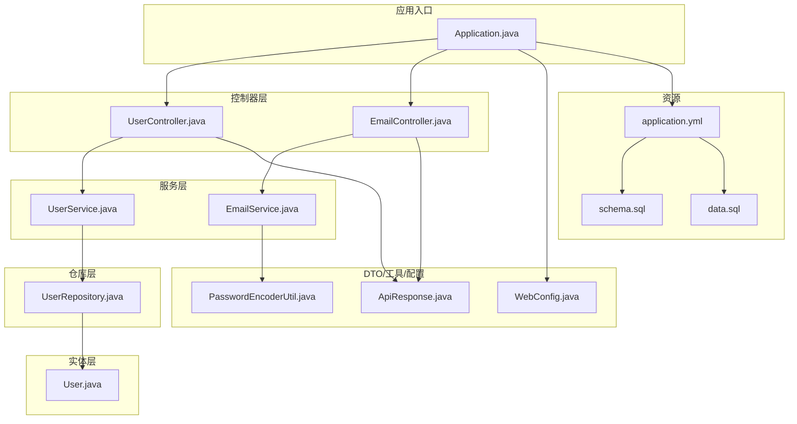
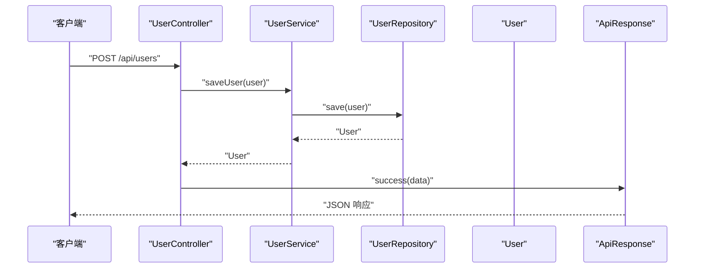
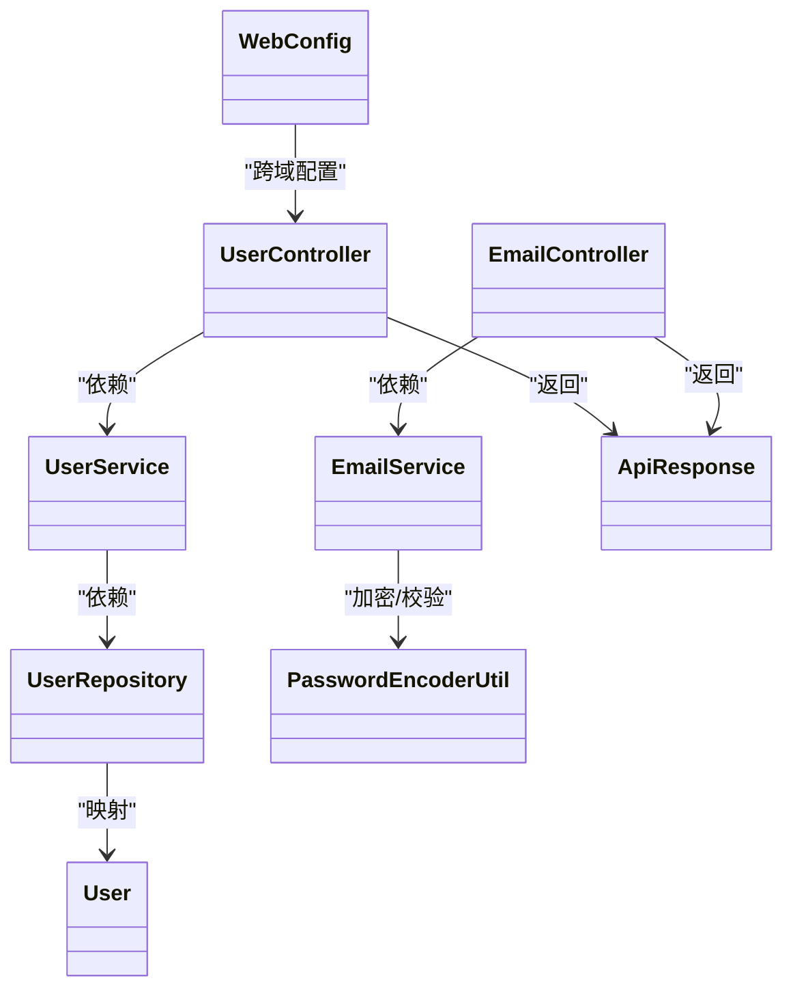

# 命名规范

<cite>
**本文引用的文件**
- [Application.java](file://tudianersha/src/main/java/com/tudianersha/Application.java)
- [UserController.java](file://tudianersha/src/main/java/com/tudianersha/controller/UserController.java)
- [EmailController.java](file://tudianersha/src/main/java/com/tudianersha/controller/EmailController.java)
- [UserService.java](file://tudianersha/src/main/java/com/tudianersha/service/UserService.java)
- [EmailService.java](file://tudianersha/src/main/java/com/tudianersha/service/EmailService.java)
- [UserRepository.java](file://tudianersha/src/main/java/com/tudianersha/repository/UserRepository.java)
- [User.java](file://tudianersha/src/main/java/com/tudianersha/entity/User.java)
- [ApiResponse.java](file://tudianersha/src/main/java/com/tudianersha/dto/ApiResponse.java)
- [PasswordEncoderUtil.java](file://tudianersha/src/main/java/com/tudianersha/util/PasswordEncoderUtil.java)
- [WebConfig.java](file://tudianersha/src/main/java/com/tudianersha/config/WebConfig.java)
- [application.yml](file://tudianersha/src/main/resources/application.yml)
- [schema.sql](file://tudianersha/src/main/resources/schema.sql)
- [data.sql](file://tudianersha/src/main/resources/data.sql)
- [pom.xml](file://tudianersha/pom.xml)
- [UserServiceTest.java](file://tudianersha/src/test/java/com/tudianersha/UserServiceTest.java)
</cite>

## 目录
1. [引言](#引言)
2. [项目结构](#项目结构)
3. [核心组件](#核心组件)
4. [架构总览](#架构总览)
5. [详细组件分析](#详细组件分析)
6. [依赖关系分析](#依赖关系分析)
7. [性能考量](#性能考量)
8. [故障排查指南](#故障排查指南)
9. [结论](#结论)
10. [附录：命名规范与示例](#附录命名规范与示例)

## 引言
本规范旨在统一项目中的命名风格，提升代码可读性与团队协作效率。通过对现有代码库的分析，结合Java常见分层架构实践，明确类名、方法名、变量名、常量、包名、数据库表/字段名以及REST API路径的命名约定，并提供正反例对比，帮助开发者快速掌握并严格执行。

## 项目结构
项目采用典型的Spring Boot分层结构：
- controller 层：处理HTTP请求，定义REST API路径
- service 层：业务逻辑编排，调用仓库层
- repository 层：数据访问接口（JPA）
- entity 层：持久化实体类
- dto 层：传输对象
- util 层：通用工具类
- config 层：配置类
- resources：配置文件与数据库脚本

图示来源
- [Application.java](file://tudianersha/src/main/java/com/tudianersha/Application.java#L1-L12)
- [UserController.java](file://tudianersha/src/main/java/com/tudianersha/controller/UserController.java#L1-L152)
- [EmailController.java](file://tudianersha/src/main/java/com/tudianersha/controller/EmailController.java#L1-L82)
- [UserService.java](file://tudianersha/src/main/java/com/tudianersha/service/UserService.java#L1-L48)
- [EmailService.java](file://tudianersha/src/main/java/com/tudianersha/service/EmailService.java#L1-L105)
- [UserRepository.java](file://tudianersha/src/main/java/com/tudianersha/repository/UserRepository.java#L1-L15)
- [User.java](file://tudianersha/src/main/java/com/tudianersha/entity/User.java#L1-L73)
- [ApiResponse.java](file://tudianersha/src/main/java/com/tudianersha/dto/ApiResponse.java#L1-L80)
- [PasswordEncoderUtil.java](file://tudianersha/src/main/java/com/tudianersha/util/PasswordEncoderUtil.java#L1-L33)
- [WebConfig.java](file://tudianersha/src/main/java/com/tudianersha/config/WebConfig.java#L1-L24)
- [application.yml](file://tudianersha/src/main/resources/application.yml#L1-L57)
- [schema.sql](file://tudianersha/src/main/resources/schema.sql#L1-L123)
- [data.sql](file://tudianersha/src/main/resources/data.sql#L1-L7)

章节来源
- [Application.java](file://tudianersha/src/main/java/com/tudianersha/Application.java#L1-L12)
- [pom.xml](file://tudianersha/pom.xml#L1-L180)

## 核心组件
- 控制器层：以“控制器”结尾，REST路径使用小写与连字符组合，如/api/users、/api/email/send-code
- 服务层：以“服务”结尾，方法名采用小驼峰，如getAllUsers、findByUsername
- 仓库层：以“仓库”结尾，接口方法遵循查询语义，如findByUsername、existsByUsername
- 实体层：类名采用大驼峰，字段名采用小驼峰，表名使用下划线小写
- DTO/工具/配置：类名采用大驼峰，工具类方法采用静态方法，配置类用于全局设置

章节来源
- [UserController.java](file://tudianersha/src/main/java/com/tudianersha/controller/UserController.java#L1-L152)
- [EmailController.java](file://tudianersha/src/main/java/com/tudianersha/controller/EmailController.java#L1-L82)
- [UserService.java](file://tudianersha/src/main/java/com/tudianersha/service/UserService.java#L1-L48)
- [UserRepository.java](file://tudianersha/src/main/java/com/tudianersha/repository/UserRepository.java#L1-L15)
- [User.java](file://tudianersha/src/main/java/com/tudianersha/entity/User.java#L1-L73)
- [ApiResponse.java](file://tudianersha/src/main/java/com/tudianersha/dto/ApiResponse.java#L1-L80)
- [PasswordEncoderUtil.java](file://tudianersha/src/main/java/com/tudianersha/util/PasswordEncoderUtil.java#L1-L33)
- [WebConfig.java](file://tudianersha/src/main/java/com/tudianersha/config/WebConfig.java#L1-L24)

## 架构总览
控制器接收请求，调用服务层执行业务逻辑，服务层通过仓库接口访问数据库实体，最终返回统一的DTO响应。

图示来源
- [UserController.java](file://tudianersha/src/main/java/com/tudianersha/controller/UserController.java#L1-L152)
- [UserService.java](file://tudianersha/src/main/java/com/tudianersha/service/UserService.java#L1-L48)
- [UserRepository.java](file://tudianersha/src/main/java/com/tudianersha/repository/UserRepository.java#L1-L15)
- [User.java](file://tudianersha/src/main/java/com/tudianersha/entity/User.java#L1-L73)
- [ApiResponse.java](file://tudianersha/src/main/java/com/tudianersha/dto/ApiResponse.java#L1-L80)

## 详细组件分析

### 控制器层命名规范
- 类名：采用大驼峰，以“控制器”结尾，如UserController、EmailController
- 包名：全部小写，按功能划分，如com.tudianersha.controller
- REST路径：全部小写，单词间使用连字符分隔，如/api/users、/api/email/send-code
- 方法名：小驼峰，如getAllUsers、createUser、login、sendCode、verifyCode
- 参数与局部变量：小驼峰，如credentials、request、email、code

正例
- 类名：UserController、EmailController
- 路径：/api/users、/api/email/send-code
- 方法：login、sendCode、verifyCode

反例
- 类名：userController、email_controller
- 路径：/Api/Users、/api_email_send_code
- 方法：getAllUsers（若类名为userController则不一致）

章节来源
- [UserController.java](file://tudianersha/src/main/java/com/tudianersha/controller/UserController.java#L1-L152)
- [EmailController.java](file://tudianersha/src/main/java/com/tudianersha/controller/EmailController.java#L1-L82)
- [WebConfig.java](file://tudianersha/src/main/java/com/tudianersha/config/WebConfig.java#L1-L24)

### 服务层命名规范
- 类名：采用大驼峰，以“服务”结尾，如UserService、EmailService
- 包名：全部小写，如com.tudianersha.service
- 方法名：小驼峰，如getAllUsers、findByUsername、saveUser、deleteUser、sendVerificationCode、verifyCode
- 变量与参数：小驼峰，如userRepository、user、email、code

正例
- 类名：UserService、EmailService
- 方法：findByUsername、sendVerificationCode、verifyCode

反例
- 类名：userService、email_service
- 方法：FindByUsername、send_verification_code

章节来源
- [UserService.java](file://tudianersha/src/main/java/com/tudianersha/service/UserService.java#L1-L48)
- [EmailService.java](file://tudianersha/src/main/java/com/tudianersha/service/EmailService.java#L1-L105)

### 仓库层命名规范
- 接口名：采用大驼峰，以“仓库”结尾，如UserRepository
- 包名：全部小写，如com.tudianersha.repository
- 方法名：遵循Spring Data JPA命名约定，如findByUsername、findByEmail、existsByUsername、existsByEmail
- 参数与返回值：小驼峰，如username、email、Optional<User>

正例
- 接口：UserRepository
- 方法：findByUsername、existsByEmail

反例
- 接口：userRepository、User_Repository
- 方法：find_by_username、exists_by_email

章节来源
- [UserRepository.java](file://tudianersha/src/main/java/com/tudianersha/repository/UserRepository.java#L1-L15)

### 实体层命名规范
- 类名：采用大驼峰，如User
- 包名：全部小写，如com.tudianersha.entity
- 字段名：小驼峰，如username、email、password
- 表名：下划线小写，如users
- 列名：下划线小写，如username、email、password

正例
- 类：User
- 表：users
- 字段：username、email、password

反例
- 类：user、USER
- 表：Users、users_table
- 字段：userName、EMAIL_PASSWORD

章节来源
- [User.java](file://tudianersha/src/main/java/com/tudianersha/entity/User.java#L1-L73)
- [schema.sql](file://tudianersha/src/main/resources/schema.sql#L1-L123)

### DTO/工具/配置命名规范
- DTO类：采用大驼峰，如ApiResponse
- 工具类：采用大驼峰，如PasswordEncoderUtil
- 配置类：采用大驼峰，如WebConfig
- 包名：全部小写，如com.tudianersha.dto、com.tudianersha.util、com.tudianersha.config
- 工具方法：静态方法，如PasswordEncoderUtil.encode、matches
- 配置Bean：方法名小驼峰，如corsConfigurer

正例
- 类：ApiResponse、PasswordEncoderUtil、WebConfig
- 方法：encode、matches、corsConfigurer

反例
- 类：api_response、password_encoder_util
- 方法：Encode、Matches、CorsConfigurer

章节来源
- [ApiResponse.java](file://tudianersha/src/main/java/com/tudianersha/dto/ApiResponse.java#L1-L80)
- [PasswordEncoderUtil.java](file://tudianersha/src/main/java/com/tudianersha/util/PasswordEncoderUtil.java#L1-L33)
- [WebConfig.java](file://tudianersha/src/main/java/com/tudianersha/config/WebConfig.java#L1-L24)

### 测试命名规范
- 测试类：以被测类名+Test命名，如UserServiceTest
- 测试方法：以test前缀+被测方法名，如testSaveUser、testFindByUsername
- 包名：全部小写，如com.tudianersha

正例
- 类：UserServiceTest
- 方法：testSaveUser、testFindByUsername

反例
- 类：User_Service_Test、UserServicetest
- 方法：TestSaveUser、FindByUsernameTest

章节来源
- [UserServiceTest.java](file://tudianersha/src/test/java/com/tudianersha/UserServiceTest.java#L1-L55)

## 依赖关系分析
控制器依赖服务层，服务层依赖仓库接口，仓库接口映射到实体类，统一通过ApiResponse进行响应封装。

图示来源
- [UserController.java](file://tudianersha/src/main/java/com/tudianersha/controller/UserController.java#L1-L152)
- [EmailController.java](file://tudianersha/src/main/java/com/tudianersha/controller/EmailController.java#L1-L82)
- [UserService.java](file://tudianersha/src/main/java/com/tudianersha/service/UserService.java#L1-L48)
- [EmailService.java](file://tudianersha/src/main/java/com/tudianersha/service/EmailService.java#L1-L105)
- [UserRepository.java](file://tudianersha/src/main/java/com/tudianersha/repository/UserRepository.java#L1-L15)
- [User.java](file://tudianersha/src/main/java/com/tudianersha/entity/User.java#L1-L73)
- [ApiResponse.java](file://tudianersha/src/main/java/com/tudianersha/dto/ApiResponse.java#L1-L80)
- [PasswordEncoderUtil.java](file://tudianersha/src/main/java/com/tudianersha/util/PasswordEncoderUtil.java#L1-L33)
- [WebConfig.java](file://tudianersha/src/main/java/com/tudianersha/config/WebConfig.java#L1-L24)

## 性能考量
- 使用小驼峰命名减少解析歧义，提高IDE索引与自动补全效率
- 统一REST路径风格便于前端路由与API文档维护
- 实体字段与表名采用下划线小写，避免大小写差异导致的数据库兼容问题
- DTO统一响应结构，减少前后端对接成本

## 故障排查指南
- 路由404：检查控制器路径是否为小写且使用连字符，如/api/email/send-code
- 跨域问题：确认WebConfig中对/cors映射范围是否覆盖/api/**
- 数据库连接异常：核对application.yml中的数据库URL、用户名、密码
- 邮件发送失败：检查application.yml中的邮件配置项与网络权限
- 验证码校验失败：确认临时存储机制与过期时间逻辑

章节来源
- [WebConfig.java](file://tudianersha/src/main/java/com/tudianersha/config/WebConfig.java#L1-L24)
- [application.yml](file://tudianersha/src/main/resources/application.yml#L1-L57)
- [EmailService.java](file://tudianersha/src/main/java/com/tudianersha/service/EmailService.java#L1-L105)

## 结论
通过统一的命名规范，可以显著提升代码一致性与可读性，降低沟通成本，便于新成员快速上手。建议在团队内推广并持续检查，确保所有新增文件与修改均符合规范。

## 附录：命名规范与示例

### Java类名与包名
- 类名：大驼峰，如UserController、UserService、UserRepository、User、ApiResponse、PasswordEncoderUtil、WebConfig
- 包名：全部小写，按功能划分，如com.tudianersha.controller、com.tudianersha.service、com.tudianersha.repository、com.tudianersha.entity、com.tudianersha.dto、com.tudianersha.util、com.tudianersha.config

正例
- 类：UserController、EmailService、UserRepository、ApiResponse、PasswordEncoderUtil、WebConfig
- 包：com.tudianersha.controller、com.tudianersha.service

反例
- 类：userController、email_service、user_repository
- 包：com.Tudianersha.Controller、com.tudianersha.SERVICE

章节来源
- [UserController.java](file://tudianersha/src/main/java/com/tudianersha/controller/UserController.java#L1-L152)
- [UserService.java](file://tudianersha/src/main/java/com/tudianersha/service/UserService.java#L1-L48)
- [UserRepository.java](file://tudianersha/src/main/java/com/tudianersha/repository/UserRepository.java#L1-L15)
- [User.java](file://tudianersha/src/main/java/com/tudianersha/entity/User.java#L1-L73)
- [ApiResponse.java](file://tudianersha/src/main/java/com/tudianersha/dto/ApiResponse.java#L1-L80)
- [PasswordEncoderUtil.java](file://tudianersha/src/main/java/com/tudianersha/util/PasswordEncoderUtil.java#L1-L33)
- [WebConfig.java](file://tudianersha/src/main/java/com/tudianersha/config/WebConfig.java#L1-L24)

### 方法名与变量名
- 方法名：小驼峰，如getAllUsers、findByUsername、saveUser、sendVerificationCode、verifyCode
- 变量与参数：小驼峰，如userRepository、user、email、code、credentials、request

正例
- 方法：findByUsername、sendVerificationCode、verifyCode
- 变量：userRepository、user、email、code

反例
- 方法：FindByUsername、send_verification_code
- 变量：user_repository、USER_ID

章节来源
- [UserService.java](file://tudianersha/src/main/java/com/tudianersha/service/UserService.java#L1-L48)
- [EmailService.java](file://tudianersha/src/main/java/com/tudianersha/service/EmailService.java#L1-L105)
- [UserController.java](file://tudianersha/src/main/java/com/tudianersha/controller/UserController.java#L1-L152)
- [EmailController.java](file://tudianersha/src/main/java/com/tudianersha/controller/EmailController.java#L1-L82)

### 常量
- 常量：全大写字母，单词间以下划线分隔，如MAX_RETRY_ATTEMPTS
- 说明：当前代码库未见全大写常量示例，建议新增时遵循此规范

章节来源
- [PasswordEncoderUtil.java](file://tudianersha/src/main/java/com/tudianersha/util/PasswordEncoderUtil.java#L1-L33)

### 数据库表名与字段名
- 表名：下划线小写，如users、project_participants、travel_projects
- 字段名：下划线小写，如username、email、password、project_id、user_id

正例
- 表：users、project_participants、travel_projects、travel_participants、budgets、ai_generated_routes、overall_routes、activity_schedules、travel_sessions、requirement_parameters、shared_documents、chat_messages
- 字段：username、email、password、project_id、user_id、join_time、role、permission、total_budget、used_budget、remaining_budget、route_content、generated_time、interest_tags、route_details、activity_name、activity_time、location、budget、day_number、message、message_time、mentioned_user_id、daily_budget_allocation、wishlist、dislike_list、budget_breakdown、document_url、format、share_link、creator_id、username、message_time

反例
- 表：Users、ProjectParticipants、TravelProjects
- 字段：userName、EMAIL_PASSWORD、ProjectId、UserId

章节来源
- [schema.sql](file://tudianersha/src/main/resources/schema.sql#L1-L123)
- [data.sql](file://tudianersha/src/main/resources/data.sql#L1-L7)

### REST API路径
- 路径：全部小写，单词间使用连字符分隔，如/api/users、/api/email/send-code、/api/email/verify-code
- 路径前缀：/api

正例
- 路径：/api/users、/api/email/send-code、/api/email/verify-code

反例
- 路径：/Api/Users、/api_email_send_code、/API/EMAIL/SEND-CODE

章节来源
- [UserController.java](file://tudianersha/src/main/java/com/tudianersha/controller/UserController.java#L1-L152)
- [EmailController.java](file://tudianersha/src/main/java/com/tudianersha/controller/EmailController.java#L1-L82)
- [WebConfig.java](file://tudianersha/src/main/java/com/tudianersha/config/WebConfig.java#L1-L24)

### 统一响应结构
- DTO类：ApiResponse，提供success与error静态工厂方法，统一返回结构

正例
- ApiResponse.success(...)、ApiResponse.error(...)

反例
- 自定义响应结构、分散的返回格式

章节来源
- [ApiResponse.java](file://tudianersha/src/main/java/com/tudianersha/dto/ApiResponse.java#L1-L80)
- [UserController.java](file://tudianersha/src/main/java/com/tudianersha/controller/UserController.java#L1-L152)
- [EmailController.java](file://tudianersha/src/main/java/com/tudianersha/controller/EmailController.java#L1-L82)

### 配置与环境
- 配置文件：application.yml
- 配置类：WebConfig
- 数据库脚本：schema.sql、data.sql
- 依赖管理：pom.xml

章节来源
- [application.yml](file://tudianersha/src/main/resources/application.yml#L1-L57)
- [WebConfig.java](file://tudianersha/src/main/java/com/tudianersha/config/WebConfig.java#L1-L24)
- [schema.sql](file://tudianersha/src/main/resources/schema.sql#L1-L123)
- [data.sql](file://tudianersha/src/main/resources/data.sql#L1-L7)
- [pom.xml](file://tudianersha/pom.xml#L1-L180)