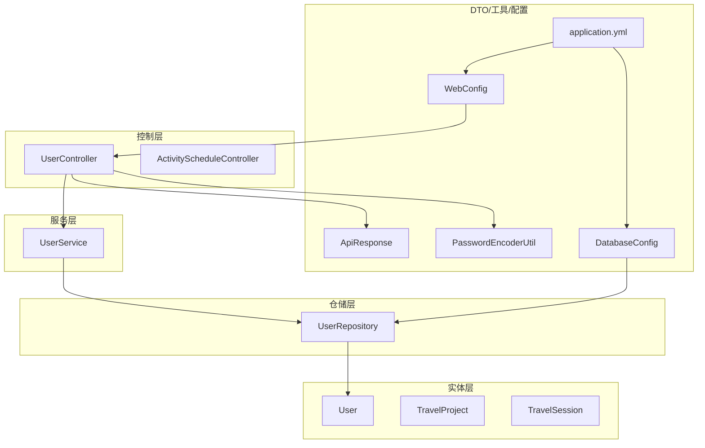
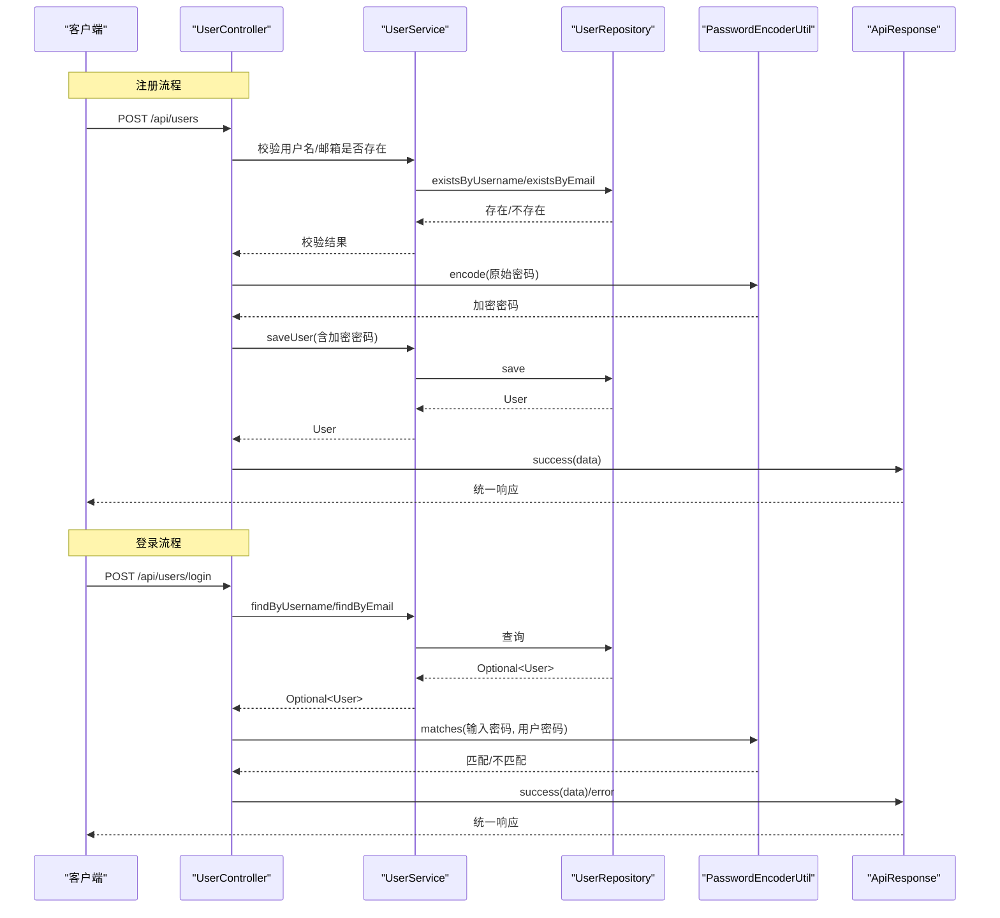
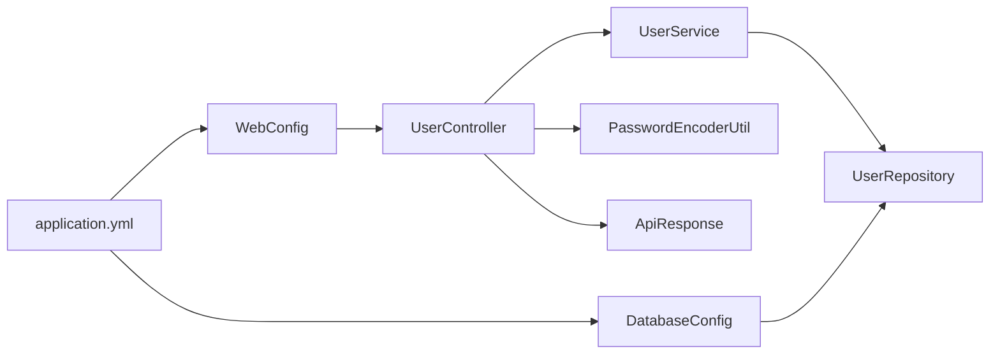

# 注释要求

<cite>
**本文引用的文件**
- [UserController.java](file://tudianersha/src/main/java/com/tudianersha/controller/UserController.java)
- [UserService.java](file://tudianersha/src/main/java/com/tudianersha/service/UserService.java)
- [User.java](file://tudianersha/src/main/java/com/tudianersha/entity/User.java)
- [PasswordEncoderUtil.java](file://tudianersha/src/main/java/com/tudianersha/util/PasswordEncoderUtil.java)
- [ApiResponse.java](file://tudianersha/src/main/java/com/tudianersha/dto/ApiResponse.java)
- [UserRepository.java](file://tudianersha/src/main/java/com/tudianersha/repository/UserRepository.java)
- [DatabaseConfig.java](file://tudianersha/src/main/java/com/tudianersha/config/DatabaseConfig.java)
- [WebConfig.java](file://tudianersha/src/main/java/com/tudianersha/config/WebConfig.java)
- [application.yml](file://tudianersha/src/main/resources/application.yml)
- [ActivityScheduleController.java](file://tudianersha/src/main/java/com/tudianersha/controller/ActivityScheduleController.java)
- [TravelProject.java](file://tudianersha/src/main/java/com/tudianersha/entity/TravelProject.java)
- [TravelSession.java](file://tudianersha/src/main/java/com/tudianersha/entity/TravelSession.java)
- [UserServiceTest.java](file://tudianersha/src/test/java/com/tudianersha/UserServiceTest.java)
</cite>

## 目录
1. [引言](#引言)
2. [项目结构](#项目结构)
3. [核心组件](#核心组件)
4. [架构总览](#架构总览)
5. [详细组件分析](#详细组件分析)
6. [依赖分析](#依赖分析)
7. [性能考虑](#性能考虑)
8. [故障排查指南](#故障排查指南)
9. [结论](#结论)
10. [附录：注释规范与示例](#附录注释规范与示例)

## 引言
本文件旨在建立统一、可追溯、可维护的注释编写标准，覆盖公共类与公共方法的 Javadoc 规范、业务关键逻辑的行内注释、实体类字段的业务含义说明、配置类的配置项说明，以及常见反模式的识别与规避。目标是提升代码可读性与可维护性，降低沟通成本与知识断层风险。

## 项目结构
项目采用分层架构：控制层（Controller）、服务层（Service）、仓储层（Repository）、实体层（Entity）、DTO 层（DTO）、工具层（Util）与配置层（Config）。注释规范应贯穿各层，确保接口契约清晰、实现意图明确、异常与边界条件可追溯。

图表来源
- [UserController.java](file://tudianersha/src/main/java/com/tudianersha/controller/UserController.java#L1-L152)
- [UserService.java](file://tudianersha/src/main/java/com/tudianersha/service/UserService.java#L1-L48)
- [UserRepository.java](file://tudianersha/src/main/java/com/tudianersha/repository/UserRepository.java#L1-L15)
- [User.java](file://tudianersha/src/main/java/com/tudianersha/entity/User.java#L1-L73)
- [TravelProject.java](file://tudianersha/src/main/java/com/tudianersha/entity/TravelProject.java#L1-L163)
- [TravelSession.java](file://tudianersha/src/main/java/com/tudianersha/entity/TravelSession.java#L1-L100)
- [ApiResponse.java](file://tudianersha/src/main/java/com/tudianersha/dto/ApiResponse.java#L1-L80)
- [PasswordEncoderUtil.java](file://tudianersha/src/main/java/com/tudianersha/util/PasswordEncoderUtil.java#L1-L33)
- [DatabaseConfig.java](file://tudianersha/src/main/java/com/tudianersha/config/DatabaseConfig.java#L1-L10)
- [WebConfig.java](file://tudianersha/src/main/java/com/tudianersha/config/WebConfig.java#L1-L24)
- [application.yml](file://tudianersha/src/main/resources/application.yml#L1-L57)

章节来源
- [UserController.java](file://tudianersha/src/main/java/com/tudianersha/controller/UserController.java#L1-L152)
- [application.yml](file://tudianersha/src/main/resources/application.yml#L1-L57)

## 核心组件
- 控制器层：负责接收请求、组织响应、调用服务层；需对公共方法进行 Javadoc 注释，说明功能、参数、返回值与异常场景。
- 服务层：封装业务规则与流程；公共方法需 Javadoc，关键分支需行内注释解释“为什么”。
- 仓储层：面向数据库访问；公共方法需 Javadoc，说明查询语义与返回约定。
- 实体层：承载业务模型；字段需注释或使用注解说明业务含义。
- 工具与 DTO：工具类方法需 Javadoc；统一响应 DTO 需对构造与静态工厂方法进行 Javadoc。
- 配置层：对每个配置项进行说明，便于运维与开发理解。

章节来源
- [UserService.java](file://tudianersha/src/main/java/com/tudianersha/service/UserService.java#L1-L48)
- [UserRepository.java](file://tudianersha/src/main/java/com/tudianersha/repository/UserRepository.java#L1-L15)
- [User.java](file://tudianersha/src/main/java/com/tudianersha/entity/User.java#L1-L73)
- [ApiResponse.java](file://tudianersha/src/main/java/com/tudianersha/dto/ApiResponse.java#L1-L80)
- [DatabaseConfig.java](file://tudianersha/src/main/java/com/tudianersha/config/DatabaseConfig.java#L1-L10)
- [WebConfig.java](file://tudianersha/src/main/java/com/tudianersha/config/WebConfig.java#L1-L24)

## 架构总览
下图展示用户登录与注册的关键流程，体现注释在接口契约、异常处理与业务决策点上的作用。

图表来源
- [UserController.java](file://tudianersha/src/main/java/com/tudianersha/controller/UserController.java#L42-L124)
- [UserService.java](file://tudianersha/src/main/java/com/tudianersha/service/UserService.java#L17-L48)
- [UserRepository.java](file://tudianersha/src/main/java/com/tudianersha/repository/UserRepository.java#L9-L15)
- [PasswordEncoderUtil.java](file://tudianersha/src/main/java/com/tudianersha/util/PasswordEncoderUtil.java#L1-L33)
- [ApiResponse.java](file://tudianersha/src/main/java/com/tudianersha/dto/ApiResponse.java#L20-L53)

## 详细组件分析

### 控制器层注释规范
- 公共类与公共方法必须包含 Javadoc 注释，说明：
  - 功能概述
  - 请求路径与 HTTP 方法
  - 参数说明（类型、必填、约束）
  - 返回值说明（状态码、响应体结构）
  - 可能抛出的异常或错误场景（如用户名/邮箱重复、认证失败、资源不存在）
- 行内注释用于解释关键业务决策与边界条件，例如：
  - 支持用户名或邮箱登录的判断逻辑
  - 密码加密与校验的时机与原因
  - 统一响应体的构造与字段含义

示例参考路径
- [UserController.createUser(...)](file://tudianersha/src/main/java/com/tudianersha/controller/UserController.java#L42-L84)
- [UserController.login(...)](file://tudianersha/src/main/java/com/tudianersha/controller/UserController.java#L86-L124)
- [ApiResponse.success(...)](file://tudianersha/src/main/java/com/tudianersha/dto/ApiResponse.java#L20-L53)

章节来源
- [UserController.java](file://tudianersha/src/main/java/com/tudianersha/controller/UserController.java#L1-L152)
- [ApiResponse.java](file://tudianersha/src/main/java/com/tudianersha/dto/ApiResponse.java#L1-L80)

### 服务层注释规范
- 公共方法需 Javadoc，说明：
  - 业务职责
  - 输入参数与约束
  - 返回值与空值约定
  - 可能触发的异常或外部依赖失败场景
- 关键分支需行内注释解释“为什么”，例如：
  - 使用 existsByUsername/existsByEmail 的目的
  - Optional 的处理策略与空值分支的业务含义

示例参考路径
- [UserService.findByUsername(...)](file://tudianersha/src/main/java/com/tudianersha/service/UserService.java#L33-L35)
- [UserService.existsByUsername(...)](file://tudianersha/src/main/java/com/tudianersha/service/UserService.java#L41-L43)

章节来源
- [UserService.java](file://tudianersha/src/main/java/com/tudianersha/service/UserService.java#L1-L48)
- [UserRepository.java](file://tudianersha/src/main/java/com/tudianersha/repository/UserRepository.java#L9-L15)

### 仓储层注释规范
- 接口方法需 Javadoc，说明：
  - 查询语义（按用户名、邮箱、存在性）
  - 返回类型与空值约定
- 对于复杂查询或自定义方法，补充行内注释说明业务背景与性能考量。

示例参考路径
- [UserRepository.findByUsername(...)](file://tudianersha/src/main/java/com/tudianersha/repository/UserRepository.java#L11-L11)
- [UserRepository.existsByEmail(...)](file://tudianersha/src/main/java/com/tudianersha/repository/UserRepository.java#L13-L13)

章节来源
- [UserRepository.java](file://tudianersha/src/main/java/com/tudianersha/repository/UserRepository.java#L1-L15)

### 实体类注释规范
- 字段需注释或通过注解说明业务含义，避免仅凭字段名猜测语义。
- 建议为关键字段添加注释，说明取值范围、默认值、是否允许为空等。
- 若使用 Swagger 或 OpenAPI 文档，字段可配合注解标注业务含义。

示例参考路径
- [User.username/email/password](file://tudianersha/src/main/java/com/tudianersha/entity/User.java#L13-L21)
- [TravelProject.projectName/destination/days/status](file://tudianersha/src/main/java/com/tudianersha/entity/TravelProject.java#L14-L28)
- [TravelSession.message/mentionedUserId](file://tudianersha/src/main/java/com/tudianersha/entity/TravelSession.java#L20-L28)

章节来源
- [User.java](file://tudianersha/src/main/java/com/tudianersha/entity/User.java#L1-L73)
- [TravelProject.java](file://tudianersha/src/main/java/com/tudianersha/entity/TravelProject.java#L1-L163)
- [TravelSession.java](file://tudianersha/src/main/java/com/tudianersha/entity/TravelSession.java#L1-L100)

### 工具类与 DTO 注释规范
- 工具类方法需 Javadoc，说明：
  - 算法目的（如密码加密、匹配）
  - 参数与返回值含义
  - 性能与安全注意事项
- 统一响应 DTO 需对静态工厂方法进行 Javadoc，说明成功/失败响应的差异与适用场景。

示例参考路径
- [PasswordEncoderUtil.encode(...)](file://tudianersha/src/main/java/com/tudianersha/util/PasswordEncoderUtil.java#L19-L21)
- [PasswordEncoderUtil.matches(...)](file://tudianersha/src/main/java/com/tudianersha/util/PasswordEncoderUtil.java#L29-L31)
- [ApiResponse.success(...)](file://tudianersha/src/main/java/com/tudianersha/dto/ApiResponse.java#L20-L53)

章节来源
- [PasswordEncoderUtil.java](file://tudianersha/src/main/java/com/tudianersha/util/PasswordEncoderUtil.java#L1-L33)
- [ApiResponse.java](file://tudianersha/src/main/java/com/tudianersha/dto/ApiResponse.java#L1-L80)

### 配置类注释规范
- 对每个配置项进行说明，包括：
  - 配置项名称与作用
  - 默认值与可选范围
  - 生效范围与影响面
- 在 application.yml 中，对关键配置块（如数据库、邮件、AI 接口）进行注释说明用途与注意事项。

示例参考路径
- [DatabaseConfig.enableJpaRepositories(...)](file://tudianersha/src/main/java/com/tudianersha/config/DatabaseConfig.java#L6-L8)
- [WebConfig.corsConfigurer(...)](file://tudianersha/src/main/java/com/tudianersha/config/WebConfig.java#L11-L23)
- [application.yml 数据源与 JPA 配置](file://tudianersha/src/main/resources/application.yml#L5-L16)
- [application.yml 邮件配置](file://tudianersha/src/main/resources/application.yml#L22-L38)
- [application.yml Kimi/Amap 配置](file://tudianersha/src/main/resources/application.yml#L47-L57)

章节来源
- [DatabaseConfig.java](file://tudianersha/src/main/java/com/tudianersha/config/DatabaseConfig.java#L1-L10)
- [WebConfig.java](file://tudianersha/src/main/java/com/tudianersha/config/WebConfig.java#L1-L24)
- [application.yml](file://tudianersha/src/main/resources/application.yml#L1-L57)

### 测试注释规范
- 单元测试方法需使用“Given-When-Then”风格注释，说明：
  - 测试前置条件（Given）
  - 执行动作（When）
  - 断言结果（Then）
- 使用注释解释测试用例的目的与边界条件，避免仅罗列断言。

示例参考路径
- [UserServiceTest.testSaveUser(...)](file://tudianersha/src/test/java/com/tudianersha/UserServiceTest.java#L26-L40)
- [UserServiceTest.testFindByUsername(...)](file://tudianersha/src/test/java/com/tudianersha/UserServiceTest.java#L42-L55)

章节来源
- [UserServiceTest.java](file://tudianersha/src/test/java/com/tudianersha/UserServiceTest.java#L1-L55)

## 依赖分析
- 控制器依赖服务层，服务层依赖仓储层，形成清晰的调用链。
- 工具类被控制器与服务层复用，统一加密与匹配逻辑。
- 配置类影响应用启动与跨域策略，间接影响控制器行为。

图表来源
- [UserController.java](file://tudianersha/src/main/java/com/tudianersha/controller/UserController.java#L1-L152)
- [UserService.java](file://tudianersha/src/main/java/com/tudianersha/service/UserService.java#L1-L48)
- [UserRepository.java](file://tudianersha/src/main/java/com/tudianersha/repository/UserRepository.java#L1-L15)
- [PasswordEncoderUtil.java](file://tudianersha/src/main/java/com/tudianersha/util/PasswordEncoderUtil.java#L1-L33)
- [ApiResponse.java](file://tudianersha/src/main/java/com/tudianersha/dto/ApiResponse.java#L1-L80)
- [DatabaseConfig.java](file://tudianersha/src/main/java/com/tudianersha/config/DatabaseConfig.java#L1-L10)
- [WebConfig.java](file://tudianersha/src/main/java/com/tudianersha/config/WebConfig.java#L1-L24)
- [application.yml](file://tudianersha/src/main/resources/application.yml#L1-L57)

## 性能考虑
- 密码加密与匹配应避免在高频路径上重复计算，建议结合缓存与批量处理策略。
- 统一响应体应尽量减少不必要的序列化开销，保持字段精简。
- 跨域配置应最小化暴露范围，避免不必要的通配符导致安全与性能问题。

## 故障排查指南
- 认证失败排查要点：
  - 检查登录凭据是否正确（用户名/邮箱与密码）
  - 核对密码加密与匹配逻辑是否一致
  - 查看统一响应体中的错误信息与状态码
- 资源不存在排查要点：
  - 核对 ID 是否有效
  - 检查 Optional 分支处理是否正确
- 配置相关排查要点：
  - 校验 application.yml 中数据库连接、JPA、邮件、AI 接口配置是否正确
  - 校验 CORS 配置是否允许前端域名访问

章节来源
- [UserController.java](file://tudianersha/src/main/java/com/tudianersha/controller/UserController.java#L86-L124)
- [PasswordEncoderUtil.java](file://tudianersha/src/main/java/com/tudianersha/util/PasswordEncoderUtil.java#L1-L33)
- [ApiResponse.java](file://tudianersha/src/main/java/com/tudianersha/dto/ApiResponse.java#L1-L80)
- [application.yml](file://tudianersha/src/main/resources/application.yml#L1-L57)

## 结论
通过建立统一的注释规范，可以显著提升代码的可读性、可维护性与可追溯性。建议在团队内推广并定期回顾，确保新旧代码逐步达标，形成良好的技术传承与协作基础。

## 附录：注释规范与示例

### 通用规范
- 公共类与公共方法必须包含 Javadoc 注释，说明功能、参数、返回值与异常情况。
- 业务关键逻辑内部添加行内注释，解释“为什么”而非“做什么”。
- 禁止无意义或过时注释，避免中文拼音混用、重复代码即视感的注释。
- 实体类字段应使用注释或注解说明业务含义；配置类需对配置项作用进行说明。

### 常见反模式与规避
- 冗余注释：仅重复方法签名或变量名的注释，应删除或改写为解释业务意图。
- 过时注释：与当前实现不一致的注释，应及时更新。
- 中文拼音混用：统一使用中文或英文，避免中英夹杂。
- 缺少异常说明：未在 Javadoc 中列出可能抛出的异常或错误场景，应在注释中补齐。

### 符合规范的注释示例（路径指引）
- 控制器方法 Javadoc 示例路径
  - [UserController.createUser(...)](file://tudianersha/src/main/java/com/tudianersha/controller/UserController.java#L42-L84)
  - [UserController.login(...)](file://tudianersha/src/main/java/com/tudianersha/controller/UserController.java#L86-L124)
- 服务层方法 Javadoc 示例路径
  - [UserService.findByUsername(...)](file://tudianersha/src/main/java/com/tudianersha/service/UserService.java#L33-L35)
  - [UserService.existsByUsername(...)](file://tudianersha/src/main/java/com/tudianersha/service/UserService.java#L41-L43)
- 工具类方法 Javadoc 示例路径
  - [PasswordEncoderUtil.encode(...)](file://tudianersha/src/main/java/com/tudianersha/util/PasswordEncoderUtil.java#L19-L21)
  - [PasswordEncoderUtil.matches(...)](file://tudianersha/src/main/java/com/tudianersha/util/PasswordEncoderUtil.java#L29-L31)
- DTO 统一响应 Javadoc 示例路径
  - [ApiResponse.success(...)](file://tudianersha/src/main/java/com/tudianersha/dto/ApiResponse.java#L20-L53)
- 实体类字段注释示例路径
  - [User.username/email/password](file://tudianersha/src/main/java/com/tudianersha/entity/User.java#L13-L21)
  - [TravelProject.projectName/destination/days/status](file://tudianersha/src/main/java/com/tudianersha/entity/TravelProject.java#L14-L28)
  - [TravelSession.message/mentionedUserId](file://tudianersha/src/main/java/com/tudianersha/entity/TravelSession.java#L20-L28)
- 配置类注释示例路径
  - [DatabaseConfig.enableJpaRepositories(...)](file://tudianersha/src/main/java/com/tudianersha/config/DatabaseConfig.java#L6-L8)
  - [WebConfig.corsConfigurer(...)](file://tudianersha/src/main/java/com/tudianersha/config/WebConfig.java#L11-L23)
  - [application.yml 数据源与 JPA 配置](file://tudianersha/src/main/resources/application.yml#L5-L16)
  - [application.yml 邮件配置](file://tudianersha/src/main/resources/application.yml#L22-L38)
  - [application.yml Kimi/Amap 配置](file://tudianersha/src/main/resources/application.yml#L47-L57)

### 关键流程注释模板（路径指引）
- 登录流程（含认证与响应格式说明）
  - [UserController.login(...)](file://tudianersha/src/main/java/com/tudianersha/controller/UserController.java#L86-L124)
  - [ApiResponse.success(...)](file://tudianersha/src/main/java/com/tudianersha/dto/ApiResponse.java#L20-L53)
- 注册流程（含去重、加密与响应）
  - [UserController.createUser(...)](file://tudianersha/src/main/java/com/tudianersha/controller/UserController.java#L42-L84)
  - [PasswordEncoderUtil.encode(...)](file://tudianersha/src/main/java/com/tudianersha/util/PasswordEncoderUtil.java#L19-L21)