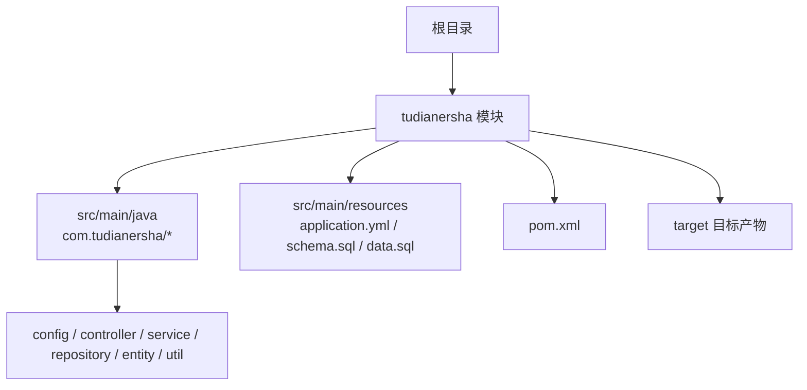
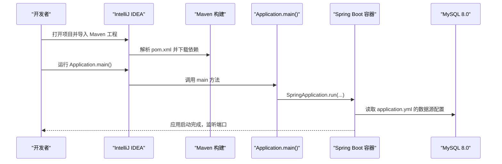
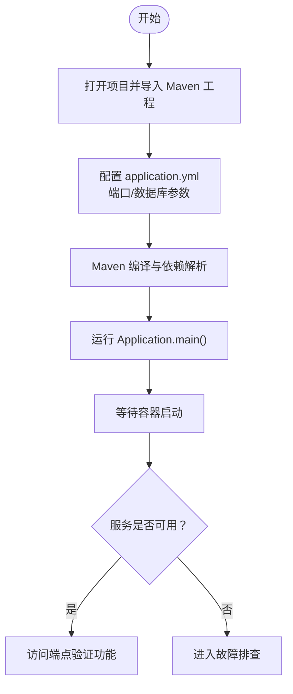
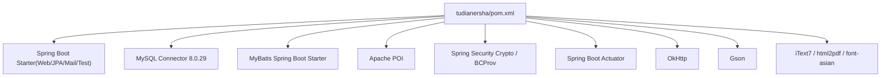

# 开发环境搭建

<cite>
**本文引用的文件**
- [pom.xml](file://pom.xml)
- [tudianersha/pom.xml](file://tudianersha/pom.xml)
- [tudianersha/src/main/resources/application.yml](file://tudianersha/src/main/resources/application.yml)
- [tudianersha/src/main/java/com/tudianersha/Application.java](file://tudianersha/src/main/java/com/tudianersha/Application.java)
- [tudianersha/src/main/java/com/tudianersha/config/DatabaseConfig.java](file://tudianersha/src/main/java/com/tudianersha/config/DatabaseConfig.java)
- [tudianersha/src/main/resources/schema.sql](file://tudianersha/src/main/resources/schema.sql)
- [tudianersha/src/main/resources/data.sql](file://tudianersha/src/main/resources/data.sql)
- [tudianersha/README.md](file://tudianersha/README.md)
- [tudianersha/src/main/java/com/tudianersha/controller/UserController.java](file://tudianersha/src/main/java/com/tudianersha/controller/UserController.java)
- [tudianersha/src/main/java/com/tudianersha/entity/User.java](file://tudianersha/src/main/java/com/tudianersha/entity/User.java)
</cite>

## 目录
1. [简介](#简介)
2. [项目结构](#项目结构)
3. [核心组件](#核心组件)
4. [架构总览](#架构总览)
5. [详细组件分析](#详细组件分析)
6. [依赖分析](#依赖分析)
7. [性能考虑](#性能考虑)
8. [故障排查指南](#故障排查指南)
9. [结论](#结论)
10. [附录](#附录)

## 简介
本指南面向开发者，帮助你从零开始搭建本项目的开发环境，包括：
- 安装与配置 Java 11 与 Maven
- 使用 IntelliJ IDEA 导入 Maven 工程并启用 Lombok 插件
- 配置并启动 MySQL 8.0 数据库，创建 tudianersha 数据库
- 在 application.yml 中配置数据库连接参数
- 运行 Application.java 启动 Spring Boot 应用，并验证服务在 8080 端口正常启动
- 常见问题排查：Lombok 注解不生效、端口冲突、数据库连接失败等

## 项目结构
该仓库包含一个标准的 Spring Boot Maven 工程，位于 tudianersha 子目录下。核心结构如下：
- 源代码：src/main/java 下按包划分的 controller、service、repository、entity、config、util 等层
- 资源文件：src/main/resources 下包含 application.yml、schema.sql、data.sql 等
- 构建配置：根目录与模块目录均包含 pom.xml，统一管理依赖与构建插件
- 测试：src/test 下包含单元测试样例

**章节来源**
- [tudianersha/pom.xml](file://tudianersha/pom.xml#L1-L180)
- [tudianersha/src/main/resources/application.yml](file://tudianersha/src/main/resources/application.yml#L1-L57)

## 核心组件
- 应用入口：Application.java 提供 Spring Boot 启动入口
- 数据库配置：application.yml 中定义了 server.port、spring.datasource、spring.jpa 等关键参数
- JPA 配置：DatabaseConfig.java 启用了 JPA Repository 扫描
- 示例实体与控制器：User 实体与 UserController 展示了典型的 CRUD 接口与业务流程

**章节来源**
- [tudianersha/src/main/java/com/tudianersha/Application.java](file://tudianersha/src/main/java/com/tudianersha/Application.java#L1-L12)
- [tudianersha/src/main/resources/application.yml](file://tudianersha/src/main/resources/application.yml#L1-L57)
- [tudianersha/src/main/java/com/tudianersha/config/DatabaseConfig.java](file://tudianersha/src/main/java/com/tudianersha/config/DatabaseConfig.java#L1-L10)
- [tudianersha/src/main/java/com/tudianersha/entity/User.java](file://tudianersha/src/main/java/com/tudianersha/entity/User.java#L1-L73)
- [tudianersha/src/main/java/com/tudianersha/controller/UserController.java](file://tudianersha/src/main/java/com/tudianersha/controller/UserController.java#L1-L152)

## 架构总览
下图展示了应用启动与数据库访问的关键交互路径。

**图表来源**
- [tudianersha/src/main/java/com/tudianersha/Application.java](file://tudianersha/src/main/java/com/tudianersha/Application.java#L1-L12)
- [tudianersha/src/main/resources/application.yml](file://tudianersha/src/main/resources/application.yml#L1-L57)
- [tudianersha/pom.xml](file://tudianersha/pom.xml#L1-L180)

## 详细组件分析

### 1. 开发工具与环境准备
- 推荐使用 IntelliJ IDEA 作为开发工具
- 必须安装 Lombok 插件以支持注解处理（如实体类的注解）
- 项目要求 Java 11 与 Maven

操作要点
- 在 IntelliJ IDEA 中打开项目根目录，选择 tudianersha/pom.xml 导入为 Maven 工程
- 安装 Lombok 插件并在编译器设置中启用注解处理
- 确认 JDK 为 Java 11，Maven 版本满足工程要求

**章节来源**
- [tudianersha/README.md](file://tudianersha/README.md#L63-L66)
- [tudianersha/pom.xml](file://tudianersha/pom.xml#L16-L23)

### 2. 数据库服务配置与初始化
- 安装 MySQL 8.0
- 创建数据库 tudianersha
- 可选：执行 schema.sql 与 data.sql 初始化表结构与基础数据

数据库初始化脚本位置
- 表结构初始化：schema.sql
- 初始数据：data.sql

**章节来源**
- [tudianersha/README.md](file://tudianersha/README.md#L38-L41)
- [tudianersha/src/main/resources/schema.sql](file://tudianersha/src/main/resources/schema.sql#L1-L123)
- [tudianersha/src/main/resources/data.sql](file://tudianersha/src/main/resources/data.sql#L1-L7)

### 3. 数据库连接参数配置
- application.yml 中包含 server.port、spring.datasource、spring.jpa 等配置项
- 默认端口为 8010；若需改为 8080，请修改 server.port
- 数据源驱动、URL、用户名、密码等均在 application.yml 中定义

配置参考路径
- 端口与数据源：application.yml
- JPA 方言与自动建模策略：application.yml
- MyBatis 映射与类型别名：application.yml

**章节来源**
- [tudianersha/src/main/resources/application.yml](file://tudianersha/src/main/resources/application.yml#L1-L57)

### 4. 启动 Spring Boot 应用
- 运行入口：Application.java 的 main 方法
- 启动方式建议
  - 在 IDE 中直接运行 Application.main()
  - 或使用 Maven 命令：mvn spring-boot:run
- 验证服务
  - 访问 http://localhost:8080（或实际端口）查看健康状态或接口响应
  - 可使用 /api/users 接口进行基本验证

启动与验证流程

**图表来源**
- [tudianersha/src/main/java/com/tudianersha/Application.java](file://tudianersha/src/main/java/com/tudianersha/Application.java#L1-L12)
- [tudianersha/src/main/resources/application.yml](file://tudianersha/src/main/resources/application.yml#L1-L57)
- [tudianersha/src/main/java/com/tudianersha/controller/UserController.java](file://tudianersha/src/main/java/com/tudianersha/controller/UserController.java#L1-L152)

## 依赖分析
- Java 版本：Java 11（maven.compiler.source/target）
- Spring Boot：2.7.0
- 数据库：MySQL 8.0（驱动版本 8.0.29）
- ORM：JPA/Hibernate、MyBatis
- 其他：邮件、安全加密、PDF、HTTP 客户端、测试框架等

依赖关系示意

**图表来源**
- [tudianersha/pom.xml](file://tudianersha/pom.xml#L16-L169)

**章节来源**
- [tudianersha/pom.xml](file://tudianersha/pom.xml#L16-L169)

## 性能考虑
- 合理设置数据库连接池大小与超时时间
- 生产环境建议关闭 show-sql 与调试日志级别
- 对大对象（如 PDF、文档）生成采用异步或流式处理
- 使用缓存与分页减少数据库压力

[本节为通用建议，无需特定文件引用]

## 故障排查指南

常见问题与解决思路
- Lombok 注解不生效
  - 确认已安装 Lombok 插件并启用注解处理
  - 清理并重新编译项目
  - 检查 IDE 的编译器设置中是否启用了“注解处理”
- 端口冲突
  - 修改 application.yml 中的 server.port 为未被占用的端口（例如 8080）
  - 或停止占用端口的其他进程
- 数据库连接失败
  - 检查 application.yml 中的数据库 URL、用户名、密码
  - 确认 MySQL 服务已启动且可访问
  - 确认 tudianersha 数据库已创建
  - 若使用 SSL 或时区问题导致连接异常，可在 URL 参数中调整（如时区、SSL 设置）

验证步骤
- 启动应用后访问 /api/users 获取用户列表，确认接口返回正常
- 查看控制台日志，确认数据库连接与 JPA 初始化无错误

**章节来源**
- [tudianersha/src/main/resources/application.yml](file://tudianersha/src/main/resources/application.yml#L1-L57)
- [tudianersha/src/main/java/com/tudianersha/controller/UserController.java](file://tudianersha/src/main/java/com/tudianersha/controller/UserController.java#L1-L152)
- [tudianersha/README.md](file://tudianersha/README.md#L38-L47)

## 结论
按照本指南完成 Java 11、Maven、IntelliJ IDEA（含 Lombok 插件）、MySQL 8.0 的安装与配置，并正确设置 application.yml 中的数据库连接参数后，即可顺利启动并验证 Spring Boot 应用。遇到问题时，优先检查 Lombok 注解处理、端口占用与数据库连通性，结合日志与示例接口快速定位。

[本节为总结，无需特定文件引用]

## 附录

### A. 端口与默认值对照
- 默认服务器端口：8010（可在 application.yml 中修改）
- 常用端口：8080（可作为目标端口）

**章节来源**
- [tudianersha/src/main/resources/application.yml](file://tudianersha/src/main/resources/application.yml#L1-L3)

### B. 数据库初始化清单
- 创建数据库：tudianersha
- 初始化表结构：schema.sql
- 插入初始数据：data.sql

**章节来源**
- [tudianersha/src/main/resources/schema.sql](file://tudianersha/src/main/resources/schema.sql#L1-L123)
- [tudianersha/src/main/resources/data.sql](file://tudianersha/src/main/resources/data.sql#L1-L7)

### C. 启动与验证清单
- 在 IDE 中运行 Application.main()
- 访问 /api/users 验证接口
- 如需切换端口，修改 application.yml 中的 server.port

**章节来源**
- [tudianersha/src/main/java/com/tudianersha/Application.java](file://tudianersha/src/main/java/com/tudianersha/Application.java#L1-L12)
- [tudianersha/src/main/java/com/tudianersha/controller/UserController.java](file://tudianersha/src/main/java/com/tudianersha/controller/UserController.java#L1-L152)
- [tudianersha/src/main/resources/application.yml](file://tudianersha/src/main/resources/application.yml#L1-L57)