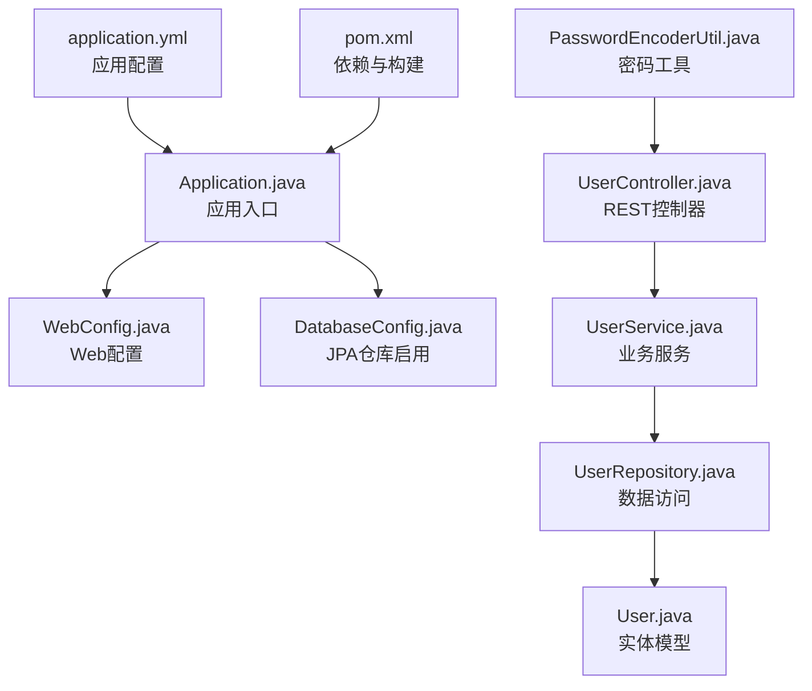
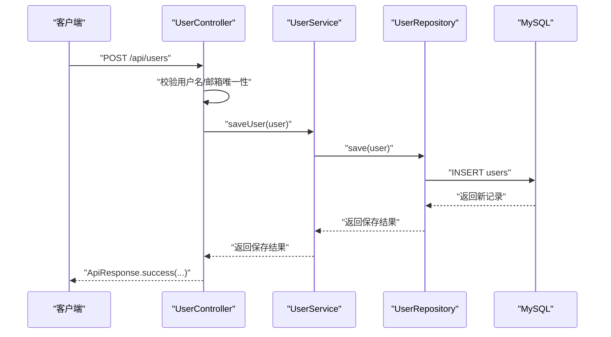
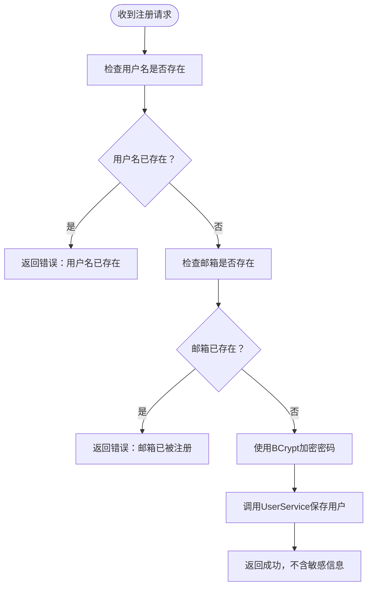
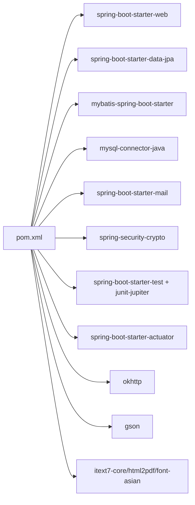
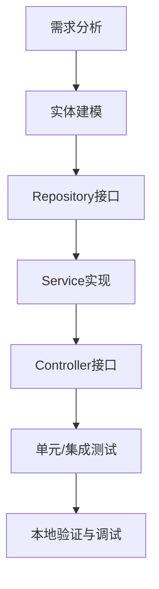

# 开发者指南

<cite>
**本文引用的文件**
- [Application.java](file://tudianersha/src/main/java/com/tudianersha/Application.java)
- [pom.xml](file://tudianersha/pom.xml)
- [application.yml](file://tudianersha/src/main/resources/application.yml)
- [README.md](file://tudianersha/README.md)
- [UserController.java](file://tudianersha/src/main/java/com/tudianersha/controller/UserController.java)
- [UserService.java](file://tudianersha/src/main/java/com/tudianersha/service/UserService.java)
- [UserRepository.java](file://tudianersha/src/main/java/com/tudianersha/repository/UserRepository.java)
- [User.java](file://tudianersha/src/main/java/com/tudianersha/entity/User.java)
- [PasswordEncoderUtil.java](file://tudianersha/src/main/java/com/tudianersha/util/PasswordEncoderUtil.java)
- [UserServiceTest.java](file://tudianersha/src/test/java/com/tudianersha/UserServiceTest.java)
- [DatabaseConfig.java](file://tudianersha/src/main/java/com/tudianersha/config/DatabaseConfig.java)
- [HealthController.java](file://tudianersha/src/main/java/com/tudianersha/controller/HealthController.java)
- [ApiTestController.java](file://tudianersha/src/main/java/com/tudianersha/controller/ApiTestController.java)
</cite>

## 目录
1. [简介](#简介)
2. [项目结构](#项目结构)
3. [核心组件](#核心组件)
4. [架构总览](#架构总览)
5. [详细组件分析](#详细组件分析)
6. [依赖关系分析](#依赖关系分析)
7. [性能与优化建议](#性能与优化建议)
8. [测试策略与覆盖率](#测试策略与覆盖率)
9. [调试与本地运行](#调试与本地运行)
10. [工具类使用说明](#工具类使用说明)
11. [新功能开发流程](#新功能开发流程)
12. [代码审查清单](#代码审查清单)
13. [常见问题排查](#常见问题排查)
14. [结语](#结语)

## 简介
本指南面向贡献代码的开发者，帮助你快速搭建开发环境、理解代码规范、掌握测试与调试方法，并提供新功能开发流程与性能优化建议。项目基于 Spring Boot 2.7.0、MySQL 8.0、JPA/Hibernate 与 MyBatis，采用 Maven 构建。

## 项目结构
- 入口类位于 com.tudianersha.Application，负责启动 Spring Boot 应用。
- 控制器层位于 com.tudianersha.controller，提供 REST 接口。
- 业务服务层位于 com.tudianersha.service，封装领域逻辑。
- 数据访问层位于 com.tudianersha.repository，基于 Spring Data JPA。
- 实体模型位于 com.tudianersha.entity。
- 工具类位于 com.tudianersha.util。
- 配置类位于 com.tudianersha.config。
- 测试位于 src/test/java，使用 JUnit 5 与 Spring Boot Test。

图表来源
- [Application.java](file://tudianersha/src/main/java/com/tudianersha/Application.java#L1-L12)
- [DatabaseConfig.java](file://tudianersha/src/main/java/com/tudianersha/config/DatabaseConfig.java#L1-L10)
- [UserController.java](file://tudianersha/src/main/java/com/tudianersha/controller/UserController.java#L1-L152)
- [UserService.java](file://tudianersha/src/main/java/com/tudianersha/service/UserService.java#L1-L48)
- [UserRepository.java](file://tudianersha/src/main/java/com/tudianersha/repository/UserRepository.java#L1-L15)
- [User.java](file://tudianersha/src/main/java/com/tudianersha/entity/User.java#L1-L73)
- [PasswordEncoderUtil.java](file://tudianersha/src/main/java/com/tudianersha/util/PasswordEncoderUtil.java#L1-L33)
- [application.yml](file://tudianersha/src/main/resources/application.yml#L1-L57)
- [pom.xml](file://tudianersha/pom.xml#L1-L180)

章节来源
- [README.md](file://tudianersha/README.md#L1-L66)
- [pom.xml](file://tudianersha/pom.xml#L1-L180)
- [application.yml](file://tudianersha/src/main/resources/application.yml#L1-L57)

## 核心组件
- 应用入口：Application.java 提供 main 方法启动 Spring Boot。
- 数据库配置：DatabaseConfig.java 启用 JPA 仓库扫描。
- 控制器：UserController.java 提供用户注册、登录、CRUD 等接口。
- 服务层：UserService.java 封装用户相关业务逻辑。
- 数据访问：UserRepository.java 继承 JpaRepository，提供基础 CRUD 与自定义查询方法。
- 实体：User.java 定义用户表结构。
- 工具类：PasswordEncoderUtil.java 提供 BCrypt 密码编码与匹配。
- 测试：UserServiceTest.java 展示 JUnit 5 与 Spring Boot Test 的使用方式。

章节来源
- [Application.java](file://tudianersha/src/main/java/com/tudianersha/Application.java#L1-L12)
- [DatabaseConfig.java](file://tudianersha/src/main/java/com/tudianersha/config/DatabaseConfig.java#L1-L10)
- [UserController.java](file://tudianersha/src/main/java/com/tudianersha/controller/UserController.java#L1-L152)
- [UserService.java](file://tudianersha/src/main/java/com/tudianersha/service/UserService.java#L1-L48)
- [UserRepository.java](file://tudianersha/src/main/java/com/tudianersha/repository/UserRepository.java#L1-L15)
- [User.java](file://tudianersha/src/main/java/com/tudianersha/entity/User.java#L1-L73)
- [PasswordEncoderUtil.java](file://tudianersha/src/main/java/com/tudianersha/util/PasswordEncoderUtil.java#L1-L33)
- [UserServiceTest.java](file://tudianersha/src/test/java/com/tudianersha/UserServiceTest.java#L1-L55)

## 架构总览
系统采用经典的三层架构：
- 表现层：Controller 接收请求，返回 ApiResponse 包裹的数据。
- 领域层：Service 处理业务规则，调用 Repository。
- 数据持久层：Repository 通过 JPA/Hibernate 访问数据库；MyBatis 通过 xml 映射文件处理特定 SQL。

图表来源
- [UserController.java](file://tudianersha/src/main/java/com/tudianersha/controller/UserController.java#L42-L84)
- [UserService.java](file://tudianersha/src/main/java/com/tudianersha/service/UserService.java#L21-L31)
- [UserRepository.java](file://tudianersha/src/main/java/com/tudianersha/repository/UserRepository.java#L1-L15)

## 详细组件分析

### 控制器层：UserController
- 提供用户列表、按 ID 查询、注册、登录、更新、删除等接口。
- 注册时对用户名/邮箱唯一性进行检查，并使用 PasswordEncoderUtil 对密码进行加密。
- 登录时支持用户名或邮箱登录，并验证密码。

图表来源
- [UserController.java](file://tudianersha/src/main/java/com/tudianersha/controller/UserController.java#L42-L84)
- [PasswordEncoderUtil.java](file://tudianersha/src/main/java/com/tudianersha/util/PasswordEncoderUtil.java#L1-L33)

章节来源
- [UserController.java](file://tudianersha/src/main/java/com/tudianersha/controller/UserController.java#L1-L152)

### 服务层：UserService
- 提供用户查询、保存、删除、唯一性校验等方法。
- 依赖 UserRepository 完成数据访问。

章节来源
- [UserService.java](file://tudianersha/src/main/java/com/tudianersha/service/UserService.java#L1-L48)
- [UserRepository.java](file://tudianersha/src/main/java/com/tudianersha/repository/UserRepository.java#L1-L15)

### 数据访问层：UserRepository
- 继承 JpaRepository，提供基础 CRUD 与自定义查询方法（按用户名、邮箱查询与存在性判断）。

章节来源
- [UserRepository.java](file://tudianersha/src/main/java/com/tudianersha/repository/UserRepository.java#L1-L15)

### 实体层：User
- 定义用户表字段与基本构造函数、getter/setter、toString。

章节来源
- [User.java](file://tudianersha/src/main/java/com/tudianersha/entity/User.java#L1-L73)

### 工具类：PasswordEncoderUtil
- 提供静态方法对原始密码进行编码与匹配，便于在控制器与服务层统一使用。

章节来源
- [PasswordEncoderUtil.java](file://tudianersha/src/main/java/com/tudianersha/util/PasswordEncoderUtil.java#L1-L33)

### 配置与启动
- Application.java 启动应用。
- DatabaseConfig.java 启用 JPA 仓库扫描。
- application.yml 配置数据库连接、JPA 方言、日志级别、邮件与第三方 API 参数等。

章节来源
- [Application.java](file://tudianersha/src/main/java/com/tudianersha/Application.java#L1-L12)
- [DatabaseConfig.java](file://tudianersha/src/main/java/com/tudianersha/config/DatabaseConfig.java#L1-L10)
- [application.yml](file://tudianersha/src/main/resources/application.yml#L1-L57)

## 依赖关系分析
- pom.xml 中引入 Spring Boot Web、Data JPA、MyBatis、MySQL Connector、Spring Mail、Spring Security Crypto、JUnit 5、Actuator、OkHttp、Gson、iText 等依赖。
- 构建阶段使用 spring-boot-maven-plugin。

图表来源
- [pom.xml](file://tudianersha/pom.xml#L1-L180)

章节来源
- [pom.xml](file://tudianersha/pom.xml#L1-L180)

## 性能与优化建议
- 避免 N+1 查询
  - 在关联查询场景中，优先使用 JOIN FETCH 或 @NamedEntityGraph 预加载关联实体，减少懒加载触发的额外查询。
  - 对高频查询建立合适的索引（如用户表的 username、email 字段）。
- 批量操作
  - 对批量插入/更新使用批处理或原生 SQL，降低 ORM 层开销。
- 分页与限制
  - 列表查询使用分页参数，避免一次性加载大量数据。
- 缓存策略
  - 对热点数据使用缓存（如 Redis），减少数据库压力。
- 日志与监控
  - 启用 Actuator，结合日志级别定位慢查询与异常。

[本节为通用建议，无需列出具体文件来源]

## 测试策略与覆盖率
- 单元测试
  - 使用 JUnit 5 与 Spring Boot Test，在 UserServiceTest.java 中演示了基于 @SpringBootTest 的上下文加载与 @MockBean 的模拟注入。
  - 测试覆盖点包括 saveUser 与 findByUsername 等关键路径。
- 集成测试
  - 可扩展至控制器层测试，使用 @WebMvcTest 或 @SpringBootTest 验证接口行为。
- 覆盖率要求
  - 建议核心业务逻辑（Service 与关键 Repository 方法）达到较高覆盖率（如 >80%），并保证边界条件与异常分支被覆盖。

章节来源
- [UserServiceTest.java](file://tudianersha/src/test/java/com/tudianersha/UserServiceTest.java#L1-L55)
- [pom.xml](file://tudianersha/pom.xml#L104-L118)

## 调试与本地运行
- 开发环境
  - 推荐使用 IntelliJ IDEA，并安装 Lombok 插件以支持注解生成。
- 启动应用
  - 在 IDE 中直接运行 Application.main() 设置断点进行调试。
  - 或使用命令行执行 mvn spring-boot:run。
- API 调试
  - 使用 Postman 发送请求到 /api/users、/api/users/login 等端点，观察响应与状态码。
  - 可参考 README.md 中列出的 API 端点进行验证。

章节来源
- [README.md](file://tudianersha/README.md#L63-L66)
- [Application.java](file://tudianersha/src/main/java/com/tudianersha/Application.java#L1-L12)
- [HealthController.java](file://tudianersha/src/main/java/com/tudianersha/controller/HealthController.java#L1-L15)
- [ApiTestController.java](file://tudianersha/src/main/java/com/tudianersha/controller/ApiTestController.java#L1-L15)

## 工具类使用说明
- PasswordEncoderUtil
  - 在注册时对明文密码进行编码，再保存到数据库。
  - 在登录时使用 matches 校验输入密码与存储密码是否一致。
  - 注意：不要在业务层直接拼接字符串进行加密，应通过工具类方法调用。

章节来源
- [UserController.java](file://tudianersha/src/main/java/com/tudianersha/controller/UserController.java#L61-L76)
- [UserController.java](file://tudianersha/src/main/java/com/tudianersha/controller/UserController.java#L109-L113)
- [PasswordEncoderUtil.java](file://tudianersha/src/main/java/com/tudianersha/util/PasswordEncoderUtil.java#L1-L33)

## 新功能开发流程
- 需求分析
  - 明确接口职责、输入输出、异常处理与边界条件。
- 设计与建模
  - 在 entity 下新增实体类，定义字段与关系。
- 数据访问层
  - 在 repository 下新增接口，继承 JpaRepository 并补充自定义查询方法。
- 业务服务层
  - 在 service 下新增服务类，实现业务逻辑，注入对应 Repository。
- 控制器层
  - 在 controller 下新增控制器，接收请求参数，调用服务层，返回 ApiResponse。
- 测试
  - 在 test 下新增测试类，使用 @SpringBootTest 与 @MockBean 模拟依赖，覆盖正常与异常分支。
- 集成与验证
  - 启动应用，使用 Postman 验证接口行为，确保日志与异常处理符合预期。

[本图为概念流程图，无需列出具体文件来源]

## 代码审查清单
- 命名规范
  - 类名使用帕斯卡命名法；方法与变量使用驼峰命名；常量全大写并以下划线分隔。
- 注释要求
  - 公共接口与复杂逻辑需添加清晰注释，说明入参、出参、异常与注意事项。
- Git 提交信息
  - 使用类型+模块+简述的格式，例如 feat(user): 添加用户注册接口。
- 错误处理
  - 对空值、重复、数据库异常等情况进行显式处理并返回合理状态码。
- 安全性
  - 密码必须加密存储；敏感信息不在日志中打印。
- 性能
  - 避免 N+1 查询；对高频查询使用缓存与索引；控制一次性加载数据量。
- 测试
  - 关键路径具备单元测试；边界与异常分支覆盖完善。

[本节为通用规范，无需列出具体文件来源]

## 常见问题排查
- 启动失败
  - 检查 application.yml 中数据库连接参数与驱动类名是否正确。
  - 确认数据库已创建且账号密码可用。
- 接口报错
  - 使用 Postman 观察状态码与响应体，结合日志定位问题。
  - 若涉及第三方 API（如邮件、高德地图），检查配置项与网络连通性。
- 密码无法登录
  - 确认注册时是否正确加密；登录时是否使用 matches 校验。

章节来源
- [application.yml](file://tudianersha/src/main/resources/application.yml#L1-L57)
- [UserController.java](file://tudianersha/src/main/java/com/tudianersha/controller/UserController.java#L61-L76)
- [UserController.java](file://tudianersha/src/main/java/com/tudianersha/controller/UserController.java#L109-L113)

## 结语
遵循本指南可帮助你高效完成开发、测试与调试工作。请在提交代码前完成自测与代码审查，确保质量与一致性。