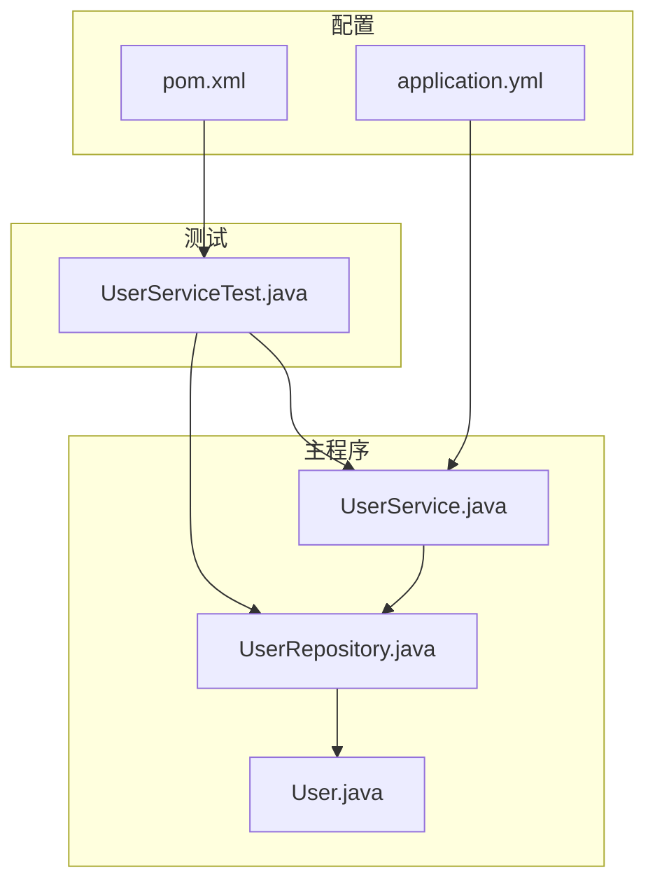
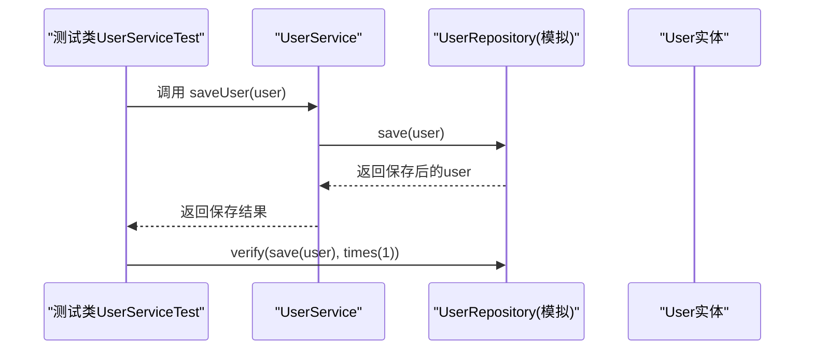
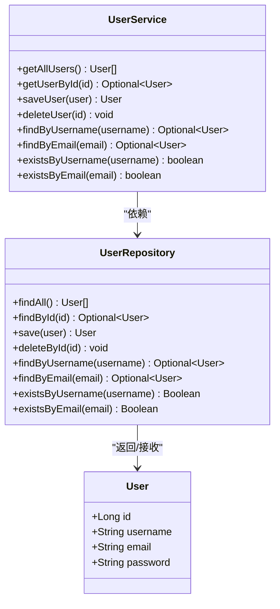
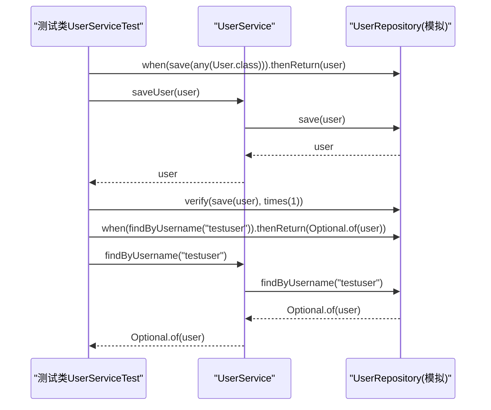
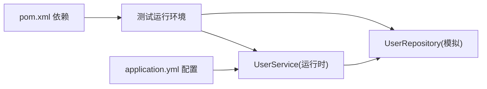

# 单元测试

<cite>
**本文引用的文件**
- [UserService.java](file://tudianersha/src/main/java/com/tudianersha/service/UserService.java)
- [UserRepository.java](file://tudianersha/src/main/java/com/tudianersha/repository/UserRepository.java)
- [User.java](file://tudianersha/src/main/java/com/tudianersha/entity/User.java)
- [UserServiceTest.java](file://tudianersha/src/test/java/com/tudianersha/UserServiceTest.java)
- [pom.xml](file://tudianersha/pom.xml)
- [application.yml](file://tudianersha/src/main/resources/application.yml)
</cite>

## 目录
1. [引言](#引言)
2. [项目结构](#项目结构)
3. [核心组件](#核心组件)
4. [架构总览](#架构总览)
5. [详细组件分析](#详细组件分析)
6. [依赖分析](#依赖分析)
7. [性能考虑](#性能考虑)
8. [故障排查指南](#故障排查指南)
9. [结论](#结论)
10. [附录](#附录)

## 引言
本文件围绕Service层核心业务逻辑构建完善的单元测试策略，重点以UserService为例，结合Junit 5与Mockito框架，通过@MockBean隔离Repository依赖，确保测试不依赖真实数据库。文档涵盖：
- 使用when().thenReturn()定义模拟行为
- 使用verify()验证方法调用次数
- 使用assert断言验证结果
- 测试实体对象创建、参数匹配器（any(User.class)）、Optional类型处理
- @Test注解、@SpringBootTest上下文加载机制
- Given-When-Then结构组织方式

## 项目结构
该模块采用Spring Boot工程结构，Service层位于service包，Repository层位于repository包，实体类位于entity包；测试位于test目录下，遵循“按包名对齐”的测试组织方式。

图表来源
- [UserService.java](file://tudianersha/src/main/java/com/tudianersha/service/UserService.java#L1-L48)
- [UserRepository.java](file://tudianersha/src/main/java/com/tudianersha/repository/UserRepository.java#L1-L15)
- [User.java](file://tudianersha/src/main/java/com/tudianersha/entity/User.java#L1-L73)
- [UserServiceTest.java](file://tudianersha/src/test/java/com/tudianersha/UserServiceTest.java#L1-L55)
- [pom.xml](file://tudianersha/pom.xml#L1-L180)
- [application.yml](file://tudianersha/src/main/resources/application.yml#L1-L57)

章节来源
- [UserService.java](file://tudianersha/src/main/java/com/tudianersha/service/UserService.java#L1-L48)
- [UserRepository.java](file://tudianersha/src/main/java/com/tudianersha/repository/UserRepository.java#L1-L15)
- [User.java](file://tudianersha/src/main/java/com/tudianersha/entity/User.java#L1-L73)
- [UserServiceTest.java](file://tudianersha/src/test/java/com/tudianersha/UserServiceTest.java#L1-L55)
- [pom.xml](file://tudianersha/pom.xml#L1-L180)
- [application.yml](file://tudianersha/src/main/resources/application.yml#L1-L57)

## 核心组件
- UserService：封装用户相关业务逻辑，依赖UserRepository完成持久化操作。
- UserRepository：基于Spring Data JPA接口，提供按用户名/邮箱查询、存在性检查等方法。
- User：JPA实体，包含id、username、email、password等字段及构造函数、getter/setter。
- UserServiceTest：使用@SpringBootTest加载Spring上下文，@MockBean注入UserRepository模拟对象，覆盖saveUser与findByUsername两个典型场景。

章节来源
- [UserService.java](file://tudianersha/src/main/java/com/tudianersha/service/UserService.java#L1-L48)
- [UserRepository.java](file://tudianersha/src/main/java/com/tudianersha/repository/UserRepository.java#L1-L15)
- [User.java](file://tudianersha/src/main/java/com/tudianersha/entity/User.java#L1-L73)
- [UserServiceTest.java](file://tudianersha/src/test/java/com/tudianersha/UserServiceTest.java#L1-L55)

## 架构总览
下面的序列图展示了UserService在保存用户时的调用链，以及测试中如何通过Mockito拦截Repository调用并返回预期结果。

图表来源
- [UserServiceTest.java](file://tudianersha/src/test/java/com/tudianersha/UserServiceTest.java#L26-L40)
- [UserService.java](file://tudianersha/src/main/java/com/tudianersha/service/UserService.java#L25-L27)
- [UserRepository.java](file://tudianersha/src/main/java/com/tudianersha/repository/UserRepository.java#L1-L15)
- [User.java](file://tudianersha/src/main/java/com/tudianersha/entity/User.java#L1-L73)

## 详细组件分析

### UserService类分析
- 职责：封装用户管理的核心业务，包括查询全部、按ID查询、保存、删除、按用户名/邮箱查询以及存在性检查。
- 依赖：通过@Autowired注入UserRepository，所有持久化操作委托给Repository。
- 方法要点：
  - getAllUsers：委托findAll。
  - getUserById：委托findById。
  - saveUser：委托save。
  - deleteUser：委托deleteById。
  - findByUsername/findByEmail：委托对应查询方法，返回Optional<User>。
  - existsByUsername/existsByEmail：委托对应存在性检查方法，返回Boolean。

图表来源
- [UserService.java](file://tudianersha/src/main/java/com/tudianersha/service/UserService.java#L1-L48)
- [UserRepository.java](file://tudianersha/src/main/java/com/tudianersha/repository/UserRepository.java#L1-L15)
- [User.java](file://tudianersha/src/main/java/com/tudianersha/entity/User.java#L1-L73)

章节来源
- [UserService.java](file://tudianersha/src/main/java/com/tudianersha/service/UserService.java#L1-L48)
- [UserRepository.java](file://tudianersha/src/main/java/com/tudianersha/repository/UserRepository.java#L1-L15)
- [User.java](file://tudianersha/src/main/java/com/tudianersha/entity/User.java#L1-L73)

### UserServiceTest类分析
- 上下文加载：@SpringBootTest加载Spring应用上下文，确保能注入UserService。
- 模拟依赖：@MockBean注入UserRepository，替代真实Repository，避免访问数据库。
- 测试方法：
  - testSaveUser：使用when(...).thenReturn(...)定义save行为，使用verify确认调用次数，使用assert断言结果。
  - testFindByUsername：使用when(...).thenReturn(...)定义findByUsername行为，使用assertTrue/assertEquals断言Optional内容。

图表来源
- [UserServiceTest.java](file://tudianersha/src/test/java/com/tudianersha/UserServiceTest.java#L26-L55)
- [UserService.java](file://tudianersha/src/main/java/com/tudianersha/service/UserService.java#L25-L39)
- [UserRepository.java](file://tudianersha/src/main/java/com/tudianersha/repository/UserRepository.java#L1-L15)

章节来源
- [UserServiceTest.java](file://tudianersha/src/test/java/com/tudianersha/UserServiceTest.java#L1-L55)

### 编码实践与最佳实践
- 测试实体对象创建：在测试中直接构造User实体，避免外部依赖。
- 参数匹配器：使用any(User.class)匹配任意User实例，便于统一模拟save行为。
- Optional类型处理：当Repository返回Optional时，使用isPresent()/get()或断言其值，确保空值场景被覆盖。
- Given-When-Then结构：
  - Given：准备输入与模拟行为（when(...).thenReturn(...)）
  - When：调用被测方法
  - Then：断言结果与副作用（verify调用次数、assert断言）
- 断言与验证：
  - 使用AssertJ风格断言（如assertNotNull/assertEquals）验证返回值
  - 使用verify(times(n))验证方法被调用且次数正确
- 边界条件建议：
  - 空Optional场景：模拟findByUsername/findByEmail返回Optional.empty()
  - 不存在的ID：模拟deleteById无异常但无效果
  - 重复用户名/邮箱：模拟existsByUsername/existsByEmail返回true/false

章节来源
- [UserServiceTest.java](file://tudianersha/src/test/java/com/tudianersha/UserServiceTest.java#L26-L55)
- [User.java](file://tudianersha/src/main/java/com/tudianersha/entity/User.java#L1-L73)

## 依赖分析
- Maven依赖：pom.xml引入spring-boot-starter-test与junit-jupiter，为测试提供运行环境与断言工具。
- Spring配置：application.yml提供数据库连接与JPA配置，但测试通过@MockBean绕过真实数据源。
- 组件耦合：UserService对UserRepository存在直接依赖，测试通过Mock对象解耦，提高可测试性与执行速度。

图表来源
- [pom.xml](file://tudianersha/pom.xml#L104-L118)
- [application.yml](file://tudianersha/src/main/resources/application.yml#L1-L57)
- [UserService.java](file://tudianersha/src/main/java/com/tudianersha/service/UserService.java#L1-L48)
- [UserRepository.java](file://tudianersha/src/main/java/com/tudianersha/repository/UserRepository.java#L1-L15)

章节来源
- [pom.xml](file://tudianersha/pom.xml#L104-L118)
- [application.yml](file://tudianersha/src/main/resources/application.yml#L1-L57)
- [UserService.java](file://tudianersha/src/main/java/com/tudianersha/service/UserService.java#L1-L48)
- [UserRepository.java](file://tudianersha/src/main/java/com/tudianersha/repository/UserRepository.java#L1-L15)

## 性能考虑
- 单元测试应避免真实数据库IO，使用@MockBean可显著提升执行速度与稳定性。
- 对于复杂业务，优先拆分职责，减少跨层依赖，便于独立测试。
- 使用参数匹配器any()可减少重复桩代码，提高可维护性。

## 故障排查指南
- 测试未断言到Repository调用：检查verify是否被调用且times(1)与实际调用一致。
- Optional断言失败：确认when(...).thenReturn(...)返回了Optional.of(...)而非Optional.empty()。
- 输入参数不匹配：使用any(User.class)等匹配器，避免严格相等导致的匹配失败。
- 上下文加载问题：确保使用@SpringBootTest注解，并保证测试类与被测组件在同一包或子包内。

章节来源
- [UserServiceTest.java](file://tudianersha/src/test/java/com/tudianersha/UserServiceTest.java#L26-L55)

## 结论
通过@MockBean隔离Repository依赖，结合JUnit 5与Mockito，可以高效地对UserService进行隔离测试。本文给出的Given-When-Then结构、参数匹配器与Optional处理实践，有助于构建高可读性与高覆盖率的单元测试，同时保持对真实数据库的零依赖。

## 附录
- 建议新增测试场景（思路示例，不包含具体代码）：
  - testFindByUsername返回空：模拟findByUsername返回Optional.empty()，断言isPresent为false。
  - testExistsByUsername：模拟existsByUsername返回true/false，断言布尔值。
  - testDeleteUser：模拟deleteById无异常，verify确认调用一次。
  - testSaveUser异常路径：模拟save抛出异常，验证异常传播与日志记录（如需）。
- 参考路径：
  - [UserServiceTest.java](file://tudianersha/src/test/java/com/tudianersha/UserServiceTest.java#L26-L55)
  - [UserService.java](file://tudianersha/src/main/java/com/tudianersha/service/UserService.java#L1-L48)
  - [UserRepository.java](file://tudianersha/src/main/java/com/tudianersha/repository/UserRepository.java#L1-L15)
  - [User.java](file://tudianersha/src/main/java/com/tudianersha/entity/User.java#L1-L73)
  - [pom.xml](file://tudianersha/pom.xml#L104-L118)
  - [application.yml](file://tudianersha/src/main/resources/application.yml#L1-L57)