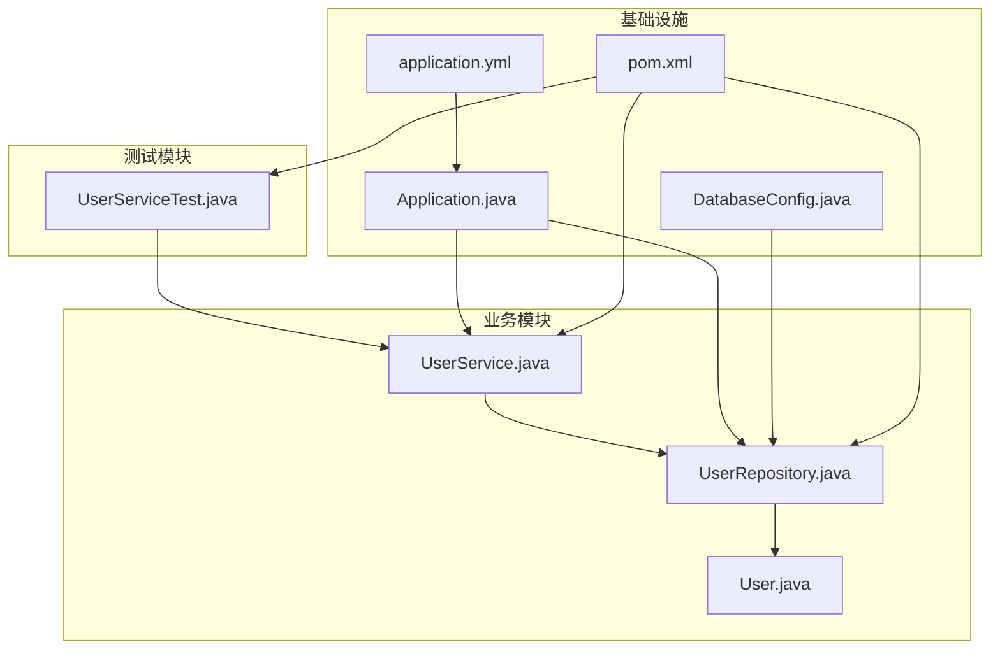
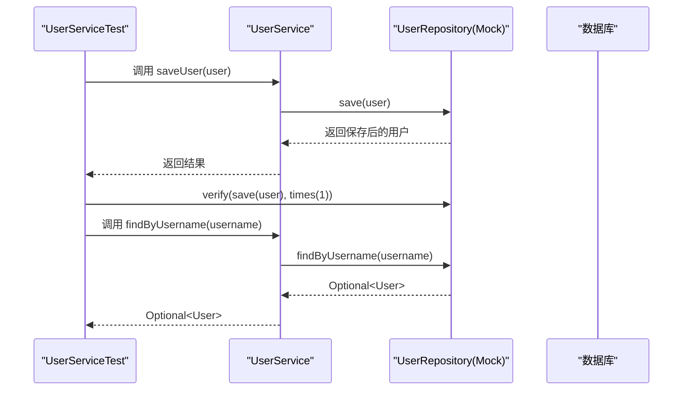
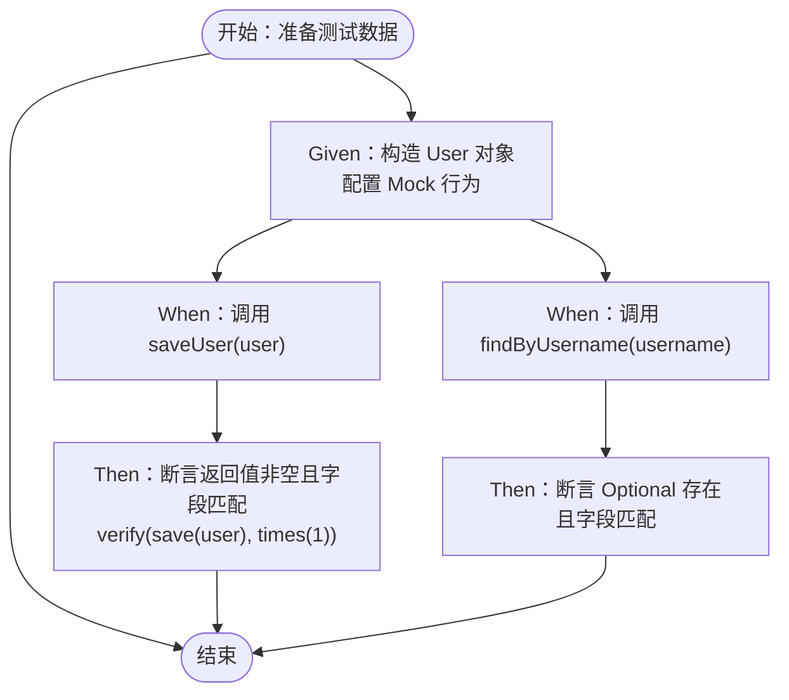
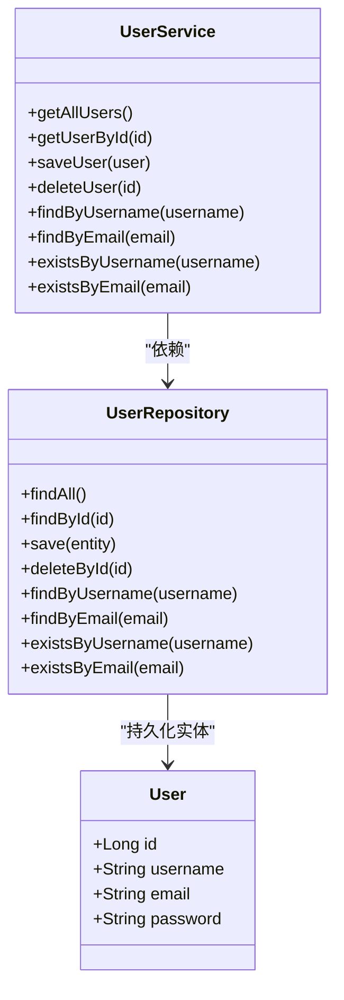
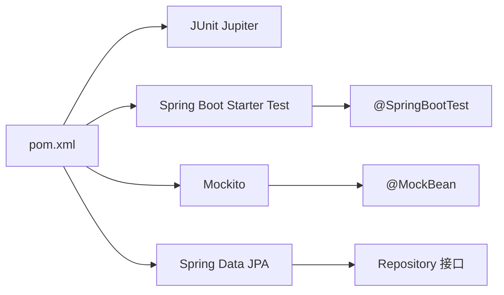

# 测试策略

<cite>
**本文引用的文件**
- [pom.xml](file://tudianersha/pom.xml)
- [UserServiceTest.java](file://tudianersha/src/test/java/com/tudianersha/UserServiceTest.java)
- [UserService.java](file://tudianersha/src/main/java/com/tudianersha/service/UserService.java)
- [UserRepository.java](file://tudianersha/src/main/java/com/tudianersha/repository/UserRepository.java)
- [User.java](file://tudianersha/src/main/java/com/tudianersha/entity/User.java)
- [Application.java](file://tudianersha/src/main/java/com/tudianersha/Application.java)
- [application.yml](file://tudianersha/src/main/resources/application.yml)
- [DatabaseConfig.java](file://tudianersha/src/main/java/com/tudianersha/config/DatabaseConfig.java)
- [PasswordEncoderUtil.java](file://tudianersha/src/main/java/com/tudianersha/util/PasswordEncoderUtil.java)
</cite>

## 目录
1. [引言](#引言)
2. [项目结构](#项目结构)
3. [核心组件](#核心组件)
4. [架构总览](#架构总览)
5. [详细组件分析](#详细组件分析)
6. [依赖分析](#依赖分析)
7. [性能考虑](#性能考虑)
8. [故障排查指南](#故障排查指南)
9. [结论](#结论)
10. [附录](#附录)

## 引言
本测试策略旨在为系统建立全面的质量保障体系，采用 JUnit 5 进行单元测试，并结合 Spring Boot Test 实现集成测试。重点覆盖 Service 层核心业务逻辑（如 UserService），通过 Mockito 模拟 Repository 依赖，确保测试隔离与可重复性。测试用例将覆盖正常流程、边界条件与异常场景，目标是关键业务模块的测试覆盖率不低于 80%。同时提供 IDE 与命令行两种运行方式，以及测试数据准备与断言验证的最佳实践。

## 项目结构
当前仓库包含后端主程序与单测示例，核心测试位于 src/test 下，Service 与 Repository 位于 src/main 下，数据库连接与 JPA 配置位于 resources 中。pom.xml 已引入 Spring Boot Starter Test 与 JUnit Jupiter，满足单元与集成测试基础依赖。

图表来源
- [UserServiceTest.java](file://tudianersha/src/test/java/com/tudianersha/UserServiceTest.java#L1-L55)
- [UserService.java](file://tudianersha/src/main/java/com/tudianersha/service/UserService.java#L1-L48)
- [UserRepository.java](file://tudianersha/src/main/java/com/tudianersha/repository/UserRepository.java#L1-L15)
- [User.java](file://tudianersha/src/main/java/com/tudianersha/entity/User.java#L1-L73)
- [Application.java](file://tudianersha/src/main/java/com/tudianersha/Application.java#L1-L12)
- [DatabaseConfig.java](file://tudianersha/src/main/java/com/tudianersha/config/DatabaseConfig.java#L1-L10)
- [application.yml](file://tudianersha/src/main/resources/application.yml#L1-L57)
- [pom.xml](file://tudianersha/pom.xml#L1-L180)

章节来源
- [pom.xml](file://tudianersha/pom.xml#L1-L180)
- [UserServiceTest.java](file://tudianersha/src/test/java/com/tudianersha/UserServiceTest.java#L1-L55)
- [UserService.java](file://tudianersha/src/main/java/com/tudianersha/service/UserService.java#L1-L48)
- [UserRepository.java](file://tudianersha/src/main/java/com/tudianersha/repository/UserRepository.java#L1-L15)
- [User.java](file://tudianersha/src/main/java/com/tudianersha/entity/User.java#L1-L73)
- [Application.java](file://tudianersha/src/main/java/com/tudianersha/Application.java#L1-L12)
- [DatabaseConfig.java](file://tudianersha/src/main/java/com/tudianersha/config/DatabaseConfig.java#L1-L10)
- [application.yml](file://tudianersha/src/main/resources/application.yml#L1-L57)

## 核心组件
- 单元测试入口：UserServiceTest 使用 @SpringBootTest 启动 Spring 上下文，@MockBean 注入 UserRepository 的模拟对象，验证 UserService 的核心方法。
- Service 层：UserService 提供用户相关业务操作，包括保存、查询、删除等，直接委托给 UserRepository。
- Repository 层：UserRepository 继承 JPA 接口，提供基于用户名/邮箱的查询与存在性判断。
- 实体模型：User 定义用户字段与构造函数，用于测试数据准备。
- 应用启动与配置：Application 作为 Spring Boot 入口；DatabaseConfig 启用 JPA；application.yml 提供数据库与邮件等配置。

章节来源
- [UserServiceTest.java](file://tudianersha/src/test/java/com/tudianersha/UserServiceTest.java#L1-L55)
- [UserService.java](file://tudianersha/src/main/java/com/tudianersha/service/UserService.java#L1-L48)
- [UserRepository.java](file://tudianersha/src/main/java/com/tudianersha/repository/UserRepository.java#L1-L15)
- [User.java](file://tudianersha/src/main/java/com/tudianersha/entity/User.java#L1-L73)
- [Application.java](file://tudianersha/src/main/java/com/tudianersha/Application.java#L1-L12)
- [DatabaseConfig.java](file://tudianersha/src/main/java/com/tudianersha/config/DatabaseConfig.java#L1-L10)
- [application.yml](file://tudianersha/src/main/resources/application.yml#L1-L57)

## 架构总览
测试策略围绕“隔离、可控、可重复”的原则设计：
- 单元测试：通过 @MockBean 将 Repository 依赖替换为 Mock 对象，确保 Service 的逻辑独立验证。
- 集成测试：使用 @SpringBootTest 启动完整上下文，验证 Service 与 Repository 的协作。
- 断言与验证：使用 JUnit 5 断言与 Mockito 验证交互次数与参数匹配。

图表来源
- [UserServiceTest.java](file://tudianersha/src/test/java/com/tudianersha/UserServiceTest.java#L1-L55)
- [UserService.java](file://tudianersha/src/main/java/com/tudianersha/service/UserService.java#L1-L48)
- [UserRepository.java](file://tudianersha/src/main/java/com/tudianersha/repository/UserRepository.java#L1-L15)

## 详细组件分析

### UserService 单元测试策略
- 测试目标
  - 验证 saveUser 正常流程：输入用户对象，返回非空且字段匹配，校验 save 被调用一次。
  - 验证 findByUsername 正常流程：根据用户名查询返回 Optional，断言存在且字段匹配。
- 测试隔离
  - 使用 @MockBean 替换真实 Repository，避免数据库依赖，提升测试稳定性与速度。
- 断言与验证
  - 使用 JUnit 5 断言进行结果校验；使用 Mockito verify 校验交互次数与参数。
- 边界与异常场景建议
  - 空用户名/邮箱：断言抛出参数校验异常或返回空 Optional（取决于上层处理）。
  - 重复用户名/邮箱：断言 existsByUsername/existsByEmail 返回 true，或保存时抛出唯一约束异常。
  - 查询不存在用户：断言 Optional 为空。
- 数据准备
  - 使用 User 构造函数创建测试对象，字段值尽量覆盖典型场景（普通、边界、特殊字符）。

图表来源
- [UserServiceTest.java](file://tudianersha/src/test/java/com/tudianersha/UserServiceTest.java#L1-L55)
- [User.java](file://tudianersha/src/main/java/com/tudianersha/entity/User.java#L1-L73)

章节来源
- [UserServiceTest.java](file://tudianersha/src/test/java/com/tudianersha/UserServiceTest.java#L1-L55)
- [UserService.java](file://tudianersha/src/main/java/com/tudianersha/service/UserService.java#L1-L48)
- [UserRepository.java](file://tudianersha/src/main/java/com/tudianersha/repository/UserRepository.java#L1-L15)
- [User.java](file://tudianersha/src/main/java/com/tudianersha/entity/User.java#L1-L73)

### Service-Repository 关系与依赖注入
- UserService 通过 @Autowired 注入 UserRepository，所有业务方法均委托给 Repository。
- UserRepository 继承 JPA 接口，提供 findByUsername、findByEmail、existsByUsername、existsByEmail 等方法。
- 测试中通过 @MockBean 注入的 Mock 对象，可以精确控制返回值与行为，便于覆盖多种场景。

图表来源
- [UserService.java](file://tudianersha/src/main/java/com/tudianersha/service/UserService.java#L1-L48)
- [UserRepository.java](file://tudianersha/src/main/java/com/tudianersha/repository/UserRepository.java#L1-L15)
- [User.java](file://tudianersha/src/main/java/com/tudianersha/entity/User.java#L1-L73)

章节来源
- [UserService.java](file://tudianersha/src/main/java/com/tudianersha/service/UserService.java#L1-L48)
- [UserRepository.java](file://tudianersha/src/main/java/com/tudianersha/repository/UserRepository.java#L1-L15)
- [User.java](file://tudianersha/src/main/java/com/tudianersha/entity/User.java#L1-L73)

### 集成测试与上下文启动
- 使用 @SpringBootTest 启动完整应用上下文，验证 Service 与 Repository 在真实环境中的协作。
- 结合 application.yml 中的数据库配置，确保测试能访问数据库（若需要）。
- 若仅做单元测试，推荐使用 @ExtendWith(MockitoExtension.class) 与 @InjectMocks 简化测试；若需集成测试，使用 @SpringBootTest。

章节来源
- [UserServiceTest.java](file://tudianersha/src/test/java/com/tudianersha/UserServiceTest.java#L1-L55)
- [Application.java](file://tudianersha/src/main/java/com/tudianersha/Application.java#L1-L12)
- [application.yml](file://tudianersha/src/main/resources/application.yml#L1-L57)

## 依赖分析
- 测试框架与工具
  - JUnit Jupiter：提供断言与测试生命周期注解。
  - Spring Boot Starter Test：提供 @SpringBootTest、Mockito 集成与测试容器支持。
  - Mockito：用于模拟依赖，验证交互。
- 数据访问层
  - Spring Data JPA：简化 Repository 开发，提供常用查询方法。
  - DatabaseConfig：启用 JPA 扫描包，确保 Repository 可被发现。
- 运行与构建
  - Maven 插件：spring-boot-maven-plugin 支持打包与运行。

图表来源
- [pom.xml](file://tudianersha/pom.xml#L1-L180)
- [UserServiceTest.java](file://tudianersha/src/test/java/com/tudianersha/UserServiceTest.java#L1-L55)
- [UserRepository.java](file://tudianersha/src/main/java/com/tudianersha/repository/UserRepository.java#L1-L15)

章节来源
- [pom.xml](file://tudianersha/pom.xml#L1-L180)
- [UserServiceTest.java](file://tudianersha/src/test/java/com/tudianersha/UserServiceTest.java#L1-L55)
- [UserRepository.java](file://tudianersha/src/main/java/com/tudianersha/repository/UserRepository.java#L1-L15)

## 性能考虑
- 单元测试优先：通过 Mock 依赖减少数据库 IO，提高测试执行速度。
- 避免重复初始化：在测试类中复用 Mock 行为与断言，减少不必要的对象创建。
- 集成测试范围控制：仅在必要时使用 @SpringBootTest，避免全量启动带来的开销。
- 数据库测试隔离：使用内存数据库或测试专用库，避免跨测试干扰。

## 故障排查指南
- 测试无法启动或上下文加载失败
  - 检查 application.yml 中数据库连接配置是否正确。
  - 确认 DatabaseConfig 已启用 JPA 包扫描。
- Mock 不生效
  - 确保 @MockBean 注入的类型与实际依赖一致。
  - 检查 UserService 是否通过 @Autowired 注入 UserRepository。
- 断言失败
  - 使用 verify 校验交互次数与参数，定位问题点。
  - 对于边界条件，补充空值、特殊字符、超长字符串等测试数据。
- 密码相关逻辑
  - 如涉及密码加密/校验，可参考 PasswordEncoderUtil 的静态方法进行测试，确保加密与匹配逻辑正确。

章节来源
- [application.yml](file://tudianersha/src/main/resources/application.yml#L1-L57)
- [DatabaseConfig.java](file://tudianersha/src/main/java/com/tudianersha/config/DatabaseConfig.java#L1-L10)
- [UserServiceTest.java](file://tudianersha/src/test/java/com/tudianersha/UserServiceTest.java#L1-L55)
- [PasswordEncoderUtil.java](file://tudianersha/src/main/java/com/tudianersha/util/PasswordEncoderUtil.java#L1-L33)

## 结论
当前项目已具备良好的测试基础：pom.xml 引入了必要的测试依赖，UserServiceTest 展示了典型的单元测试模式。建议在此基础上扩展更多边界与异常场景的测试，完善集成测试覆盖，并通过持续改进逐步达到关键业务模块 80%+ 的覆盖率目标。同时规范测试数据准备与断言验证流程，确保测试的稳定性与可维护性。

## 附录

### 在 IDE 中运行测试
- 在 IDE（如 IntelliJ IDEA）中打开测试类，右键选择“Run”即可执行单个测试或整个测试类。
- 若使用 Lombok，请确保安装并启用对应插件，避免编译错误。

章节来源
- [UserServiceTest.java](file://tudianersha/src/test/java/com/tudianersha/UserServiceTest.java#L1-L55)
- [pom.xml](file://tudianersha/pom.xml#L1-L180)

### 通过命令行执行测试
- 在项目根目录执行 mvn test，Maven 将自动编译并运行所有测试。
- 如需查看测试报告，可在构建后查看 target/surefire-reports 或 target/test-classes 下的相关输出。

章节来源
- [pom.xml](file://tudianersha/pom.xml#L1-L180)

### 测试数据准备与断言最佳实践
- 数据准备
  - 使用实体类构造函数快速创建测试对象，字段值覆盖正常、边界与异常场景。
  - 对于需要唯一性的字段（如用户名、邮箱），准备互不冲突的数据集。
- 断言验证
  - 使用 JUnit 5 断言进行结果校验；使用 Mockito verify 精确验证交互次数与参数。
  - 对于 Optional 场景，先断言是否存在，再断言内容。
  - 对于存在性判断，分别验证 true 与 false 的场景。
- 覆盖率目标
  - 以 UserService 为核心，逐步扩展到其他 Service 与 Repository，确保关键业务路径均有测试覆盖。

章节来源
- [UserServiceTest.java](file://tudianersha/src/test/java/com/tudianersha/UserServiceTest.java#L1-L55)
- [User.java](file://tudianersha/src/main/java/com/tudianersha/entity/User.java#L1-L73)
- [UserService.java](file://tudianersha/src/main/java/com/tudianersha/service/UserService.java#L1-L48)
- [UserRepository.java](file://tudianersha/src/main/java/com/tudianersha/repository/UserRepository.java#L1-L15)