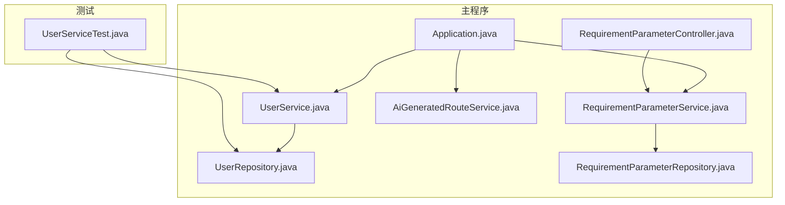
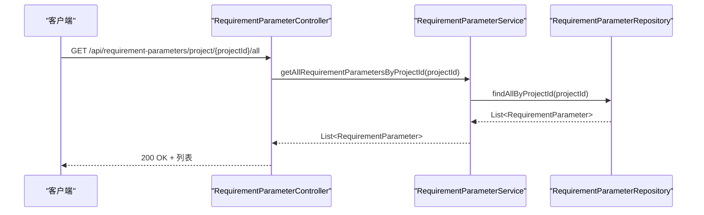
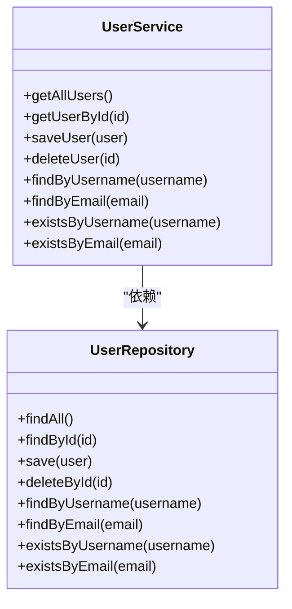
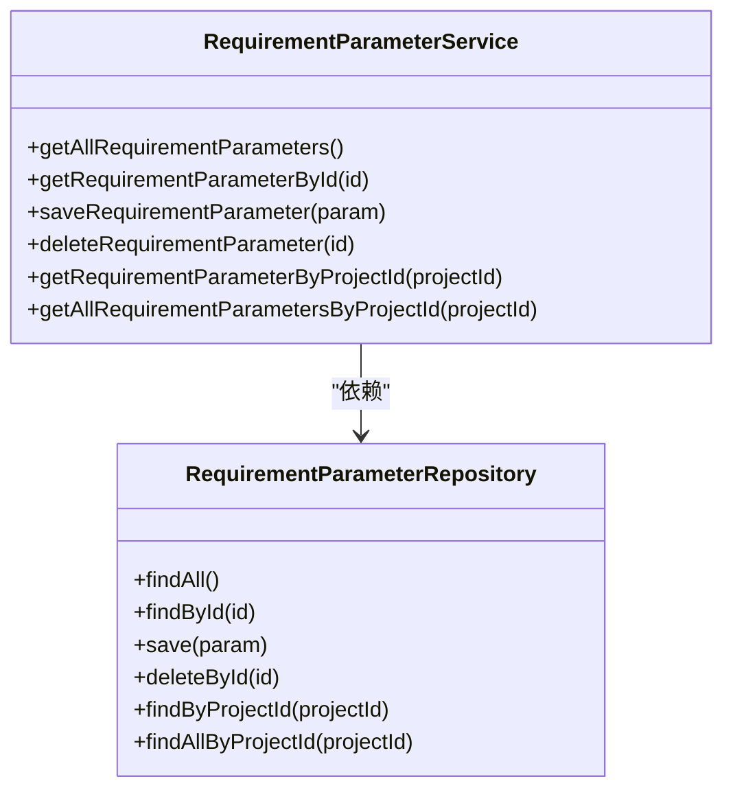
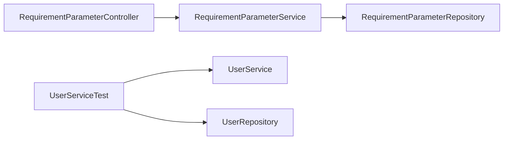

# 测试覆盖率

<cite>
**本文引用的文件**
- [pom.xml](file://tudianersha/pom.xml)
- [UserService.java](file://tudianersha/src/main/java/com/tudianersha/service/UserService.java)
- [UserRepository.java](file://tudianersha/src/main/java/com/tudianersha/repository/UserRepository.java)
- [UserServiceTest.java](file://tudianersha/src/test/java/com/tudianersha/UserServiceTest.java)
- [AiGeneratedRouteService.java](file://tudianersha/src/main/java/com/tudianersha/service/AiGeneratedRouteService.java)
- [RequirementParameterService.java](file://tudianersha/src/main/java/com/tudianersha/service/RequirementParameterService.java)
- [RequirementParameterRepository.java](file://tudianersha/src/main/java/com/tudianersha/repository/RequirementParameterRepository.java)
- [RequirementParameterController.java](file://tudianersha/src/main/java/com/tudianersha/controller/RequirementParameterController.java)
- [Application.java](file://tudianersha/src/main/java/com/tudianersha/Application.java)
- [.gitignore](file://.gitignore)
</cite>

## 目录
1. [引言](#引言)
2. [项目结构](#项目结构)
3. [核心组件](#核心组件)
4. [架构总览](#架构总览)
5. [详细组件分析](#详细组件分析)
6. [依赖分析](#依赖分析)
7. [性能考虑](#性能考虑)
8. [故障排查指南](#故障排查指南)
9. [结论](#结论)
10. [附录](#附录)

## 引言
本文件围绕“测试覆盖率目标与监控机制”展开，目标是确保关键业务逻辑（如UserService等核心模块）得到充分验证，行覆盖率与分支覆盖率不低于80%。文档涵盖以下要点：
- 使用Maven插件（如JaCoCo）生成覆盖率报告
- 在pom.xml中配置jacoco-maven-plugin，并通过check目标设置覆盖率阈值，防止低覆盖率代码合入
- 在IDE（如IntelliJ IDEA）中可视化覆盖率，识别未覆盖路径并补充测试用例
- 优化测试用例设计以提升覆盖率：参数化测试、异常路径覆盖、边界值分析等

## 项目结构
项目采用Spring Boot标准目录结构，核心模块位于主程序与测试目录下，关键业务逻辑集中在service层，数据访问由repository层承担，控制器层负责HTTP接口。



图表来源
- [Application.java](file://tudianersha/src/main/java/com/tudianersha/Application.java#L1-L12)
- [UserService.java](file://tudianersha/src/main/java/com/tudianersha/service/UserService.java#L1-L48)
- [UserRepository.java](file://tudianersha/src/main/java/com/tudianersha/repository/UserRepository.java#L1-L15)
- [RequirementParameterService.java](file://tudianersha/src/main/java/com/tudianersha/service/RequirementParameterService.java#L1-L40)
- [RequirementParameterRepository.java](file://tudianersha/src/main/java/com/tudianersha/repository/RequirementParameterRepository.java#L1-L14)
- [RequirementParameterController.java](file://tudianersha/src/main/java/com/tudianersha/controller/RequirementParameterController.java#L1-L85)
- [AiGeneratedRouteService.java](file://tudianersha/src/main/java/com/tudianersha/service/AiGeneratedRouteService.java#L341-L375)
- [UserServiceTest.java](file://tudianersha/src/test/java/com/tudianersha/UserServiceTest.java#L1-L55)

章节来源
- [pom.xml](file://tudianersha/pom.xml#L1-L180)
- [Application.java](file://tudianersha/src/main/java/com/tudianersha/Application.java#L1-L12)

## 核心组件
- UserService：封装用户相关业务逻辑，包括查询、保存、删除、存在性校验等方法，依赖UserRepository进行数据访问。
- UserRepository：基于Spring Data JPA的接口，提供按用户名/邮箱查询、存在性判断等方法。
- RequirementParameterService：封装需求参数业务逻辑，包含按项目ID查询、列表查询等。
- RequirementParameterRepository：基于Spring Data JPA的接口，提供按项目ID查询与列表查询。
- RequirementParameterController：REST控制器，提供对需求参数的CRUD接口。
- AiGeneratedRouteService：包含AI生成路线的业务逻辑，包含JSON提取等处理流程。
- UserServiceTest：当前仅包含部分基础测试，覆盖saveUser与findByUsername场景。

章节来源
- [UserService.java](file://tudianersha/src/main/java/com/tudianersha/service/UserService.java#L1-L48)
- [UserRepository.java](file://tudianersha/src/main/java/com/tudianersha/repository/UserRepository.java#L1-L15)
- [RequirementParameterService.java](file://tudianersha/src/main/java/com/tudianersha/service/RequirementParameterService.java#L1-L40)
- [RequirementParameterRepository.java](file://tudianersha/src/main/java/com/tudianersha/repository/RequirementParameterRepository.java#L1-L14)
- [RequirementParameterController.java](file://tudianersha/src/main/java/com/tudianersha/controller/RequirementParameterController.java#L1-L85)
- [AiGeneratedRouteService.java](file://tudianersha/src/main/java/com/tudianersha/service/AiGeneratedRouteService.java#L341-L375)
- [UserServiceTest.java](file://tudianersha/src/test/java/com/tudianersha/UserServiceTest.java#L1-L55)

## 架构总览
从测试覆盖率角度，系统的关键业务逻辑主要集中在service层，测试应覆盖：
- 业务方法的正常路径
- 异常与边界条件
- 存在性校验与返回空值的分支
- 控制器层的HTTP状态码与响应体校验



图表来源
- [RequirementParameterController.java](file://tudianersha/src/main/java/com/tudianersha/controller/RequirementParameterController.java#L70-L84)
- [RequirementParameterService.java](file://tudianersha/src/main/java/com/tudianersha/service/RequirementParameterService.java#L33-L40)
- [RequirementParameterRepository.java](file://tudianersha/src/main/java/com/tudianersha/repository/RequirementParameterRepository.java#L10-L14)

## 详细组件分析

### UserService 组件分析
- 方法概览：查询全部用户、按ID查询、保存、删除、按用户名/邮箱查找、存在性校验。
- 覆盖率现状：当前测试仅覆盖saveUser与findByUsername，未覆盖其他方法与异常分支。
- 改进建议：
  - 补充deleteUser与existsByUsername/existsByEmail的测试
  - 对不存在的ID或用户名/邮箱场景进行断言
  - 使用参数化测试覆盖多组输入（含空值、非法ID、重复用户名等）



图表来源
- [UserService.java](file://tudianersha/src/main/java/com/tudianersha/service/UserService.java#L1-L48)
- [UserRepository.java](file://tudianersha/src/main/java/com/tudianersha/repository/UserRepository.java#L1-L15)

章节来源
- [UserService.java](file://tudianersha/src/main/java/com/tudianersha/service/UserService.java#L1-L48)
- [UserRepository.java](file://tudianersha/src/main/java/com/tudianersha/repository/UserRepository.java#L1-L15)
- [UserServiceTest.java](file://tudianersha/src/test/java/com/tudianersha/UserServiceTest.java#L1-L55)

### RequirementParameterService 组件分析
- 方法概览：查询全部、按ID查询、保存、删除、按项目ID查询单个与列表。
- 覆盖率现状：控制器层提供完整接口，但service层的边界与异常分支需要补充测试。
- 改进建议：
  - 参数化测试：项目ID为空、负数、超长ID等
  - 异常路径：仓库层抛出异常时的处理与返回码
  - 边界值：空列表、单条记录、大量记录的返回一致性



图表来源
- [RequirementParameterService.java](file://tudianersha/src/main/java/com/tudianersha/service/RequirementParameterService.java#L1-L40)
- [RequirementParameterRepository.java](file://tudianersha/src/main/java/com/tudianersha/repository/RequirementParameterRepository.java#L1-L14)

章节来源
- [RequirementParameterService.java](file://tudianersha/src/main/java/com/tudianersha/service/RequirementParameterService.java#L1-L40)
- [RequirementParameterRepository.java](file://tudianersha/src/main/java/com/tudianersha/repository/RequirementParameterRepository.java#L1-L14)
- [RequirementParameterController.java](file://tudianersha/src/main/java/com/tudianersha/controller/RequirementParameterController.java#L1-L85)

### AiGeneratedRouteService 组件分析
- 关键逻辑：从AI响应中提取JSON内容，包含对null与Markdown代码块的处理。
- 覆盖率现状：该方法存在分支（包含/不包含代码块），需补充对应测试用例。
- 改进建议：
  - 参数化测试：null响应、无代码块、带```json、带普通```等
  - 边界值：空字符串、仅包含空白字符、特殊字符等

```mermaid
flowchart TD
Start(["extractJsonFromResponse(response)"]) --> CheckNull["response 是否为 null?"]
CheckNull --> |是| ReturnEmpty["返回 \"{}\""]
CheckNull --> |否| ContainsJson["是否包含
```json ?"]
  ContainsJson -->|是| Extract["截取 ```json ... ``` 内容并 trim()"]
  ContainsJson -->|否| ContainsBacktick["是否包含 ``` ?"]
  ContainsBacktick -->|是| Extract2["截取 ``` ... ``` 内容并 trim()"]
  ContainsBacktick -->|否| ReturnRaw["返回原始 response.trim()"]
  Extract --> End(["返回"])
  Extract2 --> End
  ReturnEmpty --> End
  ReturnRaw --> End
```

图表来源
- [AiGeneratedRouteService.java](file://tudianersha/src/main/java/com/tudianersha/service/AiGeneratedRouteService.java#L362-L375)

章节来源
- [AiGeneratedRouteService.java](file://tudianersha/src/main/java/com/tudianersha/service/AiGeneratedRouteService.java#L341-L375)

## 依赖分析
- 依赖关系：Controller -> Service -> Repository，测试通过MockBean注入Repository，隔离外部依赖。
- 当前测试覆盖范围：UserServiceTest覆盖了saveUser与findByUsername，其余service与controller尚未有对应的单元测试。
- 覆盖率目标：核心模块（如UserService、RequirementParameterService）行/分支覆盖率不低于80%。



图表来源
- [RequirementParameterController.java](file://tudianersha/src/main/java/com/tudianersha/controller/RequirementParameterController.java#L1-L85)
- [RequirementParameterService.java](file://tudianersha/src/main/java/com/tudianersha/service/RequirementParameterService.java#L1-L40)
- [RequirementParameterRepository.java](file://tudianersha/src/main/java/com/tudianersha/repository/RequirementParameterRepository.java#L1-L14)
- [UserServiceTest.java](file://tudianersha/src/test/java/com/tudianersha/UserServiceTest.java#L1-L55)
- [UserService.java](file://tudianersha/src/main/java/com/tudianersha/service/UserService.java#L1-L48)
- [UserRepository.java](file://tudianersha/src/main/java/com/tudianersha/repository/UserRepository.java#L1-L15)

章节来源
- [RequirementParameterController.java](file://tudianersha/src/main/java/com/tudianersha/controller/RequirementParameterController.java#L1-L85)
- [RequirementParameterService.java](file://tudianersha/src/main/java/com/tudianersha/service/RequirementParameterService.java#L1-L40)
- [RequirementParameterRepository.java](file://tudianersha/src/main/java/com/tudianersha/repository/RequirementParameterRepository.java#L1-L14)
- [UserServiceTest.java](file://tudianersha/src/test/java/com/tudianersha/UserServiceTest.java#L1-L55)
- [UserService.java](file://tudianersha/src/main/java/com/tudianersha/service/UserService.java#L1-L48)
- [UserRepository.java](file://tudianersha/src/main/java/com/tudianersha/repository/UserRepository.java#L1-L15)

## 性能考虑
- 单元测试执行速度优先：通过MockBean隔离数据库与外部服务，避免真实IO。
- 覆盖率报告生成成本：JaCoCo在测试阶段插入探针，开启check目标可阻止低覆盖率合并，但会增加CI时间；可在PR阶段开启严格检查，在主干分支放宽阈值。
- 大规模数据场景：参数化测试应控制输入规模，避免测试执行时间过长。

## 故障排查指南
- 本地无法生成覆盖率报告
  - 确认已安装并启用JaCoCo插件（见附录）
  - 清理并重新编译：mvn clean test
  - 检查输出目录：target/jacoco.exec、target/site/jacoco/index.html
- CI流水线失败（check goal触发）
  - 降低阈值或补充测试用例
  - 分析未覆盖的分支与行，定位缺失的测试场景
- IDE中覆盖率可视化问题
  - 确认IDE已安装JaCoCo或覆盖率插件
  - 在Run/Debug配置中启用Coverage选项
  - 查看未覆盖区域，结合源码定位缺失分支

章节来源
- [.gitignore](file://.gitignore#L1-L111)

## 结论
- 当前项目已具备基本的测试框架（JUnit 5、Spring Boot Test、MockBean），但覆盖率目标尚未达成（核心模块未达80%）。
- 建议立即在pom.xml中引入并配置JaCoCo插件，设置check目标以强制覆盖率门槛；同时在IDE中启用覆盖率可视化，持续补充测试用例，重点覆盖异常与边界分支。
- 通过参数化测试、异常路径覆盖与边界值分析，可显著提升覆盖率并增强代码健壮性。

## 附录

### 1. Maven覆盖率目标与监控机制
- 在pom.xml中添加jacoco-maven-plugin，配置exec与report目标用于生成覆盖率报告；配置check目标以设置最小覆盖率阈值，防止低覆盖率代码合入。
- 常用配置要点
  - 插件版本与目标：使用稳定版本，绑定test生命周期
  - 输出格式：exec与HTML报告
  - check规则：设置minimum coverage thresholds（行/分支）
- 执行命令
  - mvn clean test：运行测试并生成覆盖率数据
  - mvn test jacoco:report：生成HTML报告
  - mvn test jacoco:check：根据阈值检查并阻断低覆盖率合并

章节来源
- [pom.xml](file://tudianersha/pom.xml#L171-L179)

### 2. 在IDE（IntelliJ IDEA）中可视化覆盖率
- 安装并启用覆盖率工具（如内置Coverage或第三方插件）
- 在Run/Debug配置中勾选Coverage，选择目标为测试类或包
- 运行测试后查看未覆盖的行与分支，结合源码定位缺失场景
- 针对未覆盖的分支（如空值、异常、边界值）补充测试用例

### 3. 优化测试用例设计以提升覆盖率
- 参数化测试：对同一方法使用多组输入（含空值、边界值、异常输入）进行批量验证
- 异常路径覆盖：模拟仓库层异常、空结果、非法参数等，验证控制器返回码与消息
- 边界值分析：针对ID、金额、长度等边界值进行测试，确保分支全覆盖
- 针对UserService：补充deleteUser、existsByUsername/existsByEmail、按邮箱查询等方法的测试
- 针对RequirementParameterService：补充按项目ID查询的边界与异常场景

章节来源
- [UserServiceTest.java](file://tudianersha/src/test/java/com/tudianersha/UserServiceTest.java#L1-L55)
- [UserService.java](file://tudianersha/src/main/java/com/tudianersha/service/UserService.java#L1-L48)
- [RequirementParameterService.java](file://tudianersha/src/main/java/com/tudianersha/service/RequirementParameterService.java#L1-L40)
- [AiGeneratedRouteService.java](file://tudianersha/src/main/java/com/tudianersha/service/AiGeneratedRouteService.java#L362-L375)