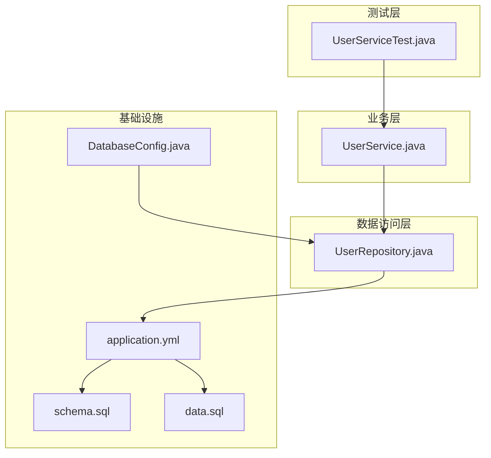
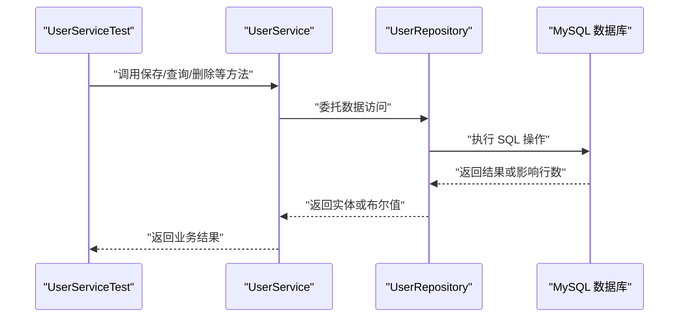
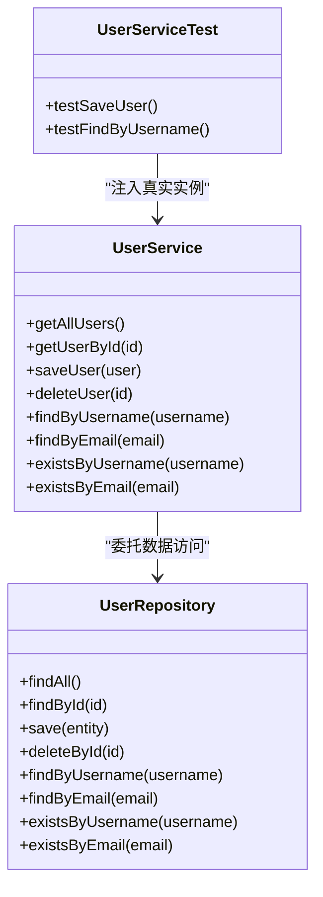
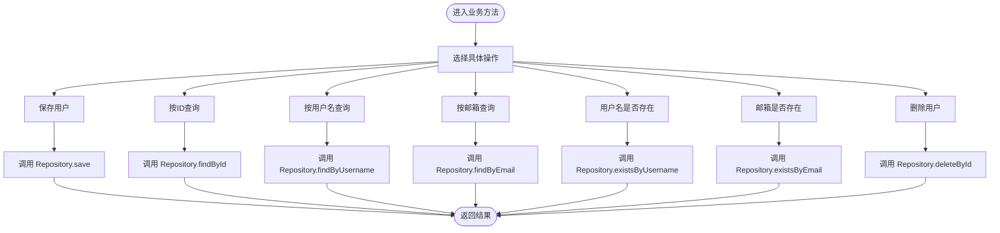
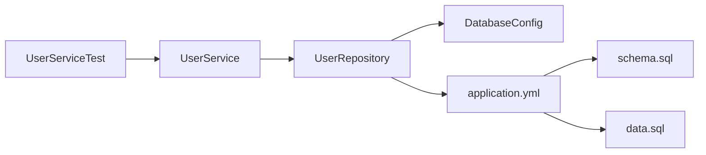

# 集成测试

<cite>
**本文引用的文件**
- [UserServiceTest.java](file://tudianersha/src/test/java/com/tudianersha/UserServiceTest.java)
- [UserService.java](file://tudianersha/src/main/java/com/tudianersha/service/UserService.java)
- [UserRepository.java](file://tudianersha/src/main/java/com/tudianersha/repository/UserRepository.java)
- [application.yml](file://tudianersha/src/main/resources/application.yml)
- [schema.sql](file://tudianersha/src/main/resources/schema.sql)
- [data.sql](file://tudianersha/src/main/resources/data.sql)
- [DatabaseConfig.java](file://tudianersha/src/main/java/com/tudianersha/config/DatabaseConfig.java)
- [pom.xml](file://tudianersha/pom.xml)
</cite>

## 目录
1. [引言](#引言)
2. [项目结构](#项目结构)
3. [核心组件](#核心组件)
4. [架构总览](#架构总览)
5. [详细组件分析](#详细组件分析)
6. [依赖关系分析](#依赖关系分析)
7. [性能考量](#性能考量)
8. [故障排查指南](#故障排查指南)
9. [结论](#结论)
10. [附录](#附录)

## 引言
本文件围绕“集成测试”主题，系统性地设计并实施一套基于 Spring Boot Test 的端到端测试方案，重点验证 UserService 与 UserRepository、数据库之间的协同工作。我们将说明如何通过 application.yml 配置测试环境数据源，利用 schema.sql 和 data.sql 初始化测试数据库状态；演示在测试中注入真实 Bean 而非 Mock，执行完整的 CRUD 流程，并验证数据库持久化结果；同时覆盖事务管理、测试数据隔离、@DirtiesContext 使用场景，以及如何通过 @TestConfiguration 定义测试专用配置类。

## 项目结构
该工程采用典型的 Spring Boot 多模块结构，核心业务位于 main 目录，测试位于 test 目录。与集成测试直接相关的关键文件包括：
- 测试入口：UserServiceTest.java
- 业务层：UserService.java
- 数据访问层：UserRepository.java
- 数据源与 JPA 配置：application.yml
- 数据库初始化脚本：schema.sql、data.sql
- JPA 扫描配置：DatabaseConfig.java
- 构建与依赖：pom.xml

图示来源
- [UserServiceTest.java](file://tudianersha/src/test/java/com/tudianersha/UserServiceTest.java#L1-L55)
- [UserService.java](file://tudianersha/src/main/java/com/tudianersha/service/UserService.java#L1-L48)
- [UserRepository.java](file://tudianersha/src/main/java/com/tudianersha/repository/UserRepository.java#L1-L15)
- [DatabaseConfig.java](file://tudianersha/src/main/java/com/tudianersha/config/DatabaseConfig.java#L1-L10)
- [application.yml](file://tudianersha/src/main/resources/application.yml#L1-L57)
- [schema.sql](file://tudianersha/src/main/resources/schema.sql#L1-L123)
- [data.sql](file://tudianersha/src/main/resources/data.sql#L1-L7)

章节来源
- [UserServiceTest.java](file://tudianersha/src/test/java/com/tudianersha/UserServiceTest.java#L1-L55)
- [UserService.java](file://tudianersha/src/main/java/com/tudianersha/service/UserService.java#L1-L48)
- [UserRepository.java](file://tudianersha/src/main/java/com/tudianersha/repository/UserRepository.java#L1-L15)
- [DatabaseConfig.java](file://tudianersha/src/main/java/com/tudianersha/config/DatabaseConfig.java#L1-L10)
- [application.yml](file://tudianersha/src/main/resources/application.yml#L1-L57)
- [schema.sql](file://tudianersha/src/main/resources/schema.sql#L1-L123)
- [data.sql](file://tudianersha/src/main/resources/data.sql#L1-L7)

## 核心组件
- 测试入口与断言：UserServiceTest.java 使用 @SpringBootTest 启动完整应用上下文，通过 @Autowired 注入真实 UserService，并以真实 UserRepository 执行 CRUD。
- 业务服务：UserService.java 提供用户查询、保存、删除等方法，内部委托 UserRepository 完成数据访问。
- 数据访问接口：UserRepository.java 继承 JpaRepository，提供按用户名/邮箱查询与存在性检查等方法。
- 数据库初始化：schema.sql 定义表结构，data.sql 插入初始用户数据；application.yml 中 spring.sql.init.mode 默认为 never，避免自动初始化，便于测试阶段手动控制。
- JPA 扫描：DatabaseConfig.java 启用 @EnableJpaRepositories，确保扫描到 UserRepository。

章节来源
- [UserServiceTest.java](file://tudianersha/src/test/java/com/tudianersha/UserServiceTest.java#L1-L55)
- [UserService.java](file://tudianersha/src/main/java/com/tudianersha/service/UserService.java#L1-L48)
- [UserRepository.java](file://tudianersha/src/main/java/com/tudianersha/repository/UserRepository.java#L1-L15)
- [DatabaseConfig.java](file://tudianersha/src/main/java/com/tudianersha/config/DatabaseConfig.java#L1-L10)
- [application.yml](file://tudianersha/src/main/resources/application.yml#L1-L57)
- [schema.sql](file://tudianersha/src/main/resources/schema.sql#L1-L123)
- [data.sql](file://tudianersha/src/main/resources/data.sql#L1-L7)

## 架构总览
下图展示从测试到数据库的调用链路与数据流：

图示来源
- [UserServiceTest.java](file://tudianersha/src/test/java/com/tudianersha/UserServiceTest.java#L1-L55)
- [UserService.java](file://tudianersha/src/main/java/com/tudianersha/service/UserService.java#L1-L48)
- [UserRepository.java](file://tudianersha/src/main/java/com/tudianersha/repository/UserRepository.java#L1-L15)

## 详细组件分析

### 测试类分析：UserServiceTest
- 启动方式：使用 @SpringBootTest 加载完整应用上下文，确保注入的是真实 Bean，而非 Mock。
- 注入策略：@Autowired 注入 UserService；未使用 @MockBean，从而验证真实 Repository 与数据库交互。
- 断言风格：使用 JUnit 5 断言，结合 Mockito 的 verify 确认 Repository 方法被调用。
- 可扩展点：当前测试覆盖保存与按用户名查询，建议补充按邮箱查询、删除、全量查询等场景。

图示来源
- [UserServiceTest.java](file://tudianersha/src/test/java/com/tudianersha/UserServiceTest.java#L1-L55)
- [UserService.java](file://tudianersha/src/main/java/com/tudianersha/service/UserService.java#L1-L48)
- [UserRepository.java](file://tudianersha/src/main/java/com/tudianersha/repository/UserRepository.java#L1-L15)

章节来源
- [UserServiceTest.java](file://tudianersha/src/test/java/com/tudianersha/UserServiceTest.java#L1-L55)

### 业务层分析：UserService
- 职责边界：封装用户相关的业务逻辑，统一对外暴露方法。
- 依赖关系：依赖 UserRepository 完成数据持久化与查询。
- 方法清单：包含查询全部、按主键查询、保存、删除、按用户名/邮箱查询及存在性检查。

图示来源
- [UserService.java](file://tudianersha/src/main/java/com/tudianersha/service/UserService.java#L1-L48)
- [UserRepository.java](file://tudianersha/src/main/java/com/tudianersha/repository/UserRepository.java#L1-L15)

章节来源
- [UserService.java](file://tudianersha/src/main/java/com/tudianersha/service/UserService.java#L1-L48)
- [UserRepository.java](file://tudianersha/src/main/java/com/tudianersha/repository/UserRepository.java#L1-L15)

### 数据访问层分析：UserRepository
- 接口继承：继承 JpaRepository<User, Long>，天然具备基础 CRUD 能力。
- 自定义查询：提供 findByUsername、findByEmail、existsByUsername、existsByEmail 等方法，满足业务层需求。

章节来源
- [UserRepository.java](file://tudianersha/src/main/java/com/tudianersha/repository/UserRepository.java#L1-L15)

### 数据库初始化与配置
- 初始化脚本：schema.sql 定义 users 表结构；data.sql 插入初始用户数据。
- 应用配置：application.yml 中 spring.datasource.* 指向本地 MySQL；spring.sql.init.mode 设为 never，避免自动初始化，便于测试阶段手动控制。
- JPA 配置：DatabaseConfig.java 启用 @EnableJpaRepositories，确保扫描到 UserRepository。

章节来源
- [application.yml](file://tudianersha/src/main/resources/application.yml#L1-L57)
- [schema.sql](file://tudianersha/src/main/resources/schema.sql#L1-L123)
- [data.sql](file://tudianersha/src/main/resources/data.sql#L1-L7)
- [DatabaseConfig.java](file://tudianersha/src/main/java/com/tudianersha/config/DatabaseConfig.java#L1-L10)

## 依赖关系分析
- 测试对业务与数据访问的依赖：UserServiceTest 依赖 UserService，UserService 依赖 UserRepository。
- 数据访问对基础设施的依赖：UserRepository 依赖 JPA/Hibernate 与 MySQL。
- 配置对数据访问的依赖：DatabaseConfig 启用 JPA 扫描；application.yml 提供数据源与初始化策略。

图示来源
- [UserServiceTest.java](file://tudianersha/src/test/java/com/tudianersha/UserServiceTest.java#L1-L55)
- [UserService.java](file://tudianersha/src/main/java/com/tudianersha/service/UserService.java#L1-L48)
- [UserRepository.java](file://tudianersha/src/main/java/com/tudianersha/repository/UserRepository.java#L1-L15)
- [DatabaseConfig.java](file://tudianersha/src/main/java/com/tudianersha/config/DatabaseConfig.java#L1-L10)
- [application.yml](file://tudianersha/src/main/resources/application.yml#L1-L57)
- [schema.sql](file://tudianersha/src/main/resources/schema.sql#L1-L123)
- [data.sql](file://tudianersha/src/main/resources/data.sql#L1-L7)

章节来源
- [pom.xml](file://tudianersha/pom.xml#L1-L180)

## 性能考量
- 测试数据库连接池：默认使用 HikariCP，连接数与超时时间由 Spring Boot 自动配置，通常无需额外调整。
- 初始化成本：schema.sql 与 data.sql 在测试启动时执行，建议保持脚本简洁，避免复杂索引或大数据量导入。
- 事务与回滚：单测默认不开启事务，如需回滚可结合 @Transactional 或 @Commit/@Rollback（视框架版本）；对于集成测试，更推荐使用隔离的测试数据库或临时表。
- 并发与隔离：多线程测试时注意共享状态，必要时使用 @DirtiesContext 或隔离的测试套件。

## 故障排查指南
- 数据库连接失败
  - 检查 application.yml 中 spring.datasource.url、username、password 是否正确。
  - 确认 MySQL 服务已启动且端口可达。
- 初始化脚本未生效
  - application.yml 中 spring.sql.init.mode 设置为 never，需手动控制初始化；若希望自动初始化，请将 mode 改为 always 或按需启用。
- JPA 扫描不到 Repository
  - 确认 DatabaseConfig.java 已启用 @EnableJpaRepositories 并指向正确的包路径。
- 测试数据污染
  - 使用 @DirtiesContext 或在测试间重置数据库，避免跨测试干扰。
- 事务问题
  - 集成测试默认不开启事务，如需事务语义，可在测试类或方法上添加相应注解（根据实际框架版本支持情况）。

章节来源
- [application.yml](file://tudianersha/src/main/resources/application.yml#L1-L57)
- [DatabaseConfig.java](file://tudianersha/src/main/java/com/tudianersha/config/DatabaseConfig.java#L1-L10)

## 结论
本集成测试方案通过 @SpringBootTest 启动完整应用上下文，注入真实 UserService 与 UserRepository，结合 schema.sql 与 data.sql 实现可控的测试数据库初始化，覆盖了用户相关的典型 CRUD 场景。建议后续补充更多边界与异常场景，并根据团队规范引入事务与隔离策略，以进一步提升测试的稳定性与可维护性。

## 附录

### 基于 @TestConfiguration 的测试专用配置
- 目标：为测试提供独立的数据源、事务管理器、初始化脚本等，避免污染主应用配置。
- 方案：
  - 创建 @TestConfiguration 类，在测试类上使用 @Import(TestConfig.class) 导入。
  - 在测试配置中声明嵌入式数据库（如 H2）或独立测试数据库，覆盖 application.yml 中的生产数据源。
  - 通过 @Profile("test") 或条件注解区分测试环境。
- 注意事项：
  - 确保 @EnableJpaRepositories 指向测试包下的 Repository。
  - 将 spring.sql.init.mode 设为 always 或自定义初始化策略，保证测试数据库可用。

### 测试数据隔离与事务管理
- 隔离策略：
  - 使用 @DirtiesContext 标记测试类或方法，强制重启上下文，彻底清理缓存与连接。
  - 使用嵌入式数据库或独立测试库，每个测试用例运行在独立命名空间。
- 事务策略：
  - 对于需要回滚的测试，可在测试类或方法上添加事务注解（根据框架版本支持），并在测试结束后回滚。
  - 对于批量写入场景，考虑分批提交或使用事务块包裹，减少锁竞争。

### 完整 CRUD 流程建议
- 新增：构造 User 实体，调用 UserService.saveUser，断言返回值与数据库持久化结果一致。
- 查询：按主键、用户名、邮箱分别查询，断言 Optional 与字段值。
- 更新：先查询再修改，再次查询确认变更。
- 删除：先保存后删除，断言删除后的查询为空。