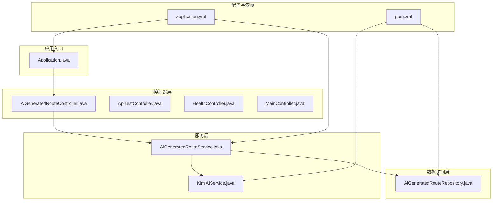
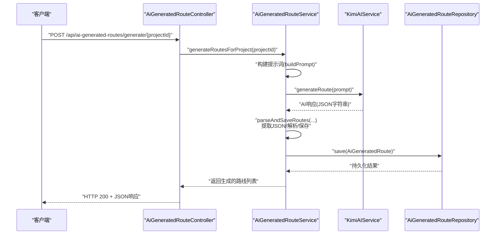
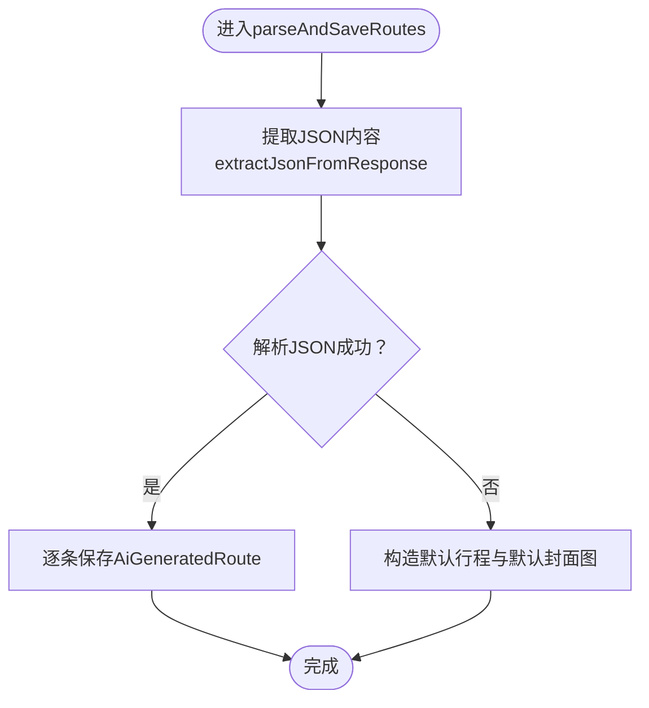
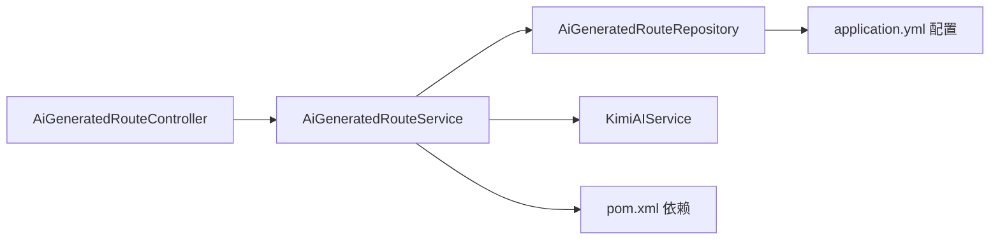

# 调试技巧

<cite>
**本文引用的文件**
- [Application.java](file://tudianersha/src/main/java/com/tudianersha/Application.java)
- [application.yml](file://tudianersha/src/main/resources/application.yml)
- [pom.xml](file://tudianersha/pom.xml)
- [AiGeneratedRouteController.java](file://tudianersha/src/main/java/com/tudianersha/controller/AiGeneratedRouteController.java)
- [AiGeneratedRouteService.java](file://tudianersha/src/main/java/com/tudianersha/service/AiGeneratedRouteService.java)
- [KimiAIService.java](file://tudianersha/src/main/java/com/tudianersha/service/KimiAIService.java)
- [AiGeneratedRouteRepository.java](file://tudianersha/src/main/java/com/tudianersha/repository/AiGeneratedRouteRepository.java)
- [ApiTestController.java](file://tudianersha/src/main/java/com/tudianersha/controller/ApiTestController.java)
- [HealthController.java](file://tudianersha/src/main/java/com/tudianersha/controller/HealthController.java)
- [MainController.java](file://tudianersha/src/main/java/com/tudianersha/controller/MainController.java)
- [UserServiceTest.java](file://tudianersha/src/test/java/com/tudianersha/UserServiceTest.java)
</cite>

## 目录
1. [简介](#简介)
2. [项目结构](#项目结构)
3. [核心组件](#核心组件)
4. [架构总览](#架构总览)
5. [详细组件分析](#详细组件分析)
6. [依赖关系分析](#依赖关系分析)
7. [性能与调试要点](#性能与调试要点)
8. [故障排查指南](#故障排查指南)
9. [结论](#结论)

## 简介
本指南聚焦于在IntelliJ IDEA中高效调试Spring Boot应用，围绕“从Controller到Service再到Repository”的请求链路进行断点调试；同时提供API测试方法（Postman/curl）、Spring Boot Actuator健康监控、数据库SQL可视化、AI服务调用日志定位以及控制台日志（尤其是ERROR/WARN级别）的阅读建议，帮助开发者快速定位并解决问题。

## 项目结构
- 应用入口位于Application.java，负责启动Spring Boot应用。
- 控制器层位于controller包，提供REST接口。
- 业务逻辑位于service包，包含AI服务调用、业务编排与持久化操作。
- 数据访问位于repository包，基于Spring Data JPA。
- 配置集中在resources/application.yml，包含数据库、JPA、日志、邮件、AI与高德API等配置。
- 依赖管理在pom.xml中，包含Actuator、OkHttp、Gson、JPA、MyBatis等。

图表来源
- [Application.java](file://tudianersha/src/main/java/com/tudianersha/Application.java#L1-L12)
- [AiGeneratedRouteController.java](file://tudianersha/src/main/java/com/tudianersha/controller/AiGeneratedRouteController.java#L1-L112)
- [AiGeneratedRouteService.java](file://tudianersha/src/main/java/com/tudianersha/service/AiGeneratedRouteService.java#L1-L486)
- [KimiAIService.java](file://tudianersha/src/main/java/com/tudianersha/service/KimiAIService.java#L1-L175)
- [AiGeneratedRouteRepository.java](file://tudianersha/src/main/java/com/tudianersha/repository/AiGeneratedRouteRepository.java#L1-L12)
- [application.yml](file://tudianersha/src/main/resources/application.yml#L1-L57)
- [pom.xml](file://tudianersha/pom.xml#L1-L180)

章节来源
- [Application.java](file://tudianersha/src/main/java/com/tudianersha/Application.java#L1-L12)
- [application.yml](file://tudianersha/src/main/resources/application.yml#L1-L57)
- [pom.xml](file://tudianersha/pom.xml#L1-L180)

## 核心组件
- 应用入口与启动
  - Application.java作为Spring Boot入口，通过注解启用自动装配与组件扫描。
- 控制器
  - AiGeneratedRouteController提供AI生成路线相关接口，包含查询、新增、更新、删除及批量生成。
  - ApiTestController与MainController提供基础测试与健康检查接口。
  - HealthController提供标准健康检查JSON响应。
- 服务层
  - AiGeneratedRouteService负责业务编排：构建提示词、调用AI服务、解析与落库。
  - KimiAIService封装OkHttp客户端，负责与第三方AI服务通信。
- 数据访问
  - AiGeneratedRouteRepository继承JpaRepository，提供按项目ID查询与通用CRUD能力。
- 配置与依赖
  - application.yml启用JPA show-sql与format-sql，便于观察SQL生成；配置日志级别为debug；声明AI与高德API配置。
  - pom.xml引入Actuator、OkHttp、Gson、JPA、MyBatis等依赖。

章节来源
- [Application.java](file://tudianersha/src/main/java/com/tudianersha/Application.java#L1-L12)
- [AiGeneratedRouteController.java](file://tudianersha/src/main/java/com/tudianersha/controller/AiGeneratedRouteController.java#L1-L112)
- [AiGeneratedRouteService.java](file://tudianersha/src/main/java/com/tudianersha/service/AiGeneratedRouteService.java#L1-L486)
- [KimiAIService.java](file://tudianersha/src/main/java/com/tudianersha/service/KimiAIService.java#L1-L175)
- [AiGeneratedRouteRepository.java](file://tudianersha/src/main/java/com/tudianersha/repository/AiGeneratedRouteRepository.java#L1-L12)
- [application.yml](file://tudianersha/src/main/resources/application.yml#L1-L57)
- [pom.xml](file://tudianersha/pom.xml#L1-L180)

## 架构总览
下图展示一次典型请求从Controller到Service再到Repository的调用链，并标注关键断点位置与日志输出点。

图表来源
- [AiGeneratedRouteController.java](file://tudianersha/src/main/java/com/tudianersha/controller/AiGeneratedRouteController.java#L82-L112)
- [AiGeneratedRouteService.java](file://tudianersha/src/main/java/com/tudianersha/service/AiGeneratedRouteService.java#L70-L120)
- [KimiAIService.java](file://tudianersha/src/main/java/com/tudianersha/service/KimiAIService.java#L60-L100)
- [AiGeneratedRouteRepository.java](file://tudianersha/src/main/java/com/tudianersha/repository/AiGeneratedRouteRepository.java#L1-L12)

## 详细组件分析

### 控制器层：断点与请求入口
- 断点设置建议
  - 在AiGeneratedRouteController的生成接口处设置断点，验证路径变量与异常分支。
  - 在ApiTestController与HealthController设置断点，验证基础接口可用性。
- 请求测试
  - 使用Postman或curl访问生成接口，携带项目ID；检查响应状态码与JSON结构。
  - 访问/health或/api/health确认系统健康状态。

章节来源
- [AiGeneratedRouteController.java](file://tudianersha/src/main/java/com/tudianersha/controller/AiGeneratedRouteController.java#L82-L112)
- [ApiTestController.java](file://tudianersha/src/main/java/com/tudianersha/controller/ApiTestController.java#L1-L15)
- [HealthController.java](file://tudianersha/src/main/java/com/tudianersha/controller/HealthController.java#L1-L15)
- [MainController.java](file://tudianersha/src/main/java/com/tudianersha/controller/MainController.java#L1-L18)

### 服务层：业务编排与AI调用
- 断点设置建议
  - 在AiGeneratedRouteService的generateRoutesForProject入口设置断点，观察项目与需求参数加载。
  - 在buildPrompt处设置断点，核对提示词内容是否符合预期。
  - 在parseAndSaveRoutes中设置断点，观察JSON提取、解析与保存流程。
  - 在KimiAIService的generateRoute处设置断点，核对请求头、请求体与响应处理。
- 日志与错误处理
  - 服务层存在打印与异常分支，便于定位解析失败与默认回退逻辑。

图表来源
- [AiGeneratedRouteService.java](file://tudianersha/src/main/java/com/tudianersha/service/AiGeneratedRouteService.java#L194-L360)

章节来源
- [AiGeneratedRouteService.java](file://tudianersha/src/main/java/com/tudianersha/service/AiGeneratedRouteService.java#L1-L486)
- [KimiAIService.java](file://tudianersha/src/main/java/com/tudianersha/service/KimiAIService.java#L1-L175)

### 数据访问层：JPA与SQL可视化
- 断点设置建议
  - 在AiGeneratedRouteRepository的save方法处设置断点，观察实体持久化过程。
- SQL可视化
  - application.yml已开启show-sql与format-sql，可在控制台查看生成的SQL语句，辅助定位ORM映射与查询问题。

章节来源
- [AiGeneratedRouteRepository.java](file://tudianersha/src/main/java/com/tudianersha/repository/AiGeneratedRouteRepository.java#L1-L12)
- [application.yml](file://tudianersha/src/main/resources/application.yml#L11-L16)

### AI服务调用：OkHttp日志与超时
- OkHttp配置
  - KimiAIService中OkHttpClient设置了较长的连接、写入与读取超时，适合AI生成场景。
- 日志定位
  - 当AI调用失败时，优先检查OkHttpClient的响应状态与body内容，结合服务层异常分支定位问题。

章节来源
- [KimiAIService.java](file://tudianersha/src/main/java/com/tudianersha/service/KimiAIService.java#L25-L35)
- [KimiAIService.java](file://tudianersha/src/main/java/com/tudianersha/service/KimiAIService.java#L70-L100)
- [KimiAIService.java](file://tudianersha/src/main/java/com/tudianersha/service/KimiAIService.java#L140-L175)

## 依赖关系分析
- 组件耦合
  - Controller依赖Service；Service依赖Repository与外部AI服务；Repository依赖JPA配置。
- 外部依赖
  - Actuator用于健康监控；OkHttp用于AI服务调用；Gson用于JSON解析；JPA与MyBatis并存。

图表来源
- [AiGeneratedRouteController.java](file://tudianersha/src/main/java/com/tudianersha/controller/AiGeneratedRouteController.java#L1-L112)
- [AiGeneratedRouteService.java](file://tudianersha/src/main/java/com/tudianersha/service/AiGeneratedRouteService.java#L1-L486)
- [AiGeneratedRouteRepository.java](file://tudianersha/src/main/java/com/tudianersha/repository/AiGeneratedRouteRepository.java#L1-L12)
- [KimiAIService.java](file://tudianersha/src/main/java/com/tudianersha/service/KimiAIService.java#L1-L175)
- [pom.xml](file://tudianersha/pom.xml#L1-L180)
- [application.yml](file://tudianersha/src/main/resources/application.yml#L1-L57)

章节来源
- [pom.xml](file://tudianersha/pom.xml#L1-L180)
- [application.yml](file://tudianersha/src/main/resources/application.yml#L1-L57)

## 性能与调试要点
- 启用SQL可视化
  - application.yml已开启show-sql与format-sql，便于观察SQL生成与优化。
- 调整超时策略
  - AI生成耗时较长，OkHttpClient已设置较长超时，避免因超时导致的失败。
- 日志级别
  - application.yml将com.tudianersha包的日志级别设为debug，有助于捕获更多运行时信息。

章节来源
- [application.yml](file://tudianersha/src/main/resources/application.yml#L11-L16)
- [application.yml](file://tudianersha/src/main/resources/application.yml#L43-L46)
- [KimiAIService.java](file://tudianersha/src/main/java/com/tudianersha/service/KimiAIService.java#L25-L35)

## 故障排查指南

### 1) 在IntelliJ IDEA中设置断点并以Debug模式启动
- 设置断点
  - 在Application.java的main方法处设置断点，确保应用启动阶段可被拦截。
  - 在AiGeneratedRouteController的生成接口处设置断点，验证请求进入与异常分支。
  - 在AiGeneratedRouteService的generateRoutesForProject/buildPrompt/parseAndSaveRoutes处设置断点，逐步跟踪业务流程。
  - 在KimiAIService的generateRoute处设置断点，验证AI调用请求与响应。
- Debug模式启动
  - 在IDE中选择Debug配置启动Application类，或使用Maven插件以Debug模式运行。

章节来源
- [Application.java](file://tudianersha/src/main/java/com/tudianersha/Application.java#L1-L12)
- [AiGeneratedRouteController.java](file://tudianersha/src/main/java/com/tudianersha/controller/AiGeneratedRouteController.java#L82-L112)
- [AiGeneratedRouteService.java](file://tudianersha/src/main/java/com/tudianersha/service/AiGeneratedRouteService.java#L70-L120)
- [KimiAIService.java](file://tudianersha/src/main/java/com/tudianersha/service/KimiAIService.java#L60-L100)

### 2) 使用Postman或curl测试API端点
- 基础接口
  - 访问/或/api/test/hello验证应用正常运行。
  - 访问/api/health或/health获取健康状态。
- 生成接口
  - 使用POST /api/ai-generated-routes/generate/{projectId}，携带项目ID，检查响应状态码与JSON结构。
  - 若出现异常，关注控制器的BAD_REQUEST与INTERNAL_SERVER_ERROR分支返回。

章节来源
- [ApiTestController.java](file://tudianersha/src/main/java/com/tudianersha/controller/ApiTestController.java#L1-L15)
- [HealthController.java](file://tudianersha/src/main/java/com/tudianersha/controller/HealthController.java#L1-L15)
- [MainController.java](file://tudianersha/src/main/java/com/tudianersha/controller/MainController.java#L1-L18)
- [AiGeneratedRouteController.java](file://tudianersha/src/main/java/com/tudianersha/controller/AiGeneratedRouteController.java#L82-L112)

### 3) 利用Actuator监控应用状态
- 依赖与端点
  - pom.xml已引入spring-boot-starter-actuator，可通过/actuator/health等端点监控应用健康状况。
- 建议
  - 在开发环境启用必要的端点，生产环境谨慎暴露敏感端点。

章节来源
- [pom.xml](file://tudianersha/pom.xml#L131-L135)

### 4) 数据库问题排查：开启show-sql与format-sql
- 配置
  - application.yml已开启show-sql与format-sql，可在控制台查看生成的SQL语句。
- 建议
  - 结合断点与SQL输出，定位实体映射、关联关系与查询性能问题。

章节来源
- [application.yml](file://tudianersha/src/main/resources/application.yml#L11-L16)

### 5) AI服务调用失败：检查OkHttp日志
- 定位步骤
  - 在KimiAIService的generateRoute处设置断点，检查请求头（Authorization、Content-Type）与请求体。
  - 观察响应状态码与body内容，结合服务层异常分支定位问题。
- 超时与重试
  - OkHttp已设置较长超时，若仍失败，检查网络与第三方API配额限制。

章节来源
- [KimiAIService.java](file://tudianersha/src/main/java/com/tudianersha/service/KimiAIService.java#L25-L35)
- [KimiAIService.java](file://tudianersha/src/main/java/com/tudianersha/service/KimiAIService.java#L70-L100)
- [AiGeneratedRouteService.java](file://tudianersha/src/main/java/com/tudianersha/service/AiGeneratedRouteService.java#L87-L120)

### 6) 阅读控制台日志：重点关注ERROR与WARN
- 日志级别
  - application.yml将com.tudianersha包的日志级别设为debug，便于捕获运行时信息。
- 建议
  - 在IDE控制台中留意ERROR与WARN级别日志，结合断点与SQL输出定位问题根因。

章节来源
- [application.yml](file://tudianersha/src/main/resources/application.yml#L43-L46)

### 7) 单元测试辅助定位
- 测试参考
  - UserServiceTest展示了如何使用@SpringBootTest与MockBean进行单元测试，可借鉴其思路验证DAO层与服务层行为。
- 建议
  - 对关键业务流程编写单元测试，减少回归风险。

章节来源
- [UserServiceTest.java](file://tudianersha/src/test/java/com/tudianersha/UserServiceTest.java#L1-L55)

## 结论
通过在关键位置设置断点、结合Postman/curl与Actuator进行端到端验证、利用application.yml开启SQL可视化、在KimiAIService中定位OkHttp调用问题，并重视控制台日志（尤其是ERROR/WARN），可以形成一套高效的调试闭环。建议在开发过程中持续完善单元测试与日志策略，提升问题定位效率与系统稳定性。