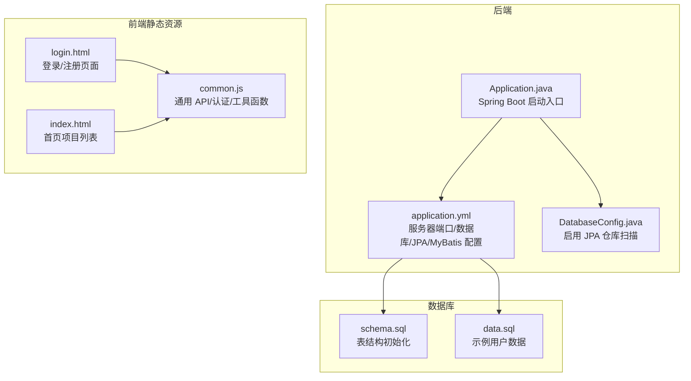
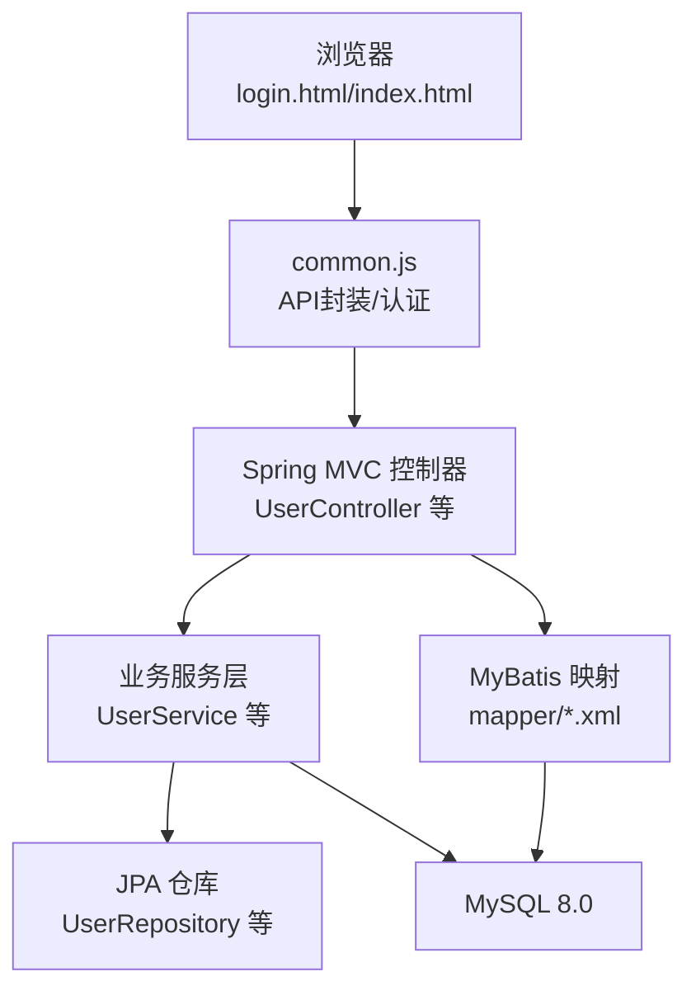
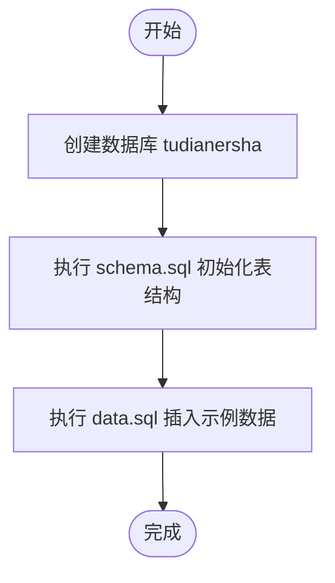
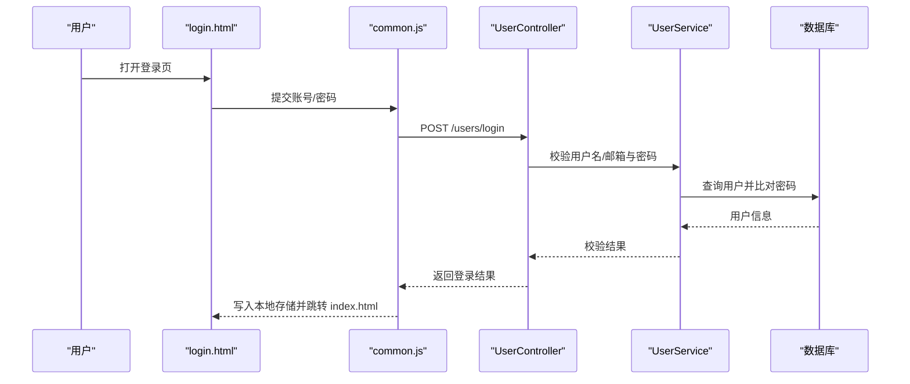
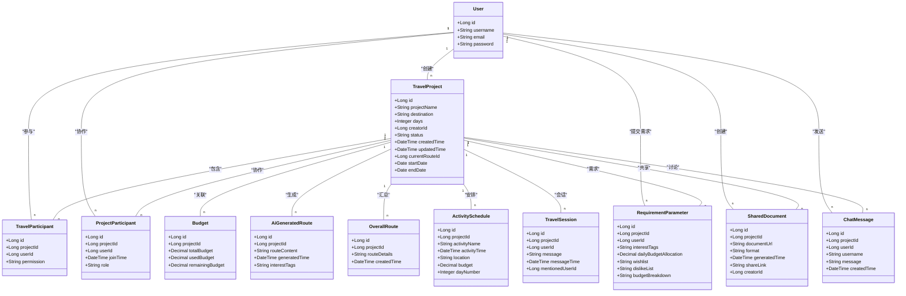
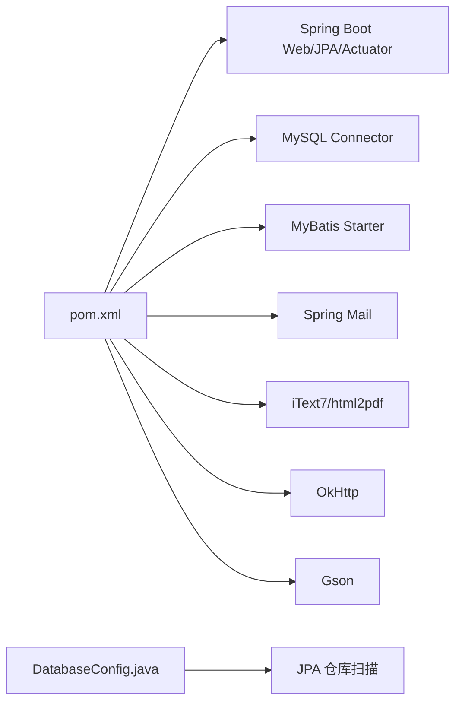

# 快速入门指南

<cite>
**本文引用的文件**
- [pom.xml](file://tudianersha/pom.xml)
- [Application.java](file://tudianersha/src/main/java/com/tudianersha/Application.java)
- [application.yml](file://tudianersha/src/main/resources/application.yml)
- [schema.sql](file://tudianersha/src/main/resources/schema.sql)
- [data.sql](file://tudianersha/src/main/resources/data.sql)
- [login.html](file://tudianersha/src/main/resources/static/login.html)
- [index.html](file://tudianersha/src/main/resources/static/index.html)
- [common.js](file://tudianersha/src/main/resources/static/js/common.js)
- [UserController.java](file://tudianersha/src/main/java/com/tudianersha/controller/UserController.java)
- [User.java](file://tudianersha/src/main/java/com/tudianersha/entity/User.java)
- [DatabaseConfig.java](file://tudianersha/src/main/java/com/tudianersha/config/DatabaseConfig.java)
</cite>

## 目录
1. [简介](#简介)
2. [项目结构](#项目结构)
3. [核心组件](#核心组件)
4. [架构总览](#架构总览)
5. [详细组件分析](#详细组件分析)
6. [依赖关系分析](#依赖关系分析)
7. [性能注意事项](#性能注意事项)
8. [故障排查指南](#故障排查指南)
9. [结论](#结论)
10. [附录](#附录)

## 简介
本指南面向新开发者，帮助你在10分钟内完成“途点儿啥”系统的本地环境搭建与首次运行。你将完成以下步骤：
- 安装 JDK 11、MySQL 8.0 并创建数据库
- 从 schema.sql 导入表结构
- 在 application.yml 中配置数据库连接（用户名、密码）
- 使用 Maven 构建并启动 Spring Boot 应用
- 通过浏览器访问前端页面，登录并创建第一个旅行项目

系统默认运行在 8010 端口，前端页面可通过 http://localhost:8010 访问。

## 项目结构
该工程采用 Spring Boot + JPA + MyBatis 的后端技术栈，前端静态资源位于 resources/static 下，配置集中在 application.yml，数据库初始化脚本位于 resources/schema.sql 和 data.sql。

图示来源
- [Application.java](file://tudianersha/src/main/java/com/tudianersha/Application.java#L1-L12)
- [application.yml](file://tudianersha/src/main/resources/application.yml#L1-L57)
- [DatabaseConfig.java](file://tudianersha/src/main/java/com/tudianersha/config/DatabaseConfig.java#L1-L10)
- [login.html](file://tudianersha/src/main/resources/static/login.html#L1-L405)
- [index.html](file://tudianersha/src/main/resources/static/index.html#L1-L515)
- [common.js](file://tudianersha/src/main/resources/static/js/common.js#L1-L272)
- [schema.sql](file://tudianersha/src/main/resources/schema.sql#L1-L123)
- [data.sql](file://tudianersha/src/main/resources/data.sql#L1-L7)

章节来源
- [pom.xml](file://tudianersha/pom.xml#L1-L180)
- [Application.java](file://tudianersha/src/main/java/com/tudianersha/Application.java#L1-L12)
- [application.yml](file://tudianersha/src/main/resources/application.yml#L1-L57)
- [schema.sql](file://tudianersha/src/main/resources/schema.sql#L1-L123)
- [data.sql](file://tudianersha/src/main/resources/data.sql#L1-L7)
- [login.html](file://tudianersha/src/main/resources/static/login.html#L1-L405)
- [index.html](file://tudianersha/src/main/resources/static/index.html#L1-L515)
- [common.js](file://tudianersha/src/main/resources/static/js/common.js#L1-L272)
- [DatabaseConfig.java](file://tudianersha/src/main/java/com/tudianersha/config/DatabaseConfig.java#L1-L10)

## 核心组件
- 启动类：Application.java 提供 Spring Boot 启动入口。
- 配置中心：application.yml 定义服务器端口、数据库连接、JPA 方言、MyBatis 映射位置、日志级别以及第三方 API 配置。
- 数据库初始化：schema.sql 定义所有业务表；data.sql 提供示例用户数据。
- 前端页面：login.html 与 index.html 由 common.js 提供统一的 API 请求、认证与工具能力。
- 用户控制器：UserController 提供注册与登录接口，配合 User 实体与密码加密工具。

章节来源
- [Application.java](file://tudianersha/src/main/java/com/tudianersha/Application.java#L1-L12)
- [application.yml](file://tudianersha/src/main/resources/application.yml#L1-L57)
- [schema.sql](file://tudianersha/src/main/resources/schema.sql#L1-L123)
- [data.sql](file://tudianersha/src/main/resources/data.sql#L1-L7)
- [login.html](file://tudianersha/src/main/resources/static/login.html#L1-L405)
- [index.html](file://tudianersha/src/main/resources/static/index.html#L1-L515)
- [common.js](file://tudianersha/src/main/resources/static/js/common.js#L1-L272)
- [UserController.java](file://tudianersha/src/main/java/com/tudianersha/controller/UserController.java#L1-L152)
- [User.java](file://tudianersha/src/main/java/com/tudianersha/entity/User.java#L1-L73)

## 架构总览
后端通过 Spring MVC 暴露 REST 接口，前端通过 common.js 的 get/post/put/del 封装调用 /api 前缀下的接口。JPA 与 MyBatis 共存，application.yml 中已配置 MyBatis 的映射位置与实体别名包。

图示来源
- [login.html](file://tudianersha/src/main/resources/static/login.html#L1-L405)
- [index.html](file://tudianersha/src/main/resources/static/index.html#L1-L515)
- [common.js](file://tudianersha/src/main/resources/static/js/common.js#L1-L272)
- [UserController.java](file://tudianersha/src/main/java/com/tudianersha/controller/UserController.java#L1-L152)
- [application.yml](file://tudianersha/src/main/resources/application.yml#L1-L57)

## 详细组件分析

### 启动与配置
- 启动类：Application.java 使用 @SpringBootApplication 启动应用。
- 服务器端口：application.yml 中 server.port 设置为 8010。
- 数据源与 JPA：application.yml 中配置了 JDBC URL、用户名、密码、驱动类名、Hibernate Dialect、DDL 自动更新策略等。
- MyBatis：application.yml 中配置了 mapper-locations 与 type-aliases-package。
- 日志：application.yml 中设置了 com.tudianersha 包的日志级别为 debug。

章节来源
- [Application.java](file://tudianersha/src/main/java/com/tudianersha/Application.java#L1-L12)
- [application.yml](file://tudianersha/src/main/resources/application.yml#L1-L57)

### 数据库初始化流程
- 表结构：schema.sql 定义了 users、travel_projects、activity_schedules、budgets、ai_generated_routes、overall_routes、travel_participants、project_participants、shared_documents、chat_messages、requirement_parameters、travel_sessions 等表。
- 示例数据：data.sql 插入若干示例用户，便于快速体验。
- 初始化顺序建议：先创建数据库，再执行 schema.sql，最后执行 data.sql。

图示来源
- [schema.sql](file://tudianersha/src/main/resources/schema.sql#L1-L123)
- [data.sql](file://tudianersha/src/main/resources/data.sql#L1-L7)

章节来源
- [schema.sql](file://tudianersha/src/main/resources/schema.sql#L1-L123)
- [data.sql](file://tudianersha/src/main/resources/data.sql#L1-L7)

### 前端登录与项目创建流程
- 登录页：login.html 通过 common.js 的 post('/users/login') 调用后端登录接口，登录成功后将用户信息写入本地存储并跳转到 index.html。
- 首页：index.html 通过 common.js 的 get('/travel-projects')、get('/travel-participants')、get('/project-participants') 获取项目数据，并按权限分类展示。
- 创建项目：index.html 中“创建新旅程”按钮会跳转到 /create-project.html（静态页面），实际创建逻辑由后端控制器处理。

图示来源
- [login.html](file://tudianersha/src/main/resources/static/login.html#L1-L405)
- [common.js](file://tudianersha/src/main/resources/static/js/common.js#L1-L272)
- [UserController.java](file://tudianersha/src/main/java/com/tudianersha/controller/UserController.java#L1-L152)

章节来源
- [login.html](file://tudianersha/src/main/resources/static/login.html#L1-L405)
- [index.html](file://tudianersha/src/main/resources/static/index.html#L1-L515)
- [common.js](file://tudianersha/src/main/resources/static/js/common.js#L1-L272)
- [UserController.java](file://tudianersha/src/main/java/com/tudianersha/controller/UserController.java#L1-L152)

### 对象模型与关系

图示来源
- [User.java](file://tudianersha/src/main/java/com/tudianersha/entity/User.java#L1-L73)
- [schema.sql](file://tudianersha/src/main/resources/schema.sql#L1-L123)

章节来源
- [User.java](file://tudianersha/src/main/java/com/tudianersha/entity/User.java#L1-L73)
- [schema.sql](file://tudianersha/src/main/resources/schema.sql#L1-L123)

## 依赖关系分析
- Maven 依赖：pom.xml 中声明了 Spring Boot Web、JPA、MyBatis、MySQL Connector、邮件、PDF、OkHttp、Gson 等依赖，并固定 Java 版本为 11。
- 启动插件：spring-boot-maven-plugin 用于打包与运行。
- JPA 仓库：DatabaseConfig.java 启用 JPA 仓库扫描，确保 Repository 能被发现。

图示来源
- [pom.xml](file://tudianersha/pom.xml#L1-L180)
- [DatabaseConfig.java](file://tudianersha/src/main/java/com/tudianersha/config/DatabaseConfig.java#L1-L10)

章节来源
- [pom.xml](file://tudianersha/pom.xml#L1-L180)
- [DatabaseConfig.java](file://tudianersha/src/main/java/com/tudianersha/config/DatabaseConfig.java#L1-L10)

## 性能注意事项
- 开发阶段建议将日志级别设为 debug，便于定位问题；生产环境可调整为 info 或 warn。
- JPA 的 ddl-auto=update 适合开发环境，生产环境建议改为 validate 或手动迁移。
- MyBatis 的 mapper-locations 与 type-aliases-package 已配置，确保映射文件与实体包正确。
- 前端 common.js 使用 fetch 进行 API 调用，注意跨域与本地存储的使用。

[本节为通用建议，无需特定文件来源]

## 故障排查指南

- 数据库连接失败
  - 检查 application.yml 中的数据库 URL、用户名、密码是否与本地 MySQL 一致。
  - 确认 MySQL 8.0 已启动且网络端口 3306 可用。
  - 确保已创建数据库 tudianersha，并已执行 schema.sql 与 data.sql。
  - 若使用 root 用户，请确认 root 密码与 application.yml 中配置一致。

  章节来源
  - [application.yml](file://tudianersha/src/main/resources/application.yml#L1-L57)
  - [schema.sql](file://tudianersha/src/main/resources/schema.sql#L1-L123)
  - [data.sql](file://tudianersha/src/main/resources/data.sql#L1-L7)

- 端口占用
  - 默认端口为 8010，若被占用，可在 application.yml 中修改 server.port。
  - 修改后重启应用即可生效。

  章节来源
  - [application.yml](file://tudianersha/src/main/resources/application.yml#L1-L57)

- Lombok 插件缺失
  - 本项目未使用 Lombok，因此不会出现 Lombok 插件缺失导致的编译错误。
  - 如需使用 Lombok，请在 IDE 安装对应插件并开启注解处理器。

  章节来源
  - [pom.xml](file://tudianersha/pom.xml#L1-L180)

- 前端无法访问后端接口
  - 确认应用已启动且端口为 8010。
  - 检查 common.js 中的 API_BASE_URL 是否为 /api，页面通过相对路径访问。
  - 确认浏览器控制台无跨域错误（开发环境允许跨域）。

  章节来源
  - [common.js](file://tudianersha/src/main/resources/static/js/common.js#L1-L272)
  - [login.html](file://tudianersha/src/main/resources/static/login.html#L1-L405)
  - [index.html](file://tudianersha/src/main/resources/static/index.html#L1-L515)

- 登录失败
  - 使用 data.sql 中提供的示例用户进行测试（例如 admin/admin123）。
  - 确认 UserController 的登录接口正常工作，密码通过 PasswordEncoderUtil 进行匹配。

  章节来源
  - [data.sql](file://tudianersha/src/main/resources/data.sql#L1-L7)
  - [UserController.java](file://tudianersha/src/main/java/com/tudianersha/controller/UserController.java#L1-L152)

## 结论
按照本指南，你可以在本地快速完成环境准备、数据库初始化与应用启动，并通过浏览器访问前端页面进行登录与项目创建。如遇问题，可依据“故障排查指南”逐项检查配置与依赖。

[本节为总结性内容，无需特定文件来源]

## 附录

### 最小可行操作路径（10 分钟）
- 安装 JDK 11、MySQL 8.0
- 创建数据库 tudianersha
- 执行 schema.sql 初始化表结构
- 执行 data.sql 插入示例数据
- 在 application.yml 中配置数据库连接（用户名、密码）
- 使用 Maven 构建并启动应用
  - mvn clean install
  - mvn spring-boot:run
- 浏览器访问 http://localhost:8010
- 登录后进入首页，点击“创建新旅程”创建第一个旅行项目

章节来源
- [schema.sql](file://tudianersha/src/main/resources/schema.sql#L1-L123)
- [data.sql](file://tudianersha/src/main/resources/data.sql#L1-L7)
- [application.yml](file://tudianersha/src/main/resources/application.yml#L1-L57)
- [pom.xml](file://tudianersha/pom.xml#L1-L180)
- [Application.java](file://tudianersha/src/main/java/com/tudianersha/Application.java#L1-L12)
- [login.html](file://tudianersha/src/main/resources/static/login.html#L1-L405)
- [index.html](file://tudianersha/src/main/resources/static/index.html#L1-L515)