# 技术栈与依赖

<cite>
**本文档引用的文件**
- [pom.xml](file://tudianersha/pom.xml)
- [application.yml](file://tudianersha/src/main/resources/application.yml)
- [Application.java](file://tudianersha/src/main/java/com/tudianersha/Application.java)
- [DatabaseConfig.java](file://tudianersha/src/main/java/com/tudianersha/config/DatabaseConfig.java)
- [WebConfig.java](file://tudianersha/src/main/java/com/tudianersha/config/WebConfig.java)
- [UserRepository.java](file://tudianersha/src/main/java/com/tudianersha/repository/UserRepository.java)
- [UserService.java](file://tudianersha/src/main/java/com/tudianersha/service/UserService.java)
- [KimiAIService.java](file://tudianersha/src/main/java/com/tudianersha/service/KimiAIService.java)
- [ItineraryPdfService.java](file://tudianersha/src/main/java/com/tudianersha/service/ItineraryPdfService.java)
- [DocxReader.java](file://tudianersha/src/main/java/com/tudianersha/util/DocxReader.java)
- [PasswordEncoderUtil.java](file://tudianersha/src/main/java/com/tudianersha/util/PasswordEncoderUtil.java)
- [PdfExportController.java](file://tudianersha/src/main/java/com/tudianersha/controller/PdfExportController.java)
- [AmapPoiService.java](file://tudianersha/src/main/java/com/tudianersha/service/AmapPoiService.java)
- [common.js](file://tudianersha/src/main/resources/static/js/common.js)
</cite>

## 目录
1. [技术栈概览](#技术栈概览)
2. [后端技术栈](#后端技术栈)
3. [前端技术栈](#前端技术栈)
4. [第三方库与API集成](#第三方库与api集成)
5. [依赖管理与配置](#依赖管理与配置)
6. [组件依赖关系图谱](#组件依赖关系图谱)

## 技术栈概览

本项目采用现代化的全栈技术架构，后端基于Java 11和Spring Boot 2.7.0构建，使用Spring Data JPA与MyBatis混合的数据访问层，数据库采用MySQL 8.0。前端采用原生HTML5、CSS3和JavaScript技术，通过fetch API与后端进行交互。项目集成了多种第三方服务，包括Kimi AI API、高德地图API和QQ邮箱SMTP服务，同时使用iText7、Apache POI等库处理文档操作。

**Section sources**
- [pom.xml](file://tudianersha/pom.xml)
- [application.yml](file://tudianersha/src/main/resources/application.yml)

## 后端技术栈

### Java 11语言特性

项目采用Java 11作为基础开发语言，利用其长期支持（LTS）特性确保项目稳定性。在pom.xml文件中明确指定了Java 11的编译版本，通过maven.compiler.source和maven.compiler.target属性进行配置。Java 11提供了更好的性能、安全性和语言特性，为Spring Boot应用提供了稳定的运行环境。

**Section sources**
- [pom.xml](file://tudianersha/pom.xml#L17-L18)

### Spring Boot 2.7.0框架

项目采用Spring Boot 2.7.0作为核心框架，充分利用其自动配置和起步依赖特性。在pom.xml中通过spring.boot.version属性统一管理版本，确保所有Spring Boot相关组件版本一致。Spring Boot的自动配置机制大大简化了项目配置，起步依赖（如spring-boot-starter-web、spring-boot-starter-data-jpa）减少了手动配置依赖的复杂性。

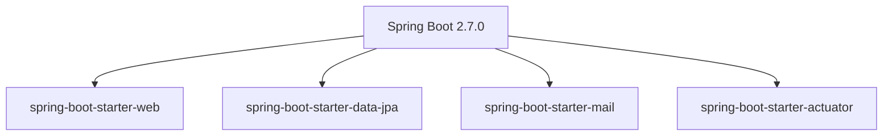

**Diagram sources**
- [pom.xml](file://tudianersha/pom.xml#L20)
- [Application.java](file://tudianersha/src/main/java/com/tudianersha/Application.java#L6)

**Section sources**
- [pom.xml](file://tudianersha/pom.xml#L20)
- [Application.java](file://tudianersha/src/main/java/com/tudianersha/Application.java#L6)

### 数据访问层：Spring Data JPA与MyBatis混合使用

项目采用Spring Data JPA与MyBatis混合使用的策略，充分发挥两种ORM框架的优势。Spring Data JPA用于简化常规的CRUD操作，而MyBatis用于处理复杂的SQL查询。

在pom.xml中同时引入了spring-boot-starter-data-jpa和mybatis-spring-boot-starter依赖。通过DatabaseConfig.java中的@EnableJpaRepositories注解启用JPA仓库，BasePackages指定为"com.tudianersha.repository"。MyBatis的配置在application.yml中通过mybatis.mapper-locations和mybatis.type-aliases-package进行设置。

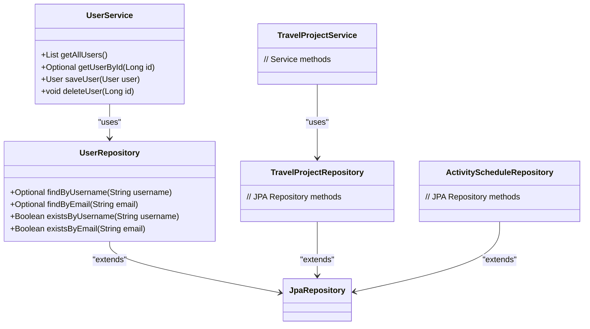

**Diagram sources**
- [DatabaseConfig.java](file://tudianersha/src/main/java/com/tudianersha/config/DatabaseConfig.java#L7)
- [UserRepository.java](file://tudianersha/src/main/java/com/tudianersha/repository/UserRepository.java#L9)
- [UserService.java](file://tudianersha/src/main/java/com/tudianersha/service/UserService.java#L11)

**Section sources**
- [pom.xml](file://tudianersha/pom.xml#L40-L59)
- [DatabaseConfig.java](file://tudianersha/src/main/java/com/tudianersha/config/DatabaseConfig.java#L7)
- [application.yml](file://tudianersha/src/main/resources/application.yml#L39-L41)

### MySQL 8.0数据库角色及连接配置

项目使用MySQL 8.0作为持久化存储数据库，在pom.xml中通过mysql.version属性定义版本为8.0.29。数据库连接配置在application.yml文件中，包括JDBC URL、用户名、密码和驱动类名。

数据库配置支持Unicode字符集和GMT+8时区，确保中文字符的正确存储和处理。Spring Data JPA的hibernate.ddl-auto设置为update，允许JPA根据实体类自动更新数据库结构。database-platform配置为MySQL8Dialect，针对MySQL 8.0优化SQL生成。

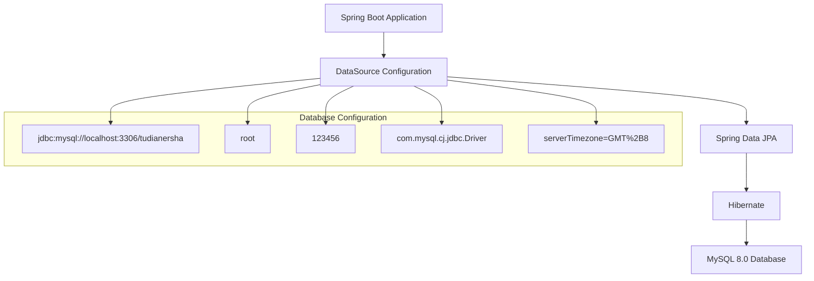

**Diagram sources**
- [application.yml](file://tudianersha/src/main/resources/application.yml#L5-L9)
- [pom.xml](file://tudianersha/pom.xml#L21)

**Section sources**
- [pom.xml](file://tudianersha/pom.xml#L21)
- [application.yml](file://tudianersha/src/main/resources/application.yml#L5-L15)

## 前端技术栈

### HTML5、CSS3与原生JavaScript

前端采用HTML5和CSS3构建用户界面，包含多个HTML页面如index.html、login.html、create-project.html等。CSS样式文件common.css位于static/css目录下，提供统一的样式定义。

JavaScript方面，项目使用原生JavaScript而非框架，通过fetch API与后端RESTful API进行通信。common.js文件定义了通用的API请求函数apiRequest，封装了fetch调用，处理请求头、错误和响应解析。

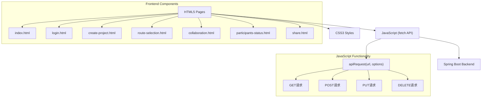

**Diagram sources**
- [common.js](file://tudianersha/src/main/resources/static/js/common.js#L5)
- [index.html](file://tudianersha/src/main/resources/static/index.html)

**Section sources**
- [common.js](file://tudianersha/src/main/resources/static/js/common.js#L1-L42)
- [index.html](file://tudianersha/src/main/resources/static/index.html)

### 前后端交互机制

前后端通过RESTful API进行交互，前端JavaScript使用fetch API发送HTTP请求。在common.js中，apiRequest函数配置了默认的Content-Type为application/json，并处理CORS、错误和JSON解析。

API基础URL设置为相对路径'/api'，自动适配当前端口。请求支持GET、POST、PUT、DELETE等方法，响应处理考虑了空响应、非JSON响应和错误情况。后端通过WebConfig.java配置CORS，允许来自任何源的请求访问/api/**路径。

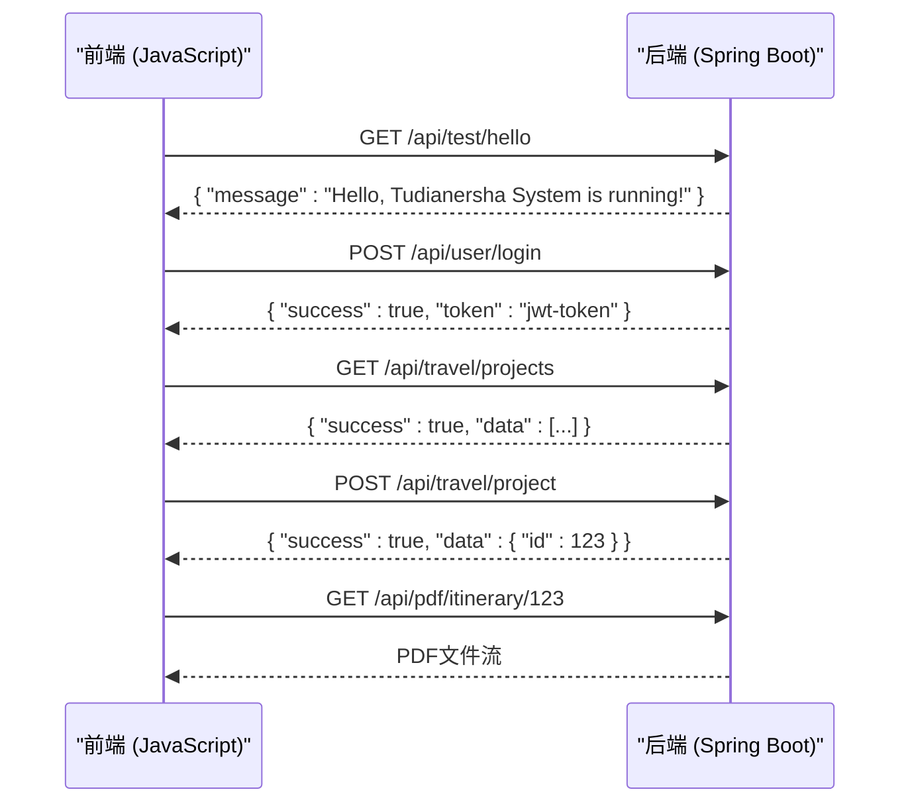

**Diagram sources**
- [common.js](file://tudianersha/src/main/resources/static/js/common.js#L5)
- [ApiTestController.java](file://tudianersha/src/main/java/com/tudianersha/controller/ApiTestController.java#L9)
- [PdfExportController.java](file://tudianersha/src/main/java/com/tudianersha/controller/PdfExportController.java#L24)

**Section sources**
- [common.js](file://tudianersha/src/main/resources/static/js/common.js#L5-L42)
- [WebConfig.java](file://tudianersha/src/main/java/com/tudianersha/config/WebConfig.java#L11-L23)

## 第三方库与API集成

### 关键第三方库

#### iText7用于PDF导出

项目使用iText7库实现PDF文档生成功能。在pom.xml中引入了itext7-core、html2pdf和font-asian三个相关依赖，支持HTML转PDF和中文字体渲染。ItineraryPdfService.java服务类负责生成行程PDF，使用PDF字体STSong-Light确保中文正确显示。

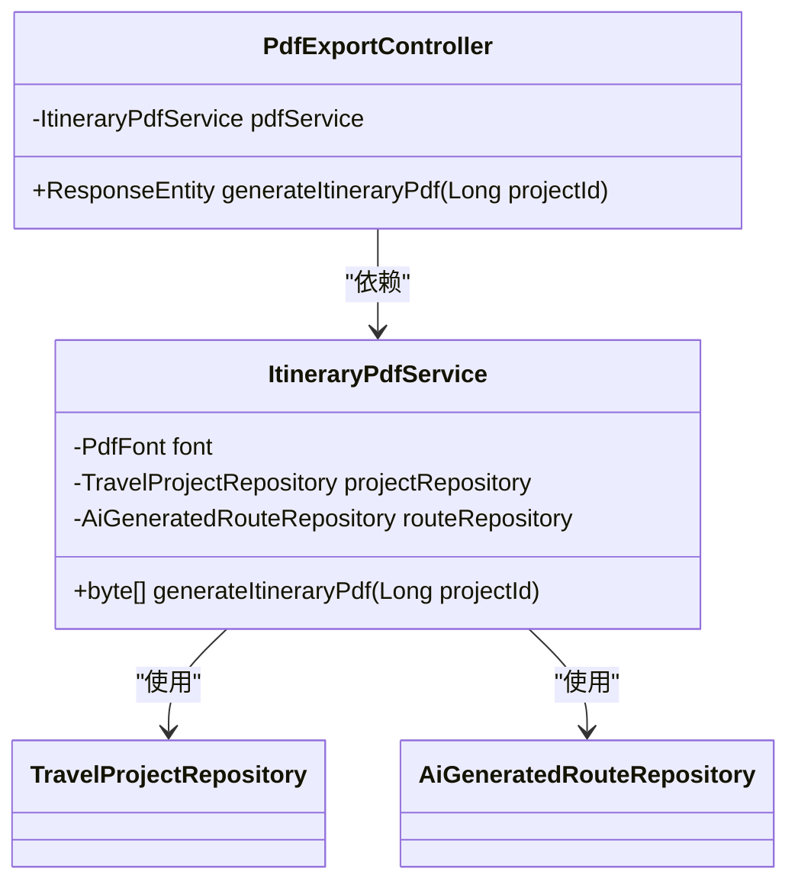

**Diagram sources**
- [pom.xml](file://tudianersha/pom.xml#L152-L168)
- [ItineraryPdfService.java](file://tudianersha/src/main/java/com/tudianersha/service/ItineraryPdfService.java#L31)
- [PdfExportController.java](file://tudianersha/src/main/java/com/tudianersha/controller/PdfExportController.java#L17)

**Section sources**
- [pom.xml](file://tudianersha/pom.xml#L152-L168)
- [ItineraryPdfService.java](file://tudianersha/src/main/java/com/tudianersha/service/ItineraryPdfService.java)
- [PdfExportController.java](file://tudianersha/src/main/java/com/tudianersha/controller/PdfExportController.java)

#### OkHttp3调用Kimi AI API

项目集成Kimi AI API提供智能旅行路线生成功能，使用OkHttp3作为HTTP客户端。在pom.xml中引入okhttp依赖，版本4.10.0。KimiAIService.java服务类封装了API调用逻辑，使用OkHttpClient配置适当的超时时间（连接120秒，读取180秒）以适应AI生成的长时间响应。

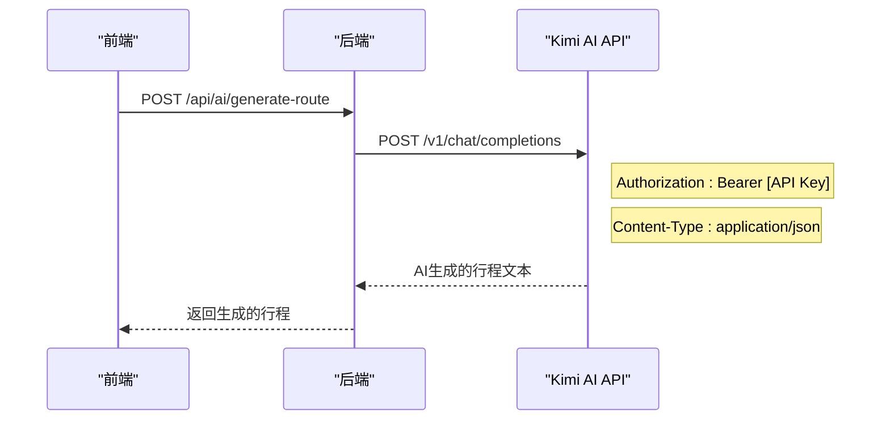

**Diagram sources**
- [pom.xml](file://tudianersha/pom.xml#L139-L142)
- [KimiAIService.java](file://tudianersha/src/main/java/com/tudianersha/service/KimiAIService.java#L25)
- [application.yml](file://tudianersha/src/main/resources/application.yml#L48-L52)

**Section sources**
- [pom.xml](file://tudianersha/pom.xml#L139-L142)
- [KimiAIService.java](file://tudianersha/src/main/java/com/tudianersha/service/KimiAIService.java)
- [application.yml](file://tudianersha/src/main/resources/application.yml#L48-L52)

#### Gson处理JSON序列化

项目使用Gson库进行JSON序列化和反序列化操作，在pom.xml中引入gson依赖，版本2.9.0。Gson主要用于处理Kimi AI API的请求和响应数据，以及行程数据的JSON解析。在ItineraryPdfService.java中，Gson用于解析存储在数据库中的每日行程JSON数据。

**Section sources**
- [pom.xml](file://tudianersha/pom.xml#L146-L149)
- [ItineraryPdfService.java](file://tudianersha/src/main/java/com/tudianersha/service/ItineraryPdfService.java#L3)

#### Apache POI读取DOCX文档

项目使用Apache POI库读取DOCX格式的文档文件，在pom.xml中引入poi、poi-scratchpad和poi-ooxml三个依赖，版本5.2.3。DocxReader.java工具类封装了DOCX文件读取功能，使用XWPFDocument解析文档内容。DocxReaderApp.java是独立的应用程序，用于测试DOCX文件读取功能。

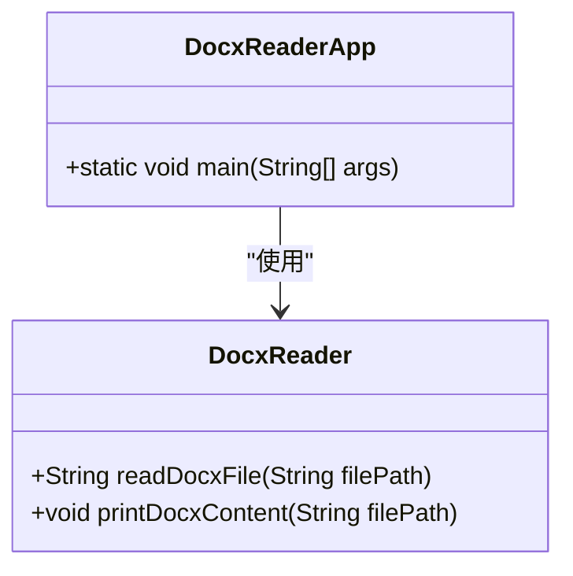

**Diagram sources**
- [pom.xml](file://tudianersha/pom.xml#L62-L76)
- [DocxReader.java](file://tudianersha/src/main/java/com/tudianersha/util/DocxReader.java#L13)
- [DocxReaderApp.java](file://tudianersha/src/main/java/com/tudianersha/DocxReaderApp.java#L11)

**Section sources**
- [pom.xml](file://tudianersha/pom.xml#L62-L76)
- [DocxReader.java](file://tudianersha/src/main/java/com/tudianersha/util/DocxReader.java)
- [DocxReaderApp.java](file://tudianersha/src/main/java/com/tudianersha/DocxReaderApp.java)

#### Spring Security Crypto进行密码加密

项目使用Spring Security Crypto的BCryptPasswordEncoder进行密码加密，在pom.xml中引入spring-security-crypto依赖，版本5.7.1。PasswordEncoderUtil.java工具类封装了密码加密和验证的静态方法，使用BCrypt算法确保用户密码的安全存储。

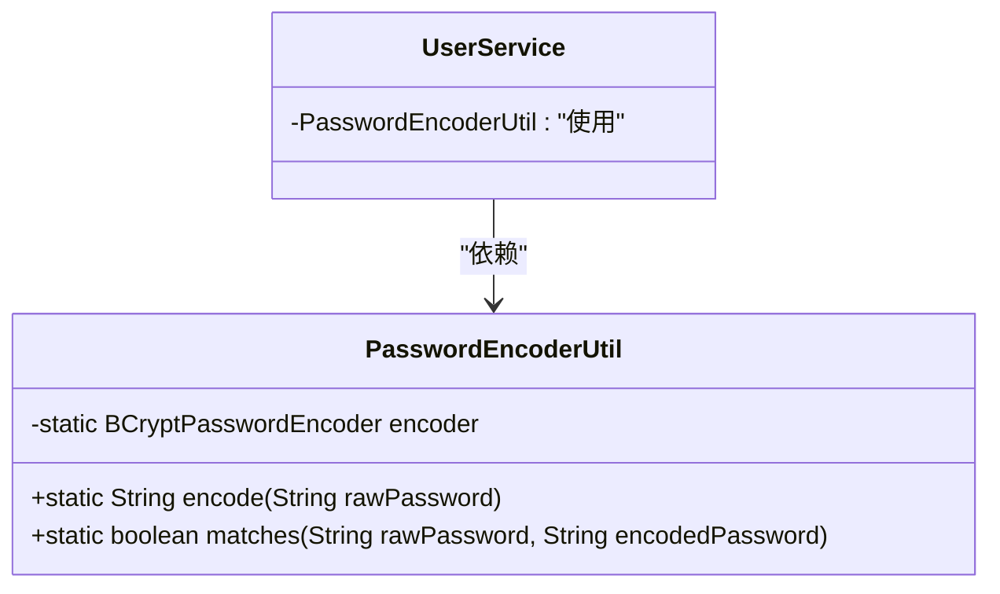

**Diagram sources**
- [pom.xml](file://tudianersha/pom.xml#L93-L97)
- [PasswordEncoderUtil.java](file://tudianersha/src/main/java/com/tudianersha/util/PasswordEncoderUtil.java#L10)

**Section sources**
- [pom.xml](file://tudianersha/pom.xml#L93-L97)
- [PasswordEncoderUtil.java](file://tudianersha/src/main/java/com/tudianersha/util/PasswordEncoderUtil.java)

### 外部API集成

#### 高德地图API集成

项目集成高德地图API提供地理位置和POI（兴趣点）查询功能。在application.yml中配置amap.api.key，AmapPoiService.java服务类封装了API调用逻辑，包括POI搜索、图片获取和地理编码功能。API调用使用OkHttpClient，支持URL编码处理中文参数。

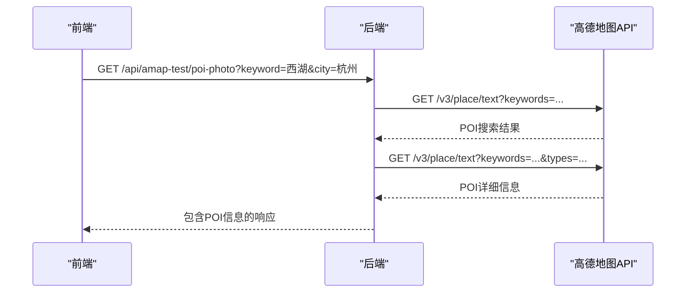

**Diagram sources**
- [application.yml](file://tudianersha/src/main/resources/application.yml#L54-L57)
- [AmapPoiService.java](file://tudianersha/src/main/java/com/tudianersha/service/AmapPoiService.java#L25)
- [AmapTestController.java](file://tudianersha/src/main/java/com/tudianersha/controller/AmapTestController.java#L13)

**Section sources**
- [application.yml](file://tudianersha/src/main/resources/application.yml#L54-L57)
- [AmapPoiService.java](file://tudianersha/src/main/java/com/tudianersha/service/AmapPoiService.java)
- [AmapTestController.java](file://tudianersha/src/main/java/com/tudianersha/controller/AmapTestController.java)

#### QQ邮箱SMTP服务集成

项目集成QQ邮箱SMTP服务发送邮件通知，在application.yml中配置邮件服务器参数。使用spring-boot-starter-mail依赖，配置smtp.qq.com服务器，端口587，启用STARTTLS加密。邮件配置包括认证、超时设置和UTF-8编码，确保邮件内容正确发送。

**Section sources**
- [pom.xml](file://tudianersha/pom.xml#L87-L90)
- [application.yml](file://tudianersha/src/main/resources/application.yml#L22-L37)

## 依赖管理与配置

### pom.xml依赖版本管理

项目使用Maven进行依赖管理，pom.xml文件中通过properties元素定义了关键依赖的版本号，实现集中化版本管理。这种机制确保了Spring Boot、MySQL和MyBatis相关组件的版本一致性，避免了版本冲突。

```mermaid
erDiagram
PROPERTIES {
string maven.compiler.source
string maven.compiler.target
string spring.boot.version
string mysql.version
string mybatis.spring.version
}
DEPENDENCIES {
string spring-boot-starter
string spring-boot-starter-web
string spring-boot-starter-data-jpa
string mysql-connector-java
string mybatis-spring-boot-starter
string itext7-core
string okhttp
string gson
string spring-security-crypto
}
PROPERTIES ||--o{ DEPENDENCIES : "版本引用"
```

**Diagram sources**
- [pom.xml](file://tudianersha/pom.xml#L16-L23)

**Section sources**
- [pom.xml](file://tudianersha/pom.xml#L16-L179)

### 外部化配置实践

项目采用Spring Boot的外部化配置机制，将配置信息从代码中分离到application.yml文件中。这种实践提高了配置的灵活性和安全性，允许在不同环境（开发、测试、生产）中使用不同的配置。

配置内容包括服务器端口、数据库连接、邮件服务、第三方API密钥等。通过@Value注解在代码中注入配置值，如KimiAIService中的@Value("${kimi.api.key}")。敏感信息如API密钥和密码不应在代码中硬编码，而应通过配置文件或环境变量管理。

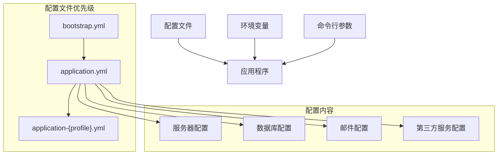

**Diagram sources**
- [application.yml](file://tudianersha/src/main/resources/application.yml)
- [KimiAIService.java](file://tudianersha/src/main/java/com/tudianersha/service/KimiAIService.java#L16)

**Section sources**
- [application.yml](file://tudianersha/src/main/resources/application.yml)
- [KimiAIService.java](file://tudianersha/src/main/java/com/tudianersha/service/KimiAIService.java#L16-L23)

## 组件依赖关系图谱

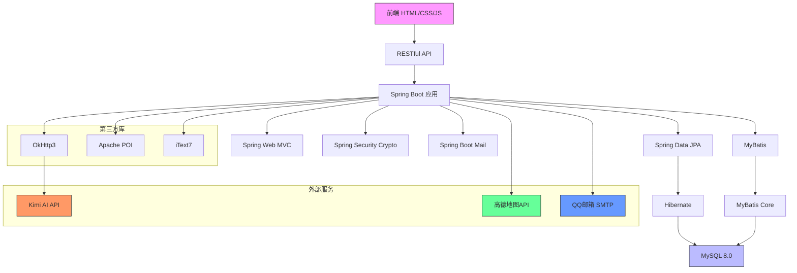

**Diagram sources**
- [pom.xml](file://tudianersha/pom.xml)
- [application.yml](file://tudianersha/src/main/resources/application.yml)
- [Application.java](file://tudianersha/src/main/java/com/tudianersha/Application.java)

**Section sources**
- [pom.xml](file://tudianersha/pom.xml)
- [application.yml](file://tudianersha/src/main/resources/application.yml)
- [Application.java](file://tudianersha/src/main/java/com/tudianersha/Application.java)