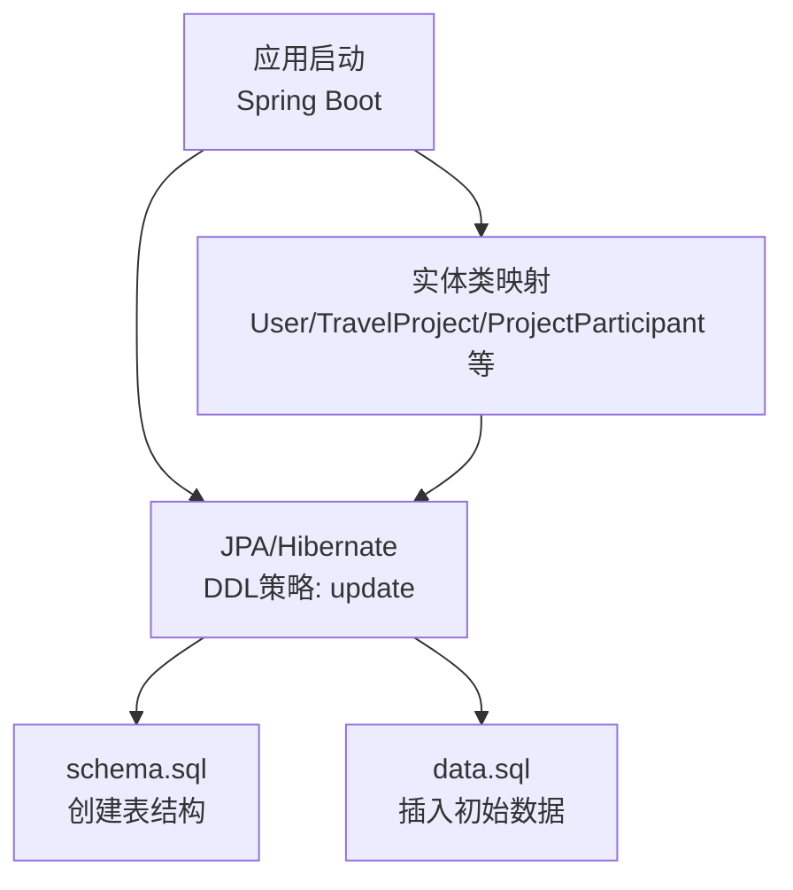
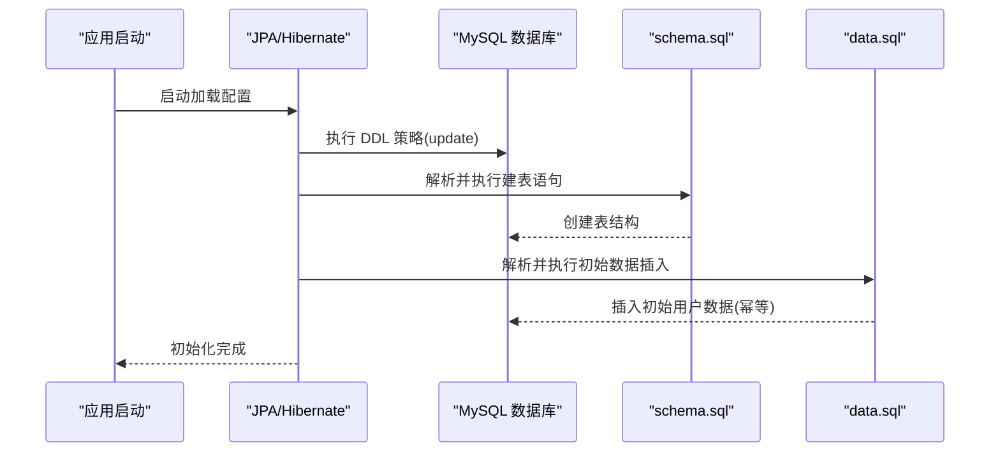
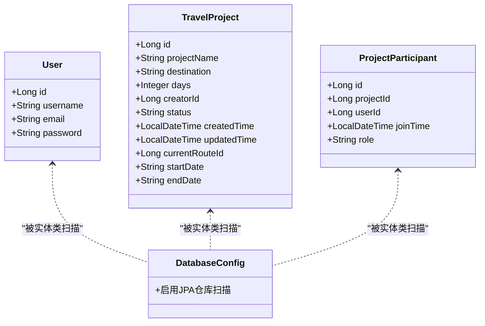

# SQL脚本说明

<cite>
**本文引用的文件**
- [schema.sql](file://tudianersha/src/main/resources/schema.sql)
- [data.sql](file://tudianersha/src/main/resources/data.sql)
- [application.yml](file://tudianersha/src/main/resources/application.yml)
- [User.java](file://tudianersha/src/main/java/com/tudianersha/entity/User.java)
- [TravelProject.java](file://tudianersha/src/main/java/com/tudianersha/entity/TravelProject.java)
- [ProjectParticipant.java](file://tudianersha/src/main/java/com/tudianersha/entity/ProjectParticipant.java)
- [DatabaseConfig.java](file://tudianersha/src/main/java/com/tudianersha/config/DatabaseConfig.java)
- [pom.xml](file://tudianersha/pom.xml)
- [database_migration.sql](file://tudianersha/database_migration.sql)
</cite>

## 目录
1. [简介](#简介)
2. [项目结构](#项目结构)
3. [核心组件](#核心组件)
4. [架构总览](#架构总览)
5. [详细组件分析](#详细组件分析)
6. [依赖分析](#依赖分析)
7. [性能考虑](#性能考虑)
8. [故障排查指南](#故障排查指南)
9. [结论](#结论)
10. [附录](#附录)

## 简介
本文件围绕数据库初始化脚本 schema.sql 与初始数据脚本 data.sql 的作用与内容进行系统化说明，重点解析：
- schema.sql 中各 CREATE TABLE 语句的建表意图、字段设计、主键策略与索引设计；
- data.sql 中 INSERT IGNORE 语句的使用目的与幂等性保障；
- 应用启动时脚本的执行顺序与 Spring Boot 自动执行机制；
- 在开发与测试环境中的重要性；
- 脚本维护最佳实践：新增表、结构变更与扩展初始数据的建议流程。

## 项目结构
本项目采用 Spring Boot + JPA + MySQL 技术栈，数据库初始化脚本位于资源目录下，配合 JPA 的 DDL 自动管理策略，实现数据库结构与初始数据的自动化准备。

图示来源
- [application.yml](file://tudianersha/src/main/resources/application.yml#L11-L16)
- [schema.sql](file://tudianersha/src/main/resources/schema.sql#L1-L123)
- [data.sql](file://tudianersha/src/main/resources/data.sql#L1-L7)
- [User.java](file://tudianersha/src/main/java/com/tudianersha/entity/User.java#L1-L73)
- [TravelProject.java](file://tudianersha/src/main/java/com/tudianersha/entity/TravelProject.java#L1-L163)
- [ProjectParticipant.java](file://tudianersha/src/main/java/com/tudianersha/entity/ProjectParticipant.java#L1-L87)

章节来源
- [application.yml](file://tudianersha/src/main/resources/application.yml#L1-L57)
- [pom.xml](file://tudianersha/pom.xml#L1-L180)

## 核心组件
- schema.sql：定义所有业务相关表的结构，包含主键自增策略、唯一约束、时间戳字段、外键关联字段等，确保表结构与实体类映射一致。
- data.sql：提供初始用户数据，使用 INSERT IGNORE 实现幂等插入，避免重复初始化导致失败。
- application.yml：配置数据源、JPA/Hibernate 的 DDL 策略（update），并设置 SQL 初始化模式为 never，强调通过 schema.sql/data.sql 与 JPA 协同完成初始化。

章节来源
- [schema.sql](file://tudianersha/src/main/resources/schema.sql#L1-L123)
- [data.sql](file://tudianersha/src/main/resources/data.sql#L1-L7)
- [application.yml](file://tudianersha/src/main/resources/application.yml#L11-L20)

## 架构总览
下图展示应用启动时数据库初始化的整体流程与组件交互：

图示来源
- [application.yml](file://tudianersha/src/main/resources/application.yml#L11-L16)
- [schema.sql](file://tudianersha/src/main/resources/schema.sql#L1-L123)
- [data.sql](file://tudianersha/src/main/resources/data.sql#L1-L7)

## 详细组件分析

### schema.sql 建表意图与设计要点
- users（用户表）
  - 主键：自增主键，与实体类注解一致。
  - 唯一约束：用户名与邮箱唯一，保证账号唯一性。
  - 字段：用户名、邮箱、密码，满足基础认证需求。
- project_participants（项目参与表）
  - 主键：自增主键。
  - 关联字段：project_id、user_id，用于标识项目与成员。
  - 时间与角色：join_time 记录加入时间，role 标识成员角色。
- travel_projects（行程项目表）
  - 主键：自增主键。
  - 业务字段：项目名、目的地、天数、创建者、状态、起止日期、当前路线ID等。
  - 时间戳：created_time、updated_time，便于审计与排序。
- travel_participants（行程参与者表）
  - 主键：自增主键。
  - 权限字段：permission，控制成员对行程的访问权限。
- budgets（预算表）
  - 主键：自增主键。
  - 金额字段：总预算、已用预算、剩余预算，使用高精度数值类型。
- ai_generated_routes（AI生成行程表）
  - 主键：自增主键。
  - 内容字段：route_content 文本存储，generated_time 记录生成时间。
  - 兴趣标签：interest_tags 存储兴趣偏好。
- overall_routes（总体路线图表）
  - 主键：自增主键。
  - 路线详情：route_details 文本存储，created_time 记录创建时间。
- activity_schedules（活动安排表）
  - 主键：自增主键。
  - 活动信息：活动名称、时间、地点、预算、天序号等。
- travel_sessions（行程会话表）
  - 主键：自增主键。
  - 消息内容：message 文本，message_time 记录时间，提及用户字段。
- requirement_parameters（需求参数表）
  - 主键：自增主键。
  - 参数：兴趣标签、日预算分配、心愿单、不喜欢列表、预算拆解等。
- shared_documents（分享文档表）
  - 主键：自增主键。
  - 文档元信息：URL、格式、生成时间、分享链接、创建者。
- chat_messages（聊天消息表）
  - 主键：自增主键。
  - 索引：idx_project_id、idx_created_time，优化按项目查询与时间排序。

章节来源
- [schema.sql](file://tudianersha/src/main/resources/schema.sql#L1-L123)
- [User.java](file://tudianersha/src/main/java/com/tudianersha/entity/User.java#L1-L73)
- [TravelProject.java](file://tudianersha/src/main/java/com/tudianersha/entity/TravelProject.java#L1-L163)
- [ProjectParticipant.java](file://tudianersha/src/main/java/com/tudianersha/entity/ProjectParticipant.java#L1-L87)

### data.sql 初始数据与幂等性
- 使用 INSERT IGNORE 对 users 表进行插入，避免重复执行导致的唯一键冲突。
- 提供 admin、user1、tsl、qjq、ysy 等初始用户，便于开发与测试快速登录验证。
- 幂等性保障：即使重复执行，也不会因唯一约束报错而中断初始化流程。

章节来源
- [data.sql](file://tudianersha/src/main/resources/data.sql#L1-L7)

### 应用启动执行顺序与 Spring Boot 自动化
- DDL 策略：JPA/Hibernate 的 ddl-auto 设置为 update，表示根据实体类与数据库差异自动更新结构。
- SQL 初始化模式：spring.sql.init.mode 设为 never，避免 Spring Boot 默认的 schema.sql/data.sql 自动执行，从而将初始化交由 JPA 控制。
- 实际执行路径：应用启动时，JPA 读取实体类映射，结合 schema.sql 的显式建表与 data.sql 的初始数据，完成数据库初始化；同时保持与实体类的一致性。

章节来源
- [application.yml](file://tudianersha/src/main/resources/application.yml#L11-L20)
- [DatabaseConfig.java](file://tudianersha/src/main/java/com/tudianersha/config/DatabaseConfig.java#L1-L10)

### 开发与测试环境的重要性
- 开发环境：确保开发者每次拉取代码后能快速获得一致的数据库结构与初始用户，降低环境搭建成本。
- 测试环境：稳定的初始数据有助于回归测试与集成测试的一致性，减少因数据不一致导致的测试波动。
- 生产环境：建议通过迁移脚本（见“脚本维护指南”）进行结构变更，避免直接修改 schema.sql/data.sql 导致不可控风险。

## 依赖分析
- 实体类与表结构映射
  - User → users
  - TravelProject → travel_projects
  - ProjectParticipant → project_participants
- JPA/Hibernate 与 schema.sql 的协作
  - 通过 ddl-auto=update 与实体类注解，确保表结构与实体类保持一致。
- 外部依赖
  - MySQL 连接驱动、JPA、MyBatis 等依赖在 pom.xml 中声明，支撑数据库访问与 ORM 能力。

图示来源
- [User.java](file://tudianersha/src/main/java/com/tudianersha/entity/User.java#L1-L73)
- [TravelProject.java](file://tudianersha/src/main/java/com/tudianersha/entity/TravelProject.java#L1-L163)
- [ProjectParticipant.java](file://tudianersha/src/main/java/com/tudianersha/entity/ProjectParticipant.java#L1-L87)
- [DatabaseConfig.java](file://tudianersha/src/main/java/com/tudianersha/config/DatabaseConfig.java#L1-L10)

章节来源
- [pom.xml](file://tudianersha/pom.xml#L1-L180)

## 性能考虑
- 索引设计
  - chat_messages 表对 project_id 与 created_time 建立普通索引，有利于按项目筛选与时间排序场景的查询性能。
- 字段类型选择
  - 金额使用高精度数值类型，避免浮点误差。
  - 时间字段使用 DATETIME 或 DATE，便于范围查询与排序。
- 幂等性与批量插入
  - data.sql 使用 INSERT IGNORE，避免重复插入带来的性能与错误开销。

章节来源
- [schema.sql](file://tudianersha/src/main/resources/schema.sql#L120-L123)
- [data.sql](file://tudianersha/src/main/resources/data.sql#L1-L7)

## 故障排查指南
- 初始化失败（唯一键冲突）
  - 现象：重复执行 data.sql 导致唯一键冲突。
  - 处理：确认使用 INSERT IGNORE，或在执行前清理目标数据。
- 表结构不一致
  - 现象：实体类与数据库结构不匹配。
  - 处理：检查 ddl-auto=update 是否生效，核对实体类注解与 schema.sql 定义是否一致。
- SQL 初始化被 Spring Boot 默认机制覆盖
  - 现象：schema.sql/data.sql 未按预期执行。
  - 处理：确认 spring.sql.init.mode=never，确保由 JPA 控制初始化流程。

章节来源
- [application.yml](file://tudianersha/src/main/resources/application.yml#L11-L20)
- [schema.sql](file://tudianersha/src/main/resources/schema.sql#L1-L123)
- [data.sql](file://tudianersha/src/main/resources/data.sql#L1-L7)

## 结论
schema.sql 与 data.sql 在本项目中承担了数据库结构与初始数据的“显式定义”职责，配合 JPA 的 DDL 策略与 Spring Boot 的配置，实现了可控、可重复、可维护的初始化流程。在开发与测试环境中，它们显著降低了环境搭建与数据准备的成本；在生产环境中，建议通过迁移脚本进行结构变更，确保演进过程的安全与可追溯。

## 附录

### 脚本维护指南
- 新增表
  - 在 schema.sql 中添加 CREATE TABLE 语句，并在对应实体类中补充注解与字段映射。
  - 若需初始数据，可在 data.sql 中追加 INSERT IGNORE 语句，确保幂等性。
- 修改现有结构
  - 建议使用迁移脚本（database_migration.sql）进行结构变更，避免直接修改 schema.sql，降低回滚与一致性风险。
  - 变更完成后，核对实体类注解与数据库结构的一致性。
- 扩展初始数据
  - 在 data.sql 中使用 INSERT IGNORE 添加新记录，避免重复执行导致的冲突。
  - 对于复杂数据（如多表关联），优先通过服务层逻辑初始化，必要时再考虑迁移脚本。

章节来源
- [database_migration.sql](file://tudianersha/database_migration.sql#L1-L15)
- [schema.sql](file://tudianersha/src/main/resources/schema.sql#L1-L123)
- [data.sql](file://tudianersha/src/main/resources/data.sql#L1-L7)