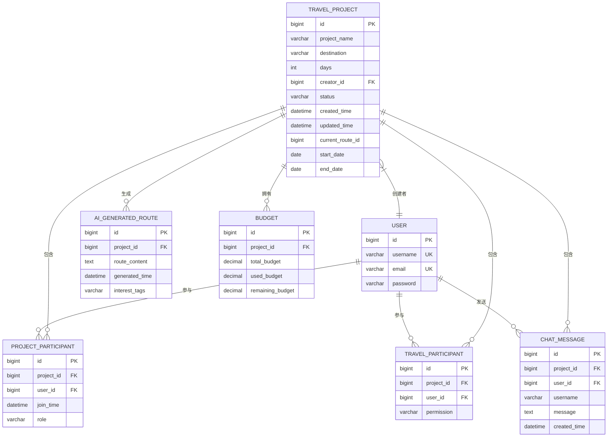
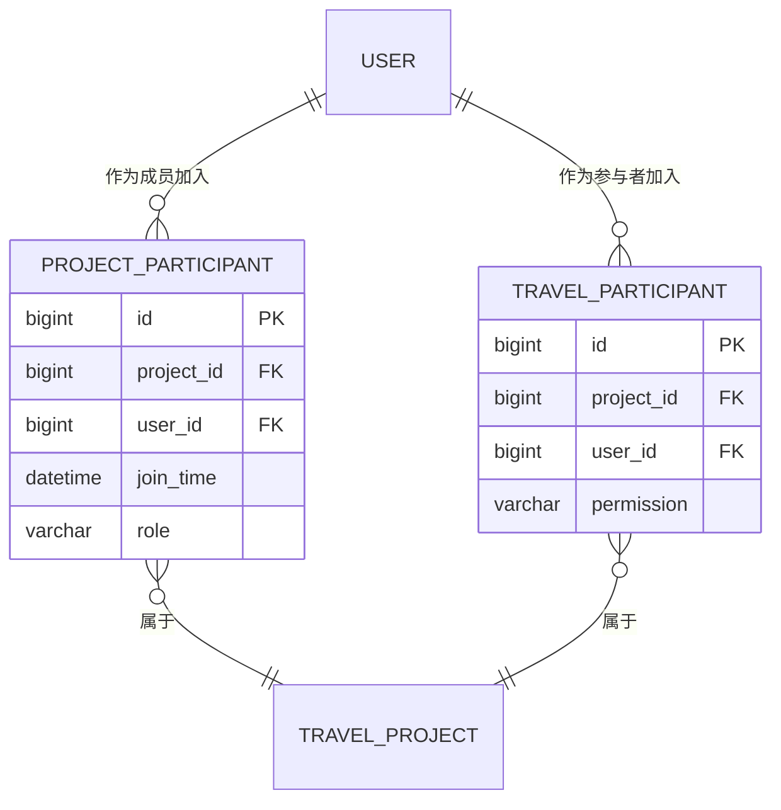
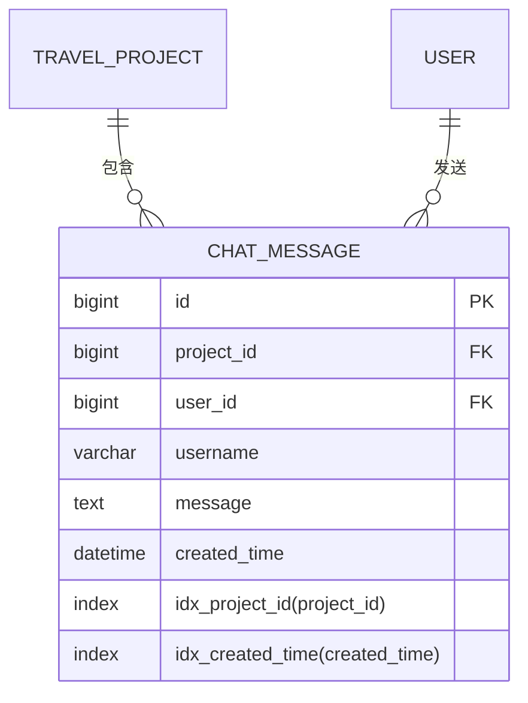

# 实体关系图

<cite>
**本文档中引用的文件**  
- [schema.sql](file://tudianersha/src/main/resources/schema.sql)
- [TravelProject.java](file://tudianersha/src/main/java/com/tudianersha/entity/TravelProject.java)
- [User.java](file://tudianersha/src/main/java/com/tudianersha/entity/User.java)
- [ChatMessage.java](file://tudianersha/src/main/java/com/tudianersha/entity/ChatMessage.java)
- [AiGeneratedRoute.java](file://tudianersha/src/main/java/com/tudianersha/entity/AiGeneratedRoute.java)
- [Budget.java](file://tudianersha/src/main/java/com/tudianersha/entity/Budget.java)
- [ProjectParticipant.java](file://tudianersha/src/main/java/com/tudianersha/entity/ProjectParticipant.java)
- [TravelParticipant.java](file://tudianersha/src/main/java/com/tudianersha/entity/TravelParticipant.java)
- [ChatMessageRepository.java](file://tudianersha/src/main/java/com/tudianersha/repository/ChatMessageRepository.java)
</cite>

## 目录
1. [引言](#引言)
2. [核心实体关系图](#核心实体关系图)
3. [多对多关系详解](#多对多关系详解)
4. [聚合关系与索引优化](#聚合关系与索引优化)
5. [外键与级联规则](#外键与级联规则)
6. [关系设计对核心功能的支持](#关系设计对核心功能的支持)

## 引言
本文档旨在详细解释途点儿啥平台的实体关系模型，基于数据库schema.sql文件和JPA实体类的注解，全面展示核心实体之间的关联方式。重点分析TravelProject与User之间的双向多对多关系，以及ChatMessage与TravelProject、User之间的聚合关系。同时说明索引设计如何优化查询性能，并解释这些关系设计如何支持项目协作、消息通知和权限控制等核心功能。

## 核心实体关系图

**图示来源**
- [schema.sql](file://tudianersha/src/main/resources/schema.sql#L4-L123)
- [TravelProject.java](file://tudianersha/src/main/java/com/tudianersha/entity/TravelProject.java#L6-L163)
- [User.java](file://tudianersha/src/main/java/com/tudianersha/entity/User.java#L5-L73)
- [ChatMessage.java](file://tudianersha/src/main/java/com/tudianersha/entity/ChatMessage.java#L6-L90)
- [AiGeneratedRoute.java](file://tudianersha/src/main/java/com/tudianersha/entity/AiGeneratedRoute.java#L6-L193)
- [Budget.java](file://tudianersha/src/main/java/com/tudianersha/entity/Budget.java#L6-L87)

## 多对多关系详解

系统中TravelProject与User之间通过project_participants和travel_participants两个关联表建立了双向多对多关系。这种设计允许一个用户参与多个旅行项目，同时一个旅行项目也可以有多个参与者。

在project_participants表中，除了project_id和user_id外键外，还包含了join_time（加入时间）和role（角色）字段，用于记录用户加入项目的时间和在项目中的角色（如创建者、编辑者、查看者）。这为权限控制提供了基础数据。

在travel_participants表中，除了project_id和user_id外键外，还包含了permission（权限）字段，用于更细粒度地控制用户在项目中的操作权限。

**图示来源**
- [schema.sql](file://tudianersha/src/main/resources/schema.sql#L11-L18)
- [schema.sql](file://tudianersha/src/main/resources/schema.sql#L35-L41)
- [ProjectParticipant.java](file://tudianersha/src/main/java/com/tudianersha/entity/ProjectParticipant.java#L6-L87)
- [TravelParticipant.java](file://tudianersha/src/main/java/com/tudianersha/entity/TravelParticipant.java#L5-L73)

## 聚合关系与索引优化

ChatMessage实体与TravelProject和User之间存在聚合关系。每条聊天消息都属于一个特定的旅行项目，并由特定用户发送。这种设计体现了消息与项目、用户的紧密关联。

在chat_messages表上创建了两个索引：idx_project_id和idx_created_time。其中idx_project_id索引特别重要，因为它优化了基于项目的消息查询性能。当用户进入某个旅行项目的协作页面时，系统需要快速检索该项目的所有聊天消息，这个索引使得查询效率大大提高。

**图示来源**
- [schema.sql](file://tudianersha/src/main/resources/schema.sql#L113-L123)
- [ChatMessage.java](file://tudianersha/src/main/java/com/tudianersha/entity/ChatMessage.java#L7-L90)
- [ChatMessageRepository.java](file://tudianersha/src/main/java/com/tudianersha/repository/ChatMessageRepository.java#L9-L16)

## 外键与级联规则

系统中的外键设计遵循了严格的引用完整性原则。所有与TravelProject相关的实体（如AiGeneratedRoute、Budget、ChatMessage等）都通过project_id外键与TravelProject建立关联。同样，所有与User相关的实体都通过user_id外键与User建立关联。

虽然在当前的JPA实体定义中没有显式声明级联操作，但外键约束确保了数据的一致性。例如，当删除一个TravelProject时，相关的ChatMessage、Budget等记录需要先被处理或删除，以避免引用完整性冲突。

核心外键关系包括：
- AiGeneratedRoute.project_id → TravelProject.id
- Budget.project_id → TravelProject.id  
- ChatMessage.project_id → TravelProject.id
- ProjectParticipant.project_id → TravelProject.id
- TravelParticipant.project_id → TravelProject.id
- ChatMessage.user_id → User.id
- ProjectParticipant.user_id → User.id
- TravelParticipant.user_id → User.id

**图示来源**
- [schema.sql](file://tudianersha/src/main/resources/schema.sql#L53-L123)
- [TravelProject.java](file://tudianersha/src/main/java/com/tudianersha/entity/TravelProject.java#L21-L36)
- [User.java](file://tudianersha/src/main/java/com/tudianersha/entity/User.java#L13-L20)

## 关系设计对核心功能的支持

实体关系设计直接支持了系统的三大核心功能：

1. **项目协作**：通过project_participants和travel_participants表，系统能够精确管理每个项目中的参与者及其角色和权限，支持团队协作。

2. **消息通知**：chat_messages表与travel_projects表的关联使得系统能够按项目组织聊天记录，支持项目内的实时沟通和消息通知功能。

3. **权限控制**：role和permission字段的设计为不同级别的权限控制提供了数据基础，确保只有授权用户才能执行特定操作。

此外，AiGeneratedRoute与TravelProject的关联支持AI生成行程功能，Budget与TravelProject的关联支持预算管理功能，这些关系共同构成了系统完整的业务逻辑基础。

**图示来源**
- [TravelProject.java](file://tudianersha/src/main/java/com/tudianersha/entity/TravelProject.java#L6-L163)
- [ProjectParticipant.java](file://tudianersha/src/main/java/com/tudianersha/entity/ProjectParticipant.java#L6-L87)
- [TravelParticipant.java](file://tudianersha/src/main/java/com/tudianersha/entity/TravelParticipant.java#L5-L73)
- [ChatMessage.java](file://tudianersha/src/main/java/com/tudianersha/entity/ChatMessage.java#L6-L90)