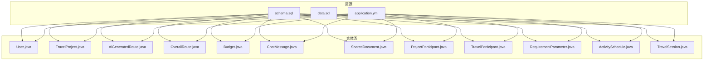
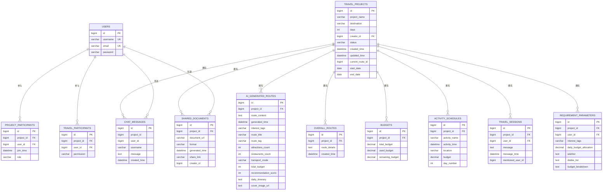
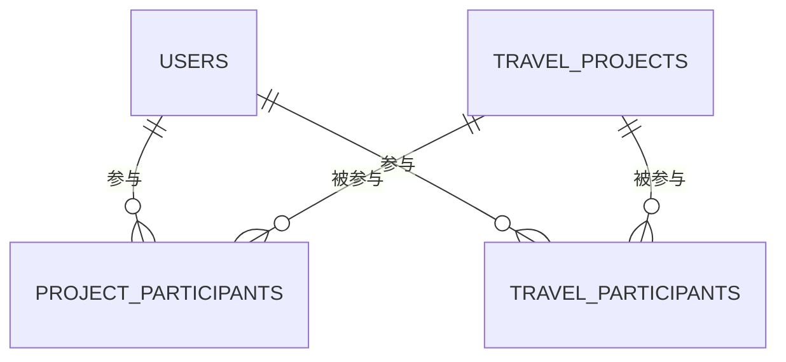
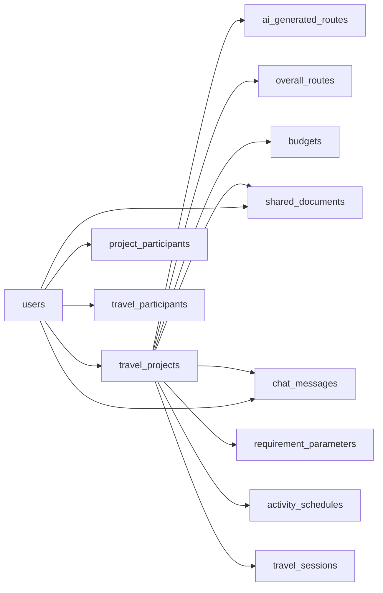

# 数据库设计

<cite>
**本文引用的文件**
- [schema.sql](file://tudianersha/src/main/resources/schema.sql)
- [data.sql](file://tudianersha/src/main/resources/data.sql)
- [application.yml](file://tudianersha/src/main/resources/application.yml)
- [User.java](file://tudianersha/src/main/java/com/tudianersha/entity/User.java)
- [TravelProject.java](file://tudianersha/src/main/java/com/tudianersha/entity/TravelProject.java)
- [AiGeneratedRoute.java](file://tudianersha/src/main/java/com/tudianersha/entity/AiGeneratedRoute.java)
- [OverallRoute.java](file://tudianersha/src/main/java/com/tudianersha/entity/OverallRoute.java)
- [Budget.java](file://tudianersha/src/main/java/com/tudianersha/entity/Budget.java)
- [ChatMessage.java](file://tudianersha/src/main/java/com/tudianersha/entity/ChatMessage.java)
- [SharedDocument.java](file://tudianersha/src/main/java/com/tudianersha/entity/SharedDocument.java)
- [ProjectParticipant.java](file://tudianersha/src/main/java/com/tudianersha/entity/ProjectParticipant.java)
- [TravelParticipant.java](file://tudianersha/src/main/java/com/tudianersha/entity/TravelParticipant.java)
- [RequirementParameter.java](file://tudianersha/src/main/java/com/tudianersha/entity/RequirementParameter.java)
- [ActivitySchedule.java](file://tudianersha/src/main/java/com/tudianersha/entity/ActivitySchedule.java)
- [TravelSession.java](file://tudianersha/src/main/java/com/tudianersha/entity/TravelSession.java)
</cite>

## 目录
1. [简介](#简介)
2. [项目结构](#项目结构)
3. [核心组件](#核心组件)
4. [架构总览](#架构总览)
5. [详细组件分析](#详细组件分析)
6. [依赖分析](#依赖分析)
7. [性能考虑](#性能考虑)
8. [故障排查指南](#故障排查指南)
9. [结论](#结论)
10. [附录](#附录)

## 简介
本文件系统性梳理数据库模式设计，基于 schema.sql 定义的表结构，逐项说明字段、数据类型、主外键关系与约束，并重点解析 TravelProject、User、AiGeneratedRoute、OverallRoute、Budget、ChatMessage、SharedDocument 等核心表。同时结合 data.sql 的初始数据，说明系统预置状态；并总结 JPA 实体类与数据库表的映射规则（@Entity、@Table、@Id 等），最后提供数据字典，覆盖字段含义、示例值与业务规则。

## 项目结构
数据库初始化脚本位于 resources 目录，JPA 实体类位于 entity 包，应用通过 application.yml 连接 MySQL 并启用 Hibernate 自动建模（ddl-auto: update）。

**图表来源**
- [schema.sql](file://tudianersha/src/main/resources/schema.sql#L1-L123)
- [application.yml](file://tudianersha/src/main/resources/application.yml#L1-L57)
- [User.java](file://tudianersha/src/main/java/com/tudianersha/entity/User.java#L1-L73)
- [TravelProject.java](file://tudianersha/src/main/java/com/tudianersha/entity/TravelProject.java#L1-L163)
- [AiGeneratedRoute.java](file://tudianersha/src/main/java/com/tudianersha/entity/AiGeneratedRoute.java#L1-L193)
- [OverallRoute.java](file://tudianersha/src/main/java/com/tudianersha/entity/OverallRoute.java#L1-L74)
- [Budget.java](file://tudianersha/src/main/java/com/tudianersha/entity/Budget.java#L1-L87)
- [ChatMessage.java](file://tudianersha/src/main/java/com/tudianersha/entity/ChatMessage.java#L1-L90)
- [SharedDocument.java](file://tudianersha/src/main/java/com/tudianersha/entity/SharedDocument.java#L1-L114)
- [ProjectParticipant.java](file://tudianersha/src/main/java/com/tudianersha/entity/ProjectParticipant.java#L1-L87)
- [TravelParticipant.java](file://tudianersha/src/main/java/com/tudianersha/entity/TravelParticipant.java#L1-L73)
- [RequirementParameter.java](file://tudianersha/src/main/java/com/tudianersha/entity/RequirementParameter.java#L1-L123)
- [ActivitySchedule.java](file://tudianersha/src/main/java/com/tudianersha/entity/ActivitySchedule.java#L1-L115)
- [TravelSession.java](file://tudianersha/src/main/java/com/tudianersha/entity/TravelSession.java#L1-L100)

**章节来源**
- [schema.sql](file://tudianersha/src/main/resources/schema.sql#L1-L123)
- [application.yml](file://tudianersha/src/main/resources/application.yml#L1-L57)

## 核心组件
本节聚焦核心表结构与用途：
- 用户表 users：存储用户基本信息，唯一用户名与邮箱。
- 行程项目表 travel_projects：项目元数据、状态、时间范围与当前方案引用。
- AI生成路线表 ai_generated_routes：AI生成的路线内容、标签、封面、每日行程等扩展字段。
- 总体路线表 overall_routes：项目总体路线详情与创建时间。
- 预算表 budgets：项目总预算、已用预算、剩余预算。
- 聊天消息表 chat_messages：项目级聊天消息，含索引优化。
- 分享文档表 shared_documents：生成的分享链接、文档URL、格式与创建者。

**章节来源**
- [schema.sql](file://tudianersha/src/main/resources/schema.sql#L1-L123)
- [User.java](file://tudianersha/src/main/java/com/tudianersha/entity/User.java#L1-L73)
- [TravelProject.java](file://tudianersha/src/main/java/com/tudianersha/entity/TravelProject.java#L1-L163)
- [AiGeneratedRoute.java](file://tudianersha/src/main/java/com/tudianersha/entity/AiGeneratedRoute.java#L1-L193)
- [OverallRoute.java](file://tudianersha/src/main/java/com/tudianersha/entity/OverallRoute.java#L1-L74)
- [Budget.java](file://tudianersha/src/main/java/com/tudianersha/entity/Budget.java#L1-L87)
- [ChatMessage.java](file://tudianersha/src/main/java/com/tudianersha/entity/ChatMessage.java#L1-L90)
- [SharedDocument.java](file://tudianersha/src/main/java/com/tudianersha/entity/SharedDocument.java#L1-L114)

## 架构总览
下图展示核心表之间的实体关系，包括一对多与多对多（通过中间表实现）。

**图表来源**
- [schema.sql](file://tudianersha/src/main/resources/schema.sql#L1-L123)
- [User.java](file://tudianersha/src/main/java/com/tudianersha/entity/User.java#L1-L73)
- [TravelProject.java](file://tudianersha/src/main/java/com/tudianersha/entity/TravelProject.java#L1-L163)
- [AiGeneratedRoute.java](file://tudianersha/src/main/java/com/tudianersha/entity/AiGeneratedRoute.java#L1-L193)
- [OverallRoute.java](file://tudianersha/src/main/java/com/tudianersha/entity/OverallRoute.java#L1-L74)
- [Budget.java](file://tudianersha/src/main/java/com/tudianersha/entity/Budget.java#L1-L87)
- [ChatMessage.java](file://tudianersha/src/main/java/com/tudianersha/entity/ChatMessage.java#L1-L90)
- [SharedDocument.java](file://tudianersha/src/main/java/com/tudianersha/entity/SharedDocument.java#L1-L114)
- [ProjectParticipant.java](file://tudianersha/src/main/java/com/tudianersha/entity/ProjectParticipant.java#L1-L87)
- [TravelParticipant.java](file://tudianersha/src/main/java/com/tudianersha/entity/TravelParticipant.java#L1-L73)
- [RequirementParameter.java](file://tudianersha/src/main/java/com/tudianersha/entity/RequirementParameter.java#L1-L123)
- [ActivitySchedule.java](file://tudianersha/src/main/java/com/tudianersha/entity/ActivitySchedule.java#L1-L115)
- [TravelSession.java](file://tudianersha/src/main/java/com/tudianersha/entity/TravelSession.java#L1-L100)

## 详细组件分析

### 用户表 users
- 字段与类型
  - id：自增主键
  - username：非空，唯一
  - email：非空，唯一
  - password：非空
- 约束与索引
  - 主键：id
  - 唯一索引：username、email
- 用途
  - 存储系统用户身份信息，作为项目参与者与聊天消息的来源。

**章节来源**
- [schema.sql](file://tudianersha/src/main/resources/schema.sql#L1-L123)
- [User.java](file://tudianersha/src/main/java/com/tudianersha/entity/User.java#L1-L73)

### 行程项目表 travel_projects
- 字段与类型
  - id：自增主键
  - project_name：非空
  - destination：非空
  - days：非空
  - creator_id：非空（外键指向 users）
  - status：非空（草稿/规划中/已归档）
  - created_time、updated_time：非空
  - current_route_id：可选（引用 ai_generated_routes）
  - start_date、end_date：可选
- 约束与索引
  - 主键：id
  - 外键：creator_id -> users(id)
  - 可选外键：current_route_id -> ai_generated_routes(id)
- 用途
  - 记录旅行项目的元数据与生命周期状态，支持跨模块引用。

**章节来源**
- [schema.sql](file://tudianersha/src/main/resources/schema.sql#L1-L123)
- [TravelProject.java](file://tudianersha/src/main/java/com/tudianersha/entity/TravelProject.java#L1-L163)

### AI生成路线表 ai_generated_routes
- 字段与类型
  - id：自增主键
  - project_id：非空（外键指向 travel_projects）
  - route_content：文本
  - generated_time：非空
  - interest_tags：兴趣标签
  - route_title、route_tag、transport_mode：扩展字段
  - attractions_count、restaurants_count、total_budget、recommendation_score：统计与评分
  - daily_itinerary、cover_image_url：结构化与媒体
- 约束与索引
  - 主键：id
  - 外键：project_id -> travel_projects(id)
- 用途
  - 存储AI生成的完整路线方案及其统计信息，供项目选择与展示。

**章节来源**
- [schema.sql](file://tudianersha/src/main/resources/schema.sql#L1-L123)
- [AiGeneratedRoute.java](file://tudianersha/src/main/java/com/tudianersha/entity/AiGeneratedRoute.java#L1-L193)

### 总体路线表 overall_routes
- 字段与类型
  - id：自增主键
  - project_id：非空（外键）
  - route_details：文本
  - created_time：非空
- 约束与索引
  - 主键：id
  - 外键：project_id -> travel_projects(id)
- 用途
  - 记录项目总体路线详情与创建时间，便于版本管理与回溯。

**章节来源**
- [schema.sql](file://tudianersha/src/main/resources/schema.sql#L1-L123)
- [OverallRoute.java](file://tudianersha/src/main/java/com/tudianersha/entity/OverallRoute.java#L1-L74)

### 预算表 budgets
- 字段与类型
  - id：自增主键
  - project_id：非空（外键）
  - total_budget、used_budget、remaining_budget：金额型
- 约束与索引
  - 主键：id
  - 外键：project_id -> travel_projects(id)
- 用途
  - 统计项目预算使用情况，支持财务控制。

**章节来源**
- [schema.sql](file://tudianersha/src/main/resources/schema.sql#L1-L123)
- [Budget.java](file://tudianersha/src/main/java/com/tudianersha/entity/Budget.java#L1-L87)

### 聊天消息表 chat_messages
- 字段与类型
  - id：自增主键
  - project_id：非空
  - user_id：非空
  - username：可选
  - message：文本
  - created_time：可选
- 索引
  - idx_project_id(project_id)
  - idx_created_time(created_time)
- 用途
  - 支持按项目检索聊天历史与按时间排序。

**章节来源**
- [schema.sql](file://tudianersha/src/main/resources/schema.sql#L1-L123)
- [ChatMessage.java](file://tudianersha/src/main/java/com/tudianersha/entity/ChatMessage.java#L1-L90)

### 分享文档表 shared_documents
- 字段与类型
  - id：自增主键
  - project_id：非空（外键）
  - document_url、share_link：字符串
  - format：格式（PDF等）
  - generated_time：非空
  - creator_id：非空（外键）
- 约束与索引
  - 主键：id
  - 外键：project_id -> travel_projects(id)，creator_id -> users(id)
- 用途
  - 记录生成的分享文档与访问链接，便于协作与导出。

**章节来源**
- [schema.sql](file://tudianersha/src/main/resources/schema.sql#L1-L123)
- [SharedDocument.java](file://tudianersha/src/main/java/com/tudianersha/entity/SharedDocument.java#L1-L114)

### 中间表与多对多关系
- 项目参与表 project_participants：users 与 travel_projects 的多对多（角色维度）
- 行程参与者表 travel_participants：users 与 travel_projects 的多对多（权限维度）

**图表来源**
- [schema.sql](file://tudianersha/src/main/resources/schema.sql#L1-L123)
- [ProjectParticipant.java](file://tudianersha/src/main/java/com/tudianersha/entity/ProjectParticipant.java#L1-L87)
- [TravelParticipant.java](file://tudianersha/src/main/java/com/tudianersha/entity/TravelParticipant.java#L1-L73)

**章节来源**
- [schema.sql](file://tudianersha/src/main/resources/schema.sql#L1-L123)
- [ProjectParticipant.java](file://tudianersha/src/main/java/com/tudianersha/entity/ProjectParticipant.java#L1-L87)
- [TravelParticipant.java](file://tudianersha/src/main/java/com/tudianersha/entity/TravelParticipant.java#L1-L73)

### 其他支撑表
- 需求参数表 requirement_parameters：记录用户的兴趣标签、预算分配、心愿单等个性化需求。
- 活动安排表 activity_schedules：记录每日活动名称、时间、地点、预算与天序。
- 行程会话表 travel_sessions：用于项目内讨论与@提醒。

**章节来源**
- [schema.sql](file://tudianersha/src/main/resources/schema.sql#L1-L123)
- [RequirementParameter.java](file://tudianersha/src/main/java/com/tudianersha/entity/RequirementParameter.java#L1-L123)
- [ActivitySchedule.java](file://tudianersha/src/main/java/com/tudianersha/entity/ActivitySchedule.java#L1-L115)
- [TravelSession.java](file://tudianersha/src/main/java/com/tudianersha/entity/TravelSession.java#L1-L100)

## 依赖分析
- 外键依赖链
  - travel_projects.creator_id -> users(id)
  - ai_generated_routes.project_id -> travel_projects(id)
  - overall_routes.project_id -> travel_projects(id)
  - budgets.project_id -> travel_projects(id)
  - shared_documents.project_id -> travel_projects(id)
  - shared_documents.creator_id -> users(id)
  - chat_messages.project_id -> travel_projects(id)
  - chat_messages.user_id -> users(id)
  - project_participants.project_id -> travel_projects(id)
  - project_participants.user_id -> users(id)
  - travel_participants.project_id -> travel_projects(id)
  - travel_participants.user_id -> users(id)
  - requirement_parameters.project_id -> travel_projects(id)
  - requirement_parameters.user_id -> users(id)
  - activity_schedules.project_id -> travel_projects(id)
  - travel_sessions.project_id -> travel_projects(id)
  - travel_sessions.user_id -> users(id)
- 索引影响
  - chat_messages.idx_project_id：加速按项目筛选聊天记录
  - chat_messages.idx_created_time：加速按时间倒序查询
  - users.username、users.email：保证唯一性与快速查找

**图表来源**
- [schema.sql](file://tudianersha/src/main/resources/schema.sql#L1-L123)

**章节来源**
- [schema.sql](file://tudianersha/src/main/resources/schema.sql#L1-L123)

## 性能考虑
- 索引策略
  - chat_messages.idx_project_id：按项目聚合查询（如获取某项目聊天历史）将受益于该索引。
  - chat_messages.idx_created_time：按时间排序或分页查询将受益于该索引。
- 查询建议
  - 优先使用复合条件过滤（如 project_id + created_time）以提升命中率。
  - 对频繁排序的列建立索引，避免全表扫描。
- 数据类型
  - DECIMAL(10,2) 用于预算字段，确保精度与一致性。
  - TEXT 类型用于大文本字段（如路线详情、消息内容），注意存储与检索成本。

[本节为通用性能指导，不直接分析具体文件]

## 故障排查指南
- 数据库连接问题
  - 检查 application.yml 中的数据库 URL、用户名、密码是否正确。
  - 确认 MySQL 服务运行正常且端口可达。
- DDL 自动更新
  - application.yml 设置了 ddl-auto: update，若表结构变更未生效，请确认 Hibernate 是否成功执行更新。
- 初始数据加载
  - data.sql 使用 INSERT IGNORE，若重复插入失败，需检查唯一约束冲突（如用户名、邮箱）。

**章节来源**
- [application.yml](file://tudianersha/src/main/resources/application.yml#L1-L57)
- [data.sql](file://tudianersha/src/main/resources/data.sql#L1-L7)

## 结论
该数据库设计围绕“旅行项目”主线，采用清晰的一对多关系与必要的中间表实现多对多协作。核心表覆盖用户、项目、路线、预算、聊天与文档等关键领域，配合索引与数据类型设计，满足查询效率与业务准确性。JPA 实体类与表名一一对应，注解明确映射关系，便于 ORM 管理。

[本节为总结性内容，不直接分析具体文件]

## 附录

### 数据字典（字段说明、示例值、业务规则）
- users
  - id：bigint，主键，示例：1
  - username：varchar(50)，唯一，示例：admin
  - email：varchar(100)，唯一，示例：admin@example.com
  - password：varchar(100)，示例：admin123
  - 业务规则：用户名与邮箱必须唯一，不可为空
- travel_projects
  - id：bigint，主键，示例：1001
  - project_name：varchar(100)，示例：北京五日游
  - destination：varchar(100)，示例：北京
  - days：int，示例：5
  - creator_id：bigint，外键 users(id)，示例：1
  - status：varchar(20)，示例：规划中
  - created_time/updated_time：datetime，示例：2025-01-01 12:00:00
  - current_route_id：bigint，可选，示例：2001
  - start_date/end_date：date，示例：2025-01-01/2025-01-05
  - 业务规则：creator_id 必须存在；current_route_id 引用 ai_generated_routes
- ai_generated_routes
  - id：bigint，主键，示例：2001
  - project_id：bigint，外键 travel_projects(id)，示例：1001
  - route_content：text，示例：路线详情
  - generated_time：datetime，示例：2025-01-01 13:00:00
  - interest_tags：varchar(200)，示例：自然风光,美食
  - route_title/route_tag/transport_mode：示例：经典路线,特色标签,自驾
  - attractions_count/restaurants_count：示例：10/8
  - total_budget/recommendation_score：示例：3000/95
  - daily_itinerary/cover_image_url：示例：每日行程JSON/多图URL
  - 业务规则：project_id 必须存在
- overall_routes
  - id：bigint，主键，示例：3001
  - project_id：bigint，外键，示例：1001
  - route_details：text，示例：总体路线
  - created_time：datetime，示例：2025-01-01 14:00:00
  - 业务规则：project_id 必须存在
- budgets
  - id：bigint，主键，示例：4001
  - project_id：bigint，外键，示例：1001
  - total_budget/used_budget/remaining_budget：decimal(10,2)，示例：5000.00/3200.00/1800.00
  - 业务规则：三者应满足 total = used + remaining
- chat_messages
  - id：bigint，主键，示例：5001
  - project_id：bigint，示例：1001
  - user_id：bigint，示例：1
  - username：varchar(50)，示例：admin
  - message：text，示例：大家好
  - created_time：datetime，示例：2025-01-01 15:00:00
  - 业务规则：按项目聚合查询常用；按时间排序常用
- shared_documents
  - id：bigint，主键，示例：6001
  - project_id：bigint，外键，示例：1001
  - document_url/share_link：varchar(200)，示例：/doc/xxx.pdf
  - format：varchar(20)，示例：PDF
  - generated_time：datetime，示例：2025-01-01 16:00:00
  - creator_id：bigint，外键 users(id)，示例：1
  - 业务规则：creator_id 必须存在
- project_participants
  - id：bigint，主键，示例：7001
  - project_id：bigint，外键，示例：1001
  - user_id：bigint，外键，示例：2
  - join_time：datetime，示例：2025-01-01 10:00:00
  - role：varchar(20)，示例：编辑者
  - 业务规则：多对多协作，角色区分权限
- travel_participants
  - id：bigint，主键，示例：8001
  - project_id：bigint，外键，示例：1001
  - user_id：bigint，外键，示例：3
  - permission：varchar(20)，示例：查看者
  - 业务规则：多对多协作，权限区分操作范围
- requirement_parameters
  - id：bigint，主键，示例：9001
  - project_id/user_id：bigint，外键，示例：1001/1
  - interest_tags：varchar(200)，示例：历史,美食
  - daily_budget_allocation：decimal(10,2)，示例：1000.00
  - wishlist/dislike_list/budget_breakdown：text，示例：必去/不喜欢/明细
  - 业务规则：个性化需求，支持预算拆分
- activity_schedules
  - id：bigint，主键，示例：10001
  - project_id：bigint，外键，示例：1001
  - activity_name：varchar(100)，示例：故宫
  - activity_time：datetime，示例：2025-01-01 09:00:00
  - location：varchar(100)，示例：北京市
  - budget：decimal(10,2)，示例：120.00
  - day_number：int，示例：1
  - 业务规则：按天序组织行程
- travel_sessions
  - id：bigint，主键，示例：11001
  - project_id：bigint，外键，示例：1001
  - user_id：bigint，外键，示例：1
  - message：text，示例：@user1 请确认
  - message_time：datetime，示例：2025-01-01 17:00:00
  - mentioned_user_id：bigint，示例：2
  - 业务规则：支持@提醒与讨论

**章节来源**
- [schema.sql](file://tudianersha/src/main/resources/schema.sql#L1-L123)
- [User.java](file://tudianersha/src/main/java/com/tudianersha/entity/User.java#L1-L73)
- [TravelProject.java](file://tudianersha/src/main/java/com/tudianersha/entity/TravelProject.java#L1-L163)
- [AiGeneratedRoute.java](file://tudianersha/src/main/java/com/tudianersha/entity/AiGeneratedRoute.java#L1-L193)
- [OverallRoute.java](file://tudianersha/src/main/java/com/tudianersha/entity/OverallRoute.java#L1-L74)
- [Budget.java](file://tudianersha/src/main/java/com/tudianersha/entity/Budget.java#L1-L87)
- [ChatMessage.java](file://tudianersha/src/main/java/com/tudianersha/entity/ChatMessage.java#L1-L90)
- [SharedDocument.java](file://tudianersha/src/main/java/com/tudianersha/entity/SharedDocument.java#L1-L114)
- [ProjectParticipant.java](file://tudianersha/src/main/java/com/tudianersha/entity/ProjectParticipant.java#L1-L87)
- [TravelParticipant.java](file://tudianersha/src/main/java/com/tudianersha/entity/TravelParticipant.java#L1-L73)
- [RequirementParameter.java](file://tudianersha/src/main/java/com/tudianersha/entity/RequirementParameter.java#L1-L123)
- [ActivitySchedule.java](file://tudianersha/src/main/java/com/tudianersha/entity/ActivitySchedule.java#L1-L115)
- [TravelSession.java](file://tudianersha/src/main/java/com/tudianersha/entity/TravelSession.java#L1-L100)

### JPA 实体类与数据库表映射规则
- 注解要点
  - @Entity：声明实体
  - @Table(name = "...")：指定表名
  - @Id + @GeneratedValue(strategy = GenerationType.IDENTITY)：主键自增
  - @Column：映射字段，nullable、precision/scale、columnDefinition 等
- 映射示例（以核心表为例）
  - User -> users
  - TravelProject -> travel_projects
  - AiGeneratedRoute -> ai_generated_routes
  - OverallRoute -> overall_routes
  - Budget -> budgets
  - ChatMessage -> chat_messages
  - SharedDocument -> shared_documents
  - ProjectParticipant -> project_participants
  - TravelParticipant -> travel_participants
  - RequirementParameter -> requirement_parameters
  - ActivitySchedule -> activity_schedules
  - TravelSession -> travel_sessions

**章节来源**
- [User.java](file://tudianersha/src/main/java/com/tudianersha/entity/User.java#L1-L73)
- [TravelProject.java](file://tudianersha/src/main/java/com/tudianersha/entity/TravelProject.java#L1-L163)
- [AiGeneratedRoute.java](file://tudianersha/src/main/java/com/tudianersha/entity/AiGeneratedRoute.java#L1-L193)
- [OverallRoute.java](file://tudianersha/src/main/java/com/tudianersha/entity/OverallRoute.java#L1-L74)
- [Budget.java](file://tudianersha/src/main/java/com/tudianersha/entity/Budget.java#L1-L87)
- [ChatMessage.java](file://tudianersha/src/main/java/com/tudianersha/entity/ChatMessage.java#L1-L90)
- [SharedDocument.java](file://tudianersha/src/main/java/com/tudianersha/entity/SharedDocument.java#L1-L114)
- [ProjectParticipant.java](file://tudianersha/src/main/java/com/tudianersha/entity/ProjectParticipant.java#L1-L87)
- [TravelParticipant.java](file://tudianersha/src/main/java/com/tudianersha/entity/TravelParticipant.java#L1-L73)
- [RequirementParameter.java](file://tudianersha/src/main/java/com/tudianersha/entity/RequirementParameter.java#L1-L123)
- [ActivitySchedule.java](file://tudianersha/src/main/java/com/tudianersha/entity/ActivitySchedule.java#L1-L115)
- [TravelSession.java](file://tudianersha/src/main/java/com/tudianersha/entity/TravelSession.java#L1-L100)

### 系统预置状态（基于 data.sql）
- users 表初始数据包含 admin、user1、tsl、qjq、ysy 等用户，密码示例值见脚本。
- travel_projects 的 status 字段常见取值：草稿、规划中、已归档，具体状态由业务逻辑维护。

**章节来源**
- [data.sql](file://tudianersha/src/main/resources/data.sql#L1-L7)