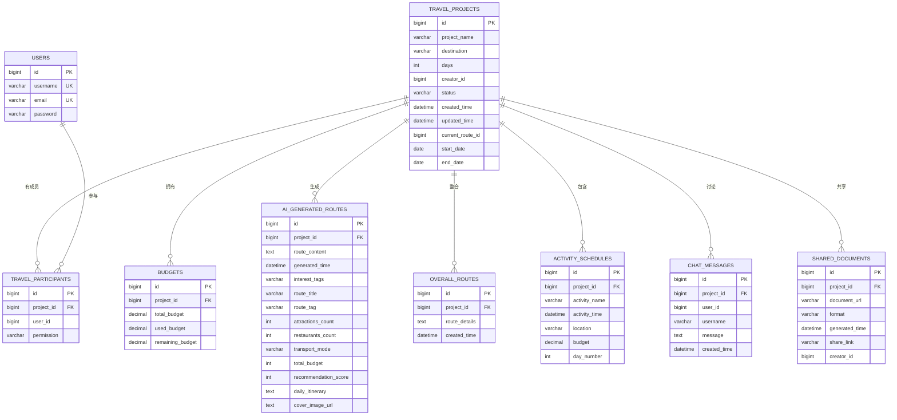

# 表结构说明

<cite>
**本文引用的文件**
- [schema.sql](file://tudianersha/src/main/resources/schema.sql)
- [data.sql](file://tudianersha/src/main/resources/data.sql)
- [TravelProject.java](file://tudianersha/src/main/java/com/tudianersha/entity/TravelProject.java)
- [User.java](file://tudianersha/src/main/java/com/tudianersha/entity/User.java)
- [AiGeneratedRoute.java](file://tudianersha/src/main/java/com/tudianersha/entity/AiGeneratedRoute.java)
- [OverallRoute.java](file://tudianersha/src/main/java/com/tudianersha/entity/OverallRoute.java)
- [Budget.java](file://tudianersha/src/main/java/com/tudianersha/entity/Budget.java)
- [ChatMessage.java](file://tudianersha/src/main/java/com/tudianersha/entity/ChatMessage.java)
- [SharedDocument.java](file://tudianersha/src/main/java/com/tudianersha/entity/SharedDocument.java)
- [ActivitySchedule.java](file://tudianersha/src/main/java/com/tudianersha/entity/ActivitySchedule.java)
- [TravelParticipant.java](file://tudianersha/src/main/java/com/tudianersha/entity/TravelParticipant.java)
</cite>

## 目录
1. [引言](#引言)
2. [项目结构](#项目结构)
3. [核心组件](#核心组件)
4. [架构总览](#架构总览)
5. [详细组件分析](#详细组件分析)
6. [依赖关系分析](#依赖关系分析)
7. [性能考虑](#性能考虑)
8. [故障排查指南](#故障排查指南)
9. [结论](#结论)
10. [附录](#附录)

## 引言
本文件面向数据库与后端开发人员，系统性梳理数据库中各表的结构设计，包括字段名称、数据类型、约束条件（如非空、唯一、主键、索引）以及默认值；并结合JPA实体类注解（如@Entity、@Id、@Column）解释ORM映射规则。重点解析TravelProject（行程项目）、User（用户）、AiGeneratedRoute（AI生成路线）、OverallRoute（总体路线）、Budget（预算）、ChatMessage（聊天消息）、SharedDocument（共享文档）等核心表的业务含义与字段用途。同时提供完整数据字典，包含字段中文名、示例值与业务规则，并举例说明关键字段在业务流程中的作用，如current_route_id在路线选定中的状态流转。

## 项目结构
- 数据库初始化脚本位于 resources 目录，定义了所有业务表及其约束与索引。
- JPA 实体类位于 entity 包，每个实体类通过 @Entity 和 @Table 映射到对应表，@Column 注解用于字段映射与约束声明。
- 示例初始化数据位于 data.sql，便于快速验证用户表等基础数据。

**图示来源**
- [schema.sql](file://tudianersha/src/main/resources/schema.sql#L1-L123)
- [data.sql](file://tudianersha/src/main/resources/data.sql#L1-L7)
- [User.java](file://tudianersha/src/main/java/com/tudianersha/entity/User.java#L1-L73)
- [TravelProject.java](file://tudianersha/src/main/java/com/tudianersha/entity/TravelProject.java#L1-L163)
- [AiGeneratedRoute.java](file://tudianersha/src/main/java/com/tudianersha/entity/AiGeneratedRoute.java#L1-L193)
- [OverallRoute.java](file://tudianersha/src/main/java/com/tudianersha/entity/OverallRoute.java#L1-L74)
- [Budget.java](file://tudianersha/src/main/java/com/tudianersha/entity/Budget.java#L1-L87)
- [ChatMessage.java](file://tudianersha/src/main/java/com/tudianersha/entity/ChatMessage.java#L1-L90)
- [SharedDocument.java](file://tudianersha/src/main/java/com/tudianersha/entity/SharedDocument.java#L1-L114)
- [ActivitySchedule.java](file://tudianersha/src/main/java/com/tudianersha/entity/ActivitySchedule.java#L1-L115)
- [TravelParticipant.java](file://tudianersha/src/main/java/com/tudianersha/entity/TravelParticipant.java#L1-L73)

**章节来源**
- [schema.sql](file://tudianersha/src/main/resources/schema.sql#L1-L123)
- [data.sql](file://tudianersha/src/main/resources/data.sql#L1-L7)

## 核心组件
本节对核心表进行逐一说明，涵盖字段、类型、约束与默认值，并给出ORM映射要点与业务规则。

- 用户表 users
  - 字段与约束
    - id：BIGINT，自增主键
    - username：VARCHAR(50)，非空且唯一
    - email：VARCHAR(100)，非空且唯一
    - password：VARCHAR(100)，非空
  - ORM映射要点
    - @Entity + @Table(name = "users")，@Id + @GeneratedValue，@Column 与字段一一对应
  - 业务规则
    - 唯一性约束保证用户名与邮箱不重复
  - 示例值
    - username：示例为 admin、user1 等
    - email：示例为 admin@example.com 等
    - password：示例为 admin123 等

- 行程项目表 travel_projects
  - 字段与约束
    - id：BIGINT，自增主键
    - project_name：VARCHAR(100)，非空
    - destination：VARCHAR(100)，非空
    - days：INT，非空
    - creator_id：BIGINT，非空
    - status：VARCHAR(20)，非空（草稿/规划中/已归档）
    - created_time：DATETIME，非空
    - updated_time：DATETIME，非空
    - current_route_id：BIGINT，可空（当前选定路线ID）
    - start_date：DATE，可空
    - end_date：DATE，可空
  - ORM映射要点
    - @Entity + @Table(name = "travel_projects")，@Id + @GeneratedValue，@Column 对应字段
  - 业务规则
    - status 字段取值建议：draft、planning、archived（草稿/规划中/已归档）
    - current_route_id 为空表示尚未选定路线；非空时表示已选定某条路线
  - 示例值
    - project_name：示例为“北京五日游”
    - status：示例为 draft 或 planning
    - current_route_id：示例为 1001（若已选定）

- AI生成路线表 ai_generated_routes
  - 字段与约束
    - id：BIGINT，自增主键
    - project_id：BIGINT，非空
    - route_content：TEXT，可空
    - generated_time：DATETIME，非空
    - interest_tags：VARCHAR(200)，可空
    - route_title：VARCHAR(255)，可空
    - route_tag：VARCHAR(255)，可空
    - attractions_count：INT，可空
    - restaurants_count：INT，可空
    - transport_mode：VARCHAR(255)，可空
    - total_budget：INT，可空
    - recommendation_score：INT，可空
    - daily_itinerary：TEXT，可空
    - cover_image_url：TEXT，可空
  - ORM映射要点
    - @Entity + @Table(name = "ai_generated_routes")，@Id + @GeneratedValue，@Column 对应字段
  - 业务规则
    - route_content 与 daily_itinerary 可存储结构化文本或JSON
    - cover_image_url 支持多图逗号分隔
  - 示例值
    - route_title：示例为“经典古都一日游”
    - interest_tags：示例为“历史,文化,美食”

- 总体路线表 overall_routes
  - 字段与约束
    - id：BIGINT，自增主键
    - project_id：BIGINT，非空
    - route_details：TEXT，可空
    - created_time：DATETIME，非空
  - ORM映射要点
    - @Entity + @Table(name = "overall_routes")，@Id + @GeneratedValue，@Column 对应字段
  - 业务规则
    - route_details 存放最终整合后的路线详情
  - 示例值
    - route_details：示例为“路线整合后的JSON字符串”

- 预算表 budgets
  - 字段与约束
    - id：BIGINT，自增主键
    - project_id：BIGINT，非空
    - total_budget：DECIMAL(10,2)，非空
    - used_budget：DECIMAL(10,2)，非空
    - remaining_budget：DECIMAL(10,2)，非空
  - ORM映射要点
    - @Entity + @Table(name = "budgets")，@Id + @GeneratedValue，@Column 对应字段
  - 业务规则
    - 三者满足：total = used + remaining
  - 示例值
    - total_budget：示例为 5000.00
    - used_budget：示例为 2300.00
    - remaining_budget：示例为 2700.00

- 聊天消息表 chat_messages
  - 字段与约束
    - id：BIGINT，自增主键
    - project_id：BIGINT，非空
    - user_id：BIGINT，非空
    - username：VARCHAR(50)，可空
    - message：TEXT，可空
    - created_time：DATETIME，可空
    - 索引：idx_project_id(project_id)、idx_created_time(created_time)
  - ORM映射要点
    - @Entity + @Table(name = "chat_messages")，@Id + @GeneratedValue，@Column 对应字段
  - 业务规则
    - 索引支持按项目查询与时间排序
  - 示例值
    - message：示例为“大家好，欢迎加入行程讨论”
    - created_time：示例为 2025-04-05 10:30:00

- 共享文档表 shared_documents
  - 字段与约束
    - id：BIGINT，自增主键
    - project_id：BIGINT，非空
    - document_url：VARCHAR(200)，可空
    - format：VARCHAR(20)，可空（PDF等）
    - generated_time：DATETIME，非空
    - share_link：VARCHAR(200)，可空
    - creator_id：BIGINT，非空
  - ORM映射要点
    - @Entity + @Table(name = "shared_documents")，@Id + @GeneratedValue，@Column 对应字段
  - 业务规则
    - share_link 提供公开分享链接
  - 示例值
    - document_url：示例为 “/uploads/itinerary_20250405.pdf”
    - share_link：示例为 “https://example.com/share/abc123”

- 活动安排表 activity_schedules
  - 字段与约束
    - id：BIGINT，自增主键
    - project_id：BIGINT，非空
    - activity_name：VARCHAR(100)，非空
    - activity_time：DATETIME，可空
    - location：VARCHAR(100)，可空
    - budget：DECIMAL(10,2)，可空
    - day_number：INT，可空
  - ORM映射要点
    - @Entity + @Table(name = "activity_schedules")，@Id + @GeneratedValue，@Column 对应字段
  - 业务规则
    - day_number 用于按天组织活动
  - 示例值
    - activity_name：示例为“故宫博物院”
    - day_number：示例为 1

- 行程参与者表 travel_participants
  - 字段与约束
    - id：BIGINT，自增主键
    - project_id：BIGINT，非空
    - user_id：BIGINT，非空
    - permission：VARCHAR(20)，非空（创建者/编辑者/查看者）
  - ORM映射要点
    - @Entity + @Table(name = "travel_participants")，@Id + @GeneratedValue，@Column 对应字段
  - 业务规则
    - permission 决定成员对项目的操作权限
  - 示例值
    - permission：示例为 creator、editor、viewer

- 项目参与表 project_participants（补充）
  - 字段与约束
    - id：BIGINT，自增主键
    - project_id：BIGINT，非空
    - user_id：BIGINT，非空
    - join_time：DATETIME，非空
    - role：VARCHAR(20)，非空
  - ORM映射要点
    - @Entity + @Table(name = "project_participants")，@Id + @GeneratedValue，@Column 对应字段
  - 业务规则
    - role 用于标识项目级角色（如普通成员、管理员等）
  - 示例值
    - role：示例为 member、admin

**章节来源**
- [schema.sql](file://tudianersha/src/main/resources/schema.sql#L1-L123)
- [TravelProject.java](file://tudianersha/src/main/java/com/tudianersha/entity/TravelProject.java#L1-L163)
- [User.java](file://tudianersha/src/main/java/com/tudianersha/entity/User.java#L1-L73)
- [AiGeneratedRoute.java](file://tudianersha/src/main/java/com/tudianersha/entity/AiGeneratedRoute.java#L1-L193)
- [OverallRoute.java](file://tudianersha/src/main/java/com/tudianersha/entity/OverallRoute.java#L1-L74)
- [Budget.java](file://tudianersha/src/main/java/com/tudianersha/entity/Budget.java#L1-L87)
- [ChatMessage.java](file://tudianersha/src/main/java/com/tudianersha/entity/ChatMessage.java#L1-L90)
- [SharedDocument.java](file://tudianersha/src/main/java/com/tudianersha/entity/SharedDocument.java#L1-L114)
- [ActivitySchedule.java](file://tudianersha/src/main/java/com/tudianersha/entity/ActivitySchedule.java#L1-L115)
- [TravelParticipant.java](file://tudianersha/src/main/java/com/tudianersha/entity/TravelParticipant.java#L1-L73)

## 架构总览
下图展示核心表之间的关系与业务关联，突出 TravelProject 作为核心枢纽，与其他表（预算、路线、活动、参与者、聊天、文档）的交互。

**图示来源**
- [schema.sql](file://tudianersha/src/main/resources/schema.sql#L1-L123)
- [TravelProject.java](file://tudianersha/src/main/java/com/tudianersha/entity/TravelProject.java#L1-L163)
- [User.java](file://tudianersha/src/main/java/com/tudianersha/entity/User.java#L1-L73)
- [AiGeneratedRoute.java](file://tudianersha/src/main/java/com/tudianersha/entity/AiGeneratedRoute.java#L1-L193)
- [OverallRoute.java](file://tudianersha/src/main/java/com/tudianersha/entity/OverallRoute.java#L1-L74)
- [Budget.java](file://tudianersha/src/main/java/com/tudianersha/entity/Budget.java#L1-L87)
- [ChatMessage.java](file://tudianersha/src/main/java/com/tudianersha/entity/ChatMessage.java#L1-L90)
- [SharedDocument.java](file://tudianersha/src/main/java/com/tudianersha/entity/SharedDocument.java#L1-L114)
- [ActivitySchedule.java](file://tudianersha/src/main/java/com/tudianersha/entity/ActivitySchedule.java#L1-L115)
- [TravelParticipant.java](file://tudianersha/src/main/java/com/tudianersha/entity/TravelParticipant.java#L1-L73)

## 详细组件分析

### TravelProject（行程项目）分析
- 业务含义
  - 记录一次旅行计划的基本信息、状态与时间范围，并维护当前选定的路线ID。
- 关键字段
  - project_name、destination、days、creator_id、status、created_time、updated_time、current_route_id、start_date、end_date
- ORM映射
  - @Entity + @Table(name = "travel_projects")，@Id + @GeneratedValue，@Column 对应字段
- 业务规则
  - status 建议值：draft、planning、archived
  - current_route_id 为空表示未选定；非空表示已选定某条AI生成路线或总体路线
- 流程示例
  - 新建项目：写入 project_name、destination、days、creator_id、status=draft、created_time、updated_time
  - 选定路线：从 ai_generated_routes 查询某条路线，回填 current_route_id
  - 更新状态：根据业务推进更新 status 与 updated_time

**图示来源**
- [TravelProject.java](file://tudianersha/src/main/java/com/tudianersha/entity/TravelProject.java#L1-L163)
- [AiGeneratedRoute.java](file://tudianersha/src/main/java/com/tudianersha/entity/AiGeneratedRoute.java#L1-L193)
- [schema.sql](file://tudianersha/src/main/resources/schema.sql#L20-L33)

**章节来源**
- [TravelProject.java](file://tudianersha/src/main/java/com/tudianersha/entity/TravelProject.java#L1-L163)
- [schema.sql](file://tudianersha/src/main/resources/schema.sql#L20-L33)

### User（用户）分析
- 业务含义
  - 存储用户基本信息，用于登录、权限控制与项目成员关联。
- 关键字段
  - username、email、password
- ORM映射
  - @Entity + @Table(name = "users")，@Id + @GeneratedValue，@Column 对应字段
- 业务规则
  - username 与 email 唯一，防止重复注册
- 示例值
  - username：admin、user1、tsl、qjq、ysy
  - email：admin@example.com 等
  - password：示例为 admin123 等

**章节来源**
- [User.java](file://tudianersha/src/main/java/com/tudianersha/entity/User.java#L1-L73)
- [schema.sql](file://tudianersha/src/main/resources/schema.sql#L3-L9)
- [data.sql](file://tudianersha/src/main/resources/data.sql#L1-L7)

### AiGeneratedRoute（AI生成路线）分析
- 业务含义
  - 存储AI生成的路线内容、标签、封面、每日行程等扩展信息。
- 关键字段
  - project_id、route_content、generated_time、interest_tags、route_title、route_tag、attractions_count、restaurants_count、transport_mode、total_budget、recommendation_score、daily_itinerary、cover_image_url
- ORM映射
  - @Entity + @Table(name = "ai_generated_routes")，@Id + @GeneratedValue，@Column 对应字段
- 业务规则
  - daily_itinerary 建议为JSON结构，便于前端渲染
  - cover_image_url 支持多图逗号分隔
- 示例值
  - route_title：经典古都一日游
  - interest_tags：历史,文化,美食

**章节来源**
- [AiGeneratedRoute.java](file://tudianersha/src/main/java/com/tudianersha/entity/AiGeneratedRoute.java#L1-L193)
- [schema.sql](file://tudianersha/src/main/resources/schema.sql#L52-L59)

### OverallRoute（总体路线）分析
- 业务含义
  - 存放整合后的最终路线详情，通常由AI生成路线或人工调整后形成。
- 关键字段
  - project_id、route_details、created_time
- ORM映射
  - @Entity + @Table(name = "overall_routes")，@Id + @GeneratedValue，@Column 对应字段
- 业务规则
  - route_details 存放最终整合后的路线详情
- 示例值
  - route_details：路线整合后的JSON字符串

**章节来源**
- [OverallRoute.java](file://tudianersha/src/main/java/com/tudianersha/entity/OverallRoute.java#L1-L74)
- [schema.sql](file://tudianersha/src/main/resources/schema.sql#L61-L67)

### Budget（预算）分析
- 业务含义
  - 记录项目的总预算、已用预算与剩余预算。
- 关键字段
  - project_id、total_budget、used_budget、remaining_budget
- ORM映射
  - @Entity + @Table(name = "budgets")，@Id + @GeneratedValue，@Column 对应字段
- 业务规则
  - total = used + remaining
- 示例值
  - total_budget：5000.00
  - used_budget：2300.00
  - remaining_budget：2700.00

**章节来源**
- [Budget.java](file://tudianersha/src/main/java/com/tudianersha/entity/Budget.java#L1-L87)
- [schema.sql](file://tudianersha/src/main/resources/schema.sql#L43-L50)

### ChatMessage（聊天消息）分析
- 业务含义
  - 记录项目内的聊天消息，支持按项目与时间检索。
- 关键字段
  - project_id、user_id、username、message、created_time
- ORM映射
  - @Entity + @Table(name = "chat_messages")，@Id + @GeneratedValue，@Column 对应字段
- 业务规则
  - 索引 idx_project_id 与 idx_created_time 支持高效查询
- 示例值
  - message：大家好，欢迎加入行程讨论
  - created_time：2025-04-05 10:30:00

**章节来源**
- [ChatMessage.java](file://tudianersha/src/main/java/com/tudianersha/entity/ChatMessage.java#L1-L90)
- [schema.sql](file://tudianersha/src/main/resources/schema.sql#L113-L123)

### SharedDocument（共享文档）分析
- 业务含义
  - 记录项目生成的共享文档（如行程导出PDF），提供下载链接与分享链接。
- 关键字段
  - project_id、document_url、format、generated_time、share_link、creator_id
- ORM映射
  - @Entity + @Table(name = "shared_documents")，@Id + @GeneratedValue，@Column 对应字段
- 业务规则
  - share_link 提供公开分享链接
- 示例值
  - document_url：/uploads/itinerary_20250405.pdf
  - share_link：https://example.com/share/abc123

**章节来源**
- [SharedDocument.java](file://tudianersha/src/main/java/com/tudianersha/entity/SharedDocument.java#L1-L114)
- [schema.sql](file://tudianersha/src/main/resources/schema.sql#L102-L111)

### ActivitySchedule（活动安排）分析
- 业务含义
  - 记录每天的活动安排，包括时间、地点、预算与所属天数。
- 关键字段
  - project_id、activity_name、activity_time、location、budget、day_number
- ORM映射
  - @Entity + @Table(name = "activity_schedules")，@Id + @GeneratedValue，@Column 对应字段
- 业务规则
  - day_number 用于按天组织活动
- 示例值
  - activity_name：故宫博物院
  - day_number：1

**章节来源**
- [ActivitySchedule.java](file://tudianersha/src/main/java/com/tudianersha/entity/ActivitySchedule.java#L1-L115)
- [schema.sql](file://tudianersha/src/main/resources/schema.sql#L69-L78)

### TravelParticipant（行程参与者）分析
- 业务含义
  - 记录项目成员与其权限（创建者/编辑者/查看者）。
- 关键字段
  - project_id、user_id、permission
- ORM映射
  - @Entity + @Table(name = "travel_participants")，@Id + @GeneratedValue，@Column 对应字段
- 业务规则
  - permission 决定成员对项目的操作权限
- 示例值
  - permission：creator、editor、viewer

**章节来源**
- [TravelParticipant.java](file://tudianersha/src/main/java/com/tudianersha/entity/TravelParticipant.java#L1-L73)
- [schema.sql](file://tudianersha/src/main/resources/schema.sql#L35-L41)

## 依赖关系分析
- 表间外键关系（基于字段命名与业务语义推断）
  - travel_projects.id → budgets.project_id
  - travel_projects.id → ai_generated_routes.project_id
  - travel_projects.id → overall_routes.project_id
  - travel_projects.id → activity_schedules.project_id
  - travel_projects.id → travel_participants.project_id
  - travel_projects.id → chat_messages.project_id
  - travel_projects.id → shared_documents.project_id
  - users.id → travel_participants.user_id
- 外键约束现状
  - schema.sql 中未显式声明 FOREIGN KEY 约束，但通过字段命名与业务语义可推断上述关系
  - 若需强一致性，可在 schema.sql 中添加外键约束（例如：FOREIGN KEY(project_id) REFERENCES travel_projects(id) ON DELETE CASCADE）

**图示来源**
- [schema.sql](file://tudianersha/src/main/resources/schema.sql#L1-L123)

**章节来源**
- [schema.sql](file://tudianersha/src/main/resources/schema.sql#L1-L123)

## 性能考虑
- 索引使用
  - chat_messages 表已建立 idx_project_id 与 idx_created_time，有利于按项目查询与时间排序
- 查询优化建议
  - 在 travel_projects 上增加索引：current_route_id（频繁按选定路线查询）
  - 在 activity_schedules 上增加复合索引：project_id + day_number（按天查询活动）
  - 在 travel_participants 上增加索引：user_id（按用户查询项目）
- 数据类型选择
  - DECIMAL(10,2) 适合金额存储，避免浮点误差
  - TEXT 适合大文本存储（如路线详情、消息内容），但需注意查询性能

[本节为通用指导，无需具体文件引用]

## 故障排查指南
- 常见问题与定位
  - 重复用户名/邮箱：检查 users 表的唯一约束
  - 未找到项目相关数据：确认 travel_projects.id 与各子表 project_id 是否一致
  - 无法按项目查询聊天消息：确认 idx_project_id 是否存在
  - 预算不一致：核对 budgets 的 total、used、remaining 三者关系
- 建议排查步骤
  - 使用 SELECT COUNT(*) FROM 表 WHERE 条件 验证数据完整性
  - 使用 EXPLAIN 查看慢查询执行计划，必要时添加索引
  - 核对 JPA 实体类 @Column(name = "...") 与表字段是否一致

**章节来源**
- [schema.sql](file://tudianersha/src/main/resources/schema.sql#L1-L123)
- [TravelProject.java](file://tudianersha/src/main/java/com/tudianersha/entity/TravelProject.java#L1-L163)
- [Budget.java](file://tudianersha/src/main/java/com/tudianersha/entity/Budget.java#L1-L87)
- [ChatMessage.java](file://tudianersha/src/main/java/com/tudianersha/entity/ChatMessage.java#L1-L90)

## 结论
本文基于 schema.sql 与 JPA 实体类，系统梳理了数据库表结构、字段约束与业务规则，并重点解析了 TravelProject、User、AiGeneratedRoute、OverallRoute、Budget、ChatMessage、SharedDocument 等核心表。通过 ER 图与流程图，明确了表间关系与关键字段在业务流程中的作用，如 current_route_id 在路线选定中的状态流转。建议后续在 schema.sql 中补充外键约束以增强数据一致性，并针对高频查询场景添加索引以提升性能。

[本节为总结性内容，无需具体文件引用]

## 附录

### 数据字典（核心表）
- users
  - 字段：id、username、email、password
  - 类型：bigint、varchar(50)、varchar(100)、varchar(100)
  - 约束：id 主键；username、email 唯一；password 非空
  - 示例值：username=admin；email=admin@example.com；password=admin123

- travel_projects
  - 字段：id、project_name、destination、days、creator_id、status、created_time、updated_time、current_route_id、start_date、end_date
  - 类型：bigint、varchar(100)、varchar(100)、int、bigint、varchar(20)、datetime、datetime、bigint、date、date
  - 约束：id 主键；其余字段见表定义
  - 示例值：project_name=“北京五日游”；status=draft；current_route_id=1001

- ai_generated_routes
  - 字段：id、project_id、route_content、generated_time、interest_tags、route_title、route_tag、attractions_count、restaurants_count、transport_mode、total_budget、recommendation_score、daily_itinerary、cover_image_url
  - 类型：bigint、bigint、text、datetime、varchar(200)、varchar(255)、varchar(255)、int、int、varchar(255)、int、int、text、text
  - 约束：id 主键；其余字段见表定义
  - 示例值：route_title=“经典古都一日游”；interest_tags=“历史,文化,美食”

- overall_routes
  - 字段：id、project_id、route_details、created_time
  - 类型：bigint、bigint、text、datetime
  - 约束：id 主键；其余字段见表定义
  - 示例值：route_details=“路线整合后的JSON字符串”

- budgets
  - 字段：id、project_id、total_budget、used_budget、remaining_budget
  - 类型：bigint、bigint、decimal(10,2)、decimal(10,2)、decimal(10,2)
  - 约束：id 主键；其余字段见表定义
  - 示例值：total_budget=5000.00；used_budget=2300.00；remaining_budget=2700.00

- chat_messages
  - 字段：id、project_id、user_id、username、message、created_time
  - 类型：bigint、bigint、bigint、varchar(50)、text、datetime
  - 约束：id 主键；其余字段见表定义；idx_project_id、idx_created_time
  - 示例值：message=“大家好，欢迎加入行程讨论”；created_time=“2025-04-05 10:30:00”

- shared_documents
  - 字段：id、project_id、document_url、format、generated_time、share_link、creator_id
  - 类型：bigint、bigint、varchar(200)、varchar(20)、datetime、varchar(200)、bigint
  - 约束：id 主键；其余字段见表定义
  - 示例值：document_url=“/uploads/itinerary_20250405.pdf”；share_link=“https://example.com/share/abc123”

- activity_schedules
  - 字段：id、project_id、activity_name、activity_time、location、budget、day_number
  - 类型：bigint、bigint、varchar(100)、datetime、varchar(100)、decimal(10,2)、int
  - 约束：id 主键；其余字段见表定义
  - 示例值：activity_name=“故宫博物院”；day_number=1

- travel_participants
  - 字段：id、project_id、user_id、permission
  - 类型：bigint、bigint、bigint、varchar(20)
  - 约束：id 主键；其余字段见表定义
  - 示例值：permission=“creator”、“editor”、“viewer”

**章节来源**
- [schema.sql](file://tudianersha/src/main/resources/schema.sql#L1-L123)
- [User.java](file://tudianersha/src/main/java/com/tudianersha/entity/User.java#L1-L73)
- [TravelProject.java](file://tudianersha/src/main/java/com/tudianersha/entity/TravelProject.java#L1-L163)
- [AiGeneratedRoute.java](file://tudianersha/src/main/java/com/tudianersha/entity/AiGeneratedRoute.java#L1-L193)
- [OverallRoute.java](file://tudianersha/src/main/java/com/tudianersha/entity/OverallRoute.java#L1-L74)
- [Budget.java](file://tudianersha/src/main/java/com/tudianersha/entity/Budget.java#L1-L87)
- [ChatMessage.java](file://tudianersha/src/main/java/com/tudianersha/entity/ChatMessage.java#L1-L90)
- [SharedDocument.java](file://tudianersha/src/main/java/com/tudianersha/entity/SharedDocument.java#L1-L114)
- [ActivitySchedule.java](file://tudianersha/src/main/java/com/tudianersha/entity/ActivitySchedule.java#L1-L115)
- [TravelParticipant.java](file://tudianersha/src/main/java/com/tudianersha/entity/TravelParticipant.java#L1-L73)