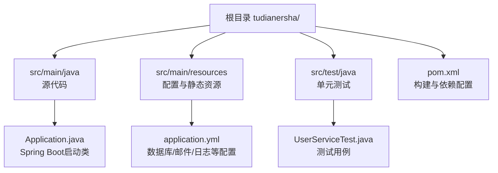
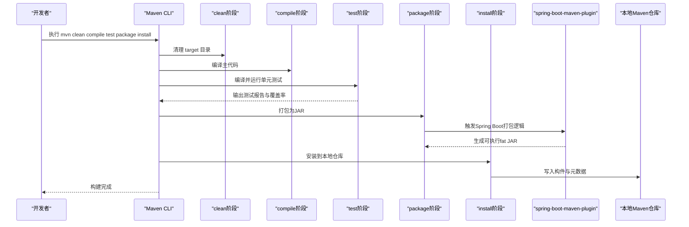
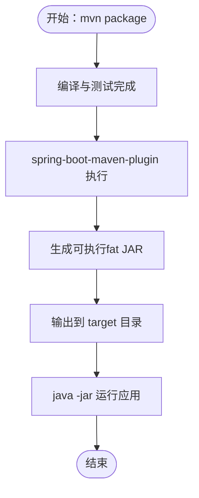
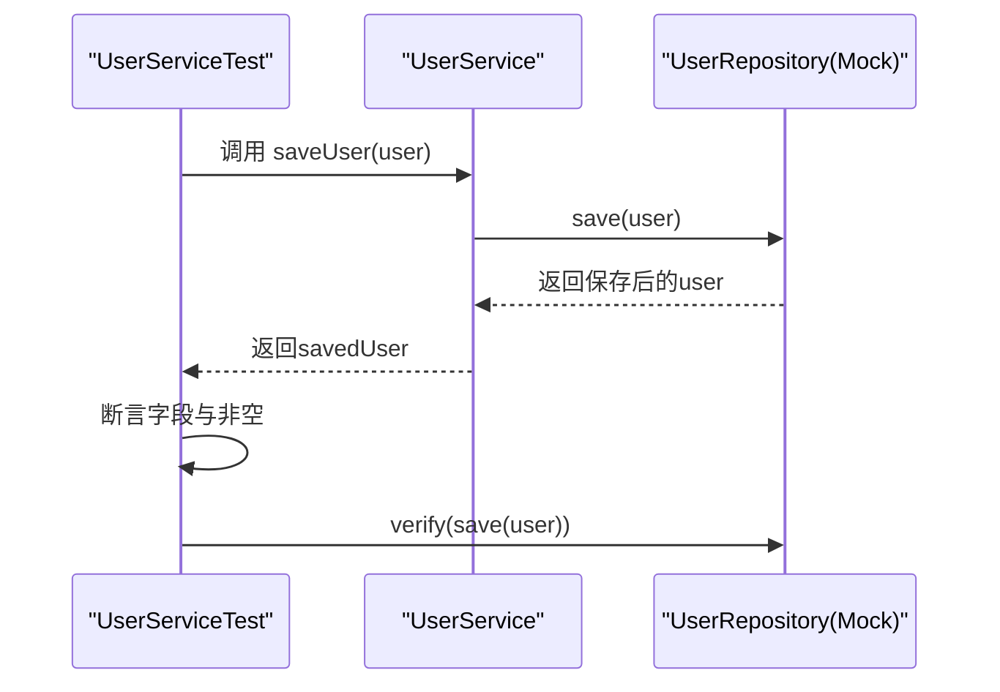
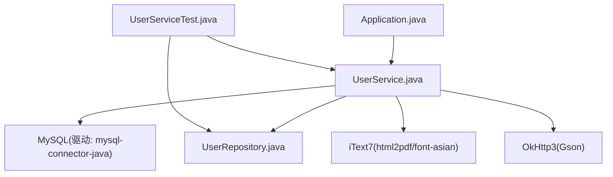

# Maven构建流程

<cite>
**本文引用的文件**
- [pom.xml](file://tudianersha/pom.xml)
- [UserServiceTest.java](file://tudianersha/src/test/java/com/tudianersha/UserServiceTest.java)
- [Application.java](file://tudianersha/src/main/java/com/tudianersha/Application.java)
- [UserService.java](file://tudianersha/src/main/java/com/tudianersha/service/UserService.java)
- [UserRepository.java](file://tudianersha/src/main/java/com/tudianersha/repository/UserRepository.java)
- [application.yml](file://tudianersha/src/main/resources/application.yml)
- [README.md](file://tudianersha/README.md)
</cite>

## 目录
1. [简介](#简介)
2. [项目结构](#项目结构)
3. [核心组件](#核心组件)
4. [架构总览](#架构总览)
5. [详细组件分析](#详细组件分析)
6. [依赖关系分析](#依赖关系分析)
7. [性能与构建特性](#性能与构建特性)
8. [故障排查指南](#故障排查指南)
9. [结论](#结论)
10. [附录](#附录)

## 简介
本文件围绕Maven在本项目的构建流程展开，系统性说明以下阶段：mvn clean、mvn compile、mvn test、mvn package、mvn install 的职责与产物；重点解析 spring-boot-maven-plugin 插件如何将Spring Boot应用打包为可执行fat JAR并支持 java -jar 运行；结合 pom.xml 中的 dependencies 和 build 配置，说明关键依赖（Spring Boot、MySQL、iText7、OkHttp3）在构建过程中的作用；最后提供常见问题的解决方案，如依赖下载失败、Java版本不兼容（项目使用Java 11）等。

## 项目结构
项目采用标准的Maven多模块布局（单模块），核心目录与文件如下：
- 源代码位于 src/main/java，资源位于 src/main/resources
- 测试代码位于 src/test/java
- 构建配置位于根目录的 pom.xml
- 启动入口位于 Application.java
- 数据库连接与日志等配置位于 application.yml
- 构建与运行命令示例位于 README.md

图表来源
- [pom.xml](file://tudianersha/pom.xml#L1-L180)
- [Application.java](file://tudianersha/src/main/java/com/tudianersha/Application.java#L1-L12)
- [application.yml](file://tudianersha/src/main/resources/application.yml#L1-L57)
- [UserServiceTest.java](file://tudianersha/src/test/java/com/tudianersha/UserServiceTest.java#L1-L55)

章节来源
- [pom.xml](file://tudianersha/pom.xml#L1-L180)
- [README.md](file://tudianersha/README.md#L1-L66)

## 核心组件
- 构建生命周期与阶段
  - mvn clean：清理目标目录（target），移除历史编译产物，确保从零开始构建。
  - mvn compile：编译主代码（src/main/java），输出至 target/classes。
  - mvn test：编译并运行测试（src/test/java），默认使用JUnit Jupiter，测试结果记录于 target/surefire-reports。
  - mvn package：在完成编译与测试后，打包为JAR/WAR等（此处为jar），生成可执行或非可执行包。
  - mvn install：将打包产物安装到本地Maven仓库（~/.m2/repository），供其他项目引用。

- spring-boot-maven-plugin 插件
  - 在 build/plugins 中声明，版本由属性 spring.boot.version 统一管理。
  - 负责将Spring Boot应用打包为可执行fat JAR，内含引导器、应用类与所有依赖，支持 java -jar 方式直接运行。
  - 默认会将主类设置为 @SpringBootApplication 注解所在类（Application.java）。

- 关键依赖与作用
  - Spring Boot Starter/Web/Data JPA：提供Web框架、数据访问与自动配置能力。
  - MySQL Connector/J：数据库驱动，配合JPA/Hibernate使用。
  - MyBatis Spring Boot Starter：提供MyBatis集成与自动配置。
  - OkHttp3：HTTP客户端，用于调用外部AI服务接口。
  - iText7（含html2pdf与font-asian）：PDF生成与中文支持。
  - JUnit Jupiter：测试框架，与spring-boot-starter-test共同构成测试生态。
  - JAXB（jaxb-api/jaxb-runtime）：为Java 11移除内置JAXB后的兼容补充。
  - Actuator：监控与健康检查端点。

章节来源
- [pom.xml](file://tudianersha/pom.xml#L16-L23)
- [pom.xml](file://tudianersha/pom.xml#L25-L169)
- [pom.xml](file://tudianersha/pom.xml#L171-L179)
- [Application.java](file://tudianersha/src/main/java/com/tudianersha/Application.java#L1-L12)
- [README.md](file://tudianersha/README.md#L43-L47)

## 架构总览
下图展示Maven构建阶段与Spring Boot打包插件的关系，以及测试阶段对单元测试的覆盖。

图表来源
- [pom.xml](file://tudianersha/pom.xml#L171-L179)
- [UserServiceTest.java](file://tudianersha/src/test/java/com/tudianersha/UserServiceTest.java#L1-L55)
- [README.md](file://tudianersha/README.md#L43-L47)

## 详细组件分析

### Maven生命周期与阶段详解
- mvn clean
  - 清空 target 目录，避免旧产物影响新构建。
  - 为后续阶段提供干净的起点。
- mvn compile
  - 将 src/main/java 编译为字节码，输出到 target/classes。
  - 复制 src/main/resources 到 target/classes。
- mvn test
  - 编译 src/test/java 并运行测试。
  - 使用 @SpringBootTest 加载Spring上下文，结合 @MockBean 对仓储层进行模拟。
  - 示例：UserServiceTest 验证保存用户与按用户名查询的业务逻辑。
- mvn package
  - 在已有编译与测试基础上，生成JAR/WAR等包。
  - 结合 spring-boot-maven-plugin，生成可执行fat JAR。
- mvn install
  - 将生成的包安装到本地Maven仓库，便于本地其他模块或CI环境复用。

章节来源
- [UserServiceTest.java](file://tudianersha/src/test/java/com/tudianersha/UserServiceTest.java#L1-L55)
- [pom.xml](file://tudianersha/pom.xml#L171-L179)
- [README.md](file://tudianersha/README.md#L43-L47)

### spring-boot-maven-plugin 插件配置与fat JAR生成
- 插件位置与版本
  - 在 build/plugins 中声明，版本由属性 spring.boot.version 统一管理。
- 主类与启动
  - 默认扫描 @SpringBootApplication 所在类作为主类（Application.java）。
  - 生成的fat JAR包含引导器与所有依赖，可直接通过 java -jar 运行。
- 可执行性验证
  - 产物位于 target 目录，可通过 java -jar 运行（需本地已安装JRE）。
  - 应用配置位于 src/main/resources/application.yml，包括数据库、邮件、日志等。

图表来源
- [pom.xml](file://tudianersha/pom.xml#L171-L179)
- [Application.java](file://tudianersha/src/main/java/com/tudianersha/Application.java#L1-L12)
- [README.md](file://tudianersha/README.md#L43-L47)

章节来源
- [pom.xml](file://tudianersha/pom.xml#L16-L23)
- [pom.xml](file://tudianersha/pom.xml#L171-L179)
- [Application.java](file://tudianersha/src/main/java/com/tudianersha/Application.java#L1-L12)
- [README.md](file://tudianersha/README.md#L43-L47)

### 单元测试流程（UserServiceTest）
- 测试注解与上下文
  - @SpringBootTest 启动Spring Boot测试上下文。
  - @MockBean 注入Mock的 UserRepository，隔离数据库依赖。
- 断言与行为验证
  - 验证保存用户成功返回对象且字段正确。
  - 验证按用户名查询存在性与返回值。
  - 使用 verify 校验仓储方法被调用且次数符合预期。

图表来源
- [UserServiceTest.java](file://tudianersha/src/test/java/com/tudianersha/UserServiceTest.java#L1-L55)
- [UserService.java](file://tudianersha/src/main/java/com/tudianersha/service/UserService.java#L1-L48)
- [UserRepository.java](file://tudianersha/src/main/java/com/tudianersha/repository/UserRepository.java#L1-L15)

章节来源
- [UserServiceTest.java](file://tudianersha/src/test/java/com/tudianersha/UserServiceTest.java#L1-L55)
- [UserService.java](file://tudianersha/src/main/java/com/tudianersha/service/UserService.java#L1-L48)
- [UserRepository.java](file://tudianersha/src/main/java/com/tudianersha/repository/UserRepository.java#L1-L15)

### 关键依赖与构建作用
- Spring Boot Starter/Web/Data JPA
  - 提供Web容器、自动配置与JPA/Hibernate能力，简化开发与部署。
- MySQL Connector/J
  - 提供JDBC驱动，配合JPA/Hibernate访问MySQL数据库。
- MyBatis Spring Boot Starter
  - 提供MyBatis集成，与JPA并存时注意配置与映射文件路径（mapper-locations）。
- OkHttp3
  - 用于调用外部AI服务接口，构建HTTP请求与响应处理。
- iText7（html2pdf、font-asian）
  - 支持HTML转PDF与亚洲字体渲染，满足中文PDF生成需求。
- JUnit Jupiter 与 spring-boot-starter-test
  - 提供测试框架与Spring Boot测试支持，测试阶段自动装配。
- JAXB（jaxb-api/jaxb-runtime）
  - 为Java 11移除内置JAXB后的兼容补充，避免编译期缺失类错误。
- Actuator
  - 提供健康检查与指标暴露，便于运维监控。

章节来源
- [pom.xml](file://tudianersha/pom.xml#L25-L169)
- [application.yml](file://tudianersha/src/main/resources/application.yml#L1-L57)

## 依赖关系分析
- 组件耦合与职责
  - Application.java 作为启动入口，依赖Spring Boot自动装配。
  - UserService 依赖 UserRepository 接口，后者由Spring Data JPA实现。
  - 测试阶段通过 @MockBean 替换真实仓储，保证测试独立性。
- 外部依赖与集成点
  - 数据库：通过 application.yml 配置URL、用户名、密码与方言。
  - 邮件：通过 application.yml 配置SMTP主机、端口与认证参数。
  - AI接口：通过 OkHttp3 发起HTTP请求，配合 Gson 解析JSON。
  - PDF导出：通过 iText7 与 html2pdf 实现HTML到PDF转换。

图表来源
- [Application.java](file://tudianersha/src/main/java/com/tudianersha/Application.java#L1-L12)
- [UserService.java](file://tudianersha/src/main/java/com/tudianersha/service/UserService.java#L1-L48)
- [UserRepository.java](file://tudianersha/src/main/java/com/tudianersha/repository/UserRepository.java#L1-L15)
- [UserServiceTest.java](file://tudianersha/src/test/java/com/tudianersha/UserServiceTest.java#L1-L55)
- [pom.xml](file://tudianersha/pom.xml#L25-L169)
- [application.yml](file://tudianersha/src/main/resources/application.yml#L1-L57)

章节来源
- [pom.xml](file://tudianersha/pom.xml#L25-L169)
- [application.yml](file://tudianersha/src/main/resources/application.yml#L1-L57)

## 性能与构建特性
- 构建速度优化建议
  - 使用增量编译与并行测试（Maven默认行为），减少不必要的全量重编译。
  - 在CI环境中缓存本地仓库（~/.m2/repository）以加速依赖下载。
- 产物大小与运行效率
  - fat JAR包含所有依赖，启动更快但体积较大；适合单体应用与快速部署。
  - 如需减小镜像体积，可在容器化场景中考虑多阶段构建或分层打包策略（需额外配置）。
- 测试覆盖率
  - 建议在测试阶段引入覆盖率工具（如JaCoCo），并在CI中设置阈值保障质量。

[本节为通用指导，无需列出具体文件来源]

## 故障排查指南
- 依赖下载失败
  - 现象：构建时报错无法解析依赖或下载超时。
  - 排查要点：
    - 检查网络代理与Maven镜像源配置。
    - 确认依赖版本号与坐标正确（pom.xml中统一版本属性）。
    - 清理本地仓库中损坏的索引与工件后重试。
- Java版本不兼容（项目使用Java 11）
  - 现象：编译报错提示不支持的源/目标版本。
  - 排查要点：
    - 确认IDE与Maven使用的JDK均为Java 11。
    - 检查 maven-compiler-plugin 的 source/target 属性是否为11（pom.xml中已设置）。
    - 若使用Java 8或更高版本，请保持与项目一致。
- 数据库连接异常
  - 现象：应用启动时报数据库连接失败。
  - 排查要点：
    - 检查 application.yml 中的数据库URL、用户名、密码与驱动类名。
    - 确认MySQL服务已启动且端口可达。
    - 若首次运行，确认数据库与表初始化脚本已执行。
- PDF生成失败
  - 现象：生成PDF时报错或中文乱码。
  - 排查要点：
    - 确认已引入 iText7-core、html2pdf 与 font-asian 依赖。
    - 检查HTML内容编码与字体配置。
- HTTP调用失败
  - 现象：调用AI接口超时或返回异常。
  - 排查要点：
    - 检查OkHttp3与Gson依赖是否正确。
    - 校验请求URL、超时时间与鉴权参数。
- Actuator端点不可用
  - 现象：访问健康检查端点返回404或未生效。
  - 排查要点：
    - 确认已引入 spring-boot-starter-actuator 依赖。
    - 检查端点暴露与安全配置。

章节来源
- [pom.xml](file://tudianersha/pom.xml#L16-L23)
- [application.yml](file://tudianersha/src/main/resources/application.yml#L1-L57)
- [README.md](file://tudianersha/README.md#L36-L66)

## 结论
本项目基于Maven与Spring Boot实现了完整的构建流程：从清理、编译、测试到打包与安装。spring-boot-maven-plugin 将应用打包为可执行fat JAR，结合Java 11与关键依赖（Spring Boot、MySQL、iText7、OkHttp3等），既满足功能需求又便于部署运行。通过规范的依赖管理与测试实践，可有效提升构建稳定性与交付质量。

[本节为总结，无需列出具体文件来源]

## 附录
- 常用命令速查
  - mvn clean：清理构建产物
  - mvn compile：编译主代码
  - mvn test：编译并运行测试
  - mvn package：打包为JAR
  - mvn install：安装到本地仓库
  - mvn spring-boot:run：直接运行Spring Boot应用（无需打包）

章节来源
- [README.md](file://tudianersha/README.md#L43-L47)