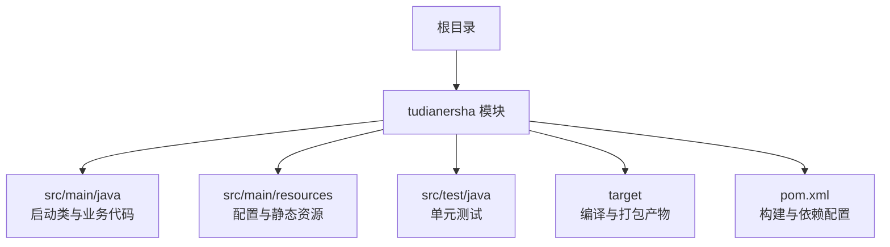
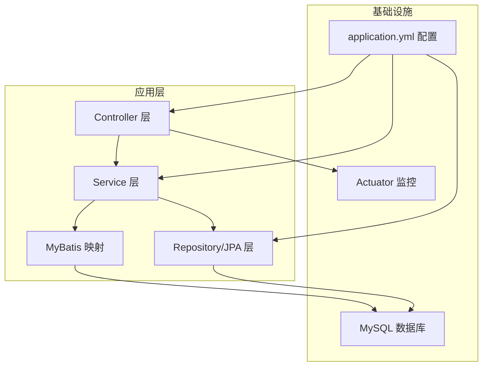
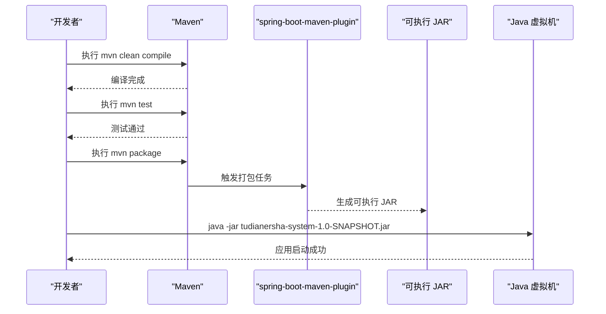
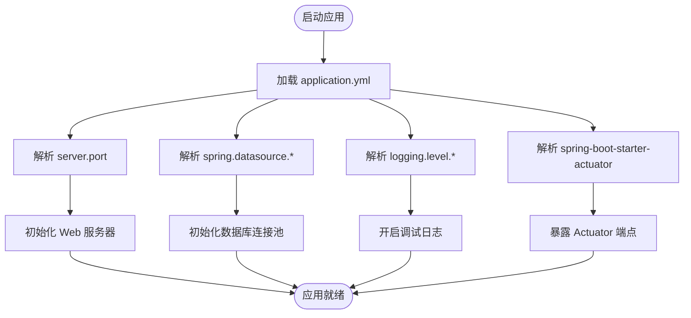
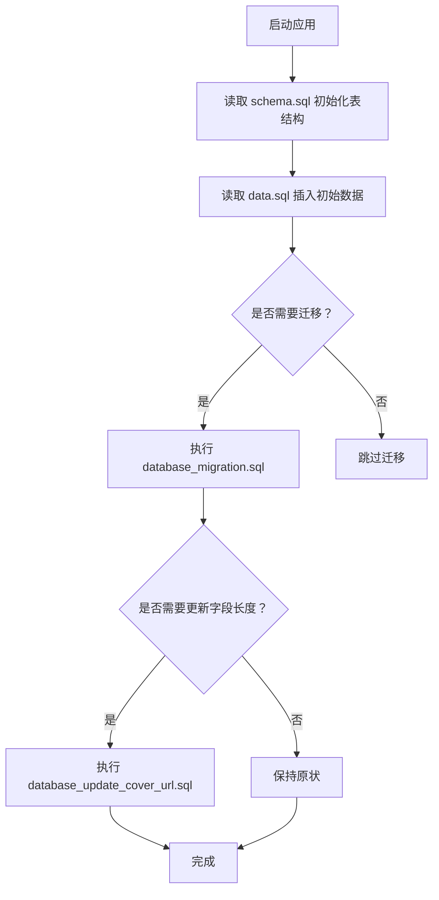
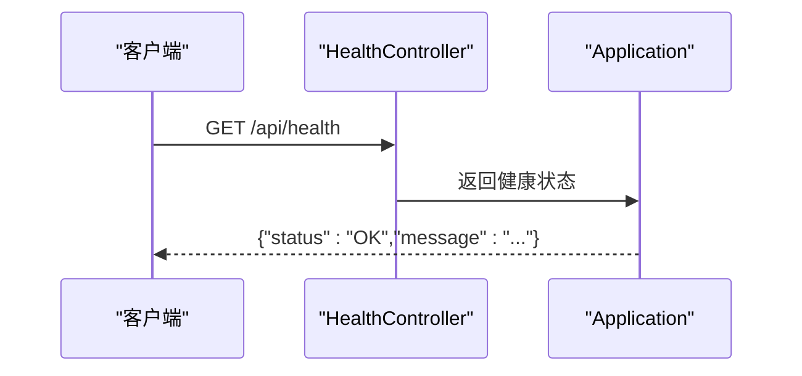
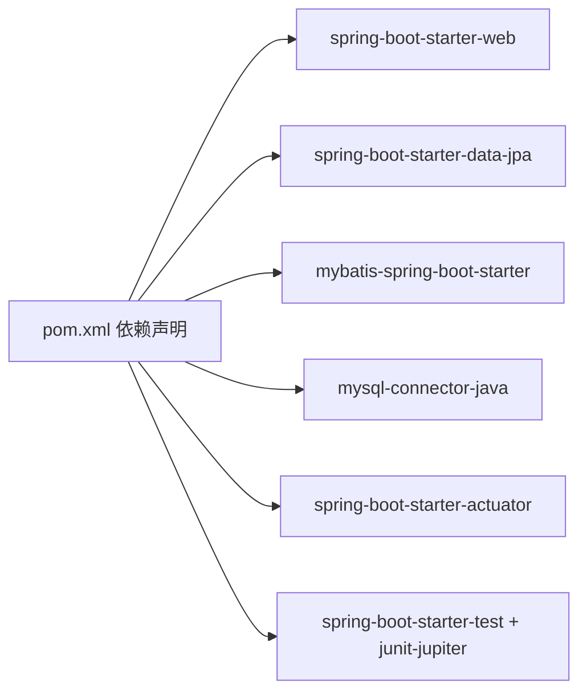

# 构建与部署

<cite>
**本文引用的文件**
- [pom.xml](file://tudianersha/pom.xml)
- [application.yml](file://tudianersha/src/main/resources/application.yml)
- [Application.java](file://tudianersha/src/main/java/com/tudianersha/Application.java)
- [README.md](file://tudianersha/README.md)
- [HealthController.java](file://tudianersha/src/main/java/com/tudianersha/controller/HealthController.java)
- [UserService.java](file://tudianersha/src/main/java/com/tudianersha/service/UserService.java)
- [UserServiceTest.java](file://tudianersha/src/test/java/com/tudianersha/UserServiceTest.java)
- [database_migration.sql](file://tudianersha/database_migration.sql)
- [database_update_cover_url.sql](file://tudianersha/database_update_cover_url.sql)
</cite>

## 目录
1. [简介](#简介)
2. [项目结构](#项目结构)
3. [核心组件](#核心组件)
4. [架构概览](#架构概览)
5. [详细组件分析](#详细组件分析)
6. [依赖分析](#依赖分析)
7. [性能考虑](#性能考虑)
8. [故障排查指南](#故障排查指南)
9. [结论](#结论)
10. [附录](#附录)

## 简介
本操作手册面向开发与运维人员，系统性说明基于 Spring Boot 的 Java 应用在本地与生产环境的构建与部署流程。内容覆盖：
- 使用 Maven 完整构建流程：清理、编译、测试、打包、安装
- 解释 pom.xml 中 spring-boot-maven-plugin 的作用及可执行 JAR 生成机制
- 多种部署方式：本地运行、Docker 容器化、云服务器（如阿里云 ECS）
- 生产环境建议：JVM 参数调优、日志轮转、监控（Actuator 端点）
- 部署检查清单：数据库、网络、文件权限等
- 常见故障排查命令与思路

## 项目结构
该工程采用标准 Maven 结构，核心目录与职责如下：
- tudianersha/src/main/java：后端源码，包含启动类、控制器、服务、仓储、实体与配置
- tudianersha/src/main/resources：资源文件，包括 application.yml、静态页面与 SQL 初始化脚本
- tudianersha/src/test：单元测试
- tudianersha/target：Maven 编译输出与打包产物
- tudianersha/pom.xml：构建与依赖管理配置

**章节来源**
- [README.md](file://tudianersha/README.md#L1-L66)

## 核心组件
- 启动类：负责引导 Spring Boot 应用启动
- 配置文件：定义服务器端口、数据库连接、日志级别、邮件与第三方 API 配置
- 控制器与服务：对外提供 REST 接口，封装业务逻辑
- 数据库初始化：通过 schema.sql 与 data.sql 初始化表结构与数据
- Actuator：内置健康检查与指标暴露能力

**章节来源**
- [Application.java](file://tudianersha/src/main/java/com/tudianersha/Application.java#L1-L12)
- [application.yml](file://tudianersha/src/main/resources/application.yml#L1-L57)
- [HealthController.java](file://tudianersha/src/main/java/com/tudianersha/controller/HealthController.java#L1-L15)
- [UserService.java](file://tudianersha/src/main/java/com/tudianersha/service/UserService.java#L1-L48)

## 架构概览
应用为典型的 Spring Boot 单体服务，采用 Web 层（Controller）- 服务层（Service）- 数据访问层（Repository/JPA/MyBatis）分层设计，通过 Actuator 提供健康检查与运行时信息。

**图表来源**
- [Application.java](file://tudianersha/src/main/java/com/tudianersha/Application.java#L1-L12)
- [application.yml](file://tudianersha/src/main/resources/application.yml#L1-L57)

## 详细组件分析

### Maven 构建流程与插件作用
- 清理：删除 target 目录，避免历史产物干扰
- 编译：将 Java 源码编译为 class 文件
- 测试：执行单元测试，验证功能正确性
- 打包：生成可执行 JAR（含依赖）
- 安装：将 JAR 安装至本地 Maven 仓库

spring-boot-maven-plugin 的关键作用：
- 将项目依赖打包进最终可执行 JAR
- 自动创建可执行入口（Main-Class），支持直接通过 java -jar 运行
- 生成正确的 MANIFEST.MF，包含启动类与依赖路径

**图表来源**
- [pom.xml](file://tudianersha/pom.xml#L171-L179)
- [Application.java](file://tudianersha/src/main/java/com/tudianersha/Application.java#L1-L12)

**章节来源**
- [pom.xml](file://tudianersha/pom.xml#L171-L179)
- [README.md](file://tudianersha/README.md#L36-L47)

### 配置文件与运行参数
- 服务器端口：默认 8010
- 数据库连接：本地 MySQL，账号密码与驱动类名已在配置中定义
- 日志级别：设置为调试级别，便于问题定位
- Actuator：启用健康检查端点，便于生产监控
- 其他：邮件、AI 与高德地图 API 配置项

**图表来源**
- [application.yml](file://tudianersha/src/main/resources/application.yml#L1-L57)

**章节来源**
- [application.yml](file://tudianersha/src/main/resources/application.yml#L1-L57)

### 数据库初始化与迁移
- schema.sql：初始化数据库表结构
- data.sql：插入基础数据
- database_migration.sql：为 ai_generated_routes 表增加封面图与结构化字段
- database_update_cover_url.sql：扩大封面图字段长度以支持多图

**图表来源**
- [database_migration.sql](file://tudianersha/database_migration.sql#L1-L15)
- [database_update_cover_url.sql](file://tudianersha/database_update_cover_url.sql#L1-L6)

**章节来源**
- [database_migration.sql](file://tudianersha/database_migration.sql#L1-L15)
- [database_update_cover_url.sql](file://tudianersha/database_update_cover_url.sql#L1-L6)

### 接口与健康检查
- 健康检查接口：/api/health 返回服务状态
- 用户相关接口：/api/users 支持增删改查
- Actuator 端点：用于健康检查与运行时指标

**图表来源**
- [HealthController.java](file://tudianersha/src/main/java/com/tudianersha/controller/HealthController.java#L1-L15)
- [Application.java](file://tudianersha/src/main/java/com/tudianersha/Application.java#L1-L12)

**章节来源**
- [HealthController.java](file://tudianersha/src/main/java/com/tudianersha/controller/HealthController.java#L1-L15)
- [UserService.java](file://tudianersha/src/main/java/com/tudianersha/service/UserService.java#L1-L48)

## 依赖分析
- Spring Boot Web：提供 Web MVC 与嵌入式服务器
- Spring Data JPA：对象关系映射与数据访问
- MyBatis：SQL 映射与查询扩展
- MySQL Connector：数据库驱动
- Actuator：健康检查与运行时监控
- 测试：JUnit 5 与 Spring Boot Test

**图表来源**
- [pom.xml](file://tudianersha/pom.xml#L25-L119)

**章节来源**
- [pom.xml](file://tudianersha/pom.xml#L25-L119)

## 性能考虑
- JVM 参数调优建议
  - 初始堆大小与最大堆大小：根据应用内存占用与并发量设定
  - GC 策略：优先选择低延迟垃圾收集器，结合业务特性评估
  - 元空间与线程栈：合理设置以避免 OOM 或栈溢出
- 日志轮转
  - 使用 logback 或 log4j2 的滚动策略，按大小或时间切分
  - 保留周期与压缩策略，平衡磁盘空间与审计需求
- 监控
  - 启用 Actuator 端点，暴露健康、指标与线程信息
  - 结合外部监控系统（如 Prometheus + Grafana）采集指标

[本节为通用指导，不直接分析具体文件]

## 故障排查指南
- 端口占用
  - Linux/macOS：使用 netstat 或 ss 查看端口占用并终止进程
  - Windows：使用 netstat -ano 定位 PID 并结束进程
- 数据库连接
  - 检查 application.yml 中的数据库 URL、用户名与密码
  - 确认 MySQL 服务已启动且网络可达
- 日志追踪
  - 查看应用日志输出，定位异常堆栈
  - 使用 Actuator 的健康与指标端点辅助诊断
- 单元测试
  - 使用 mvn test 运行测试，关注失败用例与断言信息
  - 参考 UserServiceTest 的断言模式定位问题

**章节来源**
- [application.yml](file://tudianersha/src/main/resources/application.yml#L1-L57)
- [UserServiceTest.java](file://tudianersha/src/test/java/com/tudianersha/UserServiceTest.java#L1-L55)

## 结论
通过标准化的 Maven 构建流程与 spring-boot-maven-plugin 的可执行 JAR 生成，本项目可在本地快速验证并在生产环境中稳定部署。配合 Actuator 监控、合理的 JVM 参数与日志轮转策略，可显著提升系统的可观测性与稳定性。

[本节为总结性内容，不直接分析具体文件]

## 附录

### A. Maven 构建与部署步骤
- 本地构建
  - 清理：mvn clean
  - 编译：mvn compile
  - 测试：mvn test
  - 打包：mvn package
  - 安装：mvn install
- 本地运行
  - java -jar tudianersha-system-1.0-SNAPSHOT.jar
- Docker 容器化（建议步骤）
  - 准备镜像：基于官方 OpenJDK 基础镜像
  - 复制 target 下的可执行 JAR 至镜像
  - 暴露端口（如 8010）
  - 设置启动命令为 java -jar
  - 挂载数据库与配置卷
  - 启动容器并验证健康检查
- 云服务器部署（如阿里云 ECS）
  - 在 ECS 上安装 JDK 与 MySQL
  - 上传可执行 JAR 与配置文件
  - 配置安全组放行端口
  - 使用 systemd 或 PM2 等进程管理工具守护应用
  - 配置 Nginx 反向代理与 HTTPS
  - 开启日志轮转与磁盘配额

[本节为通用指导，不直接分析具体文件]

### B. 生产环境建议配置
- JVM 参数
  - 堆大小：-Xms 与 -Xmx 根据机器内存与业务峰值设定
  - GC：-XX:+UseG1GC 或 -XX:+UseZGC（视版本与硬件）
  - 其他：-XX:MetaspaceSize、-Xss 等
- 日志轮转
  - 使用 logback/log4j2 的滚动策略
  - 保留天数与压缩策略
- 监控
  - 启用 Actuator 端点，暴露健康与指标
  - 集成外部监控系统（Prometheus/Grafana）

[本节为通用指导，不直接分析具体文件]

### C. 部署检查清单
- 数据库
  - MySQL 已安装并启动
  - 数据库存在且用户具备相应权限
  - schema.sql 与 data.sql 已执行
- 网络
  - 端口 8010（或自定义）已开放
  - 防火墙与安全组规则已配置
- 文件权限
  - 应用对日志目录与上传文件目录有写权限
- 进程管理
  - 使用 systemd/PM2 等工具守护进程
  - 启动脚本包含必要的 JVM 参数与环境变量
- 健康检查
  - 访问 /api/health 确认服务正常
  - 通过 Actuator 端点确认应用状态

[本节为通用指导，不直接分析具体文件]