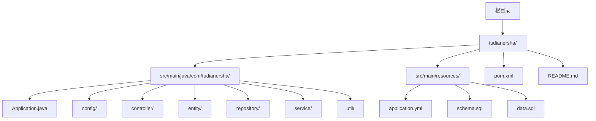
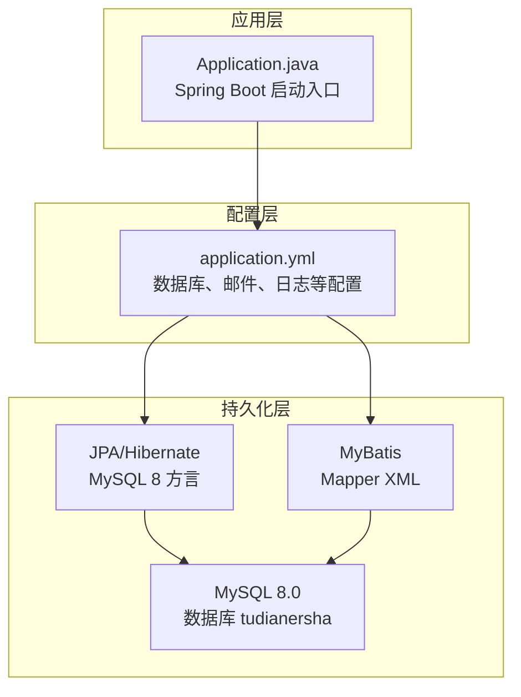
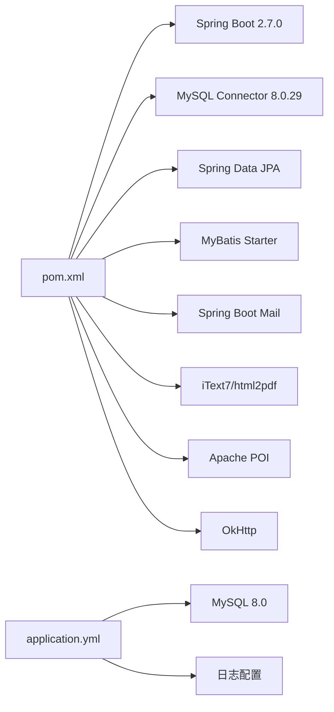

# 环境要求

<cite>
**本文引用的文件**
- [pom.xml](file://tudianersha/pom.xml)
- [application.yml](file://tudianersha/src/main/resources/application.yml)
- [README.md](file://tudianersha/README.md)
- [Application.java](file://tudianersha/src/main/java/com/tudianersha/Application.java)
- [schema.sql](file://tudianersha/src/main/resources/schema.sql)
- [database_migration.sql](file://tudianersha/database_migration.sql)
</cite>

## 目录
1. [简介](#简介)
2. [项目结构](#项目结构)
3. [核心组件](#核心组件)
4. [架构总览](#架构总览)
5. [详细组件分析](#详细组件分析)
6. [依赖分析](#依赖分析)
7. [性能考虑](#性能考虑)
8. [故障排查指南](#故障排查指南)
9. [结论](#结论)
10. [附录](#附录)

## 简介
本文件明确列出项目运行与构建所需的全部环境要求，包括：
- Java 环境：必须安装 Java 11 或以上版本，说明如何验证 java -version。
- Maven 环境：需要 Maven 3.6+，用于项目构建和依赖管理。
- 数据库环境：需要 MySQL 8.0 服务器，创建名为 tudianersha 的数据库，并通过 application.yml 配置正确的连接 URL、用户名和密码。
- 操作系统：支持 Windows、Linux 和 macOS。
- 内存要求：建议至少 2GB 可用内存。
- 开发工具推荐：IntelliJ IDEA 需安装 Lombok 插件。
- 提供环境检查清单，确保所有前置条件满足后再进行构建与部署。

## 项目结构
该仓库为基于 Spring Boot 的 Java 应用，使用 Maven 进行构建与依赖管理，数据库采用 MySQL 8.0，配置集中在 application.yml 中。

**图示来源**
- [Application.java](file://tudianersha/src/main/java/com/tudianersha/Application.java#L1-L12)
- [application.yml](file://tudianersha/src/main/resources/application.yml#L1-L57)
- [schema.sql](file://tudianersha/src/main/resources/schema.sql#L1-L123)
- [pom.xml](file://tudianersha/pom.xml#L1-L180)
- [README.md](file://tudianersha/README.md#L1-L66)

**章节来源**
- [README.md](file://tudianersha/README.md#L1-L66)
- [pom.xml](file://tudianersha/pom.xml#L1-L180)

## 核心组件
- 构建与运行框架：Spring Boot 2.7.0（由 pom.xml 中属性与依赖声明）。
- 编译目标：Java 11（由 Maven 编译属性声明）。
- 数据库驱动与版本：MySQL Connector 8.0.29，数据库方言为 MySQL 8（由 application.yml 声明）。
- 依赖管理：Maven 3.6+（由 pom.xml 与 Spring Boot Maven 插件声明）。
- 开发工具：IntelliJ IDEA 推荐，需安装 Lombok 插件（由 README.md 声明）。

**章节来源**
- [pom.xml](file://tudianersha/pom.xml#L16-L23)
- [application.yml](file://tudianersha/src/main/resources/application.yml#L1-L20)
- [README.md](file://tudianersha/README.md#L27-L35)
- [README.md](file://tudianersha/README.md#L63-L66)

## 架构总览
应用启动入口为 Spring Boot 主类，数据库连接在 application.yml 中集中配置，使用 JPA/Hibernate 与 MyBatis 共同访问 MySQL 8.0。

**图示来源**
- [Application.java](file://tudianersha/src/main/java/com/tudianersha/Application.java#L1-L12)
- [application.yml](file://tudianersha/src/main/resources/application.yml#L1-L20)
- [schema.sql](file://tudianersha/src/main/resources/schema.sql#L1-L123)

## 详细组件分析

### Java 环境要求
- 必须安装 Java 11 或以上版本。
- 验证命令：java -version。
- 依据：pom.xml 中声明了 maven.compiler.source/target 为 11；Spring Boot 2.7.0 默认要求 Java 11+。

**章节来源**
- [pom.xml](file://tudianersha/pom.xml#L16-L23)
- [README.md](file://tudianersha/README.md#L27-L35)

### Maven 环境要求
- 需要 Maven 3.6+，用于项目构建与依赖管理。
- 依据：pom.xml 使用 Spring Boot Maven 插件进行打包与运行；README.md 提供了 mvn clean install 与 mvn spring-boot:run 的构建与运行命令。

**章节来源**
- [pom.xml](file://tudianersha/pom.xml#L171-L179)
- [README.md](file://tudianersha/README.md#L43-L47)

### 数据库环境要求
- 需要 MySQL 8.0 服务器。
- 创建数据库：tudianersha。
- 连接配置：在 application.yml 中设置 JDBC URL、用户名、密码与驱动类名。
- 方言与 DDL：JPA/Hibernate 使用 MySQL 8 方言，DDL 自动更新。
- 初始化脚本：schema.sql 定义了主要业务表结构；database_migration.sql 提供后续字段扩展示例。
- 邮件配置：QQ SMTP（可选，用于邮件功能）。

**章节来源**
- [application.yml](file://tudianersha/src/main/resources/application.yml#L4-L16)
- [application.yml](file://tudianersha/src/main/resources/application.yml#L21-L38)
- [schema.sql](file://tudianersha/src/main/resources/schema.sql#L1-L123)
- [database_migration.sql](file://tudianersha/database_migration.sql#L1-L15)
- [README.md](file://tudianersha/README.md#L38-L41)

### 操作系统支持
- 支持 Windows、Linux 和 macOS。
- 依据：README.md 明确列出操作系统兼容性。

**章节来源**
- [README.md](file://tudianersha/README.md#L1-L26)

### 内存要求
- 建议至少 2GB 可用内存。
- 依据：README.md 提供的通用建议。

**章节来源**
- [README.md](file://tudianersha/README.md#L1-L26)

### 开发工具推荐
- IntelliJ IDEA 是推荐的开发工具。
- 需安装 Lombok 插件以支持注解简化。
- 依据：README.md 明确推荐与插件要求。

**章节来源**
- [README.md](file://tudianersha/README.md#L63-L66)

### 环境检查清单
请在构建与部署前完成以下检查：
- Java 版本
  - 已安装 Java 11 或以上
  - 验证命令：java -version
- Maven 版本
  - 已安装 Maven 3.6+
  - 验证命令：mvn -version
- MySQL 8.0
  - 已安装 MySQL 8.0 服务器
  - 已创建数据库 tudianersha
  - application.yml 中的 JDBC URL、用户名、密码正确
  - 驱动类名与数据库方言符合 MySQL 8
- 应用配置
  - application.yml 中的端口、JPA/Hibernate、MyBatis、日志级别等配置符合预期
  - 如启用邮件功能，确认 SMTP 配置有效
- 开发工具
  - IntelliJ IDEA 已安装并启用 Lombok 插件
- 运行与验证
  - 执行构建命令：mvn clean install
  - 启动应用：mvn spring-boot:run
  - 访问默认端口（application.yml 中 server.port）进行验证

**章节来源**
- [pom.xml](file://tudianersha/pom.xml#L16-L23)
- [application.yml](file://tudianersha/src/main/resources/application.yml#L1-L20)
- [README.md](file://tudianersha/README.md#L43-L47)

## 依赖分析
- 构建工具链
  - Maven 3.6+（pom.xml）
  - Spring Boot Maven 插件（pom.xml）
- 运行时框架
  - Spring Boot 2.7.0（pom.xml 属性）
  - Spring Web、Data JPA、Actuator（pom.xml 依赖）
- 数据库与持久化
  - MySQL Connector 8.0.29（pom.xml）
  - JPA/Hibernate（application.yml）
  - MyBatis Spring Boot Starter（pom.xml）
- 其他能力
  - 邮件（Spring Boot Mail Starter）
  - PDF 生成（iText7、html2pdf）
  - DOCX 读取（Apache POI）
  - HTTP 客户端（OkHttp）

**图示来源**
- [pom.xml](file://tudianersha/pom.xml#L25-L169)
- [application.yml](file://tudianersha/src/main/resources/application.yml#L1-L57)

**章节来源**
- [pom.xml](file://tudianersha/pom.xml#L25-L169)
- [application.yml](file://tudianersha/src/main/resources/application.yml#L1-L57)

## 性能考虑
- 建议至少 2GB 可用内存，以保证数据库与应用服务稳定运行。
- 合理配置日志级别与数据库连接池参数，避免在开发阶段产生过多 I/O 压力。
- 在生产环境中，建议开启数据库连接池与缓存策略，结合监控指标持续优化。

[本节为通用指导，无需引用具体文件]

## 故障排查指南
- 数据库连接失败
  - 检查 application.yml 中的 JDBC URL、用户名、密码是否与本地 MySQL 一致
  - 确认 MySQL 8.0 已启动且网络端口可达
  - 确认数据库 tudianersha 已存在
- Java 版本不匹配
  - 使用 java -version 确认已安装 Java 11 或以上
  - 若版本过低，请升级至 Java 11+
- Maven 构建失败
  - 使用 mvn -version 确认 Maven 3.6+
  - 清理并重新构建：mvn clean install
- 应用无法启动
  - 查看控制台输出的日志，定位端口占用或配置错误
  - 确认 application.yml 中 server.port 未被占用
- 邮件功能异常
  - 检查 QQ SMTP 配置（host、port、username、password、TLS 设置）
- 文档处理相关问题
  - 确认已引入 Apache POI 依赖（pom.xml 已包含）
  - 确认 DOCX 文件路径与权限正确

**章节来源**
- [application.yml](file://tudianersha/src/main/resources/application.yml#L4-L16)
- [application.yml](file://tudianersha/src/main/resources/application.yml#L21-L38)
- [pom.xml](file://tudianersha/pom.xml#L61-L83)
- [README.md](file://tudianersha/README.md#L43-L47)

## 结论
本项目对运行环境的要求清晰明确：Java 11+、Maven 3.6+、MySQL 8.0、以及推荐的 IntelliJ IDEA 开发工具与 Lombok 插件。按照本文提供的环境检查清单逐一核对，即可顺利完成构建与部署。

[本节为总结，无需引用具体文件]

## 附录
- 快速验证步骤
  - Java：java -version
  - Maven：mvn -version
  - MySQL：登录 MySQL 并确认 tudianersha 数据库存在
  - 构建：mvn clean install
  - 运行：mvn spring-boot:run
- 参考文件
  - pom.xml：构建与依赖声明
  - application.yml：数据库与应用配置
  - schema.sql：数据库表结构初始化
  - README.md：技术栈与开发建议

**章节来源**
- [pom.xml](file://tudianersha/pom.xml#L16-L23)
- [application.yml](file://tudianersha/src/main/resources/application.yml#L1-L20)
- [schema.sql](file://tudianersha/src/main/resources/schema.sql#L1-L123)
- [README.md](file://tudianersha/README.md#L27-L35)