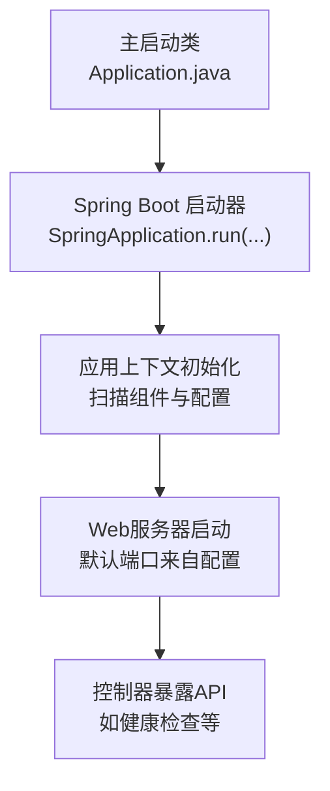
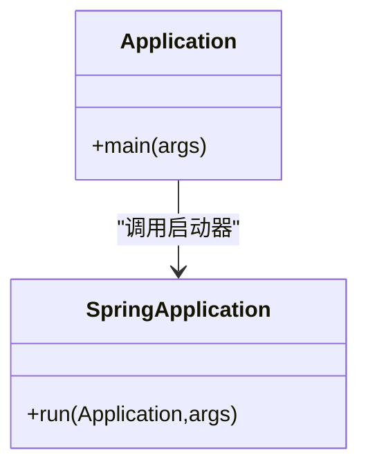
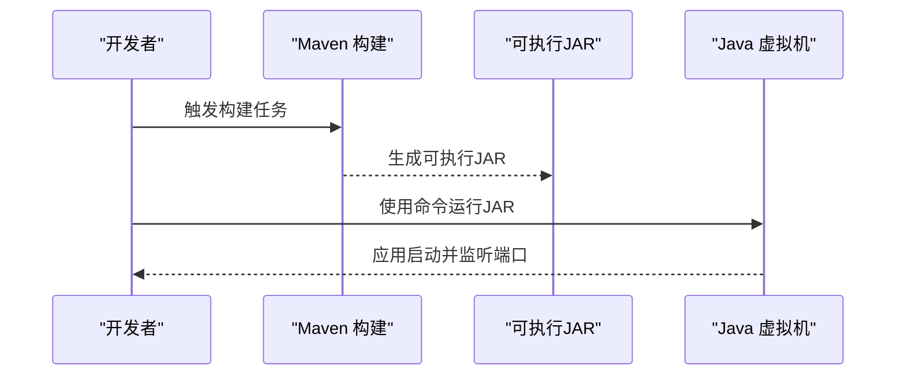
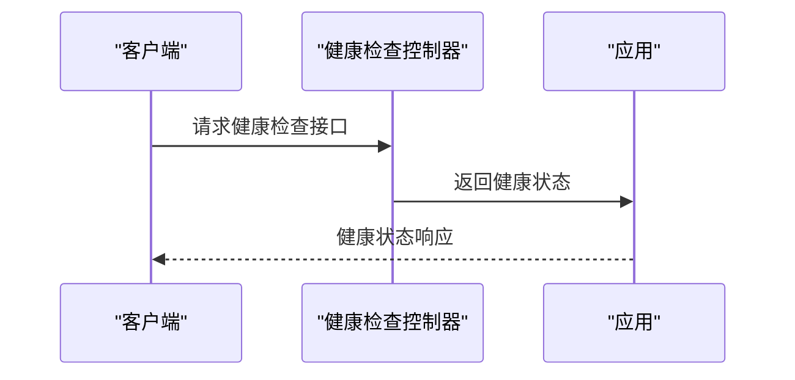
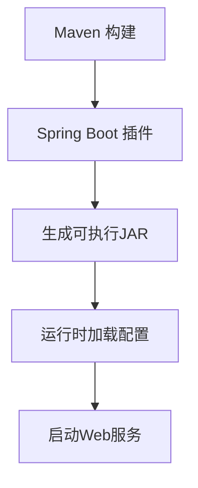

# 运行方式

<cite>
**本文引用的文件**
- [Application.java](file://tudianersha/src/main/java/com/tudianersha/Application.java)
- [pom.xml](file://tudianersha/pom.xml)
- [application.yml](file://tudianersha/src/main/resources/application.yml)
- [README.md](file://tudianersha/README.md)
- [HealthController.java](file://tudianersha/src/main/java/com/tudianersha/controller/HealthController.java)
- [MainController.java](file://tudianersha/src/main/java/com/tudianersha/controller/MainController.java)
- [DatabaseConfig.java](file://tudianersha/src/main/java/com/tudianersha/config/DatabaseConfig.java)
</cite>

## 目录
1. [简介](#简介)
2. [项目结构与入口](#项目结构与入口)
3. [核心运行方式](#核心运行方式)
4. [主启动类与注解解析](#主启动类与注解解析)
5. [不同环境运行参数示例](#不同环境运行参数示例)
6. [打包与独立运行JAR](#打包与独立运行jar)
7. [部署为系统服务与后台运行](#部署为系统服务与后台运行)
8. [开发环境与生产环境最佳实践](#开发环境与生产环境最佳实践)
9. [健康检查与验证](#健康检查与验证)
10. [依赖与构建要点](#依赖与构建要点)
11. [结论](#结论)

## 简介
本章节面向首次接触本项目的用户，概述如何以多种方式运行该Spring Boot应用：在开发环境中直接运行、通过Maven命令启动、打包后独立运行JAR、以及在生产环境下部署为系统服务或通过脚本后台运行。同时，结合项目中的主启动类、配置文件与构建脚本，给出可操作的步骤与参数示例。

## 项目结构与入口
- 应用采用标准的Spring Boot目录结构，主启动类位于主代码目录下，配置文件位于资源目录，便于通过Maven插件进行打包与运行。
- 主启动类负责引导Spring Boot应用上下文，是所有运行方式的共同入口。

图表来源
- [Application.java](file://tudianersha/src/main/java/com/tudianersha/Application.java#L1-L12)
- [HealthController.java](file://tudianersha/src/main/java/com/tudianersha/controller/HealthController.java#L1-L15)
- [application.yml](file://tudianersha/src/main/resources/application.yml#L1-L10)

章节来源
- [Application.java](file://tudianersha/src/main/java/com/tudianersha/Application.java#L1-L12)
- [README.md](file://tudianersha/README.md#L1-L25)

## 核心运行方式
- 开发环境直接运行：在IDE中直接运行主启动类，即可启动应用并访问内置Web服务。
- 使用Maven命令启动：执行Maven命令触发Spring Boot插件，自动编译并启动应用。
- 打包后独立运行JAR：先通过Maven构建生成可执行JAR，再使用Java命令直接运行。

章节来源
- [README.md](file://tudianersha/README.md#L43-L47)
- [pom.xml](file://tudianersha/pom.xml#L171-L179)

## 主启动类与注解解析
- 主启动类位于主代码目录，包含一个标准的main方法，并使用Spring Boot的启动注解，用于开启组件扫描、自动配置与Web环境集成。
- 注解的作用包括：
  - 启动Spring Boot应用上下文
  - 自动装配Web容器与相关组件
  - 扫描并注册项目中的组件（如控制器、服务、仓库等）
- main方法通过启动器将当前类作为入口，传入命令行参数，完成应用启动。

图表来源
- [Application.java](file://tudianersha/src/main/java/com/tudianersha/Application.java#L1-L12)

章节来源
- [Application.java](file://tudianersha/src/main/java/com/tudianersha/Application.java#L1-L12)

## 不同环境运行参数示例
以下参数示例基于Spring Boot通用约定，可在启动时通过命令行传递，覆盖默认配置：
- 指定配置文件位置：用于加载额外或替换默认配置文件
- 修改端口：用于避免端口冲突或按环境切换端口
- 其他常用参数：如日志级别、数据库连接参数等可通过命令行或外部配置文件统一管理

提示
- 以上参数为通用示例，具体生效取决于应用对相应属性的绑定与读取逻辑。建议优先通过配置文件集中管理，必要时在启动时追加覆盖项。

章节来源
- [application.yml](file://tudianersha/src/main/resources/application.yml#L1-L10)

## 打包与独立运行JAR
- 构建JAR：使用Maven插件生成可执行JAR，产物包含应用所需的所有依赖与资源。
- 独立运行：使用Java命令直接运行已构建的JAR文件，适用于生产环境或离线部署场景。

图表来源
- [pom.xml](file://tudianersha/pom.xml#L171-L179)

章节来源
- [pom.xml](file://tudianersha/pom.xml#L171-L179)

## 部署为系统服务与后台运行
- 将应用部署为系统服务或通过脚本后台运行，通常需要：
  - 编写启动脚本（Linux/Windows），设置JVM参数、工作目录与日志输出路径
  - 在系统服务管理器中注册服务（如systemd或Windows服务）
  - 结合进程监控工具确保服务稳定运行
- 建议在脚本中显式指定配置文件位置与端口，避免与开发环境冲突

提示
- 本节为通用实践指导，具体实现需结合目标操作系统与运维规范。

## 开发环境与生产环境最佳实践
- 开发环境（IDE中直接运行）：
  - 推荐使用IDE直接运行主启动类，便于调试与热更新
  - 使用IDE的Lombok插件以支持简化实体与DTO的注解
- 生产环境：
  - 使用Maven构建可执行JAR并独立运行
  - 通过外部配置文件集中管理敏感信息与环境差异
  - 使用系统服务或容器化方案进行托管与监控

章节来源
- [README.md](file://tudianersha/README.md#L63-L66)

## 健康检查与验证
- 应用提供了健康检查接口，可用于验证服务是否正常启动与对外提供服务。
- 可通过访问健康检查端点确认应用状态，便于自动化部署与监控集成。

图表来源
- [HealthController.java](file://tudianersha/src/main/java/com/tudianersha/controller/HealthController.java#L1-L15)

章节来源
- [HealthController.java](file://tudianersha/src/main/java/com/tudianersha/controller/HealthController.java#L1-L15)

## 依赖与构建要点
- 项目使用Maven管理依赖与构建，核心依赖包括：
  - Web启动器：提供Web容器与REST能力
  - 数据访问：JPA/Hibernate与MyBatis组合
  - 数据库驱动：MySQL Connector
  - 其他功能模块：邮件、PDF生成、AI接口等
- 构建插件：Spring Boot Maven插件用于打包与运行

图表来源
- [pom.xml](file://tudianersha/pom.xml#L1-L180)

章节来源
- [pom.xml](file://tudianersha/pom.xml#L1-L180)

## 结论
- 本项目支持多样的运行方式：IDE直接运行、Maven命令启动、打包后独立运行JAR，满足从开发到生产的全生命周期需求。
- 主启动类与配置文件是运行的关键入口；通过合理的参数与配置，可灵活适配不同环境。
- 建议在生产环境中采用系统服务或脚本后台运行，并结合健康检查与监控体系保障稳定性。